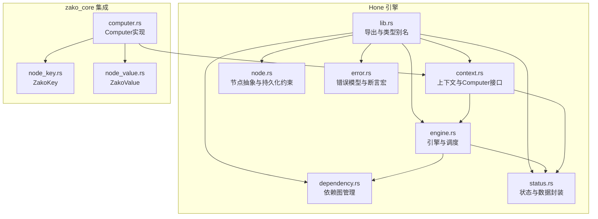
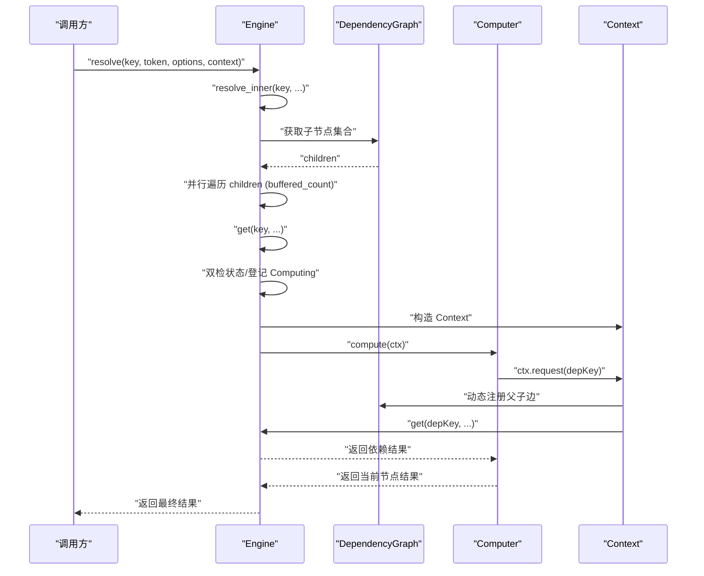
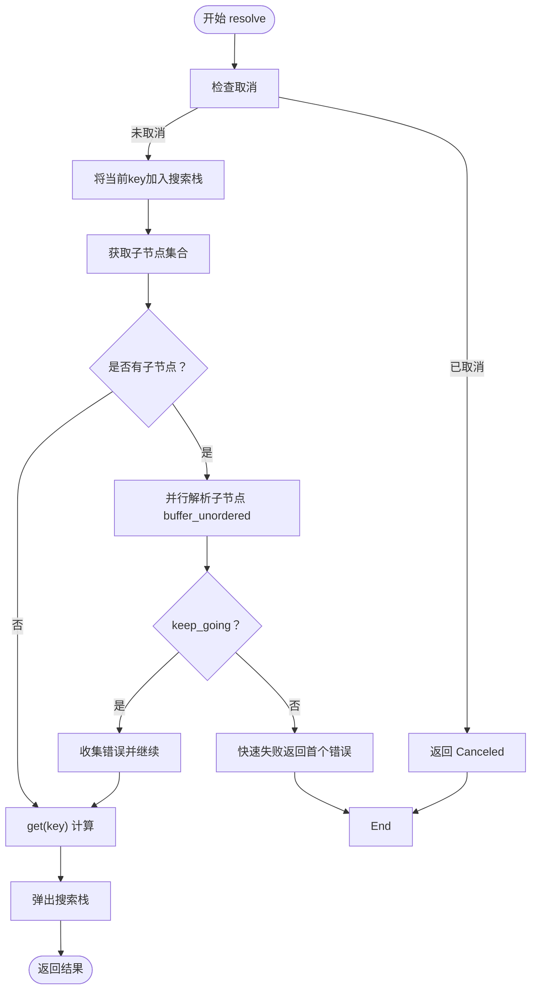
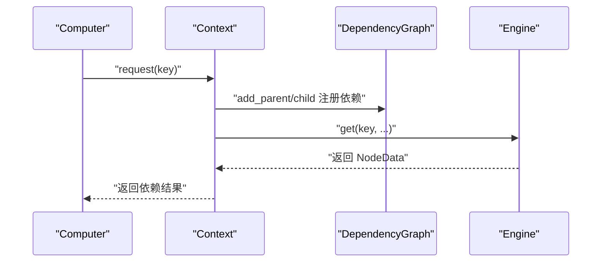
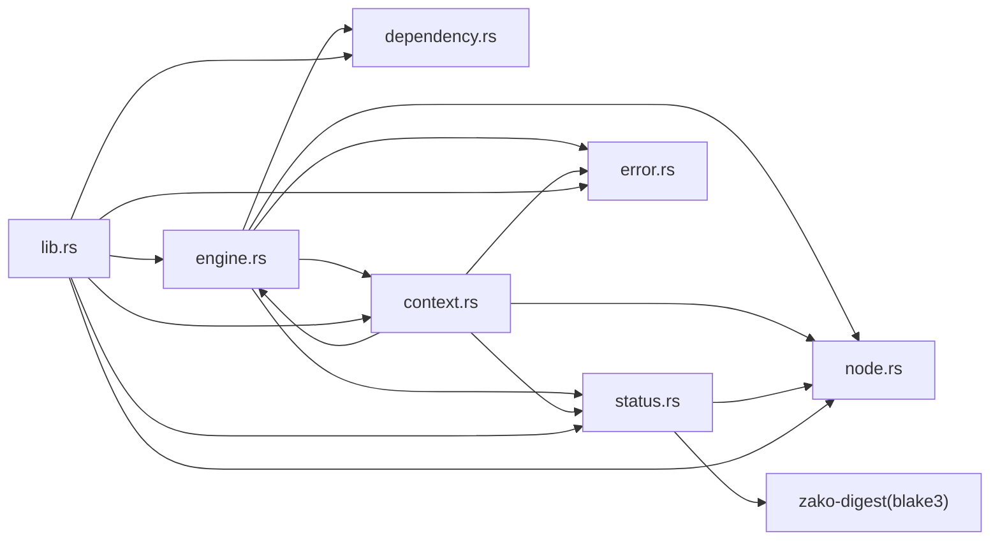

# Hone引擎

<cite>
**本文引用的文件**
- [hone/src/lib.rs](file://hone/src/lib.rs)
- [hone/src/engine.rs](file://hone/src/engine.rs)
- [hone/src/context.rs](file://hone/src/context.rs)
- [hone/src/node.rs](file://hone/src/node.rs)
- [hone/src/dependency.rs](file://hone/src/dependency.rs)
- [hone/src/status.rs](file://hone/src/status.rs)
- [hone/src/error.rs](file://hone/src/error.rs)
- [hone/tests/engine_tests.rs](file://hone/tests/engine_tests.rs)
- [hone/tests/dependency_tests.rs](file://hone/tests/dependency_tests.rs)
- [hone/tests/error_tests.rs](file://hone/tests/error_tests.rs)
- [hone/Cargo.toml](file://hone/Cargo.toml)
- [zako_core/src/computer.rs](file://zako_core/src/computer.rs)
- [zako_core/src/node/node_key.rs](file://zako_core/src/node/node_key.rs)
- [zako_core/src/node/node_value.rs](file://zako_core/src/node/node_value.rs)
- [ARCHITECTURE.md](file://ARCHITECTURE.md)
</cite>

## 目录
1. [简介](#简介)
2. [项目结构](#项目结构)
3. [核心组件](#核心组件)
4. [架构总览](#架构总览)
5. [详细组件分析](#详细组件分析)
6. [依赖关系分析](#依赖关系分析)
7. [性能考量](#性能考量)
8. [故障排查指南](#故障排查指南)
9. [结论](#结论)
10. [附录](#附录)

## 简介
Hone是一个通用的递归式计算引擎，用于将任意“键到值”的计算任务建模为有向无环图（DAG），并提供并行执行、增量计算、依赖解析与状态跟踪能力。它通过上下文抽象与Computer接口，将业务计算逻辑与调度框架解耦，并与zako_core结合，形成从脚本到内核的完整构建系统。

## 项目结构
- Hone引擎位于hone crate，核心模块包括：
  - 引擎与调度：engine.rs
  - 上下文与Computer接口：context.rs
  - 节点抽象与持久化约束：node.rs
  - 依赖图管理：dependency.rs
  - 状态与数据封装：status.rs
  - 错误模型与断言宏：error.rs
  - 导出与类型别名：lib.rs
  - 测试：engine_tests.rs、dependency_tests.rs、error_tests.rs
- zako_core通过Computer实现将ZakoKey/ZakoValue映射到具体计算，与Hone引擎协同工作。

图表来源
- [hone/src/lib.rs](file://hone/src/lib.rs#L1-L34)
- [hone/src/engine.rs](file://hone/src/engine.rs#L1-L555)
- [hone/src/context.rs](file://hone/src/context.rs#L1-L152)
- [hone/src/node.rs](file://hone/src/node.rs#L1-L61)
- [hone/src/dependency.rs](file://hone/src/dependency.rs#L1-L63)
- [hone/src/status.rs](file://hone/src/status.rs#L1-L114)
- [hone/src/error.rs](file://hone/src/error.rs#L1-L56)
- [zako_core/src/computer.rs](file://zako_core/src/computer.rs#L1-L77)
- [zako_core/src/node/node_key.rs](file://zako_core/src/node/node_key.rs#L1-L39)
- [zako_core/src/node/node_value.rs](file://zako_core/src/node/node_value.rs#L1-L22)

章节来源
- [hone/src/lib.rs](file://hone/src/lib.rs#L1-L34)
- [hone/Cargo.toml](file://hone/Cargo.toml#L1-L32)

## 核心组件
- 引擎 Engine<C,K,V>
  - 维护节点状态映射、依赖图、Computer执行器与数据库句柄
  - 提供resolve/resolve_inner并行解析、get单节点计算、pollute脏化、write持久化等能力
- 上下文 Context<C,K,V>
  - 传递调用者、当前节点、旧数据、取消令牌与共享上下文
  - 提供request/request_with_context请求依赖并动态注册依赖边
- 依赖图 DependencyGraph<K>
  - 基于并发Map维护父子集合，支持批量添加与清理
- 状态与数据 NodeStatus/NodeData
  - 表示节点的计算状态（计算中/已验证/脏/失败/不可达）
  - 封装计算结果与输入/输出哈希对
- 节点抽象 NodeKey/NodeValue/Persistent
  - 通过rkyv归档/序列化，确保可持久化与跨线程安全
- 错误模型 HoneError
  - 包含环检测、缺失依赖、断言失败、意外错误、聚合错误、数据库状态、取消、IO错误等

章节来源
- [hone/src/engine.rs](file://hone/src/engine.rs#L32-L555)
- [hone/src/context.rs](file://hone/src/context.rs#L23-L152)
- [hone/src/dependency.rs](file://hone/src/dependency.rs#L4-L63)
- [hone/src/status.rs](file://hone/src/status.rs#L15-L114)
- [hone/src/node.rs](file://hone/src/node.rs#L8-L61)
- [hone/src/error.rs](file://hone/src/error.rs#L3-L56)

## 架构总览
Hone将“计算任务”抽象为Key到Value的映射，Computer负责实现具体逻辑；Context在每次计算中注入依赖边、取消令牌与旧数据，驱动递归解析与并行执行。zako_core通过Computer实现将ZakoKey/ZakoValue映射到具体构建步骤（如文件读取、TS转译、包解析等），并与Hone引擎协作完成端到端构建。

图表来源
- [hone/src/engine.rs](file://hone/src/engine.rs#L411-L553)
- [hone/src/context.rs](file://hone/src/context.rs#L93-L150)
- [zako_core/src/computer.rs](file://zako_core/src/computer.rs#L23-L77)

## 详细组件分析

### 引擎 Engine 与递归解析
- 并发状态管理
  - 使用DashMap维护节点状态，按Key进行无锁并发访问
  - Computing状态携带Notify，实现“同key竞争计算”的等待与唤醒
- 递归解析与并行执行
  - resolve_inner对子节点使用buffer_unordered进行并行解析
  - keep_going选项控制遇到错误时是否继续收集错误或快速失败
- 增量与脏化
  - Dirty状态表示需要重新计算；pollute仅允许将节点置为Dirty
  - 清理依赖：clear_children_dependency_of在重新计算前清理子依赖，避免陈旧边影响
- 取消与错误传播
  - 在关键路径检查取消令牌，及时返回Canceled错误
  - 支持聚合错误（多个子任务失败时收集）

图表来源
- [hone/src/engine.rs](file://hone/src/engine.rs#L411-L553)

章节来源
- [hone/src/engine.rs](file://hone/src/engine.rs#L55-L555)

### 上下文 Context 与依赖解析
- 依赖注册
  - request/request_with_context在获取结果前动态注册父子边，确保依赖图实时准确
  - 支持在同一调用栈内检测环（基于stack.contains）
- 数据与旧值
  - 通过old_data传递上一次计算结果，便于增量计算与脏化判断
- 取消与上下文
  - 携带取消令牌与共享上下文，贯穿整个计算生命周期

图表来源
- [hone/src/context.rs](file://hone/src/context.rs#L93-L150)
- [hone/src/dependency.rs](file://hone/src/dependency.rs#L18-L28)

章节来源
- [hone/src/context.rs](file://hone/src/context.rs#L23-L152)

### 依赖图 DependencyGraph
- 并发安全
  - 基于DashMap与DashSet，父子集合独立维护，支持高并发读写
- 操作语义
  - add_parent/add_child同时维护双向边
  - clear_children_dependency_of在重新计算前清理子依赖，避免残留边导致错误复用
- 查询接口
  - get_parents/get_children返回Entry，便于条件插入/删除

章节来源
- [hone/src/dependency.rs](file://hone/src/dependency.rs#L4-L63)

### 状态与数据 NodeStatus/NodeData
- 状态机
  - Computing：等待通知唤醒
  - Verified/Dirty：缓存可用，Dirty需重新计算
  - Failed：记录错误，阻止重复计算
  - Unreachable：不可达占位
- 数据封装
  - NodeData包含Arc<V>与HashPair（输入/输出哈希），支持Clone与Deref
- 状态码与持久化
  - NodeStatusCode用于数据库键编码，便于后续持久化

章节来源
- [hone/src/status.rs](file://hone/src/status.rs#L15-L114)

### 节点抽象与持久化
- NodeKey/NodeValue
  - 通过rkyv Archive/SafeNodeKey/SafeNodeValue确保可归档、可序列化、可校验
- Persistent
  - 限定序列化策略与分配器，满足高性能与零拷贝需求

章节来源
- [hone/src/node.rs](file://hone/src/node.rs#L8-L61)

### 错误模型与断言
- HoneError
  - 覆盖环检测、缺失依赖、断言失败、意外错误、聚合错误、数据库状态、取消、IO错误等
- 断言宏
  - assert!/debug_assert!提供条件断言，失败时返回AssertionFailed错误

章节来源
- [hone/src/error.rs](file://hone/src/error.rs#L3-L56)

### 与zako_core的集成
- Computer实现
  - zako_core::Computer根据ZakoKey分派到具体计算函数（如文件读取、TS转译、包解析等）
  - 返回值包装为NodeData<BuildContext, ZakoValue>，由Hone统一管理状态与缓存
- 节点类型
  - ZakoKey/ZakoValue分别实现NodeKey/NodeValue，确保与Hone的键值抽象一致

章节来源
- [zako_core/src/computer.rs](file://zako_core/src/computer.rs#L16-L77)
- [zako_core/src/node/node_key.rs](file://zako_core/src/node/node_key.rs#L26-L39)
- [zako_core/src/node/node_value.rs](file://zako_core/src/node/node_value.rs#L10-L22)
- [ARCHITECTURE.md](file://ARCHITECTURE.md#L30-L56)

## 依赖关系分析
- 内部依赖
  - engine依赖dependency、status、context、node与error
  - context依赖engine、status、node与error
  - status依赖node与digest
- 外部依赖
  - 并发：dashmap、ahash
  - 序列化：rkyv、bitcode（注释中使用）、hex
  - 异步：tokio、futures
  - 数据库：redb（注释中使用）
  - 取消：zako-cancel
  - 日志：tracing
  - 哈希：blake3、zako-digest

图表来源
- [hone/src/lib.rs](file://hone/src/lib.rs#L1-L34)
- [hone/src/engine.rs](file://hone/src/engine.rs#L1-L14)
- [hone/src/context.rs](file://hone/src/context.rs#L1-L12)
- [hone/src/status.rs](file://hone/src/status.rs#L1-L7)
- [hone/Cargo.toml](file://hone/Cargo.toml#L12-L29)

章节来源
- [hone/Cargo.toml](file://hone/Cargo.toml#L12-L29)

## 性能考量
- 并发与锁粒度
  - 使用DashMap/DashSet降低锁竞争；DependencyGraph的add_parent/add_child建议未来合并批量操作以减少锁次数
- 并行度控制
  - ResolveOptions.buffered_count控制buffer_unordered的并发度，建议根据CPU与I/O特性调整
- 增量计算
  - 通过Dirty状态与clear_children_dependency_of避免陈旧依赖影响；建议在Computer中利用old_data进行增量判断
- 序列化与持久化
  - rkyv提供零拷贝归档；数据库持久化为注释功能，待实现负缓存与状态码优化
- 取消与错误
  - 在循环与流处理中频繁检查取消令牌，避免无效计算；keep_going可平衡吞吐与可观测性

章节来源
- [hone/src/engine.rs](file://hone/src/engine.rs#L411-L553)
- [hone/src/dependency.rs](file://hone/src/dependency.rs#L18-L53)
- [hone/src/status.rs](file://hone/src/status.rs#L93-L101)

## 故障排查指南
- 环检测
  - 当搜索栈包含当前key时抛出CycleDetected；检查Computer中request调用是否形成闭环
- 缺失依赖
  - MissingDependency错误提示；确认依赖key是否正确注册或是否存在拼写错误
- 断言失败
  - assert!/debug_assert!触发AssertionFailed；检查前置条件与输入合法性
- 取消
  - Canceled错误携带CancelReason；确认取消源与触发时机
- 快速失败与聚合
  - keep_going=false时Fail-Fast；true时收集多个错误，便于一次性修复

章节来源
- [hone/src/error.rs](file://hone/src/error.rs#L3-L30)
- [hone/src/engine.rs](file://hone/src/engine.rs#L488-L516)
- [hone/tests/engine_tests.rs](file://hone/tests/engine_tests.rs#L82-L101)

## 结论
Hone通过清晰的上下文与Computer接口、强健的依赖图与状态机、以及可配置的并行解析策略，提供了可扩展、可并行、可增量的递归式计算框架。与zako_core的集成进一步证明了其在复杂构建场景下的适用性。建议在生产环境中关注锁粒度优化、并发度调优与错误聚合策略，以获得更佳的吞吐与稳定性。

## 附录
- 使用示例与最佳实践
  - 基础解析：参考engine_tests中的简单加法树形依赖
  - 环检测：参考engine_tests中的自依赖用例
  - 取消：参考engine_tests中的慢任务取消用例
  - 依赖图：参考dependency_tests中的基本增删与清理
  - 断言：参考error_tests中的断言宏行为

章节来源
- [hone/tests/engine_tests.rs](file://hone/tests/engine_tests.rs#L56-L156)
- [hone/tests/dependency_tests.rs](file://hone/tests/dependency_tests.rs#L9-L62)
- [hone/tests/error_tests.rs](file://hone/tests/error_tests.rs#L4-L21)