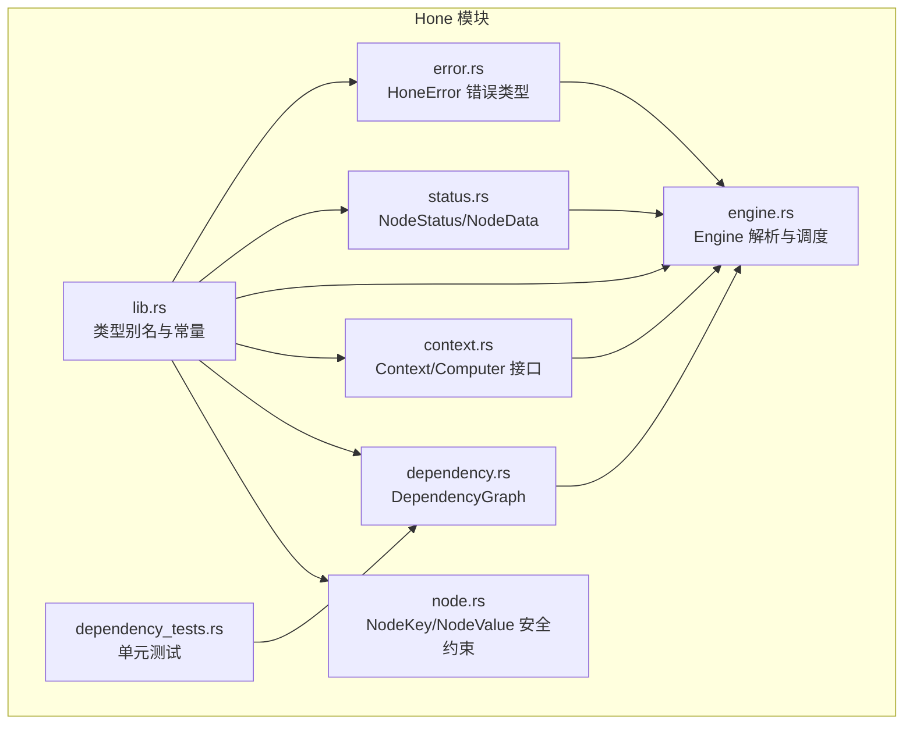
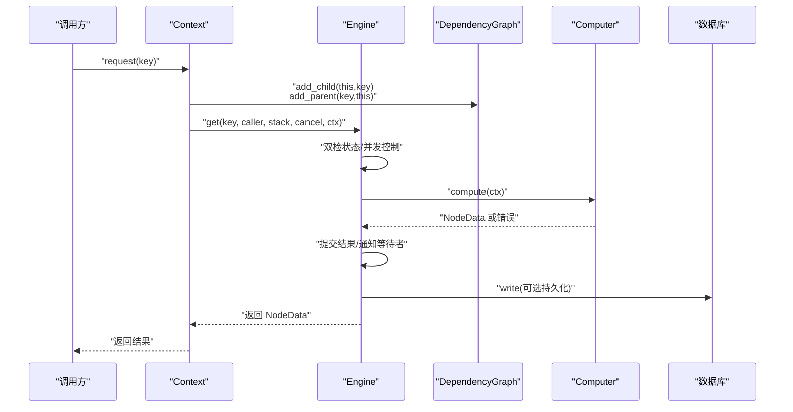
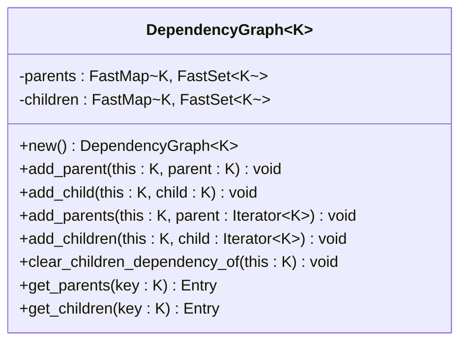
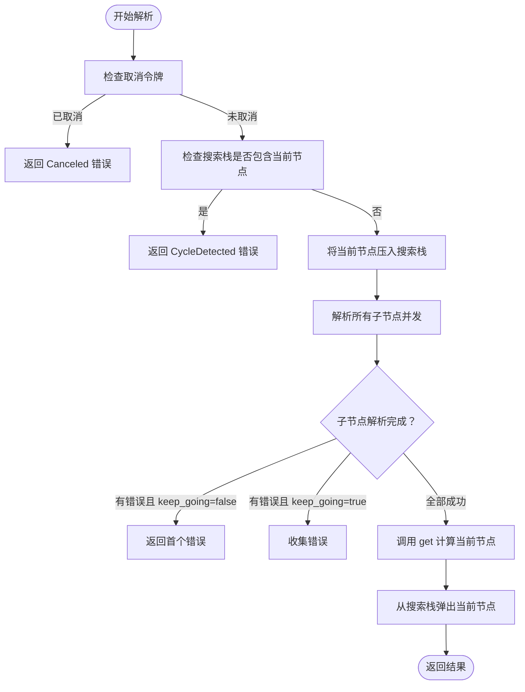
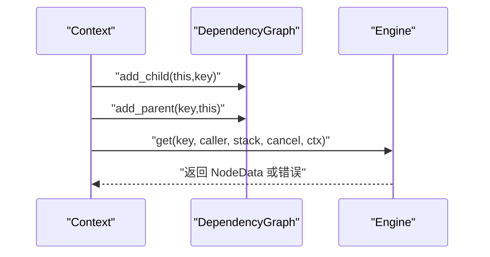
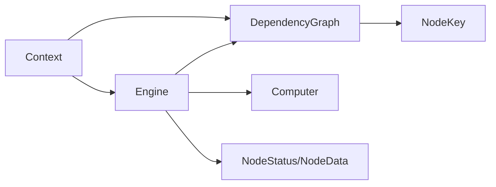

# 依赖图管理系统

<cite>
**本文引用的文件**
- [hone/src/dependency.rs](file://hone/src/dependency.rs)
- [hone/src/node.rs](file://hone/src/node.rs)
- [hone/src/engine.rs](file://hone/src/engine.rs)
- [hone/src/context.rs](file://hone/src/context.rs)
- [hone/src/lib.rs](file://hone/src/lib.rs)
- [hone/src/error.rs](file://hone/src/error.rs)
- [hone/src/status.rs](file://hone/src/status.rs)
- [hone/tests/dependency_tests.rs](file://hone/tests/dependency_tests.rs)
- [hone/Cargo.toml](file://hone/Cargo.toml)
</cite>

## 目录
1. [简介](#简介)
2. [项目结构](#项目结构)
3. [核心组件](#核心组件)
4. [架构总览](#架构总览)
5. [详细组件分析](#详细组件分析)
6. [依赖关系分析](#依赖关系分析)
7. [性能考量](#性能考量)
8. [故障排除指南](#故障排除指南)
9. [结论](#结论)
10. [附录](#附录)

## 简介
本技术文档围绕 Hone 引擎的依赖图管理系统展开，系统性阐述依赖图的数据结构设计、节点关系维护与图遍历算法，深入解析 DependencyGraph 的实现原理（父子节点的添加、删除与查询）、依赖解析流程、循环依赖检测机制以及拓扑排序思想的应用。文档还包含 clear_children_dependency_of 方法的作用与依赖图更新策略说明，并提供性能优化建议、内存使用情况分析与并发访问控制策略，最后给出故障排除指南与常见问题解决方案。

## 项目结构
Hone 作为独立模块位于 hone/ 目录，核心文件包括：
- 依赖图：dependency.rs
- 节点键值与安全约束：node.rs
- 引擎与解析流程：engine.rs
- 上下文与请求接口：context.rs
- 类型别名与常量：lib.rs
- 错误类型与断言宏：error.rs
- 节点状态与数据结构：status.rs
- 单元测试：tests/dependency_tests.rs
- 依赖清单：Cargo.toml

图表来源
- [hone/src/lib.rs](file://hone/src/lib.rs#L1-L34)
- [hone/src/node.rs](file://hone/src/node.rs#L1-L61)
- [hone/src/dependency.rs](file://hone/src/dependency.rs#L1-L63)
- [hone/src/context.rs](file://hone/src/context.rs#L1-L152)
- [hone/src/engine.rs](file://hone/src/engine.rs#L1-L555)
- [hone/src/status.rs](file://hone/src/status.rs#L1-L114)
- [hone/src/error.rs](file://hone/src/error.rs#L1-L56)
- [hone/tests/dependency_tests.rs](file://hone/tests/dependency_tests.rs#L1-L62)

章节来源
- [hone/src/lib.rs](file://hone/src/lib.rs#L1-L34)
- [hone/Cargo.toml](file://hone/Cargo.toml#L1-L32)

## 核心组件
- 依赖图 DependencyGraph<K>：以哈希表映射节点到邻接集合，维护父子关系，支持添加边、批量添加、清空子依赖等操作。
- 引擎 Engine<C,K,V>：持有状态映射、计算机接口、依赖图与数据库句柄；负责节点解析、并发调度、循环依赖检测与失败聚合。
- 上下文 Context<C,K,V>：封装引擎、调用者、当前节点、调用栈、旧数据与取消令牌；提供动态注册依赖与请求子节点的能力。
- 节点键值与安全约束：通过 NodeKey/NodeValue trait 限定键值类型的安全性与可序列化性。
- 节点状态与数据：NodeStatus 表示节点生命周期状态，NodeData 包含输出/输入哈希与值。
- 错误类型：HoneError 统一承载循环依赖、缺失依赖、取消、IO 等错误。

章节来源
- [hone/src/dependency.rs](file://hone/src/dependency.rs#L1-L63)
- [hone/src/engine.rs](file://hone/src/engine.rs#L32-L555)
- [hone/src/context.rs](file://hone/src/context.rs#L23-L152)
- [hone/src/node.rs](file://hone/src/node.rs#L8-L61)
- [hone/src/status.rs](file://hone/src/status.rs#L15-L114)
- [hone/src/error.rs](file://hone/src/error.rs#L3-L30)

## 架构总览
Hone 的依赖图管理贯穿“请求—解析—计算—提交”的闭环。请求方通过 Context 动态注册父子依赖，Engine 在解析阶段进行循环依赖检测与并发调度，最终将结果写回状态映射并通知等待者。

图表来源
- [hone/src/context.rs](file://hone/src/context.rs#L93-L150)
- [hone/src/engine.rs](file://hone/src/engine.rs#L306-L409)
- [hone/src/engine.rs](file://hone/src/engine.rs#L411-L553)
- [hone/src/dependency.rs](file://hone/src/dependency.rs#L18-L28)

## 详细组件分析

### 依赖图 DependencyGraph<K>
- 数据结构
  - parents: K -> FastSet<K>，记录每个节点的父节点集合
  - children: K -> FastSet<K>，记录每个节点的子节点集合
  - FastMap/FastSet 均基于 dashmap::DashMap/DashSet，提供高并发读写能力
- 关键操作
  - 添加父子边：add_parent/add_child 同时更新双向映射
  - 批量添加：add_parents/add_children 逐个委托
  - 清空子依赖：clear_children_dependency_of 删除某节点的所有子边，并同步清理对应子节点的父集合
  - 查询：get_parents/get_children 返回 Entry，便于惰性插入或读取
- 复杂度
  - 插入/删除/查询均摊 O(1)，集合迭代线性于邻居数量
- 并发特性
  - 由于使用 DashMap/DashSet，多线程下无需显式加锁即可安全读写
  - 代码注释中已标注批量操作存在“锁定一次”的优化建议，提示未来可减少锁竞争

图表来源
- [hone/src/dependency.rs](file://hone/src/dependency.rs#L4-L62)

章节来源
- [hone/src/dependency.rs](file://hone/src/dependency.rs#L1-L63)
- [hone/src/lib.rs](file://hone/src/lib.rs#L18-L23)

### 引擎 Engine<C,K,V>
- 结构
  - status_map: DashMap<K, NodeStatus<C,V>>，保存节点状态与通知
  - computer: Arc<dyn Computer<C,K,V>>，执行具体计算逻辑
  - dependency_graph: Arc<DependencyGraph<K>>，共享依赖图
  - _database: Arc<redb::Database>，预留持久化
- 解析流程
  - resolve/resolve_inner：递归解析子节点，使用 buffer_unordered 控制并发度，keep_going 控制失败策略
  - 循环依赖检测：通过 im::Vector<K> 作为搜索栈，若重复出现则抛出 HoneError::CycleDetected
  - get：双检状态，避免重复计算；对 Dirty 状态会先清空子依赖再重新计算
- 并发与缓存
  - 使用 tokio::sync::Notify 实现状态变更通知
  - 使用 DashMap 保证并发安全
  - 注释中提及未来实现缓存系统与负缓存

图表来源
- [hone/src/engine.rs](file://hone/src/engine.rs#L411-L553)
- [hone/src/engine.rs](file://hone/src/engine.rs#L427-L433)
- [hone/src/engine.rs](file://hone/src/engine.rs#L438-L519)

章节来源
- [hone/src/engine.rs](file://hone/src/engine.rs#L32-L555)
- [hone/src/error.rs](file://hone/src/error.rs#L3-L30)

### 上下文 Context<C,K,V>
- 职责
  - request/request_with_context：动态注册父子依赖边，然后发起 get 请求
  - 在注册阶段对调用栈进行循环依赖检测
- 并发注意
  - 注释中明确指出“优化这里的锁粒度”和“在并发场景下是否正确”的疑问，提示该区域存在改进空间

图表来源
- [hone/src/context.rs](file://hone/src/context.rs#L93-L150)
- [hone/src/dependency.rs](file://hone/src/dependency.rs#L18-L28)

章节来源
- [hone/src/context.rs](file://hone/src/context.rs#L23-L152)

### 节点键值与安全约束
- NodeKey/NodeValue：通过 trait 约束键值类型必须满足 Clone、Eq、Hash、Send、Sync、Persistent 等条件，确保在并发与序列化场景下的安全性
- SafeNodeKey/SafeNodeValue：在 Archived 类型满足 rkyv 校验约束时自动实现，进一步保障反序列化安全

章节来源
- [hone/src/node.rs](file://hone/src/node.rs#L8-L61)

### 节点状态与数据
- NodeStatus：表示节点生命周期状态（Computing/Verified/Dirty/Failed/Unreachable），其中 Computing 携带 Notify 用于并发通知
- NodeData：封装值与哈希对，提供访问与克隆能力
- 状态码：NodeStatusCode 用于持久化时的状态编码

章节来源
- [hone/src/status.rs](file://hone/src/status.rs#L15-L114)

### 错误类型
- HoneError：统一错误模型，包含循环依赖、缺失依赖、取消、IO 等错误类型
- 断言宏：assert!/debug_assert! 提供条件断言与错误包装

章节来源
- [hone/src/error.rs](file://hone/src/error.rs#L3-L56)

## 依赖关系分析
- 模块耦合
  - Engine 依赖 DependencyGraph、Context、Computer、NodeStatus/NodeData、HoneError
  - Context 依赖 Engine 与 Computer 接口，同时向 DependencyGraph 注册依赖
  - DependencyGraph 仅依赖 FastMap/FastSet 与 NodeKey
- 外部依赖
  - dashmap、futures、tokio、im、redb、rkyv、ahash 等
- 潜在循环依赖
  - 代码中未发现直接循环导入；Engine 与 Context 通过接口解耦，避免强耦合

图表来源
- [hone/src/engine.rs](file://hone/src/engine.rs#L1-L14)
- [hone/src/context.rs](file://hone/src/context.rs#L8-L12)
- [hone/src/dependency.rs](file://hone/src/dependency.rs#L2-L8)

章节来源
- [hone/src/engine.rs](file://hone/src/engine.rs#L1-L14)
- [hone/src/context.rs](file://hone/src/context.rs#L8-L12)
- [hone/src/dependency.rs](file://hone/src/dependency.rs#L2-L8)
- [hone/Cargo.toml](file://hone/Cargo.toml#L12-L28)

## 性能考量
- 并发与锁粒度
  - 使用 DashMap/DashSet 提供细粒度并发控制，避免全局锁
  - DependencyGraph 的批量添加存在“锁定一次”的优化建议，可考虑在上层批量注册时减少多次 Entry 获取的开销
- 并发解析
  - resolve_inner 使用 buffer_unordered 控制并发度，keep_going 决定失败聚合策略
  - Computing 状态使用 Notify 实现等待者唤醒，避免忙轮询
- 内存使用
  - FastMap/FastSet 基于 ahash，哈希表扩容与负载因子控制良好
  - NodeData 使用 Arc<V> 共享值，降低复制成本
- 序列化与持久化
  - rkyv 用于零拷贝序列化，减少 GC 压力
  - redb 用于节点状态持久化（预留功能）
- 缓存与负缓存
  - 注释中提及未来实现缓存系统与负缓存，有助于减少重复计算与 IO

章节来源
- [hone/src/lib.rs](file://hone/src/lib.rs#L18-L23)
- [hone/src/engine.rs](file://hone/src/engine.rs#L411-L553)
- [hone/src/status.rs](file://hone/src/status.rs#L15-L52)
- [hone/src/dependency.rs](file://hone/src/dependency.rs#L30-L42)

## 故障排除指南
- 循环依赖
  - 现象：Resolve 过程中抛出 HoneError::CycleDetected
  - 排查：检查调用栈与依赖注册，确认是否存在间接循环引用
  - 参考路径：[hone/src/engine.rs](file://hone/src/engine.rs#L427-L433)、[hone/src/context.rs](file://hone/src/context.rs#L98-L109)
- 节点不可达
  - 现象：状态为 Unreachable，返回 HoneError::UnexpectedError
  - 排查：确认节点是否被污染或状态异常
  - 参考路径：[hone/src/engine.rs](file://hone/src/engine.rs#L354-L361)
- 取消操作
  - 现象：返回 HoneError::Canceled
  - 排查：检查取消令牌是否提前触发
  - 参考路径：[hone/src/engine.rs](file://hone/src/engine.rs#L420-L425)、[hone/src/context.rs](file://hone/src/context.rs#L124-L129)
- 脏节点重新计算
  - 现象：Dirty 状态触发 clear_children_dependency_of，随后重新计算
  - 排查：确认污染策略与依赖清理是否符合预期
  - 参考路径：[hone/src/engine.rs](file://hone/src/engine.rs#L344-L370)
- 依赖清理不一致
  - 现象：clear_children_dependency_of 后仍有父集合残留
  - 排查：确认调用时机与并发注册顺序
  - 参考路径：[hone/src/dependency.rs](file://hone/src/dependency.rs#L44-L53)

章节来源
- [hone/src/error.rs](file://hone/src/error.rs#L3-L30)
- [hone/src/engine.rs](file://hone/src/engine.rs#L420-L433)
- [hone/src/context.rs](file://hone/src/context.rs#L98-L129)
- [hone/src/dependency.rs](file://hone/src/dependency.rs#L44-L53)

## 结论
Hone 的依赖图管理系统以轻量级并发容器为基础，结合上下文动态注册与引擎解析流程，实现了高效、可扩展的依赖管理与图遍历。通过 clear_children_dependency_of 与 get_children 的配合，系统能够精确地维护父子关系并在脏节点场景下进行局部重算。循环依赖检测与并发调度策略共同保证了系统的稳定性与性能。未来可在批量注册锁优化、缓存与负缓存实现等方面进一步提升吞吐与资源利用率。

## 附录

### 代码示例路径
- 建立父子依赖关系
  - [hone/src/context.rs](file://hone/src/context.rs#L114-L123)
- 查询父子集合
  - [hone/src/dependency.rs](file://hone/src/dependency.rs#L55-L61)
- 清空子依赖并同步清理父集合
  - [hone/src/dependency.rs](file://hone/src/dependency.rs#L44-L53)
- 引擎解析与并发控制
  - [hone/src/engine.rs](file://hone/src/engine.rs#L411-L553)
- 单元测试验证
  - [hone/tests/dependency_tests.rs](file://hone/tests/dependency_tests.rs#L9-L61)

### 拓扑排序思想说明
- 本系统未实现显式的拓扑排序算法，但通过“搜索栈”与“并发流”实现类似效果：按依赖深度优先解析，遇到环即终止。该策略在保证正确性的同时，避免了额外的预处理开销。