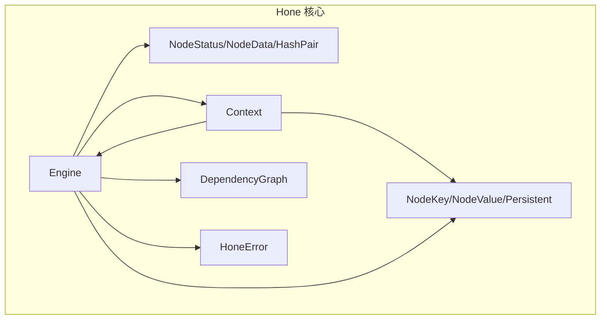
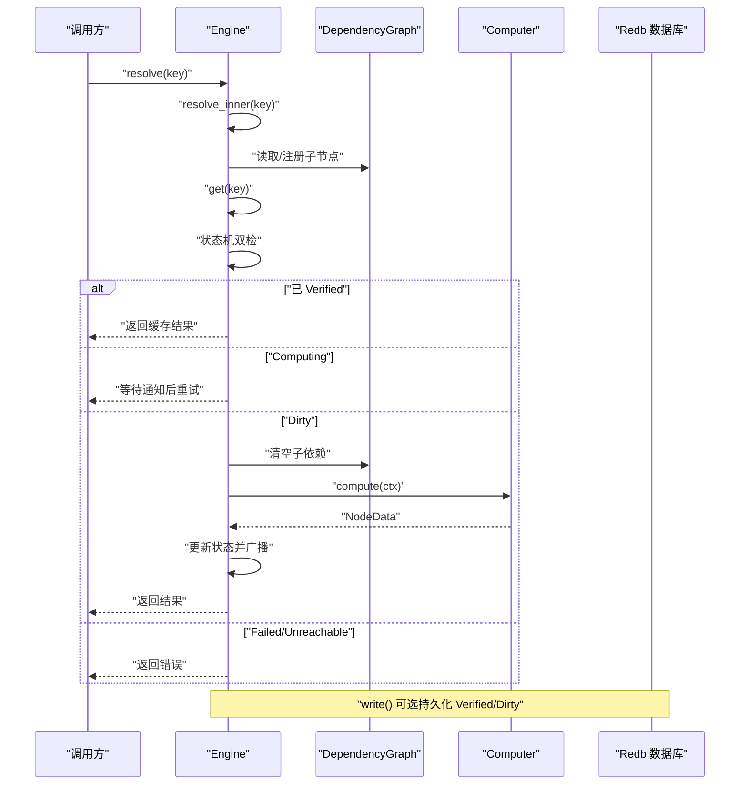
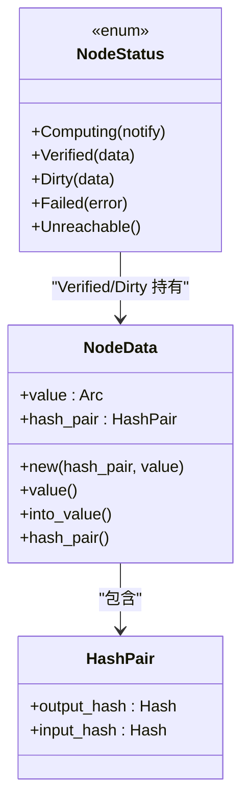
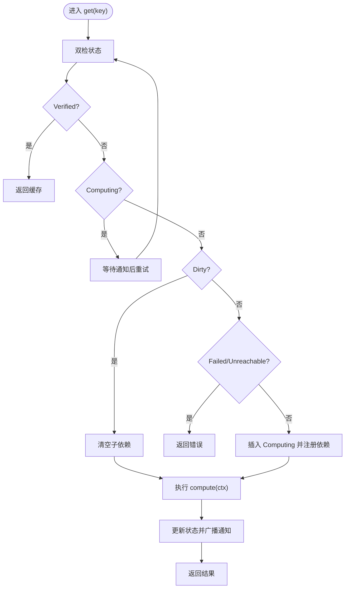
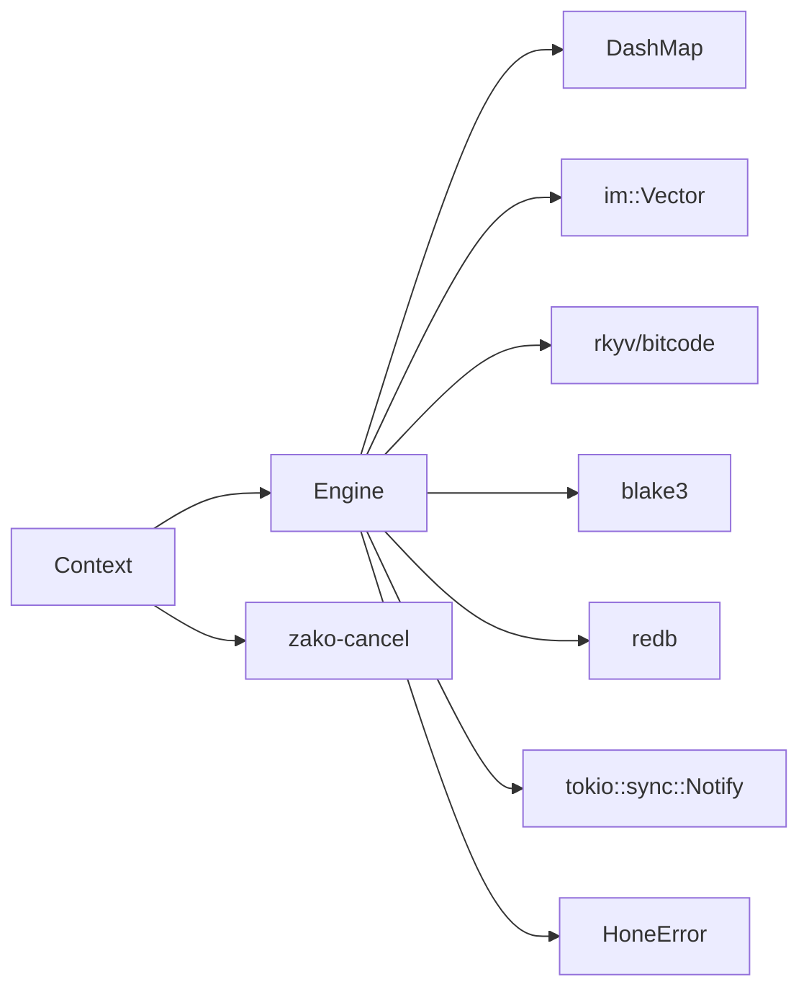

# 增量计算与缓存

<cite>
**本文引用的文件**
- [hone/src/lib.rs](file://hone/src/lib.rs)
- [hone/src/engine.rs](file://hone/src/engine.rs)
- [hone/src/status.rs](file://hone/src/status.rs)
- [hone/src/context.rs](file://hone/src/context.rs)
- [hone/src/dependency.rs](file://hone/src/dependency.rs)
- [hone/src/error.rs](file://hone/src/error.rs)
- [hone/src/node.rs](file://hone/src/node.rs)
- [hone/tests/engine_tests.rs](file://hone/tests/engine_tests.rs)
- [hone/Cargo.toml](file://hone/Cargo.toml)
</cite>

## 目录
1. [简介](#简介)
2. [项目结构](#项目结构)
3. [核心组件](#核心组件)
4. [架构总览](#架构总览)
5. [详细组件分析](#详细组件分析)
6. [依赖关系分析](#依赖关系分析)
7. [性能考量](#性能考量)
8. [故障排查指南](#故障排查指南)
9. [结论](#结论)
10. [附录](#附录)

## 简介
本技术文档围绕 Hone 引擎的“增量计算与缓存”机制展开，系统性阐述以下主题：
- 增量计算原理：通过状态机与依赖图驱动的按需重算与并发去重。
- 脏节点检测与缓存失效策略：基于状态映射与 pollute/invalidate 机制。
- NodeStatus 的状态模型与转换条件：Verified、Computing、Dirty、Failed、Unreachable。
- pollute 方法的使用场景与 invalidate 工作原理。
- 并发安全的状态映射、持久化策略与数据库交互。
- 实际使用示例、性能优化技巧、内存管理与调试方法。

## 项目结构
Hone 模块位于 hone 子目录，采用模块化设计，关键模块如下：
- engine：引擎主控，负责状态管理、并发控制、依赖解析与持久化。
- status：状态与数据结构定义，包括 NodeStatus、NodeData、HashPair。
- context：计算上下文，封装请求依赖、取消令牌与旧数据。
- dependency：依赖图，维护父子节点关系与动态注册。
- node：节点键值接口与持久化约束。
- error：错误类型与断言宏。
- tests：单元测试与示例用法。

图表来源
- [hone/src/engine.rs](file://hone/src/engine.rs#L32-L38)
- [hone/src/status.rs](file://hone/src/status.rs#L62-L113)
- [hone/src/context.rs](file://hone/src/context.rs#L24-L32)
- [hone/src/dependency.rs](file://hone/src/dependency.rs#L5-L8)
- [hone/src/node.rs](file://hone/src/node.rs#L8-L60)
- [hone/src/error.rs](file://hone/src/error.rs#L4-L30)

章节来源
- [hone/src/lib.rs](file://hone/src/lib.rs#L1-L34)
- [hone/Cargo.toml](file://hone/Cargo.toml#L12-L28)

## 核心组件
- Engine：持有状态映射、依赖图、计算机接口与数据库句柄；提供 get/resolve/pollute/write 等能力。
- NodeStatus：节点状态机，承载 Computing/Verified/Dirty/Failed/Unreachable。
- NodeData：携带输出/输入哈希与值的不可变快照。
- Context：在 compute 中访问引擎、请求依赖、传递旧数据与取消令牌。
- DependencyGraph：并发安全的父子关系表，支持动态注册与清理。
- Computer：用户实现的异步计算接口，返回 NodeData。
- HoneError：统一错误类型，含取消、环检测、断言等。

章节来源
- [hone/src/engine.rs](file://hone/src/engine.rs#L32-L38)
- [hone/src/status.rs](file://hone/src/status.rs#L62-L113)
- [hone/src/context.rs](file://hone/src/context.rs#L14-L21)
- [hone/src/dependency.rs](file://hone/src/dependency.rs#L10-L16)
- [hone/src/error.rs](file://hone/src/error.rs#L4-L30)

## 架构总览
Hone 的增量计算流程由“状态机 + 依赖图 + 并发控制 + 可选持久化”构成。核心路径：
- resolve/resolve_inner：自顶向下解析，按需并发请求子节点。
- get：双检状态机，避免重复计算；并发等待同一计算任务；提交结果并广播通知。
- pollute：仅允许将已存在节点置为 Dirty，触发后续重算。
- write：可选持久化，目前仅写入 Verified/Dirty 节点。

图表来源
- [hone/src/engine.rs](file://hone/src/engine.rs#L536-L553)
- [hone/src/engine.rs](file://hone/src/engine.rs#L411-L534)
- [hone/src/engine.rs](file://hone/src/engine.rs#L306-L409)
- [hone/src/context.rs](file://hone/src/context.rs#L93-L150)
- [hone/src/dependency.rs](file://hone/src/dependency.rs#L44-L53)

## 详细组件分析

### 状态机与数据结构
NodeStatus 定义了五种状态，配合 NodeData 与 HashPair 实现增量缓存：
- Computing：表示当前有任务在计算，等待通知唤醒。
- Verified：已计算完成且可缓存，包含输出/输入哈希对。
- Dirty：已缓存但标记失效，需要重新计算。
- Failed：计算失败，携带错误信息。
- Unreachable：不可达状态，通常用于特殊场景。

图表来源
- [hone/src/status.rs](file://hone/src/status.rs#L62-L113)
- [hone/src/status.rs](file://hone/src/status.rs#L15-L60)

章节来源
- [hone/src/status.rs](file://hone/src/status.rs#L62-L113)
- [hone/src/status.rs](file://hone/src/status.rs#L9-L13)

### 并发安全的状态映射
- 使用并发哈希表存储节点状态，支持高并发读写。
- get 中采用 entry 双检模式：先读占位，再根据状态分支处理，避免重复计算。
- Computing 状态通过 Notify 实现等待/唤醒，避免忙等。
- 依赖图使用并发容器，动态注册父子关系。

章节来源
- [hone/src/engine.rs](file://hone/src/engine.rs#L316-L375)
- [hone/src/engine.rs](file://hone/src/engine.rs#L317-L337)
- [hone/src/dependency.rs](file://hone/src/dependency.rs#L18-L28)

### 依赖图与动态注册
- add_child/add_parent：双向注册，保证父子关系一致。
- clear_children_dependency_of：当节点被污染为 Dirty 时，清空其子依赖，确保下游重算。
- get_children/get_parents：并发安全地查询邻接集合。

章节来源
- [hone/src/dependency.rs](file://hone/src/dependency.rs#L18-L28)
- [hone/src/dependency.rs](file://hone/src/dependency.rs#L44-L53)
- [hone/src/context.rs](file://hone/src/context.rs#L117-L123)

### 计算与上下文
- Context.request/request_with_context：在 compute 中请求依赖，动态注册依赖边，防止环检测。
- cancel_token：贯穿整个链路，支持取消与中断。
- old_data：传入 get 的旧数据，供 compute 判断是否可复用或增量更新。

章节来源
- [hone/src/context.rs](file://hone/src/context.rs#L93-L150)
- [hone/src/context.rs](file://hone/src/context.rs#L34-L54)

### 增量计算流程与脏节点检测
- get 流程：双检状态，命中 Verified 直接返回；Computing 等待；Dirty 清理子依赖并进入计算；Failed/Unreachable 返回错误。
- 脏节点检测：通过 pollute 将已存在节点置为 Dirty，触发后续重算。
- invalidate 机制：当前代码未直接暴露 invalidate 函数，但通过 pollute 与 clear_children_dependency_of 实现等价效果。

图表来源
- [hone/src/engine.rs](file://hone/src/engine.rs#L316-L409)
- [hone/src/engine.rs](file://hone/src/engine.rs#L44-L53)
- [hone/src/dependency.rs](file://hone/src/dependency.rs#L44-L53)

章节来源
- [hone/src/engine.rs](file://hone/src/engine.rs#L306-L409)
- [hone/src/dependency.rs](file://hone/src/dependency.rs#L44-L53)

### pollute 与失效策略
- pollute 仅接受已存在的节点且新状态必须为 Dirty，否则报错。
- 将节点置为 Dirty 后，下一次 get 会清空其子依赖并触发重算。
- 该机制用于显式失效缓存，例如源文件变更、配置变化等。

章节来源
- [hone/src/engine.rs](file://hone/src/engine.rs#L212-L226)
- [hone/src/dependency.rs](file://hone/src/dependency.rs#L44-L53)

### 持久化策略与数据库交互
- write：可选持久化，当前仅写入 Verified/Dirty 节点；Computing/Failed 不持久化。
- 写入格式：键前缀为状态码，后跟序列化的节点键；值包含序列化的节点值与输出/输入哈希。
- 读取：fill_from_db 从数据库恢复 Verified/Dirty 节点，支持未来扩展其他状态。
- 注意：当前注释掉的持久化实现仍保留，未来可启用。

章节来源
- [hone/src/engine.rs](file://hone/src/engine.rs#L239-L296)
- [hone/src/engine.rs](file://hone/src/engine.rs#L70-L188)

### 错误处理与取消
- HoneError：统一错误类型，包含环检测、缺失依赖、断言失败、取消、IO 错误等。
- 取消：在 resolve/get/request 等关键路径检查 cancel_token，及时中断。
- 测试：包含取消与环检测的单元测试，验证行为正确性。

章节来源
- [hone/src/error.rs](file://hone/src/error.rs#L4-L30)
- [hone/tests/engine_tests.rs](file://hone/tests/engine_tests.rs#L104-L155)

## 依赖关系分析
- 并发容器：dashmap、ahash、im 用于高性能并发与不可变向量。
- 序列化：rkyv 用于零拷贝归档与反归档，bitcode 用于二进制编码。
- 哈希：blake3 用于高效哈希。
- 数据库：redb 用于可选持久化。
- 取消：zako-cancel 提供取消令牌与原因。

图表来源
- [hone/src/lib.rs](file://hone/src/lib.rs#L18-L23)
- [hone/src/engine.rs](file://hone/src/engine.rs#L3-L7)
- [hone/Cargo.toml](file://hone/Cargo.toml#L12-L28)

章节来源
- [hone/Cargo.toml](file://hone/Cargo.toml#L12-L28)

## 性能考量
- 并发去重：通过 Computing+Notify 避免重复计算，显著降低 CPU 与 IO 压力。
- 并发容器：DashMap 提供细粒度并发，减少锁竞争。
- 流式并发：resolve_inner 使用 buffer_unordered 控制并发度，避免资源耗尽。
- 增量失效：Dirty 仅影响受影响子树，避免全量重算。
- 序列化成本：rkyv 零拷贝归档，bitcode 编码，减少序列化开销。
- 持久化成本：write 仅写入 Verified/Dirty，避免频繁落盘。
- 建议：
  - 合理设置 ResolveOptions.buffered_count，平衡吞吐与内存。
  - 对热点节点保持 Verified，尽量通过 pollute 精准失效。
  - 使用 cancel_token 在长任务中及时响应取消。

[本节为通用性能建议，不直接分析具体文件]

## 故障排查指南
- 环检测：resolve/get/request 中均进行环检测，出现循环依赖会返回错误。
- 取消：若任务在等待或计算过程中被取消，返回 Canceled 错误。
- 断言：提供 assert!/debug_assert! 宏，便于开发阶段快速定位问题。
- 日志：fill_from_db 中对解码失败与无效状态进行日志记录，便于诊断。
- 单元测试：包含基本解析、环检测、取消等测试用例，可作为参考。

章节来源
- [hone/src/error.rs](file://hone/src/error.rs#L4-L30)
- [hone/src/context.rs](file://hone/src/context.rs#L98-L109)
- [hone/src/engine.rs](file://hone/src/engine.rs#L427-L433)
- [hone/src/engine.rs](file://hone/src/engine.rs#L102-L125)
- [hone/tests/engine_tests.rs](file://hone/tests/engine_tests.rs#L82-L101)
- [hone/tests/engine_tests.rs](file://hone/tests/engine_tests.rs#L104-L155)

## 结论
Hone 的增量计算通过“状态机 + 依赖图 + 并发控制 + 可选持久化”实现了高效、可扩展的缓存体系。NodeStatus 的五态模型与 HashPair 的哈希快照，使得缓存命中与失效具备明确语义；pollute/invalidate 机制提供了精准的失效入口；并发安全的数据结构与流式并发策略保障了性能与稳定性。结合合理的并发参数与取消策略，可在复杂工程中获得可观的增量收益。

[本节为总结性内容，不直接分析具体文件]

## 附录

### 实际使用示例（基于测试）
- 基本解析：构建 Engine 与 Computer，resolve 顶层节点，验证结果。
- 环检测：请求自身导致环，应返回环检测错误。
- 取消：在计算中途触发取消，应返回 Canceled 错误。

章节来源
- [hone/tests/engine_tests.rs](file://hone/tests/engine_tests.rs#L56-L80)
- [hone/tests/engine_tests.rs](file://hone/tests/engine_tests.rs#L82-L101)
- [hone/tests/engine_tests.rs](file://hone/tests/engine_tests.rs#L104-L155)

### 关键 API 与职责
- Engine::new：初始化引擎，注入 Computer 与数据库。
- Engine::resolve/resolve_inner：自顶向下解析，支持并发与取消。
- Engine::get：单节点获取，双检状态机与并发去重。
- Engine::pollute：将已存在节点置为 Dirty，触发失效。
- Engine::write：可选持久化 Verified/Dirty 节点。
- Context::request/request_with_context：请求依赖并注册边。
- DependencyGraph::add_child/add_parent/clear_children_dependency_of：动态注册与失效。

章节来源
- [hone/src/engine.rs](file://hone/src/engine.rs#L55-L68)
- [hone/src/engine.rs](file://hone/src/engine.rs#L536-L553)
- [hone/src/engine.rs](file://hone/src/engine.rs#L411-L534)
- [hone/src/engine.rs](file://hone/src/engine.rs#L306-L409)
- [hone/src/engine.rs](file://hone/src/engine.rs#L212-L226)
- [hone/src/engine.rs](file://hone/src/engine.rs#L239-L296)
- [hone/src/context.rs](file://hone/src/context.rs#L93-L150)
- [hone/src/dependency.rs](file://hone/src/dependency.rs#L18-L53)