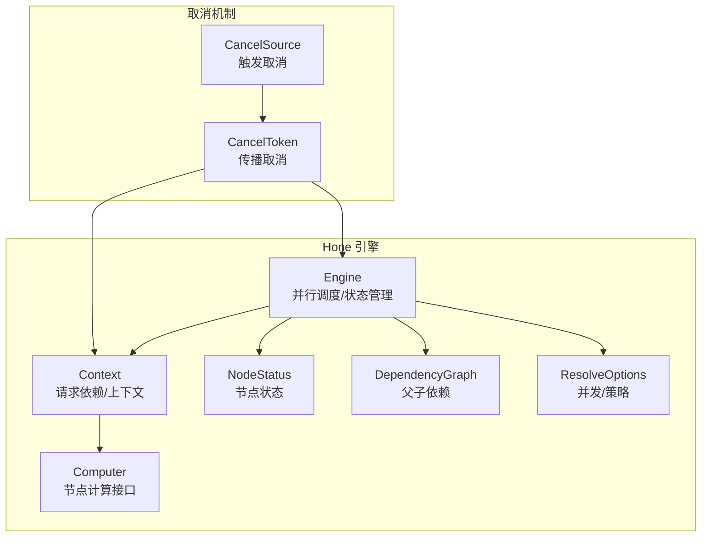
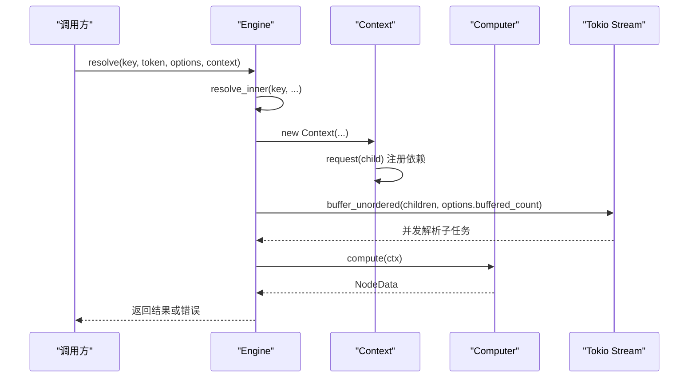
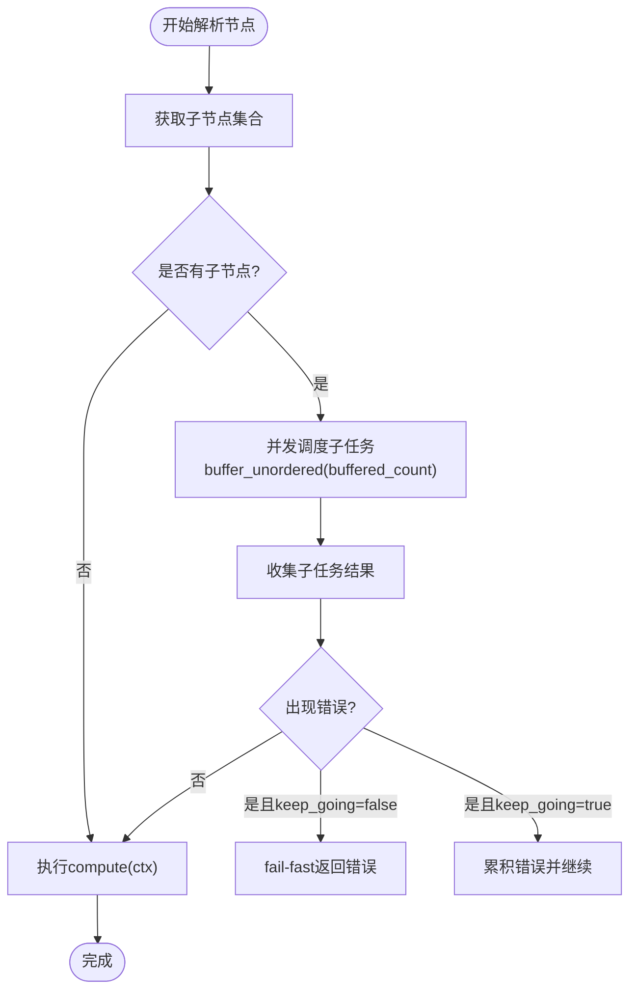
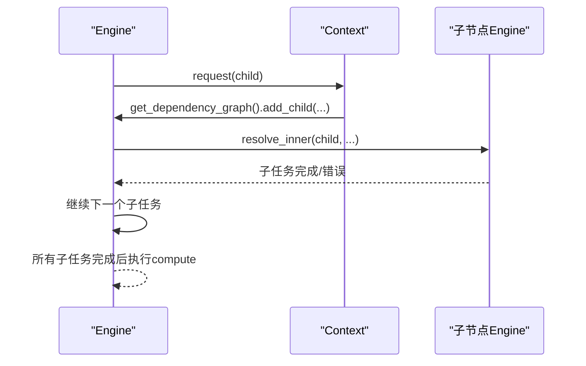
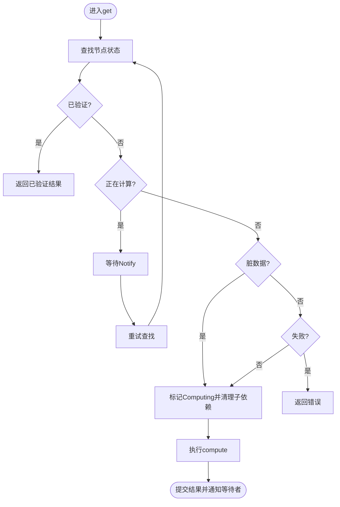
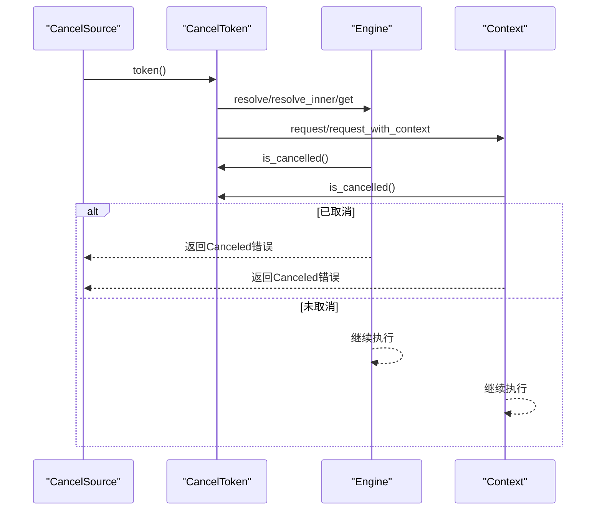
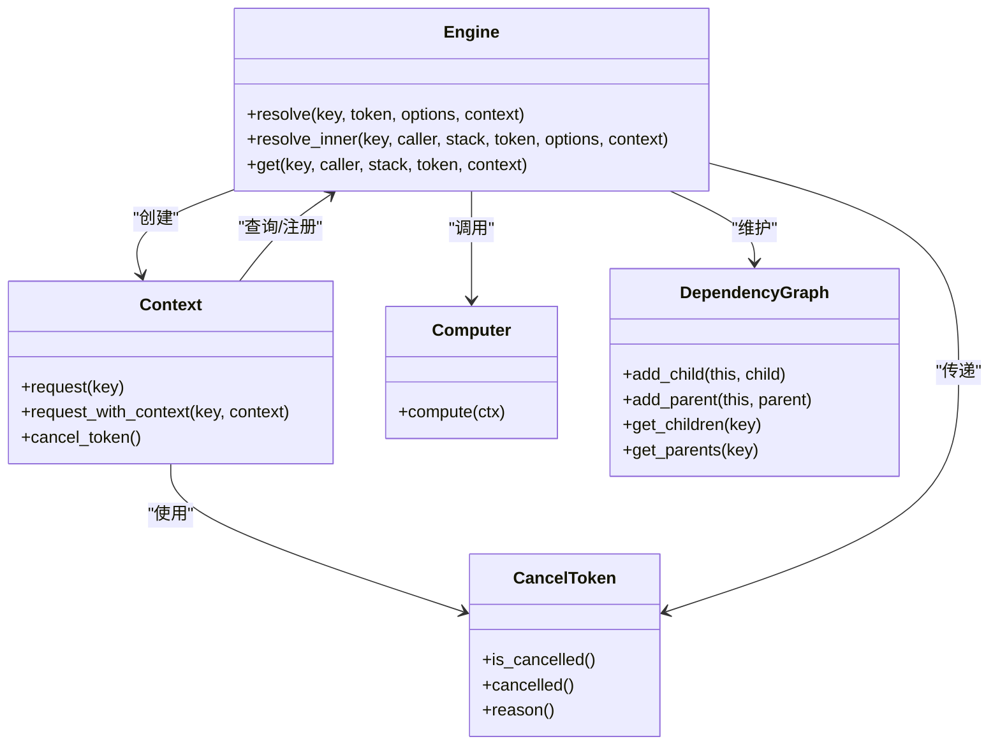

# 并行执行与任务调度

<cite>
**本文引用的文件**
- [engine.rs](file://hone/src/engine.rs)
- [context.rs](file://hone/src/context.rs)
- [status.rs](file://hone/src/status.rs)
- [dependency.rs](file://hone/src/dependency.rs)
- [node.rs](file://hone/src/node.rs)
- [error.rs](file://hone/src/error.rs)
- [lib.rs](file://zako_cancel/src/lib.rs)
- [engine_tests.rs](file://hone/tests/engine_tests.rs)
- [main.rs](file://zako_cli/src/main.rs)
- [worker_pool.rs](file://zako_core/src/worker/worker_pool.rs)
- [mod.rs](file://zako_core/src/resource/mod.rs)
</cite>

## 目录
1. [简介](#简介)
2. [项目结构](#项目结构)
3. [核心组件](#核心组件)
4. [架构总览](#架构总览)
5. [详细组件分析](#详细组件分析)
6. [依赖关系分析](#依赖关系分析)
7. [性能考量](#性能考量)
8. [故障排查指南](#故障排查指南)
9. [结论](#结论)
10. [附录](#附录)

## 简介
本文件面向Hone引擎的并行执行与任务调度系统，系统性阐述以下主题：
- 并行执行的架构设计与并发控制机制
- 任务调度策略与缓冲并发参数
- fail-fast行为与keep_going选项的实现
- resolve_inner方法的递归调度、子任务并发执行与结果聚合
- 取消令牌在并发环境中的作用与优雅关闭
- 性能调优、资源限制与死锁预防
- 监控与调试工具的使用建议

## 项目结构
Hone引擎位于hone模块中，围绕Engine、Context、Computer等核心类型构建；并行执行由Tokio流与buffer_unordered实现；取消机制通过zako_cancel提供；状态与依赖图由专用模块维护。

图表来源
- [engine.rs](file://hone/src/engine.rs#L32-L53)
- [context.rs](file://hone/src/context.rs#L14-L32)
- [status.rs](file://hone/src/status.rs#L62-L114)
- [dependency.rs](file://hone/src/dependency.rs#L4-L62)
- [lib.rs](file://zako_cancel/src/lib.rs#L89-L157)

章节来源
- [engine.rs](file://hone/src/engine.rs#L32-L53)
- [context.rs](file://hone/src/context.rs#L14-L32)
- [status.rs](file://hone/src/status.rs#L62-L114)
- [dependency.rs](file://hone/src/dependency.rs#L4-L62)
- [lib.rs](file://zako_cancel/src/lib.rs#L89-L157)

## 核心组件
- Engine：负责节点状态管理、依赖图维护、并行调度与结果提交。关键方法包括resolve、resolve_inner、get。
- Context：封装当前节点、调用者、搜索栈、旧数据、上下文与取消令牌，提供request/request_with_context发起依赖解析。
- Computer：异步计算接口，由具体实现提供节点计算逻辑。
- NodeStatus：节点状态机，支持Computing/Verified/Dirty/Failed/Unreachable。
- DependencyGraph：维护父子依赖边，支持动态注册与清理。
- ResolveOptions：并发与策略配置，包含buffered_count与keep_going。

章节来源
- [engine.rs](file://hone/src/engine.rs#L32-L53)
- [context.rs](file://hone/src/context.rs#L14-L32)
- [status.rs](file://hone/src/status.rs#L62-L114)
- [dependency.rs](file://hone/src/dependency.rs#L4-L62)
- [node.rs](file://hone/src/node.rs#L38-L61)

## 架构总览
Hone的并行执行基于Tokio异步流与buffer_unordered对子任务进行并发调度。每个节点在首次解析时进入Computing状态并注册依赖，随后并发解析所有子节点，最后执行Computer.compute并提交结果。取消令牌贯穿整个流程，确保在任意阶段可被优雅中断。

图表来源
- [engine.rs](file://hone/src/engine.rs#L411-L534)
- [context.rs](file://hone/src/context.rs#L93-L150)
- [lib.rs](file://zako_cancel/src/lib.rs#L129-L157)

## 详细组件分析

### 并行调度与并发控制
- 并发入口：resolve_inner在解析节点时，先获取子节点列表，使用Tokio流与buffer_unordered按buffered_count进行并发调度。
- 并发策略：buffer_unordered将子任务并发执行，不保证完成顺序，仅在所有子任务完成后才继续执行当前节点的compute。
- 失败策略：根据keep_going选项决定fail-fast或继续收集错误。当keep_going为false时，遇到非环形错误立即返回；为true时收集错误并在完成后统一处理。

图表来源
- [engine.rs](file://hone/src/engine.rs#L437-L534)

章节来源
- [engine.rs](file://hone/src/engine.rs#L411-L534)

### buffered_count 参数的作用
- 定义：ResolveOptions中的buffered_count控制并发子任务的最大数量。
- 行为：通过buffer_unordered(buffered_count)限制同时活跃的子任务数量，避免过度并发导致资源争用或内存压力。
- 影响：较小值降低并发度，减少资源占用但可能延长总耗时；较大值提升吞吐但需关注CPU/IO瓶颈与内存峰值。

章节来源
- [engine.rs](file://hone/src/engine.rs#L41-L53)
- [engine.rs](file://hone/src/engine.rs#L484-L484)

### keep_going 选项的影响
- 默认：ResolveOptions默认keep_going为true。
- 行为：当子任务出现错误时，若keep_going为true，则继续等待其他子任务完成并收集错误；若为false，则立即fail-fast返回首个错误。
- 适用场景：在需要尽快发现并报告所有问题时可设置keep_going=false；在追求整体吞吐时可保持true。

章节来源
- [engine.rs](file://hone/src/engine.rs#L41-L53)
- [engine.rs](file://hone/src/engine.rs#L509-L514)

### fail-fast 行为的实现
- 触发点：resolve_inner在并发消费子任务结果时，遇到非环形错误且keep_going为false时，立即返回错误。
- 传播：由于Tokio流在Drop时会取消未完成的任务，因此fail-fast会快速终止剩余子任务，避免资源浪费。
- 特殊处理：环形依赖错误会原样返回，不参与fail-fast逻辑。

章节来源
- [engine.rs](file://hone/src/engine.rs#L500-L514)
- [error.rs](file://hone/src/error.rs#L4-L30)

### resolve_inner 方法的递归调度逻辑
- 递归入口：resolve_inner(key, ...)对当前节点进行解析。
- 依赖注册：通过Context在请求子节点时动态注册父子依赖边，确保依赖图一致性。
- 递归调用：对每个子节点再次调用resolve_inner，形成深度优先的递归调度。
- 结果聚合：等待所有子任务完成后，执行当前节点compute并提交结果。

图表来源
- [engine.rs](file://hone/src/engine.rs#L411-L534)
- [context.rs](file://hone/src/context.rs#L114-L140)

章节来源
- [engine.rs](file://hone/src/engine.rs#L411-L534)
- [context.rs](file://hone/src/context.rs#L93-L150)

### 子任务的并发执行与结果聚合
- 并发执行：使用futures::stream::iter(children).map(...).buffer_unordered(options.buffered_count)实现。
- 结果聚合：通过while let Some(result) = stream.next().await循环收集结果；在每次迭代中检查取消令牌，确保运行时取消也能及时响应。
- 错误处理：根据keep_going策略决定是否继续等待或fail-fast。

章节来源
- [engine.rs](file://hone/src/engine.rs#L444-L516)

### get 方法与状态机
- 状态竞争：get方法使用DashMap的entry API进行双检锁，避免重复计算。
- Computing状态：若节点处于Computing，其他请求者等待Notify通知后重试。
- Dirty/Failure：Dirty表示需要重新计算；Failed表示失败，直接返回错误。
- 结果提交：compute完成后，将结果写回状态机并通知等待者。

图表来源
- [engine.rs](file://hone/src/engine.rs#L306-L409)
- [status.rs](file://hone/src/status.rs#L62-L114)

章节来源
- [engine.rs](file://hone/src/engine.rs#L306-L409)
- [status.rs](file://hone/src/status.rs#L62-L114)

### 取消令牌在并发环境中的作用与优雅关闭
- 传播机制：CancelSource生成CancelToken，可在Engine、Context、子任务间克隆传递；子Token继承父级取消信号。
- 检查点：resolve_inner、resolve、get、Context.request等关键路径均显式检查is_cancelled()。
- 优雅关闭：一旦触发取消，Future链路会尽快结束，Tokio流在Drop时取消未完成任务，避免资源泄漏。
- 原因保留：OnceLock确保仅保留第一次取消原因，便于诊断。

图表来源
- [lib.rs](file://zako_cancel/src/lib.rs#L89-L157)
- [engine.rs](file://hone/src/engine.rs#L420-L425)
- [engine.rs](file://hone/src/engine.rs#L521-L529)
- [context.rs](file://hone/src/context.rs#L124-L129)

章节来源
- [lib.rs](file://zako_cancel/src/lib.rs#L89-L157)
- [engine.rs](file://hone/src/engine.rs#L420-L425)
- [engine.rs](file://hone/src/engine.rs#L521-L529)
- [context.rs](file://hone/src/context.rs#L124-L129)

### 依赖图与并发安全
- 动态注册：Context.request在解析前动态注册父子依赖，避免静态图带来的耦合。
- 锁粒度：依赖图使用DashMap，读写分离；在注册边时尽量缩短持锁时间，减少竞争。
- 清理策略：当节点状态为Dirty时，清理其子依赖，确保重新计算时依赖图一致。

章节来源
- [dependency.rs](file://hone/src/dependency.rs#L18-L53)
- [context.rs](file://hone/src/context.rs#L114-L123)
- [engine.rs](file://hone/src/engine.rs#L344-L371)

### 测试用例与使用示例
- 基础解析：测试验证父子节点并发解析与结果聚合。
- 环形检测：测试验证循环依赖的检测与错误返回。
- 取消机制：测试验证取消令牌在慢任务中的传播与错误返回。

章节来源
- [engine_tests.rs](file://hone/tests/engine_tests.rs#L56-L156)

## 依赖关系分析
- Engine依赖Context、Computer、DependencyGraph、NodeStatus与zako_cancel。
- Context依赖Engine与zako_cancel，用于请求子节点与传播取消。
- zako_cancel提供CancelSource与CancelToken，贯穿Engine与Context。

图表来源
- [engine.rs](file://hone/src/engine.rs#L32-L53)
- [context.rs](file://hone/src/context.rs#L23-L32)
- [dependency.rs](file://hone/src/dependency.rs#L4-L62)
- [lib.rs](file://zako_cancel/src/lib.rs#L129-L157)

章节来源
- [engine.rs](file://hone/src/engine.rs#L32-L53)
- [context.rs](file://hone/src/context.rs#L23-L32)
- [dependency.rs](file://hone/src/dependency.rs#L4-L62)
- [lib.rs](file://zako_cancel/src/lib.rs#L129-L157)

## 性能考量
- 并发度调优
  - buffered_count：根据CPU核数、IO瓶颈与内存容量调整。过小导致吞吐不足，过大可能导致上下文切换与内存峰值升高。
  - keep_going：在需要快速反馈时可设为false；在追求整体吞吐时设为true。
- 资源限制
  - CPU：结合系统CPU核数与任务类型选择并发度。
  - IO：对于大量IO密集型任务，适当降低并发度以避免磁盘/网络拥塞。
  - 内存：监控并发任务的中间结果与缓存大小，避免内存峰值过高。
- 死锁预防
  - 严格遵循单向依赖：避免循环依赖，resolve_inner在搜索栈中检测环形依赖。
  - 及时取消：在外部触发取消时，确保子任务尽快结束，避免悬挂。
- 优雅关闭
  - 使用CancelToken在关键路径检查is_cancelled()，确保任务可被快速终止。
  - 在Tokio流Drop时自动取消未完成任务，避免资源泄漏。

[本节为通用指导，无需特定文件来源]

## 故障排查指南
- 常见错误
  - CycleDetected：检查依赖图注册逻辑与搜索栈，确认是否存在环形依赖。
  - Canceled：检查CancelSource的触发时机与reason，定位取消来源。
  - IOError：检查文件访问权限与路径有效性。
- 调试建议
  - 启用详细日志：通过CLI主程序的追踪层输出层级化日志，定位执行路径。
  - 使用测试用例：参考engine_tests.rs中的基础解析、环形检测与取消测试，复现问题场景。
  - 监控取消传播：在Context.request与Engine.resolve_inner中插入日志，观察取消信号是否正确传播。

章节来源
- [error.rs](file://hone/src/error.rs#L4-L30)
- [engine_tests.rs](file://hone/tests/engine_tests.rs#L82-L156)
- [main.rs](file://zako_cli/src/main.rs#L500-L586)

## 结论
Hone引擎通过明确的状态机、动态依赖图与Tokio流的buffer_unordered并发调度，实现了高效且可控的并行执行。resolve_inner的递归调度与fail-fast策略结合keep_going选项，提供了灵活的错误处理能力。取消令牌贯穿全链路，确保在任何阶段都能优雅关闭。通过合理设置buffered_count与keep_going，并配合资源限制与死锁预防策略，可显著提升系统性能与稳定性。

[本节为总结，无需特定文件来源]

## 附录
- CLI并发控制：zako_cli在MakeArgs中支持concurrency参数，用于设置Tokio运行时的并发度，间接影响任务调度的总体并发水平。
- 资源池与工作池：zako_core中的worker_pool与resource模块展示了线程池与资源池的实现思路，可用于扩展Hone的底层执行能力（如JS/V8任务）。

章节来源
- [main.rs](file://zako_cli/src/main.rs#L296-L333)
- [worker_pool.rs](file://zako_core/src/worker/worker_pool.rs#L140-L184)
- [mod.rs](file://zako_core/src/resource/mod.rs#L93-L177)