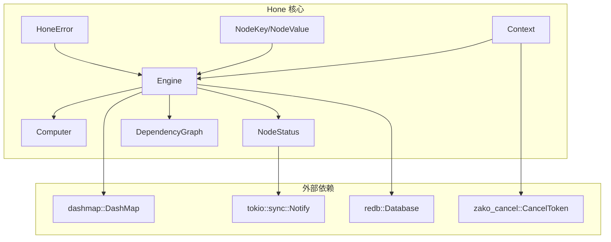
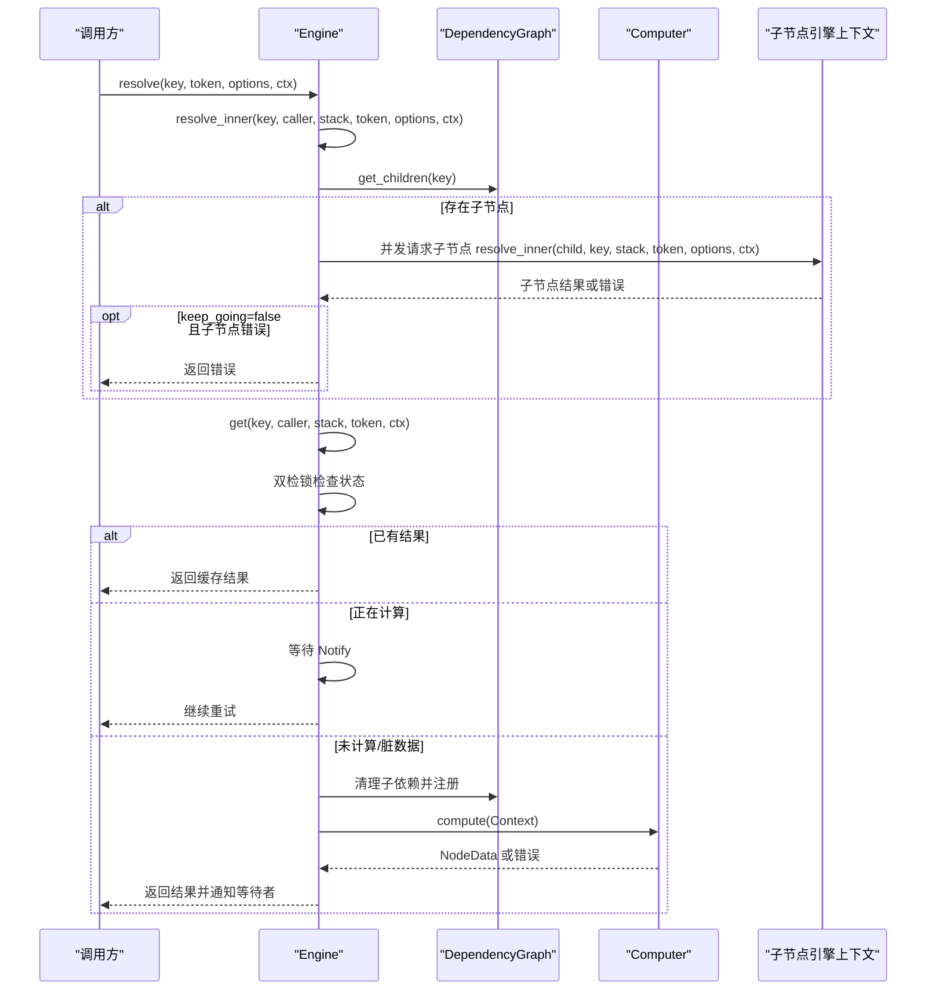
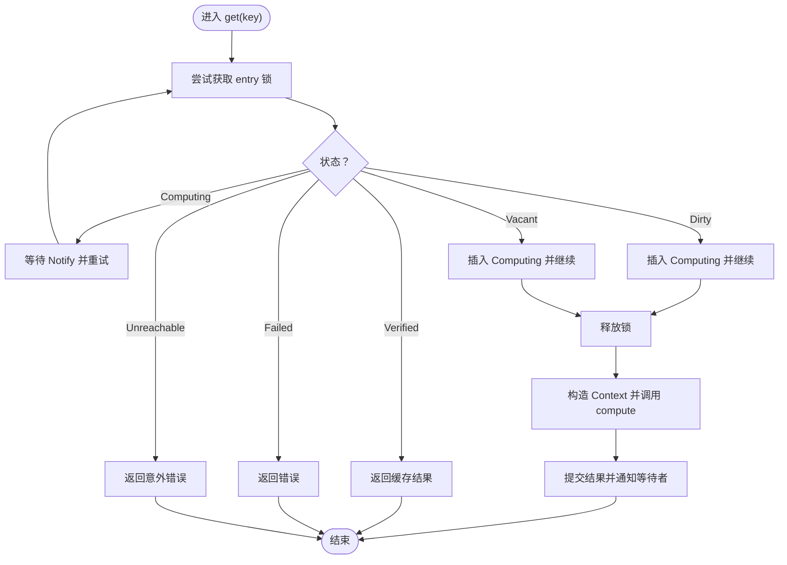
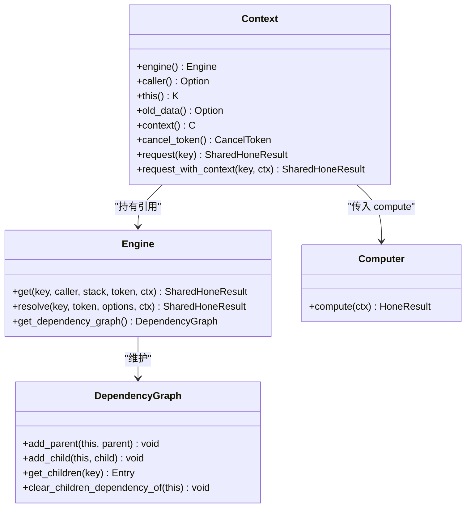
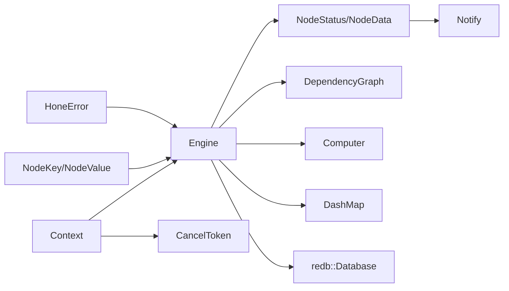

# 递归式计算模型

<cite>
**本文引用的文件列表**
- [hone/src/lib.rs](file://hone/src/lib.rs)
- [hone/src/engine.rs](file://hone/src/engine.rs)
- [hone/src/context.rs](file://hone/src/context.rs)
- [hone/src/node.rs](file://hone/src/node.rs)
- [hone/src/status.rs](file://hone/src/status.rs)
- [hone/src/dependency.rs](file://hone/src/dependency.rs)
- [hone/src/error.rs](file://hone/src/error.rs)
- [zako_cancel/src/lib.rs](file://zako_cancel/src/lib.rs)
- [hone/tests/engine_tests.rs](file://hone/tests/engine_tests.rs)
</cite>

## 目录
1. [引言](#引言)
2. [项目结构](#项目结构)
3. [核心组件](#核心组件)
4. [架构总览](#架构总览)
5. [详细组件分析](#详细组件分析)
6. [依赖关系分析](#依赖关系分析)
7. [性能与并发特性](#性能与并发特性)
8. [故障排查指南](#故障排查指南)
9. [结论](#结论)
10. [附录](#附录)

## 引言
本技术文档围绕 Hone 引擎的递归式计算模型展开，系统性阐述其核心原理、计算流程与状态管理机制。重点包括：
- 递归式计算的双检锁机制与状态转换
- Engine 结构体设计与职责边界
- NodeKey 与 NodeValue 的抽象与持久化契约
- Context 上下文的作用、生命周期与依赖注册
- compute 函数的调用时机与 get 方法工作原理
- 取消令牌 CancelToken 的使用策略
- 并发安全保证与内存管理策略
- 实际测试用例中如何体现上述机制

## 项目结构
Hone 模块位于 hone 目录，核心由以下模块组成：
- engine.rs：引擎主体，负责状态管理、递归解析、并发协调与持久化接口占位
- context.rs：上下文与计算机接口，定义 compute 的调用入口
- node.rs：节点键值抽象与持久化契约
- status.rs：节点数据与状态类型、状态码与哈希对
- dependency.rs：依赖图结构，维护父子关系
- error.rs：统一错误类型与断言宏
- lib.rs：导出类型别名与常量
- tests/engine_tests.rs：端到端测试，验证递归、循环检测与取消

图表来源
- [hone/src/engine.rs](file://hone/src/engine.rs#L32-L38)
- [hone/src/context.rs](file://hone/src/context.rs#L24-L32)
- [hone/src/status.rs](file://hone/src/status.rs#L62-L69)
- [hone/src/dependency.rs](file://hone/src/dependency.rs#L4-L8)
- [hone/src/node.rs](file://hone/src/node.rs#L38-L50)
- [hone/src/error.rs](file://hone/src/error.rs#L3-L30)
- [zako_cancel/src/lib.rs](file://zako_cancel/src/lib.rs#L129-L131)

章节来源
- [hone/src/lib.rs](file://hone/src/lib.rs#L1-L34)
- [hone/src/engine.rs](file://hone/src/engine.rs#L1-L555)
- [hone/src/context.rs](file://hone/src/context.rs#L1-L152)
- [hone/src/node.rs](file://hone/src/node.rs#L1-L61)
- [hone/src/status.rs](file://hone/src/status.rs#L1-L114)
- [hone/src/dependency.rs](file://hone/src/dependency.rs#L1-L63)
- [hone/src/error.rs](file://hone/src/error.rs#L1-L56)
- [zako_cancel/src/lib.rs](file://zako_cancel/src/lib.rs#L1-L158)

## 核心组件
- Engine<C,K,V>：递归计算引擎，维护状态映射、依赖图、计算机实例与数据库句柄；提供 get/resolve 接口与状态污染、写入等能力。
- Context<C,K,V>：计算上下文，封装当前节点、调用者、搜索栈、旧数据、外部上下文与取消令牌；提供 request/request_with_context 注册依赖并发起递归请求。
- Computer<C,K,V>：计算接口，由用户实现 compute(ctx)，返回 NodeData。
- NodeKey/NodeValue：节点键值抽象，要求实现持久化契约，确保可序列化与安全归档。
- NodeStatus/NodeData：状态机与数据载体，包含输入输出哈希对，支持 Verified/Dirt/Fail/Computing/Unreachable 状态。
- DependencyGraph<K>：无锁并发图，维护 parents/children 映射，支持动态注册与清理。
- HoneError：统一错误类型，覆盖循环检测、缺失依赖、断言失败、意外错误、聚合错误、数据库状态异常、取消、IO 错误等。
- CancelToken：取消令牌，支持级联取消、原因记录与异步等待。

章节来源
- [hone/src/engine.rs](file://hone/src/engine.rs#L32-L38)
- [hone/src/context.rs](file://hone/src/context.rs#L14-L32)
- [hone/src/node.rs](file://hone/src/node.rs#L38-L60)
- [hone/src/status.rs](file://hone/src/status.rs#L15-L69)
- [hone/src/dependency.rs](file://hone/src/dependency.rs#L4-L8)
- [hone/src/error.rs](file://hone/src/error.rs#L3-L30)
- [zako_cancel/src/lib.rs](file://zako_cancel/src/lib.rs#L129-L157)

## 架构总览
Hone 的递归式计算以“依赖驱动、状态机推进、并发安全”为核心设计原则。整体流程如下：
- 调用 resolve/resolve_inner 从根节点开始，构建搜索栈并并发解析子节点。
- 对每个节点调用 get，通过双检锁避免重复计算，同时等待已有计算完成或抢占计算权。
- 在无锁状态下执行 compute(ctx)，由用户逻辑决定如何请求依赖并产出结果。
- 将结果写回状态机，通知等待者，更新依赖图并支持后续脏化与重算。

图表来源
- [hone/src/engine.rs](file://hone/src/engine.rs#L411-L534)
- [hone/src/engine.rs](file://hone/src/engine.rs#L306-L409)
- [hone/src/context.rs](file://hone/src/context.rs#L92-L150)

## 详细组件分析

### Engine：递归解析与状态机
- 设计要点
  - 使用 DashMap 维护 NodeStatus 映射，支持高并发读写。
  - 依赖图采用 FastMap/FastSet，避免重复边注册。
  - 提供 resolve/resolve_inner 递归解析，支持并发流控与 fail-fast/fail-keep-going 策略。
  - get 方法实现双检锁：先持锁检查状态，若未计算则插入 Computing 并释放锁；随后在无锁状态下执行 compute，最后提交结果并通知等待者。
  - 支持 pollute 脏化与 write 持久化接口占位（注释说明）。
- 关键流程
  - 双检锁：在 entry 上进行 Occupied/Vacant 分支，避免竞争条件；已存在 Computing 时等待 Notify。
  - 取消检查：在关键路径多次检查 CancelToken，确保及时响应。
  - 依赖注册：request_with_context 中动态注册父子边，确保依赖图正确。
- 错误处理
  - 循环检测：通过搜索栈检测，返回 CycleDetected。
  - 数据库错误：封装为 EngineError。
  - 取消：返回 Canceled。
  - 未达分支：返回 UnexpectedError。

图表来源
- [hone/src/engine.rs](file://hone/src/engine.rs#L316-L409)

章节来源
- [hone/src/engine.rs](file://hone/src/engine.rs#L55-L68)
- [hone/src/engine.rs](file://hone/src/engine.rs#L190-L226)
- [hone/src/engine.rs](file://hone/src/engine.rs#L306-L409)
- [hone/src/engine.rs](file://hone/src/engine.rs#L411-L534)

### Context 与 Computer：计算入口与依赖注册
- Context 作用
  - 封装当前节点 this、调用者 caller、搜索栈 stack、旧数据 old_data、外部上下文 context、取消令牌 cancel_token。
  - 提供 request/request_with_context：动态注册父子依赖边，检查取消，递归调用引擎 get。
- Computer 接口
  - 用户实现 compute(ctx)：根据 this 与 old_data 决定是否请求依赖，最终返回 NodeData。
- 生命周期
  - Context 仅在一次计算周期内有效，随 compute 完成而销毁。
  - 依赖注册发生在 request 调用期间，确保依赖图与状态机一致。

图表来源
- [hone/src/context.rs](file://hone/src/context.rs#L24-L32)
- [hone/src/context.rs](file://hone/src/context.rs#L92-L150)
- [hone/src/engine.rs](file://hone/src/engine.rs#L302-L304)

章节来源
- [hone/src/context.rs](file://hone/src/context.rs#L14-L32)
- [hone/src/context.rs](file://hone/src/context.rs#L34-L54)
- [hone/src/context.rs](file://hone/src/context.rs#L92-L150)
- [hone/src/engine.rs](file://hone/src/engine.rs#L302-L304)

### NodeKey 与 NodeValue：抽象与持久化契约
- NodeKey/NodeValue 均要求实现 Persistent，确保可归档、可序列化与安全校验。
- SafeNodeKey/SafeNodeValue 通过 rkyv::bytecheck 保障反序列化安全。
- 该抽象使得引擎与上层业务解耦，便于扩展不同类型的节点键值。

章节来源
- [hone/src/node.rs](file://hone/src/node.rs#L8-L60)

### NodeStatus 与 NodeData：状态机与数据载体
- NodeStatus：Computing/Verified/Dirty/Failed/Unreachable，配合 Notify 实现等待/唤醒。
- NodeData：包含 Arc<V> 值与输入输出哈希对，支持 Clone/Deref，便于共享与访问。
- 状态码枚举与转换：用于持久化与调试。

章节来源
- [hone/src/status.rs](file://hone/src/status.rs#L15-L69)
- [hone/src/status.rs](file://hone/src/status.rs#L70-L101)

### DependencyGraph：依赖图与动态注册
- 采用 FastMap<FastSet> 存储 parents/children，支持并发读写。
- 提供 add_parent/add_child/add_parents/add_children 与 clear_children_dependency_of，确保在计算前清理旧依赖并在计算后注册新依赖。

章节来源
- [hone/src/dependency.rs](file://hone/src/dependency.rs#L4-L62)

### 错误模型：统一错误与断言
- HoneError：覆盖循环检测、缺失依赖、断言失败、意外错误、聚合错误、数据库状态异常、取消、IO 错误等。
- 断言宏：assert!/debug_assert! 提供条件断言与错误返回。

章节来源
- [hone/src/error.rs](file://hone/src/error.rs#L3-L30)
- [hone/src/error.rs](file://hone/src/error.rs#L32-L55)

### 取消令牌：CancelToken
- CancelSource/CancelToken：支持创建子 Scope、级联取消、记录首个取消原因。
- 在引擎与上下文中多处检查 is_cancelled，确保及时中断长耗时计算与等待。

章节来源
- [zako_cancel/src/lib.rs](file://zako_cancel/src/lib.rs#L89-L157)
- [hone/src/engine.rs](file://hone/src/engine.rs#L377-L382)
- [hone/src/context.rs](file://hone/src/context.rs#L124-L129)

## 依赖关系分析
- 模块内聚与耦合
  - Engine 与 Context 高内聚，通过 Computer 解耦用户逻辑。
  - 依赖图与状态机紧密协作，确保一致性。
- 外部依赖
  - dashmap 提供并发安全映射；tokio::sync::Notify 实现等待/唤醒；futures/stream 提供并发流控；redb 提供持久化接口占位；rkyv 提供高性能序列化；zako-cancel 提供取消语义。
- 潜在循环依赖
  - 通过引用传递避免直接循环导入；Computer 通过 trait bound 与泛型约束隔离具体实现。

图表来源
- [hone/src/engine.rs](file://hone/src/engine.rs#L32-L38)
- [hone/src/status.rs](file://hone/src/status.rs#L62-L69)
- [hone/src/dependency.rs](file://hone/src/dependency.rs#L4-L8)
- [hone/src/context.rs](file://hone/src/context.rs#L24-L32)
- [zako_cancel/src/lib.rs](file://zako_cancel/src/lib.rs#L129-L131)

章节来源
- [hone/src/engine.rs](file://hone/src/engine.rs#L1-L14)
- [hone/src/status.rs](file://hone/src/status.rs#L1-L6)
- [hone/src/dependency.rs](file://hone/src/dependency.rs#L1-L8)
- [hone/src/context.rs](file://hone/src/context.rs#L1-L12)
- [zako_cancel/src/lib.rs](file://zako_cancel/src/lib.rs#L1-L7)

## 性能与并发特性
- 双检锁降低锁竞争：首次检查不持有锁，仅在必要时插入 Computing 并释放锁，减少临界区时间。
- 并发流控：resolve_inner 使用 buffer_unordered 控制并发度，默认 10，可通过 ResolveOptions 调整。
- 无锁状态执行：在 get 的无锁阶段执行 compute，避免长时间持锁。
- 哈希与共享：NodeData 使用 Arc<V> 与哈希对，减少拷贝与重复计算。
- 依赖清理：clear_children_dependency_of 在重算前清理旧依赖，避免陈旧边影响后续解析。
- 取消早停：fail-fast 模式下，任一子任务失败立即返回；keep_going 模式收集错误后继续。

章节来源
- [hone/src/engine.rs](file://hone/src/engine.rs#L411-L534)
- [hone/src/engine.rs](file://hone/src/engine.rs#L306-L409)
- [hone/src/status.rs](file://hone/src/status.rs#L15-L52)

## 故障排查指南
- 循环依赖
  - 现象：返回 CycleDetected 错误，caller 列表包含形成环的节点序列。
  - 排查：检查 Context.request/request_with_context 是否导致自引用或相互引用。
- 取消导致失败
  - 现象：返回 Canceled，reason 为 CancelReason。
  - 排查：确认 CancelSource 的取消时机与子任务是否及时检查 is_cancelled。
- 数据库错误
  - 现象：EngineError::DatabaseError/CommitError/TableError/StorageError。
  - 排查：检查 redb 初始化与事务提交流程。
- 未达分支
  - 现象：UnexpectedError。
  - 排查：检查 get 中的分支覆盖与状态机转换逻辑。

章节来源
- [hone/src/error.rs](file://hone/src/error.rs#L3-L30)
- [hone/src/engine.rs](file://hone/src/engine.rs#L16-L30)
- [hone/src/engine.rs](file://hone/src/engine.rs#L377-L382)

## 结论
Hone 的递归式计算模型通过“双检锁 + 状态机 + 并发流控 + 动态依赖注册 + 取消令牌”的组合，实现了高效、安全、可扩展的计算框架。Engine 作为中枢协调器，Context 作为计算入口，Computer 作为业务实现，三者协同完成从依赖解析到结果产出的全过程。该模型在大型工程中具备良好的可维护性与性能表现，适合作为构建复杂配置/编译/构建系统的底层引擎。

## 附录

### get 方法工作原理与 compute 调用时机
- get 的双检锁流程确保同一时刻仅有一个协程执行 compute，其余协程等待 Notify。
- compute 在无锁状态下执行，用户可在其中调用 ctx.request 注册依赖并递归解析。
- 结果提交后，通过 Notify 唤醒等待者，状态切换至 Verified/Dirt/Fail。

章节来源
- [hone/src/engine.rs](file://hone/src/engine.rs#L306-L409)
- [hone/src/context.rs](file://hone/src/context.rs#L92-L150)

### 取消令牌使用建议
- 在每次进入关键路径前检查 is_cancelled，避免阻塞式操作无法及时退出。
- 使用 CancelSource.create_child 为子任务创建独立 Token，保持级联取消语义。
- 记录首个取消原因，便于诊断与日志追踪。

章节来源
- [zako_cancel/src/lib.rs](file://zako_cancel/src/lib.rs#L107-L118)
- [zako_cancel/src/lib.rs](file://zako_cancel/src/lib.rs#L149-L156)
- [hone/src/engine.rs](file://hone/src/engine.rs#L377-L382)
- [hone/src/context.rs](file://hone/src/context.rs#L124-L129)

### 实际用例参考
- 基础递归解析：根节点 a 依赖 b/c，b/c 为常量，期望结果为 30。
- 循环检测：节点 cycle 自引用，应返回循环错误。
- 取消测试：慢计算在取消后返回 Canceled。

章节来源
- [hone/tests/engine_tests.rs](file://hone/tests/engine_tests.rs#L56-L80)
- [hone/tests/engine_tests.rs](file://hone/tests/engine_tests.rs#L82-L101)
- [hone/tests/engine_tests.rs](file://hone/tests/engine_tests.rs#L103-L155)