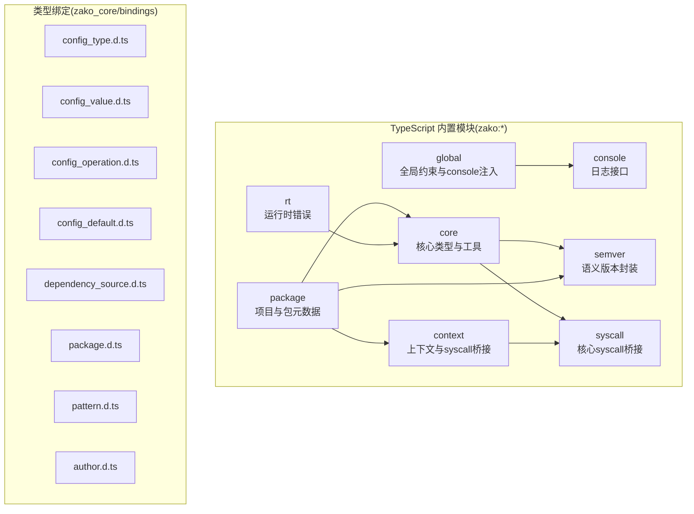
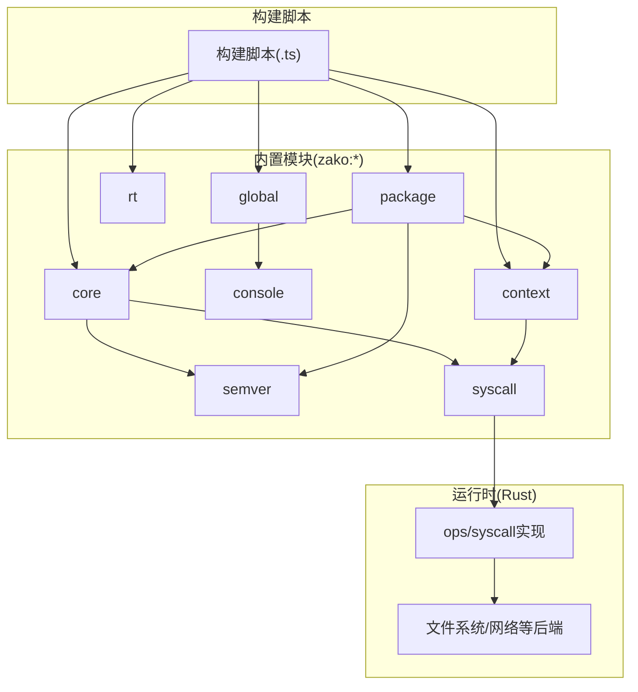
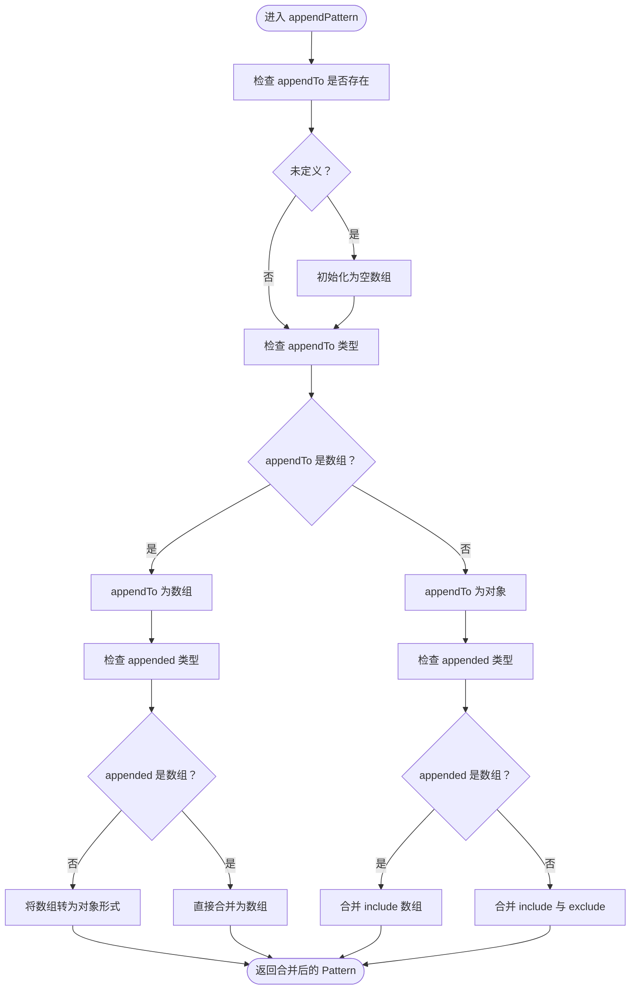
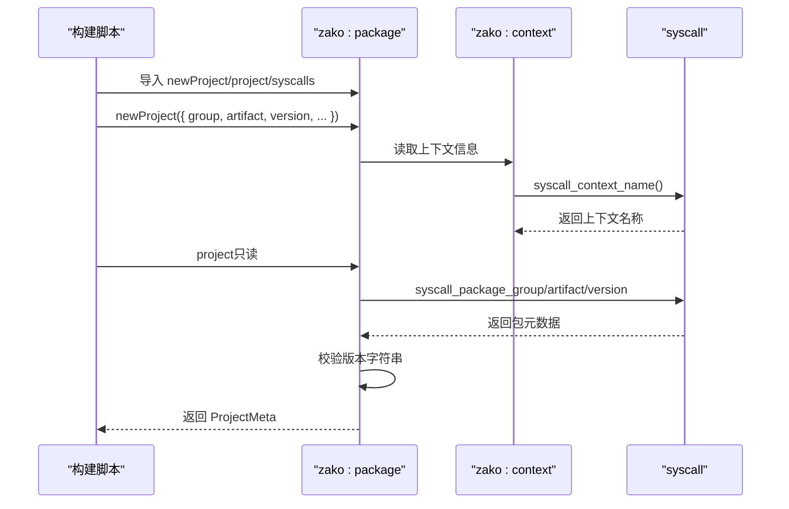
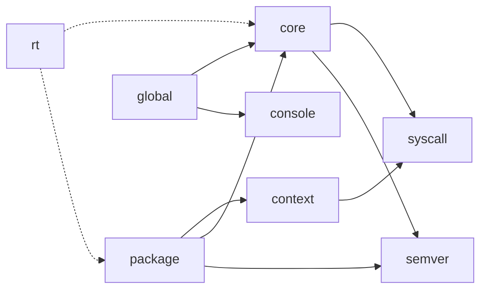

# TypeScript API参考

<cite>
**本文档引用的文件**
- [zako_js/src/builtins/core/index.ts](file://zako_js/src/builtins/core/index.ts)
- [zako_js/src/builtins/console/index.ts](file://zako_js/src/builtins/console/index.ts)
- [zako_js/src/builtins/context/index.ts](file://zako_js/src/builtins/context/index.ts)
- [zako_js/src/builtins/global/index.ts](file://zako_js/src/builtins/global/index.ts)
- [zako_js/src/builtins/package/index.ts](file://zako_js/src/builtins/package/index.ts)
- [zako_js/src/builtins/rt/index.ts](file://zako_js/src/builtins/rt/index.ts)
- [zako_js/src/builtins/semver/index.ts](file://zako_js/src/builtins/semver/index.ts)
- [zako_js/src/builtins/syscall/index.ts](file://zako_js/src/builtins/syscall/index.ts)
- [zako_core/bindings/config_type.d.ts](file://zako_core/bindings/config_type.d.ts)
- [zako_core/bindings/config_value.d.ts](file://zako_core/bindings/config_value.d.ts)
- [zako_core/bindings/config_operation.d.ts](file://zako_core/bindings/config_operation.d.ts)
- [zako_core/bindings/config_default.d.ts](file://zako_core/bindings/config_default.d.ts)
- [zako_core/bindings/dependency_source.d.ts](file://zako_core/bindings/dependency_source.d.ts)
- [zako_core/bindings/package.d.ts](file://zako_core/bindings/package.d.ts)
- [zako_core/bindings/pattern.d.ts](file://zako_core/bindings/pattern.d.ts)
- [zako_core/bindings/author.d.ts](file://zako_core/bindings/author.d.ts)
</cite>

## 目录
1. [简介](#简介)
2. [项目结构](#项目结构)
3. [核心组件](#核心组件)
4. [架构总览](#架构总览)
5. [详细组件分析](#详细组件分析)
6. [依赖关系分析](#依赖关系分析)
7. [性能考虑](#性能考虑)
8. [故障排除指南](#故障排除指南)
9. [结论](#结论)
10. [附录](#附录)

## 简介
本参考文档面向TypeScript开发者与构建脚本作者，系统梳理Zako的TypeScript内置API族谱，包括但不限于：核心API（core）、配置API（config）、控制台API（console）、上下文API（context）、包管理API（package）、运行时API（rt）、语义版本API（semver）与系统调用API（syscall）。文档覆盖各API的功能职责、类型定义、接口规范、参数与返回值说明、错误处理机制，并通过序列图与类图展示API间的依赖与组合使用模式，辅以常见问题与调试技巧，帮助读者高效、安全地使用Zako构建系统。

## 项目结构
Zako的TypeScript API主要由两部分组成：
- 运行时内置模块（builtins）：在Zako沙箱内暴露给构建脚本的TypeScript API，如 core、console、context、package、rt、semver、syscall。
- 类型绑定（bindings）：由Rust侧生成的TypeScript类型声明，用于描述配置、包元数据、模式匹配等跨语言数据结构。

图表来源
- [zako_js/src/builtins/core/index.ts](file://zako_js/src/builtins/core/index.ts#L1-L176)
- [zako_js/src/builtins/console/index.ts](file://zako_js/src/builtins/console/index.ts#L1-L10)
- [zako_js/src/builtins/context/index.ts](file://zako_js/src/builtins/context/index.ts#L1-L16)
- [zako_js/src/builtins/global/index.ts](file://zako_js/src/builtins/global/index.ts#L1-L128)
- [zako_js/src/builtins/package/index.ts](file://zako_js/src/builtins/package/index.ts#L1-L98)
- [zako_js/src/builtins/rt/index.ts](file://zako_js/src/builtins/rt/index.ts#L1-L15)
- [zako_js/src/builtins/semver/index.ts](file://zako_js/src/builtins/semver/index.ts#L1-L47)
- [zako_js/src/builtins/syscall/index.ts](file://zako_js/src/builtins/syscall/index.ts#L1-L25)
- [zako_core/bindings/config_type.d.ts](file://zako_core/bindings/config_type.d.ts#L1-L4)
- [zako_core/bindings/config_value.d.ts](file://zako_core/bindings/config_value.d.ts#L1-L6)
- [zako_core/bindings/config_operation.d.ts](file://zako_core/bindings/config_operation.d.ts#L1-L7)
- [zako_core/bindings/config_default.d.ts](file://zako_core/bindings/config_default.d.ts#L1-L5)
- [zako_core/bindings/dependency_source.d.ts](file://zako_core/bindings/dependency_source.d.ts#L1-L21)
- [zako_core/bindings/package.d.ts](file://zako_core/bindings/package.d.ts#L1-L32)
- [zako_core/bindings/pattern.d.ts](file://zako_core/bindings/pattern.d.ts#L1-L36)
- [zako_core/bindings/author.d.ts](file://zako_core/bindings/author.d.ts#L1-L11)

章节来源
- [zako_js/src/builtins/core/index.ts](file://zako_js/src/builtins/core/index.ts#L1-L176)
- [zako_js/src/builtins/global/index.ts](file://zako_js/src/builtins/global/index.ts#L1-L128)
- [zako_core/bindings/package.d.ts](file://zako_core/bindings/package.d.ts#L1-L32)

## 核心组件
本节概述Zako TypeScript API的核心能力域与边界，帮助快速定位所需功能。

- 核心API（zako:core）
  - 提供版本解析、版本断言、项目元数据、作者签名、可见性与传递级别、模式拼接等基础能力。
  - 关键导出：版本类型、语义版本类型别名、项目元数据接口、模式类型、日志函数、版本断言函数、模式拼接函数等。
- 配置API（zako:config）
  - 通过运行时注册表读取配置项，键类型受ConfigRegistry约束。
  - 关键导出：ConfigRegistry接口、get_config函数。
- 控制台API（zako:console）
  - 定义统一的日志接口，支持trace/debug/log/info/warn/error。
- 上下文API（zako:context）
  - 暴露当前上下文名称（来自syscall），作为包/任务等标识的来源。
- 包管理API（zako:package）
  - 提供项目构建器、只读项目信息、系统调用桥接，以及对版本字符串的校验与解析。
- 运行时API（zako:rt）
  - 提供Zako内部错误类型，用于报告不可预期的运行时问题。
- 语义版本API（zako:semver）
  - 对外部semver库进行轻量封装，导出类型别名与全部API。
- 系统调用API（zako:syscall）
  - 暴露核心syscall接口（版本查询、日志），并提供便捷log函数。

章节来源
- [zako_js/src/builtins/core/index.ts](file://zako_js/src/builtins/core/index.ts#L1-L176)
- [zako_js/src/builtins/console/index.ts](file://zako_js/src/builtins/console/index.ts#L1-L10)
- [zako_js/src/builtins/context/index.ts](file://zako_js/src/builtins/context/index.ts#L1-L16)
- [zako_js/src/builtins/package/index.ts](file://zako_js/src/builtins/package/index.ts#L1-L98)
- [zako_js/src/builtins/rt/index.ts](file://zako_js/src/builtins/rt/index.ts#L1-L15)
- [zako_js/src/builtins/semver/index.ts](file://zako_js/src/builtins/semver/index.ts#L1-L47)
- [zako_js/src/builtins/syscall/index.ts](file://zako_js/src/builtins/syscall/index.ts#L1-L25)

## 架构总览
Zako的TypeScript API采用“内置模块 + 类型绑定”的分层设计。内置模块在运行时通过syscall桥接到Rust实现；类型绑定则确保跨语言数据结构的一致性与可验证性。

图表来源
- [zako_js/src/builtins/core/index.ts](file://zako_js/src/builtins/core/index.ts#L1-L176)
- [zako_js/src/builtins/syscall/index.ts](file://zako_js/src/builtins/syscall/index.ts#L1-L25)
- [zako_js/src/builtins/context/index.ts](file://zako_js/src/builtins/context/index.ts#L1-L16)
- [zako_js/src/builtins/package/index.ts](file://zako_js/src/builtins/package/index.ts#L1-L98)
- [zako_js/src/builtins/global/index.ts](file://zako_js/src/builtins/global/index.ts#L1-L128)

## 详细组件分析

### 核心API（zako:core）
- 功能概要
  - 版本模型：提供语义化版本核心与完整版本字符串类型，支持预发布与构建元数据。
  - 项目元数据：定义group/artifact/version等项目标识。
  - 日志桥接：将trace/debug/info/warn/error映射到syscall日志。
  - 模式拼接：将多种模式形式合并为统一格式。
  - 版本断言：基于semver范围断言当前Zako版本是否满足要求。
- 关键类型与函数
  - 版本类型：VersionCore、VersionString、Version
  - 身份类型：Target、TargetType、Architecture、Os、ToolType、ToolName
  - 元数据：ProjectMeta、Author
  - 工具：visibility、transitiveLevel
  - 函数：trace、debug、info、warn、error、appendPattern、requireZakoVersion
- 错误处理
  - 当syscall.version解析失败时抛出ZakoRuntimeError。
  - appendPattern内部对输入进行严格形态判断与合并。
- 使用示例（路径）
  - 版本断言：[requireZakoVersion调用处](file://zako_js/src/builtins/core/index.ts#L76-L82)
  - 日志桥接：[trace函数](file://zako_js/src/builtins/core/index.ts#L121-L123)
  - 模式拼接：[appendPattern函数](file://zako_js/src/builtins/core/index.ts#L137-L175)

图表来源
- [zako_js/src/builtins/core/index.ts](file://zako_js/src/builtins/core/index.ts#L137-L175)

章节来源
- [zako_js/src/builtins/core/index.ts](file://zako_js/src/builtins/core/index.ts#L1-L176)

### 配置API（zako:config）
- 功能概要
  - 通过全局注册表读取配置项，键类型由ConfigRegistry约束。
- 关键导出
  - ConfigRegistry接口
  - get_config函数：按键读取对应配置值
- 使用示例（路径）
  - 获取配置：[get_config函数](file://zako_js/src/builtins/config/index.ts#L4-L6)

章节来源
- [zako_js/src/builtins/config/index.ts](file://zako_js/src/builtins/config/index.ts#L1-L7)

### 控制台API（zako:console）
- 功能概要
  - 统一日志接口，便于在构建脚本中输出trace/debug/log/info/warn/error。
- 关键导出
  - Console接口：trace/debug/log/info/warn/error
- 使用示例（路径）
  - 接口定义：[Console接口](file://zako_js/src/builtins/console/index.ts#L2-L9)

章节来源
- [zako_js/src/builtins/console/index.ts](file://zako_js/src/builtins/console/index.ts#L1-L10)

### 上下文API（zako:context）
- 功能概要
  - 从syscall获取当前上下文名称，作为包或任务标识的基础。
- 关键导出
  - ContextSyscall接口：扩展自syscall.Syscall，新增syscall_context_name
  - syscalls：syscall桥接实例
  - name：当前上下文名称
- 使用示例（路径）
  - 获取上下文名称：[name常量](file://zako_js/src/builtins/context/index.ts#L15-L15)

章节来源
- [zako_js/src/builtins/context/index.ts](file://zako_js/src/builtins/context/index.ts#L1-L16)

### 包管理API（zako:package）
- 功能概要
  - 提供ProjectMeta、Project、CreatedProject、ProjectBuilder等类型与newProject工厂函数。
  - 通过syscall桥接读取当前包的group/artifact/version，并进行版本有效性校验。
- 关键导出
  - ProjectSyscalls接口：syscall_package_group、syscall_package_artifact、syscall_package_version、syscall_package_config
  - syscalls：syscall桥接实例
  - Project、CreatedProject、ProjectBuilder接口
  - newProject工厂函数
  - project只读对象
- 错误处理
  - 当包版本字符串无效时抛出ZakoInternalError。
- 使用示例（路径）
  - 创建项目构建器：[newProject工厂](file://zako_js/src/builtins/package/index.ts#L55-L82)
  - 读取项目元数据：[project对象](file://zako_js/src/builtins/package/index.ts#L91-L95)

图表来源
- [zako_js/src/builtins/package/index.ts](file://zako_js/src/builtins/package/index.ts#L1-L98)
- [zako_js/src/builtins/context/index.ts](file://zako_js/src/builtins/context/index.ts#L1-L16)
- [zako_js/src/builtins/syscall/index.ts](file://zako_js/src/builtins/syscall/index.ts#L1-L25)

章节来源
- [zako_js/src/builtins/package/index.ts](file://zako_js/src/builtins/package/index.ts#L1-L98)

### 运行时API（zako:rt）
- 功能概要
  - 提供ZakoInternalError，用于报告内部错误。
- 关键导出
  - ZakoInternalError类
- 使用示例（路径）
  - 抛出内部错误：[ZakoInternalError构造](file://zako_js/src/builtins/rt/index.ts#L7-L14)

章节来源
- [zako_js/src/builtins/rt/index.ts](file://zako_js/src/builtins/rt/index.ts#L1-L15)

### 语义版本API（zako:semver）
- 功能概要
  - 对外部semver库进行轻量封装，导出类型别名与全部API，便于在构建脚本中进行版本比较、范围判断等。
- 关键导出
  - 类型别名：SemVer、ReleaseType、Range、Comparator、Options
  - API：parse、valid、clean、inc、diff、major、minor、patch、prerelease、compare、rcompare、compareLoose、compareBuild、sort、rsort、gt、lt、eq、neq、gte、lte、cmp、coerce、satisfies、toComparators、maxSatisfying、minSatisfying、minVersion、validRange、outside、gtr、ltr、intersects、simplifyRange、subset
- 使用示例（路径）
  - 版本比较：[satisfies函数](file://zako_js/src/builtins/semver/index.ts#L35-L35)

章节来源
- [zako_js/src/builtins/semver/index.ts](file://zako_js/src/builtins/semver/index.ts#L1-L47)

### 系统调用API（zako:syscall）
- 功能概要
  - 暴露核心syscall接口，包括版本查询与日志写入，并提供便捷log函数。
- 关键导出
  - Syscall接口：syscall_core_version、syscall_core_log
  - syscalls：syscall桥接实例
  - log函数：level与message
  - version：核心版本字符串
- 使用示例（路径）
  - 写入日志：[log函数](file://zako_js/src/builtins/syscall/index.ts#L17-L22)

章节来源
- [zako_js/src/builtins/syscall/index.ts](file://zako_js/src/builtins/syscall/index.ts#L1-L25)

### 全局约束与console注入（zako:global）
- 功能概要
  - 注入全局console，将任意参数安全格式化为字符串后转发至core日志。
  - 在运行时禁用不安全或非确定性API（如Date、Intl、Promise.race、Symbol构造、locale敏感字符串API等）。
- 关键导出
  - 全局console接口与实现
  - 全局类型与属性的禁用声明
- 使用示例（路径）
  - 注入console：[全局console定义](file://zako_js/src/builtins/global/index.ts#L39-L44)
  - 禁用API：[全局禁用声明](file://zako_js/src/builtins/global/index.ts#L46-L87)

章节来源
- [zako_js/src/builtins/global/index.ts](file://zako_js/src/builtins/global/index.ts#L1-L128)

## 依赖关系分析
- 模块间依赖
  - core依赖syscall与semver，提供版本解析与日志桥接。
  - package依赖context、core、semver，读取包元数据并进行版本校验。
  - context依赖syscall，获取上下文名称。
  - global依赖core与console，注入全局console并实施安全约束。
  - rt为所有内置模块提供统一的内部错误类型。
- 数据结构依赖
  - 包元数据（package.d.ts）依赖作者（author.d.ts）、模式（pattern.d.ts）、依赖源（dependency_source.d.ts）、配置值（config_value.d.ts）等类型绑定。

图表来源
- [zako_js/src/builtins/core/index.ts](file://zako_js/src/builtins/core/index.ts#L1-L176)
- [zako_js/src/builtins/package/index.ts](file://zako_js/src/builtins/package/index.ts#L1-L98)
- [zako_js/src/builtins/context/index.ts](file://zako_js/src/builtins/context/index.ts#L1-L16)
- [zako_js/src/builtins/global/index.ts](file://zako_js/src/builtins/global/index.ts#L1-L128)
- [zako_js/src/builtins/rt/index.ts](file://zako_js/src/builtins/rt/index.ts#L1-L15)

章节来源
- [zako_js/src/builtins/core/index.ts](file://zako_js/src/builtins/core/index.ts#L1-L176)
- [zako_js/src/builtins/package/index.ts](file://zako_js/src/builtins/package/index.ts#L1-L98)
- [zako_js/src/builtins/context/index.ts](file://zako_js/src/builtins/context/index.ts#L1-L16)
- [zako_js/src/builtins/global/index.ts](file://zako_js/src/builtins/global/index.ts#L1-L128)
- [zako_js/src/builtins/rt/index.ts](file://zako_js/src/builtins/rt/index.ts#L1-L15)

## 性能考虑
- 模式拼接
  - appendPattern在合并数组与对象时避免重复拷贝，优先就地更新include/exclude数组长度，减少中间对象创建。
- 日志桥接
  - 通过syscall一次性写入，避免频繁I/O；safeFormat在对象序列化时对BigInt进行字符串化，降低序列化开销。
- 版本解析
  - 版本断言仅在必要时进行，建议在脚本入口处集中执行，避免重复解析。

## 故障排除指南
- 版本字符串无效
  - 现象：抛出ZakoInternalError。
  - 原因：包版本字符串不符合semver规范。
  - 处理：修正package版本字段，确保符合语义化版本规范。
  - 参考：[版本校验与错误抛出](file://zako_js/src/builtins/package/index.ts#L84-L89)
- Zako版本不满足要求
  - 现象：抛出ZakoRuntimeError。
  - 原因：当前Zako版本不满足脚本要求的semver范围。
  - 处理：升级Zako或调整脚本中的版本范围。
  - 参考：[requireZakoVersion](file://zako_js/src/builtins/core/index.ts#L76-L82)
- 日志输出异常
  - 现象：日志未显示或格式异常。
  - 原因：safeFormat无法序列化对象或循环引用。
  - 处理：避免传入不可序列化对象；必要时显式转换为字符串。
  - 参考：[safeFormat与console注入](file://zako_js/src/builtins/global/index.ts#L12-L28)
- 不安全API被禁用
  - 现象：运行时报错，提示某些API被禁用。
  - 原因：构建脚本使用了不安全或非确定性API。
  - 处理：替换为安全替代方案（例如使用Symbol.for而非Symbol构造）。
  - 参考：[全局禁用声明](file://zako_js/src/builtins/global/index.ts#L46-L87)

章节来源
- [zako_js/src/builtins/package/index.ts](file://zako_js/src/builtins/package/index.ts#L84-L89)
- [zako_js/src/builtins/core/index.ts](file://zako_js/src/builtins/core/index.ts#L76-L82)
- [zako_js/src/builtins/global/index.ts](file://zako_js/src/builtins/global/index.ts#L12-L28)
- [zako_js/src/builtins/global/index.ts](file://zako_js/src/builtins/global/index.ts#L46-L87)

## 结论
Zako的TypeScript API通过清晰的模块划分与严格的类型绑定，为构建脚本提供了安全、可预测且功能完备的开发体验。核心API负责版本与元数据管理，包管理API负责项目生命周期建模，上下文与系统调用API负责与运行时交互，全局模块保障运行时安全。结合本文档的类型定义、接口规范与错误处理策略，开发者可以更高效地编写高质量的构建脚本。

## 附录

### 类型绑定概览（跨语言数据结构）
- 配置相关
  - ConfigType：label/boolean/number/string
  - ConfigValue：包含type与default
  - ConfigDefault：string/boolean/bigint/ConfigOperation
  - ConfigOperation：inherit与action
- 包与依赖
  - Package：group/artifact/version及描述、作者、许可证、构建/规则/工具链/同级依赖、挂载配置、配置字典等
  - PackageSource：package/repo/url/path等来源
- 模式匹配
  - Pattern：patterns数组、是否遵循忽略文件、是否忽略隐藏文件
- 作者
  - Author：形如“姓名 <邮箱>”的字符串

章节来源
- [zako_core/bindings/config_type.d.ts](file://zako_core/bindings/config_type.d.ts#L1-L4)
- [zako_core/bindings/config_value.d.ts](file://zako_core/bindings/config_value.d.ts#L1-L6)
- [zako_core/bindings/config_operation.d.ts](file://zako_core/bindings/config_operation.d.ts#L1-L7)
- [zako_core/bindings/config_default.d.ts](file://zako_core/bindings/config_default.d.ts#L1-L5)
- [zako_core/bindings/dependency_source.d.ts](file://zako_core/bindings/dependency_source.d.ts#L1-L21)
- [zako_core/bindings/package.d.ts](file://zako_core/bindings/package.d.ts#L1-L32)
- [zako_core/bindings/pattern.d.ts](file://zako_core/bindings/pattern.d.ts#L1-L36)
- [zako_core/bindings/author.d.ts](file://zako_core/bindings/author.d.ts#L1-L11)