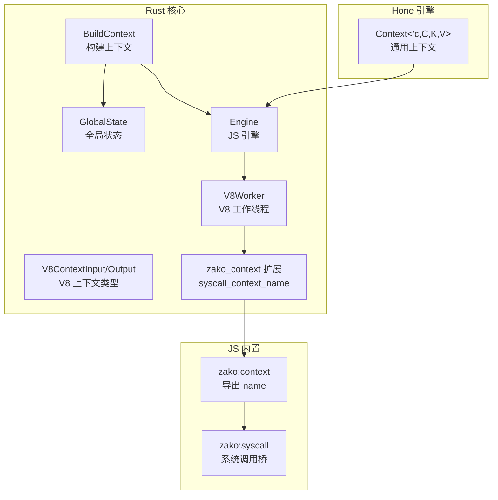
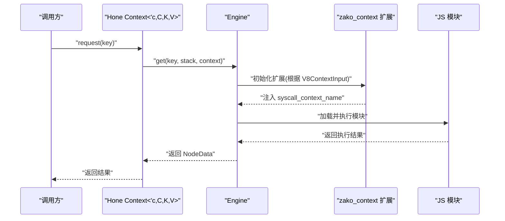
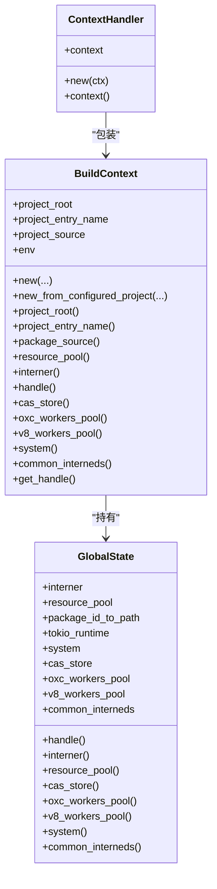
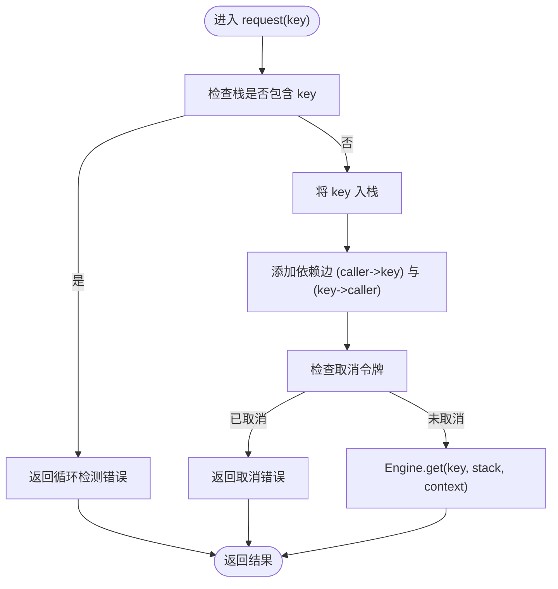
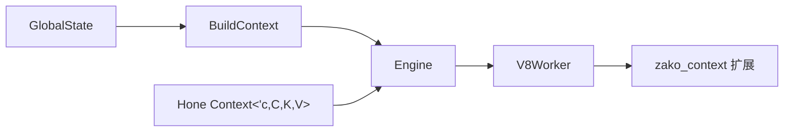

# 上下文API

<cite>
**本文引用的文件**
- [hone/src/context.rs](file://hone/src/context.rs)
- [zako_core/src/context.rs](file://zako_core/src/context.rs)
- [zako_core/src/global_state.rs](file://zako_core/src/global_state.rs)
- [zako_core/src/engine.rs](file://zako_core/src/engine.rs)
- [zako_core/src/builtin/extension/context.rs](file://zako_core/src/builtin/extension/context.rs)
- [zako_js/src/builtins/context/index.ts](file://zako_js/src/builtins/context/index.ts)
- [zako_js/src/builtins/syscall/index.ts](file://zako_js/src/builtins/syscall/index.ts)
- [zako_core/src/worker/v8worker.rs](file://zako_core/src/worker/v8worker.rs)
- [zako_core/src/v8context.rs](file://zako_core/src/v8context.rs)
- [zako_core/src/v8utils.rs](file://zako_core/src/v8utils.rs)
- [hone/src/engine.rs](file://hone/src/engine.rs)
- [zako_core/src/build_constants.rs](file://zako_core/src/build_constants.rs)
- [zako_core/src/file_finder.rs](file://zako_core/src/file_finder.rs)
- [tests/new_project/zako.ts](file://tests/new_project/zako.ts)
- [tests/log_version/zako.ts](file://tests/log_version/zako.ts)
</cite>

## 目录
1. [简介](#简介)
2. [项目结构](#项目结构)
3. [核心组件](#核心组件)
4. [架构总览](#架构总览)
5. [组件详解](#组件详解)
6. [依赖关系分析](#依赖关系分析)
7. [性能考量](#性能考量)
8. [故障排查指南](#故障排查指南)
9. [结论](#结论)
10. [附录](#附录)

## 简介
本文件为 Zako 上下文 API 的权威参考文档，聚焦于“构建上下文”（BuildContext）及其在引擎中的使用方式，涵盖以下主题：
- 构建上下文的属性与方法
- 上下文在不同构建阶段的状态变化
- 环境变量访问、工作目录管理、临时文件处理
- 上下文与系统环境的交互方式
- 上下文数据的持久化与清理机制
- 最佳实践与安全注意事项

## 项目结构
围绕上下文 API 的关键模块分布如下：
- Rust 核心：BuildContext、GlobalState、Engine、V8 执行上下文类型、V8 工作线程初始化
- JS 内置扩展：zako:context 上下文名称导出、zako:syscall 系统调用桥接
- Hone 引擎：通用上下文接口与请求依赖的实现
- 测试样例：展示如何在项目脚本中使用上下文能力

图表来源
- [zako_core/src/context.rs](file://zako_core/src/context.rs#L30-L183)
- [zako_core/src/global_state.rs](file://zako_core/src/global_state.rs#L40-L96)
- [zako_core/src/engine.rs](file://zako_core/src/engine.rs#L47-L79)
- [zako_core/src/worker/v8worker.rs](file://zako_core/src/worker/v8worker.rs#L91-L125)
- [zako_core/src/builtin/extension/context.rs](file://zako_core/src/builtin/extension/context.rs#L19-L40)
- [zako_js/src/builtins/context/index.ts](file://zako_js/src/builtins/context/index.ts#L1-L16)
- [zako_js/src/builtins/syscall/index.ts](file://zako_js/src/builtins/syscall/index.ts#L1-L25)
- [hone/src/context.rs](file://hone/src/context.rs#L23-L151)

章节来源
- [zako_core/src/context.rs](file://zako_core/src/context.rs#L30-L183)
- [zako_core/src/global_state.rs](file://zako_core/src/global_state.rs#L40-L96)
- [zako_core/src/engine.rs](file://zako_core/src/engine.rs#L47-L79)
- [zako_core/src/builtin/extension/context.rs](file://zako_core/src/builtin/extension/context.rs#L19-L40)
- [zako_js/src/builtins/context/index.ts](file://zako_js/src/builtins/context/index.ts#L1-L16)
- [zako_js/src/builtins/syscall/index.ts](file://zako_js/src/builtins/syscall/index.ts#L1-L25)
- [hone/src/context.rs](file://hone/src/context.rs#L23-L151)

## 核心组件
- BuildContext：构建上下文，持有项目根路径、入口名、包源、全局状态等信息，提供资源池、运行时句柄、CAS 存储、工作池等便捷访问器。
- GlobalState：全局共享状态，包含 Interner、资源池、Tokio 运行时、系统信息、CAS 存储、V8/OXC 工作池等。
- Engine：基于 Deno/V8 的执行引擎，负责加载模块、设置执行上下文、执行脚本。
- V8ContextInput/Output：定义不同构建场景下的 V8 上下文类型（如 package、build、rule、toolchain、config），决定权限与能力。
- zako_context 扩展：向 JS 注入 syscall_context_name，用于导出当前上下文名称（例如 "package"）。
- Hone Context：通用上下文接口，支持请求依赖、检测循环、取消令牌、依赖图维护等。

章节来源
- [zako_core/src/context.rs](file://zako_core/src/context.rs#L30-L183)
- [zako_core/src/global_state.rs](file://zako_core/src/global_state.rs#L40-L96)
- [zako_core/src/engine.rs](file://zako_core/src/engine.rs#L47-L79)
- [zako_core/src/v8context.rs](file://zako_core/src/v8context.rs#L13-L61)
- [zako_core/src/builtin/extension/context.rs](file://zako_core/src/builtin/extension/context.rs#L19-L40)
- [hone/src/context.rs](file://hone/src/context.rs#L23-L151)

## 架构总览
Zako 的上下文体系由“Rust 核心上下文 + JS 执行上下文 + 通用 Hone 上下文”三层构成：
- Rust 层提供 BuildContext 和 GlobalState，承载构建期所需的所有资源与配置。
- JS 层通过 zako:context 暴露当前上下文名称，并借助 zako:syscall 与 Rust 侧通信。
- Hone 引擎层提供通用上下文接口，统一处理依赖请求、循环检测、取消与依赖图维护。

图表来源
- [hone/src/context.rs](file://hone/src/context.rs#L92-L150)
- [zako_core/src/engine.rs](file://zako_core/src/engine.rs#L47-L79)
- [zako_core/src/builtin/extension/context.rs](file://zako_core/src/builtin/extension/context.rs#L19-L40)
- [zako_core/src/worker/v8worker.rs](file://zako_core/src/worker/v8worker.rs#L91-L125)

章节来源
- [hone/src/context.rs](file://hone/src/context.rs#L92-L150)
- [zako_core/src/engine.rs](file://zako_core/src/engine.rs#L47-L79)
- [zako_core/src/builtin/extension/context.rs](file://zako_core/src/builtin/extension/context.rs#L19-L40)
- [zako_core/src/worker/v8worker.rs](file://zako_core/src/worker/v8worker.rs#L91-L125)

## 组件详解

### BuildContext（构建上下文）
- 职责
  - 表示一次构建会话的上下文，包含项目根路径、入口名、包源、全局状态等。
  - 提供对资源池、Tokio 句柄、CAS 存储、V8/OXC 工作池、系统信息、公共 Interned 字符串等的访问。
- 关键属性
  - project_root：项目绝对路径（已 Interned）
  - project_entry_name：项目入口文件名（默认来自常量）
  - project_source：包源（已 Interned）
  - env：全局状态（Arc<GlobalState>）
- 关键方法
  - new(...)：从项目根、包源、入口名、全局状态构造上下文
  - new_from_configured_project(...)：从已配置项目构造上下文
  - project_root()/project_entry_name()/package_source()
  - resource_pool()/interner()/handle()/cas_store()/oxc_workers_pool()/v8_workers_pool()/system()/common_interneds()
  - get_handle()：返回 ContextHandler（Arc<BuildContext> 包装）

图表来源
- [zako_core/src/context.rs](file://zako_core/src/context.rs#L30-L183)
- [zako_core/src/global_state.rs](file://zako_core/src/global_state.rs#L40-L96)

章节来源
- [zako_core/src/context.rs](file://zako_core/src/context.rs#L30-L183)
- [zako_core/src/global_state.rs](file://zako_core/src/global_state.rs#L40-L96)

### GlobalState（全局状态）
- 职责
  - 初始化并持有全局共享资源：Interner、资源池、Tokio 运行时、系统信息、CAS 存储、V8/OXC 工作池。
  - 提供统一的访问器以供上下文使用。
- 关键方法
  - new(...)：根据资源池、CAS 配置、工作池配置创建全局状态
  - handle()/interner()/resource_pool()/cas_store()/oxc_workers_pool()/v8_workers_pool()/system()/common_interneds()

章节来源
- [zako_core/src/global_state.rs](file://zako_core/src/global_state.rs#L54-L96)
- [zako_core/src/global_state.rs](file://zako_core/src/global_state.rs#L117-L151)

### Engine（JS 引擎）
- 职责
  - 初始化 V8 平台与扩展，加载并执行 ES 模块，支持传入 JSON 输入到执行上下文。
- 关键方法
  - new(...)：创建引擎实例，注册扩展
  - execute_module(...)
  - execute_module_with_json(...)/execute_module_with_json_and_then(...)
  - get_runtime()

章节来源
- [zako_core/src/engine.rs](file://zako_core/src/engine.rs#L47-L79)
- [zako_core/src/engine.rs](file://zako_core/src/engine.rs#L81-L166)
- [zako_core/src/engine.rs](file://zako_core/src/engine.rs#L234-L300)
- [zako_core/src/engine.rs](file://zako_core/src/engine.rs#L302-L305)

### V8ContextInput/Output（V8 执行上下文类型）
- 职责
  - 定义不同构建场景下的 V8 上下文类型，决定可用模块与权限。
- 类型
  - Package/Build/Rule/Toolchain/Config：分别对应项目脚本、构建文件、规则文件、工具链文件、配置文件。

章节来源
- [zako_core/src/v8context.rs](file://zako_core/src/v8context.rs#L13-L61)

### zako_context 扩展与 JS 导出
- 职责
  - 在 V8 中注入 syscall_context_name，供 JS 通过 zako:context 使用。
  - JS 侧导出 name，表示当前上下文名称（如 "package"）。
- JS 侧
  - zako:context 导出 name，内部通过 zako:syscall 获取上下文名称。

章节来源
- [zako_core/src/builtin/extension/context.rs](file://zako_core/src/builtin/extension/context.rs#L19-L40)
- [zako_js/src/builtins/context/index.ts](file://zako_js/src/builtins/context/index.ts#L1-L16)
- [zako_js/src/builtins/syscall/index.ts](file://zako_js/src/builtins/syscall/index.ts#L1-L25)

### Hone Context（通用上下文）
- 职责
  - 在 Hone 引擎中提供通用上下文，支持请求依赖、检测循环、取消令牌、依赖图维护。
- 关键方法
  - request(key)/request_with_context(key, context)
  - engine()/caller()/this()/old_data()/context()/cancel_token()
- 循环检测与依赖图
  - 在请求前检查栈中是否已存在 key，避免循环依赖。
  - 动态注册父子依赖边。

图表来源
- [hone/src/context.rs](file://hone/src/context.rs#L92-L150)

章节来源
- [hone/src/context.rs](file://hone/src/context.rs#L23-L151)

### 上下文在不同构建阶段的状态变化
- 阶段一：初始化
  - BuildContext.new(...) 或 new_from_configured_project(...) 构造上下文
  - GlobalState.new(...) 初始化全局资源
- 阶段二：执行准备
  - V8ContextInput 决定上下文类型（package/build/rule/toolchain/config）
  - zako_context 扩展注入 syscall_context_name
- 阶段三：执行与依赖解析
  - Hone Context.request(...) 触发依赖解析与循环检测
  - Engine.execute_module(...) 加载并执行模块
- 阶段四：持久化与清理
  - 引擎写入数据库（仅持久化 Verified 与 Dirty 节点）
  - 清理临时资源与工作池

章节来源
- [zako_core/src/context.rs](file://zako_core/src/context.rs#L59-L104)
- [zako_core/src/global_state.rs](file://zako_core/src/global_state.rs#L54-L96)
- [zako_core/src/v8context.rs](file://zako_core/src/v8context.rs#L13-L61)
- [zako_core/src/builtin/extension/context.rs](file://zako_core/src/builtin/extension/context.rs#L19-L40)
- [hone/src/context.rs](file://hone/src/context.rs#L92-L150)
- [hone/src/engine.rs](file://hone/src/engine.rs#L239-L243)

### 环境变量访问、工作目录管理、临时文件处理
- 环境变量访问
  - 通过 PATH 环境变量进行可执行文件查找（FileFinder.from_path_env）
- 工作目录管理
  - BuildContext.project_root 提供项目根路径（绝对路径）
  - 通过 InternedAbsolutePath 保证路径唯一性与跨模块共享
- 临时文件处理
  - CAS 存储与本地 CAS（LocalCas）用于缓存与临时内容
  - V8/OXC 工作池用于并发处理任务

章节来源
- [zako_core/src/file_finder.rs](file://zako_core/src/file_finder.rs#L27-L34)
- [zako_core/src/context.rs](file://zako_core/src/context.rs#L108-L110)
- [zako_core/src/global_state.rs](file://zako_core/src/global_state.rs#L81-L84)
- [zako_core/src/global_state.rs](file://zako_core/src/global_state.rs#L125-L139)

### 上下文与系统环境的交互方式
- 系统信息
  - GlobalState.system 提供 sysinfo::System 实例
- 运行时与线程栈
  - GlobalState.tokio_runtime 根据 CPU 数与系统信息配置线程数与栈大小
- 资源池
  - GlobalState.resource_pool 提供资源约束与限制

章节来源
- [zako_core/src/global_state.rs](file://zako_core/src/global_state.rs#L62-L89)
- [zako_core/src/global_state.rs](file://zako_core/src/global_state.rs#L141-L145)

### 上下文数据的持久化与清理机制
- 持久化
  - 引擎写入数据库，仅持久化 Verified 与 Dirty 节点
  - 跳过 Computing 与 Failed 节点
- 清理
  - 临时内容存储于 CAS
  - 工作池在生命周期结束时释放资源

章节来源
- [hone/src/engine.rs](file://hone/src/engine.rs#L239-L243)

### 最佳实践与安全注意事项
- 最佳实践
  - 使用 BuildContext.new_from_configured_project(...) 从已配置项目构造上下文，确保入口名与包源一致
  - 通过 GlobalState.handle() 获取 Tokio 句柄，确保异步操作在线程池中执行
  - 合理使用 CAS 存储，避免重复计算与 IO 抖动
  - 在 JS 层通过 zako:context 获取上下文名称，避免硬编码字符串
- 安全注意事项
  - 严格控制 V8ContextInput 权限范围，避免在 config/rule 场景下访问系统敏感资源
  - 使用 Sandbox 限制文件系统访问（如适用）
  - 在 Hone Context.request(...) 中启用循环检测，防止无限递归

章节来源
- [zako_core/src/context.rs](file://zako_core/src/context.rs#L88-L104)
- [zako_core/src/global_state.rs](file://zako_core/src/global_state.rs#L54-L96)
- [zako_core/src/v8context.rs](file://zako_core/src/v8context.rs#L13-L37)
- [hone/src/context.rs](file://hone/src/context.rs#L92-L150)

## 依赖关系分析
- BuildContext 依赖 GlobalState 提供的资源与运行时
- Engine 依赖 BuildContext 提供的上下文信息，并通过扩展注入 JS 能力
- V8Worker 根据 V8ContextInput 初始化 zako_context 扩展
- Hone Context 依赖 Engine 完成依赖解析与执行

图表来源
- [zako_core/src/context.rs](file://zako_core/src/context.rs#L30-L183)
- [zako_core/src/global_state.rs](file://zako_core/src/global_state.rs#L40-L96)
- [zako_core/src/engine.rs](file://zako_core/src/engine.rs#L47-L79)
- [zako_core/src/worker/v8worker.rs](file://zako_core/src/worker/v8worker.rs#L91-L125)
- [zako_core/src/builtin/extension/context.rs](file://zako_core/src/builtin/extension/context.rs#L19-L40)
- [hone/src/context.rs](file://hone/src/context.rs#L23-L151)

章节来源
- [zako_core/src/context.rs](file://zako_core/src/context.rs#L30-L183)
- [zako_core/src/global_state.rs](file://zako_core/src/global_state.rs#L40-L96)
- [zako_core/src/engine.rs](file://zako_core/src/engine.rs#L47-L79)
- [zako_core/src/worker/v8worker.rs](file://zako_core/src/worker/v8worker.rs#L91-L125)
- [zako_core/src/builtin/extension/context.rs](file://zako_core/src/builtin/extension/context.rs#L19-L40)
- [hone/src/context.rs](file://hone/src/context.rs#L23-L151)

## 性能考量
- 线程与运行时
  - GlobalState 根据 CPU 数与系统信息配置 Tokio 运行时，提升并发性能
- 工作池
  - V8/OXC 工作池按需启动，减少上下文切换开销
- CAS 缓存
  - 通过 CAS 存储减少重复计算与 IO
- 引擎执行
  - Engine.execute_module_with_json_and_then 支持将输入注入执行上下文，避免额外序列化成本

章节来源
- [zako_core/src/global_state.rs](file://zako_core/src/global_state.rs#L62-L89)
- [zako_core/src/global_state.rs](file://zako_core/src/global_state.rs#L93-L96)
- [zako_core/src/engine.rs](file://zako_core/src/engine.rs#L234-L300)

## 故障排查指南
- 循环依赖
  - 症状：Hone Context.request(...) 抛出循环检测错误
  - 处理：检查依赖图，移除循环边或拆分目标
- 取消异常
  - 症状：请求过程中返回取消错误
  - 处理：检查取消令牌状态与原因
- V8 执行异常
  - 症状：Engine.execute_module_with_json_and_then 抛出 V8Error
  - 处理：查看异常堆栈，定位 JS 层问题
- 路径非绝对
  - 症状：BuildContext.new(...) 报错“项目根路径不是绝对路径”
  - 处理：确保传入绝对路径

章节来源
- [hone/src/context.rs](file://hone/src/context.rs#L92-L150)
- [zako_core/src/context.rs](file://zako_core/src/context.rs#L18-L28)
- [zako_core/src/engine.rs](file://zako_core/src/engine.rs#L234-L300)

## 结论
Zako 的上下文 API 通过 BuildContext、GlobalState、Engine、V8 执行上下文与 Hone 通用上下文形成完整闭环，既满足构建期对资源与权限的精细控制，又提供灵活的 JS 扩展能力。遵循本文的最佳实践与安全注意事项，可在保证性能的同时获得稳定可靠的构建体验。

## 附录
- 使用示例（测试项目）
  - 新项目示例：展示如何声明项目元数据与添加构建/规则
  - 版本日志示例：展示如何读取配置与打印版本信息

章节来源
- [tests/new_project/zako.ts](file://tests/new_project/zako.ts#L1-L22)
- [tests/log_version/zako.ts](file://tests/log_version/zako.ts#L1-L13)