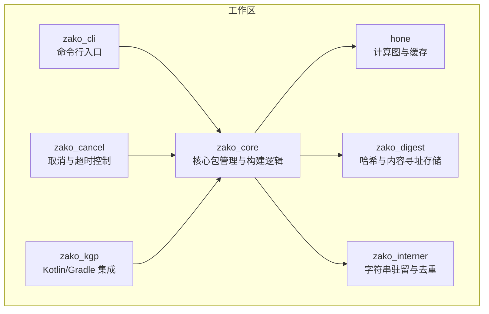
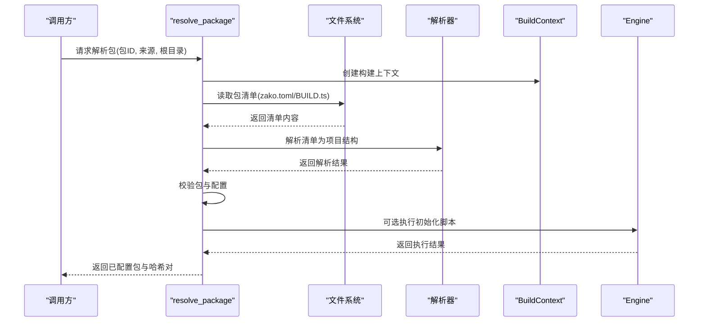
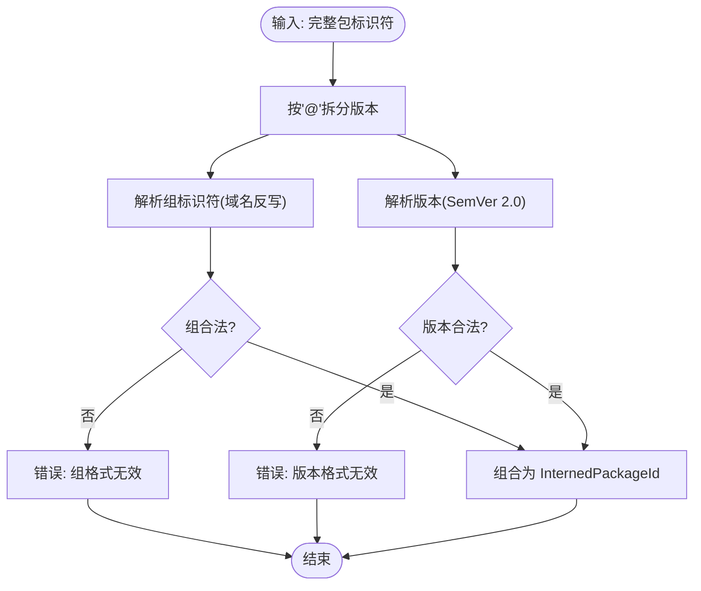
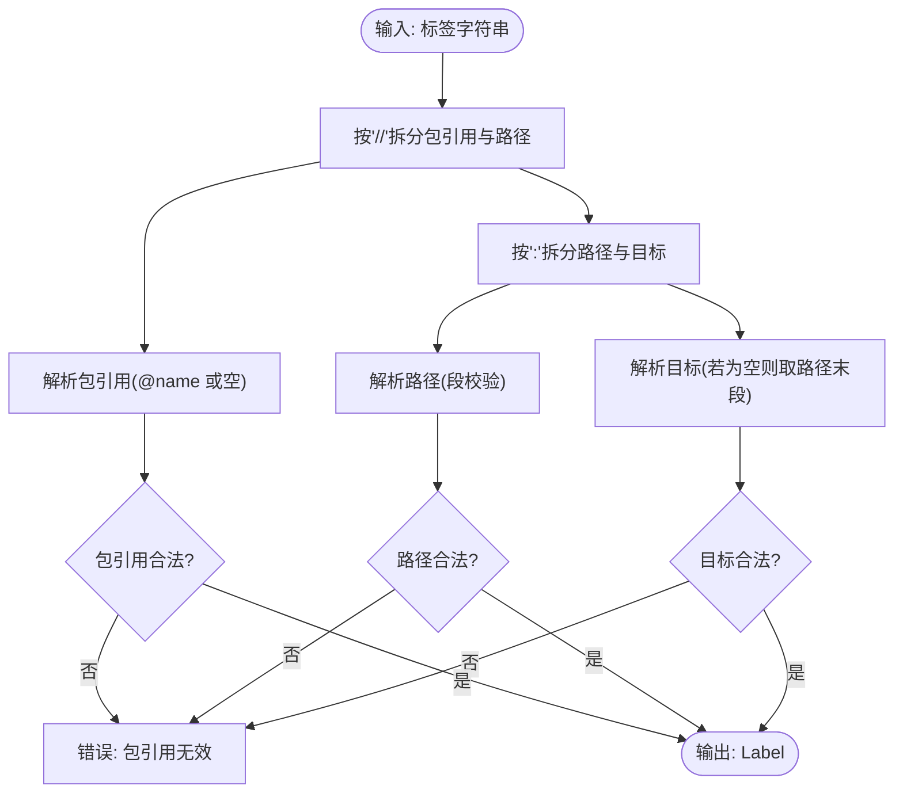
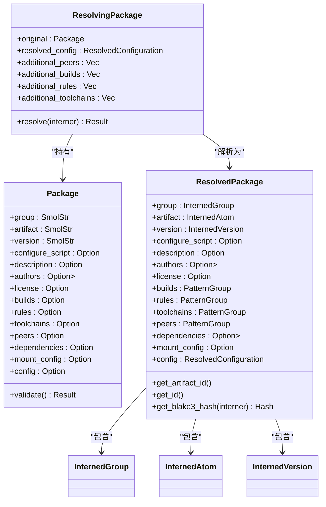
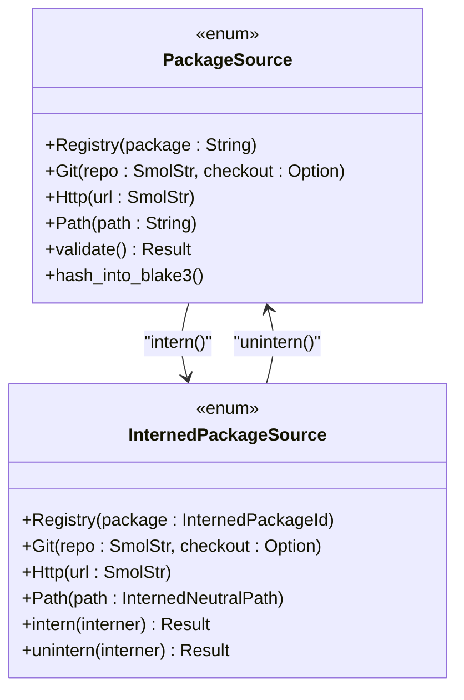
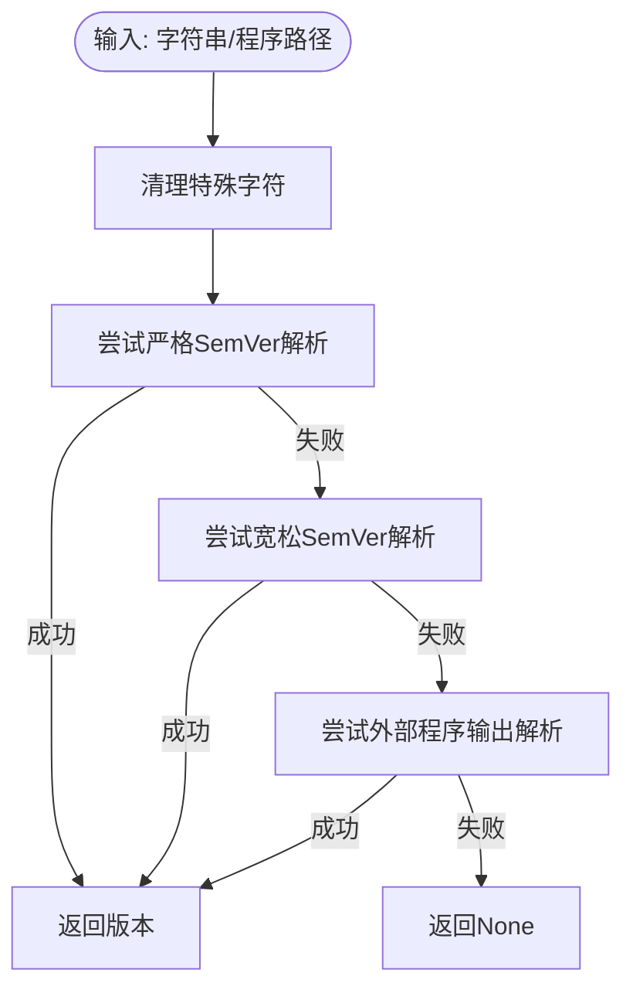
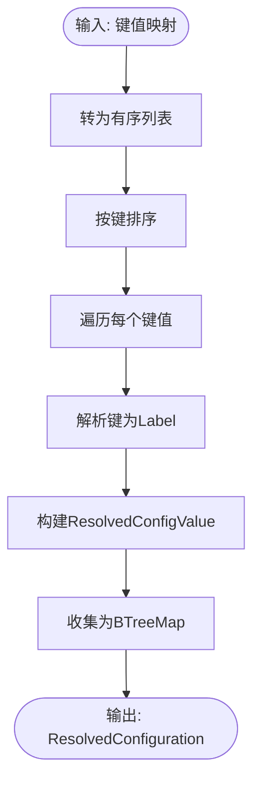
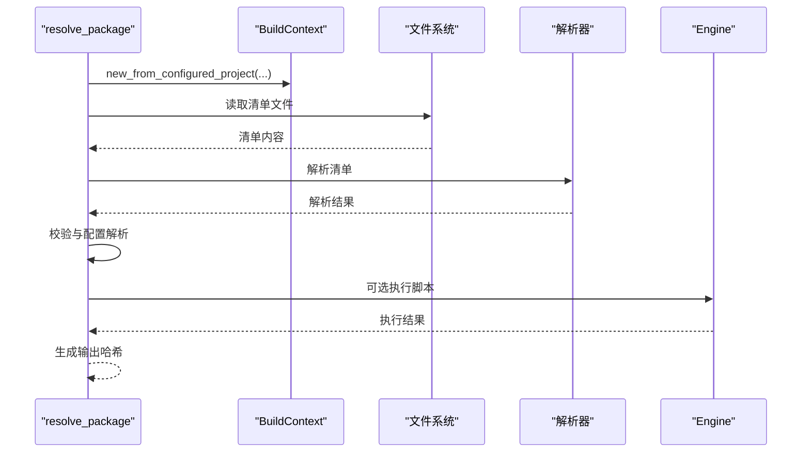
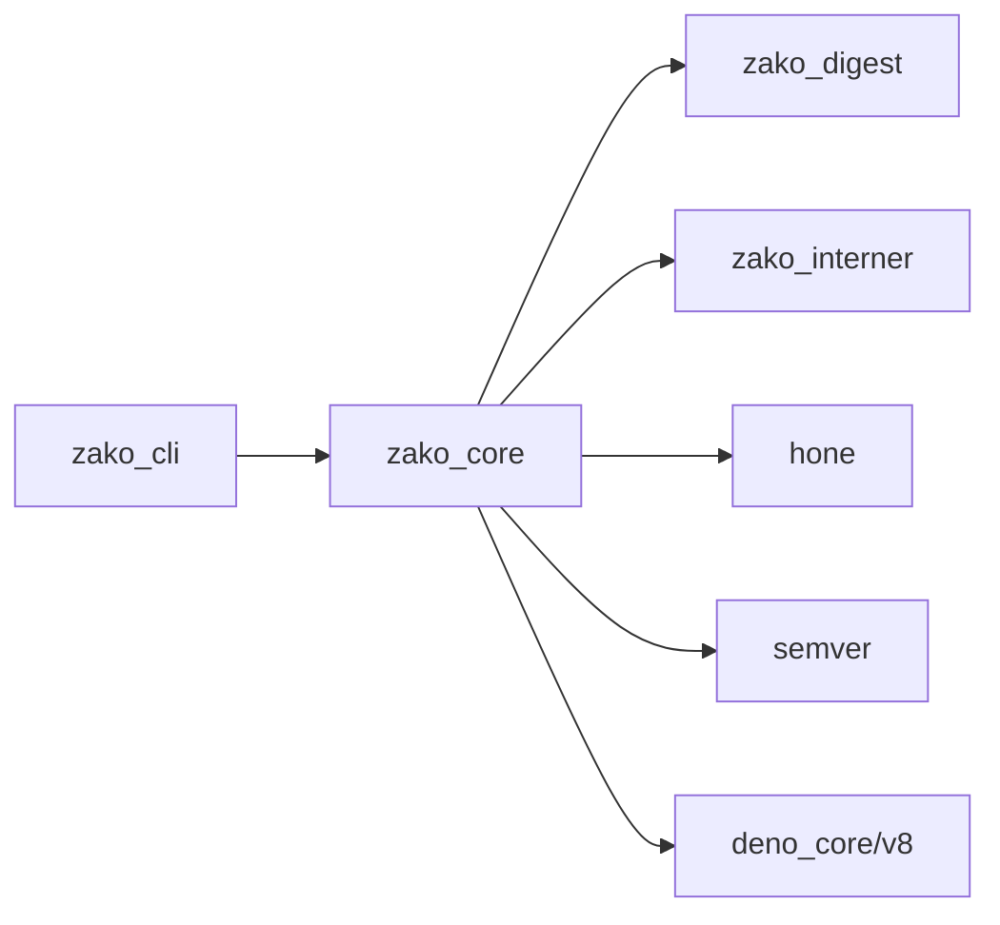

# 包管理API

<cite>
**本文档引用的文件**
- [zako_core/src/lib.rs](file://zako_core/src/lib.rs)
- [zako_core/src/package.rs](file://zako_core/src/package.rs)
- [zako_core/src/package_id.rs](file://zako_core/src/package_id.rs)
- [zako_core/src/id.rs](file://zako_core/src/id.rs)
- [zako_core/src/version_extractor.rs](file://zako_core/src/version_extractor.rs)
- [zako_core/src/package_source.rs](file://zako_core/src/package_source.rs)
- [zako_core/src/compute/resolve_package.rs](file://zako_core/src/compute/resolve_package.rs)
- [zako_core/src/engine.rs](file://zako_core/src/engine.rs)
- [zako_core/src/context.rs](file://zako_core/src/context.rs)
- [zako_core/src/config.rs](file://zako_core/src/config.rs)
- [zako_core/src/tests/package_tests.rs](file://zako_core/src/tests/package_tests.rs)
- [zako_core/src/tests/id_tests.rs](file://zako_core/src/tests/id_tests.rs)
- [Cargo.toml](file://Cargo.toml)
- [zako_core/bindings/package.d.ts](file://zako_core/bindings/package.d.ts)
</cite>

## 目录
1. [简介](#简介)
2. [项目结构](#项目结构)
3. [核心组件](#核心组件)
4. [架构总览](#架构总览)
5. [详细组件分析](#详细组件分析)
6. [依赖关系分析](#依赖关系分析)
7. [性能考量](#性能考量)
8. [故障排查指南](#故障排查指南)
9. [结论](#结论)
10. [附录](#附录)

## 简介
本文件为 Zako 包管理 API 的权威参考文档，覆盖包发现、版本解析、依赖管理、包标识符格式与解析、包元数据获取与验证、包与项目结构关系、以及包缓存、下载、安装等操作的 API 使用要点。文档同时提供最佳实践与版本冲突解决方案，并通过图示帮助读者快速理解系统架构与关键流程。

## 项目结构
Zako 采用多 crate 工作区组织，核心包管理逻辑集中在 zako_core 中，CLI 交互在 zako_cli，类型绑定通过 ts-rs 导出到 TypeScript 类型定义文件，便于前端工具链集成。

图表来源
- [Cargo.toml](file://Cargo.toml#L11-L22)
- [zako_core/src/lib.rs](file://zako_core/src/lib.rs#L30-L80)

章节来源
- [Cargo.toml](file://Cargo.toml#L11-L22)
- [zako_core/src/lib.rs](file://zako_core/src/lib.rs#L1-L119)

## 核心组件
- 包模型与解析：Package、ResolvingPackage、ResolvedPackage 提供包的声明、解析与最终驻留形态，支持配置键与依赖键的合法性校验。
- 包标识符：InternedPackageId、InternedArtifactId、InternedVersion、InternedGroup 统一包标识符的解析与驻留，遵循 SemVer 2.0 与域名反写规则。
- 包来源：PackageSource 与 InternedPackageSource 描述包的来源（注册表、Git、HTTP、本地路径），并进行路径安全校验。
- 版本提取：version_extractor 提供从字符串或外部程序输出中提取语义化版本的能力。
- 配置系统：Configuration 与 ResolvedConfiguration 将原始配置转换为可索引的驻留配置，支持标签解析。
- 构建上下文：BuildContext 为包解析与构建提供统一的环境与资源池。
- 引擎执行：Engine 提供 V8 引擎封装，用于执行脚本与扩展模块。

章节来源
- [zako_core/src/package.rs](file://zako_core/src/package.rs#L68-L115)
- [zako_core/src/package_id.rs](file://zako_core/src/package_id.rs#L21-L112)
- [zako_core/src/package_source.rs](file://zako_core/src/package_source.rs#L25-L84)
- [zako_core/src/version_extractor.rs](file://zako_core/src/version_extractor.rs#L1-L71)
- [zako_core/src/config.rs](file://zako_core/src/config.rs#L14-L78)
- [zako_core/src/context.rs](file://zako_core/src/context.rs#L30-L86)
- [zako_core/src/engine.rs](file://zako_core/src/engine.rs#L33-L79)

## 架构总览
包管理 API 的关键流程围绕“解析包清单 → 校验与驻留 → 计算哈希 → 生成配置 → 执行脚本/扩展 → 产出结果”的闭环展开。计算图通过 HONE 与 CAS 存储实现缓存与增量构建。

图表来源
- [zako_core/src/compute/resolve_package.rs](file://zako_core/src/compute/resolve_package.rs#L27-L139)
- [zako_core/src/context.rs](file://zako_core/src/context.rs#L59-L86)
- [zako_core/src/engine.rs](file://zako_core/src/engine.rs#L81-L109)

章节来源
- [zako_core/src/compute/resolve_package.rs](file://zako_core/src/compute/resolve_package.rs#L27-L139)
- [zako_core/src/context.rs](file://zako_core/src/context.rs#L30-L86)
- [zako_core/src/engine.rs](file://zako_core/src/engine.rs#L33-L79)

## 详细组件分析

### 包标识符与解析规则
- 组标识符（Group）：域名反写，各段需满足宽松标识符规则；不允许空串。
- 工件标识符（Artifact）：使用冒号分隔组与名称，如 "moe.fra:zako"。
- 版本（Version）：严格遵循 SemVer 2.0.0。
- 完整包标识符（PackageId）：形如 "group:name@version"，解析后得到 InternedPackageId。

图表来源
- [zako_core/src/package_id.rs](file://zako_core/src/package_id.rs#L89-L112)
- [zako_core/src/package_id.rs](file://zako_core/src/package_id.rs#L184-L196)

章节来源
- [zako_core/src/package_id.rs](file://zako_core/src/package_id.rs#L21-L112)
- [zako_core/src/package_id.rs](file://zako_core/src/package_id.rs#L114-L206)
- [zako_core/src/tests/package_tests.rs](file://zako_core/src/tests/package_tests.rs#L4-L42)

### 包标识符与标签解析
- 标签（Label）：用于定位包内目标，格式为 "@pkg//path:target"，支持省略包引用、路径为空、目标为空（默认取路径最后一段）。
- 内部实现使用 is_loose_ident 与 is_more_loose_ident 对路径与原子标识符进行严格校验，确保安全性与一致性。

图表来源
- [zako_core/src/id.rs](file://zako_core/src/id.rs#L357-L386)

章节来源
- [zako_core/src/id.rs](file://zako_core/src/id.rs#L106-L146)
- [zako_core/src/id.rs](file://zako_core/src/id.rs#L148-L226)
- [zako_core/src/id.rs](file://zako_core/src/id.rs#L227-L270)
- [zako_core/src/id.rs](file://zako_core/src/id.rs#L271-L387)
- [zako_core/src/tests/id_tests.rs](file://zako_core/src/tests/id_tests.rs#L98-L126)

### 包元数据获取与验证
- Package 结构体包含 group、artifact、version、描述、作者、许可证、模式（builds/rules/toolchains/peers）、依赖、挂载配置与配置映射等字段。
- validate 方法对配置键与依赖键进行 is_loose_ident 校验，确保键名符合规范。
- ResolvingPackage 在解析阶段将原始 Package 与已解析配置结合，形成 ResolvedPackage，随后生成 Blake3 哈希作为缓存键。

图表来源
- [zako_core/src/package.rs](file://zako_core/src/package.rs#L68-L115)
- [zako_core/src/package.rs](file://zako_core/src/package.rs#L136-L221)
- [zako_core/src/package.rs](file://zako_core/src/package.rs#L223-L318)

章节来源
- [zako_core/src/package.rs](file://zako_core/src/package.rs#L68-L115)
- [zako_core/src/package.rs](file://zako_core/src/package.rs#L136-L221)
- [zako_core/src/package.rs](file://zako_core/src/package.rs#L223-L318)

### 包来源与安全校验
- PackageSource 支持注册表、Git、HTTP、本地路径四种来源；Path 类型要求相对路径且位于项目根之下。
- InternedPackageSource 为已驻留且经过安全校验的来源表示，便于跨模块传递与缓存。

图表来源
- [zako_core/src/package_source.rs](file://zako_core/src/package_source.rs#L25-L84)
- [zako_core/src/package_source.rs](file://zako_core/src/package_source.rs#L100-L173)

章节来源
- [zako_core/src/package_source.rs](file://zako_core/src/package_source.rs#L25-L84)
- [zako_core/src/package_source.rs](file://zako_core/src/package_source.rs#L100-L173)

### 版本解析与提取
- 从字符串中提取版本：尝试严格 SemVer 与宽松版本解析，支持去除括号与引号后的清理处理。
- 从外部程序输出提取版本：通过 --version/-V 参数捕获 stdout/stderr 并解析。

图表来源
- [zako_core/src/version_extractor.rs](file://zako_core/src/version_extractor.rs#L6-L24)
- [zako_core/src/version_extractor.rs](file://zako_core/src/version_extractor.rs#L26-L47)
- [zako_core/src/version_extractor.rs](file://zako_core/src/version_extractor.rs#L49-L71)

章节来源
- [zako_core/src/version_extractor.rs](file://zako_core/src/version_extractor.rs#L1-L71)

### 配置系统与标签解析
- Configuration 接受键值映射，键为标签字符串，值为 ConfigValue；resolve 将其转换为 ResolvedConfiguration。
- Label::try_parse 将标签解析为三段式结构，支持省略与默认推断。

图表来源
- [zako_core/src/config.rs](file://zako_core/src/config.rs#L41-L72)
- [zako_core/src/id.rs](file://zako_core/src/id.rs#L357-L386)

章节来源
- [zako_core/src/config.rs](file://zako_core/src/config.rs#L14-L78)
- [zako_core/src/id.rs](file://zako_core/src/id.rs#L357-L386)

### 包解析与构建上下文
- resolve_package 读取包清单，构建 BuildContext，解析清单为项目结构，校验并生成 ResolvedPackage，最后产出哈希对与配置包。
- BuildContext 提供项目根、入口名、包来源、全局状态与资源池访问能力。

图表来源
- [zako_core/src/compute/resolve_package.rs](file://zako_core/src/compute/resolve_package.rs#L27-L139)
- [zako_core/src/context.rs](file://zako_core/src/context.rs#L88-L104)

章节来源
- [zako_core/src/compute/resolve_package.rs](file://zako_core/src/compute/resolve_package.rs#L27-L139)
- [zako_core/src/context.rs](file://zako_core/src/context.rs#L30-L104)

### 包与项目结构的关系
- 包清单文件（zako.toml/BUILD.ts）定义包的元数据与目标，解析后进入构建图。
- 构建上下文以项目根与入口名确定包的边界与入口，确保路径安全与一致性。
- 标签（Label）用于在包内定位具体目标，支持省略与默认推断，简化用户书写。

章节来源
- [zako_core/src/compute/resolve_package.rs](file://zako_core/src/compute/resolve_package.rs#L60-L87)
- [zako_core/src/context.rs](file://zako_core/src/context.rs#L59-L86)
- [zako_core/src/id.rs](file://zako_core/src/id.rs#L357-L386)

### 包缓存、下载、安装 API 使用要点
- 缓存：ResolvedPackage 与 InternedPackageSource 均实现了 Blake3 哈希，可用于内容寻址存储（CAS）与缓存键生成。
- 下载：PackageSource::Http 与 PackageSource::Git 支持从 HTTP 与 Git 仓库获取包；Path 与 Registry 用于本地与注册表来源。
- 安装：通过 BuildContext 与解析流程完成包安装与依赖解析；可选执行初始化脚本以增强元数据。

章节来源
- [zako_core/src/package.rs](file://zako_core/src/package.rs#L117-L134)
- [zako_core/src/package_source.rs](file://zako_core/src/package_source.rs#L86-L98)
- [zako_core/src/compute/resolve_package.rs](file://zako_core/src/compute/resolve_package.rs#L27-L139)

## 依赖关系分析
- zako_core 依赖 zako_digest（哈希）、zako_interner（驻留）、hone（计算图）、semver（版本解析）、deno_core/v8（脚本执行）等。
- CLI 通过 zako_cli 调用 zako_core 的解析与构建能力。

图表来源
- [Cargo.toml](file://Cargo.toml#L38-L285)

章节来源
- [Cargo.toml](file://Cargo.toml#L38-L285)

## 性能考量
- 驻留与哈希：大量使用 InternedString 与 Blake3 哈希，降低内存占用与比较成本。
- 并发与缓存：使用并发容器与缓存（ConcurrentCache）提升解析与构建吞吐。
- 增量构建：通过输入/输出哈希对与 CAS 存储实现增量与去重。

章节来源
- [zako_core/src/lib.rs](file://zako_core/src/lib.rs#L82-L96)
- [zako_core/src/package.rs](file://zako_core/src/package.rs#L117-L134)
- [zako_core/src/package_source.rs](file://zako_core/src/package_source.rs#L86-L98)

## 故障排查指南
- 包标识符错误：检查组是否为域名反写、版本是否符合 SemVer 2.0、工件与组之间是否使用冒号分隔。
- 标签解析错误：确认标签中 "//" 与 ":" 的使用是否正确，路径段是否满足 is_more_loose_ident 规则。
- 配置键错误：确保配置键为宽松标识符，避免非法字符与空键。
- 包来源路径错误：本地路径必须相对且位于项目根之下，否则会触发路径安全校验失败。
- 外部程序版本提取失败：确认程序存在且支持 --version/-V 参数，检查输出编码与换行。

章节来源
- [zako_core/src/package_id.rs](file://zako_core/src/package_id.rs#L89-L112)
- [zako_core/src/package_id.rs](file://zako_core/src/package_id.rs#L184-L196)
- [zako_core/src/id.rs](file://zako_core/src/id.rs#L67-L90)
- [zako_core/src/id.rs](file://zako_core/src/id.rs#L357-L386)
- [zako_core/src/package.rs](file://zako_core/src/package.rs#L90-L114)
- [zako_core/src/package_source.rs](file://zako_core/src/package_source.rs#L68-L84)
- [zako_core/src/version_extractor.rs](file://zako_core/src/version_extractor.rs#L26-L47)

## 结论
Zako 的包管理 API 通过严格的标识符与来源解析、驻留与哈希机制、以及可扩展的配置与脚本执行能力，提供了高效、可缓存、可复现的包管理体验。遵循本文档的格式规范与最佳实践，可有效避免常见问题并提升构建效率。

## 附录

### 包元数据 TypeScript 类型导出
- Package 类型导出包含字段与注释，便于前端工具链消费与类型检查。

章节来源
- [zako_core/bindings/package.d.ts](file://zako_core/bindings/package.d.ts#L7-L31)