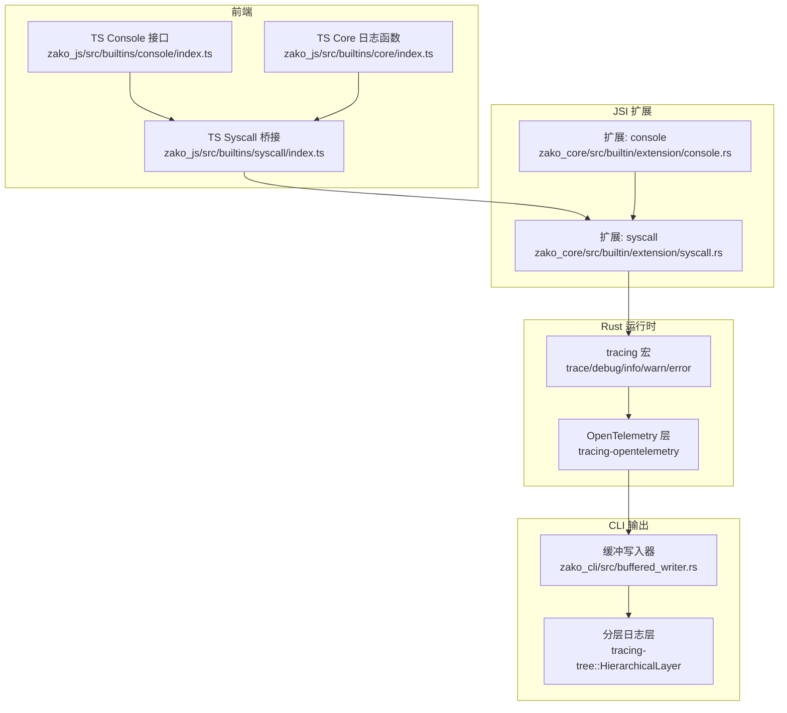
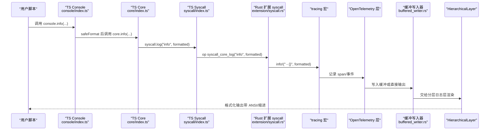
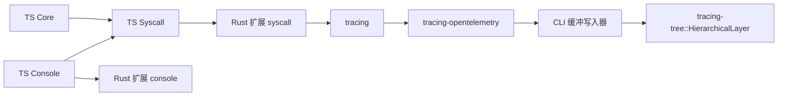

# 控制台API

<cite>
**本文引用的文件**
- [zako_js/src/builtins/console/index.ts](file://zako_js/src/builtins/console/index.ts)
- [zako_js/src/builtins/core/index.ts](file://zako_js/src/builtins/core/index.ts)
- [zako_js/src/builtins/syscall/index.ts](file://zako_js/src/builtins/syscall/index.ts)
- [zako_core/src/builtin/extension/console.rs](file://zako_core/src/builtin/extension/console.rs)
- [zako_core/src/builtin/extension/syscall.rs](file://zako_core/src/builtin/extension/syscall.rs)
- [zako_cli/src/buffered_writer.rs](file://zako_cli/src/buffered_writer.rs)
- [zako_cli/src/main.rs](file://zako_cli/src/main.rs)
- [Cargo.toml](file://Cargo.toml)
- [tests/log_version/zako.ts](file://tests/log_version/zako.ts)
</cite>

## 目录
1. [简介](#简介)
2. [项目结构](#项目结构)
3. [核心组件](#核心组件)
4. [架构总览](#架构总览)
5. [组件详解](#组件详解)
6. [依赖关系分析](#依赖关系分析)
7. [性能与可维护性](#性能与可维护性)
8. [故障排查指南](#故障排查指南)
9. [结论](#结论)
10. [附录：日志使用示例与最佳实践](#附录日志使用示例与最佳实践)

## 简介
本文件为 Zako 控制台 API 的权威参考文档，聚焦于日志记录能力，覆盖 trace、debug、info、warn、error 等日志级别及其在构建流程中的作用与使用方式。文档同时说明日志格式、时间戳、级别标记等信息，提供过滤与输出重定向等高级能力的使用方法，并给出实际示例与调试技巧。

## 项目结构
Zako 的日志体系由前端 TypeScript 接口、JSI（JS 内部）桥接层与 Rust 扩展三层组成，最终通过 CLI 的日志订阅器进行格式化输出与缓冲控制。关键模块如下：
- 前端接口层：提供 console 与 core 日志 API 的类型定义与实现入口
- JSI 桥接层：将 JS API 映射为 DenoCore 操作（ops）
- Rust 扩展层：将日志级别映射到 tracing 宏，并注入 OpenTelemetry 链路
- CLI 订阅器：配置 HierarchicalLayer、ANSI、缩进与缓冲写入器

图表来源
- [zako_js/src/builtins/console/index.ts](file://zako_js/src/builtins/console/index.ts#L1-L10)
- [zako_js/src/builtins/core/index.ts](file://zako_js/src/builtins/core/index.ts#L121-L138)
- [zako_js/src/builtins/syscall/index.ts](file://zako_js/src/builtins/syscall/index.ts#L1-L25)
- [zako_core/src/builtin/extension/console.rs](file://zako_core/src/builtin/extension/console.rs#L1-L8)
- [zako_core/src/builtin/extension/syscall.rs](file://zako_core/src/builtin/extension/syscall.rs#L1-L61)
- [zako_cli/src/buffered_writer.rs](file://zako_cli/src/buffered_writer.rs#L1-L99)
- [zako_cli/src/main.rs](file://zako_cli/src/main.rs#L501-L519)

章节来源
- [zako_js/src/builtins/console/index.ts](file://zako_js/src/builtins/console/index.ts#L1-L10)
- [zako_js/src/builtins/core/index.ts](file://zako_js/src/builtins/core/index.ts#L121-L138)
- [zako_js/src/builtins/syscall/index.ts](file://zako_js/src/builtins/syscall/index.ts#L1-L25)
- [zako_core/src/builtin/extension/console.rs](file://zako_core/src/builtin/extension/console.rs#L1-L8)
- [zako_core/src/builtin/extension/syscall.rs](file://zako_core/src/builtin/extension/syscall.rs#L1-L61)
- [zako_cli/src/buffered_writer.rs](file://zako_cli/src/buffered_writer.rs#L1-L99)
- [zako_cli/src/main.rs](file://zako_cli/src/main.rs#L501-L519)

## 核心组件
- Console 接口与全局重绑定
  - TS Console 接口定义了 trace、debug、log、info、warn、error 六个方法
  - 全局 console 对象由 core 函数包装，统一走 safeFormat 格式化
- Core 日志函数
  - trace、debug、info、warn、error 分别调用 syscall.log 并传递对应级别字符串
- Syscall 桥接
  - syscall.log 将级别与消息转发给 DenoCore ops：syscall_core_log
- Rust 扩展
  - syscall 扩展将级别字符串映射到 tracing::trace/debug/info/warn/error
  - 提供版本查询与错误类型（无效级别、字符串驻留器错误）
- CLI 订阅器与缓冲输出
  - 使用 tracing-tree 的 HierarchicalLayer，支持 ANSI、缩进与自定义 writer
  - 通过缓冲写入器在 silent 模式下清空缓冲或在非 silent 模式下一次性释放

章节来源
- [zako_js/src/builtins/console/index.ts](file://zako_js/src/builtins/console/index.ts#L1-L10)
- [zako_js/src/builtins/core/index.ts](file://zako_js/src/builtins/core/index.ts#L121-L138)
- [zako_js/src/builtins/syscall/index.ts](file://zako_js/src/builtins/syscall/index.ts#L1-L25)
- [zako_core/src/builtin/extension/console.rs](file://zako_core/src/builtin/extension/console.rs#L1-L8)
- [zako_core/src/builtin/extension/syscall.rs](file://zako_core/src/builtin/extension/syscall.rs#L1-L61)
- [zako_cli/src/buffered_writer.rs](file://zako_cli/src/buffered_writer.rs#L1-L99)
- [zako_cli/src/main.rs](file://zako_cli/src/main.rs#L501-L519)

## 架构总览
下面的序列图展示了从 JS 调用到最终输出的关键链路：

图表来源
- [zako_js/src/builtins/console/index.ts](file://zako_js/src/builtins/console/index.ts#L1-L10)
- [zako_js/src/builtins/core/index.ts](file://zako_js/src/builtins/core/index.ts#L121-L138)
- [zako_js/src/builtins/syscall/index.ts](file://zako_js/src/builtins/syscall/index.ts#L1-L25)
- [zako_core/src/builtin/extension/syscall.rs](file://zako_core/src/builtin/extension/syscall.rs#L33-L61)
- [zako_cli/src/buffered_writer.rs](file://zako_cli/src/buffered_writer.rs#L69-L98)
- [zako_cli/src/main.rs](file://zako_cli/src/main.rs#L510-L515)

## 组件详解

### Console 接口与全局对象
- 接口定义：trace、debug、log、info、warn、error
- 全局绑定：safeFormat 将参数安全序列化，支持 Error、BigInt、循环引用保护
- 行为：所有方法最终委托至 core.* 实现

章节来源
- [zako_js/src/builtins/console/index.ts](file://zako_js/src/builtins/console/index.ts#L1-L10)
- [zako_js/src/builtins/global/index.ts](file://zako_js/src/builtins/global/index.ts#L12-L47)

### Core 日志函数
- 实现：每个级别调用 syscall.log(level, message)
- 参数：level 限定为 "trace"|"debug"|"info"|"warn"|"error"；message 为字符串

章节来源
- [zako_js/src/builtins/core/index.ts](file://zako_js/src/builtins/core/index.ts#L121-L138)

### Syscall 桥接
- 类型：Syscall 接口包含 syscall_core_log(level, msg) 与版本查询
- 实现：syscalls.syscall_core_log(level, msg) 直接调用 DenoCore ops

章节来源
- [zako_js/src/builtins/syscall/index.ts](file://zako_js/src/builtins/syscall/index.ts#L1-L25)

### Rust 扩展（syscall）
- ops：syscall_core_version、syscall_core_log
- 日志映射：根据 level 字符串匹配 tracing 宏
- 错误处理：无效级别返回 SyscallError::InvalidLogLevel
- 依赖：tracing、deno_core、boxed_error、deno_error

章节来源
- [zako_core/src/builtin/extension/syscall.rs](file://zako_core/src/builtin/extension/syscall.rs#L1-L61)

### Rust 扩展（console）
- 作用：注册 JS ESM 入口与扩展元数据
- 依赖：zako_global、zako_syscall、zako_semver

章节来源
- [zako_core/src/builtin/extension/console.rs](file://zako_core/src/builtin/extension/console.rs#L1-L8)

### CLI 订阅器与缓冲输出
- 初始化：设置 OpenTelemetry 层与 tracing-tree 的 HierarchicalLayer
- Writer：使用自定义缓冲写入器，支持 silent 模式与 release 一次性输出
- 交互：silent 时清空缓冲避免输出；非 silent 时一次性释放缓冲内容

章节来源
- [zako_cli/src/main.rs](file://zako_cli/src/main.rs#L501-L519)
- [zako_cli/src/buffered_writer.rs](file://zako_cli/src/buffered_writer.rs#L1-L99)

## 依赖关系分析
- 外部依赖
  - tracing、tracing-subscriber、tracing-tree、tracing-opentelemetry
  - deno_core、deno_error、boxed_error
- 内部依赖
  - zako_js 通过 console、core、syscall 三类内置模块与 zako_core 的扩展对接
  - zako_cli 通过 buffered_writer.rs 与 tracing-tree 配置输出

图表来源
- [Cargo.toml](file://Cargo.toml#L63-L91)
- [zako_js/src/builtins/syscall/index.ts](file://zako_js/src/builtins/syscall/index.ts#L1-L25)
- [zako_core/src/builtin/extension/syscall.rs](file://zako_core/src/builtin/extension/syscall.rs#L1-L61)
- [zako_cli/src/buffered_writer.rs](file://zako_cli/src/buffered_writer.rs#L1-L99)
- [zako_cli/src/main.rs](file://zako_cli/src/main.rs#L510-L515)

章节来源
- [Cargo.toml](file://Cargo.toml#L63-L91)
- [zako_js/src/builtins/syscall/index.ts](file://zako_js/src/builtins/syscall/index.ts#L1-L25)
- [zako_core/src/builtin/extension/syscall.rs](file://zako_core/src/builtin/extension/syscall.rs#L1-L61)
- [zako_cli/src/buffered_writer.rs](file://zako_cli/src/buffered_writer.rs#L1-L99)
- [zako_cli/src/main.rs](file://zako_cli/src/main.rs#L510-L515)

## 性能与可维护性
- 性能特性
  - 日志通过 tracing 与 tracing-tree 渲染，支持 ANSI 与缩进，便于可观测性但会引入少量开销
  - 缓冲写入器在 silent 模式下避免输出，减少 I/O 成本
- 可维护性
  - 日志级别与 tracing 宏一一对应，便于统一管理
  - 通过 OpenTelemetry 层可扩展分布式追踪与指标采集

[本节为通用建议，不直接分析具体文件]

## 故障排查指南
- 无效日志级别
  - 现象：调用 syscall_core_log 时返回 InvalidLogLevel 错误
  - 排查：确认 JS 侧传入的 level 是否为 "trace"|"debug"|"info"|"warn"|"error"
- 输出未显示
  - 现象：silent 模式下无输出
  - 排查：检查 CLI silent 参数与缓冲写入器 silent() 调用
- 格式化异常
  - 现象：对象或循环引用导致格式化失败
  - 排查：safeFormat 已做容错，若仍异常，检查输入类型与 JSON 序列化行为

章节来源
- [zako_core/src/builtin/extension/syscall.rs](file://zako_core/src/builtin/extension/syscall.rs#L8-L16)
- [zako_js/src/builtins/global/index.ts](file://zako_js/src/builtins/global/index.ts#L12-L28)
- [zako_cli/src/buffered_writer.rs](file://zako_cli/src/buffered_writer.rs#L42-L46)

## 结论
Zako 的控制台日志体系以清晰的分层设计实现了从 JS 到 Rust 的完整闭环：前端提供一致的 API，JSI 桥接保证类型安全，Rust 扩展映射到成熟的 tracing 生态，并通过 CLI 的分层日志与缓冲机制实现可控的输出与性能平衡。结合 OpenTelemetry，该体系既满足本地开发调试，也为后续可观测性建设打下基础。

[本节为总结性内容，不直接分析具体文件]

## 附录：日志使用示例与最佳实践

### 日志级别与适用场景
- trace：极细粒度的执行轨迹，适合调试复杂流程与性能热点定位
- debug：开发期辅助信息，如中间状态、变量取值
- info：常规运行信息，如任务开始/结束、关键步骤提示
- warn：潜在问题但不影响流程，如弃用选项、降级策略
- error：错误事件，如失败、异常、不可恢复条件

[本小节为概念性说明，不直接分析具体文件]

### 日志格式与时间戳
- 格式：由 tracing-tree 的 HierarchicalLayer 渲染，支持 ANSI 颜色与层级缩进
- 时间戳：默认由日志层输出；可通过自定义格式器增强（需扩展）

[本小节为概念性说明，不直接分析具体文件]

### 实际示例与调试技巧
- 在脚本中使用 core.trace/info/warn/error 记录构建阶段信息
- 使用 tests/log_version/zako.ts 中的示例思路，在条件满足时动态启用构建目标
- 调试技巧
  - 通过 silent 模式抑制输出，集中排查问题
  - 使用 backtrace 相关环境变量提升错误上下文
  - 在 CI 中结合 OpenTelemetry 导出链路数据

章节来源
- [tests/log_version/zako.ts](file://tests/log_version/zako.ts#L1-L13)
- [zako_js/src/builtins/core/index.ts](file://zako_js/src/builtins/core/index.ts#L121-L138)
- [zako_cli/src/main.rs](file://zako_cli/src/main.rs#L470-L499)

### 高级功能：日志过滤与输出重定向
- 过滤
  - 可通过 tracing filter 语法按模块/级别过滤（需在初始化时配置）
- 重定向
  - 通过自定义 writer 将输出重定向到文件或网络（当前缓冲写入器支持 stdout）
  - silent 模式可完全禁用输出并清空缓冲

章节来源
- [zako_cli/src/buffered_writer.rs](file://zako_cli/src/buffered_writer.rs#L1-L99)
- [zako_cli/src/main.rs](file://zako_cli/src/main.rs#L501-L519)