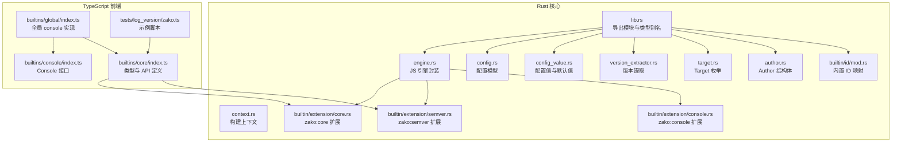
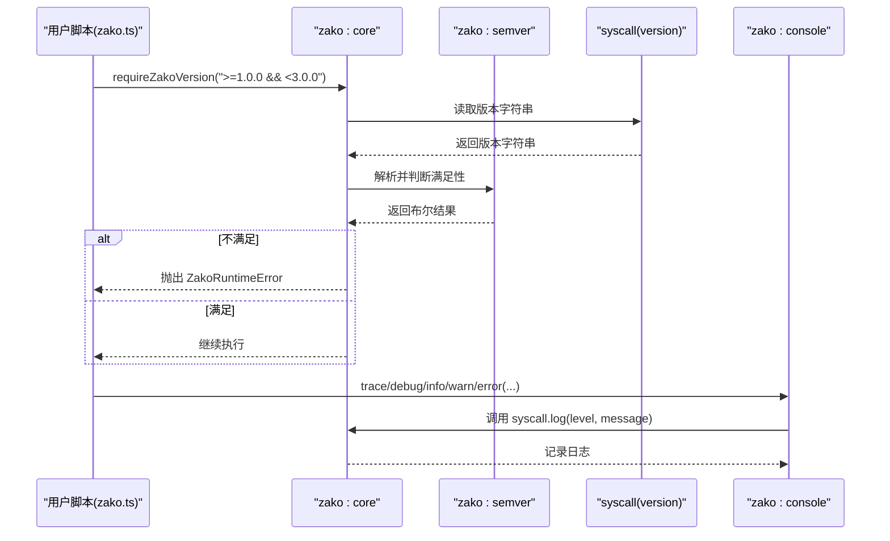
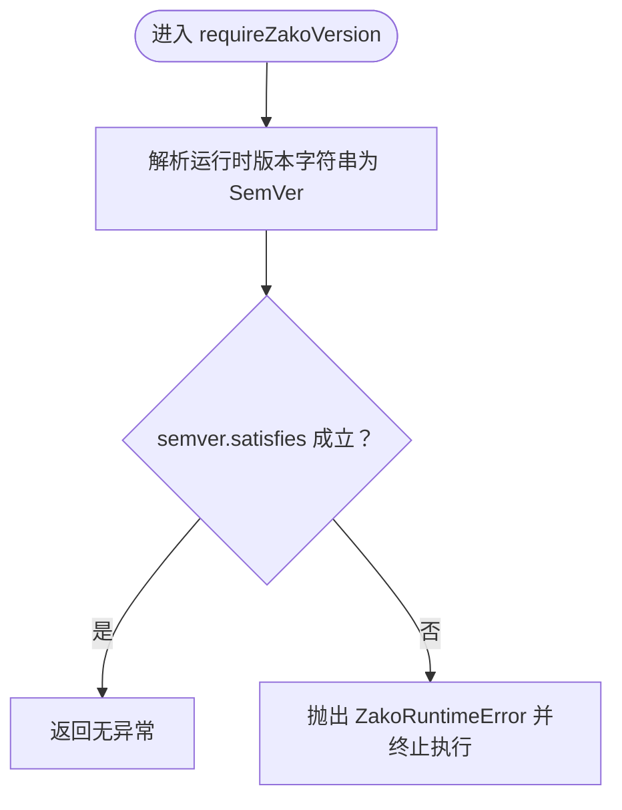
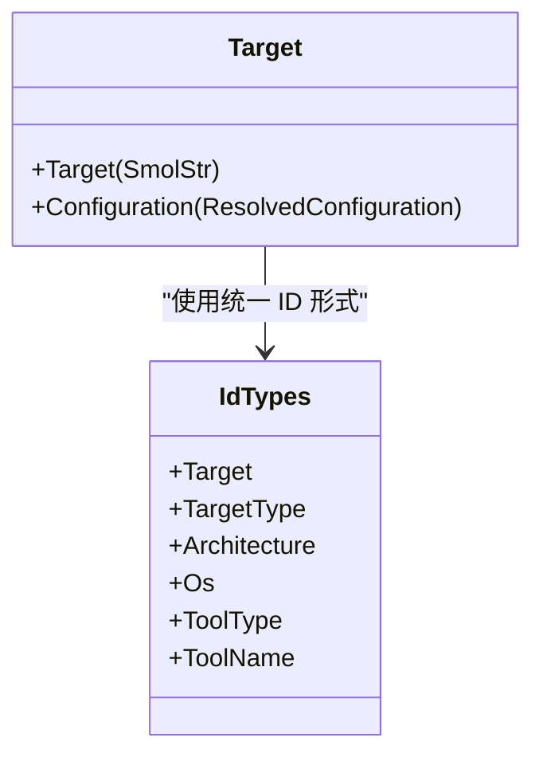
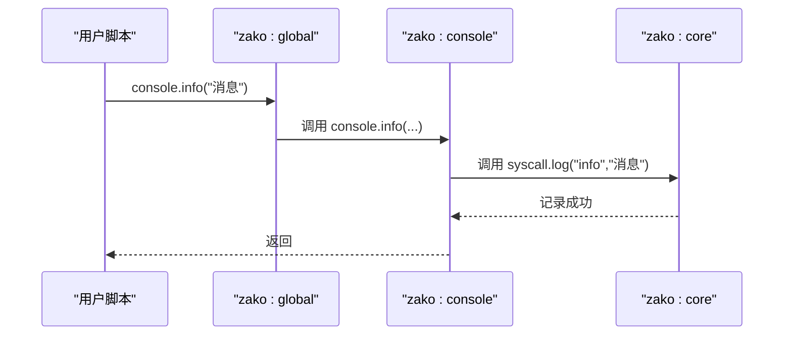
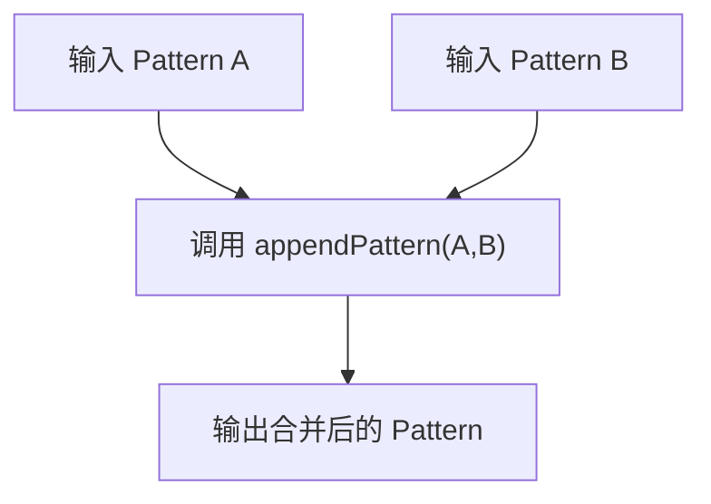
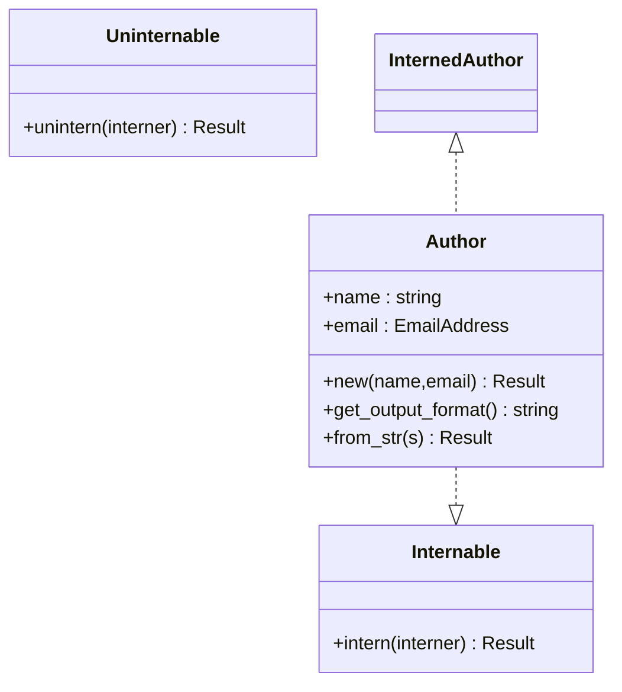
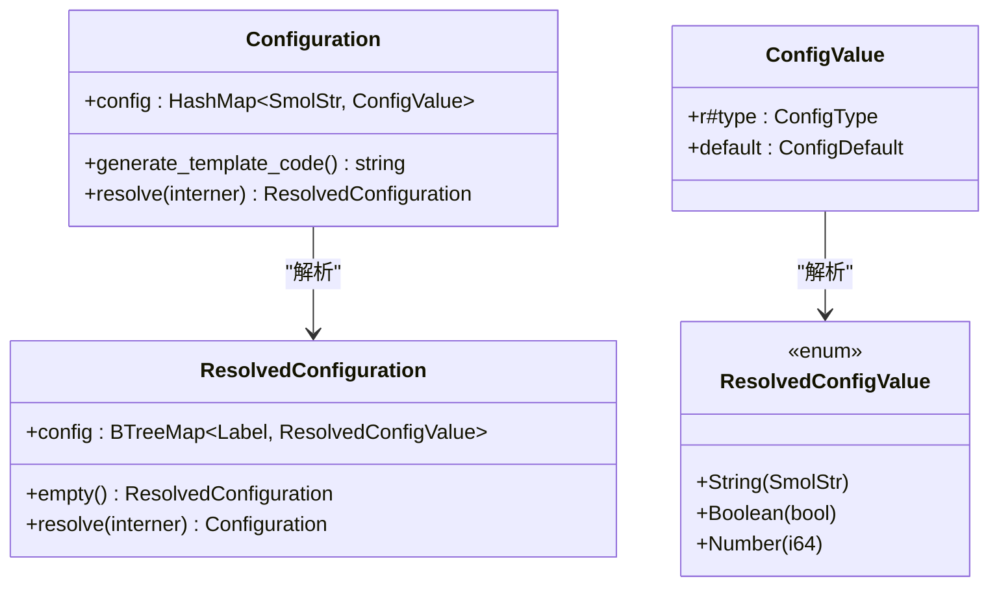
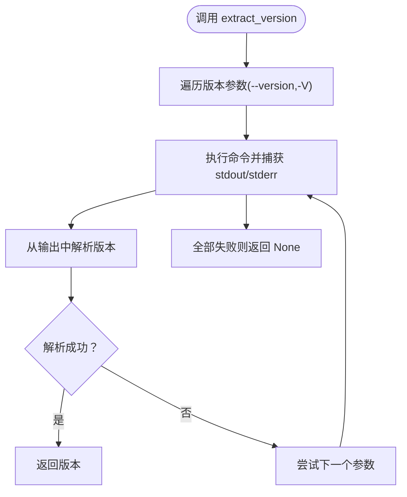
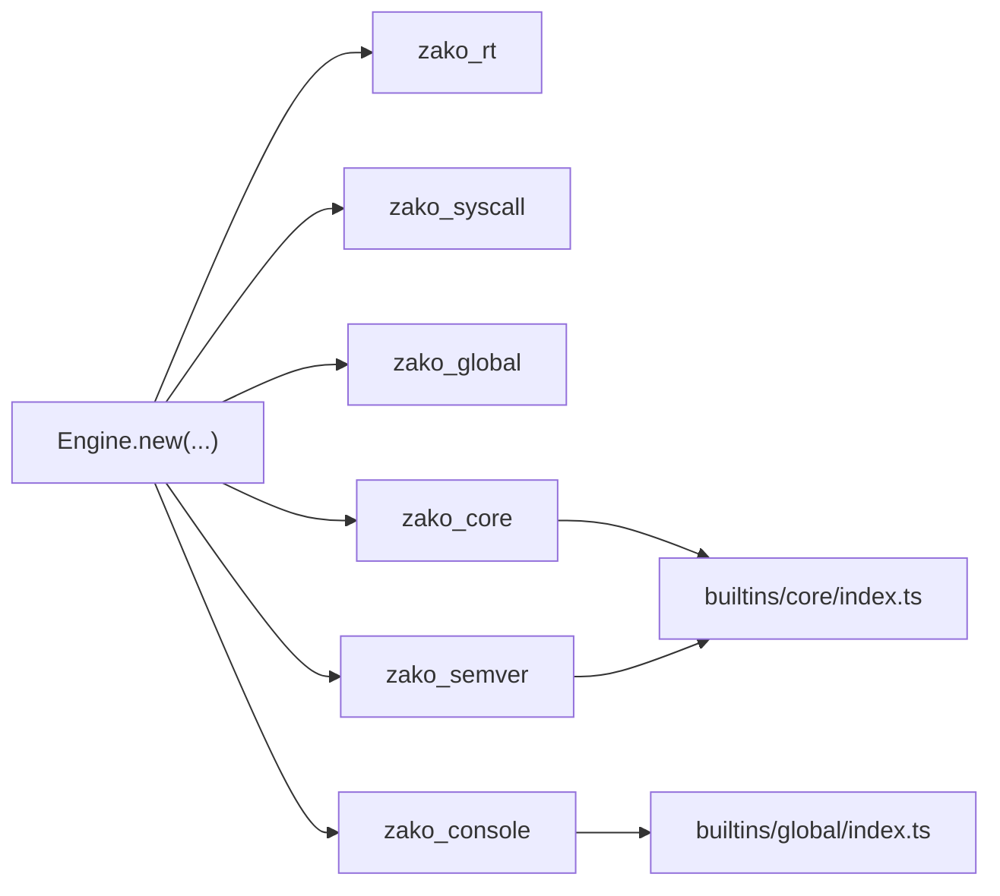

# 核心API

<cite>
**本文引用的文件**
- [zako_core/src/lib.rs](file://zako_core/src/lib.rs)
- [zako_core/src/engine.rs](file://zako_core/src/engine.rs)
- [zako_core/src/context.rs](file://zako_core/src/context.rs)
- [zako_core/src/target.rs](file://zako_core/src/target.rs)
- [zako_core/src/author.rs](file://zako_core/src/author.rs)
- [zako_core/src/config.rs](file://zako_core/src/config.rs)
- [zako_core/src/config_value.rs](file://zako_core/src/config_value.rs)
- [zako_core/src/version_extractor.rs](file://zako_core/src/version_extractor.rs)
- [zako_core/src/builtin/extension/core.rs](file://zako_core/src/builtin/extension/core.rs)
- [zako_core/src/builtin/extension/semver.rs](file://zako_core/src/builtin/extension/semver.rs)
- [zako_core/src/builtin/extension/console.rs](file://zako_core/src/builtin/extension/console.rs)
- [zako_core/src/builtin/id/mod.rs](file://zako_core/src/builtin/id/mod.rs)
- [zako_js/src/builtins/core/index.ts](file://zako_js/src/builtins/core/index.ts)
- [zako_js/src/builtins/console/index.ts](file://zako_js/src/builtins/console/index.ts)
- [zako_js/src/builtins/global/index.ts](file://zako_js/src/builtins/global/index.ts)
- [tests/log_version/zako.ts](file://tests/log_version/zako.ts)
</cite>

## 目录
1. [简介](#简介)
2. [项目结构](#项目结构)
3. [核心组件](#核心组件)
4. [架构总览](#架构总览)
5. [详细组件分析](#详细组件分析)
6. [依赖关系分析](#依赖关系分析)
7. [性能考量](#性能考量)
8. [故障排查指南](#故障排查指南)
9. [结论](#结论)
10. [附录：使用示例与最佳实践](#附录使用示例与最佳实践)

## 简介
本文件为 Zako 核心 API 的权威参考文档，聚焦以下主题：
- 版本管理与版本比较：VersionCore、VersionString 类型定义，以及 requireZakoVersion 的工作原理
- 标识符类型体系：Target、TargetType、Architecture、Os、ToolType、ToolName 等 ID 类型
- 日志记录：trace/debug/info/warn/error 的实现与使用
- 模式操作：Pattern 类型与 appendPattern 的行为
- 作者签名格式 Author 的结构与解析
- 配置声明接口 OptionsDeclaration 的字段与用途
- 错误处理机制与最佳实践

## 项目结构
Zako 的核心能力由 Rust 后端与 TypeScript 前端共同构成：
- Rust 层提供引擎、上下文、目标、作者、配置、版本提取等基础能力，并通过内置扩展暴露给 JS 运行时
- TypeScript 层在运行时提供类型定义、日志 API、版本校验、模式工具等

图表来源
- [zako_core/src/lib.rs](file://zako_core/src/lib.rs#L30-L80)
- [zako_core/src/engine.rs](file://zako_core/src/engine.rs#L48-L79)
- [zako_core/src/context.rs](file://zako_core/src/context.rs#L34-L86)
- [zako_core/src/target.rs](file://zako_core/src/target.rs#L5-L9)
- [zako_core/src/author.rs](file://zako_core/src/author.rs#L19-L36)
- [zako_core/src/config.rs](file://zako_core/src/config.rs#L14-L89)
- [zako_core/src/config_value.rs](file://zako_core/src/config_value.rs#L8-L117)
- [zako_core/src/version_extractor.rs](file://zako_core/src/version_extractor.rs#L49-L70)
- [zako_core/src/builtin/extension/core.rs](file://zako_core/src/builtin/extension/core.rs#L1-L7)
- [zako_core/src/builtin/extension/semver.rs](file://zako_core/src/builtin/extension/semver.rs#L1-L7)
- [zako_core/src/builtin/extension/console.rs](file://zako_core/src/builtin/extension/console.rs#L1-L8)
- [zako_core/src/builtin/id/mod.rs](file://zako_core/src/builtin/id/mod.rs#L3-L42)
- [zako_js/src/builtins/core/index.ts](file://zako_js/src/builtins/core/index.ts#L18-L82)
- [zako_js/src/builtins/console/index.ts](file://zako_js/src/builtins/console/index.ts#L2-L9)
- [zako_js/src/builtins/global/index.ts](file://zako_js/src/builtins/global/index.ts#L30-L44)
- [tests/log_version/zako.ts](file://tests/log_version/zako.ts#L1-L12)

章节来源
- [zako_core/src/lib.rs](file://zako_core/src/lib.rs#L1-L119)
- [zako_core/src/engine.rs](file://zako_core/src/engine.rs#L1-L306)
- [zako_core/src/context.rs](file://zako_core/src/context.rs#L1-L229)

## 核心组件
- 版本类型与比较
  - VersionCore：形如 x.y.z 的语义化版本核心部分
  - VersionString：完整语义化版本字符串（含可选预发布与构建元数据）
  - requireZakoVersion：基于 semver.satisfies 对当前运行时版本进行断言
- 标识符类型
  - Target、TargetType、Architecture、Os、ToolType、ToolName：均采用统一的 QualifiedArtifactId@VersionString#type::suffix 的 ID 形式
- 日志记录
  - trace/debug/info/warn/error：通过 zako:core 导出，并由 zako:global 提供全局 console 的安全包装
- 模式操作
  - Pattern：对象或字符串数组形式的包含/排除规则；appendPattern 支持合并两个 Pattern
- 作者签名
  - Author：形如 "姓名 <email@domain>" 的字符串，支持从字符串解析与输出格式化
- 配置声明
  - OptionsDeclaration：用于声明项目选项的接口，包含 option、description、type 与可选 default

章节来源
- [zako_js/src/builtins/core/index.ts](file://zako_js/src/builtins/core/index.ts#L18-L98)
- [zako_js/src/builtins/global/index.ts](file://zako_js/src/builtins/global/index.ts#L30-L44)
- [zako_core/src/builtin/id/mod.rs](file://zako_core/src/builtin/id/mod.rs#L3-L42)
- [zako_core/src/author.rs](file://zako_core/src/author.rs#L14-L125)
- [zako_core/src/config.rs](file://zako_core/src/config.rs#L14-L89)
- [zako_core/src/config_value.rs](file://zako_core/src/config_value.rs#L8-L117)

## 架构总览
Zako 的核心 API 在运行时通过内置扩展桥接 Rust 与 JS：
- zako:core 提供版本类型、版本比较、日志、模式工具、作者与配置声明等
- zako:semver 提供语义化版本解析与范围判断
- zako:console 提供日志接口，zako:global 将其映射到全局 console

图表来源
- [zako_js/src/builtins/core/index.ts](file://zako_js/src/builtins/core/index.ts#L76-L82)
- [zako_core/src/builtin/extension/core.rs](file://zako_core/src/builtin/extension/core.rs#L1-L7)
- [zako_core/src/builtin/extension/semver.rs](file://zako_core/src/builtin/extension/semver.rs#L1-L7)
- [zako_js/src/builtins/global/index.ts](file://zako_js/src/builtins/global/index.ts#L30-L44)

## 详细组件分析

### 版本管理与比较：VersionCore、VersionString、requireZakoVersion
- 类型定义
  - VersionCore：仅包含主次补丁号的版本核心
  - VersionString：在 VersionCore 基础上可选地附加预发布与构建元数据
- 工作流程
  - requireZakoVersion 会读取运行时版本字符串，解析为 SemVer 对象后，使用 semver.satisfies 判断是否满足传入的范围表达式
  - 若不满足，抛出 ZakoRuntimeError
- 典型用法
  - 在项目入口脚本中调用 requireZakoVersion，确保运行环境满足最低版本要求

图表来源
- [zako_js/src/builtins/core/index.ts](file://zako_js/src/builtins/core/index.ts#L76-L82)

章节来源
- [zako_js/src/builtins/core/index.ts](file://zako_js/src/builtins/core/index.ts#L18-L82)
- [tests/log_version/zako.ts](file://tests/log_version/zako.ts#L6-L6)

### 标识符类型：Target、TargetType、Architecture、Os、ToolType、ToolName
- 统一 ID 形式
  - 所有 ID 均采用 QualifiedArtifactId@VersionString#type::suffix 的结构
  - 其中 type 取自 target、target_type、architecture、os、tool_type、tool_name 等枚举值
- 内置映射
  - 通过 make_builtin_id 与 builtin/id/mod.rs 注册了常见类型（如 initialize、clean、build、test、package、install、deploy；x64、arm64；windows、linux、macos；archiver、downloader、linker；link_exe、ld、bsd_tar、curl、git 等）

图表来源
- [zako_core/src/target.rs](file://zako_core/src/target.rs#L5-L9)
- [zako_core/src/builtin/id/mod.rs](file://zako_core/src/builtin/id/mod.rs#L3-L42)
- [zako_js/src/builtins/core/index.ts](file://zako_js/src/builtins/core/index.ts#L36-L66)

章节来源
- [zako_core/src/target.rs](file://zako_core/src/target.rs#L1-L10)
- [zako_core/src/builtin/id/mod.rs](file://zako_core/src/builtin/id/mod.rs#L3-L42)
- [zako_js/src/builtins/core/index.ts](file://zako_js/src/builtins/core/index.ts#L36-L66)

### 日志记录：trace/debug/info/warn/error
- zako:core 暴露 trace/debug/info/warn/error 函数
- zako:global 将这些函数映射到全局 console，内部对参数进行安全格式化，避免循环或不可序列化对象导致崩溃
- zako:console 定义了标准的日志接口

图表来源
- [zako_js/src/builtins/global/index.ts](file://zako_js/src/builtins/global/index.ts#L30-L44)
- [zako_js/src/builtins/console/index.ts](file://zako_js/src/builtins/console/index.ts#L2-L9)
- [zako_js/src/builtins/core/index.ts](file://zako_js/src/builtins/core/index.ts#L121-L135)

章节来源
- [zako_js/src/builtins/global/index.ts](file://zako_js/src/builtins/global/index.ts#L30-L44)
- [zako_js/src/builtins/console/index.ts](file://zako_js/src/builtins/console/index.ts#L1-L10)
- [zako_js/src/builtins/core/index.ts](file://zako_js/src/builtins/core/index.ts#L121-L135)

### 模式操作：Pattern 与 appendPattern
- Pattern 支持两种形式：
  - 对象：包含 include 与 exclude 字段（均为字符串数组）
  - 数组：直接作为包含列表
- appendPattern 用于合并两个 Pattern，返回新的 Pattern

图表来源
- [zako_js/src/builtins/core/index.ts](file://zako_js/src/builtins/core/index.ts#L114-L138)

章节来源
- [zako_js/src/builtins/core/index.ts](file://zako_js/src/builtins/core/index.ts#L114-L138)

### 作者签名格式：Author
- 结构
  - Author 由 name 与 email 组成，支持从字符串解析与格式化输出
- 格式约束
  - 必须符合 "姓名 <email@domain>" 的形式，且姓名中不得包含 '<' 或 '>'，'<' 与 '>' 不能省略
- 错误处理
  - 当格式不合法或邮箱无效时，抛出对应的错误类型

图表来源
- [zako_core/src/author.rs](file://zako_core/src/author.rs#L14-L125)
- [zako_core/src/author.rs](file://zako_core/src/author.rs#L85-L91)

章节来源
- [zako_core/src/author.rs](file://zako_core/src/author.rs#L14-L183)

### 配置声明接口：OptionsDeclaration
- 字段
  - option：选项名称
  - description：选项说明
  - type：选项类型（"boolean" | "string" | "number"）
  - default：可选默认值
- 用途
  - 用于声明项目可配置选项，便于类型检查与文档生成

章节来源
- [zako_js/src/builtins/core/index.ts](file://zako_js/src/builtins/core/index.ts#L93-L98)

### 配置模型：Configuration 与 ResolvedConfiguration
- Configuration
  - 原始不可变配置，键为 SmolStr，值为 ConfigValue
  - 提供模板代码生成与解析为 ResolvedConfiguration 的能力
- ResolvedConfiguration
  - 已内联化的不可变配置，键为 Label，值为 ResolvedConfigValue
  - 提供反向解析回 Configuration 的能力
- 配置值与默认值
  - ConfigValue：包含类型与默认值
  - ConfigDefault：支持 String/Boolean/Number/Object（ConfigOperation）
  - ResolvedConfigValue：解析后的具体值（String/Boolean/Number）

图表来源
- [zako_core/src/config.rs](file://zako_core/src/config.rs#L14-L89)
- [zako_core/src/config_value.rs](file://zako_core/src/config_value.rs#L8-L117)
- [zako_core/src/config_value.rs](file://zako_core/src/config_value.rs#L142-L146)

章节来源
- [zako_core/src/config.rs](file://zako_core/src/config.rs#L14-L119)
- [zako_core/src/config_value.rs](file://zako_core/src/config_value.rs#L8-L166)

### 版本提取：extract_version
- 功能
  - 从程序的标准输出或错误输出中提取语义化版本
  - 支持宽松解析与常见版本参数（--version、-V）
- 日志
  - 使用 tracing 记录尝试过程与失败原因

图表来源
- [zako_core/src/version_extractor.rs](file://zako_core/src/version_extractor.rs#L49-L70)

章节来源
- [zako_core/src/version_extractor.rs](file://zako_core/src/version_extractor.rs#L1-L71)

## 依赖关系分析
- 引擎与扩展
  - Engine 在初始化时注册 zako_rt、zako_syscall、zako_global、zako_semver、zako_core、zako_console 等扩展
  - zako:core 与 zako:semver 为 requireZakoVersion 与版本解析提供基础
- 类型导出
  - TypeScript 层通过 ts_rs 将 Rust 结构体导出为 d.ts，保证类型一致性

图表来源
- [zako_core/src/engine.rs](file://zako_core/src/engine.rs#L54-L62)
- [zako_core/src/builtin/extension/core.rs](file://zako_core/src/builtin/extension/core.rs#L1-L7)
- [zako_core/src/builtin/extension/semver.rs](file://zako_core/src/builtin/extension/semver.rs#L1-L7)
- [zako_core/src/builtin/extension/console.rs](file://zako_core/src/builtin/extension/console.rs#L1-L8)
- [zako_js/src/builtins/global/index.ts](file://zako_js/src/builtins/global/index.ts#L30-L44)
- [zako_js/src/builtins/core/index.ts](file://zako_js/src/builtins/core/index.ts#L18-L82)

章节来源
- [zako_core/src/engine.rs](file://zako_core/src/engine.rs#L48-L79)

## 性能考量
- 版本比较
  - 使用 semver.satisfies 进行范围判断，时间复杂度近似 O(k)，k 为版本段数量
- 日志
  - 全局 console 包装对参数进行安全格式化，避免昂贵的序列化开销
- 配置解析
  - ResolvedConfiguration 使用有序映射以保证稳定性和可预测性
- 版本提取
  - 通过命令行输出解析，注意外部进程开销；建议缓存已知版本

## 故障排查指南
- requireZakoVersion 抛错
  - 症状：运行时报错提示版本不满足
  - 排查：确认运行时版本字符串是否正确，范围表达式是否合理
  - 参考路径：[zako_js/src/builtins/core/index.ts](file://zako_js/src/builtins/core/index.ts#L76-L82)
- Author 格式错误
  - 症状：解析 Author 失败
  - 排查：检查姓名中是否包含非法字符，邮箱格式是否有效
  - 参考路径：[zako_core/src/author.rs](file://zako_core/src/author.rs#L104-L125)
- 日志未输出
  - 症状：console.* 调用无效果
  - 排查：确认 zako:global 是否正确注入全局 console，以及 zako:core 的 syscall.log 是否可用
  - 参考路径：[zako_js/src/builtins/global/index.ts](file://zako_js/src/builtins/global/index.ts#L30-L44)
- 配置解析异常
  - 症状：配置解析报错
  - 排查：检查键名与类型是否匹配，必要时使用 generate_template_code 生成模板
  - 参考路径：[zako_core/src/config.rs](file://zako_core/src/config.rs#L31-L71)

章节来源
- [zako_js/src/builtins/core/index.ts](file://zako_js/src/builtins/core/index.ts#L76-L82)
- [zako_core/src/author.rs](file://zako_core/src/author.rs#L94-L125)
- [zako_js/src/builtins/global/index.ts](file://zako_js/src/builtins/global/index.ts#L30-L44)
- [zako_core/src/config.rs](file://zako_core/src/config.rs#L31-L71)

## 结论
Zako 的核心 API 通过清晰的类型系统与稳定的运行时扩展，提供了版本管理、标识符建模、日志记录与配置声明等关键能力。配合 requireZakoVersion 与 Author/OptionsDeclaration 等接口，能够帮助项目在不同环境下保持一致的行为与可维护性。

## 附录：使用示例与最佳实践
- 版本检查
  - 在项目入口脚本中调用 requireZakoVersion，确保运行环境满足最低版本要求
  - 示例路径：[tests/log_version/zako.ts](file://tests/log_version/zako.ts#L6-L6)
- 日志记录
  - 使用全局 console 输出 trace/debug/info/warn/error，避免直接依赖底层实现
  - 示例路径：[zako_js/src/builtins/global/index.ts](file://zako_js/src/builtins/global/index.ts#L30-L44)
- 标识符使用
  - 使用统一的 ID 形式（QualifiedArtifactId@VersionString#type::suffix），并在内置映射中查找对应枚举值
  - 示例路径：[zako_core/src/builtin/id/mod.rs](file://zako_core/src/builtin/id/mod.rs#L3-L42)
- 配置声明
  - 使用 OptionsDeclaration 声明项目选项，确保类型安全与文档生成
  - 示例路径：[zako_js/src/builtins/core/index.ts](file://zako_js/src/builtins/core/index.ts#L93-L98)
- 错误处理
  - 对 Author 解析与版本比较等关键流程进行显式错误处理，提供清晰的错误信息
  - 示例路径：[zako_core/src/author.rs](file://zako_core/src/author.rs#L94-L125)