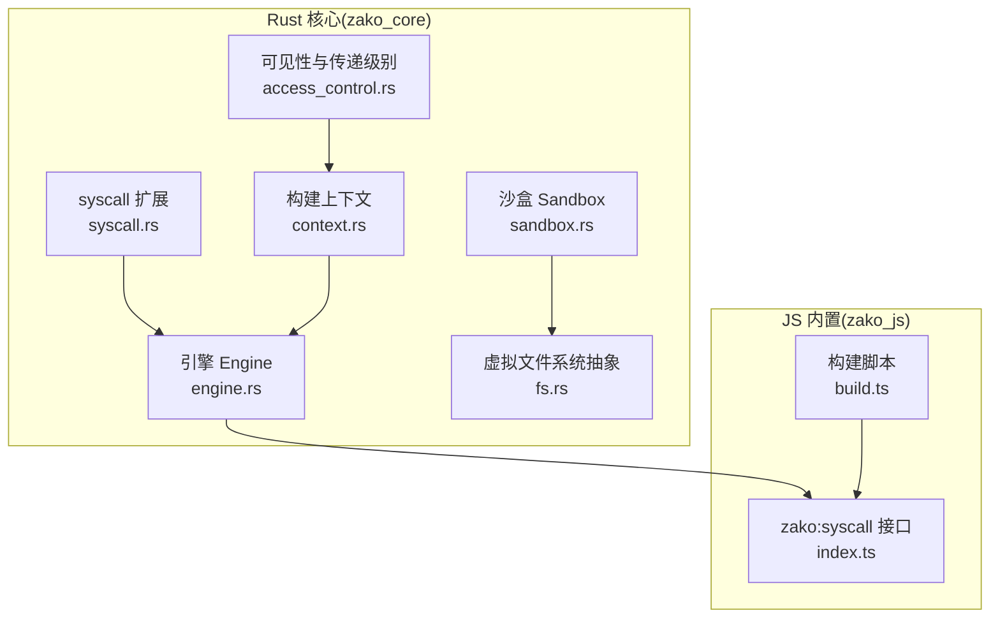
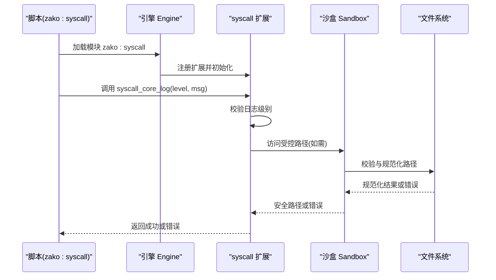
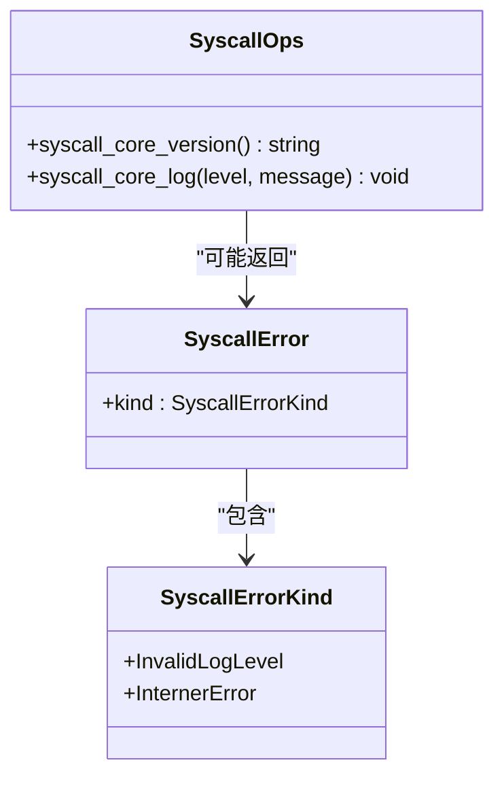
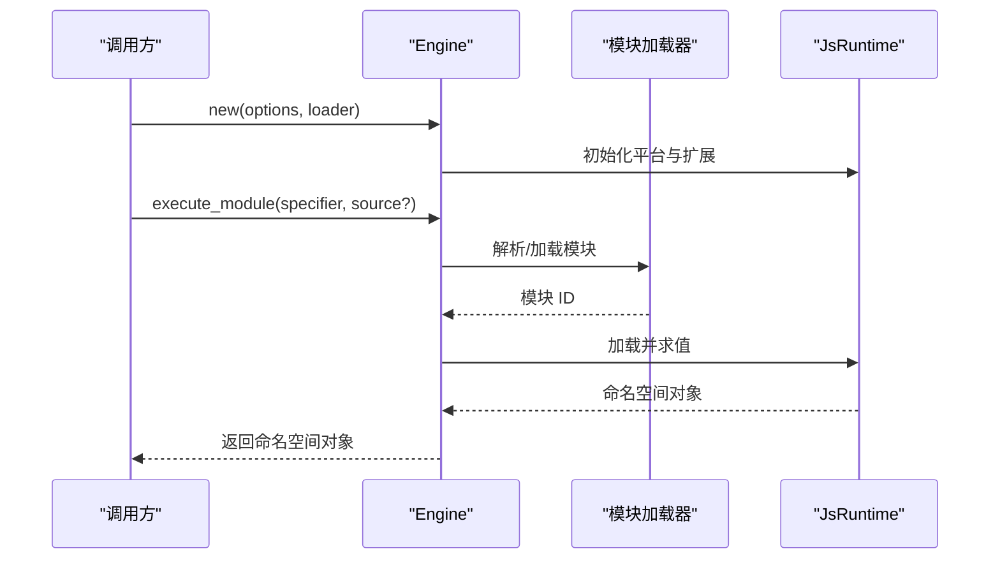
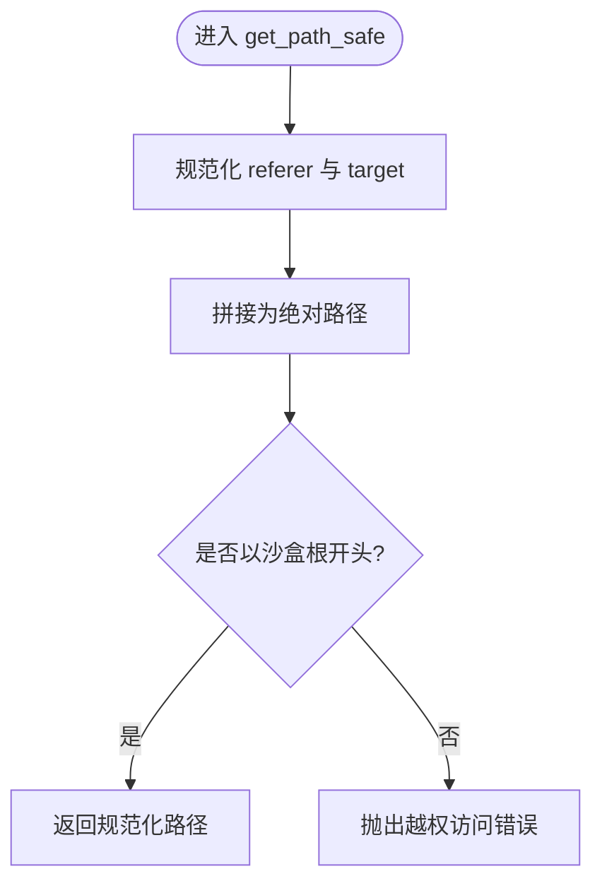
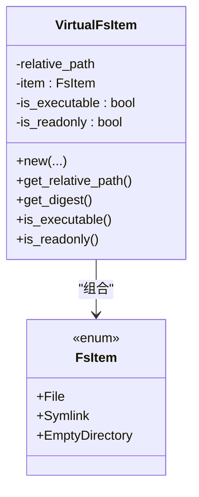
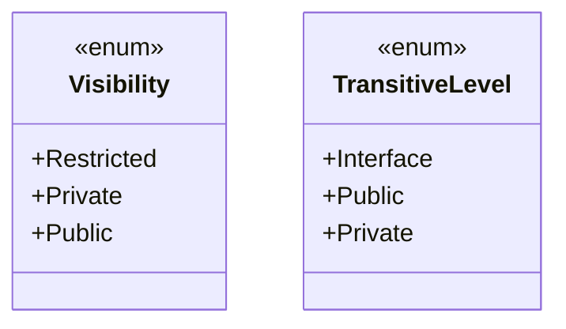
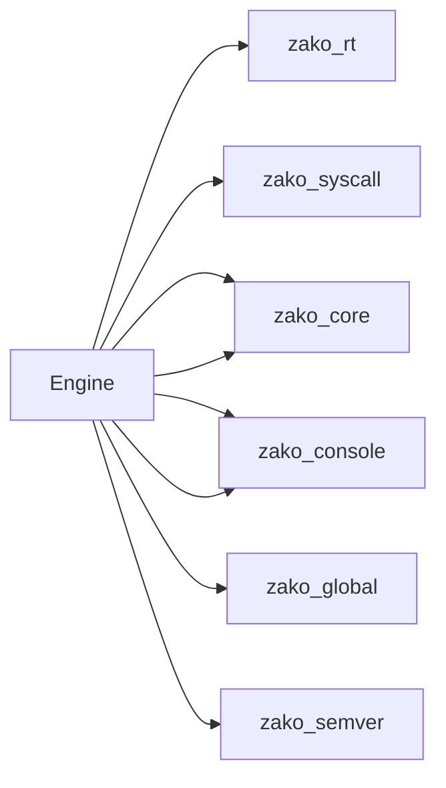

# 系统调用API

<cite>
**本文档引用的文件**
- [zako_core/src/builtin/extension/syscall.rs](file://zako_core/src/builtin/extension/syscall.rs)
- [zako_js/src/builtins/syscall/index.ts](file://zako_js/src/builtins/syscall/index.ts)
- [zako_core/src/engine.rs](file://zako_core/src/engine.rs)
- [zako_core/src/sandbox.rs](file://zako_core/src/sandbox.rs)
- [zako_core/src/fs.rs](file://zako_core/src/fs.rs)
- [zako_core/src/access_control.rs](file://zako_core/src/access_control.rs)
- [zako_core/src/context.rs](file://zako_core/src/context.rs)
- [zako_core/src/lib.rs](file://zako_core/src/lib.rs)
- [Cargo.toml](file://Cargo.toml)
- [zako_js/script/build.ts](file://zako_js/script/build.ts)
</cite>

## 目录
1. [简介](#简介)
2. [项目结构](#项目结构)
3. [核心组件](#核心组件)
4. [架构总览](#架构总览)
5. [组件详解](#组件详解)
6. [依赖关系分析](#依赖关系分析)
7. [性能考量](#性能考量)
8. [故障排查指南](#故障排查指南)
9. [结论](#结论)
10. [附录](#附录)

## 简介
本文件为 Zako 系统调用 API 的权威参考，聚焦底层系统能力的暴露与安全边界设计，覆盖文件系统、日志与运行时交互等能力，并说明与沙盒、权限控制、错误处理及性能优化的关系。文档同时给出跨平台与平台特定行为的使用建议。

## 项目结构
Zako 将“系统调用”以内置扩展的形式暴露给脚本侧，核心由 Rust 实现底层能力并通过 V8 引擎桥接至 JS 层。构建流程会将 TS 内置模块打包为 ESM，供脚本通过命名空间模块访问。

**图表来源**
- [zako_core/src/builtin/extension/syscall.rs](file://zako_core/src/builtin/extension/syscall.rs#L1-L62)
- [zako_core/src/engine.rs](file://zako_core/src/engine.rs#L47-L79)
- [zako_core/src/sandbox.rs](file://zako_core/src/sandbox.rs#L27-L81)
- [zako_core/src/fs.rs](file://zako_core/src/fs.rs#L6-L47)
- [zako_core/src/context.rs](file://zako_core/src/context.rs#L34-L183)
- [zako_core/src/access_control.rs](file://zako_core/src/access_control.rs#L3-L18)
- [zako_js/src/builtins/syscall/index.ts](file://zako_js/src/builtins/syscall/index.ts#L1-L25)
- [zako_js/script/build.ts](file://zako_js/script/build.ts#L1-L63)

**章节来源**
- [zako_core/src/lib.rs](file://zako_core/src/lib.rs#L98-L118)
- [Cargo.toml](file://Cargo.toml#L11-L22)

## 核心组件
- syscall 扩展：在 Rust 中注册系统调用操作（版本查询、日志），并在 JS 侧暴露为 zako:syscall 模块。
- 引擎 Engine：初始化 V8 平台与扩展，加载并执行 ES 模块，桥接 JS 与 Rust。
- 沙盒 Sandbox：限制路径访问范围，防止越权访问宿主文件系统。
- 虚拟文件系统抽象：统一表示文件、符号链接与空目录，配合沙盒进行路径校验。
- 构建上下文与权限模型：提供可见性与传递级别的策略，用于控制资源公开范围。
- 构建脚本：将 TS 内置模块编译为 ESM，供引擎加载。

**章节来源**
- [zako_core/src/builtin/extension/syscall.rs](file://zako_core/src/builtin/extension/syscall.rs#L18-L31)
- [zako_core/src/engine.rs](file://zako_core/src/engine.rs#L47-L79)
- [zako_core/src/sandbox.rs](file://zako_core/src/sandbox.rs#L8-L25)
- [zako_core/src/fs.rs](file://zako_core/src/fs.rs#L6-L19)
- [zako_core/src/access_control.rs](file://zako_core/src/access_control.rs#L3-L18)
- [zako_js/script/build.ts](file://zako_js/script/build.ts#L12-L63)

## 架构总览
下图展示从 JS 调用到 Rust 执行再到沙盒校验的整体流程。

**图表来源**
- [zako_js/src/builtins/syscall/index.ts](file://zako_js/src/builtins/syscall/index.ts#L17-L22)
- [zako_core/src/builtin/extension/syscall.rs](file://zako_core/src/builtin/extension/syscall.rs#L33-L61)
- [zako_core/src/sandbox.rs](file://zako_core/src/sandbox.rs#L34-L54)

## 组件详解

### syscall 扩展与 JS 接口
- 操作定义
  - 版本查询：返回当前包版本字符串。
  - 日志接口：根据传入级别写入 tracing 日志，支持 trace、debug、info、warn、error；非法级别将触发错误。
- 错误类型
  - 非法日志级别：当级别不在允许集合内时抛出。
  - 字符串驻留器错误：来自内部字符串驻留器的错误传播。
- JS 侧绑定
  - 通过全局 Deno.core.ops 获取 zako:syscall 的操作句柄。
  - 提供 log(level, message) 与 version 常量。

**图表来源**
- [zako_core/src/builtin/extension/syscall.rs](file://zako_core/src/builtin/extension/syscall.rs#L5-L16)
- [zako_core/src/builtin/extension/syscall.rs](file://zako_core/src/builtin/extension/syscall.rs#L27-L31)
- [zako_core/src/builtin/extension/syscall.rs](file://zako_core/src/builtin/extension/syscall.rs#L33-L61)

**章节来源**
- [zako_core/src/builtin/extension/syscall.rs](file://zako_core/src/builtin/extension/syscall.rs#L18-L61)
- [zako_js/src/builtins/syscall/index.ts](file://zako_js/src/builtins/syscall/index.ts#L7-L24)

### 引擎与模块加载
- 初始化
  - 设置 V8 平台与线程句柄。
  - 注册内置扩展（含 syscall）。
  - 创建 JsRuntime 并启用模块加载。
- 执行流程
  - 支持从源码或模块 specifier 加载主模块。
  - 在执行前可注入全局上下文对象（如 executionContext）。
  - 捕获并转换 V8 异常为统一错误类型。

**图表来源**
- [zako_core/src/engine.rs](file://zako_core/src/engine.rs#L47-L79)
- [zako_core/src/engine.rs](file://zako_core/src/engine.rs#L81-L109)
- [zako_core/src/engine.rs](file://zako_core/src/engine.rs#L111-L166)

**章节来源**
- [zako_core/src/engine.rs](file://zako_core/src/engine.rs#L19-L31)
- [zako_core/src/engine.rs](file://zako_core/src/engine.rs#L47-L79)
- [zako_core/src/engine.rs](file://zako_core/src/engine.rs#L81-L166)

### 沙盒与路径安全
- 功能
  - 限定根目录，所有访问必须位于根内。
  - 对相对路径进行规范化与拼接，拒绝越界访问。
  - 提供 is_in_sandbox 快速判断。
- 错误
  - 越权访问：目标路径不在沙盒根内。
  - IO 错误：路径解析失败等。

**图表来源**
- [zako_core/src/sandbox.rs](file://zako_core/src/sandbox.rs#L34-L54)

**章节来源**
- [zako_core/src/sandbox.rs](file://zako_core/src/sandbox.rs#L8-L25)
- [zako_core/src/sandbox.rs](file://zako_core/src/sandbox.rs#L27-L81)

### 虚拟文件系统与路径约束
- 抽象
  - 文件项：普通文件、符号链接、空目录。
  - 虚拟文件项：携带可执行/只读属性与相对路径。
- 约束
  - 不允许父目录引用（..）逃逸。
  - 符号链接目标必须相对且不越界。
  - 路径必须可被规范化且非空。

**图表来源**
- [zako_core/src/fs.rs](file://zako_core/src/fs.rs#L6-L19)
- [zako_core/src/fs.rs](file://zako_core/src/fs.rs#L49-L87)

**章节来源**
- [zako_core/src/fs.rs](file://zako_core/src/fs.rs#L6-L47)
- [zako_core/src/fs.rs](file://zako_core/src/fs.rs#L49-L87)

### 权限控制与可见性
- 可见性
  - 受限（Restricted）：仅指定主体可见。
  - 私有（Private）：默认私有。
  - 公开（Public）：公开。
- 传递级别
  - Interface：仅接口可见。
  - Public：公开传递。
  - Private：私有传递。

**图表来源**
- [zako_core/src/access_control.rs](file://zako_core/src/access_control.rs#L3-L18)

**章节来源**
- [zako_core/src/access_control.rs](file://zako_core/src/access_control.rs#L3-L18)

### 构建上下文与全局状态
- 上下文职责
  - 保存项目根、入口名、包源等信息。
  - 提供全局状态访问（线程句柄、CAS 存储、工作池、系统信息等）。
- 作用
  - 为计算节点与引擎提供一致的执行环境。

**章节来源**
- [zako_core/src/context.rs](file://zako_core/src/context.rs#L34-L183)

### 构建脚本与内置模块打包
- 目标
  - 将 zako_js/src/builtins 下的 TS 模块编译为 dist/builtins 的 ESM。
  - 生成类型声明与模板配置。
- 关键点
  - 使用 Bun.build 进行转译与打包，设置外部依赖为 zako:*。
  - 输出文件写入 dist/builtins/*.js，供引擎加载。

**章节来源**
- [zako_js/script/build.ts](file://zako_js/script/build.ts#L12-L63)
- [zako_js/script/build.ts](file://zako_js/script/build.ts#L66-L102)
- [zako_js/script/build.ts](file://zako_js/script/build.ts#L230-L286)

## 依赖关系分析
- 扩展注册
  - 引擎在初始化时注册 zako_rt、zako_syscall 等扩展，确保 JS 可通过 zako:* 模块访问。
- 外部依赖
  - deno_core、v8、tokio、tracing 等为系统调用与引擎执行提供基础能力。
- 工作池与资源
  - 引擎上下文持有 CAS 存储、V8/Oxc 工作者池等，支撑大规模任务并发。

**图表来源**
- [zako_core/src/engine.rs](file://zako_core/src/engine.rs#L53-L62)

**章节来源**
- [Cargo.toml](file://Cargo.toml#L160-L162)
- [Cargo.toml](file://Cargo.toml#L136-L137)
- [Cargo.toml](file://Cargo.toml#L101)

## 性能考量
- 引擎与运行时
  - 使用单线程句柄驱动的 JsRuntime，避免多线程上下文切换开销。
  - 合理复用引擎实例，减少初始化成本。
- 日志
  - 使用 tracing 的异步日志通道，避免阻塞主线程。
  - 在高频场景下，优先选择较低级别（如 warn/error）以降低开销。
- 沙盒与路径
  - 规范化与 canonicalize 为 O(1) 逐段处理，但整体复杂度与路径层级相关。
  - 批量路径访问时尽量合并为一次规范化，减少重复 IO。
- 构建与打包
  - 使用 Bun.build 进行增量构建与最小化输出，缩短开发周期。
  - 类型声明与模板生成在 CI 中预处理，避免运行时负担。

[本节为通用性能建议，无需具体文件分析]

## 故障排查指南
- 系统调用错误
  - 非法日志级别：检查传入级别是否为 trace/debug/info/warn/error。
  - 字符串驻留器错误：通常为内部状态异常，建议重试或检查内存占用。
- 沙盒错误
  - 越权访问：确认目标路径相对于沙盒根是否合法，避免 .. 逃逸。
  - IO 错误：检查路径是否存在、权限是否足够。
- 引擎错误
  - CoreError/V8Error：查看错误消息中的堆栈定位问题模块；必要时开启更详细的日志。
- 虚拟文件系统错误
  - 路径包含无效 UTF-8、为空、为绝对路径、未归一化、符号链接越界等：修正输入路径或链接目标。

**章节来源**
- [zako_core/src/builtin/extension/syscall.rs](file://zako_core/src/builtin/extension/syscall.rs#L8-L16)
- [zako_core/src/sandbox.rs](file://zako_core/src/sandbox.rs#L19-L25)
- [zako_core/src/fs.rs](file://zako_core/src/fs.rs#L21-L41)
- [zako_core/src/engine.rs](file://zako_core/src/engine.rs#L24-L31)

## 结论
Zako 的系统调用 API 通过受控扩展与沙盒机制，在保证安全性的同时提供了稳定的日志与版本查询能力。结合引擎的模块加载与工作池，可在多任务场景下高效运行。建议在生产环境中严格遵循沙盒规则与可见性策略，并通过合理的日志级别与构建流程提升可观测性与性能。

[本节为总结性内容，无需具体文件分析]

## 附录

### API 参考摘要
- 模块名称
  - zako:syscall
- 操作
  - 版本查询：返回当前包版本字符串。
  - 日志接口：按级别写入日志，非法级别将报错。
- JS 侧使用
  - 通过全局 Deno.core.ops 获取操作句柄，调用 log(level, message) 与读取 version 常量。

**章节来源**
- [zako_js/src/builtins/syscall/index.ts](file://zako_js/src/builtins/syscall/index.ts#L7-L24)
- [zako_core/src/builtin/extension/syscall.rs](file://zako_core/src/builtin/extension/syscall.rs#L27-L31)
- [zako_core/src/builtin/extension/syscall.rs](file://zako_core/src/builtin/extension/syscall.rs#L33-L61)

### 沙盒与权限最佳实践
- 为每个任务或项目根建立独立沙盒，避免共享越权访问。
- 对符号链接进行严格校验，禁止绝对路径与越界目标。
- 在 CI 中对路径合法性进行静态检查，提前发现潜在风险。

**章节来源**
- [zako_core/src/sandbox.rs](file://zako_core/src/sandbox.rs#L27-L81)
- [zako_core/src/fs.rs](file://zako_core/src/fs.rs#L49-L87)
- [zako_core/src/access_control.rs](file://zako_core/src/access_control.rs#L3-L18)