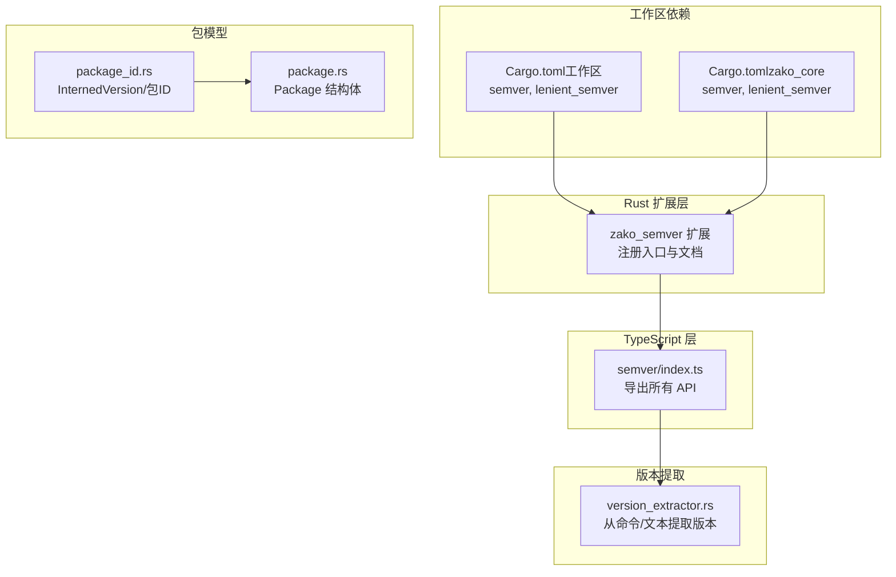
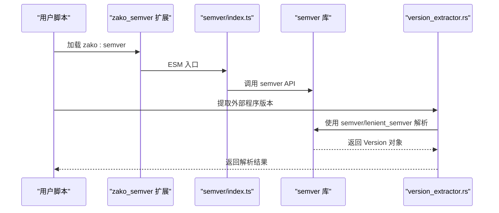
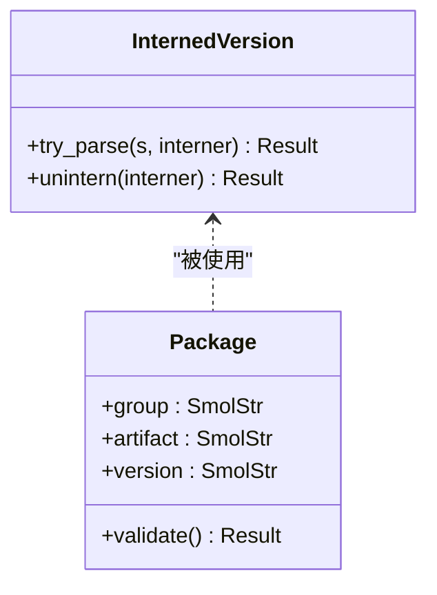
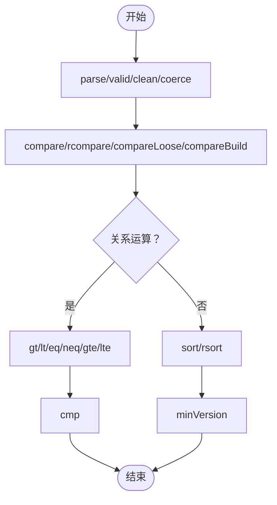
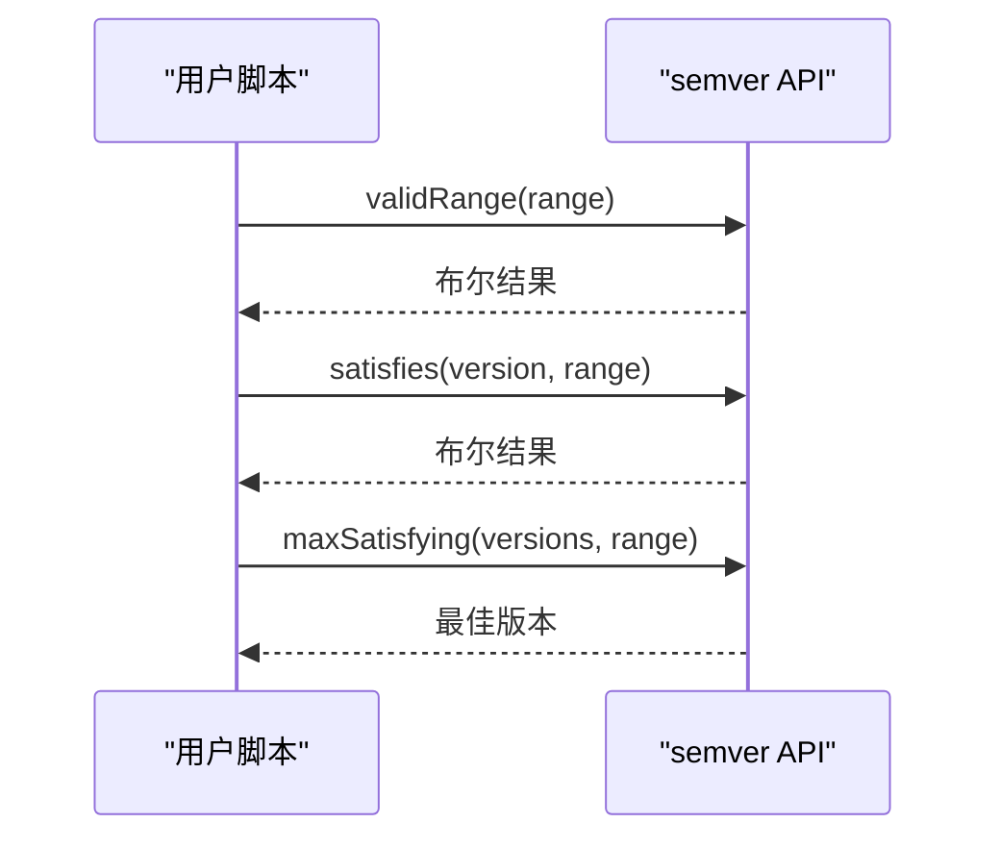
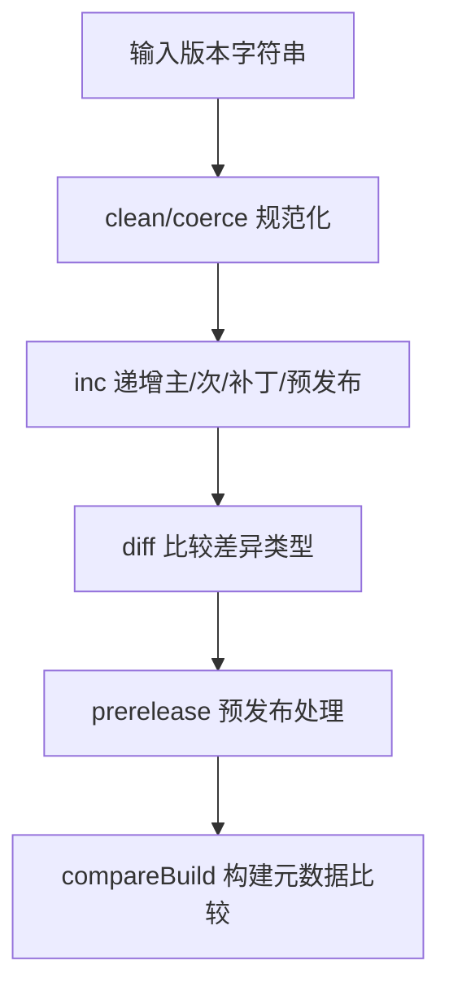
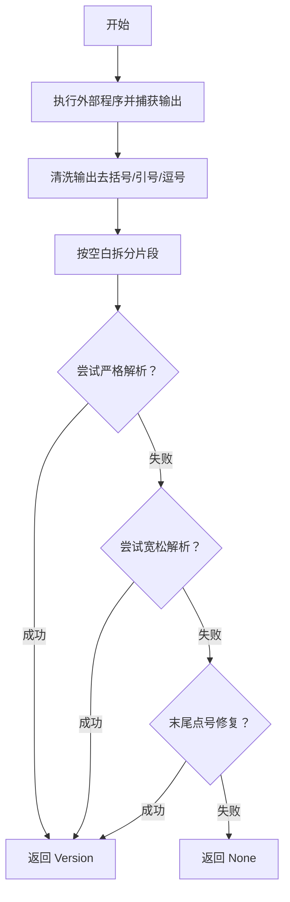
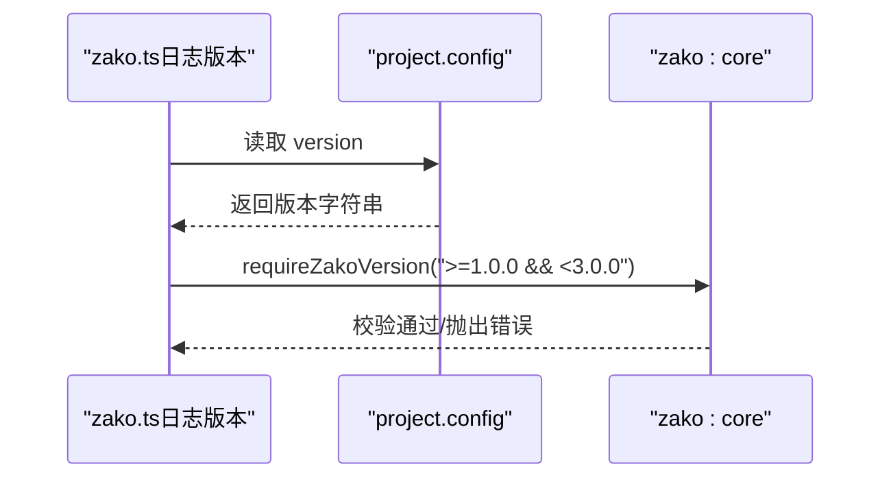
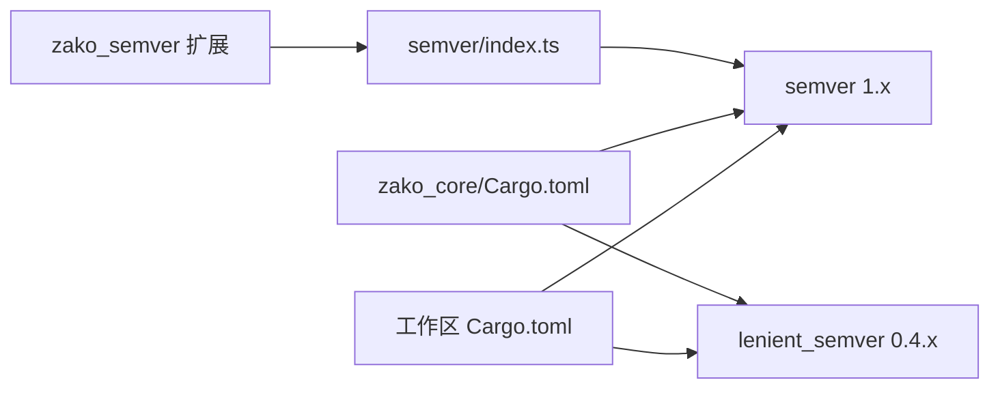

# 语义版本API

<cite>
**本文档引用的文件**
- [semver.rs](file://zako_core/src/builtin/extension/semver.rs)
- [index.ts](file://zako_js/src/builtins/semver/index.ts)
- [Cargo.toml（工作区）](file://Cargo.toml)
- [Cargo.toml（zako_core）](file://zako_core/Cargo.toml)
- [version_extractor.rs](file://zako_core/src/version_extractor.rs)
- [version_extractor_tests.rs](file://zako_core/src/tests/version_extractor_tests.rs)
- [package_id.rs](file://zako_core/src/package_id.rs)
- [package.rs](file://zako_core/src/package.rs)
- [zako.ts（新项目）](file://tests/new_project/zako.ts)
- [zako.ts（日志版本）](file://tests/log_version/zako.ts)
- [zako.json](file://tests/new_project/zako.json)
- [zako.jsonc](file://tests/log_version/zako.jsonc)
</cite>

## 目录
1. [简介](#简介)
2. [项目结构](#项目结构)
3. [核心组件](#核心组件)
4. [架构总览](#架构总览)
5. [详细组件分析](#详细组件分析)
6. [依赖关系分析](#依赖关系分析)
7. [性能考虑](#性能考虑)
8. [故障排除指南](#故障排除指南)
9. [结论](#结论)
10. [附录](#附录)

## 简介
本文件为 Zako 语义版本 API 的权威参考文档，覆盖以下主题：
- 版本解析与规范化：SemVer 类型、版本字符串格式、预发布版本与构建元数据处理
- 版本比较与范围匹配：比较运算符、范围表达式、兼容性检查与升级策略
- 版本号生成与提取：从命令行输出或文本中提取版本号
- 在 Zako 工程中的集成方式：如何在配置与脚本中使用版本能力

本说明面向不同技术背景的读者，既提供高层概览，也给出可追溯到源码的精确位置。

## 项目结构
Zako 将语义版本能力以“扩展”的形式嵌入运行时，并通过 TypeScript 层暴露给用户脚本。核心结构如下：
- Rust 扩展层：注册并导出语义版本能力
- TypeScript 层：直接封装并导出 semver 库 API
- 工作区与模块依赖：统一管理 semver 与 lenient_semver
- 版本提取工具：从外部程序输出中解析版本号
- 包标识与版本存储：内部使用 InternedVersion 存储规范化的版本字符串

**图表来源**
- [semver.rs](file://zako_core/src/builtin/extension/semver.rs#L1-L8)
- [index.ts](file://zako_js/src/builtins/semver/index.ts#L1-L47)
- [Cargo.toml（工作区）](file://Cargo.toml#L58-L71)
- [Cargo.toml（zako_core）](file://zako_core/Cargo.toml#L16-L40)
- [version_extractor.rs](file://zako_core/src/version_extractor.rs#L1-L70)
- [package_id.rs](file://zako_core/src/package_id.rs#L21-L57)
- [package.rs](file://zako_core/src/package.rs#L68-L86)

**章节来源**
- [semver.rs](file://zako_core/src/builtin/extension/semver.rs#L1-L8)
- [index.ts](file://zako_js/src/builtins/semver/index.ts#L1-L47)
- [Cargo.toml（工作区）](file://Cargo.toml#L58-L71)
- [Cargo.toml（zako_core）](file://zako_core/Cargo.toml#L16-L40)

## 核心组件
- 语义版本扩展（Rust）
  - 注册入口与文档字符串明确声明提供 node-semver 能力
  - ESM 入口指向 zako:semver，便于在 Deno/V8 环境中加载
- TypeScript 语义版本 API
  - 导出 SemVer、ReleaseType、Range、Comparator、Options 等类型
  - 导出 parse、valid、clean、inc、diff、major、minor、patch、prerelease、compare、rcompare、compareLoose、compareBuild、sort、rsort、gt、lt、eq、neq、gte、lte、cmp、coerce、satisfies、toComparators、maxSatisfying、minSatisfying、minVersion、validRange、outside、gtr、ltr、intersects、simplifyRange、subset 等函数
- 版本提取器
  - 支持从字符串与外部程序输出中提取版本号，兼容宽松格式
  - 使用 semver::Version 与 lenient_semver::parse 双通道解析
- 包与版本模型
  - InternedVersion 内部存储规范化版本字符串
  - Package 结构体包含 version 字段，用于工程配置与依赖声明

**章节来源**
- [semver.rs](file://zako_core/src/builtin/extension/semver.rs#L1-L8)
- [index.ts](file://zako_js/src/builtins/semver/index.ts#L4-L47)
- [version_extractor.rs](file://zako_core/src/version_extractor.rs#L1-L70)
- [package_id.rs](file://zako_core/src/package_id.rs#L21-L57)
- [package.rs](file://zako_core/src/package.rs#L68-L86)

## 架构总览
下图展示 Zako 语义版本能力在系统中的位置与调用链：

**图表来源**
- [semver.rs](file://zako_core/src/builtin/extension/semver.rs#L1-L8)
- [index.ts](file://zako_js/src/builtins/semver/index.ts#L1-L47)
- [version_extractor.rs](file://zako_core/src/version_extractor.rs#L1-L70)

## 详细组件分析

### 组件A：SemVer 类型与版本字符串格式
- 类型定义
  - SemVer、ReleaseType、Range、Comparator、Options 等类型均来自 semver 库
- 版本字符串格式
  - 符合 SemVer 2.0.0 规范
  - 支持预发布版本（prerelease）与构建元数据（build），例如 1.2.3-alpha.1+sha.ebf2012
- 内部存储
  - InternedVersion 以不可变字符串形式存储规范化后的版本字符串
  - Package 结构体的 version 字段为 SmolStr，承载工程层面的版本声明

**图表来源**
- [package_id.rs](file://zako_core/src/package_id.rs#L21-L57)
- [package.rs](file://zako_core/src/package.rs#L68-L86)

**章节来源**
- [package_id.rs](file://zako_core/src/package_id.rs#L21-L57)
- [package.rs](file://zako_core/src/package.rs#L68-L86)

### 组件B：版本解析与比较
- 解析与规范化
  - parse：将字符串解析为 SemVer 对象
  - valid/clean：验证并清理版本字符串
  - coerce：将非标准版本字符串转换为有效版本
- 比较运算
  - compare/rcompare：严格比较
  - compareLoose：宽松比较
  - compareBuild：比较时包含构建元数据
  - gt/lt/eq/neq/gte/lte：大小比较与相等判断
  - cmp：通用比较函数
- 排序与极值
  - sort/rsort：对版本数组进行排序
  - minVersion：根据范围推导最小可用版本

**图表来源**
- [index.ts](file://zako_js/src/builtins/semver/index.ts#L12-L46)

**章节来源**
- [index.ts](file://zako_js/src/builtins/semver/index.ts#L12-L46)

### 组件C：范围匹配与兼容性检查
- 范围表达式
  - validRange：验证范围字符串合法性
  - satisfies：判断版本是否满足范围
  - toComparators：将范围转换为比较器集合
  - intersects/subset：范围之间的交集与子集判断
  - simplifyRange：简化范围表达式
- 最大/最小满足版本
  - maxSatisfying/minSatisfying：从候选集中选择满足范围的最值
  - outside：判断版本是否超出范围边界
- 升级策略示例
  - 向上兼容：使用 >= 主版本分隔符，确保不破坏现有接口
  - 严格锁定：使用 ^ 或 ~ 精确控制补丁/次版本升级
  - 预发布分支：通过 prerelease 标记区分稳定与开发版

**图表来源**
- [index.ts](file://zako_js/src/builtins/semver/index.ts#L34-L46)

**章节来源**
- [index.ts](file://zako_js/src/builtins/semver/index.ts#L34-L46)

### 组件D：版本号生成与规范化
- 生成
  - inc：按主/次/补丁/预发布等粒度递增版本
  - diff：比较两个版本差异类型
- 规范化
  - clean：去除前缀并标准化版本字符串
  - coerce：将常见非标准格式转换为标准版本
- 预发布与构建元数据
  - prerelease：读取或设置预发布标识
  - compareBuild：比较时考虑构建元数据

**图表来源**
- [index.ts](file://zako_js/src/builtins/semver/index.ts#L12-L20)
- [index.ts](file://zako_js/src/builtins/semver/index.ts#L24-L24)

**章节来源**
- [index.ts](file://zako_js/src/builtins/semver/index.ts#L12-L20)
- [index.ts](file://zako_js/src/builtins/semver/index.ts#L24-L24)

### 组件E：从外部程序提取版本号
- 功能概述
  - 从命令行输出中提取版本号，支持 --version 与 -V 参数
  - 支持宽松格式，自动剔除括号、引号等干扰字符
- 处理流程
  - 优先尝试 semver::Version::parse；失败时回退 lenient_semver::parse
  - 支持末尾点号的特殊情况处理
- 测试覆盖
  - 覆盖多种常见工具输出格式，包括带预发布与构建元数据的版本

**图表来源**
- [version_extractor.rs](file://zako_core/src/version_extractor.rs#L6-L24)
- [version_extractor.rs](file://zako_core/src/version_extractor.rs#L26-L47)
- [version_extractor.rs](file://zako_core/src/version_extractor.rs#L49-L70)

**章节来源**
- [version_extractor.rs](file://zako_core/src/version_extractor.rs#L1-L70)
- [version_extractor_tests.rs](file://zako_core/src/tests/version_extractor_tests.rs#L5-L62)

### 组件F：在 Zako 中的使用示例
- 工程配置与版本声明
  - 在 JSON 配置中声明 group/artifact/version 等字段
  - 在 TypeScript 脚本中读取 project.config.version 并进行日志输出
- 版本兼容性检查
  - 使用 requireZakoVersion 对宿主工具版本进行约束（如 >=1.0.0 && <3.0.0）

**图表来源**
- [zako.ts（日志版本）](file://tests/log_version/zako.ts#L4-L6)
- [zako.json](file://tests/new_project/zako.json#L2-L4)
- [zako.jsonc](file://tests/log_version/zako.jsonc#L2-L4)

**章节来源**
- [zako.ts（日志版本）](file://tests/log_version/zako.ts#L1-L13)
- [zako.ts（新项目）](file://tests/new_project/zako.ts#L1-L22)
- [zako.json](file://tests/new_project/zako.json#L1-L18)
- [zako.jsonc](file://tests/log_version/zako.jsonc#L1-L32)

## 依赖关系分析
- 工作区依赖
  - semver（1.0，启用 serde 特性）
  - lenient_semver（0.4.2）用于宽松解析
- 模块依赖
  - zako_core 同时依赖 semver 与 lenient_semver
- 扩展与 API
  - zako_semver 扩展通过 ESM 入口导出 semver 的全部 API

**图表来源**
- [Cargo.toml（工作区）](file://Cargo.toml#L58-L71)
- [Cargo.toml（zako_core）](file://zako_core/Cargo.toml#L16-L40)
- [semver.rs](file://zako_core/src/builtin/extension/semver.rs#L1-L8)
- [index.ts](file://zako_js/src/builtins/semver/index.ts#L1-L47)

**章节来源**
- [Cargo.toml（工作区）](file://Cargo.toml#L58-L71)
- [Cargo.toml（zako_core）](file://zako_core/Cargo.toml#L16-L40)
- [semver.rs](file://zako_core/src/builtin/extension/semver.rs#L1-L8)
- [index.ts](file://zako_js/src/builtins/semver/index.ts#L1-L47)

## 性能考虑
- 解析路径优化
  - 严格解析优先，失败后才进入宽松解析，减少不必要的回退成本
  - 对外部程序输出采用单次扫描与快速拆分策略
- 内存与字符串
  - InternedVersion 与 SmolStr 降低内存占用与拷贝开销
- 并发与 I/O
  - 版本提取涉及外部进程 I/O，建议缓存结果或复用解析上下文

## 故障排除指南
- 版本解析失败
  - 检查输入字符串是否符合 SemVer 2.0.0 规范
  - 对于非标准格式，使用 coerce 进行转换
- 外部程序版本提取失败
  - 确认程序支持 --version 或 -V 输出
  - 检查输出编码与环境变量 LC_ALL/LANG 设置
- 范围匹配异常
  - 使用 validRange 验证范围字符串合法性
  - 对复杂范围使用 simplifyRange 简化后再评估
- 预发布与构建元数据
  - 比较时若需区分构建元数据，使用 compareBuild
  - 预发布版本可能影响兼容性判断，注意 prerelease 标识

**章节来源**
- [version_extractor.rs](file://zako_core/src/version_extractor.rs#L26-L47)
- [index.ts](file://zako_js/src/builtins/semver/index.ts#L34-L46)

## 结论
Zako 的语义版本 API 通过 Rust 扩展与 TypeScript 层的协同，提供了完整的版本解析、比较、范围匹配与提取能力。其设计兼顾了严格规范与宽松兼容，适合在工程配置、依赖管理与工具链版本约束等场景中使用。结合 InternedVersion 与 Package 结构，Zako 能够在内部高效地存储与比较版本，同时对外暴露清晰一致的 API。

## 附录
- 关键 API 快速索引
  - 解析与验证：parse、valid、clean、coerce
  - 比较：compare、rcompare、compareLoose、compareBuild、gt、lt、eq、neq、gte、lte、cmp
  - 排序与极值：sort、rsort、minVersion
  - 范围：validRange、satisfies、toComparators、intersects、subset、simplifyRange、maxSatisfying、minSatisfying、outside
  - 生成与差异：inc、diff、prerelease、major、minor、patch
- 版本字符串格式要点
  - 主.次.补丁[-预发布][+构建元数据]
  - 预发布与构建元数据在比较与范围匹配中有不同行为