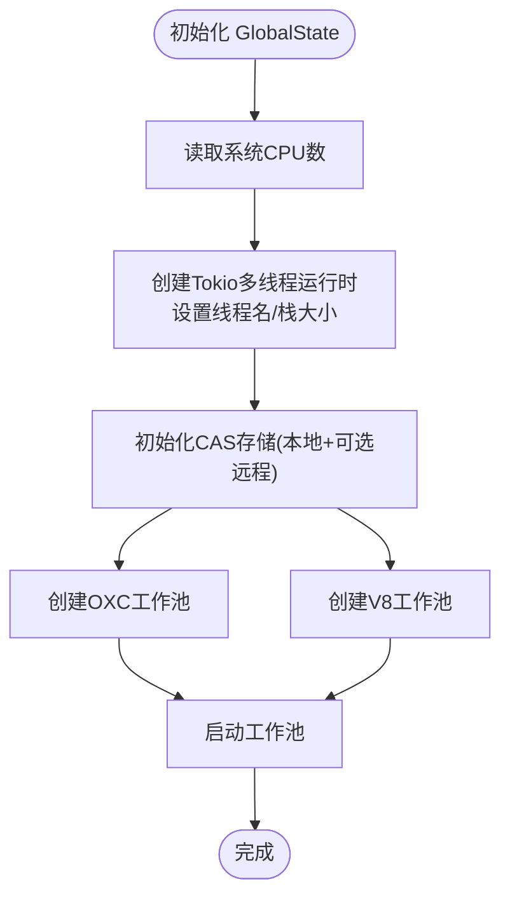

# 运行时API

<cite>
**本文引用的文件**
- [zako_core/src/lib.rs](file://zako_core/src/lib.rs)
- [zako_core/src/engine.rs](file://zako_core/src/engine.rs)
- [zako_core/src/v8context.rs](file://zako_core/src/v8context.rs)
- [zako_core/src/v8platform.rs](file://zako_core/src/v8platform.rs)
- [zako_core/src/context.rs](file://zako_core/src/context.rs)
- [zako_core/src/global_state.rs](file://zako_core/src/global_state.rs)
- [zako_core/src/sandbox.rs](file://zako_core/src/sandbox.rs)
- [zako_core/src/config.rs](file://zako_core/src/config.rs)
- [zako_core/src/builtin/extension/rt.rs](file://zako_core/src/builtin/extension/rt.rs)
- [zako_js/src/builtins/rt/index.ts](file://zako_js/src/builtins/rt/index.ts)
- [zako_core/src/builtin/extension/mod.rs](file://zako_core/src/builtin/extension/mod.rs)
</cite>

## 目录
1. [简介](#简介)
2. [项目结构](#项目结构)
3. [核心组件](#核心组件)
4. [架构总览](#架构总览)
5. [详细组件分析](#详细组件分析)
6. [依赖关系分析](#依赖关系分析)
7. [性能考虑](#性能考虑)
8. [故障排查指南](#故障排查指南)
9. [结论](#结论)
10. [附录](#附录)

## 简介
本文件为 Zako 运行时 API 的权威参考文档，聚焦于运行时相关的接口与能力，涵盖以下主题：
- 进程与线程模型：Tokio 运行时、工作池、线程栈大小与 CPU 资源分配
- 内存与资源控制：全局资源池、CAS 存储、并发缓存与哈希策略
- 垃圾回收与 V8 平台：V8 平台初始化、致命错误处理、上下文类型与执行边界
- 配置与调优：配置解析、模板生成、运行时参数与平台线程数
- 错误处理与恢复：统一错误类型、异常捕获与转换、致命错误日志
- 性能监控与调试：执行跟踪、事件循环、上下文作用域
- 安全隔离：沙箱路径校验、访问越界保护
- 与 V8 引擎交互：模块加载、扩展注入、执行上下文设置、JSON 输入传递

## 项目结构
Zako 的运行时能力主要由核心库 zako_core 提供，并通过内置扩展与 V8 引擎集成。zako_js 提供 TypeScript 层的内置模块与类型定义。

图表来源
- [zako_core/src/lib.rs](file://zako_core/src/lib.rs#L1-L119)
- [zako_core/src/engine.rs](file://zako_core/src/engine.rs#L1-L306)
- [zako_core/src/v8context.rs](file://zako_core/src/v8context.rs#L1-L62)
- [zako_core/src/v8platform.rs](file://zako_core/src/v8platform.rs#L1-L30)
- [zako_core/src/context.rs](file://zako_core/src/context.rs#L1-L229)
- [zako_core/src/global_state.rs](file://zako_core/src/global_state.rs#L1-L153)
- [zako_core/src/sandbox.rs](file://zako_core/src/sandbox.rs#L1-L82)
- [zako_core/src/config.rs](file://zako_core/src/config.rs#L1-L119)
- [zako_core/src/builtin/extension/rt.rs](file://zako_core/src/builtin/extension/rt.rs#L1-L7)
- [zako_js/src/builtins/rt/index.ts](file://zako_js/src/builtins/rt/index.ts#L1-L15)

章节来源
- [zako_core/src/lib.rs](file://zako_core/src/lib.rs#L1-L119)

## 核心组件
- 引擎 Engine：封装 JsRuntime，负责模块加载、评估与事件循环；支持传入 JSON 执行上下文、回调式结果处理与异常捕获。
- V8 平台 v8platform：单例平台初始化，设置线程池大小与致命错误处理器。
- V8 上下文类型 V8ContextInput/Output：区分包脚本、构建脚本、规则、工具链、配置等不同执行场景与权限。
- 全局状态 GlobalState：集中管理 Interner、资源池、Tokio 运行时、CAS 存储、工作池与系统信息。
- 构建上下文 BuildContext/ContextHandler：携带项目根、入口名、包源、全局状态与资源池引用。
- 沙箱 Sandbox：对文件路径进行规范化与越界检查，防止访问沙箱外资源。
- 配置 Configuration/ResolvedConfiguration：配置解析、模板生成与标签化存储。
- 内置扩展 zako_rt：注册 zako:rt 模块，向 JS 层暴露运行时必要的设置。

章节来源
- [zako_core/src/engine.rs](file://zako_core/src/engine.rs#L1-L306)
- [zako_core/src/v8platform.rs](file://zako_core/src/v8platform.rs#L1-L30)
- [zako_core/src/v8context.rs](file://zako_core/src/v8context.rs#L1-L62)
- [zako_core/src/global_state.rs](file://zako_core/src/global_state.rs#L1-L153)
- [zako_core/src/context.rs](file://zako_core/src/context.rs#L1-L229)
- [zako_core/src/sandbox.rs](file://zako_core/src/sandbox.rs#L1-L82)
- [zako_core/src/config.rs](file://zako_core/src/config.rs#L1-L119)
- [zako_core/src/builtin/extension/rt.rs](file://zako_core/src/builtin/extension/rt.rs#L1-L7)

## 架构总览
Zako 运行时以 Tokio 多线程运行时为核心，结合 V8 引擎与内置扩展，实现可配置、可隔离、可观测的构建执行环境。

图表来源
- [zako_core/src/global_state.rs](file://zako_core/src/global_state.rs#L54-L97)
- [zako_core/src/context.rs](file://zako_core/src/context.rs#L34-L183)
- [zako_core/src/engine.rs](file://zako_core/src/engine.rs#L48-L79)
- [zako_core/src/v8platform.rs](file://zako_core/src/v8platform.rs#L7-L29)
- [zako_core/src/v8context.rs](file://zako_core/src/v8context.rs#L13-L61)
- [zako_core/src/builtin/extension/rt.rs](file://zako_core/src/builtin/extension/rt.rs#L1-L7)
- [zako_core/src/sandbox.rs](file://zako_core/src/sandbox.rs#L28-L81)
- [zako_core/src/config.rs](file://zako_core/src/config.rs#L41-L78)

## 详细组件分析

### 引擎 Engine（进程与模块执行）
- 初始化流程：创建 V8 平台、注入内置扩展（rt、syscall、global、semver、core、console），构建 JsRuntime。
- 模块执行：支持从代码或文件加载主 ES 模块，评估并运行事件循环，返回命名空间对象。
- JSON 上下文：在执行前将 JSON 输入写入全局执行上下文，便于脚本读取。
- 回调式执行：允许在模块评估后传入回调，对 V8 对象进行进一步处理，并统一异常捕获与转换。
- 错误模型：将 CoreError 与 V8Error 统一为 EngineError，便于上层处理。

图表来源
- [zako_core/src/engine.rs](file://zako_core/src/engine.rs#L81-L166)
- [zako_core/src/engine.rs](file://zako_core/src/engine.rs#L168-L300)

章节来源
- [zako_core/src/engine.rs](file://zako_core/src/engine.rs#L19-L306)

### V8 平台与上下文（平台初始化与执行边界）
- 平台初始化：单例平台，主线程设置默认平台并注册致命错误处理器，记录错误日志。
- 上下文类型：根据文件类型（包、构建、规则、工具链、配置）启用不同内置模块与权限，避免跨域访问。

图表来源
- [zako_core/src/v8context.rs](file://zako_core/src/v8context.rs#L13-L61)

章节来源
- [zako_core/src/v8platform.rs](file://zako_core/src/v8platform.rs#L1-L30)
- [zako_core/src/v8context.rs](file://zako_core/src/v8context.rs#L1-L62)

### 全局状态与资源（线程、工作池、CAS）
- 全局状态：集中持有 Interner、资源池、Tokio 运行时、CAS 存储、工作池与系统信息。
- 线程模型：Tokio 多线程运行时，工作线程数量与线程栈大小基于系统资源自动确定。
- 工作池：OXC 转译器与 V8 工作者池独立配置与启动。
- CAS 存储：本地 CAS 路径按启发式策略确定，支持远程存储桥接。

图表来源
- [zako_core/src/global_state.rs](file://zako_core/src/global_state.rs#L56-L97)

章节来源
- [zako_core/src/global_state.rs](file://zako_core/src/global_state.rs#L41-L153)

### 构建上下文与句柄（项目级运行时上下文）
- BuildContext：不可变状态，包含项目根、入口名、包源与全局状态引用。
- ContextHandler：围绕 BuildContext 的轻量句柄，便于传递与比较。
- 资源访问：提供对资源池、Tokio 句柄、CAS 存储、工作池与系统信息的便捷访问。

章节来源
- [zako_core/src/context.rs](file://zako_core/src/context.rs#L34-L183)

### 沙箱（安全隔离）
- 路径规范化：对相对路径与引用路径进行规范化与拼接。
- 越界检查：确保目标路径位于沙箱根之下，否则抛出越界错误。
- 辅助方法：支持直接拼接路径与判断路径是否在沙箱内。

图表来源
- [zako_core/src/sandbox.rs](file://zako_core/src/sandbox.rs#L34-L72)

章节来源
- [zako_core/src/sandbox.rs](file://zako_core/src/sandbox.rs#L1-L82)

### 配置（配置解析与模板）
- Configuration：原始不可变配置，支持生成模板代码。
- ResolvedConfiguration：解析后的配置，键值以标签化存储，支持反解析。
- 解析流程：按键排序，解析标签与默认值，生成解析后配置。

章节来源
- [zako_core/src/config.rs](file://zako_core/src/config.rs#L14-L119)

### 内置扩展与 JS 运行时（zako:rt）
- 扩展注册：通过 deno_core::extension 注册 zako_rt，ESM 入口为 zako:rt，JS 实现位于 dist/builtins/rt.js。
- JS 层错误：提供 ZakoInternalError 类型，用于标识内部错误并建议上报。

章节来源
- [zako_core/src/builtin/extension/rt.rs](file://zako_core/src/builtin/extension/rt.rs#L1-L7)
- [zako_core/src/builtin/extension/mod.rs](file://zako_core/src/builtin/extension/mod.rs#L1-L17)
- [zako_js/src/builtins/rt/index.ts](file://zako_js/src/builtins/rt/index.ts#L1-L15)

## 依赖关系分析
- 引擎依赖 V8 平台与内置扩展，通过 RuntimeOptions 注入模块加载器与扩展集合。
- 全局状态为引擎与上下文提供共享资源（Tokio、CAS、工作池）。
- 沙箱与配置在上下文中被复用，保障执行边界与配置一致性。
- 内置扩展 zako_rt 作为运行时基础能力的 JS 入口。

图表来源
- [zako_core/src/engine.rs](file://zako_core/src/engine.rs#L48-L79)
- [zako_core/src/v8platform.rs](file://zako_core/src/v8platform.rs#L7-L29)
- [zako_core/src/builtin/extension/rt.rs](file://zako_core/src/builtin/extension/rt.rs#L1-L7)
- [zako_core/src/global_state.rs](file://zako_core/src/global_state.rs#L54-L97)
- [zako_core/src/context.rs](file://zako_core/src/context.rs#L138-L183)
- [zako_core/src/sandbox.rs](file://zako_core/src/sandbox.rs#L28-L81)
- [zako_core/src/config.rs](file://zako_core/src/config.rs#L41-L78)

章节来源
- [zako_core/src/engine.rs](file://zako_core/src/engine.rs#L1-L306)
- [zako_core/src/global_state.rs](file://zako_core/src/global_state.rs#L1-L153)
- [zako_core/src/context.rs](file://zako_core/src/context.rs#L1-L229)
- [zako_core/src/sandbox.rs](file://zako_core/src/sandbox.rs#L1-L82)
- [zako_core/src/config.rs](file://zako_core/src/config.rs#L1-L119)

## 性能考虑
- 线程与栈：Tokio 工作线程数与线程栈大小基于系统资源自动确定，减少手工调优成本。
- 并发容器：使用 DashMap/DashSet/Moka Cache 等并发数据结构，降低锁竞争。
- V8 平台：合理设置线程池大小与空闲任务支持，平衡吞吐与延迟。
- 事件循环：在模块评估后运行事件循环，确保异步任务及时推进。
- 模块加载：通过模块加载器与扩展注入，减少重复初始化开销。

## 故障排查指南
- 致命错误：V8 致命错误会被记录到日志，定位文件与行号有助于快速定位问题。
- 引擎错误：CoreError 与 V8Error 统一包装为 EngineError，便于上层捕获与分类处理。
- 异常捕获：提供 try-catch 包装与对象到 Error 的转换，确保异常信息完整。
- 越界访问：沙箱路径校验失败会抛出明确的越界错误，检查路径拼接与规范化逻辑。
- 配置解析：解析失败时检查键名与默认值格式，确认标签解析与国际化映射。

章节来源
- [zako_core/src/v8platform.rs](file://zako_core/src/v8platform.rs#L22-L27)
- [zako_core/src/engine.rs](file://zako_core/src/engine.rs#L24-L31)
- [zako_core/src/engine.rs](file://zako_core/src/engine.rs#L200-L232)
- [zako_core/src/sandbox.rs](file://zako_core/src/sandbox.rs#L19-L25)

## 结论
Zako 运行时通过清晰的分层设计与强约束的执行边界，提供了稳定、可扩展且易于调试的构建执行环境。引擎、平台、上下文与全局状态协同工作，配合沙箱与配置系统，既保证了灵活性，又强化了安全性与可维护性。建议在生产环境中关注平台线程数、工作池规模与事件循环调度，结合日志与异常处理策略，持续优化整体性能与稳定性。

## 附录
- 关键 API 一览
  - 引擎执行：模块加载、评估、事件循环、JSON 上下文、回调式处理
  - 平台初始化：线程池大小、空闲任务支持、致命错误处理
  - 上下文类型：包脚本、构建脚本、规则、工具链、配置
  - 全局状态：Tokio 运行时、资源池、CAS 存储、工作池
  - 沙箱：路径规范化、越界检查
  - 配置：模板生成、解析、标签化存储
  - 内置扩展：zako:rt 注册与 JS 实现