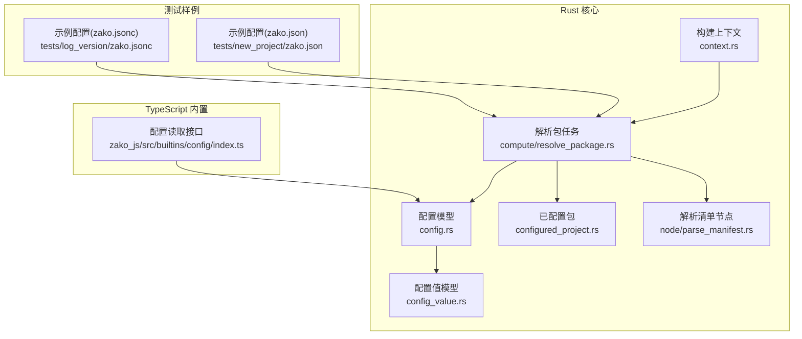
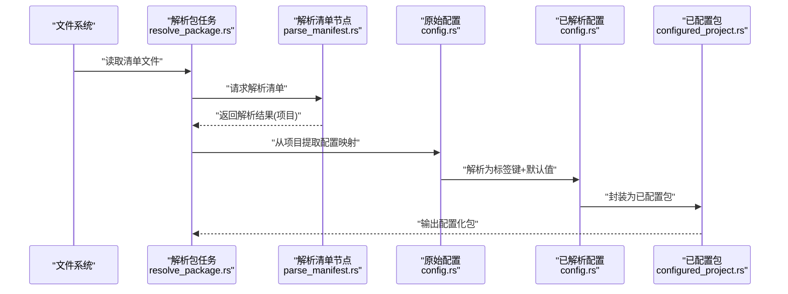
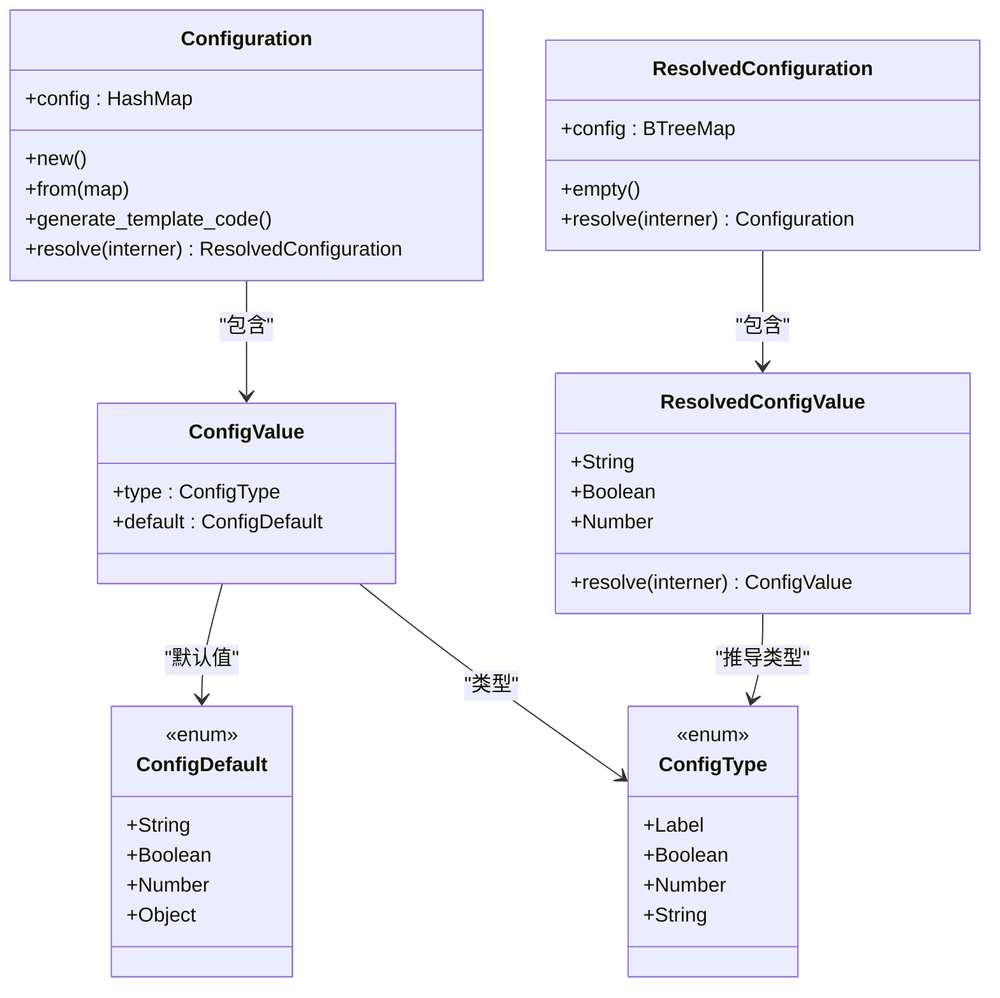
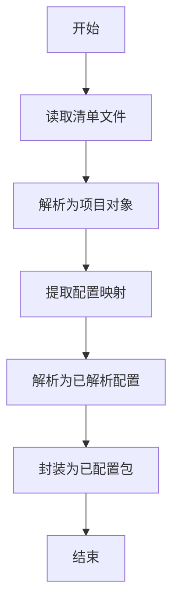
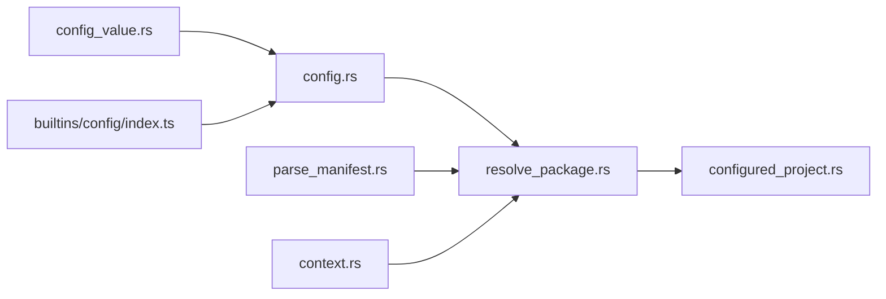

# 配置API

<cite>
**本文引用的文件**
- [zako_core/src/config.rs](file://zako_core/src/config.rs)
- [zako_core/src/config_value.rs](file://zako_core/src/config_value.rs)
- [zako_core/src/configured_project.rs](file://zako_core/src/configured_project.rs)
- [zako_core/src/compute/resolve_package.rs](file://zako_core/src/compute/resolve_package.rs)
- [zako_core/src/node/parse_manifest.rs](file://zako_core/src/node/parse_manifest.rs)
- [zako_core/src/context.rs](file://zako_core/src/context.rs)
- [zako_js/src/builtins/config/index.ts](file://zako_js/src/builtins/config/index.ts)
- [zako_core/bindings/config_type.d.ts](file://zako_core/bindings/config_type.d.ts)
- [zako_core/bindings/config_value.d.ts](file://zako_core/bindings/config_value.d.ts)
- [zako_core/bindings/config_operation.d.ts](file://zako_core/bindings/config_operation.d.ts)
- [tests/new_project/zako.json](file://tests/new_project/zako.json)
- [tests/log_version/zako.jsonc](file://tests/log_version/zako.jsonc)
</cite>

## 目录
1. [简介](#简介)
2. [项目结构](#项目结构)
3. [核心组件](#核心组件)
4. [架构总览](#架构总览)
5. [详细组件分析](#详细组件分析)
6. [依赖关系分析](#依赖关系分析)
7. [性能考量](#性能考量)
8. [故障排查指南](#故障排查指南)
9. [结论](#结论)
10. [附录](#附录)

## 简介
本文件为 Zako 配置 API 的权威参考文档，覆盖配置对象模型、类型定义、解析与合并流程、模板生成、以及与构建过程的集成方式。内容面向不同技术背景的读者，既提供高层概览，也包含深入到代码级别的细节说明与可视化图示。

## 项目结构
围绕配置 API 的核心代码主要分布在以下模块：
- Rust 核心：配置模型与解析、构建上下文、包解析与配置注入
- TypeScript 内置：配置读取接口（通过全局 CONFIG）
- 测试样例：真实配置文件示例，展示配置项声明与继承用法

图表来源
- [zako_core/src/config.rs](file://zako_core/src/config.rs#L14-L89)
- [zako_core/src/config_value.rs](file://zako_core/src/config_value.rs#L23-L165)
- [zako_core/src/configured_project.rs](file://zako_core/src/configured_project.rs#L16-L21)
- [zako_core/src/context.rs](file://zako_core/src/context.rs#L34-L183)
- [zako_core/src/compute/resolve_package.rs](file://zako_core/src/compute/resolve_package.rs#L26-L139)
- [zako_core/src/node/parse_manifest.rs](file://zako_core/src/node/parse_manifest.rs#L3-L11)
- [zako_js/src/builtins/config/index.ts](file://zako_js/src/builtins/config/index.ts#L1-L7)
- [tests/new_project/zako.json](file://tests/new_project/zako.json#L1-L18)
- [tests/log_version/zako.jsonc](file://tests/log_version/zako.jsonc#L1-L32)

章节来源
- [zako_core/src/config.rs](file://zako_core/src/config.rs#L1-L119)
- [zako_core/src/config_value.rs](file://zako_core/src/config_value.rs#L1-L166)
- [zako_core/src/configured_project.rs](file://zako_core/src/configured_project.rs#L1-L21)
- [zako_core/src/compute/resolve_package.rs](file://zako_core/src/compute/resolve_package.rs#L1-L140)
- [zako_core/src/node/parse_manifest.rs](file://zako_core/src/node/parse_manifest.rs#L1-L12)
- [zako_core/src/context.rs](file://zako_core/src/context.rs#L1-L229)
- [zako_js/src/builtins/config/index.ts](file://zako_js/src/builtins/config/index.ts#L1-L7)
- [tests/new_project/zako.json](file://tests/new_project/zako.json#L1-L18)
- [tests/log_version/zako.jsonc](file://tests/log_version/zako.jsonc#L1-L32)

## 核心组件
- 配置对象模型
  - 原始配置：不可变的键值集合，键为字符串，值为配置项定义
  - 已解析配置：键为标签（Label），值为具体默认值，便于构建图存储与查询
- 配置值模型
  - 配置项定义：包含类型与默认值；默认值支持字符串、布尔、数字或“配置操作”
  - 配置操作：用于声明继承关系与可选动作
  - 已解析值：字符串、布尔、数字三类，用于最终构建阶段
- 构建上下文与包解析
  - 解析包任务负责从清单中读取配置，并将其转换为内部可解析格式
  - 构建上下文提供路径、源信息、工作池等资源

章节来源
- [zako_core/src/config.rs](file://zako_core/src/config.rs#L14-L89)
- [zako_core/src/config_value.rs](file://zako_core/src/config_value.rs#L23-L165)
- [zako_core/src/compute/resolve_package.rs](file://zako_core/src/compute/resolve_package.rs#L26-L139)
- [zako_core/src/context.rs](file://zako_core/src/context.rs#L34-L183)

## 架构总览
下图展示了从清单文件到构建图中配置对象的关键流转：

图表来源
- [zako_core/src/compute/resolve_package.rs](file://zako_core/src/compute/resolve_package.rs#L26-L139)
- [zako_core/src/node/parse_manifest.rs](file://zako_core/src/node/parse_manifest.rs#L3-L11)
- [zako_core/src/config.rs](file://zako_core/src/config.rs#L14-L89)
- [zako_core/src/configured_project.rs](file://zako_core/src/configured_project.rs#L16-L21)

## 详细组件分析

### 配置对象与解析流程
- 原始配置（Configuration）
  - 结构：键为字符串，值为配置项定义
  - 能力：生成模板代码、解析为已解析配置
- 已解析配置（ResolvedConfiguration）
  - 结构：键为标签（Label），值为具体默认值
  - 能力：反向解析回原始配置
- 解析流程要点
  - 键排序后逐项解析为标签
  - 支持字符串、布尔、数字默认值；对象默认值预留分支
  - 使用标签索引以保证稳定顺序与可检索性

图表来源
- [zako_core/src/config.rs](file://zako_core/src/config.rs#L14-L118)
- [zako_core/src/config_value.rs](file://zako_core/src/config_value.rs#L23-L165)

章节来源
- [zako_core/src/config.rs](file://zako_core/src/config.rs#L14-L118)
- [zako_core/src/config_value.rs](file://zako_core/src/config_value.rs#L23-L165)

### 配置值与类型定义
- 类型定义
  - ConfigType：标签、布尔、数字、字符串
  - ConfigDefault：字符串、布尔、数字、对象（配置操作）
  - ConfigOperation：继承标识与可选动作
- TypeScript 绑定
  - 自动生成的类型声明文件，确保前端与后端类型一致

章节来源
- [zako_core/src/config_value.rs](file://zako_core/src/config_value.rs#L23-L165)
- [zako_core/bindings/config_type.d.ts](file://zako_core/bindings/config_type.d.ts#L1-L4)
- [zako_core/bindings/config_value.d.ts](file://zako_core/bindings/config_value.d.ts#L1-L6)
- [zako_core/bindings/config_operation.d.ts](file://zako_core/bindings/config_operation.d.ts#L1-L7)

### 包解析与配置注入
- 解析包任务
  - 读取清单文本并解析为项目对象
  - 提取配置映射并解析为内部配置
  - 封装为已配置包，供后续构建使用
- 清单解析节点
  - 定义输入输出结构，承载清单解析结果

图表来源
- [zako_core/src/compute/resolve_package.rs](file://zako_core/src/compute/resolve_package.rs#L26-L139)
- [zako_core/src/node/parse_manifest.rs](file://zako_core/src/node/parse_manifest.rs#L3-L11)

章节来源
- [zako_core/src/compute/resolve_package.rs](file://zako_core/src/compute/resolve_package.rs#L26-L139)
- [zako_core/src/node/parse_manifest.rs](file://zako_core/src/node/parse_manifest.rs#L3-L11)

### 构建上下文与资源
- 构建上下文提供
  - 项目根路径、入口名、包源信息
  - 全局状态、CAS 存储、工作池、系统信息等
- 上下文在配置解析中的作用
  - 作为解析器与标签解析器的共享环境，确保路径与标签解析一致性

章节来源
- [zako_core/src/context.rs](file://zako_core/src/context.rs#L34-L183)

### TypeScript 配置读取接口
- 接口设计
  - 通过全局 CONFIG 访问已解析配置
  - 泛型函数按键读取对应类型的配置值
- 使用场景
  - 在构建脚本或运行时读取配置项，实现条件化行为

章节来源
- [zako_js/src/builtins/config/index.ts](file://zako_js/src/builtins/config/index.ts#L1-L7)

## 依赖关系分析
- 模块耦合
  - 配置模型被包解析任务直接依赖
  - 解析任务依赖清单解析节点与构建上下文
  - 已配置包承载解析后的配置与包元数据
- 外部依赖
  - 标签解析依赖 Interner
  - 哈希计算依赖 Blake3
  - 类型绑定由 ts-rs 生成

图表来源
- [zako_core/src/config_value.rs](file://zako_core/src/config_value.rs#L1-L166)
- [zako_core/src/config.rs](file://zako_core/src/config.rs#L1-L119)
- [zako_core/src/compute/resolve_package.rs](file://zako_core/src/compute/resolve_package.rs#L1-L140)
- [zako_core/src/node/parse_manifest.rs](file://zako_core/src/node/parse_manifest.rs#L1-L12)
- [zako_core/src/configured_project.rs](file://zako_core/src/configured_project.rs#L1-L21)
- [zako_core/src/context.rs](file://zako_core/src/context.rs#L1-L229)
- [zako_js/src/builtins/config/index.ts](file://zako_js/src/builtins/config/index.ts#L1-L7)

章节来源
- [zako_core/src/config_value.rs](file://zako_core/src/config_value.rs#L1-L166)
- [zako_core/src/config.rs](file://zako_core/src/config.rs#L1-L119)
- [zako_core/src/compute/resolve_package.rs](file://zako_core/src/compute/resolve_package.rs#L1-L140)
- [zako_core/src/node/parse_manifest.rs](file://zako_core/src/node/parse_manifest.rs#L1-L12)
- [zako_core/src/configured_project.rs](file://zako_core/src/configured_project.rs#L1-L21)
- [zako_core/src/context.rs](file://zako_core/src/context.rs#L1-L229)
- [zako_js/src/builtins/config/index.ts](file://zako_js/src/builtins/config/index.ts#L1-L7)

## 性能考量
- 哈希与归档
  - 配置与配置值均实现 Blake3 哈希，便于缓存与去重
  - 使用 rkyv 进行序列化/反序列化，降低运行时开销
- 数据结构选择
  - 原始配置使用 HashMap，便于快速插入与查找
  - 已解析配置使用 BTreeMap，保证键有序，利于稳定输出与调试
- 解析路径优化
  - 键排序后统一解析，减少重复解析成本
  - 标签解析失败时尽早报错，避免无效计算

章节来源
- [zako_core/src/config.rs](file://zako_core/src/config.rs#L74-L78)
- [zako_core/src/config_value.rs](file://zako_core/src/config_value.rs#L28-L33)
- [zako_core/src/config_value.rs](file://zako_core/src/config_value.rs#L119-L128)

## 故障排查指南
- 常见错误类型
  - 标签解析失败：检查配置键是否符合标签规范
  - Interner 错误：确认路径与字符串已正确驻留
  - 解析任务异常：检查清单文件格式与字段完整性
- 定位步骤
  - 查看解析包任务日志，确认清单解析成功
  - 校验配置键是否能解析为标签
  - 对比生成的模板代码与期望值
- 修复建议
  - 规范化配置键命名，避免非法字符
  - 确保默认值类型与 ConfigType 匹配
  - 如需继承，请正确填写 ConfigOperation 的继承标识

章节来源
- [zako_core/src/config.rs](file://zako_core/src/config.rs#L91-L99)
- [zako_core/src/compute/resolve_package.rs](file://zako_core/src/compute/resolve_package.rs#L96-L121)

## 结论
Zako 的配置 API 通过清晰的数据模型与严格的解析流程，实现了从清单到构建图的平滑过渡。其类型系统与哈希机制保障了稳定性与可维护性；模板生成能力有助于快速初始化配置。结合测试样例与内置读取接口，开发者可以高效地声明、验证与使用配置项。

## 附录

### 配置对象结构与类型定义
- 配置项定义
  - 字段：类型、默认值
  - 默认值：字符串、布尔、数字、对象（配置操作）
- 已解析值
  - 字段：字符串、布尔、数字
- 类型枚举
  - ConfigType：标签、布尔、数字、字符串
- 配置操作
  - 字段：继承标识、可选动作

章节来源
- [zako_core/src/config_value.rs](file://zako_core/src/config_value.rs#L23-L165)
- [zako_core/bindings/config_type.d.ts](file://zako_core/bindings/config_type.d.ts#L1-L4)
- [zako_core/bindings/config_value.d.ts](file://zako_core/bindings/config_value.d.ts#L1-L6)
- [zako_core/bindings/config_operation.d.ts](file://zako_core/bindings/config_operation.d.ts#L1-L7)

### 配置文件加载与优先级
- 加载机制
  - 通过解析包任务读取清单文件并解析
  - 清单中提取配置映射并解析为内部配置
- 优先级规则
  - 当前项目配置优先于依赖项配置
  - 继承关系仅在同名键存在时生效
  - 未显式声明的键采用默认值

章节来源
- [zako_core/src/compute/resolve_package.rs](file://zako_core/src/compute/resolve_package.rs#L101-L110)
- [tests/log_version/zako.jsonc](file://tests/log_version/zako.jsonc#L14-L31)

### 实际配置示例与场景
- 示例一：基础布尔选项
  - 位置：tests/new_project/zako.json
  - 场景：启用调试模式
- 示例二：继承与描述
  - 位置：tests/log_version/zako.jsonc
  - 场景：从全局或特定包继承配置，并添加描述信息

章节来源
- [tests/new_project/zako.json](file://tests/new_project/zako.json#L9-L16)
- [tests/log_version/zako.jsonc](file://tests/log_version/zako.jsonc#L14-L31)

### 与构建过程的关系
- 清单解析 → 配置解析 → 已配置包 → 后续构建步骤
- 构建上下文贯穿始终，确保路径与标签解析一致
- TypeScript 内置接口允许在运行时读取配置值

章节来源
- [zako_core/src/compute/resolve_package.rs](file://zako_core/src/compute/resolve_package.rs#L26-L139)
- [zako_core/src/context.rs](file://zako_core/src/context.rs#L34-L183)
- [zako_js/src/builtins/config/index.ts](file://zako_js/src/builtins/config/index.ts#L1-L7)