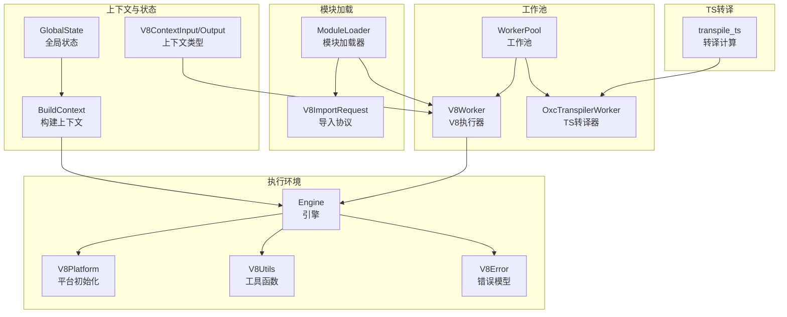
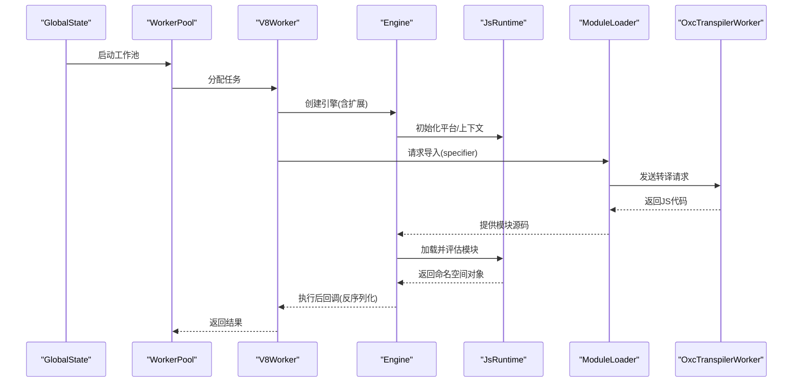
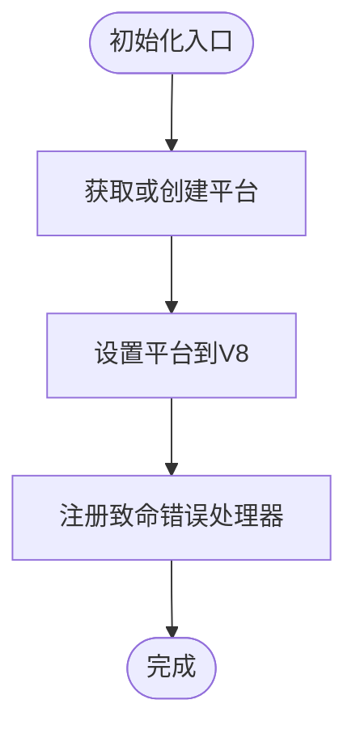
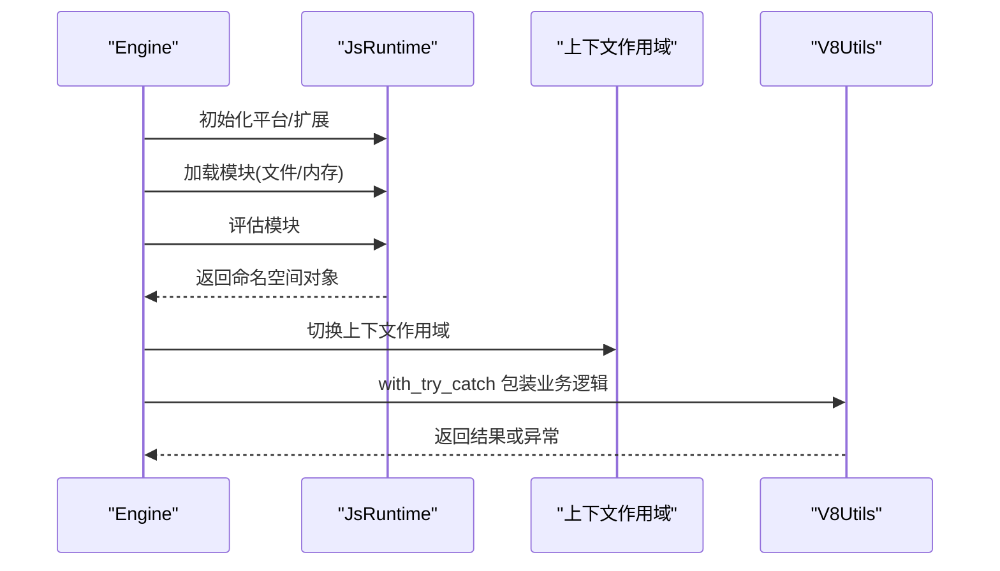
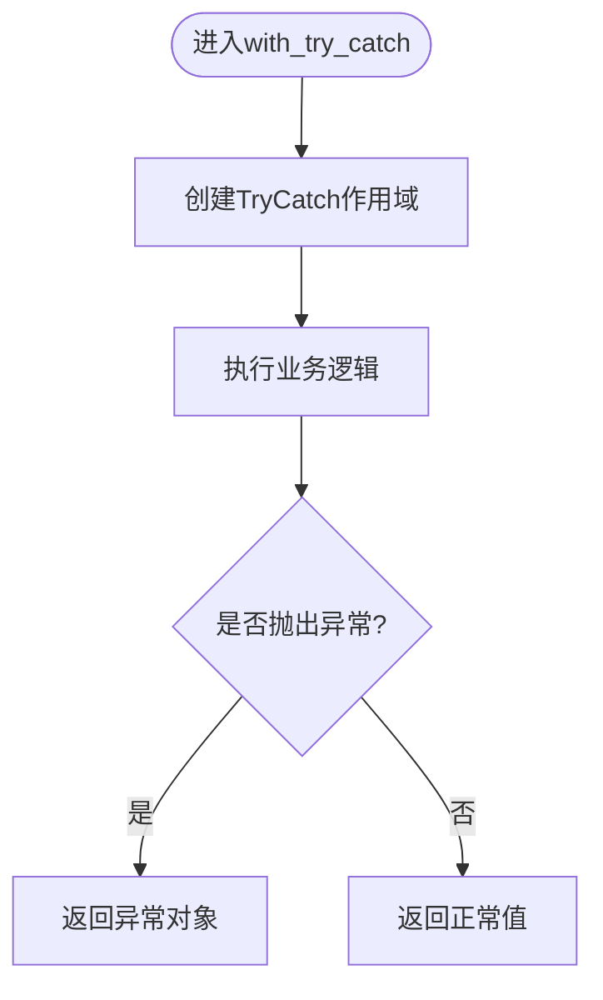
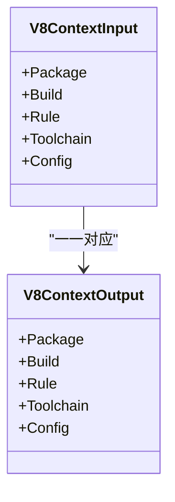
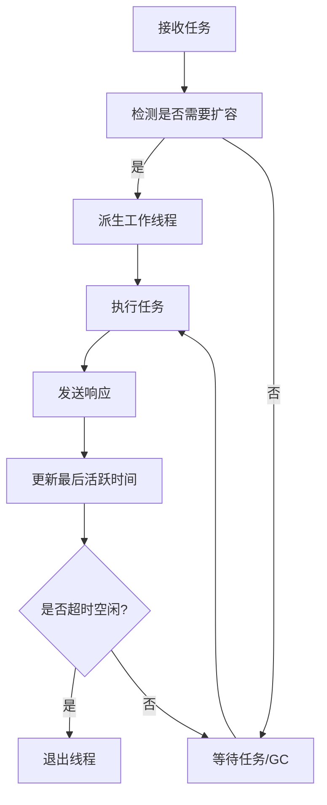
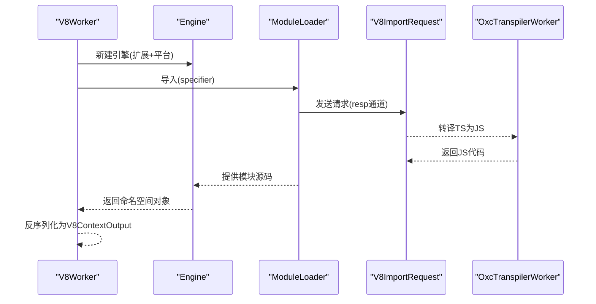
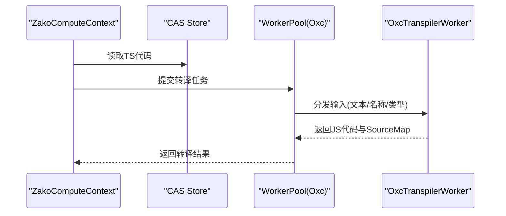
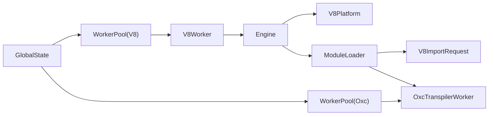

# V8执行环境

<cite>
**本文引用的文件**
- [zako_core/src/v8context.rs](file://zako_core/src/v8context.rs)
- [zako_core/src/v8platform.rs](file://zako_core/src/v8platform.rs)
- [zako_core/src/v8utils.rs](file://zako_core/src/v8utils.rs)
- [zako_core/src/v8error.rs](file://zako_core/src/v8error.rs)
- [zako_core/src/engine.rs](file://zako_core/src/engine.rs)
- [zako_core/src/context.rs](file://zako_core/src/context.rs)
- [zako_core/src/global_state.rs](file://zako_core/src/global_state.rs)
- [zako_core/src/module_loader/mod.rs](file://zako_core/src/module_loader/mod.rs)
- [zako_core/src/worker/v8worker.rs](file://zako_core/src/worker/v8worker.rs)
- [zako_core/src/worker/worker_pool.rs](file://zako_core/src/worker/worker_pool.rs)
- [zako_core/src/worker/protocol.rs](file://zako_core/src/worker/protocol.rs)
- [zako_core/src/worker/oxc_worker.rs](file://zako_core/src/worker/oxc_worker.rs)
- [zako_core/src/compute/transpile_ts.rs](file://zako_core/src/compute/transpile_ts.rs)
- [zako_core/src/builtin/extension/mod.rs](file://zako_core/src/builtin/extension/mod.rs)
</cite>

## 目录
1. [简介](#简介)
2. [项目结构](#项目结构)
3. [核心组件](#核心组件)
4. [架构总览](#架构总览)
5. [组件详解](#组件详解)
6. [依赖关系分析](#依赖关系分析)
7. [性能考量](#性能考量)
8. [故障排查指南](#故障排查指南)
9. [结论](#结论)
10. [附录](#附录)

## 简介
本文件面向需要在Zako构建系统中使用V8执行环境的JavaScript与系统开发者，系统性阐述以下主题：
- V8集成机制与平台初始化
- 确定性执行与隔离环境
- 权限控制与上下文类型
- 工作池架构与任务调度
- 上下文管理与模块加载
- JavaScript到Rust数据交换与错误处理
- 与TypeScript转译器的协作与性能优化
- 常见执行问题与调试方法

目标是帮助读者快速理解并正确使用V8执行环境，同时在遇到问题时具备定位与解决能力。

## 项目结构
围绕V8执行环境的关键目录与文件如下：
- 引擎与平台：engine.rs、v8platform.rs、v8utils.rs、v8error.rs
- 上下文与全局状态：v8context.rs、context.rs、global_state.rs
- 模块加载与导入协议：module_loader/mod.rs、worker/protocol.rs
- 工作池与V8执行器：worker/worker_pool.rs、worker/v8worker.rs
- TypeScript转译与协作：compute/transpile_ts.rs、worker/oxc_worker.rs
- 内置扩展命名规范：builtin/extension/mod.rs

图表来源
- [zako_core/src/engine.rs](file://zako_core/src/engine.rs#L1-L306)
- [zako_core/src/v8platform.rs](file://zako_core/src/v8platform.rs#L1-L30)
- [zako_core/src/v8utils.rs](file://zako_core/src/v8utils.rs#L1-L188)
- [zako_core/src/v8error.rs](file://zako_core/src/v8error.rs#L1-L31)
- [zako_core/src/context.rs](file://zako_core/src/context.rs#L1-L229)
- [zako_core/src/global_state.rs](file://zako_core/src/global_state.rs#L1-L153)
- [zako_core/src/v8context.rs](file://zako_core/src/v8context.rs#L1-L62)
- [zako_core/src/module_loader/mod.rs](file://zako_core/src/module_loader/mod.rs#L1-L228)
- [zako_core/src/worker/protocol.rs](file://zako_core/src/worker/protocol.rs#L1-L11)
- [zako_core/src/worker/worker_pool.rs](file://zako_core/src/worker/worker_pool.rs#L1-L185)
- [zako_core/src/worker/v8worker.rs](file://zako_core/src/worker/v8worker.rs#L1-L147)
- [zako_core/src/worker/oxc_worker.rs](file://zako_core/src/worker/oxc_worker.rs#L1-L150)
- [zako_core/src/compute/transpile_ts.rs](file://zako_core/src/compute/transpile_ts.rs#L1-L113)

章节来源
- [zako_core/src/engine.rs](file://zako_core/src/engine.rs#L1-L306)
- [zako_core/src/v8platform.rs](file://zako_core/src/v8platform.rs#L1-L30)
- [zako_core/src/v8utils.rs](file://zako_core/src/v8utils.rs#L1-L188)
- [zako_core/src/v8error.rs](file://zako_core/src/v8error.rs#L1-L31)
- [zako_core/src/context.rs](file://zako_core/src/context.rs#L1-L229)
- [zako_core/src/global_state.rs](file://zako_core/src/global_state.rs#L1-L153)
- [zako_core/src/v8context.rs](file://zako_core/src/v8context.rs#L1-L62)
- [zako_core/src/module_loader/mod.rs](file://zako_core/src/module_loader/mod.rs#L1-L228)
- [zako_core/src/worker/protocol.rs](file://zako_core/src/worker/protocol.rs#L1-L11)
- [zako_core/src/worker/worker_pool.rs](file://zako_core/src/worker/worker_pool.rs#L1-L185)
- [zako_core/src/worker/v8worker.rs](file://zako_core/src/worker/v8worker.rs#L1-L147)
- [zako_core/src/worker/oxc_worker.rs](file://zako_core/src/worker/oxc_worker.rs#L1-L150)
- [zako_core/src/compute/transpile_ts.rs](file://zako_core/src/compute/transpile_ts.rs#L1-L113)

## 核心组件
- 平台初始化与致命错误处理：通过单例平台句柄统一配置线程池大小与空闲任务支持，并注册V8致命错误处理器。
- 引擎与上下文：封装JsRuntime生命周期、模块加载、事件循环与上下文作用域；提供JSON输入注入与模块执行后处理。
- 工具函数：封装TryCatch、Promise事件循环推进、上下文作用域切换、异常对象到错误信息的转换。
- 错误模型：区分可恢复异常与不可继续的致命错误，承载模块定位、消息、堆栈与附加信息。
- 工作池：通用线程池实现，支持动态扩容、空闲回收、GC广播与取消令牌。
- V8执行器：基于引擎执行指定模块，将JS返回值反序列化为Rust侧输出。
- 模块加载器：基于Deno Core ModuleLoader接口，支持异步请求外部源码并通过通道回传。
- TS转译：通过Oxc工作池将TS源码转译为JS，供V8执行器导入。

章节来源
- [zako_core/src/v8platform.rs](file://zako_core/src/v8platform.rs#L1-L30)
- [zako_core/src/engine.rs](file://zako_core/src/engine.rs#L1-L306)
- [zako_core/src/v8utils.rs](file://zako_core/src/v8utils.rs#L1-L188)
- [zako_core/src/v8error.rs](file://zako_core/src/v8error.rs#L1-L31)
- [zako_core/src/worker/worker_pool.rs](file://zako_core/src/worker/worker_pool.rs#L1-L185)
- [zako_core/src/worker/v8worker.rs](file://zako_core/src/worker/v8worker.rs#L1-L147)
- [zako_core/src/module_loader/mod.rs](file://zako_core/src/module_loader/mod.rs#L1-L228)
- [zako_core/src/compute/transpile_ts.rs](file://zako_core/src/compute/transpile_ts.rs#L1-L113)

## 架构总览
下图展示了从全局状态到工作池、引擎、模块加载与V8执行的整体流程。

图表来源
- [zako_core/src/global_state.rs](file://zako_core/src/global_state.rs#L1-L153)
- [zako_core/src/worker/worker_pool.rs](file://zako_core/src/worker/worker_pool.rs#L1-L185)
- [zako_core/src/worker/v8worker.rs](file://zako_core/src/worker/v8worker.rs#L1-L147)
- [zako_core/src/engine.rs](file://zako_core/src/engine.rs#L1-L306)
- [zako_core/src/module_loader/mod.rs](file://zako_core/src/module_loader/mod.rs#L1-L228)
- [zako_core/src/worker/oxc_worker.rs](file://zako_core/src/worker/oxc_worker.rs#L1-L150)

## 组件详解

### V8平台初始化与致命错误处理
- 单例平台：通过OnceLock缓存共享的v8::Platform实例，主线程设置线程池大小与空闲任务支持。
- 致命错误处理：注册V8致命错误处理器，记录文件、行号与原因，便于诊断。

图表来源
- [zako_core/src/v8platform.rs](file://zako_core/src/v8platform.rs#L1-L30)

章节来源
- [zako_core/src/v8platform.rs](file://zako_core/src/v8platform.rs#L1-L30)

### 引擎与上下文管理
- 引擎生命周期：初始化平台、构造模块加载器、注册内置扩展，创建JsRuntime。
- 模块执行：支持从文件或内存加载主ES模块，评估并运行事件循环，返回模块命名空间对象。
- JSON输入注入：在执行前将JSON对象写入globalThis.executionContext，便于脚本读取。
- 执行后处理：以闭包形式对模块命名空间进行二次处理，自动捕获异常并转换为错误模型。

图表来源
- [zako_core/src/engine.rs](file://zako_core/src/engine.rs#L1-L306)
- [zako_core/src/v8utils.rs](file://zako_core/src/v8utils.rs#L1-L188)

章节来源
- [zako_core/src/engine.rs](file://zako_core/src/engine.rs#L1-L306)
- [zako_core/src/v8utils.rs](file://zako_core/src/v8utils.rs#L1-L188)

### 工具函数：Promise事件循环与异常处理
- Promise事件循环推进：持续微任务检查与平台消息循环泵，避免CPU空转；若Promise仍待决则判定死锁并报错。
- 上下文作用域封装：简化HandleScope与ContextScope的创建与使用。
- 异常转换：将异常对象转换为字符串消息与可选堆栈，形成统一错误模型。

图表来源
- [zako_core/src/v8utils.rs](file://zako_core/src/v8utils.rs#L1-L188)
- [zako_core/src/v8error.rs](file://zako_core/src/v8error.rs#L1-L31)

章节来源
- [zako_core/src/v8utils.rs](file://zako_core/src/v8utils.rs#L1-L188)
- [zako_core/src/v8error.rs](file://zako_core/src/v8error.rs#L1-L31)

### 权限控制与上下文类型
- 上下文类型枚举：定义不同脚本场景（如package/build/rule/toolchain/config）及其允许的能力与返回值类型。
- 上下文输出：与输入对应，用于约束脚本执行后的返回值结构。

图表来源
- [zako_core/src/v8context.rs](file://zako_core/src/v8context.rs#L1-L62)

章节来源
- [zako_core/src/v8context.rs](file://zako_core/src/v8context.rs#L1-L62)

### 工作池架构与任务调度
- 动态扩容：当队列积压或当前无活跃线程且未达上限时，乐观锁尝试增加活跃计数并派生新线程。
- 空闲回收：线程在超时内无活动则退出，减少资源占用。
- GC广播：通过广播通道向所有工作线程触发清理操作。
- 取消令牌：每个任务携带取消令牌，支持中断。

图表来源
- [zako_core/src/worker/worker_pool.rs](file://zako_core/src/worker/worker_pool.rs#L1-L185)

章节来源
- [zako_core/src/worker/worker_pool.rs](file://zako_core/src/worker/worker_pool.rs#L1-L185)

### V8执行器与模块加载
- V8执行器：根据上下文类型选择扩展集合，创建引擎，执行模块并反序列化返回值。
- 模块加载器：将模块导入请求通过oneshot通道交由TS转译器或其他来源处理，最终返回JS源码给引擎。

图表来源
- [zako_core/src/worker/v8worker.rs](file://zako_core/src/worker/v8worker.rs#L1-L147)
- [zako_core/src/engine.rs](file://zako_core/src/engine.rs#L1-L306)
- [zako_core/src/module_loader/mod.rs](file://zako_core/src/module_loader/mod.rs#L1-L228)
- [zako_core/src/worker/protocol.rs](file://zako_core/src/worker/protocol.rs#L1-L11)
- [zako_core/src/worker/oxc_worker.rs](file://zako_core/src/worker/oxc_worker.rs#L1-L150)

章节来源
- [zako_core/src/worker/v8worker.rs](file://zako_core/src/worker/v8worker.rs#L1-L147)
- [zako_core/src/module_loader/mod.rs](file://zako_core/src/module_loader/mod.rs#L1-L228)
- [zako_core/src/worker/protocol.rs](file://zako_core/src/worker/protocol.rs#L1-L11)
- [zako_core/src/worker/oxc_worker.rs](file://zako_core/src/worker/oxc_worker.rs#L1-L150)

### TypeScript转译器协作
- 计算流程：从CAS读取TS代码，提交至Oxc工作池进行转译，产出JS与可选SourceMap。
- 输出哈希：对转译结果进行哈希，便于缓存与去重。
- 与V8的关系：转译后的JS通过模块加载器进入V8执行器，实现TS到JS的端到端链路。

图表来源
- [zako_core/src/compute/transpile_ts.rs](file://zako_core/src/compute/transpile_ts.rs#L1-L113)
- [zako_core/src/worker/oxc_worker.rs](file://zako_core/src/worker/oxc_worker.rs#L1-L150)

章节来源
- [zako_core/src/compute/transpile_ts.rs](file://zako_core/src/compute/transpile_ts.rs#L1-L113)
- [zako_core/src/worker/oxc_worker.rs](file://zako_core/src/worker/oxc_worker.rs#L1-L150)

### JavaScript到Rust的数据交换
- 输入：通过引擎执行前将JSON注入globalThis.executionContext，供脚本读取。
- 输出：模块命名空间对象经反序列化后映射到V8ContextOutput，严格遵循上下文类型约束。
- 异常：异常对象通过工具函数转换为字符串消息与堆栈，统一由错误模型承载。

章节来源
- [zako_core/src/engine.rs](file://zako_core/src/engine.rs#L111-L166)
- [zako_core/src/v8utils.rs](file://zako_core/src/v8utils.rs#L167-L187)
- [zako_core/src/v8context.rs](file://zako_core/src/v8context.rs#L39-L61)

### 内置扩展命名规范
- 规范：内置模块名规则为zako_$name，导出JS模块名为zako:$name，便于识别与加载。

章节来源
- [zako_core/src/builtin/extension/mod.rs](file://zako_core/src/builtin/extension/mod.rs#L1-L17)

## 依赖关系分析
- 引擎依赖平台初始化与内置扩展，负责模块加载与事件循环。
- 工作池为V8执行器与TS转译器提供并发执行能力。
- 模块加载器通过导入协议与转译器协作，保证V8仅消费已转译的JS。
- 全局状态聚合Tokio运行时、CAS存储与工作池，作为系统级资源中心。

图表来源
- [zako_core/src/global_state.rs](file://zako_core/src/global_state.rs#L1-L153)
- [zako_core/src/worker/worker_pool.rs](file://zako_core/src/worker/worker_pool.rs#L1-L185)
- [zako_core/src/worker/v8worker.rs](file://zako_core/src/worker/v8worker.rs#L1-L147)
- [zako_core/src/worker/oxc_worker.rs](file://zako_core/src/worker/oxc_worker.rs#L1-L150)
- [zako_core/src/engine.rs](file://zako_core/src/engine.rs#L1-L306)
- [zako_core/src/v8platform.rs](file://zako_core/src/v8platform.rs#L1-L30)
- [zako_core/src/module_loader/mod.rs](file://zako_core/src/module_loader/mod.rs#L1-L228)
- [zako_core/src/worker/protocol.rs](file://zako_core/src/worker/protocol.rs#L1-L11)

章节来源
- [zako_core/src/global_state.rs](file://zako_core/src/global_state.rs#L1-L153)
- [zako_core/src/worker/worker_pool.rs](file://zako_core/src/worker/worker_pool.rs#L1-L185)
- [zako_core/src/worker/v8worker.rs](file://zako_core/src/worker/v8worker.rs#L1-L147)
- [zako_core/src/worker/oxc_worker.rs](file://zako_core/src/worker/oxc_worker.rs#L1-L150)
- [zako_core/src/engine.rs](file://zako_core/src/engine.rs#L1-L306)
- [zako_core/src/v8platform.rs](file://zako_core/src/v8platform.rs#L1-L30)
- [zako_core/src/module_loader/mod.rs](file://zako_core/src/module_loader/mod.rs#L1-L228)
- [zako_core/src/worker/protocol.rs](file://zako_core/src/worker/protocol.rs#L1-L11)

## 性能考量
- 线程池与事件循环：平台初始化时设置线程池大小，结合微任务与平台消息循环泵避免忙等；Promise长期未解决将触发死锁保护。
- 工作池动态扩容：基于队列长度与活跃线程数进行乐观锁扩容，空闲线程按超时退出，降低资源占用。
- 模块加载异步化：通过oneshot通道异步获取源码，避免阻塞主线程。
- TS转译缓存：转译结果进行哈希，便于后续复用与去重。
- 上下文作用域封装：减少重复创建Scope的成本，提升执行效率。

章节来源
- [zako_core/src/v8platform.rs](file://zako_core/src/v8platform.rs#L1-L30)
- [zako_core/src/v8utils.rs](file://zako_core/src/v8utils.rs#L39-L90)
- [zako_core/src/worker/worker_pool.rs](file://zako_core/src/worker/worker_pool.rs#L121-L138)
- [zako_core/src/module_loader/mod.rs](file://zako_core/src/module_loader/mod.rs#L152-L219)
- [zako_core/src/compute/transpile_ts.rs](file://zako_core/src/compute/transpile_ts.rs#L76-L84)

## 故障排查指南
- 致命错误：平台初始化阶段注册的致命错误处理器会记录文件、行号与原因，优先检查该日志。
- Promise死锁：若事件循环终止但Promise仍待决，将报“Event loop terminated but promise is still pending (Deadlock)”；检查脚本是否存在未解决的Promise或未推进的微任务。
- 异常捕获：使用with_try_catch包裹业务逻辑，异常会被转换为字符串消息与堆栈，便于定位。
- 导入失败：模块加载器通过通道请求源码，若响应失败或解析错误，需检查转译器与导入协议实现。
- 取消与超时：工作池支持取消令牌与空闲回收，若任务长时间无响应，检查取消令牌与线程活跃度。

章节来源
- [zako_core/src/v8platform.rs](file://zako_core/src/v8platform.rs#L22-L27)
- [zako_core/src/v8utils.rs](file://zako_core/src/v8utils.rs#L78-L86)
- [zako_core/src/v8utils.rs](file://zako_core/src/v8utils.rs#L116-L144)
- [zako_core/src/module_loader/mod.rs](file://zako_core/src/module_loader/mod.rs#L180-L208)
- [zako_core/src/worker/worker_pool.rs](file://zako_core/src/worker/worker_pool.rs#L84-L114)

## 结论
Zako的V8执行环境通过平台初始化、引擎封装、工作池调度与模块加载器协作，实现了高性能、可扩展且可控的JavaScript执行能力。结合TS转译器与严格的上下文类型约束，既满足构建脚本的灵活性，又保障了确定性与安全性。建议在实际使用中关注事件循环与Promise状态、异常捕获与致命错误日志、以及工作池的动态扩容与空闲回收策略。

## 附录
- 在构建脚本中使用V8功能的要点
  - 通过上下文类型选择合适的扩展集合与返回值约束。
  - 使用引擎提供的JSON注入能力传递执行上下文。
  - 将TS源码先经Oxc转译为JS，再通过模块加载器导入V8执行器。
  - 对于复杂异步流程，使用工具函数推进事件循环并监控死锁风险。
  - 利用工作池并发执行多个任务，合理设置最小/最大工作线程与空闲超时。

章节来源
- [zako_core/src/v8context.rs](file://zako_core/src/v8context.rs#L11-L37)
- [zako_core/src/engine.rs](file://zako_core/src/engine.rs#L111-L166)
- [zako_core/src/compute/transpile_ts.rs](file://zako_core/src/compute/transpile_ts.rs#L39-L69)
- [zako_core/src/worker/v8worker.rs](file://zako_core/src/worker/v8worker.rs#L83-L145)
- [zako_core/src/v8utils.rs](file://zako_core/src/v8utils.rs#L39-L90)
- [zako_core/src/worker/worker_pool.rs](file://zako_core/src/worker/worker_pool.rs#L28-L32)