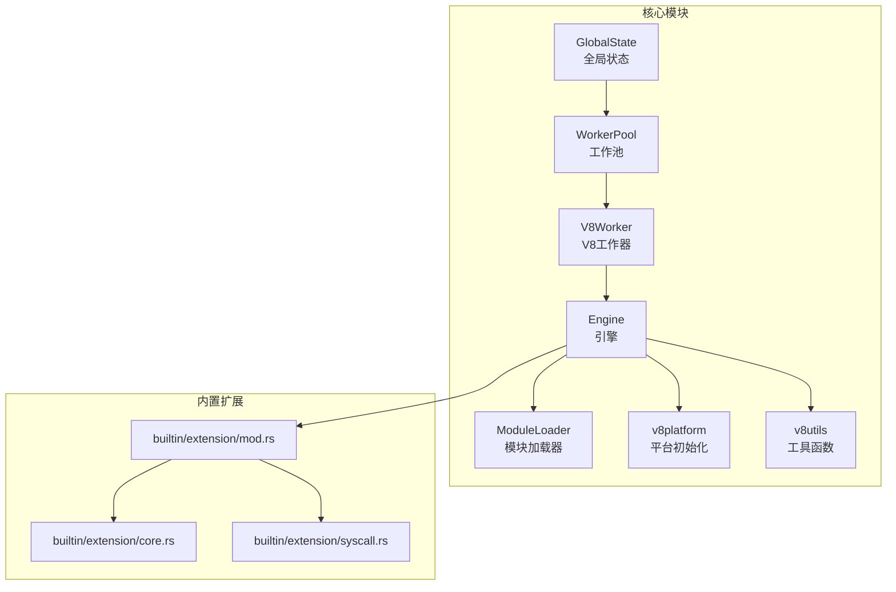
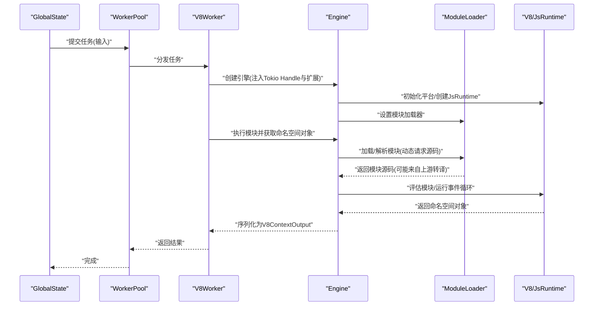
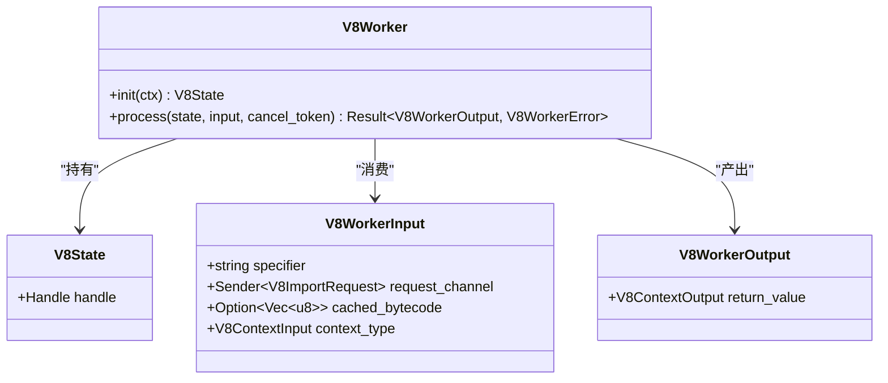
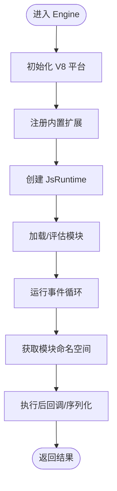
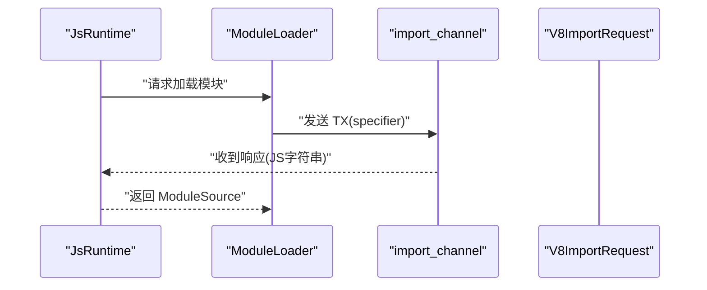
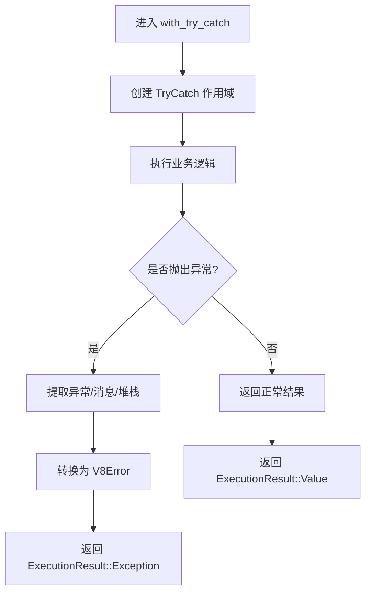
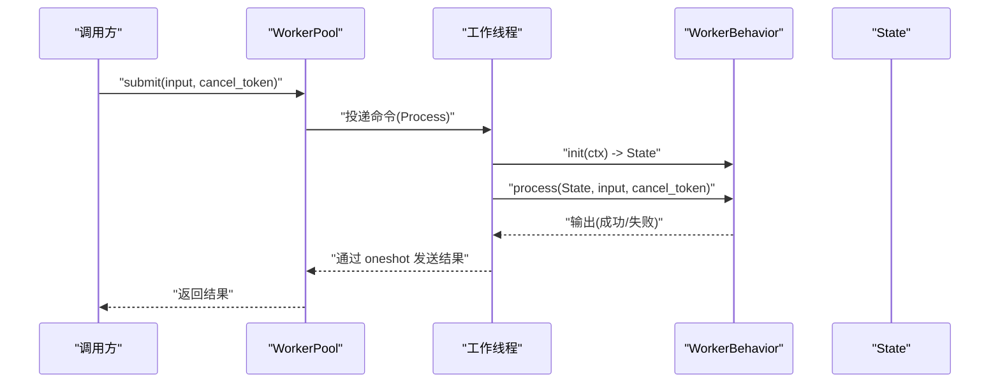
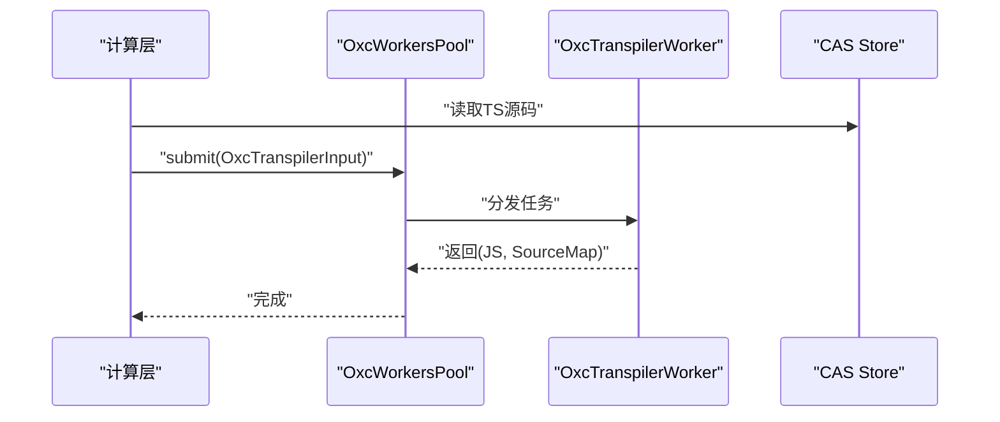
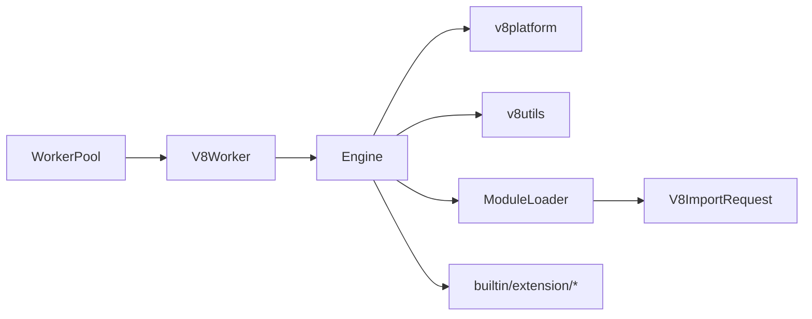

# V8集成机制

<cite>
**本文引用的文件**
- [zako_core/src/worker/v8worker.rs](file://zako_core/src/worker/v8worker.rs)
- [zako_core/src/engine.rs](file://zako_core/src/engine.rs)
- [zako_core/src/v8platform.rs](file://zako_core/src/v8platform.rs)
- [zako_core/src/v8context.rs](file://zako_core/src/v8context.rs)
- [zako_core/src/worker/mod.rs](file://zako_core/src/worker/mod.rs)
- [zako_core/src/global_state.rs](file://zako_core/src/global_state.rs)
- [zako_core/src/worker/protocol.rs](file://zako_core/src/worker/protocol.rs)
- [zako_core/src/module_loader/mod.rs](file://zako_core/src/module_loader/mod.rs)
- [zako_core/src/builtin/extension/mod.rs](file://zako_core/src/builtin/extension/mod.rs)
- [zako_core/src/builtin/extension/core.rs](file://zako_core/src/builtin/extension/core.rs)
- [zako_core/src/builtin/extension/syscall.rs](file://zako_core/src/builtin/extension/syscall.rs)
- [zako_core/src/v8utils.rs](file://zako_core/src/v8utils.rs)
- [zako_core/src/worker/worker_pool.rs](file://zako_core/src/worker/worker_pool.rs)
- [zako_core/src/compute/transpile_ts.rs](file://zako_core/src/compute/transpile_ts.rs)
- [zako_core/src/lib.rs](file://zako_core/src/lib.rs)
</cite>

## 目录
1. [引言](#引言)
2. [项目结构](#项目结构)
3. [核心组件](#核心组件)
4. [架构总览](#架构总览)
5. [详细组件分析](#详细组件分析)
6. [依赖分析](#依赖分析)
7. [性能考虑](#性能考虑)
8. [故障排查指南](#故障排查指南)
9. [结论](#结论)
10. [附录](#附录)

## 引言
本文件系统性阐述 zako 构建系统中的 V8 集成机制，重点覆盖以下方面：
- V8 与 Rust 的桥接方式：通过 deno_core 提供的 JsRuntime 与 V8 绑定，结合自定义扩展与模块加载器实现。
- deno_core 的使用：引擎初始化、扩展注册、模块加载与执行流程。
- 平台初始化与工具函数：V8 平台设置、致命错误处理、上下文与异常转换工具。
- V8Worker 实现原理：输入输出结构、状态管理、错误处理、与 Tokio 运行时的集成。
- 异步执行模型：基于 WorkerPool 的线程池并发模型，以及与 Tokio Handle 的协作。
- 与 TypeScript 转译器的协作：通过 OxcWorker 协同，先转译 TS 再交由 V8 执行。
- 性能优化策略与常见问题排查。

## 项目结构
zako 将 V8 集成相关代码集中在 zako_core 子模块内，围绕“引擎 Engine”“工作池 WorkerPool”“V8Worker”“模块加载 ModuleLoader”“平台与工具 v8platform/v8utils”“内置扩展 builtin/extension”等模块协同工作。

图表来源
- [zako_core/src/engine.rs](file://zako_core/src/engine.rs#L1-L306)
- [zako_core/src/worker/worker_pool.rs](file://zako_core/src/worker/worker_pool.rs#L1-L185)
- [zako_core/src/worker/v8worker.rs](file://zako_core/src/worker/v8worker.rs#L1-L147)
- [zako_core/src/module_loader/mod.rs](file://zako_core/src/module_loader/mod.rs#L1-L228)
- [zako_core/src/v8platform.rs](file://zako_core/src/v8platform.rs#L1-L30)
- [zako_core/src/v8utils.rs](file://zako_core/src/v8utils.rs#L1-L188)
- [zako_core/src/global_state.rs](file://zako_core/src/global_state.rs#L1-L153)
- [zako_core/src/builtin/extension/mod.rs](file://zako_core/src/builtin/extension/mod.rs#L1-L17)
- [zako_core/src/builtin/extension/core.rs](file://zako_core/src/builtin/extension/core.rs#L1-L8)
- [zako_core/src/builtin/extension/syscall.rs](file://zako_core/src/builtin/extension/syscall.rs#L1-L62)

章节来源
- [zako_core/src/lib.rs](file://zako_core/src/lib.rs#L1-L119)

## 核心组件
- Engine：封装 deno_core 的 JsRuntime，负责 V8 平台初始化、扩展注册、模块加载与执行。
- ModuleLoader：实现 deno_core::ModuleLoader，支持动态请求外部脚本源码并通过通道回传给上游转译器。
- V8Worker：实现 WorkerBehavior，持有 V8State（含 Tokio Handle），负责具体 JS 执行与结果序列化。
- WorkerPool：通用工作池，按需扩容/回收线程，提交任务并等待结果。
- v8platform：统一设置 V8 Platform，注册致命错误回调。
- v8utils：封装 TryCatch、事件循环推进、Promise 等 V8 工具方法。
- GlobalState：持有 Tokio Runtime、CAS Store、工作池实例等全局资源，并向 Worker 提供上下文。

章节来源
- [zako_core/src/engine.rs](file://zako_core/src/engine.rs#L1-L306)
- [zako_core/src/module_loader/mod.rs](file://zako_core/src/module_loader/mod.rs#L1-L228)
- [zako_core/src/worker/v8worker.rs](file://zako_core/src/worker/v8worker.rs#L1-L147)
- [zako_core/src/worker/worker_pool.rs](file://zako_core/src/worker/worker_pool.rs#L1-L185)
- [zako_core/src/v8platform.rs](file://zako_core/src/v8platform.rs#L1-L30)
- [zako_core/src/v8utils.rs](file://zako_core/src/v8utils.rs#L1-L188)
- [zako_core/src/global_state.rs](file://zako_core/src/global_state.rs#L1-L153)

## 架构总览
V8 执行路径从 GlobalState 启动，通过 WorkerPool 分发到 V8Worker；V8Worker 创建 Engine 并配置扩展与模块加载器；Engine 初始化 V8 平台后，使用 ModuleLoader 动态拉取脚本源码（必要时经由 OxcWorker 转译 TS）；最终通过 deno_core 执行 ES 模块并返回结果。

图表来源
- [zako_core/src/global_state.rs](file://zako_core/src/global_state.rs#L1-L153)
- [zako_core/src/worker/worker_pool.rs](file://zako_core/src/worker/worker_pool.rs#L1-L185)
- [zako_core/src/worker/v8worker.rs](file://zako_core/src/worker/v8worker.rs#L1-L147)
- [zako_core/src/engine.rs](file://zako_core/src/engine.rs#L1-L306)
- [zako_core/src/module_loader/mod.rs](file://zako_core/src/module_loader/mod.rs#L1-L228)

## 详细组件分析

### V8Worker 与 V8State
- 输入输出结构
  - 输入：V8WorkerInput 包含入口 specifier、请求转译的通道、可选字节码缓存、上下文类型（决定可用扩展集）。
  - 输出：V8WorkerOutput 包含 V8ContextOutput，用于后续序列化/传递。
- 状态管理：V8State 仅保存 Tokio Runtime Handle，确保在工作线程中复用事件循环。
- 错误处理：统一映射为 V8WorkerError，涵盖引擎错误、序列化错误与通用错误。
- 处理流程：根据上下文类型选择扩展集合，创建 Engine，获取 JsRuntime 与 V8 Isolate，执行模块并序列化返回值。

图表来源
- [zako_core/src/worker/v8worker.rs](file://zako_core/src/worker/v8worker.rs#L20-L42)
- [zako_core/src/worker/v8worker.rs](file://zako_core/src/worker/v8worker.rs#L58-L70)
- [zako_core/src/worker/v8worker.rs](file://zako_core/src/worker/v8worker.rs#L71-L147)

章节来源
- [zako_core/src/worker/v8worker.rs](file://zako_core/src/worker/v8worker.rs#L1-L147)
- [zako_core/src/v8context.rs](file://zako_core/src/v8context.rs#L1-L62)

### Engine 与模块加载
- Engine 初始化
  - 设置 V8 平台，注册内置扩展（如 zako_rt、zako_syscall、zako_global、zako_semver、zako_core、zako_console 等）。
  - 使用 RuntimeOptions 注入 ModuleLoader 与 v8_platform。
- 模块执行
  - 支持从文件或内存加载主 ES 模块，评估后运行事件循环，获取命名空间对象。
  - 提供带 JSON 上下文的执行变体，允许在执行前设置 globalThis.executionContext。
  - 提供“执行后回调”模式，将命名空间对象转换为 Rust 类型。
- 错误处理
  - 将 V8 异常转换为 V8Error，包含消息、堆栈、模块定位等信息。

图表来源
- [zako_core/src/engine.rs](file://zako_core/src/engine.rs#L48-L79)
- [zako_core/src/engine.rs](file://zako_core/src/engine.rs#L81-L109)
- [zako_core/src/engine.rs](file://zako_core/src/engine.rs#L168-L232)
- [zako_core/src/engine.rs](file://zako_core/src/engine.rs#L234-L300)

章节来源
- [zako_core/src/engine.rs](file://zako_core/src/engine.rs#L1-L306)

### 模块加载器与动态导入协议
- ModuleLoader 实现 deno_core::ModuleLoader：
  - resolve：根据模块类型与引用关系进行解析（文件/内置/内存）。
  - load：将模块加载请求通过 V8ImportRequest 发送到上游（通常是 OxcWorker），接收转译后的 JS 字符串作为模块源码。
- 协议：V8ImportRequest 包含 specifier 与 oneshot 响应通道，确保异步回传源码。

图表来源
- [zako_core/src/module_loader/mod.rs](file://zako_core/src/module_loader/mod.rs#L152-L219)
- [zako_core/src/worker/protocol.rs](file://zako_core/src/worker/protocol.rs#L1-L11)

章节来源
- [zako_core/src/module_loader/mod.rs](file://zako_core/src/module_loader/mod.rs#L1-L228)
- [zako_core/src/worker/protocol.rs](file://zako_core/src/worker/protocol.rs#L1-L11)

### V8 平台与工具函数
- v8platform：单例式设置 V8 默认平台，支持线程池大小与空闲任务支持；注册致命错误回调，便于日志记录。
- v8utils：提供 TryCatch 包装、事件循环推进（含微任务与平台泵）、Promise 等待直至解决或拒绝、异常对象到错误结构的转换。

图表来源
- [zako_core/src/v8utils.rs](file://zako_core/src/v8utils.rs#L116-L145)
- [zako_core/src/v8utils.rs](file://zako_core/src/v8utils.rs#L1-L90)

章节来源
- [zako_core/src/v8platform.rs](file://zako_core/src/v8platform.rs#L1-L30)
- [zako_core/src/v8utils.rs](file://zako_core/src/v8utils.rs#L1-L188)

### 内置扩展与上下文
- 内置扩展命名规则：以 zako_ 前缀注册，ESM 导出名为 zako:*。
- 示例扩展：
  - zako_core：声明依赖其他扩展并提供入口点与文档。
  - zako_syscall：提供版本查询与日志写入操作，映射到 Rust 日志级别。
- 上下文类型：V8ContextInput 决定可用扩展集合与返回值类型，例如 Package/Build/Rule/Toolchain/Config 等。

章节来源
- [zako_core/src/builtin/extension/mod.rs](file://zako_core/src/builtin/extension/mod.rs#L1-L17)
- [zako_core/src/builtin/extension/core.rs](file://zako_core/src/builtin/extension/core.rs#L1-L8)
- [zako_core/src/builtin/extension/syscall.rs](file://zako_core/src/builtin/extension/syscall.rs#L1-L62)
- [zako_core/src/v8context.rs](file://zako_core/src/v8context.rs#L1-L62)

### 异步执行模型与 WorkerPool
- WorkerPool 采用线程池 + 无界队列的模式，按需扩容至 max_workers，空闲超时自动回收。
- 提交任务时使用 oneshot 通道等待结果，支持取消令牌。
- 工作线程在空闲时定期触发垃圾回收钩子（可选）。

图表来源
- [zako_core/src/worker/worker_pool.rs](file://zako_core/src/worker/worker_pool.rs#L56-L119)
- [zako_core/src/worker/worker_pool.rs](file://zako_core/src/worker/worker_pool.rs#L156-L178)
- [zako_core/src/worker/mod.rs](file://zako_core/src/worker/mod.rs#L10-L37)

章节来源
- [zako_core/src/worker/worker_pool.rs](file://zako_core/src/worker/worker_pool.rs#L1-L185)
- [zako_core/src/worker/mod.rs](file://zako_core/src/worker/mod.rs#L1-L38)

### 与 TypeScript 转译器的协作
- 在模块加载阶段，若遇到 TS 文件，ModuleLoader 通过 import_channel 请求源码；上游 OxcWorker 将 TS 转译为 JS 并回传。
- 计算层提供 transpile_ts 接口，读取 CAS 中的 TS 源码，提交给 OxcWorker 并得到 JS 与 SourceMap 结果。

图表来源
- [zako_core/src/compute/transpile_ts.rs](file://zako_core/src/compute/transpile_ts.rs#L17-L85)
- [zako_core/src/module_loader/mod.rs](file://zako_core/src/module_loader/mod.rs#L180-L209)

章节来源
- [zako_core/src/compute/transpile_ts.rs](file://zako_core/src/compute/transpile_ts.rs#L1-L113)
- [zako_core/src/module_loader/mod.rs](file://zako_core/src/module_loader/mod.rs#L1-L228)

## 依赖分析
- 组件耦合
  - V8Worker 依赖 Engine 与 v8context；Engine 依赖 v8platform、v8utils、builtin/extension 与 module_loader。
  - WorkerPool 与 WorkerBehavior 解耦，便于替换不同类型的 Worker。
- 外部依赖
  - deno_core：提供 JsRuntime、模块加载接口、扩展机制。
  - tokio：提供多线程运行时与事件循环句柄。
  - tracing：提供日志与 span 跟踪。
  - flume/oneshot：用于跨线程通信与异步响应。

图表来源
- [zako_core/src/worker/v8worker.rs](file://zako_core/src/worker/v8worker.rs#L1-L19)
- [zako_core/src/engine.rs](file://zako_core/src/engine.rs#L1-L17)
- [zako_core/src/module_loader/mod.rs](file://zako_core/src/module_loader/mod.rs#L1-L26)
- [zako_core/src/worker/worker_pool.rs](file://zako_core/src/worker/worker_pool.rs#L1-L15)

章节来源
- [zako_core/src/worker/v8worker.rs](file://zako_core/src/worker/v8worker.rs#L1-L147)
- [zako_core/src/engine.rs](file://zako_core/src/engine.rs#L1-L306)
- [zako_core/src/module_loader/mod.rs](file://zako_core/src/module_loader/mod.rs#L1-L228)
- [zako_core/src/worker/worker_pool.rs](file://zako_core/src/worker/worker_pool.rs#L1-L185)

## 性能考虑
- 并发与线程池
  - WorkerPool 按队列积压与空闲时间动态扩容/回收，避免固定线程数带来的资源浪费或拥塞。
  - GlobalState 根据 CPU 数量初始化 Tokio Runtime，保证 I/O 与 CPU 密集任务均衡。
- V8 平台与事件循环
  - 通过 v8platform 设置合适的线程池大小，减少阻塞与上下文切换。
  - v8utils 的 run_event_loop_until_resolved 与微任务推进，避免忙等导致的高占用。
- 序列化与内存
  - 使用 serde_v8 进行 JS 对象与 Rust 类型之间的高效序列化。
  - ModuleLoader 缓存已加载源码与 SourceMap，降低重复转译与网络开销。
- 扩展与模块
  - 内置扩展集中注册，减少运行时反射成本；模块加载走异步通道，避免阻塞主线程。

## 故障排查指南
- V8 致命错误
  - 平台设置时注册致命错误回调，可在日志中捕获文件、行号与原因，便于快速定位。
- 模块加载失败
  - 检查 ModuleLoader 的 resolve 与 load 逻辑，确认 specifier 是否正确、通道是否可达、上游是否成功回传源码。
- 异常与堆栈
  - 使用 v8utils 的异常转换工具，提取消息、堆栈与模块定位信息，结合 tracing span 定位问题。
- 死锁与事件循环
  - 若 Promise 长期 Pending，检查是否有未解决的微任务或平台泵任务；必要时调整平台线程池大小。
- 取消与超时
  - 确保 CancelToken 正确传递到 Worker 行为实现，避免长时间阻塞导致资源泄漏。

章节来源
- [zako_core/src/v8platform.rs](file://zako_core/src/v8platform.rs#L22-L27)
- [zako_core/src/module_loader/mod.rs](file://zako_core/src/module_loader/mod.rs#L152-L219)
- [zako_core/src/v8utils.rs](file://zako_core/src/v8utils.rs#L1-L90)
- [zako_core/src/worker/worker_pool.rs](file://zako_core/src/worker/worker_pool.rs#L156-L178)

## 结论
zako 的 V8 集成以 deno_core 为核心，通过 Engine 抽象统一平台初始化、扩展注册与模块执行；配合 WorkerPool 的线程池并发模型与 ModuleLoader 的动态导入协议，实现了高性能、可扩展的 JS 执行环境。内置扩展与工具函数进一步增强了与 Rust 的互操作能力。结合 TS 转译器的协作，系统能够稳定地处理复杂构建脚本与规则文件。

## 附录

### 初始化 V8 环境步骤
- 设置 V8 平台：调用平台初始化函数，确保只在主线程设置一次。
- 创建 Engine：注入 Tokio Handle 与扩展列表，启用模块加载器。
- 执行模块：通过 specifier 加载并评估 ES 模块，运行事件循环，获取命名空间对象。
- 序列化结果：将命名空间对象转换为 Rust 类型，返回给上层。

章节来源
- [zako_core/src/v8platform.rs](file://zako_core/src/v8platform.rs#L7-L29)
- [zako_core/src/engine.rs](file://zako_core/src/engine.rs#L48-L79)
- [zako_core/src/engine.rs](file://zako_core/src/engine.rs#L81-L109)

### 处理 JavaScript 模块导入
- 使用 ModuleLoader 的 resolve/load 流程，动态请求上游转译器回传源码。
- 对于 TS 模块，先经 OxcWorker 转译为 JS，再交由 V8 执行。
- 支持同步/异步导入与模块类型约束（文件/内置/内存）。

章节来源
- [zako_core/src/module_loader/mod.rs](file://zako_core/src/module_loader/mod.rs#L86-L150)
- [zako_core/src/module_loader/mod.rs](file://zako_core/src/module_loader/mod.rs#L152-L219)
- [zako_core/src/compute/transpile_ts.rs](file://zako_core/src/compute/transpile_ts.rs#L17-L85)

### 数据序列化与反序列化
- 使用 serde_v8 在 Rust 与 V8 对象之间进行序列化/反序列化。
- 在 Engine 的“执行后回调”模式中，将命名空间对象转换为目标 Rust 类型。

章节来源
- [zako_core/src/engine.rs](file://zako_core/src/engine.rs#L168-L232)
- [zako_core/src/engine.rs](file://zako_core/src/engine.rs#L234-L300)
- [zako_core/src/worker/v8worker.rs](file://zako_core/src/worker/v8worker.rs#L130-L142)

### 与 TypeScript 转译器协作
- 通过 WorkerPool 提交转译任务，读取 CAS 中的 TS 源码，得到 JS 与 SourceMap。
- ModuleLoader 在加载阶段触发转译请求，确保 TS 模块可被 V8 正确执行。

章节来源
- [zako_core/src/compute/transpile_ts.rs](file://zako_core/src/compute/transpile_ts.rs#L17-L85)
- [zako_core/src/module_loader/mod.rs](file://zako_core/src/module_loader/mod.rs#L180-L209)