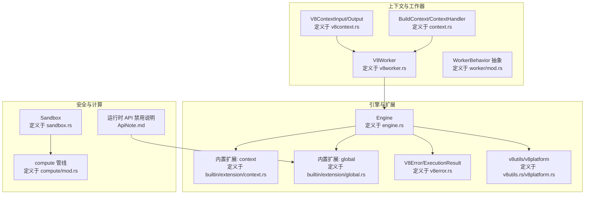
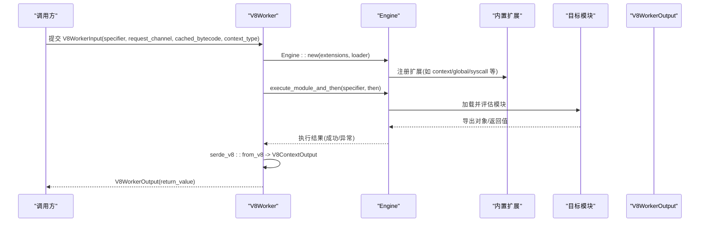
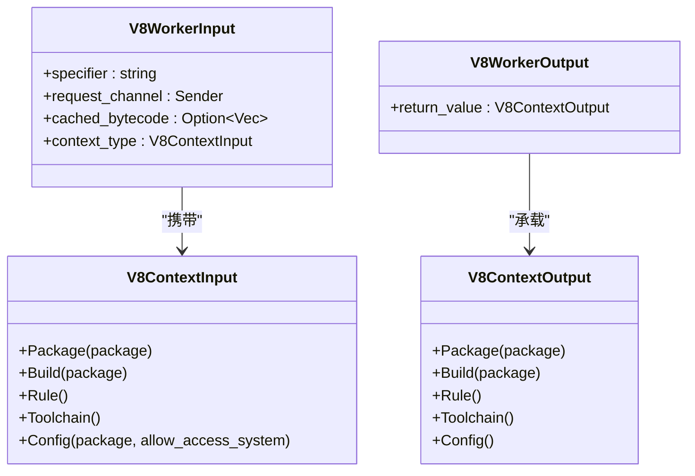
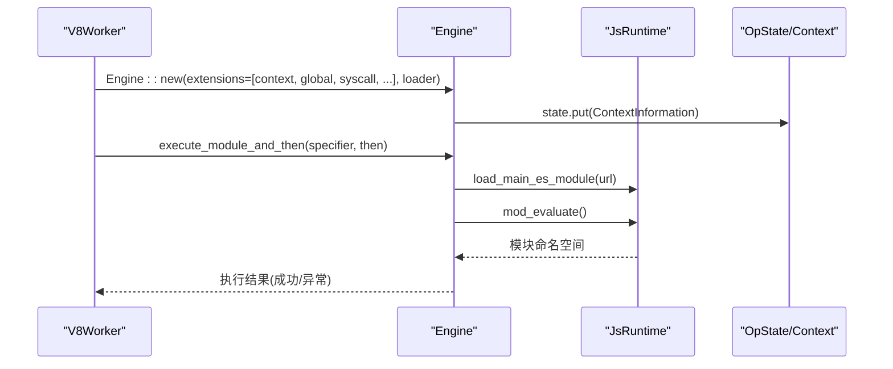
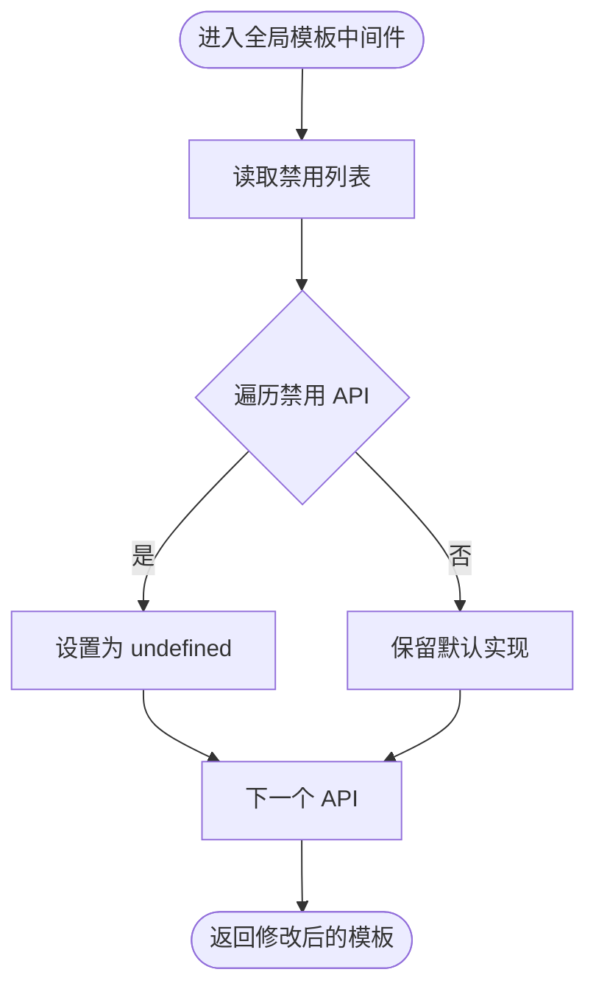
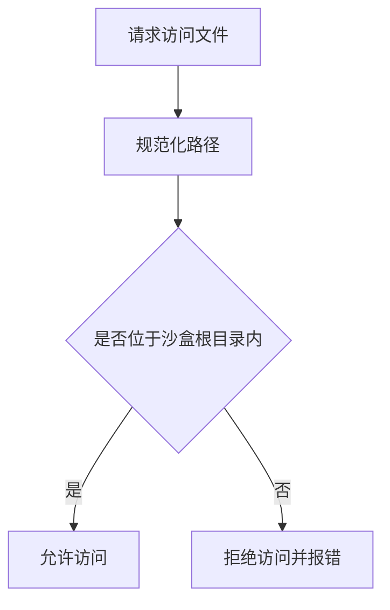
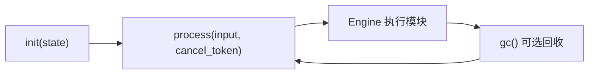
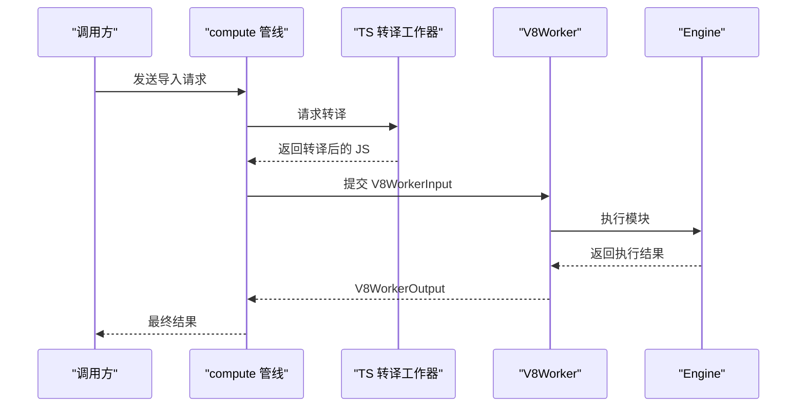
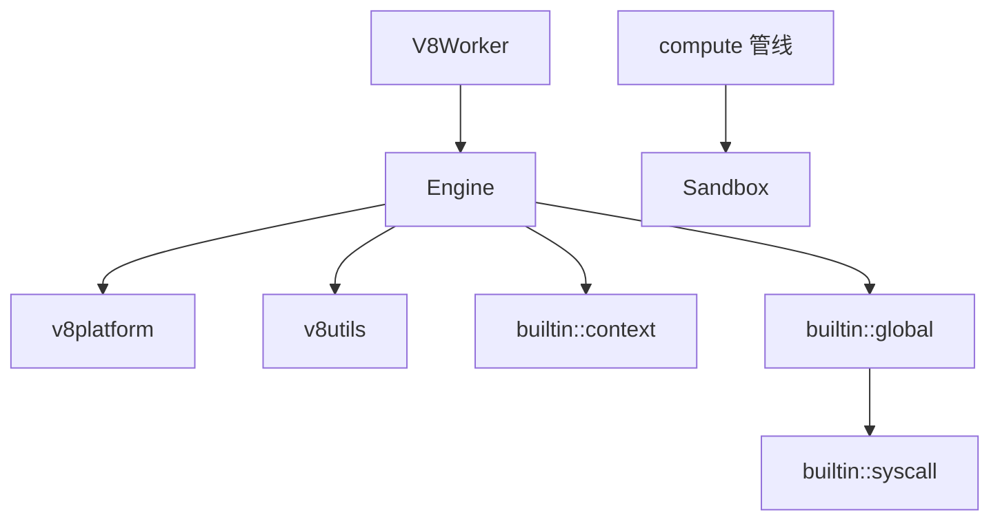

# 上下文管理

<cite>
**本文引用的文件**
- [zako_core/src/v8context.rs](file://zako_core/src/v8context.rs)
- [zako_core/src/context.rs](file://zako_core/src/context.rs)
- [zako_core/src/worker/v8worker.rs](file://zako_core/src/worker/v8worker.rs)
- [zako_core/src/engine.rs](file://zako_core/src/engine.rs)
- [zako_core/src/builtin/extension/context.rs](file://zako_core/src/builtin/extension/context.rs)
- [zako_core/src/builtin/extension/global.rs](file://zako_core/src/builtin/extension/global.rs)
- [zako_core/src/sandbox.rs](file://zako_core/src/sandbox.rs)
- [zako_core/src/v8error.rs](file://zako_core/src/v8error.rs)
- [zako_core/src/v8platform.rs](file://zako_core/src/v8platform.rs)
- [zako_core/src/v8utils.rs](file://zako_core/src/v8utils.rs)
- [zako_core/src/worker/mod.rs](file://zako_core/src/worker/mod.rs)
- [zako_core/src/compute/mod.rs](file://zako_core/src/compute/mod.rs)
- [ApiNote.md](file://ApiNote.md)
</cite>

## 目录
1. [简介](#简介)
2. [项目结构](#项目结构)
3. [核心组件](#核心组件)
4. [架构总览](#架构总览)
5. [详细组件分析](#详细组件分析)
6. [依赖关系分析](#依赖关系分析)
7. [性能考量](#性能考量)
8. [故障排查指南](#故障排查指南)
9. [结论](#结论)
10. [附录](#附录)

## 简介
本技术文档围绕 V8 上下文管理系统展开，系统以 Rust 实现的引擎为核心，通过 deno_core 的 V8 运行时承载 JavaScript 执行，并在构建系统中为不同类型的脚本（包脚本、构建脚本、规则脚本、工具链脚本、配置脚本）提供受控的执行环境。文档重点解释：
- 上下文隔离机制与作用域管理
- 变量绑定与生命周期控制
- V8ContextInput 与 V8ContextOutput 的结构设计、数据传递与类型转换
- 上下文初始化流程、全局对象注入、内置 API 暴露与权限控制
- 与构建系统的集成方式、沙盒安全机制与内存管理策略
- 常见问题与调试技巧

## 项目结构
与 V8 上下文管理直接相关的核心模块如下：
- 上下文输入输出定义：zako_core/src/v8context.rs
- 构建上下文与处理器：zako_core/src/context.rs
- V8 工作器与执行引擎：zako_core/src/worker/v8worker.rs、zako_core/src/engine.rs
- 内置扩展（上下文信息、全局 API 限制等）：zako_core/src/builtin/extension/context.rs、zako_core/src/builtin/extension/global.rs
- 安全沙盒：zako_core/src/sandbox.rs
- 错误与执行结果模型：zako_core/src/v8error.rs、zako_core/src/v8utils.rs、zako_core/src/v8platform.rs
- 工作器抽象与计算管线：zako_core/src/worker/mod.rs、zako_core/src/compute/mod.rs
- 运行时 API 禁用说明：ApiNote.md

图表来源
- [zako_core/src/v8context.rs](file://zako_core/src/v8context.rs#L1-L62)
- [zako_core/src/context.rs](file://zako_core/src/context.rs#L1-L229)
- [zako_core/src/worker/v8worker.rs](file://zako_core/src/worker/v8worker.rs#L1-L147)
- [zako_core/src/engine.rs](file://zako_core/src/engine.rs#L1-L306)
- [zako_core/src/builtin/extension/context.rs](file://zako_core/src/builtin/extension/context.rs#L1-L41)
- [zako_core/src/builtin/extension/global.rs](file://zako_core/src/builtin/extension/global.rs#L1-L39)
- [zako_core/src/sandbox.rs](file://zako_core/src/sandbox.rs#L1-L82)
- [zako_core/src/v8error.rs](file://zako_core/src/v8error.rs#L1-L31)
- [zako_core/src/v8utils.rs](file://zako_core/src/v8utils.rs#L69-L90)
- [zako_core/src/v8platform.rs](file://zako_core/src/v8platform.rs#L1-L29)
- [zako_core/src/worker/mod.rs](file://zako_core/src/worker/mod.rs#L1-L37)
- [zako_core/src/compute/mod.rs](file://zako_core/src/compute/mod.rs#L50-L73)
- [ApiNote.md](file://ApiNote.md#L18-L34)

章节来源
- [zako_core/src/v8context.rs](file://zako_core/src/v8context.rs#L1-L62)
- [zako_core/src/context.rs](file://zako_core/src/context.rs#L1-L229)
- [zako_core/src/worker/v8worker.rs](file://zako_core/src/worker/v8worker.rs#L1-L147)
- [zako_core/src/engine.rs](file://zako_core/src/engine.rs#L1-L306)
- [zako_core/src/builtin/extension/context.rs](file://zako_core/src/builtin/extension/context.rs#L1-L41)
- [zako_core/src/builtin/extension/global.rs](file://zako_core/src/builtin/extension/global.rs#L1-L39)
- [zako_core/src/sandbox.rs](file://zako_core/src/sandbox.rs#L1-L82)
- [zako_core/src/v8error.rs](file://zako_core/src/v8error.rs#L1-L31)
- [zako_core/src/v8utils.rs](file://zako_core/src/v8utils.rs#L69-L90)
- [zako_core/src/v8platform.rs](file://zako_core/src/v8platform.rs#L1-L29)
- [zako_core/src/worker/mod.rs](file://zako_core/src/worker/mod.rs#L1-L37)
- [zako_core/src/compute/mod.rs](file://zako_core/src/compute/mod.rs#L50-L73)
- [ApiNote.md](file://ApiNote.md#L18-L34)

## 核心组件
- V8ContextInput/V8ContextOutput：定义脚本执行的上下文类型与返回值类型，用于区分包脚本、构建脚本、规则脚本、工具链脚本、配置脚本等场景，并决定允许的权限与能力边界。
- BuildContext/ContextHandler：封装构建所需的项目根路径、入口名、包源信息与全局状态，提供资源池、内核、Tokio 句柄、CAS 存储、V8/TS 转译工作池等访问接口。
- V8Worker：接收 V8WorkerInput（含模块 specifier、TS 转换请求通道、缓存字节码、上下文类型），基于 Engine 初始化并执行模块，最终将 V8 执行结果反序列化为 V8ContextOutput。
- Engine：封装 deno_core 的 JsRuntime，负责扩展加载、模块加载与求值、事件循环驱动、JSON 输入注入到全局上下文、异常捕获与错误转换。
- 内置扩展：context 扩展注入上下文信息；global 扩展移除或禁用部分浏览器/Node API，降低不一致性和安全风险。
- Sandbox：提供基于路径规范化的沙盒检查，防止越权访问文件系统。
- 错误与执行结果：V8Error/ExecutionResult 统一错误与异常传播语义。

章节来源
- [zako_core/src/v8context.rs](file://zako_core/src/v8context.rs#L1-L62)
- [zako_core/src/context.rs](file://zako_core/src/context.rs#L30-L183)
- [zako_core/src/worker/v8worker.rs](file://zako_core/src/worker/v8worker.rs#L20-L56)
- [zako_core/src/engine.rs](file://zako_core/src/engine.rs#L19-L79)
- [zako_core/src/builtin/extension/context.rs](file://zako_core/src/builtin/extension/context.rs#L19-L41)
- [zako_core/src/builtin/extension/global.rs](file://zako_core/src/builtin/extension/global.rs#L12-L39)
- [zako_core/src/sandbox.rs](file://zako_core/src/sandbox.rs#L27-L81)
- [zako_core/src/v8error.rs](file://zako_core/src/v8error.rs#L12-L31)

## 架构总览
下图展示了从输入到输出的完整执行链路，包括上下文类型选择、引擎初始化、模块执行、结果回传与错误处理。

图表来源
- [zako_core/src/worker/v8worker.rs](file://zako_core/src/worker/v8worker.rs#L83-L146)
- [zako_core/src/engine.rs](file://zako_core/src/engine.rs#L47-L305)
- [zako_core/src/builtin/extension/context.rs](file://zako_core/src/builtin/extension/context.rs#L19-L41)
- [zako_core/src/builtin/extension/global.rs](file://zako_core/src/builtin/extension/global.rs#L3-L10)

## 详细组件分析

### V8 上下文类型与数据流
- V8ContextInput：根据脚本用途选择不同的上下文类型，例如 Package、Build、Rule、Toolchain、Config。每种类型对应不同的权限集合与能力边界。
- V8ContextOutput：与输入类型一一对应，作为执行结果的载体，用于将 JS 返回值安全地回传给 Rust 层。
- 数据传递与类型转换：V8Worker 在执行完成后使用 serde_v8 将 V8 对象反序列化为 V8ContextOutput，确保类型安全与跨语言边界的一致性。

图表来源
- [zako_core/src/v8context.rs](file://zako_core/src/v8context.rs#L13-L61)
- [zako_core/src/worker/v8worker.rs](file://zako_core/src/worker/v8worker.rs#L22-L42)

章节来源
- [zako_core/src/v8context.rs](file://zako_core/src/v8context.rs#L13-L61)
- [zako_core/src/worker/v8worker.rs](file://zako_core/src/worker/v8worker.rs#L22-L42)

### 上下文初始化流程与作用域管理
- 初始化阶段：V8Worker 根据 V8ContextInput 的类型构造扩展（如 context 扩展），并将上下文信息注入到 OpState 中，随后创建 Engine 并加载模块。
- 作用域与全局对象注入：Engine 支持将 JSON 输入注入到 globalThis.executionContext，便于脚本读取构建上下文信息。
- 事件循环与异常处理：Engine 使用 v8utils 的 try-catch 包装与平台泵循环，确保 Promise 正常推进且能检测死锁。

图表来源
- [zako_core/src/worker/v8worker.rs](file://zako_core/src/worker/v8worker.rs#L91-L146)
- [zako_core/src/engine.rs](file://zako_core/src/engine.rs#L47-L305)
- [zako_core/src/builtin/extension/context.rs](file://zako_core/src/builtin/extension/context.rs#L19-L41)

章节来源
- [zako_core/src/worker/v8worker.rs](file://zako_core/src/worker/v8worker.rs#L91-L146)
- [zako_core/src/engine.rs](file://zako_core/src/engine.rs#L111-L166)
- [zako_core/src/builtin/extension/context.rs](file://zako_core/src/builtin/extension/context.rs#L19-L41)

### 全局对象注入与内置 API 暴露
- 全局模板中间件：global 扩展通过移除特定 API（如 Date、Intl、performance、setTimeout、setInterval、Crypto、SharedArrayBuffer、Atomics 等）来降低不一致性和安全风险。
- 运行时 API 禁用说明：ApiNote.md 列举了被禁用或需重写的 API，确保构建脚本的可重复性与安全性。

图表来源
- [zako_core/src/builtin/extension/global.rs](file://zako_core/src/builtin/extension/global.rs#L12-L39)
- [ApiNote.md](file://ApiNote.md#L18-L34)

章节来源
- [zako_core/src/builtin/extension/global.rs](file://zako_core/src/builtin/extension/global.rs#L12-L39)
- [ApiNote.md](file://ApiNote.md#L18-L34)

### 权限控制与沙盒安全机制
- 上下文类型即权限：V8ContextInput 的枚举值决定了可用能力集，例如 Config 类型支持是否允许访问系统资源。
- 文件系统访问控制：Sandbox 提供 get_path_safe/join_path_for 等方法，通过规范化路径与根目录校验，防止越权访问。
- 运行时 API 限制：结合 global 扩展与 ApiNote.md 的规则，进一步减少潜在攻击面。

图表来源
- [zako_core/src/sandbox.rs](file://zako_core/src/sandbox.rs#L34-L72)
- [zako_core/src/builtin/extension/global.rs](file://zako_core/src/builtin/extension/global.rs#L18-L31)
- [ApiNote.md](file://ApiNote.md#L18-L34)

章节来源
- [zako_core/src/sandbox.rs](file://zako_core/src/sandbox.rs#L34-L72)
- [zako_core/src/builtin/extension/global.rs](file://zako_core/src/builtin/extension/global.rs#L18-L31)
- [ApiNote.md](file://ApiNote.md#L18-L34)

### 生命周期与内存管理策略
- 引擎生命周期：Engine 持有 JsRuntime 的 Rc<RefCell<...>>，在单线程内复用 isolate 与上下文，避免频繁创建销毁带来的开销。
- 平台与事件循环：v8platform 设置默认平台并在主线程初始化，v8utils 在执行过程中泵消息循环，确保异步任务与 Promise 正常推进。
- 工作器复用：WorkerBehavior 抽象支持 init/process/gc，gc 默认空操作，可在需要时进行资源回收以释放内存。

图表来源
- [zako_core/src/engine.rs](file://zako_core/src/engine.rs#L33-L79)
- [zako_core/src/v8platform.rs](file://zako_core/src/v8platform.rs#L7-L29)
- [zako_core/src/v8utils.rs](file://zako_core/src/v8utils.rs#L69-L90)
- [zako_core/src/worker/mod.rs](file://zako_core/src/worker/mod.rs#L21-L37)

章节来源
- [zako_core/src/engine.rs](file://zako_core/src/engine.rs#L33-L79)
- [zako_core/src/v8platform.rs](file://zako_core/src/v8platform.rs#L7-L29)
- [zako_core/src/v8utils.rs](file://zako_core/src/v8utils.rs#L69-L90)
- [zako_core/src/worker/mod.rs](file://zako_core/src/worker/mod.rs#L21-L37)

### 与构建系统的集成方式
- 计算管线：compute/mod.rs 通过工作池与 TS 转译工作器协作，将请求脚本路径读取并转译为 JS，再由 V8Worker 执行。
- 上下文注入：Engine 支持将 JSON 输入注入到 globalThis.executionContext，使脚本可读取构建上下文（如项目根、入口名、包源等）。

图表来源
- [zako_core/src/compute/mod.rs](file://zako_core/src/compute/mod.rs#L50-L73)
- [zako_core/src/worker/v8worker.rs](file://zako_core/src/worker/v8worker.rs#L83-L146)
- [zako_core/src/engine.rs](file://zako_core/src/engine.rs#L111-L166)

章节来源
- [zako_core/src/compute/mod.rs](file://zako_core/src/compute/mod.rs#L50-L73)
- [zako_core/src/worker/v8worker.rs](file://zako_core/src/worker/v8worker.rs#L83-L146)
- [zako_core/src/engine.rs](file://zako_core/src/engine.rs#L111-L166)

### 常见上下文相关问题与调试技巧
- Promise 死锁：当事件循环终止但 Promise 仍处于 Pending 状态时，v8utils 会报告死锁错误。应检查脚本中的异步逻辑与回调是否正确推进。
- 异常捕获：Engine 提供统一的异常捕获与转换，将 V8 异常转换为 V8Error，便于上层处理。
- 平台致命错误：v8platform 设置致命错误处理器，记录文件、行号与原因，便于定位底层 V8 异常。

章节来源
- [zako_core/src/v8utils.rs](file://zako_core/src/v8utils.rs#L69-L90)
- [zako_core/src/v8error.rs](file://zako_core/src/v8error.rs#L12-L31)
- [zako_core/src/v8platform.rs](file://zako_core/src/v8platform.rs#L22-L29)

## 依赖关系分析
- V8Worker 依赖 Engine 与内置扩展，负责执行模块并将结果回传。
- Engine 依赖 v8platform 与 v8utils，负责平台初始化、事件循环与错误处理。
- global 扩展依赖内置 syscall 扩展，共同构成受限的全局 API。
- Sandbox 与 compute 管线配合，保障文件系统访问的安全性与一致性。

图表来源
- [zako_core/src/worker/v8worker.rs](file://zako_core/src/worker/v8worker.rs#L91-L146)
- [zako_core/src/engine.rs](file://zako_core/src/engine.rs#L47-L79)
- [zako_core/src/v8platform.rs](file://zako_core/src/v8platform.rs#L7-L29)
- [zako_core/src/v8utils.rs](file://zako_core/src/v8utils.rs#L69-L90)
- [zako_core/src/builtin/extension/context.rs](file://zako_core/src/builtin/extension/context.rs#L19-L41)
- [zako_core/src/builtin/extension/global.rs](file://zako_core/src/builtin/extension/global.rs#L3-L10)
- [zako_core/src/compute/mod.rs](file://zako_core/src/compute/mod.rs#L50-L73)
- [zako_core/src/sandbox.rs](file://zako_core/src/sandbox.rs#L27-L81)

章节来源
- [zako_core/src/worker/v8worker.rs](file://zako_core/src/worker/v8worker.rs#L91-L146)
- [zako_core/src/engine.rs](file://zako_core/src/engine.rs#L47-L79)
- [zako_core/src/builtin/extension/context.rs](file://zako_core/src/builtin/extension/context.rs#L19-L41)
- [zako_core/src/builtin/extension/global.rs](file://zako_core/src/builtin/extension/global.rs#L3-L10)
- [zako_core/src/compute/mod.rs](file://zako_core/src/compute/mod.rs#L50-L73)
- [zako_core/src/sandbox.rs](file://zako_core/src/sandbox.rs#L27-L81)

## 性能考量
- 单线程内复用引擎与 isolate，减少上下文切换成本。
- 事件循环采用“仅等待一个任务”的泵模式，避免 CPU 空转，同时检测死锁。
- 工作器池化与模块字节码缓存可进一步提升吞吐量（当前实现中已预留缓存字段）。

## 故障排查指南
- 死锁检测：若出现“事件循环终止但 Promise 仍待决”的错误，检查脚本中是否存在未解决的 Promise 或未触发的回调。
- 异常定位：利用 V8Error 的模块标识、堆栈与附加信息，快速定位问题模块与错误位置。
- 致命错误：关注 v8platform 的致命错误日志，结合文件与行号进行底层问题排查。

章节来源
- [zako_core/src/v8utils.rs](file://zako_core/src/v8utils.rs#L69-L90)
- [zako_core/src/v8error.rs](file://zako_core/src/v8error.rs#L12-L31)
- [zako_core/src/v8platform.rs](file://zako_core/src/v8platform.rs#L22-L29)

## 结论
该 V8 上下文管理系统通过明确的上下文类型划分、严格的内置 API 限制、沙盒安全机制与稳健的错误处理，为构建系统提供了可控、可重复且安全的脚本执行环境。配合引擎级的事件循环与内存管理策略，能够在保证性能的同时满足复杂构建场景的需求。

## 附录
- 如何创建不同类型的上下文：根据脚本用途选择 V8ContextInput 的具体变体（Package/Build/Rule/Toolchain/Config），并在 V8WorkerInput 中传入对应的上下文类型与模块 specifier。
- 参数传递与返回值处理：通过 Engine 的 JSON 注入与 serde_v8 的序列化/反序列化，实现跨语言的数据交换与类型安全。
- 权限控制实践：结合 V8ContextInput 的类型与 global 扩展的 API 限制，确保脚本只能访问必要的能力集。