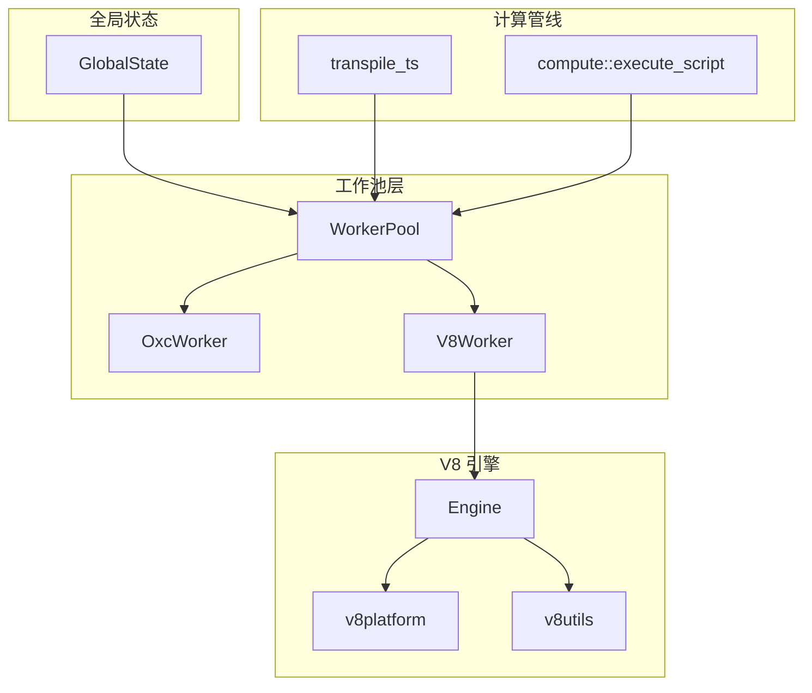
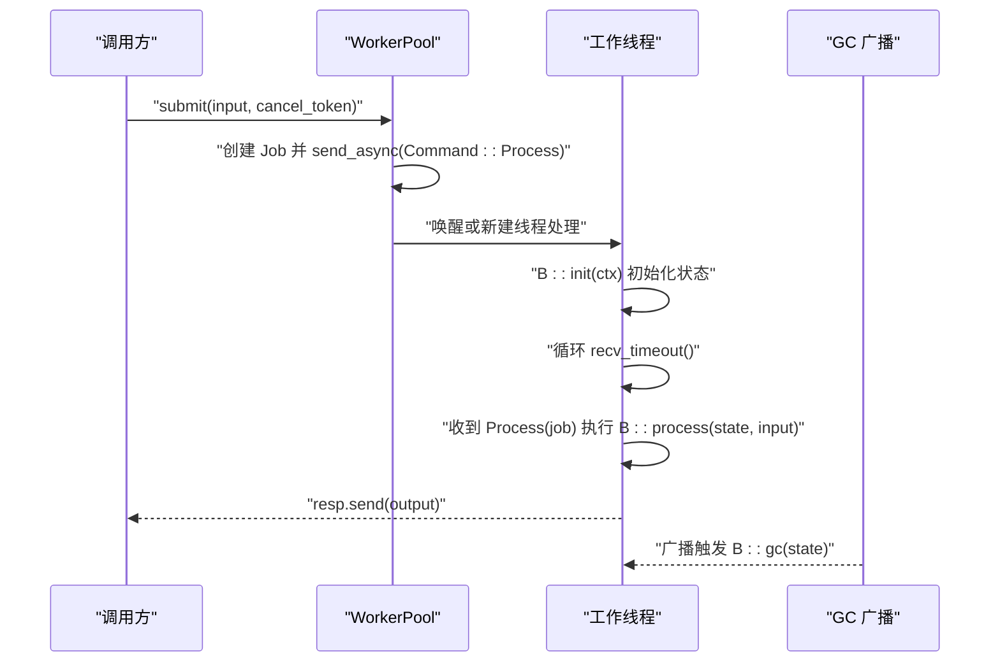
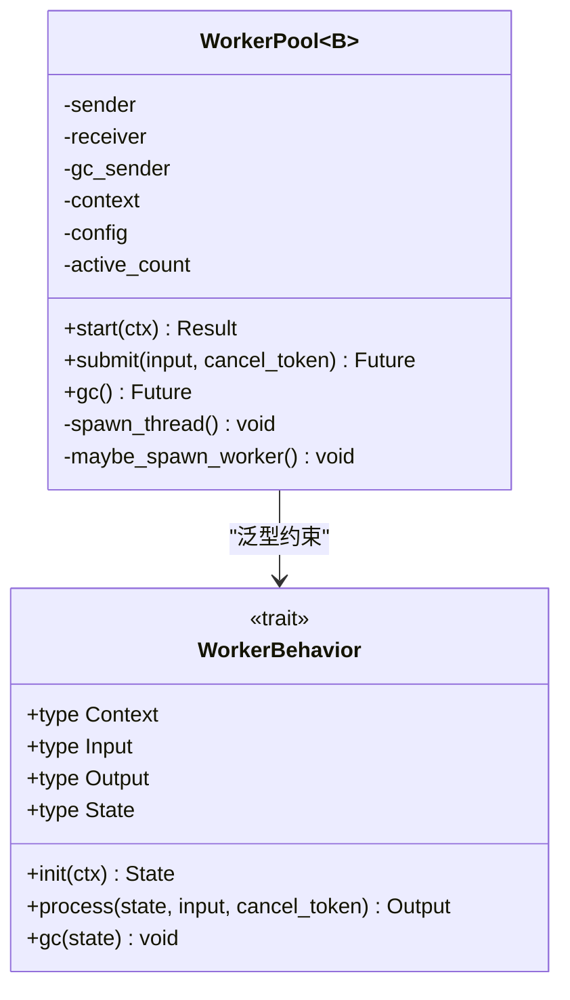
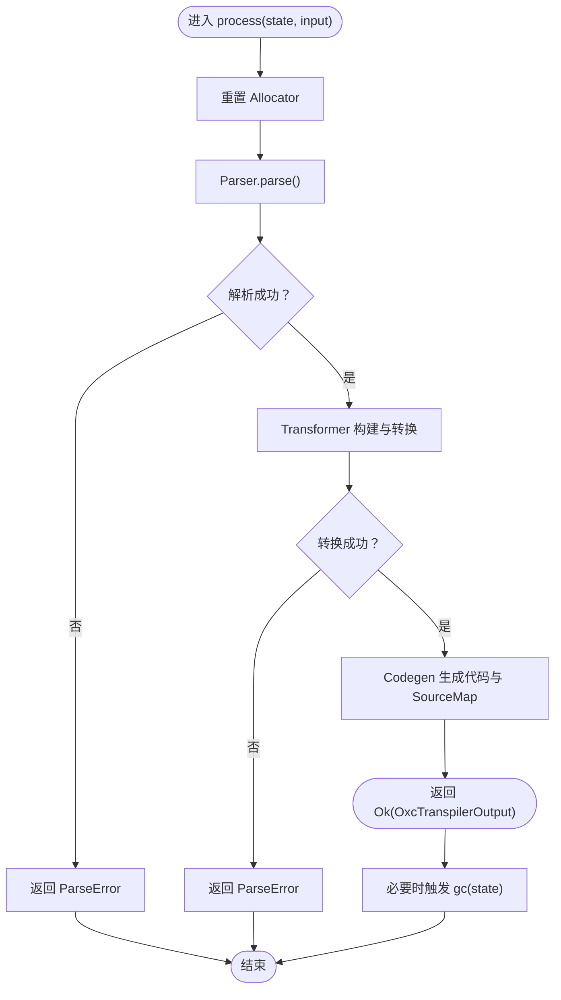
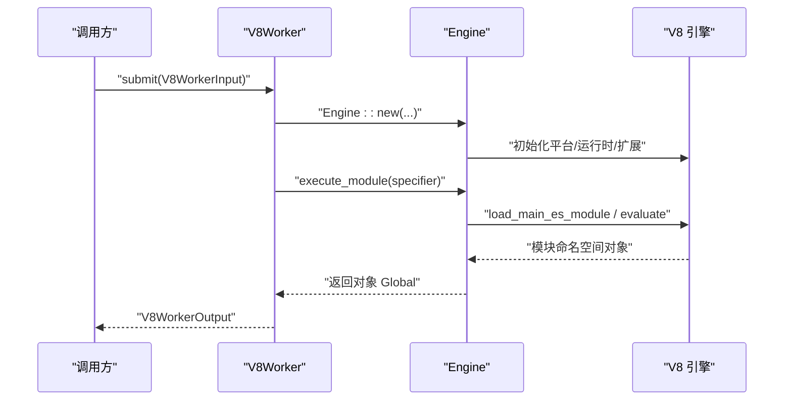
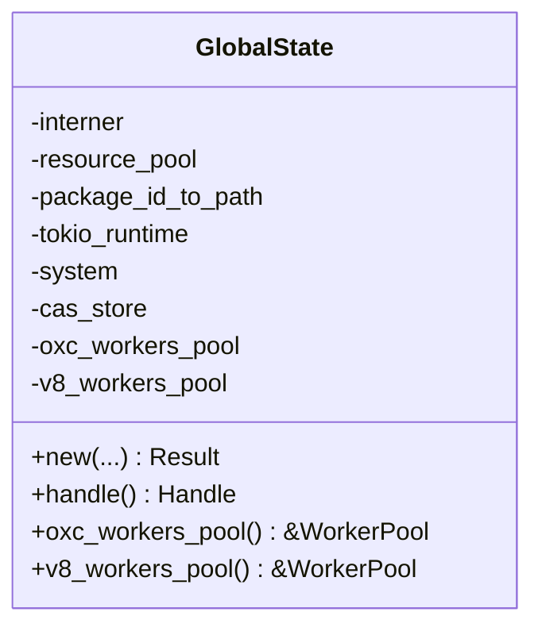
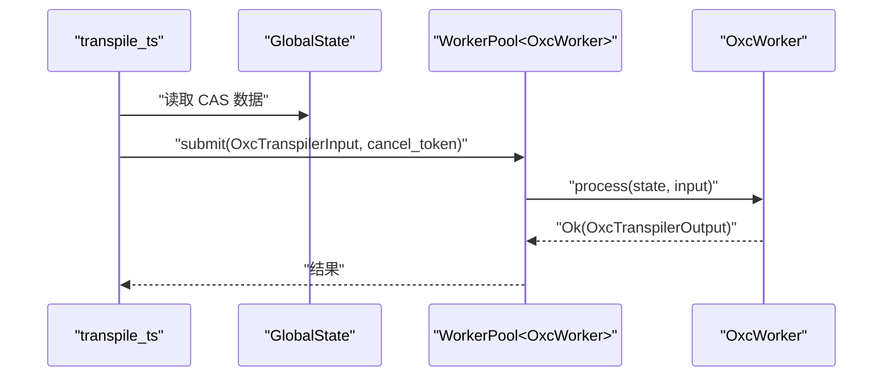
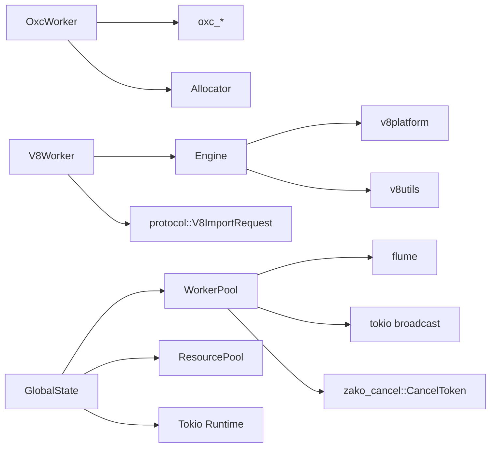

# 工作池管理

<cite>
**本文引用的文件**
- [zako_core/src/worker/mod.rs](file://zako_core/src/worker/mod.rs)
- [zako_core/src/worker/worker_pool.rs](file://zako_core/src/worker/worker_pool.rs)
- [zako_core/src/worker/oxc_worker.rs](file://zako_core/src/worker/oxc_worker.rs)
- [zako_core/src/worker/v8worker.rs](file://zako_core/src/worker/v8worker.rs)
- [zako_core/src/worker/protocol.rs](file://zako_core/src/worker/protocol.rs)
- [zako_core/src/global_state.rs](file://zako_core/src/global_state.rs)
- [zako_core/src/engine.rs](file://zako_core/src/engine.rs)
- [zako_core/src/v8context.rs](file://zako_core/src/v8context.rs)
- [zako_core/src/v8platform.rs](file://zako_core/src/v8platform.rs)
- [zako_core/src/v8utils.rs](file://zako_core/src/v8utils.rs)
- [zako_core/src/compute/transpile_ts.rs](file://zako_core/src/compute/transpile_ts.rs)
- [zako_core/src/compute/mod.rs](file://zako_core/src/compute/mod.rs)
- [zako_core/src/resource/mod.rs](file://zako_core/src/resource/mod.rs)
- [zako_core/src/lib.rs](file://zako_core/src/lib.rs)
</cite>

## 目录
1. [简介](#简介)
2. [项目结构](#项目结构)
3. [核心组件](#核心组件)
4. [架构总览](#架构总览)
5. [组件详解](#组件详解)
6. [依赖关系分析](#依赖关系分析)
7. [性能考量](#性能考量)
8. [故障排查指南](#故障排查指南)
9. [结论](#结论)
10. [附录](#附录)

## 简介
本文件系统性阐述工作池管理子系统的设计与实现，覆盖以下主题：
- 工作池架构设计与线程管理
- 任务分配策略与负载均衡机制
- WorkerPool 的实现原理、工作线程生命周期管理、任务队列处理
- OxcWorker 的特殊处理、并发控制、资源限制与错误恢复
- 与 V8 隔离环境的关系、性能监控与调优策略
- 常见并发问题与资源竞争场景的处理

## 项目结构
工作池相关代码集中在 zako_core 的 worker 子模块，并与全局状态、引擎、计算管线紧密协作：
- worker 子模块定义通用 WorkerBehavior 接口与 WorkerPool 实现
- OxcWorker 负责 TypeScript/JavaScript 转译
- V8Worker 负责在 V8 隔离环境中执行脚本
- GlobalState 组织并启动两类工作池
- Compute 层通过工作池完成具体任务（如转译）

图表来源
- [zako_core/src/worker/worker_pool.rs](file://zako_core/src/worker/worker_pool.rs#L34-L184)
- [zako_core/src/worker/oxc_worker.rs](file://zako_core/src/worker/oxc_worker.rs#L48-L150)
- [zako_core/src/worker/v8worker.rs](file://zako_core/src/worker/v8worker.rs#L54-L147)
- [zako_core/src/global_state.rs](file://zako_core/src/global_state.rs#L40-L96)
- [zako_core/src/compute/transpile_ts.rs](file://zako_core/src/compute/transpile_ts.rs#L17-L85)
- [zako_core/src/compute/mod.rs](file://zako_core/src/compute/mod.rs#L28-L73)
- [zako_core/src/engine.rs](file://zako_core/src/engine.rs#L34-L79)
- [zako_core/src/v8platform.rs](file://zako_core/src/v8platform.rs#L5-L29)
- [zako_core/src/v8utils.rs](file://zako_core/src/v8utils.rs#L1-L188)

章节来源
- [zako_core/src/lib.rs](file://zako_core/src/lib.rs#L79-L80)
- [zako_core/src/worker/mod.rs](file://zako_core/src/worker/mod.rs#L1-L38)

## 核心组件
- WorkerBehavior：抽象工作单元的行为接口，定义初始化、处理与垃圾回收
- WorkerPool：通用工作池，负责线程生命周期、任务队列、扩容与 GC 触发
- OxcWorker：基于 Oxc 的转译器，持有分配器缓存，支持增量 GC
- V8Worker：在 V8 隔离环境中执行 JS，通过 Engine 封装 V8 生命周期
- GlobalState：集中管理 Tokio 运行时、CAS 存储、工作池实例与公共字符串
- Compute 层：通过工作池完成具体任务（如 TypeScript 转译、JS 脚本执行）

章节来源
- [zako_core/src/worker/mod.rs](file://zako_core/src/worker/mod.rs#L11-L37)
- [zako_core/src/worker/worker_pool.rs](file://zako_core/src/worker/worker_pool.rs#L27-L42)
- [zako_core/src/worker/oxc_worker.rs](file://zako_core/src/worker/oxc_worker.rs#L48-L150)
- [zako_core/src/worker/v8worker.rs](file://zako_core/src/worker/v8worker.rs#L54-L147)
- [zako_core/src/global_state.rs](file://zako_core/src/global_state.rs#L40-L96)

## 架构总览
工作池采用“单向通道 + 独立线程”的模型：
- 提交端通过异步发送命令到有界通道
- 每个工作线程从通道接收任务，执行后通过 oneshot 返回结果
- 通过广播通道触发线程内 GC
- 通过活跃线程计数与队列长度动态扩容

图表来源
- [zako_core/src/worker/worker_pool.rs](file://zako_core/src/worker/worker_pool.rs#L56-L178)
- [zako_core/src/worker/oxc_worker.rs](file://zako_core/src/worker/oxc_worker.rs#L57-L149)
- [zako_core/src/worker/v8worker.rs](file://zako_core/src/worker/v8worker.rs#L71-L146)

## 组件详解

### WorkerBehavior 与 WorkerPool
- WorkerBehavior 定义四类类型与三个方法：init、process、gc
- WorkerPool 以泛型约束 B: WorkerBehavior，内部维护：
  - 发送/接收通道：用于任务投递与结果回传
  - GC 广播：触发线程内状态清理
  - OnceLock 上下文：保证启动一次且线程安全
  - 原子计数：跟踪活跃线程数
- 任务提交流程：
  - 构造 Job（含 oneshot 回调）
  - 异步发送到通道
  - maybe_spawn_worker 基于队列长度与当前线程数决定是否扩容
  - 等待 oneshot 返回结果或取消错误

图表来源
- [zako_core/src/worker/mod.rs](file://zako_core/src/worker/mod.rs#L11-L37)
- [zako_core/src/worker/worker_pool.rs](file://zako_core/src/worker/worker_pool.rs#L34-L184)

章节来源
- [zako_core/src/worker/mod.rs](file://zako_core/src/worker/mod.rs#L11-L37)
- [zako_core/src/worker/worker_pool.rs](file://zako_core/src/worker/worker_pool.rs#L56-L178)

### OxcWorker：转译器工作单元
- 输入输出：
  - 输入：源码文本、源文件名、源类型
  - 输出：转译后的代码与 SourceMap（可选）
- 状态与资源：
  - 持有 Allocator 缓冲区，容量固定
  - 每次 process 前重置缓冲，结束后复位
  - 支持 gc 重新分配缓冲
- 错误处理：
  - 解析阶段 panic 或错误收集
  - 语义/转换阶段错误聚合
  - 统一映射为 TransformerError

图表来源
- [zako_core/src/worker/oxc_worker.rs](file://zako_core/src/worker/oxc_worker.rs#L69-L149)

章节来源
- [zako_core/src/worker/oxc_worker.rs](file://zako_core/src/worker/oxc_worker.rs#L26-L149)

### V8Worker：V8 隔离环境执行器
- 输入输出：
  - 输入：模块 specifier、请求通道、缓存字节码、上下文类型
  - 输出：JS 执行返回值封装
- 状态与资源：
  - 持有 Tokio 运行时句柄，确保在正确的执行上下文中调度
- 执行流程：
  - 通过 Engine 创建 JSRuntime，加载并求值主模块
  - 在 V8 上下文中执行回调，将结果序列化为 Rust 类型
- 与转译器的协作：
  - 使用协议通道请求转译，逐个导入模块并返回转译后的 JS 字符串

图表来源
- [zako_core/src/worker/v8worker.rs](file://zako_core/src/worker/v8worker.rs#L71-L146)
- [zako_core/src/engine.rs](file://zako_core/src/engine.rs#L47-L305)
- [zako_core/src/v8platform.rs](file://zako_core/src/v8platform.rs#L7-L29)
- [zako_core/src/v8utils.rs](file://zako_core/src/v8utils.rs#L92-L145)

章节来源
- [zako_core/src/worker/v8worker.rs](file://zako_core/src/worker/v8worker.rs#L20-L147)
- [zako_core/src/engine.rs](file://zako_core/src/engine.rs#L34-L305)
- [zako_core/src/v8context.rs](file://zako_core/src/v8context.rs#L12-L61)
- [zako_core/src/v8platform.rs](file://zako_core/src/v8platform.rs#L5-L29)
- [zako_core/src/v8utils.rs](file://zako_core/src/v8utils.rs#L1-L188)

### GlobalState：工作池与运行时的中枢
- 组织资源池、Tokio 运行时、CAS 存储
- 创建并启动两类 WorkerPool：OxcTranspilerWorker 与 V8Worker
- 提供统一的 tokio 句柄与常用数据结构

图表来源
- [zako_core/src/global_state.rs](file://zako_core/src/global_state.rs#L40-L152)

章节来源
- [zako_core/src/global_state.rs](file://zako_core/src/global_state.rs#L54-L96)

### 计算管线与工作池集成
- TypeScript 转译：从 CAS 读取源码，提交给 OxcWorker，得到哈希对与结果
- JS 脚本执行：构建 V8WorkerInput，通过请求通道按需转译并执行

图表来源
- [zako_core/src/compute/transpile_ts.rs](file://zako_core/src/compute/transpile_ts.rs#L17-L85)
- [zako_core/src/worker/worker_pool.rs](file://zako_core/src/worker/worker_pool.rs#L156-L178)
- [zako_core/src/worker/oxc_worker.rs](file://zako_core/src/worker/oxc_worker.rs#L57-L149)

章节来源
- [zako_core/src/compute/transpile_ts.rs](file://zako_core/src/compute/transpile_ts.rs#L17-L113)
- [zako_core/src/compute/mod.rs](file://zako_core/src/compute/mod.rs#L28-L73)

## 依赖关系分析
- WorkerPool 依赖：
  - flume 通道：无界/有界队列（有界通道容量为 max_workers*2）
  - tokio 广播：触发线程内 GC
  - zako_cancel::CancelToken：任务取消信号
- OxcWorker 依赖：
  - oxc_parser/oxc_transformer/oxc_codegen 等 Oxc 组件
  - 分配器缓存与错误类型
- V8Worker 依赖：
  - Engine 封装 V8 生命周期
  - v8platform/v8utils 提供平台与工具函数
  - 协议通道用于模块导入请求
- GlobalState 依赖：
  - ResourcePool 获取 CPU 数量
  - Tokio 多线程运行时

图表来源
- [zako_core/src/worker/worker_pool.rs](file://zako_core/src/worker/worker_pool.rs#L1-L15)
- [zako_core/src/worker/oxc_worker.rs](file://zako_core/src/worker/oxc_worker.rs#L1-L16)
- [zako_core/src/worker/v8worker.rs](file://zako_core/src/worker/v8worker.rs#L1-L18)
- [zako_core/src/global_state.rs](file://zako_core/src/global_state.rs#L16-L21)
- [zako_core/src/v8platform.rs](file://zako_core/src/v8platform.rs#L1-L5)
- [zako_core/src/v8utils.rs](file://zako_core/src/v8utils.rs#L1-L7)

章节来源
- [zako_core/src/resource/mod.rs](file://zako_core/src/resource/mod.rs#L106-L155)

## 性能考量
- 线程扩容策略
  - 条件：当前线程数小于上限，且队列不为空或当前无线程
  - 使用 compare_exchange 原子乐观锁，避免超配
- 队列容量
  - 通道容量为 max_workers*2，平衡背压与内存占用
- GC 触发
  - 通过广播通道触发线程内状态清理，降低长期运行内存压力
- V8 平台与事件循环
  - 通过 v8platform 设置默认平台，结合 v8utils 的事件循环泵，避免忙等
- 资源池
  - ResourcePool 提供 CPU/内存/IO/GPU/网络等资源请求与释放，支持排队与通知

章节来源
- [zako_core/src/worker/worker_pool.rs](file://zako_core/src/worker/worker_pool.rs#L121-L138)
- [zako_core/src/worker/worker_pool.rs](file://zako_core/src/worker/worker_pool.rs#L142-L154)
- [zako_core/src/v8platform.rs](file://zako_core/src/v8platform.rs#L7-L29)
- [zako_core/src/v8utils.rs](file://zako_core/src/v8utils.rs#L39-L90)
- [zako_core/src/resource/mod.rs](file://zako_core/src/resource/mod.rs#L106-L276)

## 故障排查指南
- 常见错误类型
  - WorkerPoolError：重复启动、未启动、取消或恐慌
  - V8WorkerError：引擎错误、序列化错误、其他错误
  - TransformerError：目标版本解析失败、解析/转换错误
- 排查步骤
  - 确认工作池已 start，且上下文正确传递
  - 检查队列是否持续积压，确认扩容条件是否满足
  - 对于 V8 执行，关注平台初始化与事件循环泵是否正常
  - 对于 Oxc 转译，检查输入源类型与目标版本配置
- 取消与超时
  - 通过 CancelToken 传递取消信号，避免长时间阻塞
  - 注意 oneshot 接收错误代表任务被取消或线程异常

章节来源
- [zako_core/src/worker/worker_pool.rs](file://zako_core/src/worker/worker_pool.rs#L17-L25)
- [zako_core/src/worker/v8worker.rs](file://zako_core/src/worker/v8worker.rs#L44-L52)
- [zako_core/src/worker/oxc_worker.rs](file://zako_core/src/worker/oxc_worker.rs#L18-L24)

## 结论
该工作池系统以简洁的线程模型实现了高吞吐的任务分发与执行：
- 通过 WorkerBehavior 抽象统一不同工作单元
- 通过 WorkerPool 提供弹性扩容、GC 与取消控制
- OxcWorker 与 V8Worker 分别承担静态语言与动态语言的处理需求
- 与 V8 隔离环境的深度集成，配合 Engine 与平台工具，确保稳定执行
- 结合资源池与事件循环优化，兼顾性能与稳定性

## 附录

### 如何创建与配置工作池
- 创建 PoolConfig：设置最大/最小工作线程与空闲超时
- 通过 GlobalState::new 同时创建并启动两类 WorkerPool
- 在计算管线中通过 ctx.context().oxc_workers_pool()/v8_workers_pool() 获取实例

章节来源
- [zako_core/src/worker/worker_pool.rs](file://zako_core/src/worker/worker_pool.rs#L27-L32)
- [zako_core/src/global_state.rs](file://zako_core/src/global_state.rs#L56-L96)

### 提交任务与获取结果
- TypeScript 转译：构造 OxcTranspilerInput，调用 submit 并 await 结果
- JS 脚本执行：构造 V8WorkerInput，建立请求通道，循环接收请求并转译，最终获得返回值

章节来源
- [zako_core/src/compute/transpile_ts.rs](file://zako_core/src/compute/transpile_ts.rs#L39-L69)
- [zako_core/src/compute/mod.rs](file://zako_core/src/compute/mod.rs#L38-L73)

### 与 V8 隔离环境的关系
- V8Worker 通过 Engine 在独立隔离环境中执行，避免跨任务污染
- v8platform 统一平台配置，v8utils 提供事件循环与异常捕获工具
- 协议通道用于模块导入请求，实现按需转译与缓存

章节来源
- [zako_core/src/worker/v8worker.rs](file://zako_core/src/worker/v8worker.rs#L77-L146)
- [zako_core/src/engine.rs](file://zako_core/src/engine.rs#L47-L305)
- [zako_core/src/v8platform.rs](file://zako_core/src/v8platform.rs#L7-L29)
- [zako_core/src/v8utils.rs](file://zako_core/src/v8utils.rs#L92-L145)
- [zako_core/src/worker/protocol.rs](file://zako_core/src/worker/protocol.rs#L6-L11)