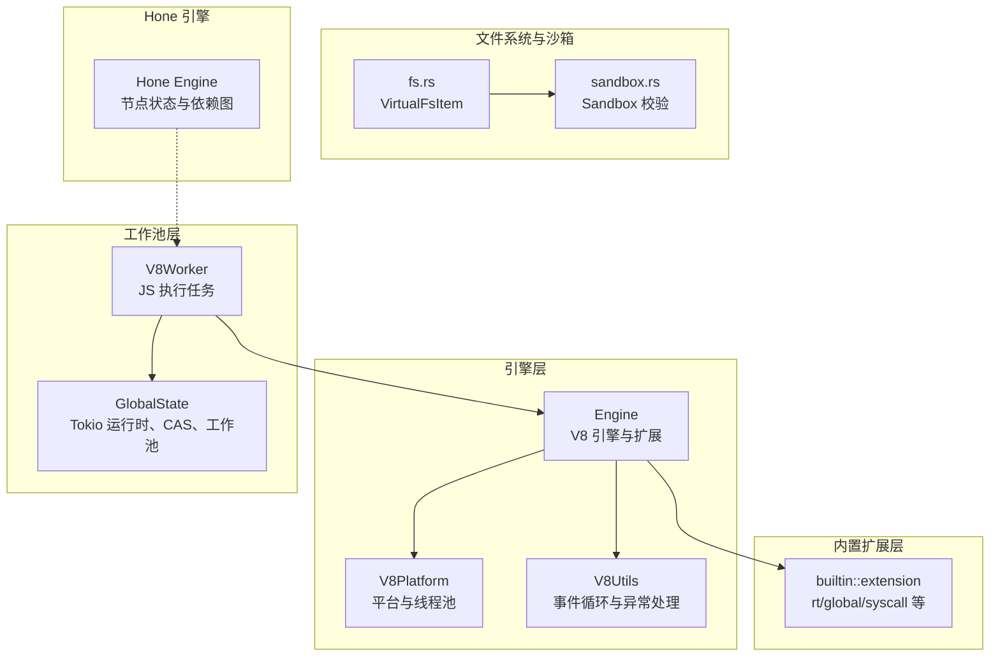
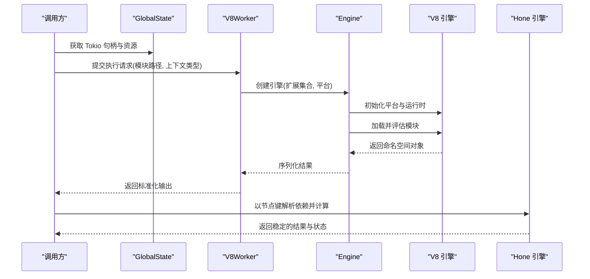
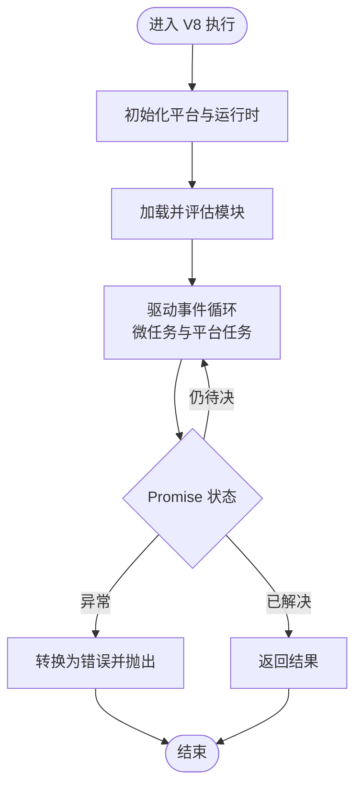
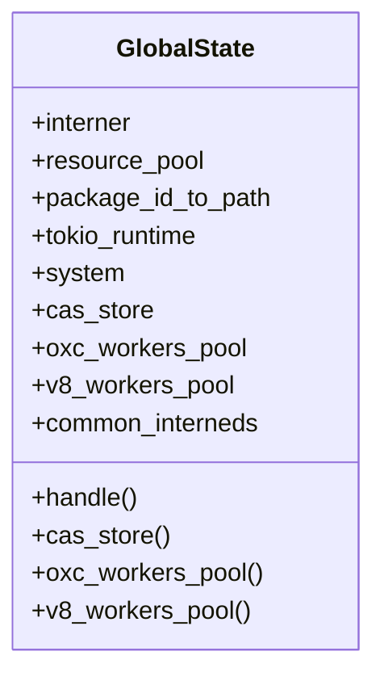
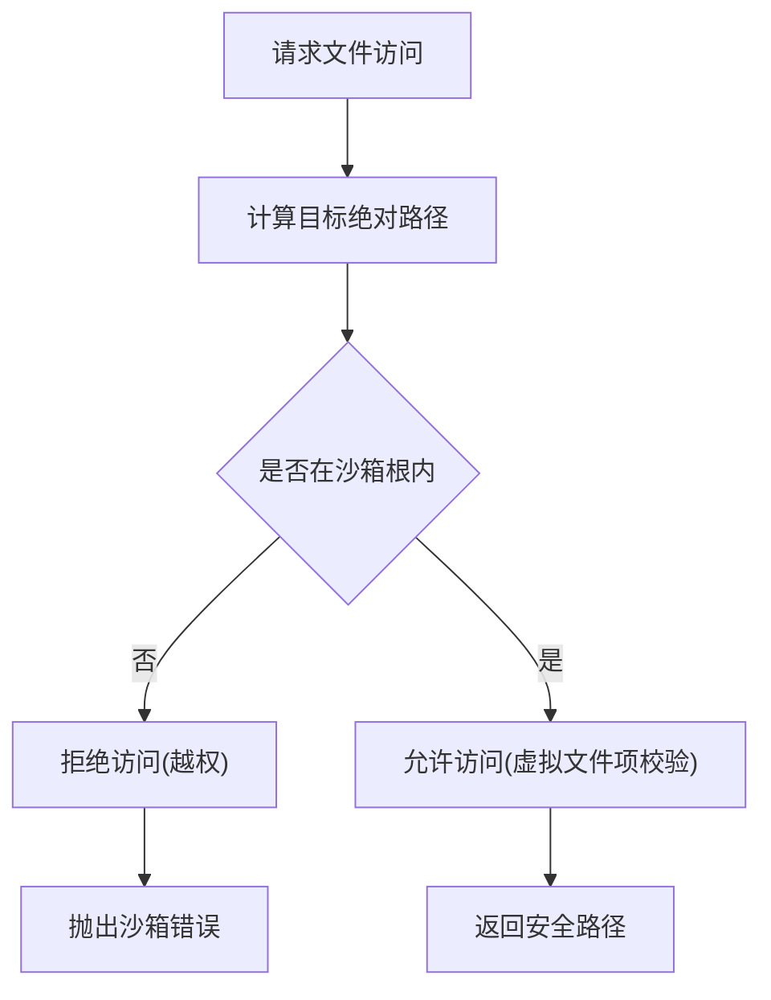
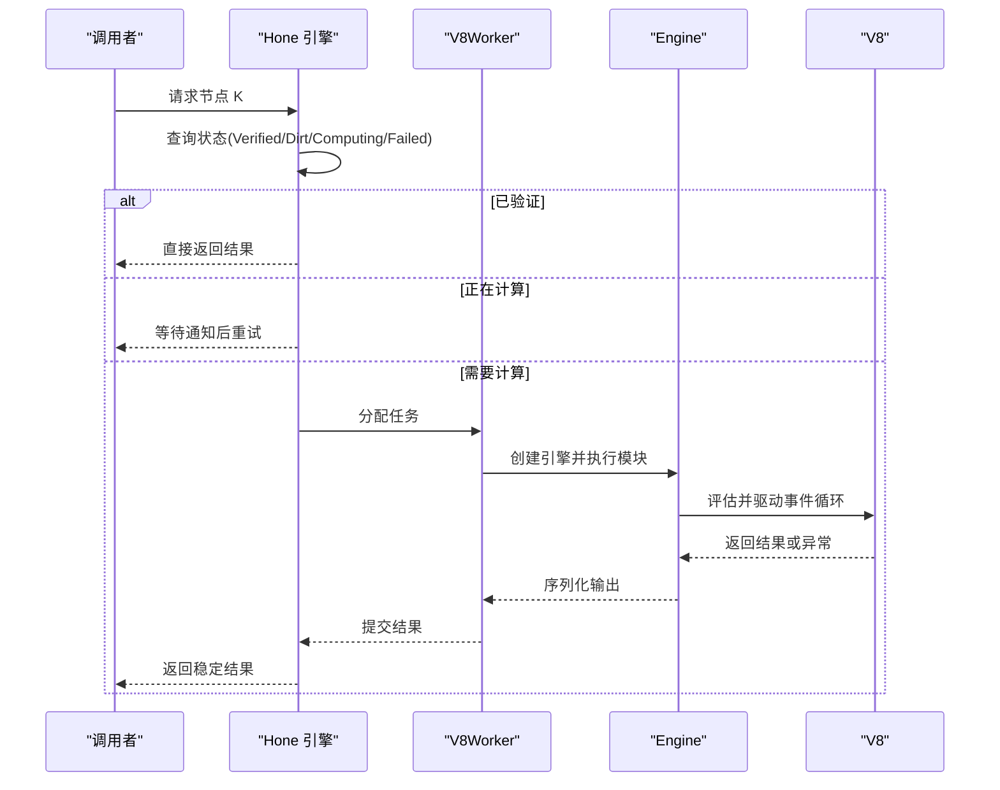
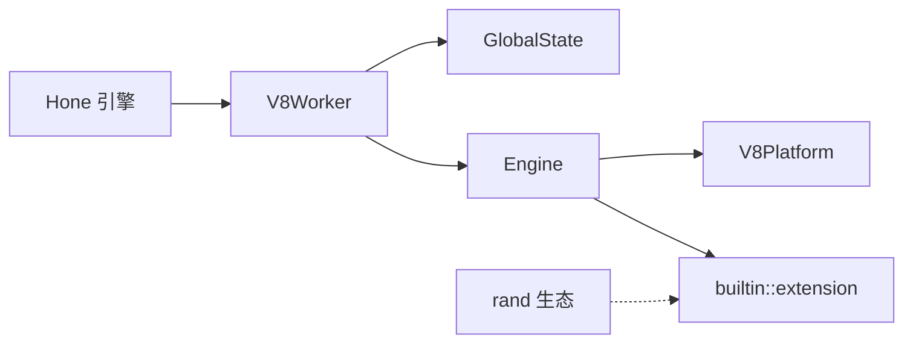

# 确定性执行

<cite>
**本文引用的文件**
- [zako_core/src/engine.rs](file://zako_core/src/engine.rs)
- [zako_core/src/v8context.rs](file://zako_core/src/v8context.rs)
- [zako_core/src/v8platform.rs](file://zako_core/src/v8platform.rs)
- [zako_core/src/v8utils.rs](file://zako_core/src/v8utils.rs)
- [zako_core/src/worker/v8worker.rs](file://zako_core/src/worker/v8worker.rs)
- [zako_core/src/global_state.rs](file://zako_core/src/global_state.rs)
- [zako_core/src/builtin/extension/mod.rs](file://zako_core/src/builtin/extension/mod.rs)
- [zako_core/src/builtin/extension/global.rs](file://zako_core/src/builtin/extension/global.rs)
- [zako_core/src/builtin/extension/rt.rs](file://zako_core/src/builtin/extension/rt.rs)
- [zako_core/src/builtin/extension/syscall.rs](file://zako_core/src/builtin/extension/syscall.rs)
- [zako_core/src/fs.rs](file://zako_core/src/fs.rs)
- [zako_core/src/sandbox.rs](file://zako_core/src/sandbox.rs)
- [hone/src/engine.rs](file://hone/src/engine.rs)
</cite>

## 目录
1. [引言](#引言)
2. [项目结构](#项目结构)
3. [核心组件](#核心组件)
4. [架构总览](#架构总览)
5. [详细组件分析](#详细组件分析)
6. [依赖分析](#依赖分析)
7. [性能考量](#性能考量)
8. [故障排查指南](#故障排查指南)
9. [结论](#结论)
10. [附录](#附录)

## 引言
本文件围绕“确定性执行”主题，系统阐述 Zako 在构建与脚本执行层面如何通过严格的上下文隔离、沙箱化文件系统、受控的 V8 平台与事件循环、以及 Hone 引擎的依赖图与状态机，来消除或控制非确定性来源，确保相同输入在相同环境下产生一致输出。重点覆盖：
- 时间戳与随机数的控制策略
- 非确定性 API 的屏蔽与替代
- V8 执行的确定性约束与全局状态管理
- 外部依赖与副作用的控制
- 与 Hone 引擎的协作、增量计算与缓存策略
- 常见非确定性问题与调试方法

## 项目结构
Zako 将“确定性执行”的职责分布在多个层次：
- 引擎层：负责 V8 引擎初始化、扩展注入、模块加载与执行、事件循环驱动
- 工作池层：V8Worker 负责具体 JS 执行任务，配合全局状态与资源池
- 内置扩展层：提供受控的全局对象、系统调用桥接与运行时能力
- 文件系统与沙箱：虚拟文件项与沙箱路径校验，限制文件系统访问范围
- Hone 引擎：以节点为中心的状态机与依赖图，保障增量计算与可重复性

图表来源
- [zako_core/src/engine.rs](file://zako_core/src/engine.rs#L47-L79)
- [zako_core/src/v8platform.rs](file://zako_core/src/v8platform.rs#L7-L29)
- [zako_core/src/v8utils.rs](file://zako_core/src/v8utils.rs#L39-L90)
- [zako_core/src/worker/v8worker.rs](file://zako_core/src/worker/v8worker.rs#L71-L147)
- [zako_core/src/global_state.rs](file://zako_core/src/global_state.rs#L54-L97)
- [zako_core/src/builtin/extension/mod.rs](file://zako_core/src/builtin/extension/mod.rs#L1-L17)
- [zako_core/src/fs.rs](file://zako_core/src/fs.rs#L1-L115)
- [zako_core/src/sandbox.rs](file://zako_core/src/sandbox.rs#L27-L82)
- [hone/src/engine.rs](file://hone/src/engine.rs#L55-L68)

章节来源
- [zako_core/src/engine.rs](file://zako_core/src/engine.rs#L47-L79)
- [zako_core/src/worker/v8worker.rs](file://zako_core/src/worker/v8worker.rs#L71-L147)
- [zako_core/src/global_state.rs](file://zako_core/src/global_state.rs#L54-L97)
- [zako_core/src/builtin/extension/mod.rs](file://zako_core/src/builtin/extension/mod.rs#L1-L17)
- [zako_core/src/fs.rs](file://zako_core/src/fs.rs#L1-L115)
- [zako_core/src/sandbox.rs](file://zako_core/src/sandbox.rs#L27-L82)
- [hone/src/engine.rs](file://hone/src/engine.rs#L55-L68)

## 核心组件
- V8 引擎与平台
  - 初始化默认 V8 平台，设置致命错误处理器，统一线程池大小与空闲任务支持
  - 通过扩展注入运行时能力与系统调用桥接
- V8Worker 与全局状态
  - 维护 Tokio 句柄，按上下文类型选择扩展集合，执行模块并返回标准化输出
  - 全局状态集中管理 CAS、工作池、系统信息与资源池
- 内置扩展
  - rt/global/syscall/console 等扩展，按需注入；全局模板中间件移除易造成非确定性的 API
- 文件系统与沙箱
  - 虚拟文件项抽象与沙箱路径校验，防止越权访问与逃逸
- Hone 引擎
  - 节点状态机、依赖图、并发解析与失败快速传播，支持增量与去重

章节来源
- [zako_core/src/v8platform.rs](file://zako_core/src/v8platform.rs#L7-L29)
- [zako_core/src/engine.rs](file://zako_core/src/engine.rs#L47-L79)
- [zako_core/src/worker/v8worker.rs](file://zako_core/src/worker/v8worker.rs#L71-L147)
- [zako_core/src/global_state.rs](file://zako_core/src/global_state.rs#L54-L97)
- [zako_core/src/builtin/extension/global.rs](file://zako_core/src/builtin/extension/global.rs#L12-L39)
- [zako_core/src/fs.rs](file://zako_core/src/fs.rs#L1-L115)
- [zako_core/src/sandbox.rs](file://zako_core/src/sandbox.rs#L27-L82)
- [hone/src/engine.rs](file://hone/src/engine.rs#L55-L68)

## 架构总览
确定性执行的总体流程如下：
- 初始化 V8 平台与引擎，注入受控扩展
- 依据上下文类型构造执行环境（如包、构建、规则、工具链、配置）
- 通过 V8Worker 加载并执行指定模块，将结果序列化为标准输出
- 使用 Hone 引擎进行依赖解析与状态管理，确保可重复与增量
- 文件系统访问经由沙箱与虚拟文件项校验，避免外部状态影响

图表来源
- [zako_core/src/worker/v8worker.rs](file://zako_core/src/worker/v8worker.rs#L83-L147)
- [zako_core/src/engine.rs](file://zako_core/src/engine.rs#L47-L79)
- [zako_core/src/v8platform.rs](file://zako_core/src/v8platform.rs#L7-L29)
- [hone/src/engine.rs](file://hone/src/engine.rs#L306-L409)

章节来源
- [zako_core/src/worker/v8worker.rs](file://zako_core/src/worker/v8worker.rs#L83-L147)
- [zako_core/src/engine.rs](file://zako_core/src/engine.rs#L47-L79)
- [hone/src/engine.rs](file://hone/src/engine.rs#L306-L409)

## 详细组件分析

### V8 执行的确定性约束
- 平台与线程池
  - 通过统一平台初始化与致命错误处理，避免因平台差异导致的行为不一致
  - 线程池大小与空闲任务支持参数可按需调整，确保事件循环与微任务调度稳定
- 扩展注入
  - 显式注入受控扩展，避免默认浏览器/Node 风格 API 导致的非确定性
  - 全局模板中间件移除易变 API（如 Date、Intl、performance、定时器、加密、共享内存等）
- 事件循环与异常处理
  - 显式驱动 V8 平台消息循环，避免空转与死锁
  - 统一捕获异常与堆栈，便于定位与报告

图表来源
- [zako_core/src/v8utils.rs](file://zako_core/src/v8utils.rs#L39-L90)
- [zako_core/src/builtin/extension/global.rs](file://zako_core/src/builtin/extension/global.rs#L12-L39)
- [zako_core/src/engine.rs](file://zako_core/src/engine.rs#L47-L79)

章节来源
- [zako_core/src/v8platform.rs](file://zako_core/src/v8platform.rs#L7-L29)
- [zako_core/src/v8utils.rs](file://zako_core/src/v8utils.rs#L39-L90)
- [zako_core/src/builtin/extension/global.rs](file://zako_core/src/builtin/extension/global.rs#L12-L39)
- [zako_core/src/engine.rs](file://zako_core/src/engine.rs#L47-L79)

### 全局状态管理与外部依赖控制
- 全局状态集中持有：
  - 字符串驻留器、资源池、包 ID 到路径映射
  - Tokio 运行时句柄、系统信息、CAS 存储
  - Oxc 与 V8 工作池，统一启动与复用
- 通过全局状态传递给 Worker，确保：
  - 一致的 Tokio 句柄用于事件循环
  - 一致的 CAS 与缓存策略
  - 一致的资源配额与线程栈大小

图表来源
- [zako_core/src/global_state.rs](file://zako_core/src/global_state.rs#L41-L152)

章节来源
- [zako_core/src/global_state.rs](file://zako_core/src/global_state.rs#L54-L97)

### 外部依赖控制与副作用处理
- 文件系统访问
  - 使用虚拟文件项抽象与沙箱路径校验，禁止越权访问与符号链接逃逸
  - 对相对路径与中立路径进行规范化与安全拼接
- 日志与系统调用
  - 通过系统调用扩展桥接到 Rust 日志系统，统一日志级别与输出
- 事件循环与异步
  - 显式驱动 V8 平台消息循环，避免未决 Promise 导致的死锁
  - 统一异常转换，确保错误可追踪且可重现

图表来源
- [zako_core/src/sandbox.rs](file://zako_core/src/sandbox.rs#L34-L72)
- [zako_core/src/fs.rs](file://zako_core/src/fs.rs#L49-L87)

章节来源
- [zako_core/src/sandbox.rs](file://zako_core/src/sandbox.rs#L27-L82)
- [zako_core/src/fs.rs](file://zako_core/src/fs.rs#L1-L115)

### 与 Hone 引擎的协作关系
- Hone 引擎以节点为中心，维护状态机与依赖图，支持：
  - 并发解析与失败快速传播
  - 计算前的“脏”状态判定与去重
  - 通知机制协调并发计算
- 结合 V8 执行与 Hone 解析，形成“可重复、可增量、可验证”的执行闭环

图表来源
- [hone/src/engine.rs](file://hone/src/engine.rs#L306-L409)
- [zako_core/src/worker/v8worker.rs](file://zako_core/src/worker/v8worker.rs#L83-L147)
- [zako_core/src/engine.rs](file://zako_core/src/engine.rs#L168-L300)

章节来源
- [hone/src/engine.rs](file://hone/src/engine.rs#L306-L409)
- [zako_core/src/worker/v8worker.rs](file://zako_core/src/worker/v8worker.rs#L83-L147)
- [zako_core/src/engine.rs](file://zako_core/src/engine.rs#L168-L300)

### 增量计算的保证与缓存策略
- Hone 引擎的状态机与依赖图确保：
  - 已验证节点直接命中
  - “脏”节点触发重新计算并清理子依赖
  - 并发计算的互斥与通知
- 缓存策略
  - 当前注释表明持久化与负缓存尚在规划中，现阶段以内存态为主
  - 建议在后续版本中引入基于输入/输出哈希的持久化与失效策略

章节来源
- [hone/src/engine.rs](file://hone/src/engine.rs#L69-L296)

### 时间相关 API 的模拟与随机数控制
- 时间相关 API（Date、Intl、performance）已在全局模板中间件中移除，避免非确定性时间源
- 随机数相关 API（Crypto、Atomics、SharedArrayBuffer 等）同样被移除
- 若业务需要时间戳或随机数，建议在脚本侧通过受控接口注入固定种子或模拟实现，并在执行前通过上下文参数传入

章节来源
- [zako_core/src/builtin/extension/global.rs](file://zako_core/src/builtin/extension/global.rs#L12-L39)
- [zako_core/src/engine.rs](file://zako_core/src/engine.rs#L47-L79)

### 文件系统访问的可控性
- 虚拟文件项抽象与沙箱路径校验，确保：
  - 符号链接目标必须相对且不逃逸
  - 绝对路径与空路径均被拒绝
  - 中立路径规范化与安全拼接
- 建议在脚本中仅使用受控的虚拟文件项与沙箱路径，避免直接访问真实文件系统

章节来源
- [zako_core/src/fs.rs](file://zako_core/src/fs.rs#L49-L87)
- [zako_core/src/sandbox.rs](file://zako_core/src/sandbox.rs#L34-L72)

### 具体代码示例（路径指引）
以下为编写确定性 JavaScript 代码与避免非确定性操作的参考路径（请在对应文件中查看实现细节）：
- 屏蔽非确定性 API 的全局模板中间件
  - [zako_core/src/builtin/extension/global.rs](file://zako_core/src/builtin/extension/global.rs#L12-L39)
- 注入受控扩展与运行时能力
  - [zako_core/src/engine.rs](file://zako_core/src/engine.rs#L53-L62)
- 显式驱动事件循环与异常处理
  - [zako_core/src/v8utils.rs](file://zako_core/src/v8utils.rs#L39-L90)
- 通过上下文类型构造执行环境
  - [zako_core/src/v8context.rs](file://zako_core/src/v8context.rs#L13-L37)
- 通过系统调用桥接日志
  - [zako_core/src/builtin/extension/syscall.rs](file://zako_core/src/builtin/extension/syscall.rs#L33-L61)
- 沙箱路径校验与虚拟文件项
  - [zako_core/src/sandbox.rs](file://zako_core/src/sandbox.rs#L34-L72)
  - [zako_core/src/fs.rs](file://zako_core/src/fs.rs#L49-L87)
- Hone 引擎的状态机与并发解析
  - [hone/src/engine.rs](file://hone/src/engine.rs#L306-L409)

## 依赖分析
- 组件耦合
  - V8Worker 依赖 GlobalState 提供 Tokio 句柄与资源池
  - Engine 依赖 V8 平台与扩展，负责模块加载与执行
  - Hone 引擎与 V8Worker 通过节点状态与通知机制解耦
- 外部依赖
  - V8 平台与线程池
  - Rand 生态（用于随机数生成器，可在脚本侧以固定种子替代）
  - Tokio 运行时与微任务调度

图表来源
- [zako_core/src/worker/v8worker.rs](file://zako_core/src/worker/v8worker.rs#L71-L147)
- [zako_core/src/engine.rs](file://zako_core/src/engine.rs#L47-L79)
- [zako_core/src/v8platform.rs](file://zako_core/src/v8platform.rs#L7-L29)
- [zako_core/src/builtin/extension/mod.rs](file://zako_core/src/builtin/extension/mod.rs#L1-L17)
- [hone/src/engine.rs](file://hone/src/engine.rs#L55-L68)

章节来源
- [zako_core/src/worker/v8worker.rs](file://zako_core/src/worker/v8worker.rs#L71-L147)
- [zako_core/src/engine.rs](file://zako_core/src/engine.rs#L47-L79)
- [zako_core/src/v8platform.rs](file://zako_core/src/v8platform.rs#L7-L29)
- [zako_core/src/builtin/extension/mod.rs](file://zako_core/src/builtin/extension/mod.rs#L1-L17)
- [hone/src/engine.rs](file://hone/src/engine.rs#L55-L68)

## 性能考量
- 并发与去重
  - Hone 引擎通过状态机与依赖图减少重复计算
  - 并发解析采用缓冲计数与 keep-going 策略平衡吞吐与失败快速反馈
- 事件循环与线程池
  - V8 平台消息循环与线程池大小直接影响微任务与平台任务的调度效率
- 资源池与 CAS
  - 全局状态集中管理资源与 CAS，降低重复初始化成本

## 故障排查指南
- V8 异常与死锁
  - 使用统一的异常转换与堆栈提取，定位脚本错误
  - 若出现“事件循环终止但 Promise 仍待决”，检查脚本中是否存在未解决的 Promise 或阻塞操作
- 沙箱违规
  - 出现“越权访问”或“符号链接逃逸”错误时，检查相对路径与目标路径是否在沙箱根内
- 并发与状态
  - 若出现“脏”状态未正确触发或“计算中”卡住，检查 Hone 引擎的状态更新与通知逻辑

章节来源
- [zako_core/src/v8utils.rs](file://zako_core/src/v8utils.rs#L147-L187)
- [zako_core/src/sandbox.rs](file://zako_core/src/sandbox.rs#L19-L25)
- [hone/src/engine.rs](file://hone/src/engine.rs#L306-L409)

## 结论
Zako 通过“受控的 V8 执行环境 + 沙箱化文件系统 + Hone 引擎的状态机与依赖图”，在工程层面系统性地消除了时间、随机、异步与外部依赖带来的非确定性，实现了可重复、可增量、可验证的构建执行。未来可在持久化与负缓存方面进一步完善，以提升大规模场景下的性能与稳定性。

## 附录
- 术语
  - 确定性执行：相同输入在相同环境下产生一致输出
  - 沙箱：限制文件系统访问范围的安全机制
  - 节点：Hone 引擎中可解析与缓存的最小计算单元
- 最佳实践
  - 在脚本中避免使用易变 API，必要时通过受控接口注入固定种子
  - 使用虚拟文件项与沙箱路径，避免直接访问真实文件系统
  - 明确异步边界，确保 Promise 在事件循环中得到解决
  - 通过 Hone 引擎的依赖图与状态机，合理组织任务与缓存