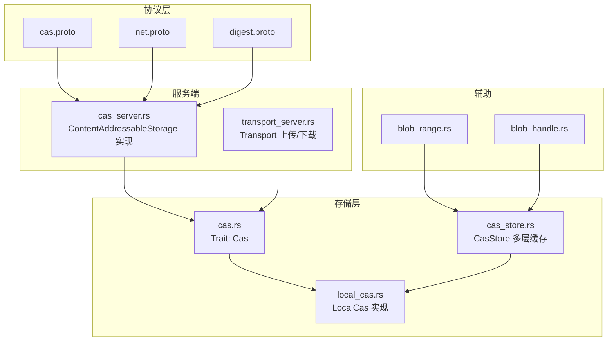
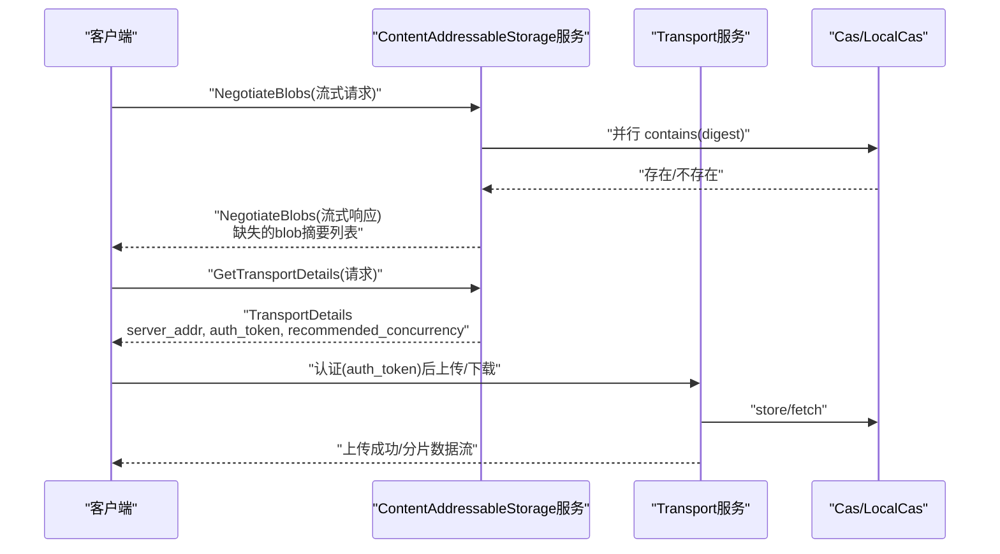
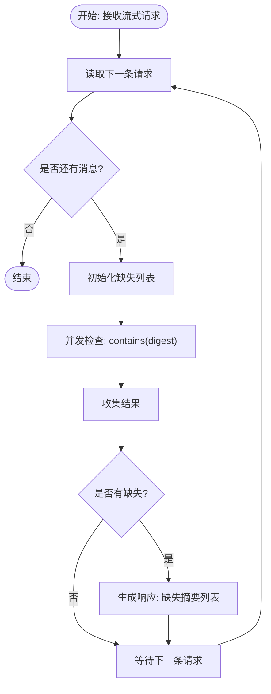
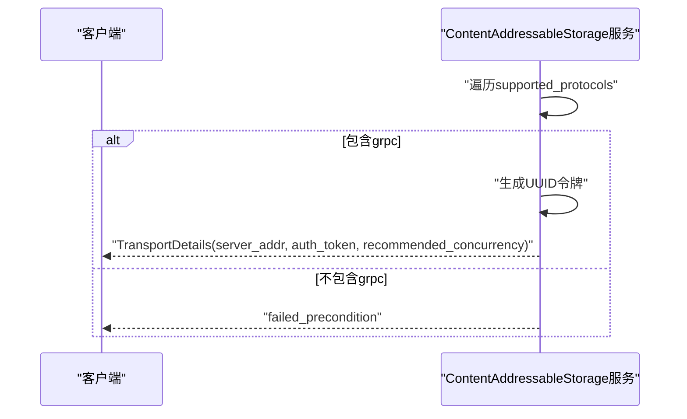
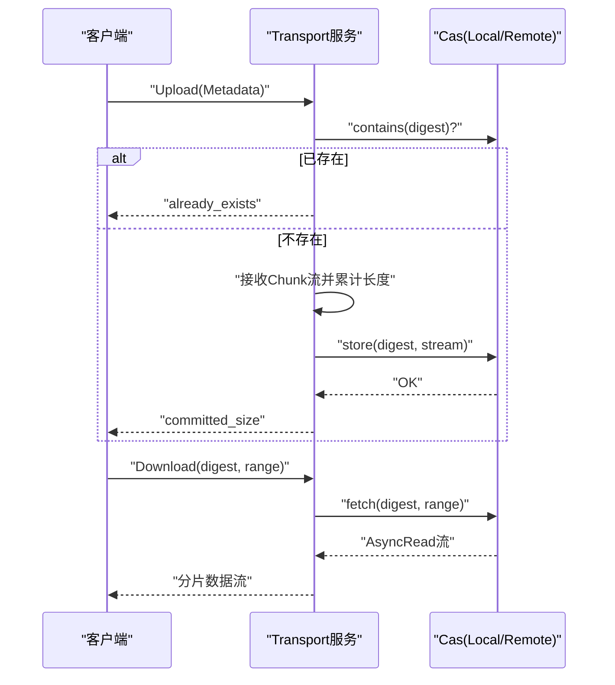
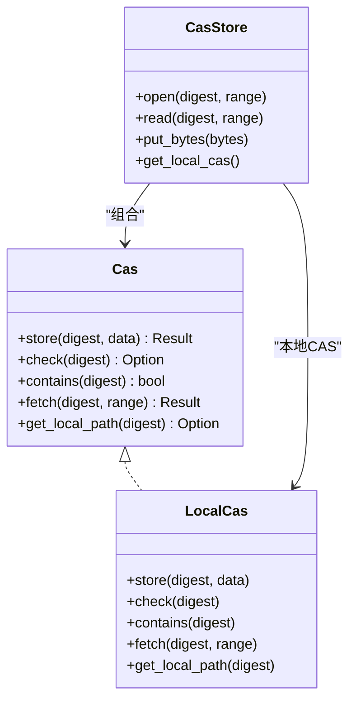
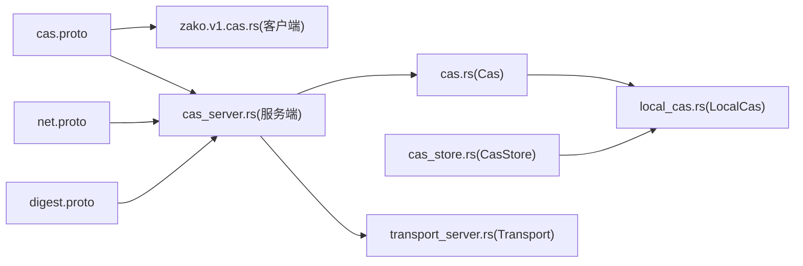

# CAS服务

<cite>
**本文引用的文件**
- [cas.proto](file://zako_core/src/protobuf/cas.proto)
- [net.proto](file://zako_core/src/protobuf/net.proto)
- [digest.proto](file://zako_digest/src/protobuf/digest.proto)
- [cas.rs](file://zako_core/src/cas.rs)
- [cas_server.rs](file://zako_core/src/cas_server.rs)
- [cas_store.rs](file://zako_core/src/cas_store.rs)
- [local_cas.rs](file://zako_core/src/local_cas.rs)
- [blob_range.rs](file://zako_core/src/blob_range.rs)
- [blob_handle.rs](file://zako_core/src/blob_handle.rs)
- [transport_server.rs](file://zako_core/src/transport_server.rs)
- [zako.v1.cas.rs](file://target/debug/build/zako-core-2ba38a90d4c921d8/out/zako.v1.cas.rs)
</cite>

## 目录
1. [简介](#简介)
2. [项目结构](#项目结构)
3. [核心组件](#核心组件)
4. [架构总览](#架构总览)
5. [详细组件分析](#详细组件分析)
6. [依赖关系分析](#依赖关系分析)
7. [性能考量](#性能考量)
8. [故障排除指南](#故障排除指南)
9. [结论](#结论)
10. [附录：API参考与示例](#附录api参考与示例)

## 简介
本文件为内容寻址存储（CAS）服务的完整API文档，聚焦于以下两个关键RPC接口：
- NegotiateBlobs：以流式请求/响应模式进行“blob摘要协商”，返回缺失的blob列表，用于后续高效传输。
- GetTransportDetails：基于客户端支持的传输协议集合，返回服务器可用的传输详情（含认证令牌与并发建议），用于建立后续的上传/下载通道。

文档还涵盖：
- 流式请求/响应模式与传输协议协商机制
- 认证令牌管理与生命周期
- 并发推荐参数与缓冲策略
- blob摘要协商流程、缺失blob检测算法
- 传输详情获取过程
- 客户端集成指南、连接管理与故障排除
- 错误处理策略与性能优化建议

## 项目结构
CAS服务由gRPC协议定义、服务端实现、底层存储抽象与辅助工具组成。核心文件如下：
- 协议定义：cas.proto、net.proto、digest.proto
- 服务端：cas_server.rs（实现ContentAddressableStorage服务）
- 存储抽象：cas.rs（Trait）、local_cas.rs（本地CAS实现）、cas_store.rs（多层缓存与读取调度）
- 辅助类型：blob_range.rs（范围模型）、blob_handle.rs（blob句柄）
- 传输通道：transport_server.rs（独立的上传/下载服务，供GetTransportDetails返回的地址使用）

图表来源
- [cas.proto](file://zako_core/src/protobuf/cas.proto#L1-L32)
- [net.proto](file://zako_core/src/protobuf/net.proto#L1-L20)
- [digest.proto](file://zako_digest/src/protobuf/digest.proto#L1-L10)
- [cas_server.rs](file://zako_core/src/cas_server.rs#L1-L149)
- [transport_server.rs](file://zako_core/src/transport_server.rs#L1-L138)
- [cas.rs](file://zako_core/src/cas.rs#L1-L63)
- [local_cas.rs](file://zako_core/src/local_cas.rs#L1-L213)
- [cas_store.rs](file://zako_core/src/cas_store.rs#L1-L156)
- [blob_range.rs](file://zako_core/src/blob_range.rs#L1-L139)
- [blob_handle.rs](file://zako_core/src/blob_handle.rs#L1-L95)

章节来源
- [cas.proto](file://zako_core/src/protobuf/cas.proto#L1-L32)
- [net.proto](file://zako_core/src/protobuf/net.proto#L1-L20)
- [digest.proto](file://zako_digest/src/protobuf/digest.proto#L1-L10)
- [cas_server.rs](file://zako_core/src/cas_server.rs#L1-L149)
- [transport_server.rs](file://zako_core/src/transport_server.rs#L1-L138)
- [cas.rs](file://zako_core/src/cas.rs#L1-L63)
- [local_cas.rs](file://zako_core/src/local_cas.rs#L1-L213)
- [cas_store.rs](file://zako_core/src/cas_store.rs#L1-L156)
- [blob_range.rs](file://zako_core/src/blob_range.rs#L1-L139)
- [blob_handle.rs](file://zako_core/src/blob_handle.rs#L1-L95)

## 核心组件
- ContentAddressableStorage服务（gRPC）：提供NegotiateBlobs与GetTransportDetails两个RPC。
- Cas Trait：统一的CAS能力抽象（存储、检查、获取、本地路径）。
- LocalCas：本地文件系统中的CAS实现，按blake3哈希分片组织文件。
- CasStore：多层缓存（内存、本地、远程）与读取调度器。
- BlobRange/BlobHandle：范围与句柄抽象，支撑分片读取与缓存内联。
- Transport服务：独立的上传/下载服务，供GetTransportDetails返回的地址使用。

章节来源
- [cas.rs](file://zako_core/src/cas.rs#L1-L63)
- [local_cas.rs](file://zako_core/src/local_cas.rs#L1-L213)
- [cas_store.rs](file://zako_core/src/cas_store.rs#L1-L156)
- [blob_range.rs](file://zako_core/src/blob_range.rs#L1-L139)
- [blob_handle.rs](file://zako_core/src/blob_handle.rs#L1-L95)
- [transport_server.rs](file://zako_core/src/transport_server.rs#L1-L138)

## 架构总览
CAS服务采用“协商+传输”的两阶段设计：
- 协商阶段：客户端通过NegotiateBlobs流式发送多个blob摘要，服务端并行检查本地是否存在，返回缺失列表。
- 传输阶段：客户端调用GetTransportDetails获取传输详情（含认证令牌与并发建议），随后连接到Transport服务进行上传/下载。

图表来源
- [cas_server.rs](file://zako_core/src/cas_server.rs#L64-L147)
- [transport_server.rs](file://zako_core/src/transport_server.rs#L28-L136)
- [cas.rs](file://zako_core/src/cas.rs#L11-L44)

## 详细组件分析

### ContentAddressableStorage服务（NegotiateBlobs）
- 请求/响应模式：请求为流式消息，响应也为流式消息；服务端逐条处理请求并产生对应响应。
- 并发控制：使用buffer_unordered按配置的buffered_io_count并发执行contains检查，提升吞吐。
- 缺失检测算法：对每个摘要调用contains，收集不存在的摘要形成缺失列表；若无缺失则不返回响应。
- 错误处理：Digest解析失败转换为Status；内部异常映射为Status。

图表来源
- [cas_server.rs](file://zako_core/src/cas_server.rs#L64-L112)

章节来源
- [cas_server.rs](file://zako_core/src/cas_server.rs#L64-L112)
- [cas.proto](file://zako_core/src/protobuf/cas.proto#L8-L14)

### ContentAddressableStorage服务（GetTransportDetails）
- 协商协议：仅接受grpc协议；若客户端未提供支持列表或不包含grpc，则返回failed_precondition。
- 认证令牌：生成UUID作为auth_token，并在内存中维护令牌表（当前无TTL，注意安全与清理）。
- 传输详情：返回server_addr（服务监听地址）、auth_token、recommended_concurrency（建议并发数）。
- 连接复用：客户端可使用同一auth_token与Transport服务建立多路复用连接。

图表来源
- [cas_server.rs](file://zako_core/src/cas_server.rs#L114-L147)
- [net.proto](file://zako_core/src/protobuf/net.proto#L17-L19)

章节来源
- [cas_server.rs](file://zako_core/src/cas_server.rs#L114-L147)
- [cas.proto](file://zako_core/src/protobuf/cas.proto#L16-L26)

### 传输通道（Transport服务）
- 下载：接收DownloadRequest（包含digest与range），调用Cas.fetch返回流式数据。
- 上传：要求首条消息为Metadata（包含digest与range），随后接收Chunk流，累计长度并写入CAS。
- 错误映射：NotFound/Io/Internal/索引越界等错误映射为合适的Status。

图表来源
- [transport_server.rs](file://zako_core/src/transport_server.rs#L28-L136)
- [cas.rs](file://zako_core/src/cas.rs#L11-L44)

章节来源
- [transport_server.rs](file://zako_core/src/transport_server.rs#L28-L136)
- [cas.rs](file://zako_core/src/cas.rs#L11-L44)

### 存储抽象与实现
- Cas Trait：定义store/check/contains/fetch/get_local_path等能力，支持异步读取与范围访问。
- LocalCas：按blake3哈希前缀分目录存放，支持mmap与小文件直接读取；提供fetch的范围校验与截断。
- CasStore：优先内存缓存，其次本地CAS，最后远程CAS；open/read提供统一入口；put_bytes自动缓存与落盘。

图表来源
- [cas.rs](file://zako_core/src/cas.rs#L11-L44)
- [local_cas.rs](file://zako_core/src/local_cas.rs#L106-L212)
- [cas_store.rs](file://zako_core/src/cas_store.rs#L22-L156)

章节来源
- [cas.rs](file://zako_core/src/cas.rs#L11-L44)
- [local_cas.rs](file://zako_core/src/local_cas.rs#L106-L212)
- [cas_store.rs](file://zako_core/src/cas_store.rs#L22-L156)

### 范围与句柄
- BlobRange：表示起始偏移与长度（可选），支持零长度校验、越界判断与序列化互转。
- BlobHandle：封装Digest与状态（引用/内存内联），提供open/read以统一访问CasStore。

章节来源
- [blob_range.rs](file://zako_core/src/blob_range.rs#L21-L104)
- [blob_handle.rs](file://zako_core/src/blob_handle.rs#L42-L94)

## 依赖关系分析
- 协议依赖：cas.proto依赖digest.proto与net.proto；gRPC客户端代码由编译生成。
- 服务依赖：cas_server.rs依赖Cas Trait与Digest；transport_server.rs同样依赖Cas与Digest。
- 存储依赖：LocalCas实现Cas；CasStore组合LocalCas与可选远程Cas。

图表来源
- [cas.proto](file://zako_core/src/protobuf/cas.proto#L1-L32)
- [net.proto](file://zako_core/src/protobuf/net.proto#L1-L20)
- [digest.proto](file://zako_digest/src/protobuf/digest.proto#L1-L10)
- [zako.v1.cas.rs](file://target/debug/build/zako-core-2ba38a90d4c921d8/out/zako.v1.cas.rs#L119-L178)
- [cas_server.rs](file://zako_core/src/cas_server.rs#L1-L149)
- [transport_server.rs](file://zako_core/src/transport_server.rs#L1-L138)
- [cas.rs](file://zako_core/src/cas.rs#L1-L63)
- [local_cas.rs](file://zako_core/src/local_cas.rs#L1-L213)
- [cas_store.rs](file://zako_core/src/cas_store.rs#L1-L156)

章节来源
- [cas.proto](file://zako_core/src/protobuf/cas.proto#L1-L32)
- [zako.v1.cas.rs](file://target/debug/build/zako-core-2ba38a90d4c921d8/out/zako.v1.cas.rs#L119-L178)
- [cas_server.rs](file://zako_core/src/cas_server.rs#L1-L149)
- [transport_server.rs](file://zako_core/src/transport_server.rs#L1-L138)
- [cas.rs](file://zako_core/src/cas.rs#L1-L63)
- [local_cas.rs](file://zako_core/src/local_cas.rs#L1-L213)
- [cas_store.rs](file://zako_core/src/cas_store.rs#L1-L156)

## 性能考量
- 并发与缓冲
  - NegotiateBlobs使用buffer_unordered按buffered_io_count并发检查，建议根据CPU核数与磁盘I/O能力调整。
  - CasStore的open优先内存缓存，命中后避免磁盘与远程访问；put_bytes对小对象（如阈值内）直接缓存。
- 传输建议
  - GetTransportDetails返回recommended_concurrency，客户端可据此设置上传/下载并发度。
  - 传输阶段建议使用gRPC流式上传/下载，结合Chunk大小与背压策略。
- I/O优化
  - LocalCas对大文件使用mmap，小文件直接读取，减少系统调用开销。
  - fetch支持范围读取，避免全量下载。

章节来源
- [cas_server.rs](file://zako_core/src/cas_server.rs#L78-L93)
- [cas_store.rs](file://zako_core/src/cas_store.rs#L64-L108)
- [local_cas.rs](file://zako_core/src/local_cas.rs#L31-L70)

## 故障排除指南
- NegotiateBlobs无响应
  - 检查客户端是否正确发送流式请求且每条包含多个blob摘要。
  - 服务端仅在存在缺失时返回响应；若无缺失属正常行为。
- GetTransportDetails返回failed_precondition
  - 确认客户端在请求中至少包含grpc协议。
- 上传/下载报错
  - 上传：若提示已存在，确认digest是否正确且目标范围是否允许覆盖。
  - 下载：若提示索引越界，检查请求的range是否超出blob实际长度。
- 认证问题
  - 服务端当前未实现令牌TTL，建议在网关或应用层增加过期与回收逻辑。
- 性能问题
  - 调整buffered_io_count与recommended_concurrency至合适值。
  - 对小文件启用内存缓存，减少磁盘与网络往返。

章节来源
- [cas_server.rs](file://zako_core/src/cas_server.rs#L122-L147)
- [transport_server.rs](file://zako_core/src/transport_server.rs#L98-L136)
- [cas_store.rs](file://zako_core/src/cas_store.rs#L68-L90)

## 结论
CAS服务通过清晰的两阶段设计（协商+传输）与完善的错误处理、并发控制与缓存策略，为分布式构建系统提供了高可靠的内容寻址能力。集成者应重点关注：
- 正确使用NegotiateBlobs进行缺失检测与批量协商
- 使用GetTransportDetails获取认证令牌与并发建议
- 在客户端侧合理设置并发与缓冲，结合范围读取优化性能
- 注意令牌生命周期与安全加固

## 附录：API参考与示例

### RPC接口定义
- 服务名：ContentAddressableStorage
- 方法：
  - NegotiateBlobs(stream NegotiateBlobsRequest) returns (stream NegotiateBlobsResponse)
  - GetTransportDetails(GetTransportDetailsRequest) returns (TransportDetails)

章节来源
- [cas.proto](file://zako_core/src/protobuf/cas.proto#L28-L31)

### gRPC客户端调用要点
- NegotiateBlobs
  - 使用流式请求发送多个blob摘要
  - 逐条读取响应，收集缺失摘要
- GetTransportDetails
  - 发送包含支持协议列表的请求
  - 解析返回的server_addr、auth_token、recommended_concurrency

章节来源
- [zako.v1.cas.rs](file://target/debug/build/zako-core-2ba38a90d4c921d8/out/zako.v1.cas.rs#L119-L178)

### 数据模型
- NegotiateBlobsRequest/NegotiateBlobsResponse
  - 字段：blob_digests（Digest数组）
- GetTransportDetailsRequest
  - 字段：supported_protocols（Protocol数组）
- TransportDetails
  - 字段：server_addr（SocketAddress）、auth_token（字符串）、recommended_concurrency（uint32）

章节来源
- [cas.proto](file://zako_core/src/protobuf/cas.proto#L8-L26)
- [net.proto](file://zako_core/src/protobuf/net.proto#L12-L19)
- [digest.proto](file://zako_digest/src/protobuf/digest.proto#L5-L9)

### 错误码与语义
- NegotiateBlobs
  - Digest解析失败：Status.from(DigestError) → Status
- GetTransportDetails
  - 不支持任何协议：failed_precondition
- 传输阶段（Transport）
  - 上传：Metadata缺失、Range不支持、已存在等 → 对应Status
  - 下载：NotFound → not_found；范围越界 → invalid_argument；其他 → internal

章节来源
- [cas_server.rs](file://zako_core/src/cas_server.rs#L83-L84)
- [cas_server.rs](file://zako_core/src/cas_server.rs#L127-L136)
- [transport_server.rs](file://zako_core/src/transport_server.rs#L98-L105)
- [transport_server.rs](file://zako_core/src/transport_server.rs#L52-L57)

### 客户端集成步骤
- 协商阶段
  - 建立gRPC连接到ContentAddressableStorage
  - 调用NegotiateBlobs发送摘要列表，收集缺失项
- 传输阶段
  - 调用GetTransportDetails获取server_addr与auth_token
  - 使用auth_token连接Transport服务进行上传/下载
  - 参考recommended_concurrency设置并发

章节来源
- [cas_server.rs](file://zako_core/src/cas_server.rs#L114-L147)
- [transport_server.rs](file://zako_core/src/transport_server.rs#L28-L136)