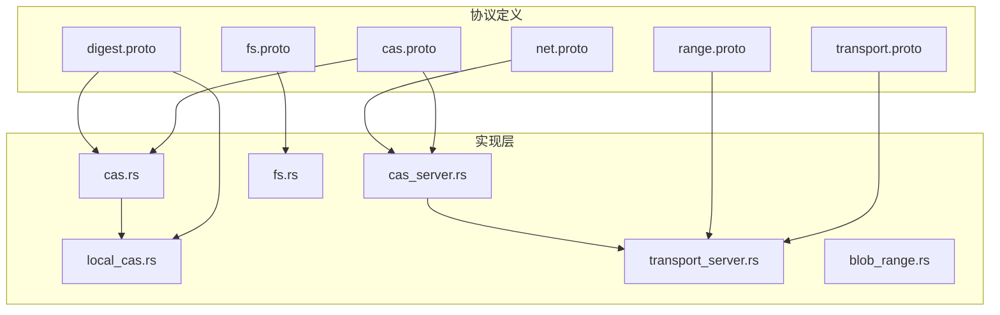
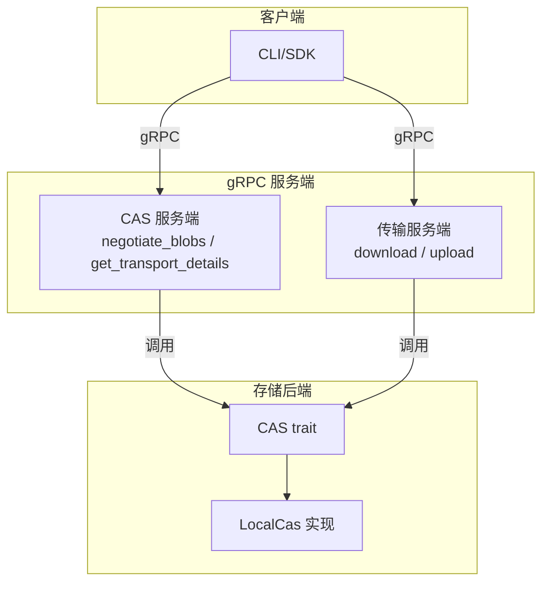
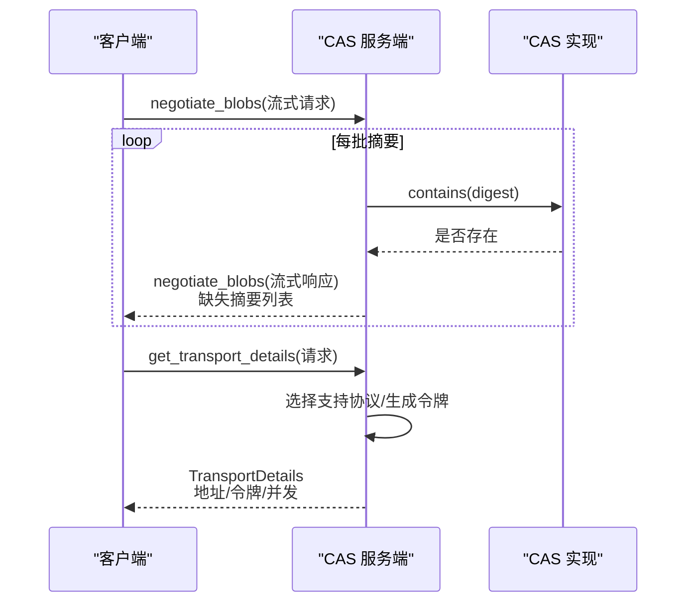
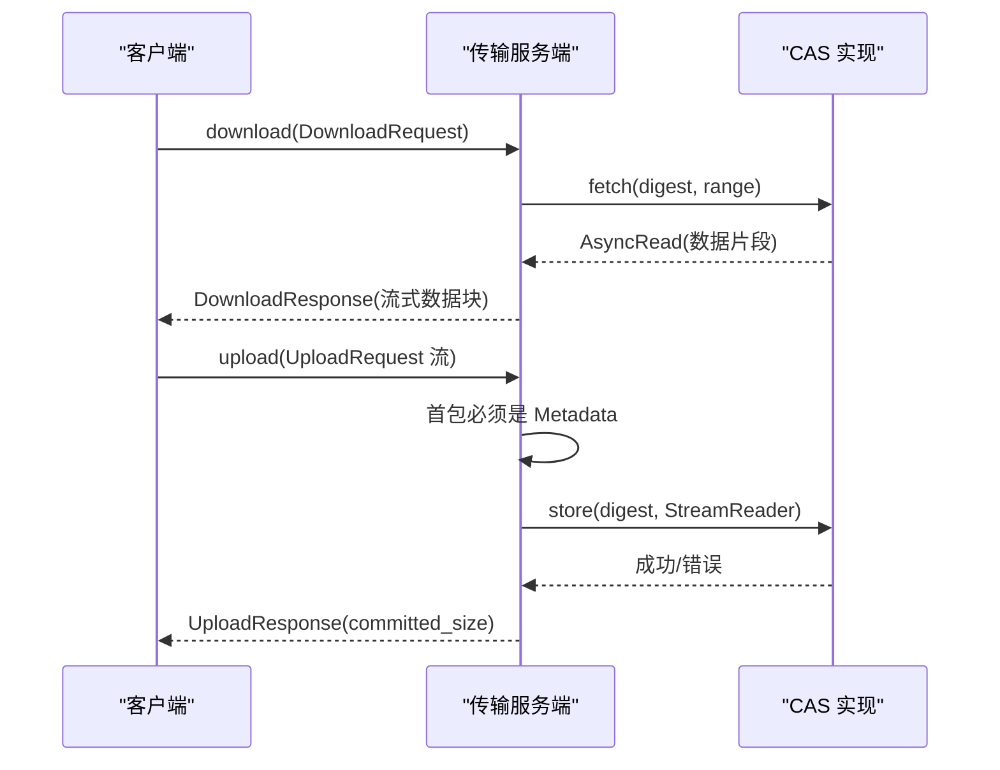
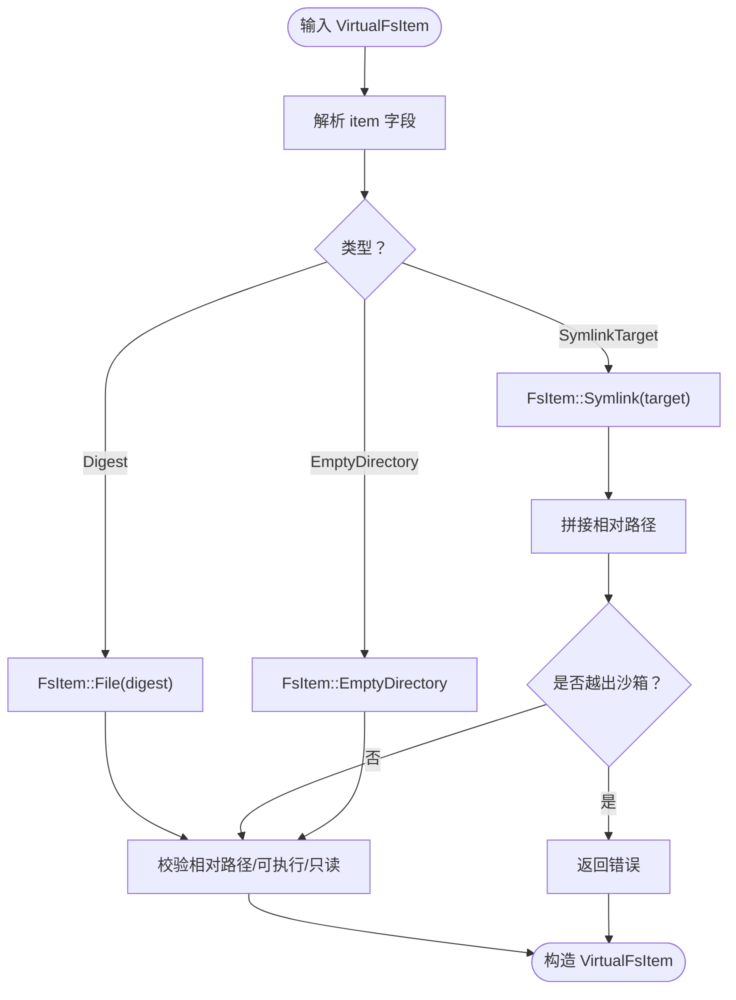
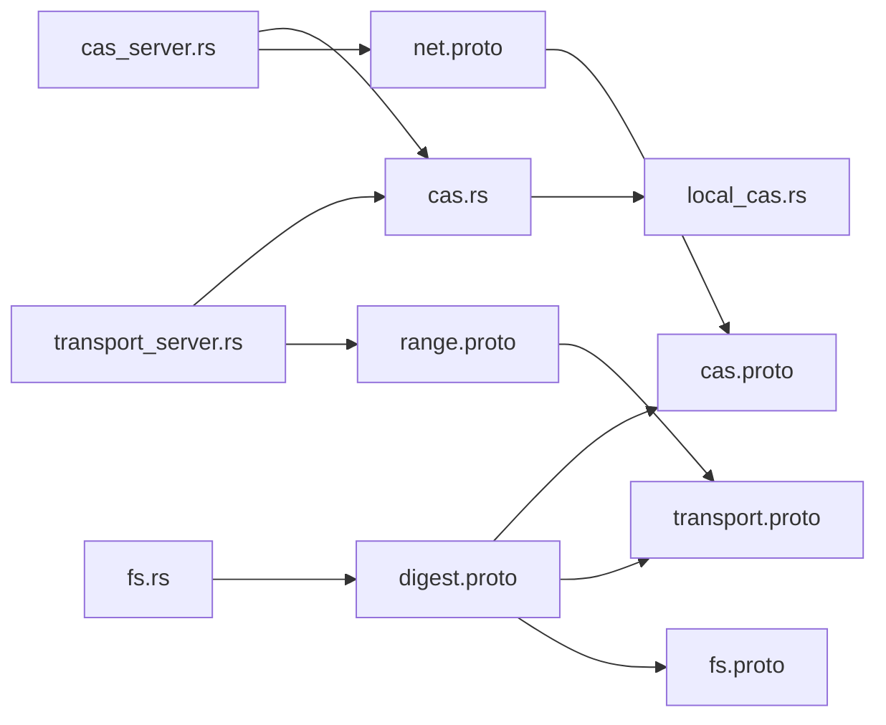

# gRPC服务接口

<cite>
**本文引用的文件**
- [zako_core/src/protobuf/cas.proto](file://zako_core/src/protobuf/cas.proto)
- [zako_core/src/protobuf/transport.proto](file://zako_core/src/protobuf/transport.proto)
- [zako_core/src/protobuf/fs.proto](file://zako_core/src/protobuf/fs.proto)
- [zako_core/src/protobuf/net.proto](file://zako_core/src/protobuf/net.proto)
- [zako_core/src/protobuf/range.proto](file://zako_core/src/protobuf/range.proto)
- [zako_digest/src/protobuf/digest.proto](file://zako_digest/src/protobuf/digest.proto)
- [zako_core/src/cas.rs](file://zako_core/src/cas.rs)
- [zako_core/src/transport_server.rs](file://zako_core/src/transport_server.rs)
- [zako_core/src/cas_server.rs](file://zako_core/src/cas_server.rs)
- [zako_core/src/fs.rs](file://zako_core/src/fs.rs)
- [zako_core/src/blob_range.rs](file://zako_core/src/blob_range.rs)
- [zako_core/src/local_cas.rs](file://zako_core/src/local_cas.rs)
- [Cargo.toml](file://Cargo.toml)
</cite>

## 目录
1. [简介](#简介)
2. [项目结构](#项目结构)
3. [核心组件](#核心组件)
4. [架构总览](#架构总览)
5. [详细组件分析](#详细组件分析)
6. [依赖关系分析](#依赖关系分析)
7. [性能考量](#性能考量)
8. [故障排除指南](#故障排除指南)
9. [结论](#结论)
10. [附录](#附录)

## 简介
本文件面向服务集成者与客户端开发者，系统化梳理 Zako 的 gRPC 服务接口，覆盖以下服务：
- 内容可寻址存储服务（CAS）
- 传输服务（Transport）
- 文件系统服务（虚拟文件系统模型）
- 网络服务（地址与协议模型）
- 范围服务（Blob 范围读取）

文档内容包括：接口规范、请求/响应模式、认证与安全、错误处理策略、服务间依赖、数据交换协议、客户端集成建议、性能优化与调试工具，并提供协议特定的故障排除与迁移建议。

## 项目结构
Zako 的 gRPC 接口由一组 .proto 定义与对应的 Rust 实现组成，位于 zako_core 与 zako_digest 模块中；网络与协议模型在 net.proto 中定义；范围模型在 range.proto 中定义；CAS 与传输服务的实现分别在 cas.rs、local_cas.rs、cas_server.rs、transport_server.rs 中。

**图表来源**
- [zako_core/src/protobuf/cas.proto](file://zako_core/src/protobuf/cas.proto#L1-L32)
- [zako_core/src/protobuf/transport.proto](file://zako_core/src/protobuf/transport.proto#L1-L38)
- [zako_core/src/protobuf/fs.proto](file://zako_core/src/protobuf/fs.proto#L1-L19)
- [zako_core/src/protobuf/net.proto](file://zako_core/src/protobuf/net.proto#L1-L20)
- [zako_core/src/protobuf/range.proto](file://zako_core/src/protobuf/range.proto#L1-L9)
- [zako_digest/src/protobuf/digest.proto](file://zako_digest/src/protobuf/digest.proto#L1-L10)
- [zako_core/src/cas.rs](file://zako_core/src/cas.rs#L1-L63)
- [zako_core/src/local_cas.rs](file://zako_core/src/local_cas.rs#L1-L213)
- [zako_core/src/cas_server.rs](file://zako_core/src/cas_server.rs#L1-L149)
- [zako_core/src/transport_server.rs](file://zako_core/src/transport_server.rs#L1-L138)
- [zako_core/src/fs.rs](file://zako_core/src/fs.rs#L1-L115)
- [zako_core/src/blob_range.rs](file://zako_core/src/blob_range.rs#L1-L139)

**章节来源**
- [zako_core/src/protobuf/cas.proto](file://zako_core/src/protobuf/cas.proto#L1-L32)
- [zako_core/src/protobuf/transport.proto](file://zako_core/src/protobuf/transport.proto#L1-L38)
- [zako_core/src/protobuf/fs.proto](file://zako_core/src/protobuf/fs.proto#L1-L19)
- [zako_core/src/protobuf/net.proto](file://zako_core/src/protobuf/net.proto#L1-L20)
- [zako_core/src/protobuf/range.proto](file://zako_core/src/protobuf/range.proto#L1-L9)
- [zako_digest/src/protobuf/digest.proto](file://zako_digest/src/protobuf/digest.proto#L1-L10)

## 核心组件
- 内容可寻址存储（CAS）接口：抽象存储能力（存储、检查、获取、本地路径），并定义错误类型。
- 本地 CAS 实现：基于文件系统的存储、校验、范围读取与本地路径暴露。
- CAS 服务器：gRPC 服务端实现，支持流式协商缺失 Blob、返回传输详情（含认证令牌与并发建议）。
- 传输服务器：gRPC 服务端实现，支持下载（流式响应）与上传（流式请求）。
- 虚拟文件系统项：将虚拟文件系统条目映射到 FsItem（文件、符号链接、空目录），并进行路径合法性校验。
- 范围模型：BlobRange 抽象，支持全量与区间读取，提供边界校验与转换。

**章节来源**
- [zako_core/src/cas.rs](file://zako_core/src/cas.rs#L1-L63)
- [zako_core/src/local_cas.rs](file://zako_core/src/local_cas.rs#L1-L213)
- [zako_core/src/cas_server.rs](file://zako_core/src/cas_server.rs#L1-L149)
- [zako_core/src/transport_server.rs](file://zako_core/src/transport_server.rs#L1-L138)
- [zako_core/src/fs.rs](file://zako_core/src/fs.rs#L1-L115)
- [zako_core/src/blob_range.rs](file://zako_core/src/blob_range.rs#L1-L139)

## 架构总览
Zako 的 gRPC 服务采用分层设计：
- 协议层：通过 .proto 定义消息与服务接口。
- 服务层：实现 gRPC 服务端逻辑，负责参数解析、权限与协议校验、错误映射。
- 存储层：CAS 抽象与本地实现，负责数据持久化、校验与范围读取。
- 依赖注入：CAS 服务器与传输服务器均以 trait 注入，便于替换实现。

**图表来源**
- [zako_core/src/cas_server.rs](file://zako_core/src/cas_server.rs#L59-L149)
- [zako_core/src/transport_server.rs](file://zako_core/src/transport_server.rs#L24-L138)
- [zako_core/src/cas.rs](file://zako_core/src/cas.rs#L10-L44)
- [zako_core/src/local_cas.rs](file://zako_core/src/local_cas.rs#L105-L213)

## 详细组件分析

### CAS 服务（内容可寻址存储）
- 服务名称：ContentAddressableStorage
- 方法：
  - negotiate_blobs（流式请求 → 流式响应）：接收一批 Blob 摘要，返回缺失的摘要列表。
  - get_transport_details（单次请求 → 单次响应）：根据客户端支持的协议返回传输详情，包含服务器地址、认证令牌与推荐并发数。

**图表来源**
- [zako_core/src/protobuf/cas.proto](file://zako_core/src/protobuf/cas.proto#L28-L31)
- [zako_core/src/cas_server.rs](file://zako_core/src/cas_server.rs#L64-L147)

- 请求/响应模式
  - negotiate_blobs
    - 请求：流式 NegotiateBlobsRequest（包含若干 blob_digests）
    - 响应：流式 NegotiateBlobsResponse（缺失的 blob_digests 列表）
  - get_transport_details
    - 请求：GetTransportDetailsRequest（支持的协议列表）
    - 响应：TransportDetails（server_addr、auth_token、recommended_concurrency）

- 认证与安全
  - 传输详情返回一个一次性令牌（UUID），用于后续传输连接的身份标识。
  - 仅支持 gRPC 协议（Protocol.grpc）。

- 错误处理
  - negotiate_blobs：内部错误映射为 internal；摘要转换失败映射为 invalid_argument。
  - get_transport_details：无支持协议时返回 failed_precondition；成功时返回包含令牌与并发建议的 TransportDetails。

- 数据交换协议
  - 使用 Digest（size_bytes、blake3）、SocketAddress（ip/port）与 Protocol 枚举。

**章节来源**
- [zako_core/src/protobuf/cas.proto](file://zako_core/src/protobuf/cas.proto#L8-L31)
- [zako_core/src/protobuf/net.proto](file://zako_core/src/protobuf/net.proto#L12-L19)
- [zako_core/src/cas_server.rs](file://zako_core/src/cas_server.rs#L64-L147)

### 传输服务（Transport）
- 服务名称：Transport
- 方法：
  - download（单次请求 → 流式响应）：按指定摘要与范围返回数据块流。
  - upload（流式请求 → 单次响应）：先发送元数据（包含摘要与范围），随后发送数据块，返回已提交字节数。

**图表来源**
- [zako_core/src/protobuf/transport.proto](file://zako_core/src/protobuf/transport.proto#L14-L37)
- [zako_core/src/transport_server.rs](file://zako_core/src/transport_server.rs#L28-L136)

- 请求/响应模式
  - download
    - 请求：DownloadRequest（包含 BlobResource：digest + range）
    - 响应：流式 DownloadResponse（data 字段）
  - upload
    - 请求：UploadRequest（payload 为 Metadata 或 Chunk）
    - 响应：UploadResponse（committed_size）

- 认证与安全
  - 通过 CAS 服务返回的 auth_token 进行身份验证（令牌一次性使用）。

- 错误处理
  - 下载：Digest/Range 解析失败或不存在映射为 not_found；索引越界映射为 invalid_argument；IO 错误映射为 internal。
  - 上传：首包非 Metadata 返回 failed_precondition；数据包类型错误映射为 invalid_data；CAS 存储错误映射为 internal。

- 数据交换协议
  - 使用 Digest、BlobRange、UploadRequest 的 oneof（metadata/chunk）。

**章节来源**
- [zako_core/src/protobuf/transport.proto](file://zako_core/src/protobuf/transport.proto#L14-L37)
- [zako_core/src/transport_server.rs](file://zako_core/src/transport_server.rs#L28-L136)
- [zako_core/src/blob_range.rs](file://zako_core/src/blob_range.rs#L123-L139)

### 文件系统服务（虚拟文件系统）
- 数据模型：VirtualFsItem（相对路径、条目类型、可执行/只读标志）
- 条目类型：
  - 文件：关联 Digest
  - 符号链接：相对路径目标
  - 空目录：标记
- 路径与合法性
  - 严格禁止绝对路径、空路径、访问父目录“..”越权、符号链接目标越权等。
  - 支持从 proto 转换为内部结构，转换失败返回相应错误。

**图表来源**
- [zako_core/src/protobuf/fs.proto](file://zako_core/src/protobuf/fs.proto#L7-L18)
- [zako_core/src/fs.rs](file://zako_core/src/fs.rs#L49-L114)

**章节来源**
- [zako_core/src/protobuf/fs.proto](file://zako_core/src/protobuf/fs.proto#L7-L18)
- [zako_core/src/fs.rs](file://zako_core/src/fs.rs#L21-L114)

### 网络服务（地址与协议）
- SocketAddress：包含 IP 地址（IPv4/IPv6）与端口。
- Protocol：当前仅支持 gRPC。

**章节来源**
- [zako_core/src/protobuf/net.proto](file://zako_core/src/protobuf/net.proto#L5-L19)

### 范围服务（Blob 范围）
- BlobRange：起始偏移与可选长度；支持全量与区间读取；提供越界判断与转换。
- 与传输服务配合，实现精准范围下载。

**章节来源**
- [zako_core/src/protobuf/range.proto](file://zako_core/src/protobuf/range.proto#L5-L8)
- [zako_core/src/blob_range.rs](file://zako_core/src/blob_range.rs#L21-L104)

## 依赖关系分析
- 协议依赖
  - cas.proto 依赖 digest.proto、net.proto
  - transport.proto 依赖 digest.proto、range.proto
  - fs.proto 依赖 digest.proto
- 实现依赖
  - cas_server.rs 依赖 net.proto（SocketAddress/Protocol）、cas.rs（Cas trait）
  - transport_server.rs 依赖 cas.rs、transport.proto、range.proto
  - local_cas.rs 依赖 cas.rs、blob_range.rs、digest
  - fs.rs 依赖 digest、path 工具与错误类型

**图表来源**
- [zako_core/src/protobuf/cas.proto](file://zako_core/src/protobuf/cas.proto#L5-L6)
- [zako_core/src/protobuf/transport.proto](file://zako_core/src/protobuf/transport.proto#L5-L6)
- [zako_core/src/protobuf/fs.proto](file://zako_core/src/protobuf/fs.proto#L5)
- [zako_core/src/protobuf/net.proto](file://zako_core/src/protobuf/net.proto#L3)
- [zako_core/src/protobuf/range.proto](file://zako_core/src/protobuf/range.proto#L3)
- [zako_core/src/cas.rs](file://zako_core/src/cas.rs#L1-L8)
- [zako_core/src/local_cas.rs](file://zako_core/src/local_cas.rs#L1-L10)
- [zako_core/src/cas_server.rs](file://zako_core/src/cas_server.rs#L1-L14)
- [zako_core/src/transport_server.rs](file://zako_core/src/transport_server.rs#L1-L11)
- [zako_core/src/fs.rs](file://zako_core/src/fs.rs#L1-L4)

**章节来源**
- [Cargo.toml](file://Cargo.toml#L210-L214)

## 性能考量
- 并发与缓冲
  - CAS 服务器在 negotiate_blobs 中使用 buffer_unordered 控制 IO 并发度，默认与 CPU 核数一致。
  - 传输服务器在上传时使用流式读取与原子重命名，避免部分写入。
- 本地缓存与直通
  - LocalCas 在大文件场景使用内存映射加速哈希计算；小文件直接读取。
  - get_local_path 可返回本地路径，便于进一步直通优化（如 sendfile）。
- 范围读取
  - BlobRange 提供越界检查，避免无效 IO；下载时按需 seek 与 take，减少内存占用。
- gRPC 流式
  - 下载使用流式响应，上传使用流式请求，降低内存峰值与延迟。

**章节来源**
- [zako_core/src/cas_server.rs](file://zako_core/src/cas_server.rs#L71-L93)
- [zako_core/src/local_cas.rs](file://zako_core/src/local_cas.rs#L31-L70)
- [zako_core/src/transport_server.rs](file://zako_core/src/transport_server.rs#L110-L122)
- [zako_core/src/blob_range.rs](file://zako_core/src/blob_range.rs#L74-L82)

## 故障排除指南
- 常见错误与定位
  - negotiate_blobs：invalid_argument（摘要/协议解析失败）；internal（内部 IO/存储错误）。
  - get_transport_details：failed_precondition（不支持的协议）。
  - download：not_found（Digest 不存在）；invalid_argument（索引越界）；internal（IO 错误）。
  - upload：failed_precondition（首包非 Metadata）；invalid_argument（Range 不支持）；already_exists（重复上传）；internal（存储初始化失败）。
- 安全与认证
  - 令牌一次性使用，过期即失效；请在获取 TransportDetails 后尽快建立传输连接。
- 调试建议
  - 开启 gRPC 日志与追踪，观察流式请求/响应的吞吐与延迟。
  - 对于下载，确认 BlobRange 的 start/length 与文件大小边界。
  - 对于上传，确保首包为 Metadata，后续为连续 Chunk。

**章节来源**
- [zako_core/src/cas_server.rs](file://zako_core/src/cas_server.rs#L114-L147)
- [zako_core/src/transport_server.rs](file://zako_core/src/transport_server.rs#L28-L136)
- [zako_core/src/cas.rs](file://zako_core/src/cas.rs#L46-L62)

## 结论
Zako 的 gRPC 服务以清晰的协议定义与模块化的实现分离，提供了高效、可扩展的内容寻址与传输能力。通过流式接口、范围读取与本地路径直通，可在多种部署场景下获得良好性能。建议在生产环境中结合令牌认证、并发控制与日志追踪，持续优化端到端延迟与吞吐。

## 附录

### 接口规范速查
- CAS 服务
  - negotiate_blobs：流式请求 → 流式响应
  - get_transport_details：请求 → 单次响应（TransportDetails）
- 传输服务
  - download：请求（Digest + Range）→ 流式响应（data）
  - upload：流式请求（Metadata + Chunk...）→ 单次响应（committed_size）

**章节来源**
- [zako_core/src/protobuf/cas.proto](file://zako_core/src/protobuf/cas.proto#L28-L31)
- [zako_core/src/protobuf/transport.proto](file://zako_core/src/protobuf/transport.proto#L33-L37)

### 客户端集成要点
- 先调用 CAS 的 negotiate_blobs，批量获取缺失摘要，再并发上传。
- 获取 TransportDetails 后，使用返回的 auth_token 建立传输连接。
- 上传时务必先发 Metadata，再发 Chunk。
- 下载时根据 BlobRange 控制范围，避免越界。

**章节来源**
- [zako_core/src/cas_server.rs](file://zako_core/src/cas_server.rs#L114-L147)
- [zako_core/src/transport_server.rs](file://zako_core/src/transport_server.rs#L70-L91)

### 协议特定示例与迁移
- 示例
  - 传输详情：包含 server_addr、auth_token、recommended_concurrency。
  - 下载：按需分片，适合大文件与弱网环境。
  - 上传：首包固定为 Metadata，后续为连续 Chunk。
- 迁移建议
  - 从 HTTP/REST 迁移至 gRPC 时，优先复用 Digest 与 Range 概念，保持语义一致。
  - 将多步 HTTP 请求合并为单次协商与流式传输，减少握手开销。

**章节来源**
- [zako_core/src/protobuf/cas.proto](file://zako_core/src/protobuf/cas.proto#L16-L26)
- [zako_core/src/protobuf/transport.proto](file://zako_core/src/protobuf/transport.proto#L14-L31)