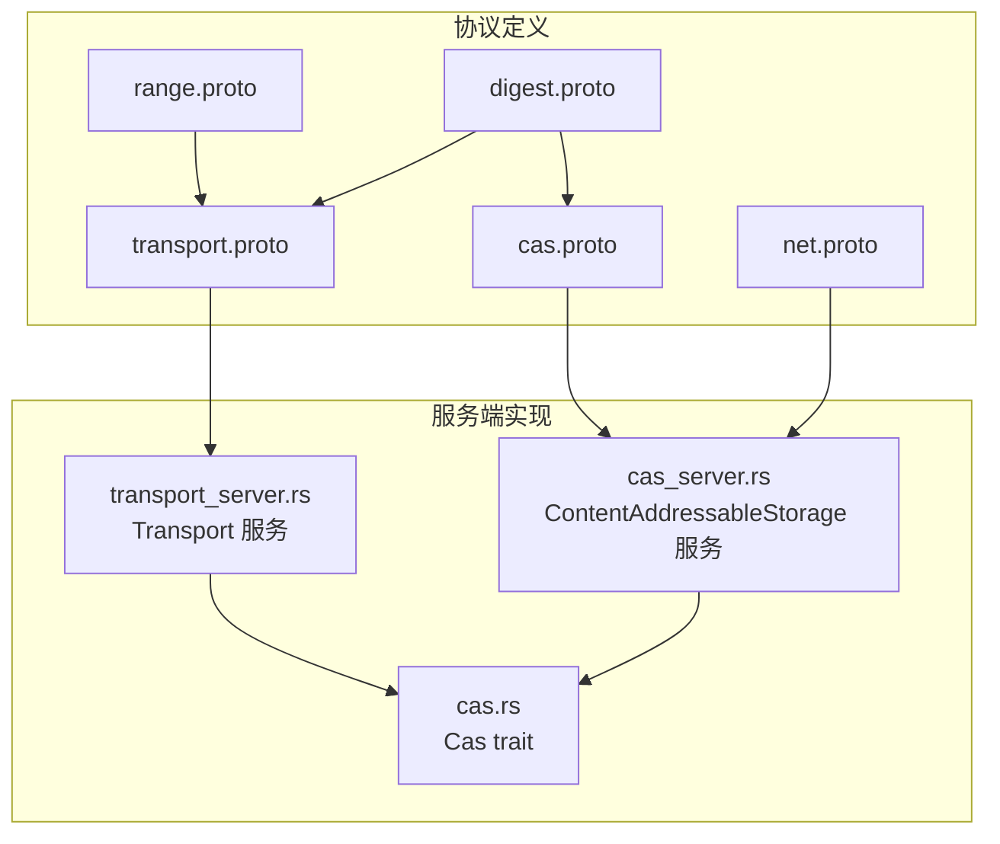
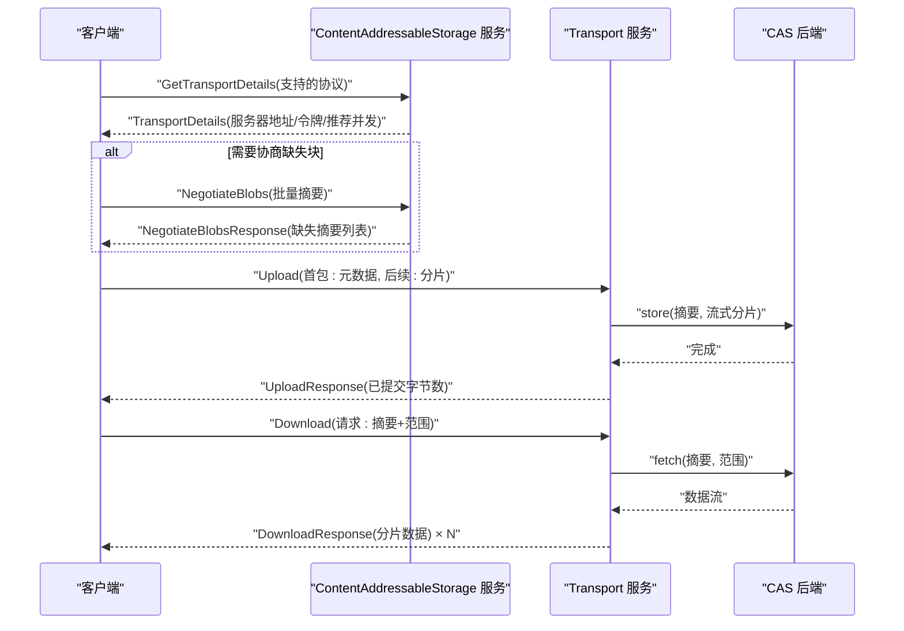
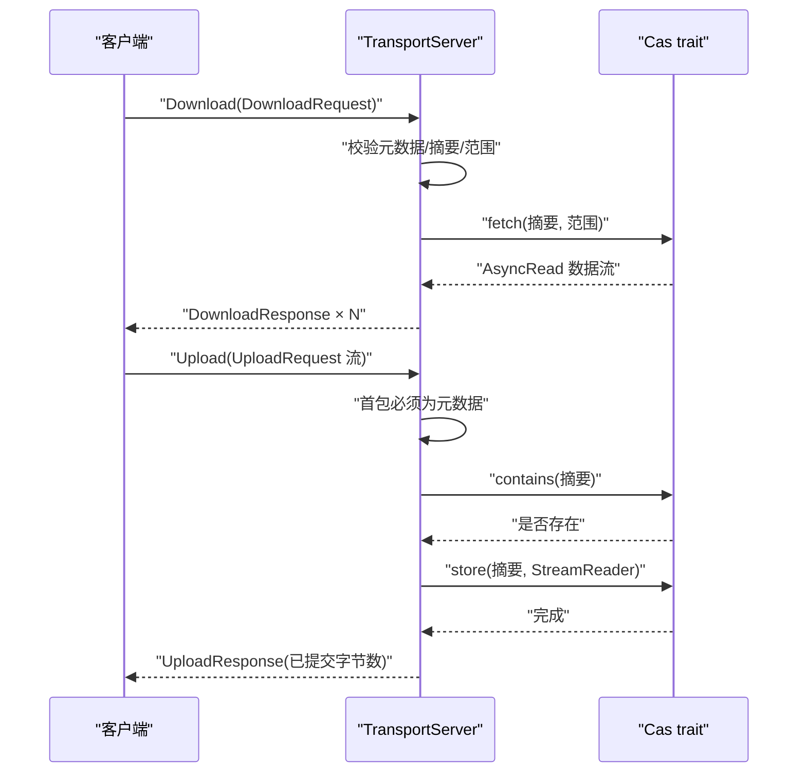
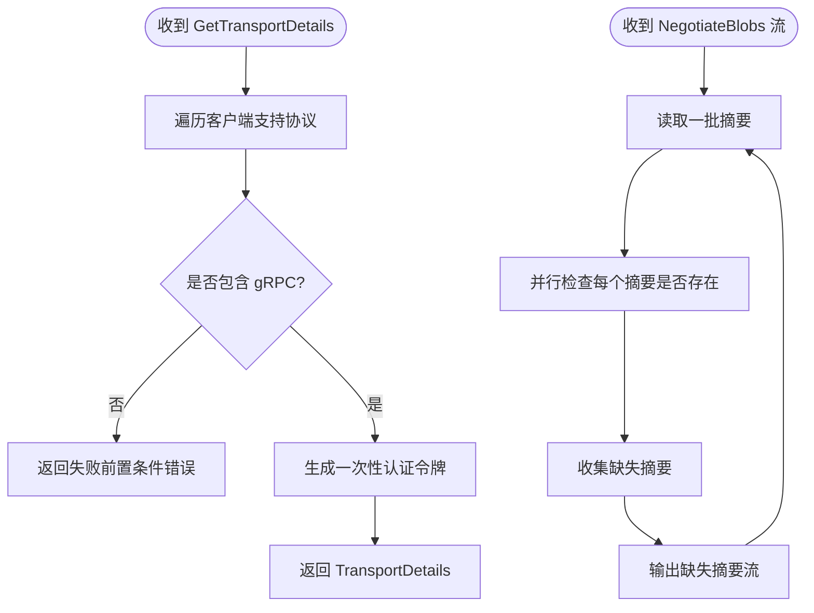
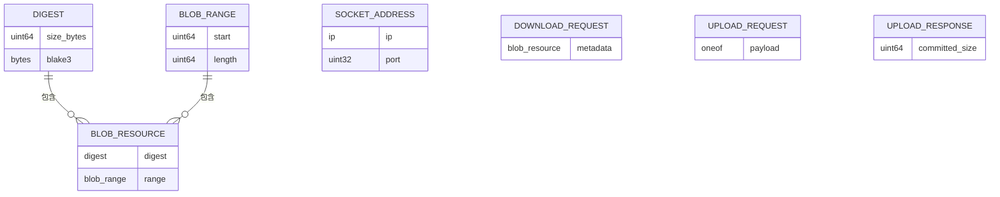
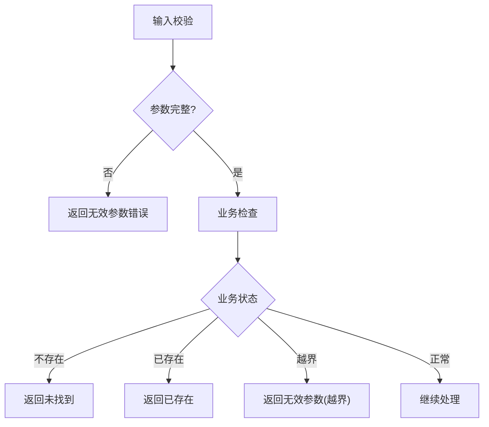

# 传输服务

<cite>
**本文引用的文件**
- [zako_core/src/protobuf/transport.proto](file://zako_core/src/protobuf/transport.proto)
- [zako_core/src/protobuf/cas.proto](file://zako_core/src/protobuf/cas.proto)
- [zako_core/src/protobuf/net.proto](file://zako_core/src/protobuf/net.proto)
- [zako_core/src/protobuf/range.proto](file://zako_core/src/protobuf/range.proto)
- [zako_digest/src/protobuf/digest.proto](file://zako_digest/src/protobuf/digest.proto)
- [zako_core/src/transport_server.rs](file://zako_core/src/transport_server.rs)
- [zako_core/src/cas_server.rs](file://zako_core/src/cas_server.rs)
- [zako_core/src/cas.rs](file://zako_core/src/cas.rs)
- [Cargo.toml](file://Cargo.toml)
</cite>

## 目录
1. [简介](#简介)
2. [项目结构](#项目结构)
3. [核心组件](#核心组件)
4. [架构总览](#架构总览)
5. [详细组件分析](#详细组件分析)
6. [依赖关系分析](#依赖关系分析)
7. [性能考量](#性能考量)
8. [故障排查指南](#故障排查指南)
9. [结论](#结论)
10. [附录](#附录)

## 简介
本文件面向分布式构建系统传输层的集成者，系统性梳理并说明传输服务的 gRPC 接口与协议设计，覆盖数据传输、连接管理与协议协商能力。内容包括：
- 传输协议相关的 gRPC RPC 方法、消息格式与流式传输机制
- 协议选择逻辑、连接建立流程与认证令牌发放
- 数据传输优化策略、错误恢复机制与性能监控建议
- 网络拓扑适配、带宽管理与延迟优化最佳实践

## 项目结构
传输服务由以下关键部分组成：
- 协议定义：位于 zako_core/src/protobuf 下的 transport.proto、cas.proto、net.proto、range.proto、digest.proto
- 服务端实现：zako_core/src/transport_server.rs（下载/上传）、zako_core/src/cas_server.rs（协议协商/传输详情）
- 存储抽象：zako_core/src/cas.rs（内容寻址存储接口）



**图示来源**
- [zako_core/src/protobuf/transport.proto](file://zako_core/src/protobuf/transport.proto#L1-L38)
- [zako_core/src/protobuf/cas.proto](file://zako_core/src/protobuf/cas.proto#L1-L31)
- [zako_core/src/protobuf/net.proto](file://zako_core/src/protobuf/net.proto#L1-L20)
- [zako_core/src/protobuf/range.proto](file://zako_core/src/protobuf/range.proto#L1-L9)
- [zako_digest/src/protobuf/digest.proto](file://zako_digest/src/protobuf/digest.proto#L1-L10)
- [zako_core/src/transport_server.rs](file://zako_core/src/transport_server.rs#L1-L138)
- [zako_core/src/cas_server.rs](file://zako_core/src/cas_server.rs#L1-L149)
- [zako_core/src/cas.rs](file://zako_core/src/cas.rs#L1-L63)

**章节来源**
- [zako_core/src/protobuf/transport.proto](file://zako_core/src/protobuf/transport.proto#L1-L38)
- [zako_core/src/protobuf/cas.proto](file://zako_core/src/protobuf/cas.proto#L1-L31)
- [zako_core/src/protobuf/net.proto](file://zako_core/src/protobuf/net.proto#L1-L20)
- [zako_core/src/protobuf/range.proto](file://zako_core/src/protobuf/range.proto#L1-L9)
- [zako_digest/src/protobuf/digest.proto](file://zako_digest/src/protobuf/digest.proto#L1-L10)
- [zako_core/src/transport_server.rs](file://zako_core/src/transport_server.rs#L1-L138)
- [zako_core/src/cas_server.rs](file://zako_core/src/cas_server.rs#L1-L149)
- [zako_core/src/cas.rs](file://zako_core/src/cas.rs#L1-L63)

## 核心组件
- 传输服务（Transport）：提供 Download 与 Upload 两个 RPC，分别用于拉取与推送数据资源。
- 内容寻址存储服务（ContentAddressableStorage）：提供 NegotiateBlobs 与 GetTransportDetails，用于缺失块协商与传输参数获取。
- 协议与数据模型：基于 digest.proto、range.proto、net.proto 定义的摘要、范围与网络地址等类型。

关键职责与边界：
- 传输服务负责将 CAS 中的数据以流式方式返回或接收客户端分片写入。
- 协商服务负责根据客户端提供的摘要集合判断缺失项，并返回传输细节（如服务器地址、认证令牌、推荐并发度）。

**章节来源**
- [zako_core/src/protobuf/transport.proto](file://zako_core/src/protobuf/transport.proto#L33-L37)
- [zako_core/src/protobuf/cas.proto](file://zako_core/src/protobuf/cas.proto#L28-L31)
- [zako_core/src/transport_server.rs](file://zako_core/src/transport_server.rs#L24-L26)
- [zako_core/src/cas_server.rs](file://zako_core/src/cas_server.rs#L59-L62)

## 架构总览
传输服务采用 gRPC over Tonic 实现，结合内容寻址存储（CAS）进行数据读写。典型交互流程如下：



**图示来源**
- [zako_core/src/cas_server.rs](file://zako_core/src/cas_server.rs#L114-L147)
- [zako_core/src/cas_server.rs](file://zako_core/src/cas_server.rs#L64-L112)
- [zako_core/src/transport_server.rs](file://zako_core/src/transport_server.rs#L70-L136)
- [zako_core/src/transport_server.rs](file://zako_core/src/transport_server.rs#L28-L68)

## 详细组件分析

### 传输服务（Transport）
- 服务定义与消息
  - Download: 请求携带 BlobResource（包含摘要与范围），响应为流式 DownloadResponse（分片数据）。
  - Upload: 请求为 UploadRequest 的流式序列，首包必须为元数据，后续为分片；响应为 UploadResponse（已提交字节数）。
- 处理逻辑
  - Download：校验元数据完整性，解析摘要与范围，调用 CAS.fetch 获取数据流，按块返回。
  - Upload：校验首包元数据，检查目标摘要是否已存在，随后消费流式分片写入 CAS.store，并统计已提交字节。



**图示来源**
- [zako_core/src/transport_server.rs](file://zako_core/src/transport_server.rs#L28-L68)
- [zako_core/src/transport_server.rs](file://zako_core/src/transport_server.rs#L70-L136)
- [zako_core/src/cas.rs](file://zako_core/src/cas.rs#L33-L44)

**章节来源**
- [zako_core/src/protobuf/transport.proto](file://zako_core/src/protobuf/transport.proto#L14-L37)
- [zako_core/src/transport_server.rs](file://zako_core/src/transport_server.rs#L28-L136)
- [zako_core/src/cas.rs](file://zako_core/src/cas.rs#L11-L44)

### 协商与传输详情（ContentAddressableStorage）
- GetTransportDetails
  - 输入：客户端声明支持的协议列表（当前仅支持 gRPC）。
  - 输出：TransportDetails，包含服务器地址、一次性认证令牌、推荐并发度。
  - 协议选择：若客户端未提供 gRPC 或不匹配，则返回失败前置条件错误。
- NegotiateBlobs
  - 输入：流式请求，每批摘要集合。
  - 输出：流式响应，返回缺失的摘要集合。
  - 并发控制：内部使用 buffer_unordered 控制并行检查数量，避免过载。



**图示来源**
- [zako_core/src/cas_server.rs](file://zako_core/src/cas_server.rs#L114-L147)
- [zako_core/src/cas_server.rs](file://zako_core/src/cas_server.rs#L64-L112)
- [zako_core/src/protobuf/net.proto](file://zako_core/src/protobuf/net.proto#L17-L19)

**章节来源**
- [zako_core/src/protobuf/cas.proto](file://zako_core/src/protobuf/cas.proto#L16-L31)
- [zako_core/src/cas_server.rs](file://zako_core/src/cas_server.rs#L114-L147)
- [zako_core/src/cas_server.rs](file://zako_core/src/cas_server.rs#L64-L112)

### 数据模型与消息格式
- 摘要（Digest）：包含大小与 blake3 哈希值。
- 范围（BlobRange）：起始偏移与可选长度。
- 地址（SocketAddress）：IPv4/IPv6 与端口。
- 传输消息：
  - BlobResource：封装 Digest 与 BlobRange。
  - DownloadRequest/DownloadResponse：请求携带资源元数据，响应为分片数据。
  - UploadRequest：oneof 包含元数据与分片；UploadResponse：已提交字节数。



**图示来源**
- [zako_digest/src/protobuf/digest.proto](file://zako_digest/src/protobuf/digest.proto#L5-L9)
- [zako_core/src/protobuf/range.proto](file://zako_core/src/protobuf/range.proto#L5-L8)
- [zako_core/src/protobuf/transport.proto](file://zako_core/src/protobuf/transport.proto#L8-L31)
- [zako_core/src/protobuf/net.proto](file://zako_core/src/protobuf/net.proto#L5-L15)

**章节来源**
- [zako_digest/src/protobuf/digest.proto](file://zako_digest/src/protobuf/digest.proto#L1-L10)
- [zako_core/src/protobuf/range.proto](file://zako_core/src/protobuf/range.proto#L1-L9)
- [zako_core/src/protobuf/transport.proto](file://zako_core/src/protobuf/transport.proto#L8-L31)
- [zako_core/src/protobuf/net.proto](file://zako_core/src/protobuf/net.proto#L1-L20)

### 错误处理与状态码语义
- 参数类错误：无效参数（如缺少元数据/摘要/范围）返回无效参数错误。
- 业务状态错误：不存在、已存在、索引越界等返回相应状态。
- I/O 与内部错误：统一映射为内部错误。
- 协议协商失败：当客户端声明的协议不在支持列表时，返回失败前置条件错误。



**图示来源**
- [zako_core/src/transport_server.rs](file://zako_core/src/transport_server.rs#L31-L58)
- [zako_core/src/transport_server.rs](file://zako_core/src/transport_server.rs#L76-L91)
- [zako_core/src/cas_server.rs](file://zako_core/src/cas_server.rs#L120-L137)

**章节来源**
- [zako_core/src/transport_server.rs](file://zako_core/src/transport_server.rs#L31-L68)
- [zako_core/src/transport_server.rs](file://zako_core/src/transport_server.rs#L76-L136)
- [zako_core/src/cas_server.rs](file://zako_core/src/cas_server.rs#L120-L147)

## 依赖关系分析
- 传输服务依赖 CAS 抽象，通过 fetch/store 进行数据读写。
- 协商服务同样依赖 CAS，用于快速判断缺失项。
- 协议层面，传输细节中仅支持 gRPC，客户端需在 GetTransportDetails 时声明支持列表。

```mermaid
graph LR
TP["transport.proto"] --> TS["transport_server.rs"]
CP["cas.proto"] --> CS["cas_server.rs"]
NP["net.proto"] --> CS
DP["digest.proto"] --> TS
RP["range.proto"] --> TS
CAS["cas.rs"] <- --> TS
CAS <- --> CS
```

**图示来源**
- [zako_core/src/protobuf/transport.proto](file://zako_core/src/protobuf/transport.proto#L1-L38)
- [zako_core/src/protobuf/cas.proto](file://zako_core/src/protobuf/cas.proto#L1-L31)
- [zako_core/src/protobuf/net.proto](file://zako_core/src/protobuf/net.proto#L1-L20)
- [zako_core/src/protobuf/digest.proto](file://zako_digest/src/protobuf/digest.proto#L1-L10)
- [zako_core/src/protobuf/range.proto](file://zako_core/src/protobuf/range.proto#L1-L9)
- [zako_core/src/transport_server.rs](file://zako_core/src/transport_server.rs#L1-L11)
- [zako_core/src/cas_server.rs](file://zako_core/src/cas_server.rs#L1-L13)
- [zako_core/src/cas.rs](file://zako_core/src/cas.rs#L1-L8)

**章节来源**
- [Cargo.toml](file://Cargo.toml#L212-L213)

## 性能考量
- 并发与缓冲
  - 协商阶段使用 buffer_unordered 控制并行检查数量，避免对后端 CAS 形成瞬时压力。
  - 传输阶段建议参考服务端返回的推荐并发度，结合网络与磁盘能力动态调整。
- 流式 I/O
  - 下载使用 ReaderStream 将后端 AsyncRead 包装为流式响应，减少内存占用。
  - 上传使用 StreamReader 将 gRPC 流转换为 AsyncRead，配合 store 接口写入。
- 带宽与延迟优化
  - 在高延迟链路下，适当增大单分片大小以摊薄 RTT 成本；在高丢包场景下，降低并发度并启用重试。
  - 利用 Range 仅拉取缺失片段，减少重复传输。
- 监控与可观测性
  - 建议在 gRPC 层面采集请求耗时、吞吐量、错误分布；在 CAS 层面记录命中率、I/O 延迟与队列长度。
  - 使用 OpenTelemetry 集成（工作区已引入相关依赖）进行端到端追踪。

[本节为通用性能建议，不直接分析具体文件]

## 故障排查指南
- 常见错误定位
  - 无效参数：检查请求中是否包含元数据、摘要、范围字段。
  - 已存在：确认目标摘要是否已在 CAS 中。
  - 协议不匹配：确保客户端在 GetTransportDetails 中声明支持 gRPC。
  - 越界：核对请求的范围是否超出目标对象长度。
- 日志与追踪
  - 结合工作区中的 tracing 与 OpenTelemetry 依赖，开启服务端日志与链路追踪，定位慢请求与异常路径。
- 重试与退避
  - 对临时性错误（如 I/O）采用指数退避重试；对不可重试错误（如参数错误）应快速失败并上报。

**章节来源**
- [zako_core/src/transport_server.rs](file://zako_core/src/transport_server.rs#L51-L58)
- [zako_core/src/transport_server.rs](file://zako_core/src/transport_server.rs#L127-L131)
- [zako_core/src/cas_server.rs](file://zako_core/src/cas_server.rs#L126-L137)

## 结论
传输服务以清晰的 gRPC 接口与严谨的错误语义，为分布式构建系统提供了稳定的内容寻址传输能力。通过协议协商、流式传输与并发控制，可在不同网络拓扑与负载条件下保持高效与可靠。集成者应遵循本文的协议选择、连接建立、错误恢复与性能优化建议，结合自身环境进行参数调优与监控建设。

[本节为总结性内容，不直接分析具体文件]

## 附录

### API 参考概览
- 传输服务（Transport）
  - Download(DownloadRequest) → stream DownloadResponse
  - Upload(stream UploadRequest) → UploadResponse
- 内容寻址存储服务（ContentAddressableStorage）
  - NegotiateBlobs(stream NegotiateBlobsRequest) → stream NegotiateBlobsResponse
  - GetTransportDetails(GetTransportDetailsRequest) → TransportDetails

**章节来源**
- [zako_core/src/protobuf/transport.proto](file://zako_core/src/protobuf/transport.proto#L33-L37)
- [zako_core/src/protobuf/cas.proto](file://zako_core/src/protobuf/cas.proto#L28-L31)

### 客户端实现要点（集成指引）
- 协议协商
  - 调用 GetTransportDetails，声明支持协议列表，接收服务器地址、认证令牌与推荐并发度。
- 缺失块协商
  - 使用 NegotiateBlobs 流式发送摘要批次，接收缺失列表，仅对缺失项发起传输。
- 上传
  - 首包发送 UploadRequest 元数据，随后发送若干分片；根据响应统计已提交字节数。
- 下载
  - 发送 DownloadRequest（包含摘要与范围），逐个消费 DownloadResponse 分片直至完成。
- 认证与安全
  - 使用一次性令牌进行鉴权，令牌发放后立即使用并避免复用。

**章节来源**
- [zako_core/src/cas_server.rs](file://zako_core/src/cas_server.rs#L114-L147)
- [zako_core/src/cas_server.rs](file://zako_core/src/cas_server.rs#L64-L112)
- [zako_core/src/transport_server.rs](file://zako_core/src/transport_server.rs#L70-L136)
- [zako_core/src/transport_server.rs](file://zako_core/src/transport_server.rs#L28-L68)