# 文件系统服务

<cite>
**本文引用的文件**
- [zako_core/src/protobuf/fs.proto](file://zako_core/src/protobuf/fs.proto)
- [zako_core/src/protobuf/cas.proto](file://zako_core/src/protobuf/cas.proto)
- [zako_core/src/protobuf/transport.proto](file://zako_core/src/protobuf/transport.proto)
- [zako_core/src/protobuf/range.proto](file://zako_core/src/protobuf/range.proto)
- [zako_core/build.rs](file://zako_core/build.rs)
- [zako_core/src/fs.rs](file://zako_core/src/fs.rs)
- [zako_core/src/cas.rs](file://zako_core/src/cas.rs)
- [zako_core/src/local_cas.rs](file://zako_core/src/local_cas.rs)
- [zako_core/src/cas_store.rs](file://zako_core/src/cas_store.rs)
- [zako_core/src/blob_handle.rs](file://zako_core/src/blob_handle.rs)
- [zako_core/src/compute/file.rs](file://zako_core/src/compute/file.rs)
- [zako_core/src/node/file.rs](file://zako_core/src/node/file.rs)
- [zako_core/src/cas_server.rs](file://zako_core/src/cas_server.rs)
- [zako_core/src/transport_server.rs](file://zako_core/src/transport_server.rs)
- [zako_core/src/path/interned.rs](file://zako_core/src/path/interned.rs)
</cite>

## 目录
1. [简介](#简介)
2. [项目结构](#项目结构)
3. [核心组件](#核心组件)
4. [架构总览](#架构总览)
5. [详细组件分析](#详细组件分析)
6. [依赖关系分析](#依赖关系分析)
7. [性能考量](#性能考量)
8. [故障排查指南](#故障排查指南)
9. [结论](#结论)
10. [附录](#附录)

## 简介
本文件系统服务围绕“内容寻址存储（CAS）+ gRPC 接口”的设计，提供文件与目录项的抽象、安全路径校验、可扩展的远程存储对接、以及面向构建工具的高性能数据访问能力。重点覆盖：
- 文件读写与目录项描述的 RPC 接口
- 文件句柄管理与并发访问控制
- 安全策略、权限验证与访问日志建议
- 客户端集成示例、批量操作优化与错误处理策略
- 跨平台兼容性、文件锁定机制与数据一致性保障

## 项目结构
与文件系统服务直接相关的模块与协议文件如下：
- 协议定义：fs.proto、cas.proto、transport.proto、range.proto
- 构建与运行时：fs.rs、cas.rs、local_cas.rs、cas_store.rs、blob_handle.rs
- 计算与节点：compute/file.rs、node/file.rs
- gRPC 服务端：cas_server.rs、transport_server.rs
- 路径与内核：path/interned.rs
- Protobuf 编译配置：build.rs

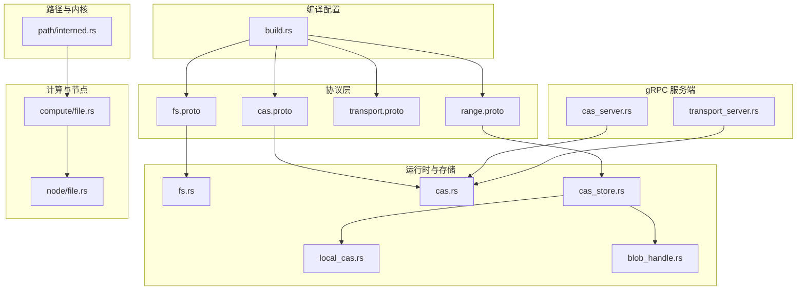

**图示来源**
- [zako_core/src/protobuf/fs.proto](file://zako_core/src/protobuf/fs.proto#L1-L18)
- [zako_core/src/protobuf/cas.proto](file://zako_core/src/protobuf/cas.proto)
- [zako_core/src/protobuf/transport.proto](file://zako_core/src/protobuf/transport.proto)
- [zako_core/src/protobuf/range.proto](file://zako_core/src/protobuf/range.proto)
- [zako_core/build.rs](file://zako_core/build.rs#L1-L17)
- [zako_core/src/fs.rs](file://zako_core/src/fs.rs#L1-L115)
- [zako_core/src/cas.rs](file://zako_core/src/cas.rs#L1-L63)
- [zako_core/src/local_cas.rs](file://zako_core/src/local_cas.rs#L1-L213)
- [zako_core/src/cas_store.rs](file://zako_core/src/cas_store.rs#L1-L156)
- [zako_core/src/blob_handle.rs](file://zako_core/src/blob_handle.rs#L1-L95)
- [zako_core/src/compute/file.rs](file://zako_core/src/compute/file.rs#L1-L131)
- [zako_core/src/node/file.rs](file://zako_core/src/node/file.rs#L1-L28)
- [zako_core/src/cas_server.rs](file://zako_core/src/cas_server.rs#L1-L149)
- [zako_core/src/transport_server.rs](file://zako_core/src/transport_server.rs#L1-L42)
- [zako_core/src/path/interned.rs](file://zako_core/src/path/interned.rs#L1-L39)

**章节来源**
- [zako_core/build.rs](file://zako_core/build.rs#L1-L17)

## 核心组件
- 内容寻址存储（CAS）接口与错误模型：定义统一的 store/check/fetch/get_local_path 等能力，并通过错误类型表达“未找到”“索引越界”等语义。
- 本地 CAS 实现：基于文件系统分片目录存放数据，支持 mmap 与小文件内存哈希，提供输入文件的去重与硬链接复用。
- CAS 存储聚合器：优先内存缓存，其次本地 CAS，最后远程 CAS；支持批量协商缺失 blob 的流式响应。
- 文件句柄与范围读取：BlobHandle 抽象内容寻址与状态（引用/内联），配合 BlobRange 支持偏移与长度的范围读取。
- 文件系统项抽象：VirtualFsItem 描述相对路径、内容（文件/符号链接/空目录）、可执行与只读标记，并在构造时进行安全校验。
- gRPC 服务端：CAS 服务用于协商缺失 blob 与返回传输细节；传输服务用于下载数据流。

**章节来源**
- [zako_core/src/cas.rs](file://zako_core/src/cas.rs#L1-L63)
- [zako_core/src/local_cas.rs](file://zako_core/src/local_cas.rs#L1-L213)
- [zako_core/src/cas_store.rs](file://zako_core/src/cas_store.rs#L1-L156)
- [zako_core/src/blob_handle.rs](file://zako_core/src/blob_handle.rs#L1-L95)
- [zako_core/src/fs.rs](file://zako_core/src/fs.rs#L1-L115)
- [zako_core/src/cas_server.rs](file://zako_core/src/cas_server.rs#L1-L149)
- [zako_core/src/transport_server.rs](file://zako_core/src/transport_server.rs#L1-L42)

## 架构总览
文件系统服务以 CAS 为核心，结合 gRPC 提供：
- 协商缺失 blob 的流式 RPC
- 下载指定 digest 与范围的数据流
- 本地/远程 CAS 的透明访问与缓存

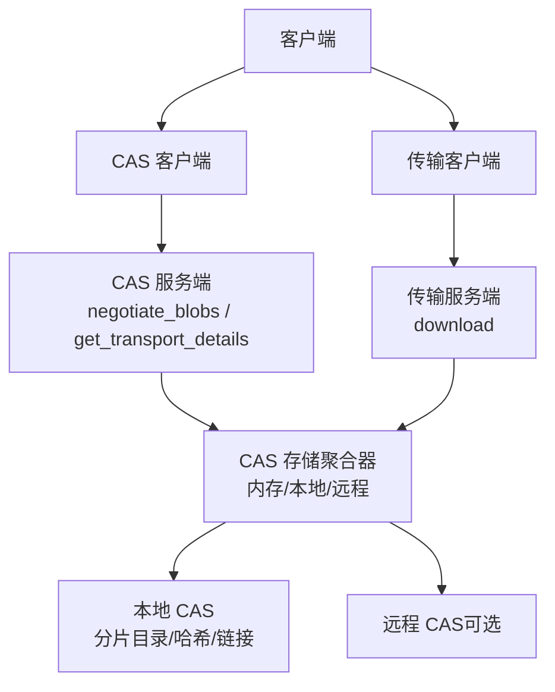

**图示来源**
- [zako_core/src/cas_server.rs](file://zako_core/src/cas_server.rs#L59-L149)
- [zako_core/src/transport_server.rs](file://zako_core/src/transport_server.rs#L24-L42)
- [zako_core/src/cas_store.rs](file://zako_core/src/cas_store.rs#L35-L156)
- [zako_core/src/local_cas.rs](file://zako_core/src/local_cas.rs#L105-L213)

## 详细组件分析

### 协议与数据模型
- VirtualFsItem：描述单个文件系统条目，包含相对路径、内容（文件/符号链接/空目录）、可执行与只读标志。该消息由 fs.proto 定义，用于在 gRPC 中传输虚拟文件系统快照或变更。
- CAS 与传输协议：cas.proto、transport.proto、range.proto 定义了协商、传输与范围请求的结构化消息。

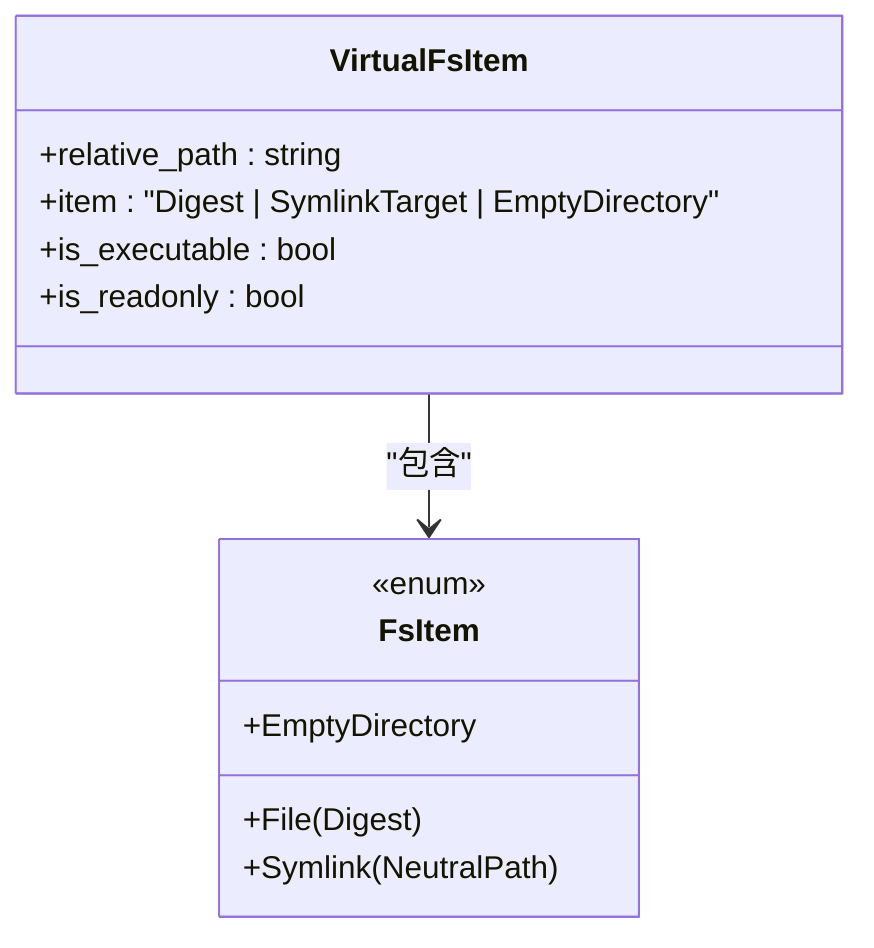

**图示来源**
- [zako_core/src/protobuf/fs.proto](file://zako_core/src/protobuf/fs.proto#L7-L18)
- [zako_core/src/fs.rs](file://zako_core/src/fs.rs#L6-L19)

**章节来源**
- [zako_core/src/protobuf/fs.proto](file://zako_core/src/protobuf/fs.proto#L1-L18)
- [zako_core/src/fs.rs](file://zako_core/src/fs.rs#L1-L115)

### CAS 接口与错误模型
- 接口职责：存储、存在性检查、按范围读取、本地路径查询。
- 错误模型：IO 错误、未找到、内部存储错误、请求索引越界等。

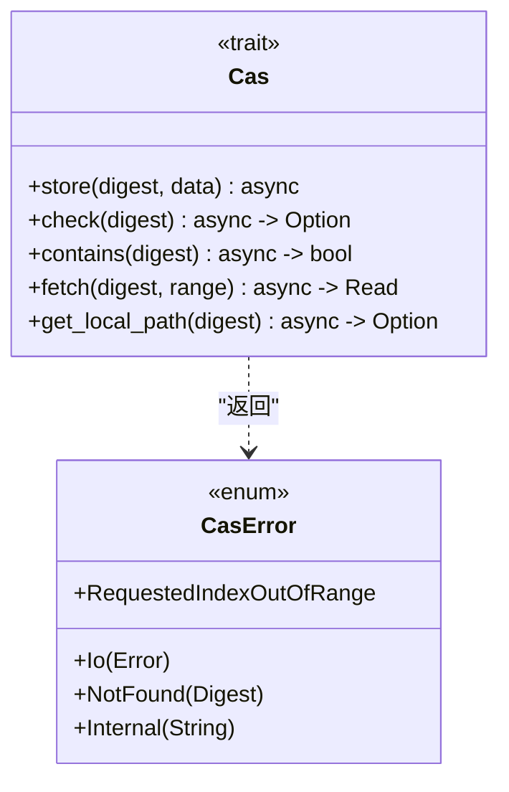

**图示来源**
- [zako_core/src/cas.rs](file://zako_core/src/cas.rs#L9-L63)

**章节来源**
- [zako_core/src/cas.rs](file://zako_core/src/cas.rs#L1-L63)

### 本地 CAS 实现
- 分片目录：根据哈希前缀组织文件，避免单目录过大。
- 哈希策略：大文件使用 mmap，小文件直接读取；符号链接单独处理其目标字符串。
- 去重与链接：若目标已存在则更新时间戳；否则创建硬链接或复制到目标位置。
- 范围读取：支持 seek 到起始偏移并限制长度，越界时返回错误。

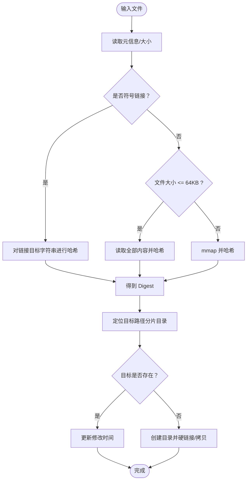

**图示来源**
- [zako_core/src/local_cas.rs](file://zako_core/src/local_cas.rs#L31-L102)

**章节来源**
- [zako_core/src/local_cas.rs](file://zako_core/src/local_cas.rs#L1-L213)

### CAS 存储聚合器与缓存
- 优先级：内存缓存命中则直接返回字节切片；否则回退到本地 CAS；再否则尝试远程 CAS。
- 范围读取：先做内存缓存的边界校验，再进行本地/远程读取；越界返回错误。
- 内联写入：小于阈值的字节会同时写入内存缓存与本地 CAS，并可选写入远程 CAS。

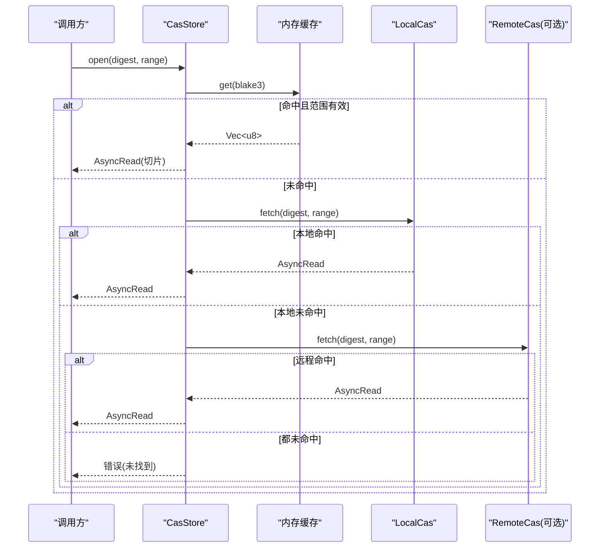

**图示来源**
- [zako_core/src/cas_store.rs](file://zako_core/src/cas_store.rs#L59-L108)
- [zako_core/src/local_cas.rs](file://zako_core/src/local_cas.rs#L163-L201)

**章节来源**
- [zako_core/src/cas_store.rs](file://zako_core/src/cas_store.rs#L1-L156)

### 文件句柄与范围读取
- BlobHandle：持有 Digest 与状态（引用/内联），提供 open/read 两种读取方式。
- BlobRange：描述起始偏移与长度，支持半开区间与尾部截断。

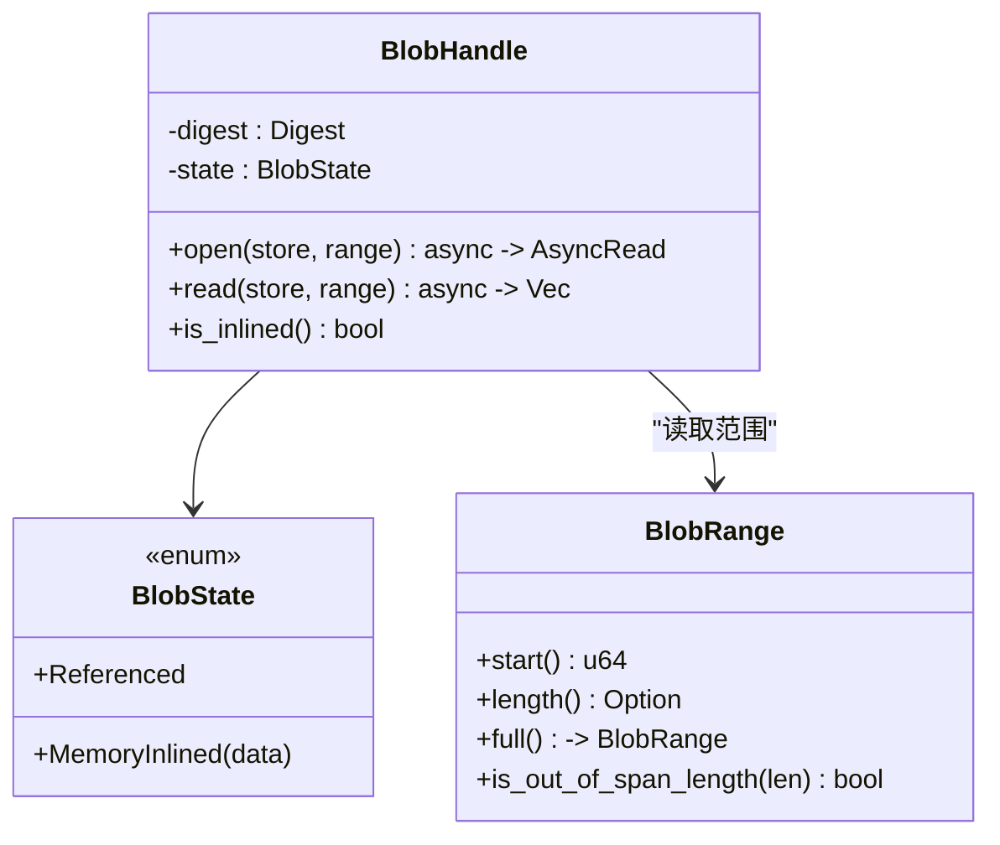

**图示来源**
- [zako_core/src/blob_handle.rs](file://zako_core/src/blob_handle.rs#L7-L95)
- [zako_core/src/cas_store.rs](file://zako_core/src/cas_store.rs#L1-L156)

**章节来源**
- [zako_core/src/blob_handle.rs](file://zako_core/src/blob_handle.rs#L1-L95)
- [zako_core/src/cas_store.rs](file://zako_core/src/cas_store.rs#L1-L156)

### 文件系统项与安全校验
- VirtualFsItem.new 在构造时对符号链接目标进行安全校验，禁止访问父目录“..”越界与绝对路径。
- VirtualFsItem.try_from 将 Protobuf 消息转换为运行时对象，同时进行 Digest 解析与路径解析。

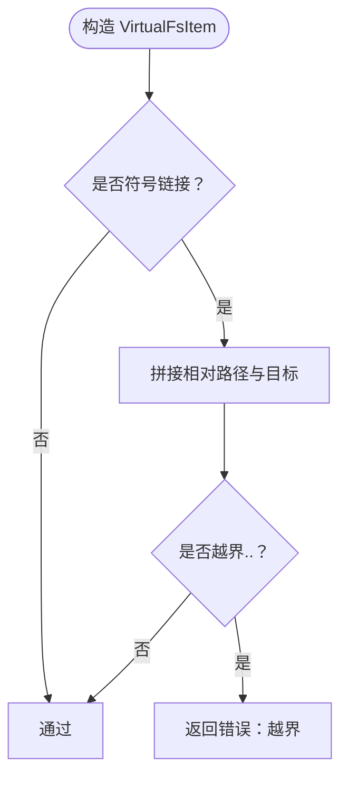

**图示来源**
- [zako_core/src/fs.rs](file://zako_core/src/fs.rs#L50-L70)

**章节来源**
- [zako_core/src/fs.rs](file://zako_core/src/fs.rs#L1-L115)

### gRPC 服务端：CAS 与传输
- CAS 服务：negotiate_blobs 使用流式请求/响应，批量检查缺失 blob；get_transport_details 返回传输地址、令牌与并发建议。
- 传输服务：download 接收包含 digest 与 range 的元数据，返回数据流。

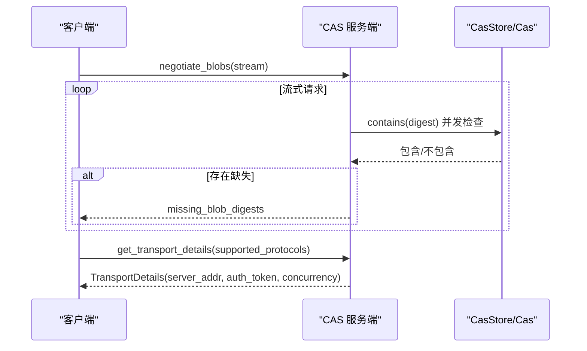

**图示来源**
- [zako_core/src/cas_server.rs](file://zako_core/src/cas_server.rs#L64-L147)

**章节来源**
- [zako_core/src/cas_server.rs](file://zako_core/src/cas_server.rs#L1-L149)
- [zako_core/src/transport_server.rs](file://zako_core/src/transport_server.rs#L24-L42)

### 计算与节点：文件读取与结果
- compute/file.rs：从物理文件读取内容，计算 Digest，识别可执行与符号链接，返回 FileResult。
- node/file.rs：定义 File 与 FileResult 的序列化结构，便于在计算图中传递。

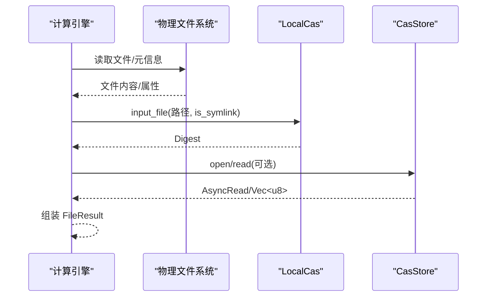

**图示来源**
- [zako_core/src/compute/file.rs](file://zako_core/src/compute/file.rs#L20-L70)
- [zako_core/src/node/file.rs](file://zako_core/src/node/file.rs#L6-L27)

**章节来源**
- [zako_core/src/compute/file.rs](file://zako_core/src/compute/file.rs#L1-L131)
- [zako_core/src/node/file.rs](file://zako_core/src/node/file.rs#L1-L28)

## 依赖关系分析
- 编译期：build.rs 使用 tonic_prost_build 配置 extern_path 映射 digest.proto，确保生成的 Rust 类型与 zako_digest::protobuf 对齐。
- 运行时：fs.rs 依赖 path::NeutralPath 与 protobuf::fs::VirtualFsItem；cas_store.rs 依赖 moka 缓存；local_cas.rs 依赖 memmap2 与 tokio io；cas_server.rs 依赖 dashmap、futures、uuid。

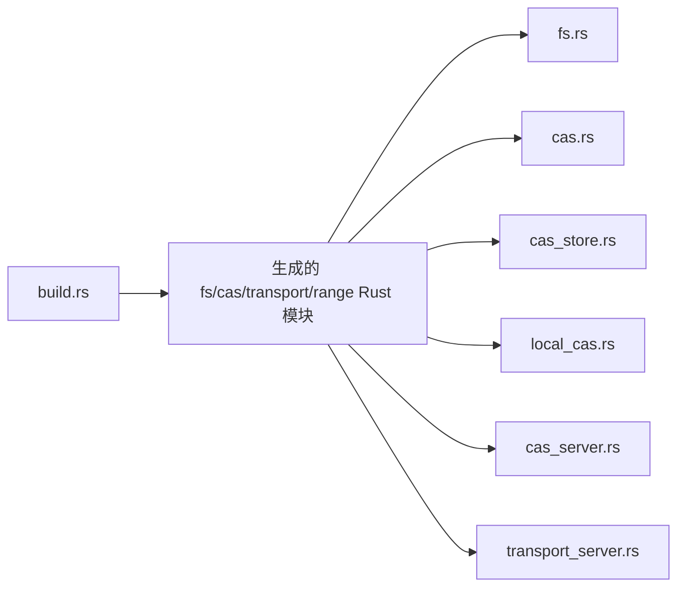

**图示来源**
- [zako_core/build.rs](file://zako_core/build.rs#L3-L15)

**章节来源**
- [zako_core/build.rs](file://zako_core/build.rs#L1-L17)

## 性能考量
- 内存缓存：CasStore 在命中时直接返回内存切片，避免 IO；阈值可根据业务调整。
- 并发协商：CAS 服务端使用 buffer_unordered 并发检查缺失 blob，提升吞吐。
- 本地优先：优先本地 CAS，减少网络往返；远程 CAS 作为后备。
- 大文件优化：本地 CAS 使用 mmap 降低内存占用；小文件直接读取并可内联缓存。
- 范围读取：仅读取所需片段，避免整文件传输。

[本节为通用性能建议，无需特定文件来源]

## 故障排查指南
- 未找到（NotFound）：确认 digest 是否正确、范围是否越界、本地/远程 CAS 是否可用。
- 索引越界（RequestedIndexOutOfRange）：检查 BlobRange 的起始与长度，确保不超过文件实际长度。
- IO 错误（Io）：检查磁盘空间、权限与路径有效性。
- 协商无可用协议：确保客户端支持 gRPC 传输协议并在 get_transport_details 中正确声明。
- 符号链接越界：确保符号链接目标不包含“..”导致越出相对路径作用域。

**章节来源**
- [zako_core/src/cas.rs](file://zako_core/src/cas.rs#L46-L63)
- [zako_core/src/local_cas.rs](file://zako_core/src/local_cas.rs#L182-L188)
- [zako_core/src/cas_server.rs](file://zako_core/src/cas_server.rs#L122-L137)

## 结论
本文件系统服务通过 CAS 抽象与 gRPC 接口，提供了高效、可扩展、安全的文件访问能力。结合内存缓存、范围读取与并发协商，适合构建工具场景下的大规模文件处理。通过 VirtualFsItem 与安全校验，确保路径与符号链接的合规性；通过 CAS 存储聚合器与本地/远程双栈，兼顾性能与可靠性。

[本节为总结，无需特定文件来源]

## 附录

### API 一览（概念说明）
- 协商缺失 blob（流式）：客户端发送多个 digest，服务端并发检查并返回缺失列表。
- 获取传输详情：客户端声明支持的传输协议，服务端返回服务器地址、认证令牌与推荐并发。
- 下载数据流：客户端提交 digest 与范围元数据，服务端返回数据流。
- 写入与去重：客户端将数据写入本地 CAS，自动去重并可选同步至远程 CAS。

[本节为概念说明，无需特定文件来源]

### 客户端集成要点
- 先 negotiate_blobs，收集缺失列表后再上传。
- 使用 BlobRange 精准请求数据片段，减少带宽与延迟。
- 采用并发与背压策略，结合推荐并发参数平衡吞吐与资源占用。
- 对符号链接与路径进行预校验，避免越界与绝对路径问题。

[本节为通用实践建议，无需特定文件来源]