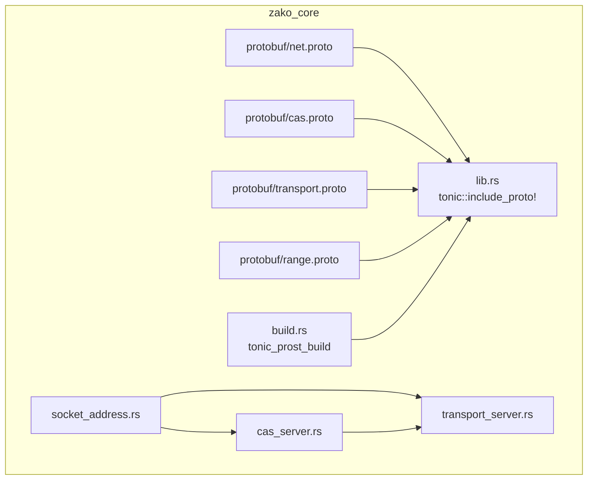
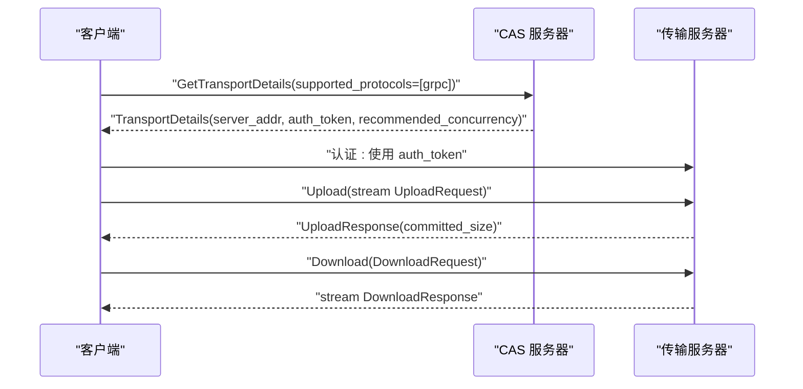
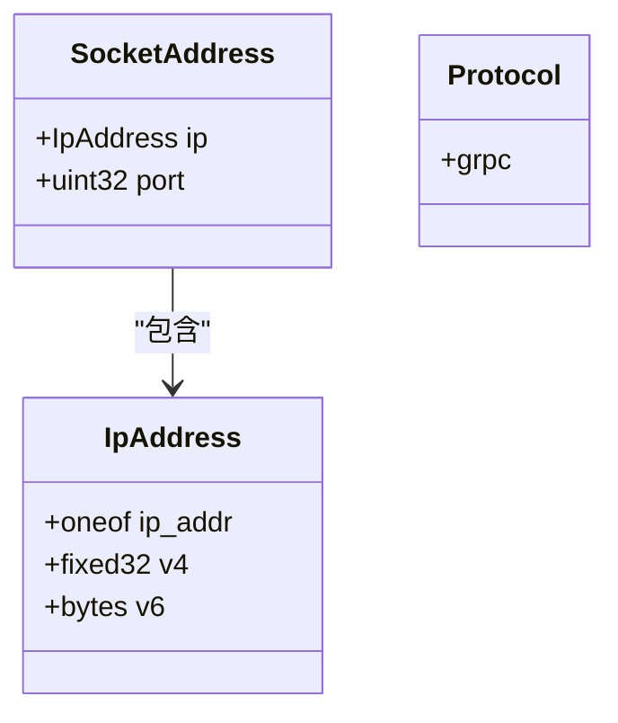
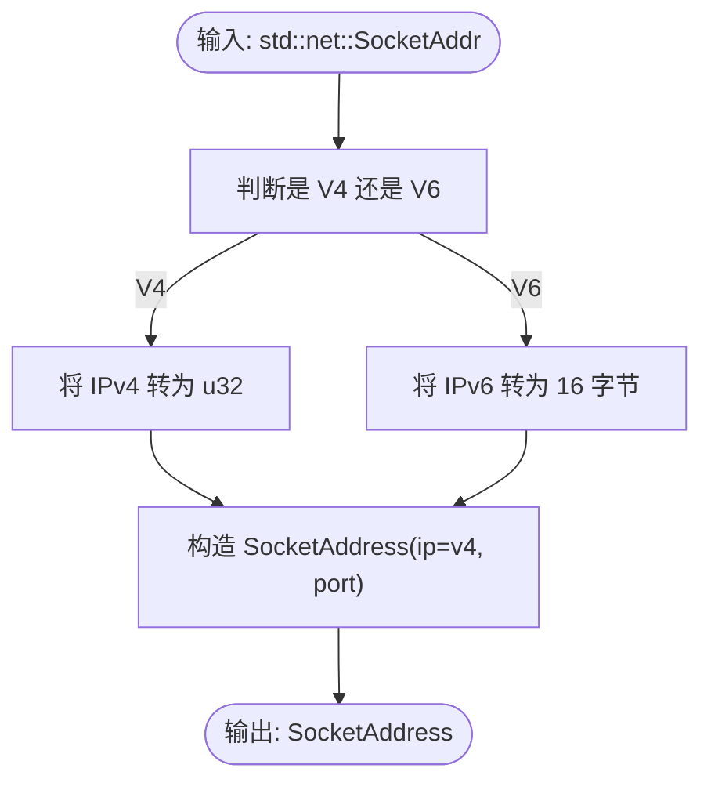
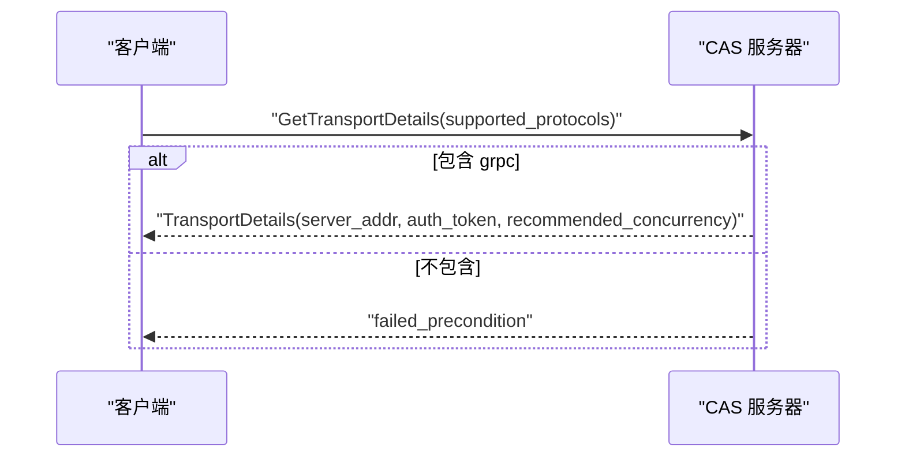
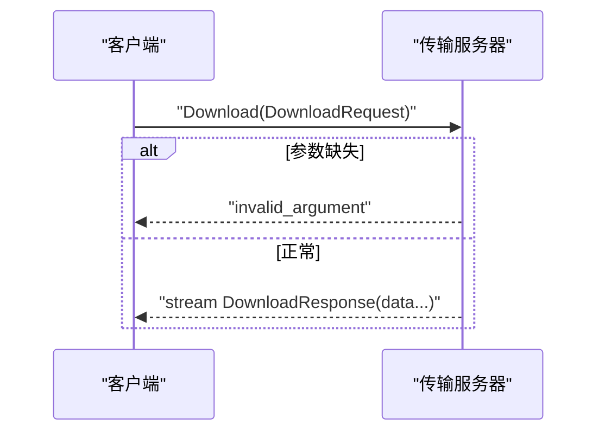
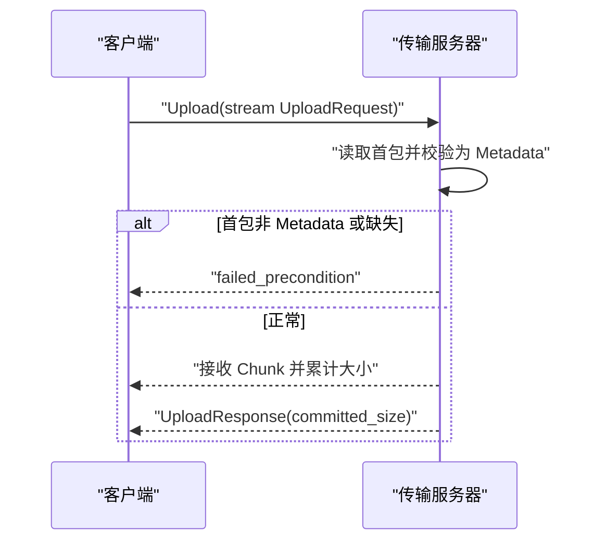
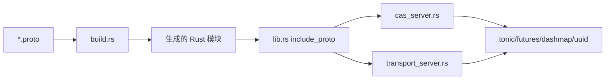

# 网络服务

<cite>
**本文引用的文件**
- [zako_core/src/protobuf/net.proto](file://zako_core/src/protobuf/net.proto)
- [zako_core/src/protobuf/cas.proto](file://zako_core/src/protobuf/cas.proto)
- [zako_core/src/protobuf/transport.proto](file://zako_core/src/protobuf/transport.proto)
- [zako_core/src/protobuf/range.proto](file://zako_core/src/protobuf/range.proto)
- [zako_core/src/socket_address.rs](file://zako_core/src/socket_address.rs)
- [zako_core/src/cas_server.rs](file://zako_core/src/cas_server.rs)
- [zako_core/src/transport_server.rs](file://zako_core/src/transport_server.rs)
- [zako_core/src/lib.rs](file://zako_core/src/lib.rs)
- [zako_core/build.rs](file://zako_core/build.rs)
- [Cargo.toml](file://Cargo.toml)
</cite>

## 目录
1. [简介](#简介)
2. [项目结构](#项目结构)
3. [核心组件](#核心组件)
4. [架构总览](#架构总览)
5. [详细组件分析](#详细组件分析)
6. [依赖关系分析](#依赖关系分析)
7. [性能考虑](#性能考虑)
8. [故障排查指南](#故障排查指南)
9. [结论](#结论)
10. [附录](#附录)

## 简介
本文件面向网络层集成与分布式系统架构师，系统化梳理 zako 的网络服务能力，重点覆盖以下方面：
- gRPC 接口与数据模型：SocketAddress、Protocol 枚举、传输协议与地址格式规范
- 连接管理与协商：CAS 传输细节获取、认证令牌发放、并发建议
- 传输服务：基于 gRPC 的上传/下载流式传输
- 分布式角色：在构建系统的 CAS（内容寻址存储）子系统中的网络职责
- 集成示例、故障转移与性能调优、安全与监控最佳实践

## 项目结构
网络服务相关代码主要位于 zako_core 模块，通过 .proto 定义生成 gRPC 服务与消息类型，并由 Rust 实现对应的服务器端逻辑。

图表来源
- [zako_core/src/lib.rs](file://zako_core/src/lib.rs#L98-L118)
- [zako_core/build.rs](file://zako_core/build.rs#L1-L17)
- [zako_core/src/protobuf/net.proto](file://zako_core/src/protobuf/net.proto#L1-L20)
- [zako_core/src/protobuf/cas.proto](file://zako_core/src/protobuf/cas.proto#L1-L32)
- [zako_core/src/protobuf/transport.proto](file://zako_core/src/protobuf/transport.proto#L1-L38)
- [zako_core/src/protobuf/range.proto](file://zako_core/src/protobuf/range.proto#L1-L9)
- [zako_core/src/socket_address.rs](file://zako_core/src/socket_address.rs#L1-L27)
- [zako_core/src/cas_server.rs](file://zako_core/src/cas_server.rs#L1-L149)
- [zako_core/src/transport_server.rs](file://zako_core/src/transport_server.rs#L1-L138)

章节来源
- [zako_core/src/lib.rs](file://zako_core/src/lib.rs#L98-L118)
- [zako_core/build.rs](file://zako_core/build.rs#L1-L17)

## 核心组件
- 协议与地址模型
  - IpAddress：支持 IPv4（fixed32）与 IPv6（bytes）两种地址形式
  - SocketAddress：封装 IpAddress 与端口
  - Protocol：当前仅支持 grpc
- 传输服务
  - ContentAddressableStorage（CAS）：提供 negotiate_blobs（流式协商缺失 blob）、get_transport_details（获取传输详情）
  - Transport：提供 download（流式下载）、upload（流式上传）

章节来源
- [zako_core/src/protobuf/net.proto](file://zako_core/src/protobuf/net.proto#L1-L20)
- [zako_core/src/protobuf/cas.proto](file://zako_core/src/protobuf/cas.proto#L1-L32)
- [zako_core/src/protobuf/transport.proto](file://zako_core/src/protobuf/transport.proto#L1-L38)

## 架构总览
下图展示客户端与服务器之间的交互流程，涵盖协议协商、认证令牌获取与数据传输阶段。

图表来源
- [zako_core/src/protobuf/cas.proto](file://zako_core/src/protobuf/cas.proto#L16-L26)
- [zako_core/src/protobuf/transport.proto](file://zako_core/src/protobuf/transport.proto#L14-L31)
- [zako_core/src/cas_server.rs](file://zako_core/src/cas_server.rs#L114-L147)
- [zako_core/src/transport_server.rs](file://zako_core/src/transport_server.rs#L70-L136)

## 详细组件分析

### 数据模型与地址格式
- IpAddress
  - v4：固定 32 位无符号整数
  - v6：16 字节字节数组
- SocketAddress
  - ip：IpAddress
  - port：无符号 32 位整数
- Protocol
  - grpc：当前唯一受支持协议

图表来源
- [zako_core/src/protobuf/net.proto](file://zako_core/src/protobuf/net.proto#L5-L15)

章节来源
- [zako_core/src/protobuf/net.proto](file://zako_core/src/protobuf/net.proto#L1-L20)

### 地址转换实现
- 将标准库 SocketAddr 转换为 SocketAddress：
  - IPv4：将地址转为 u32
  - IPv6：将地址转为 16 字节数组
- 保持端口为 u32

图表来源
- [zako_core/src/socket_address.rs](file://zako_core/src/socket_address.rs#L5-L26)

章节来源
- [zako_core/src/socket_address.rs](file://zako_core/src/socket_address.rs#L1-L27)

### 协议协商与传输详情
- 支持的协议列表必须包含 grpc，否则返回失败
- 成功后生成一次性认证令牌并返回：
  - server_addr：服务器监听地址
  - auth_token：用于后续传输请求的身份标识
  - recommended_concurrency：建议并发度

图表来源
- [zako_core/src/protobuf/cas.proto](file://zako_core/src/protobuf/cas.proto#L16-L26)
- [zako_core/src/cas_server.rs](file://zako_core/src/cas_server.rs#L114-L147)

章节来源
- [zako_core/src/cas_server.rs](file://zako_core/src/cas_server.rs#L114-L147)

### 传输服务：下载
- 请求参数：包含 Digest 与 BlobRange
- 响应：流式 DownloadResponse.data
- 错误处理：
  - 缺少必需字段：invalid_argument
  - 未找到：not_found
  - IO/内部错误：internal
  - 范围越界：invalid_argument

图表来源
- [zako_core/src/protobuf/transport.proto](file://zako_core/src/protobuf/transport.proto#L14-L20)
- [zako_core/src/transport_server.rs](file://zako_core/src/transport_server.rs#L28-L68)

章节来源
- [zako_core/src/transport_server.rs](file://zako_core/src/transport_server.rs#L28-L68)

### 传输服务：上传
- 流式上传，首包必须为 Metadata（包含 Digest 与 BlobRange），随后为 Chunk 数据
- 重复上传已存在的 Digest 将返回 already_exists
- 返回 committed_size 表示成功写入的总字节数

图表来源
- [zako_core/src/protobuf/transport.proto](file://zako_core/src/protobuf/transport.proto#L22-L31)
- [zako_core/src/transport_server.rs](file://zako_core/src/transport_server.rs#L70-L136)

章节来源
- [zako_core/src/transport_server.rs](file://zako_core/src/transport_server.rs#L70-L136)

### 服务器实现要点
- CasServerOptions
  - cas：内容寻址存储实例
  - server_address：对外暴露的 SocketAddress
  - buffered_io_count/recommended_concurrency：默认基于 CPU 数量
- Token 管理：使用 DashMap 存储一次性令牌，用于传输阶段的身份识别
- NegotiateBlobs：对传入的 Digest 列表进行并行检查，返回缺失集合

章节来源
- [zako_core/src/cas_server.rs](file://zako_core/src/cas_server.rs#L15-L56)
- [zako_core/src/cas_server.rs](file://zako_core/src/cas_server.rs#L64-L112)

## 依赖关系分析
- 生成与编译
  - build.rs 使用 tonic_prost_build 将多个 .proto 编译为 Rust 模块
  - lib.rs 通过 include_proto 将生成模块暴露给上层
- 外部依赖
  - gRPC/ProtoBuf：tonic、prost
  - 并发与流：tokio、tokio-stream、futures
  - 并行控制：async-stream、rayon（通过依赖传递）
  - 并发容器：dashmap
  - UUID：uuid

图表来源
- [zako_core/build.rs](file://zako_core/build.rs#L4-L15)
- [zako_core/src/lib.rs](file://zako_core/src/lib.rs#L98-L118)
- [Cargo.toml](file://Cargo.toml#L209-L230)

章节来源
- [zako_core/build.rs](file://zako_core/build.rs#L1-L17)
- [zako_core/src/lib.rs](file://zako_core/src/lib.rs#L98-L118)
- [Cargo.toml](file://Cargo.toml#L209-L230)

## 性能考虑
- 并发与缓冲
  - recommended_concurrency：建议客户端按此并发度发起请求
  - buffered_io_count：在协商阶段对 Digest 检查采用无序缓冲并行，提升吞吐
- 流式传输
  - 下载使用 ReaderStream 输出分片；上传使用 StreamReader 消费分片
- 资源占用
  - 服务器默认基于 CPU 数量设置并发与缓冲，适合通用场景
- 调优建议
  - 根据网络带宽与磁盘 IO 调整 recommended_concurrency
  - 对大文件上传可增大 Chunk 大小以减少握手开销
  - 在高延迟网络中适当增加超时与重试策略

## 故障排查指南
- 协商阶段
  - 现象：GetTransportDetails 返回 failed_precondition
  - 可能原因：supported_protocols 中不含 grpc
  - 处理：确保客户端声明支持 grpc
- 传输阶段
  - 现象：Upload 首包报 failed_precondition
  - 可能原因：首包非 Metadata 或缺失
  - 处理：确保首包携带正确的 BlobResource 元信息
  - 现象：Download 报 not_found
  - 可能原因：请求的 Digest 不存在
  - 处理：先通过 negotiate_blobs 确认缺失再上传
- 内部错误
  - 现象：internal 错误
  - 可能原因：IO 或内部异常
  - 处理：检查日志与磁盘空间、权限；必要时重启服务

章节来源
- [zako_core/src/cas_server.rs](file://zako_core/src/cas_server.rs#L120-L137)
- [zako_core/src/transport_server.rs](file://zako_core/src/transport_server.rs#L76-L91)
- [zako_core/src/transport_server.rs](file://zako_core/src/transport_server.rs#L51-L58)

## 结论
本网络服务以 gRPC 为核心，围绕 CAS 提供协议协商、认证令牌与流式上传/下载能力。通过清晰的数据模型与严格的错误语义，为分布式构建系统提供了稳定的内容传输通道。结合推荐并发度与流式处理，可在多样的网络环境中获得良好性能与可靠性。

## 附录

### API 规范速览
- 协议与地址
  - IpAddress：v4=IPv4 地址；v6=IPv6 地址
  - SocketAddress：ip + port
  - Protocol：grpc
- 服务与 RPC
  - ContentAddressableStorage
    - NegotiateBlobs(stream NegotiateBlobsRequest) -> stream NegotiateBlobsResponse
    - GetTransportDetails(GetTransportDetailsRequest) -> TransportDetails
  - Transport
    - Download(DownloadRequest) -> stream DownloadResponse
    - Upload(stream UploadRequest) -> UploadResponse

章节来源
- [zako_core/src/protobuf/net.proto](file://zako_core/src/protobuf/net.proto#L1-L20)
- [zako_core/src/protobuf/cas.proto](file://zako_core/src/protobuf/cas.proto#L28-L31)
- [zako_core/src/protobuf/transport.proto](file://zako_core/src/protobuf/transport.proto#L33-L37)

### 集成示例（步骤说明）
- 协商与获取传输详情
  - 客户端向 CAS 发送 GetTransportDetails，声明支持 grpc
  - 服务器返回 server_addr、auth_token、recommended_concurrency
- 传输阶段
  - 客户端携带 auth_token 访问传输服务器
  - 上传：首包 Metadata，随后发送 Chunk
  - 下载：指定 Digest 与范围，接收流式数据

章节来源
- [zako_core/src/cas_server.rs](file://zako_core/src/cas_server.rs#L114-L147)
- [zako_core/src/transport_server.rs](file://zako_core/src/transport_server.rs#L70-L136)

### 安全与监控最佳实践
- 安全
  - 传输建议在 TLS 保护的 gRPC 通道上运行
  - 使用短期有效的 auth_token，避免泄露
  - 限制 server_addr 的可达性，仅暴露必要的网络接口
- 防火墙
  - 开放 CAS 与传输服务端口；限制来源 IP
  - 对外网暴露时启用代理与速率限制
- 监控
  - 记录上传/下载吞吐、并发度、错误码分布
  - 关注 not_found、already_exists、internal 等错误趋势
  - 结合 OpenTelemetry 进行链路追踪与指标采集