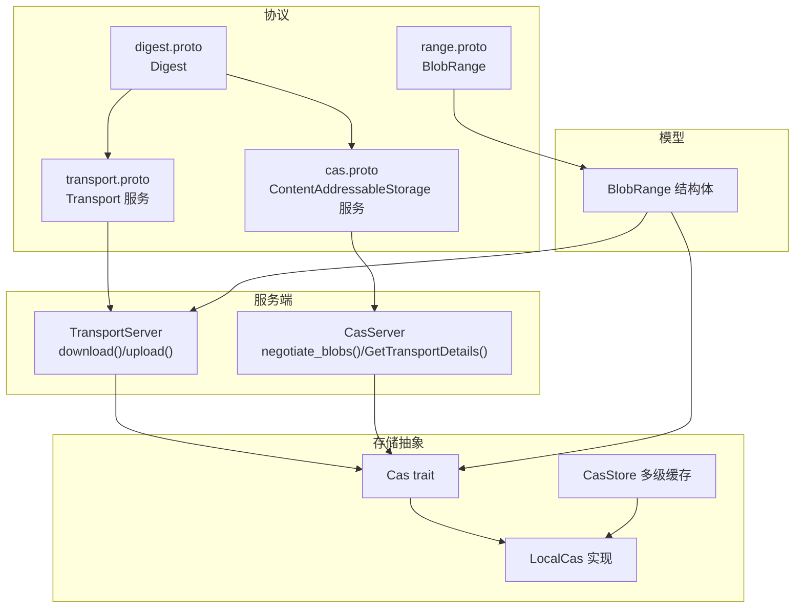
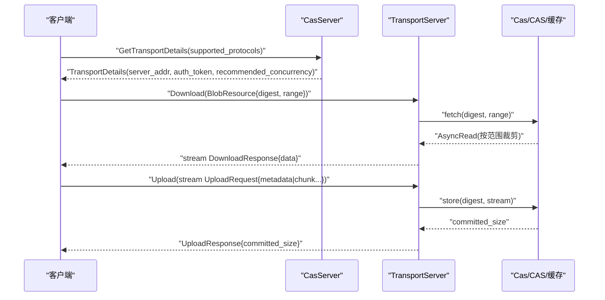
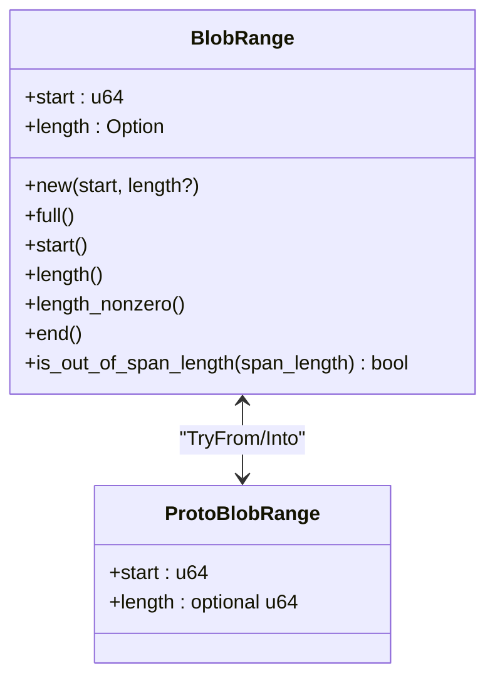
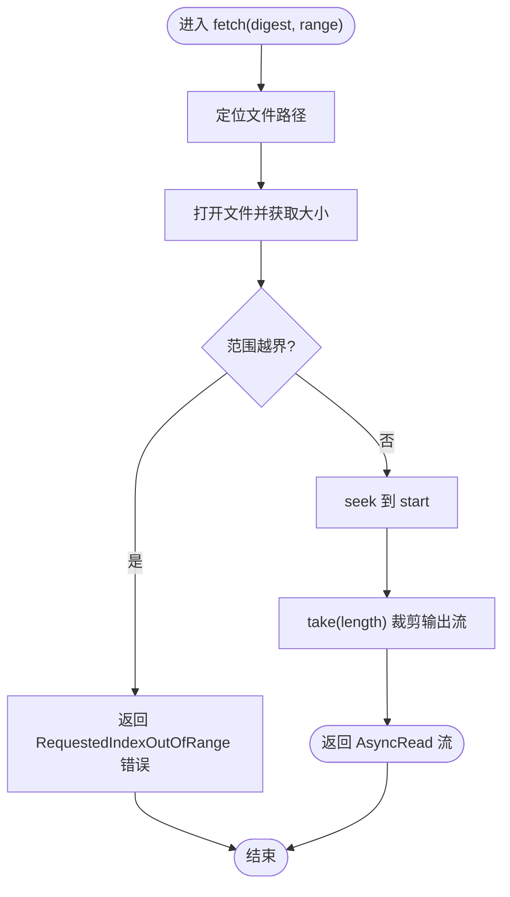
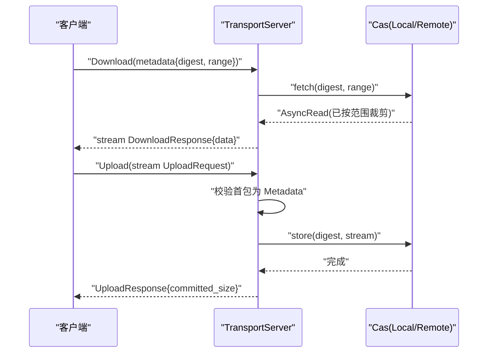
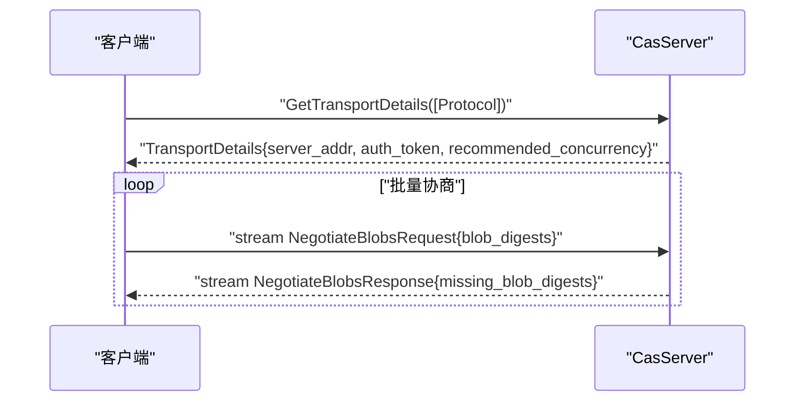
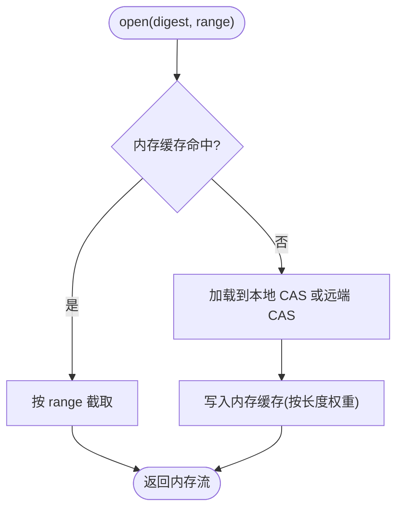
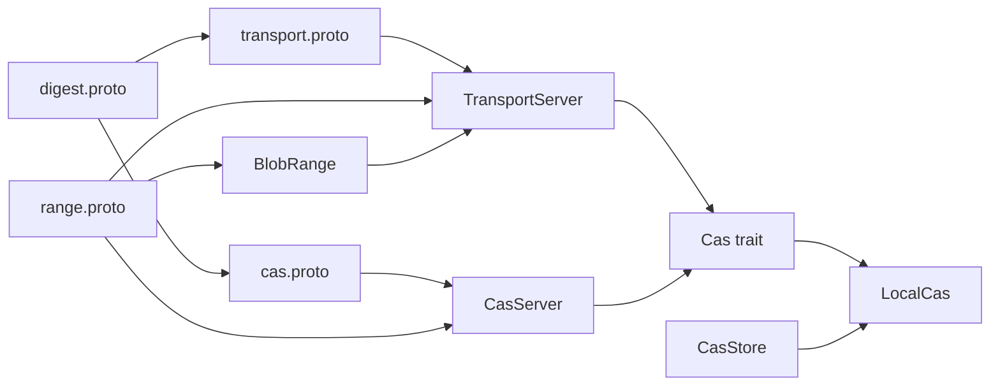

# 范围服务

<cite>
**本文引用的文件**
- [zako_core/src/blob_range.rs](file://zako_core/src/blob_range.rs)
- [zako_core/src/protobuf/range.proto](file://zako_core/src/protobuf/range.proto)
- [zako_core/src/cas.rs](file://zako_core/src/cas.rs)
- [zako_core/src/local_cas.rs](file://zako_core/src/local_cas.rs)
- [zako_core/src/protobuf/transport.proto](file://zako_core/src/protobuf/transport.proto)
- [zako_core/src/transport_server.rs](file://zako_core/src/transport_server.rs)
- [zako_core/src/protobuf/cas.proto](file://zako_core/src/protobuf/cas.proto)
- [zako_core/src/cas_server.rs](file://zako_core/src/cas_server.rs)
- [zako_core/src/cas_store.rs](file://zako_core/src/cas_store.rs)
- [zako_digest/src/protobuf/digest.proto](file://zako_digest/src/protobuf/digest.proto)
- [zako_core/src/tests/blob_range_tests.rs](file://zako_core/src/tests/blob_range_tests.rs)
- [zako_core/src/resource/heuristics/mod.rs](file://zako_core/src/resource/heuristics/mod.rs)
</cite>

## 目录
1. [简介](#简介)
2. [项目结构](#项目结构)
3. [核心组件](#核心组件)
4. [架构总览](#架构总览)
5. [详细组件分析](#详细组件分析)
6. [依赖关系分析](#依赖关系分析)
7. [性能与优化](#性能与优化)
8. [故障排查指南](#故障排查指南)
9. [结论](#结论)
10. [附录](#附录)

## 简介
本文件面向需要实现高效数据传输与存储系统的开发者，系统化梳理“范围服务”的设计与实现，覆盖以下要点：
- 范围查询与数据切片：BlobRange 定义、范围解析与边界校验、部分数据传输。
- gRPC 接口：Transport 与 ContentAddressableStorage 服务的 RPC 方法、请求/响应结构与流式语义。
- 偏移量与分块机制：起始偏移、长度与结束偏移的计算，以及基于范围的读取与裁剪。
- 性能优化：缓存命中率提升、并发下载优化、网络带宽利用策略。
- 客户端实践：并发下载、断点续传、大数据集处理、内存管理与错误恢复。

## 项目结构
围绕范围服务的关键模块与协议如下：
- 协议层
  - 范围消息：zako_core/src/protobuf/range.proto
  - 传输服务：zako_core/src/protobuf/transport.proto
  - CAS 服务：zako_core/src/protobuf/cas.proto
  - 摘要消息：zako_digest/src/protobuf/digest.proto
- 业务与实现
  - 范围模型：zako_core/src/blob_range.rs
  - CAS 抽象与本地实现：zako_core/src/cas.rs、zako_core/src/local_cas.rs
  - 传输服务端：zako_core/src/transport_server.rs
  - CAS 服务端：zako_core/src/cas_server.rs
  - 内存缓存与多级存储：zako_core/src/cas_store.rs
  - 资源启发式配置：zako_core/src/resource/heuristics/mod.rs
  - 测试：zako_core/src/tests/blob_range_tests.rs

图表来源
- [zako_core/src/protobuf/range.proto](file://zako_core/src/protobuf/range.proto#L1-L9)
- [zako_core/src/protobuf/transport.proto](file://zako_core/src/protobuf/transport.proto#L1-L38)
- [zako_core/src/protobuf/cas.proto](file://zako_core/src/protobuf/cas.proto#L1-L32)
- [zako_digest/src/protobuf/digest.proto](file://zako_digest/src/protobuf/digest.proto#L1-L10)
- [zako_core/src/blob_range.rs](file://zako_core/src/blob_range.rs#L21-L104)
- [zako_core/src/transport_server.rs](file://zako_core/src/transport_server.rs#L24-L137)
- [zako_core/src/cas_server.rs](file://zako_core/src/cas_server.rs#L59-L148)
- [zako_core/src/cas.rs](file://zako_core/src/cas.rs#L10-L44)
- [zako_core/src/local_cas.rs](file://zako_core/src/local_cas.rs#L105-L212)
- [zako_core/src/cas_store.rs](file://zako_core/src/cas_store.rs#L35-L95)

章节来源
- [zako_core/src/protobuf/range.proto](file://zako_core/src/protobuf/range.proto#L1-L9)
- [zako_core/src/protobuf/transport.proto](file://zako_core/src/protobuf/transport.proto#L1-L38)
- [zako_core/src/protobuf/cas.proto](file://zako_core/src/protobuf/cas.proto#L1-L32)
- [zako_digest/src/protobuf/digest.proto](file://zako_digest/src/protobuf/digest.proto#L1-L10)
- [zako_core/src/blob_range.rs](file://zako_core/src/blob_range.rs#L1-L139)
- [zako_core/src/cas.rs](file://zako_core/src/cas.rs#L1-L63)
- [zako_core/src/local_cas.rs](file://zako_core/src/local_cas.rs#L1-L213)
- [zako_core/src/transport_server.rs](file://zako_core/src/transport_server.rs#L1-L138)
- [zako_core/src/cas_server.rs](file://zako_core/src/cas_server.rs#L1-L148)
- [zako_core/src/cas_store.rs](file://zako_core/src/cas_store.rs#L1-L95)
- [zako_core/src/tests/blob_range_tests.rs](file://zako_core/src/tests/blob_range_tests.rs#L1-L42)
- [zako_core/src/resource/heuristics/mod.rs](file://zako_core/src/resource/heuristics/mod.rs#L1-L65)

## 核心组件
- BlobRange：范围模型，支持全量、从某起点开始、指定长度三种形式；提供起始偏移、长度、结束偏移与越界判断。
- Cas trait：统一的 CAS 存储接口，定义 store/check/contains/fetch/get_local_path 等能力。
- LocalCas：本地文件系统实现，按摘要哈希分层目录组织，支持范围读取与本地路径暴露。
- TransportServer：gRPC 传输服务端，提供 Download（流式响应）与 Upload（流式请求）。
- CasServer：gRPC CAS 服务端，提供协商缺失 blob 与传输参数协商。
- CasStore：多级缓存封装，优先内存缓存，其次本地 CAS，必要时回退远端 CAS。

章节来源
- [zako_core/src/blob_range.rs](file://zako_core/src/blob_range.rs#L21-L104)
- [zako_core/src/cas.rs](file://zako_core/src/cas.rs#L10-L44)
- [zako_core/src/local_cas.rs](file://zako_core/src/local_cas.rs#L105-L212)
- [zako_core/src/transport_server.rs](file://zako_core/src/transport_server.rs#L24-L137)
- [zako_core/src/cas_server.rs](file://zako_core/src/cas_server.rs#L59-L148)
- [zako_core/src/cas_store.rs](file://zako_core/src/cas_store.rs#L35-L95)

## 架构总览
范围服务通过 gRPC 将“范围解析 + 部分数据传输”解耦为两层：
- 协商层：ContentAddressableStorage 提供传输参数与缺失 blob 协商。
- 传输层：Transport 提供基于 BlobResource（Digest + BlobRange）的下载/上传流。

图表来源
- [zako_core/src/protobuf/cas.proto](file://zako_core/src/protobuf/cas.proto#L16-L31)
- [zako_core/src/protobuf/transport.proto](file://zako_core/src/protobuf/transport.proto#L14-L37)
- [zako_core/src/cas_server.rs](file://zako_core/src/cas_server.rs#L64-L148)
- [zako_core/src/transport_server.rs](file://zako_core/src/transport_server.rs#L28-L136)
- [zako_core/src/cas.rs](file://zako_core/src/cas.rs#L33-L43)

## 详细组件分析

### BlobRange：范围定义与解析
- 字段与构造
  - start：起始偏移（u64）
  - length：可选非零长度（None 表示“直到末尾”）
  - new(start, length?)：当 length 为 0 时返回错误；None 表示全量范围
  - full()：快捷构造全量范围
- 访问器
  - start()/length()/length_nonzero()/end()：计算结束偏移（若未指定长度则返回 None）
- 边界校验
  - is_out_of_span_length(span_length)：判断范围是否越界
- 类型转换
  - From<RangeFrom<u64>>/From<RangeFull>：支持 100.. 与 .. 的便捷写法
  - TryFrom/Into 与 protobuf::range::BlobRange 互转

图表来源
- [zako_core/src/blob_range.rs](file://zako_core/src/blob_range.rs#L21-L138)
- [zako_core/src/protobuf/range.proto](file://zako_core/src/protobuf/range.proto#L5-L8)

章节来源
- [zako_core/src/blob_range.rs](file://zako_core/src/blob_range.rs#L1-L139)
- [zako_core/src/protobuf/range.proto](file://zako_core/src/protobuf/range.proto#L1-L9)
- [zako_core/src/tests/blob_range_tests.rs](file://zako_core/src/tests/blob_range_tests.rs#L1-L42)

### CAS 抽象与本地实现
- Cas trait
  - store(digest, reader)：写入数据
  - check/contains(digest)：存在性检查（前者返回长度，后者返回布尔）
  - fetch(digest, range)：按范围返回异步读取流
  - get_local_path(digest)：若本地可直达，返回本地路径
- LocalCas
  - 文件布局：按摘要前缀分两级目录，避免单目录过大
  - digest(input, metadata, is_symlink)：大文件使用内存映射，小文件直接读取并哈希
  - fetch：先校验越界，再 seek 到 start 并 take(length) 返回裁剪后的流
  - store：临时文件写入后原子重命名，保证一致性

图表来源
- [zako_core/src/local_cas.rs](file://zako_core/src/local_cas.rs#L163-L201)

章节来源
- [zako_core/src/cas.rs](file://zako_core/src/cas.rs#L1-L63)
- [zako_core/src/local_cas.rs](file://zako_core/src/local_cas.rs#L1-L213)

### 传输服务：Download 与 Upload
- Download
  - 请求：DownloadRequest.metadata = BlobResource{digest, range}
  - 逻辑：调用 cas.fetch(digest, range)，将底层 AsyncRead 包装为 ReaderStream 分片发送
  - 错误映射：NotFound/Io/Internal/RequestedIndexOutOfRange 映射为 gRPC 状态码
- Upload
  - 请求：首包必须为 Metadata（包含 BlobResource），后续为 Chunk 数据
  - 逻辑：校验首包、累计已提交字节数、将流写入 cas.store
  - 错误映射：IO/内部错误映射为 internal，重复存在映射为 already_exists

图表来源
- [zako_core/src/protobuf/transport.proto](file://zako_core/src/protobuf/transport.proto#L14-L37)
- [zako_core/src/transport_server.rs](file://zako_core/src/transport_server.rs#L28-L136)
- [zako_core/src/cas.rs](file://zako_core/src/cas.rs#L33-L43)

章节来源
- [zako_core/src/protobuf/transport.proto](file://zako_core/src/protobuf/transport.proto#L1-L38)
- [zako_core/src/transport_server.rs](file://zako_core/src/transport_server.rs#L1-L138)

### CAS 服务：协商与传输详情
- NegotiateBlobs
  - 输入：流式 NegotiateBlobsRequest（含多个 digest）
  - 输出：流式 NegotiateBlobsResponse（缺失的 digest 列表）
  - 实现要点：并发检查（futures::stream::iter + map），聚合 missing_blobs
- GetTransportDetails
  - 输入：支持的传输协议列表
  - 输出：TransportDetails（服务地址、认证令牌、推荐并发度）
  - 协议选择：当前仅支持 gRPC

图表来源
- [zako_core/src/protobuf/cas.proto](file://zako_core/src/protobuf/cas.proto#L16-L31)
- [zako_core/src/cas_server.rs](file://zako_core/src/cas_server.rs#L64-L148)

章节来源
- [zako_core/src/protobuf/cas.proto](file://zako_core/src/protobuf/cas.proto#L1-L32)
- [zako_core/src/cas_server.rs](file://zako_core/src/cas_server.rs#L1-L148)

### 多级缓存与内存优化
- CasStore
  - 内存缓存：以摘要哈希为键，值为字节向量，支持 TTL/TTI 与容量权重（按长度计）
  - 读路径：命中则按 range.start/length 截取；越界返回 RequestedIndexOutOfRange
  - 回退策略：未命中或越界时回退到 LocalCas 或远端 CAS
- 启发式配置
  - 内存缓存容量：系统总内存的 10%，限制在 4MB~4GB
  - TTL/TTI：默认 30 分钟与 5 分钟
  - 线程栈大小：4MB
  - 本地 CAS 默认路径：平台缓存目录下的 zako/cas

图表来源
- [zako_core/src/cas_store.rs](file://zako_core/src/cas_store.rs#L35-L95)
- [zako_core/src/resource/heuristics/mod.rs](file://zako_core/src/resource/heuristics/mod.rs#L11-L65)

章节来源
- [zako_core/src/cas_store.rs](file://zako_core/src/cas_store.rs#L1-L95)
- [zako_core/src/resource/heuristics/mod.rs](file://zako_core/src/resource/heuristics/mod.rs#L1-L65)

## 依赖关系分析
- 协议依赖
  - transport.proto 依赖 digest.proto 与 range.proto
  - cas.proto 依赖 digest.proto 与 net.proto（未在本仓库中展示）
- 服务依赖
  - TransportServer 依赖 Cas trait 与 BlobRange
  - CasServer 依赖 Digest 与网络地址类型
  - LocalCas 实现 Cas trait，并在 fetch 中使用 BlobRange
  - CasStore 组合 LocalCas 与可选远端 CAS，配合内存缓存

图表来源
- [zako_core/src/protobuf/transport.proto](file://zako_core/src/protobuf/transport.proto#L1-L38)
- [zako_core/src/protobuf/cas.proto](file://zako_core/src/protobuf/cas.proto#L1-L32)
- [zako_core/src/protobuf/range.proto](file://zako_core/src/protobuf/range.proto#L1-L9)
- [zako_digest/src/protobuf/digest.proto](file://zako_digest/src/protobuf/digest.proto#L1-L10)
- [zako_core/src/blob_range.rs](file://zako_core/src/blob_range.rs#L21-L138)
- [zako_core/src/transport_server.rs](file://zako_core/src/transport_server.rs#L24-L137)
- [zako_core/src/cas_server.rs](file://zako_core/src/cas_server.rs#L59-L148)
- [zako_core/src/cas.rs](file://zako_core/src/cas.rs#L10-L44)
- [zako_core/src/local_cas.rs](file://zako_core/src/local_cas.rs#L105-L212)
- [zako_core/src/cas_store.rs](file://zako_core/src/cas_store.rs#L35-L95)

章节来源
- [zako_core/src/protobuf/transport.proto](file://zako_core/src/protobuf/transport.proto#L1-L38)
- [zako_core/src/protobuf/cas.proto](file://zako_core/src/protobuf/cas.proto#L1-L32)
- [zako_core/src/protobuf/range.proto](file://zako_core/src/protobuf/range.proto#L1-L9)
- [zako_digest/src/protobuf/digest.proto](file://zako_digest/src/protobuf/digest.proto#L1-L10)
- [zako_core/src/blob_range.rs](file://zako_core/src/blob_range.rs#L1-L139)
- [zako_core/src/transport_server.rs](file://zako_core/src/transport_server.rs#L1-L138)
- [zako_core/src/cas_server.rs](file://zako_core/src/cas_server.rs#L1-L148)
- [zako_core/src/cas.rs](file://zako_core/src/cas.rs#L1-L63)
- [zako_core/src/local_cas.rs](file://zako_core/src/local_cas.rs#L1-L213)
- [zako_core/src/cas_store.rs](file://zako_core/src/cas_store.rs#L1-L95)

## 性能与优化
- 范围查询优化
  - 使用 NonZeroU64 与 Option<u64> 精确表达“直到末尾”的语义，避免多余长度计算
  - LocalCas 在 fetch 前进行越界检查，提前失败减少无效 IO
- 缓存策略
  - 内存缓存按值长度计重，结合 TTL/TTI 控制生命周期，提升热点命中率
  - 启发式确定缓存容量与线程栈大小，兼顾吞吐与资源占用
- 并发与带宽
  - CasServer 的 NegotiateBlobs 支持流式输入/输出，配合并发检查提升协商效率
  - TransportServer 下载侧使用 ReaderStream 分片发送，上传侧使用流式读取，降低内存峰值
- 大数据集处理
  - 大文件采用内存映射哈希，减少拷贝与 CPU 开销
  - 本地 CAS 采用临时文件+原子重命名，保障可靠性与顺序写入

章节来源
- [zako_core/src/local_cas.rs](file://zako_core/src/local_cas.rs#L31-L70)
- [zako_core/src/local_cas.rs](file://zako_core/src/local_cas.rs#L163-L201)
- [zako_core/src/cas_store.rs](file://zako_core/src/cas_store.rs#L44-L56)
- [zako_core/src/resource/heuristics/mod.rs](file://zako_core/src/resource/heuristics/mod.rs#L11-L25)
- [zako_core/src/cas_server.rs](file://zako_core/src/cas_server.rs#L78-L82)

## 故障排查指南
- 常见错误与处理
  - 范围长度为 0：构造 BlobRange 时会报错，需检查上层范围生成逻辑
  - 请求索引越界：CasError::RequestedIndexOutOfRange，检查 BlobRange.start/length 与实际文件长度
  - 未找到：CasError::NotFound，确认 digest 是否正确、是否存在
  - IO/内部错误：CasError::Io/::Internal，检查磁盘权限、空间与网络可达性
- gRPC 映射
  - NotFound → not_found
  - RequestedIndexOutOfRange → invalid_argument
  - Io/Internal → internal
  - 首包非 Metadata → failed_precondition
  - 已存在 → already_exists

章节来源
- [zako_core/src/blob_range.rs](file://zako_core/src/blob_range.rs#L9-L19)
- [zako_core/src/cas.rs](file://zako_core/src/cas.rs#L46-L62)
- [zako_core/src/transport_server.rs](file://zako_core/src/transport_server.rs#L51-L58)
- [zako_core/src/transport_server.rs](file://zako_core/src/transport_server.rs#L82-L86)

## 结论
范围服务通过清晰的协议与抽象层，实现了“范围解析 + 部分数据传输”的高内聚设计。结合内存缓存、并发协商与流式传输，能够在大数据场景下显著提升吞吐与稳定性。建议在生产环境中：
- 严格校验范围参数，避免越界与零长度
- 合理设置内存缓存容量与 TTL/TTI
- 使用推荐并发度进行多连接下载
- 对上传采用流式写入与原子落盘策略

## 附录

### API 参考：Transport 服务
- Download(DownloadRequest) → stream DownloadResponse
  - 请求字段：metadata = BlobResource{digest, range}
  - 响应字段：data = bytes
  - 流式语义：服务端按块发送数据
- Upload(stream UploadRequest) → UploadResponse
  - 首包必须为 Metadata（包含 BlobResource）
  - 后续包为连续的 chunk 数据
  - 响应字段：committed_size = u64

章节来源
- [zako_core/src/protobuf/transport.proto](file://zako_core/src/protobuf/transport.proto#L14-L37)
- [zako_core/src/transport_server.rs](file://zako_core/src/transport_server.rs#L28-L136)

### API 参考：ContentAddressableStorage 服务
- NegotiateBlobs(stream NegotiateBlobsRequest) → stream NegotiateBlobsResponse
  - 输入：blob_digests = [Digest]
  - 输出：missing_blob_digests = [Digest]
- GetTransportDetails(GetTransportDetailsRequest) → TransportDetails
  - 输入：supported_protocols = [Protocol]
  - 输出：server_addr, auth_token, recommended_concurrency

章节来源
- [zako_core/src/protobuf/cas.proto](file://zako_core/src/protobuf/cas.proto#L8-L31)
- [zako_core/src/cas_server.rs](file://zako_core/src/cas_server.rs#L64-L148)

### 客户端实现要点与最佳实践
- 并发下载
  - 基于 recommended_concurrency 设置连接数
  - 将大文件拆分为多个不重叠或可允许重叠的范围，分别请求
- 断点续传
  - 通过 Upload 首包 Metadata 指定范围，服务端仅接受后续 Chunk
  - 若服务端已存在该 digest，返回 already_exists，客户端据此跳过
- 内存管理
  - 下载侧使用 ReaderStream，避免一次性加载整块数据
  - 上传侧使用流式读取，累计 committed_size 作为进度反馈
- 错误恢复
  - 对 not_found 与 invalid_argument 进行幂等重试或提示用户
  - 对 internal 错误记录日志并上报监控

章节来源
- [zako_core/src/protobuf/cas.proto](file://zako_core/src/protobuf/cas.proto#L20-L26)
- [zako_core/src/transport_server.rs](file://zako_core/src/transport_server.rs#L70-L136)
- [zako_core/src/cas_server.rs](file://zako_core/src/cas_server.rs#L120-L148)