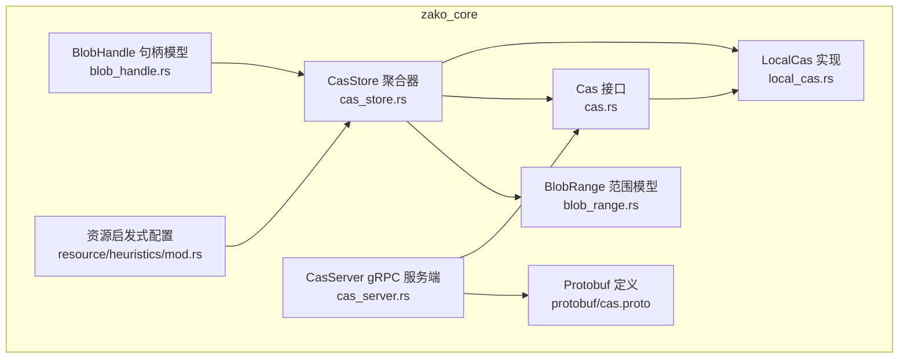
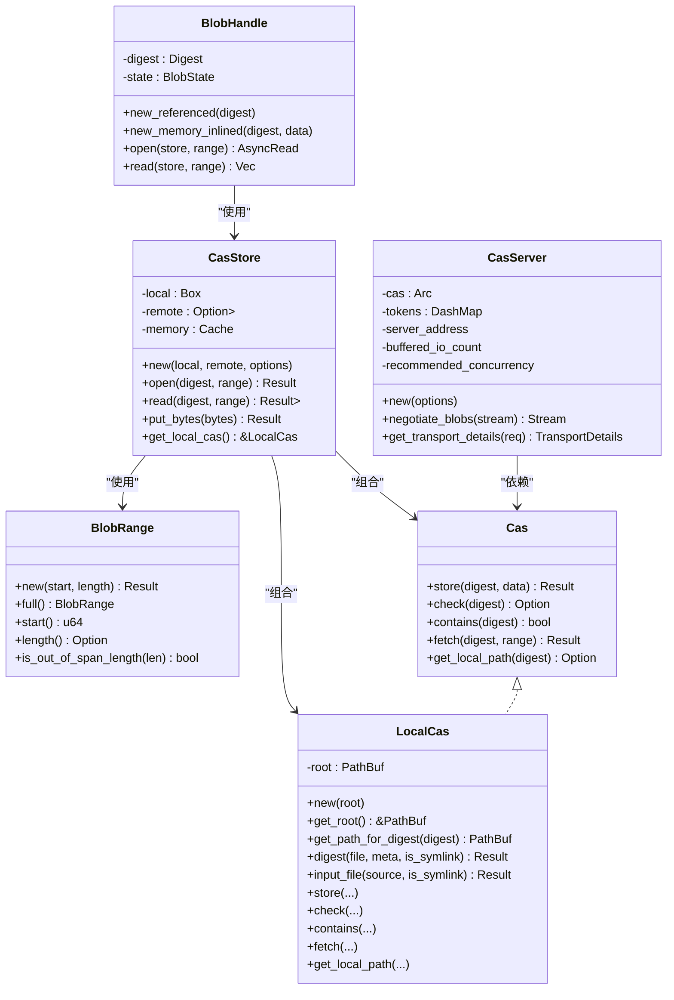
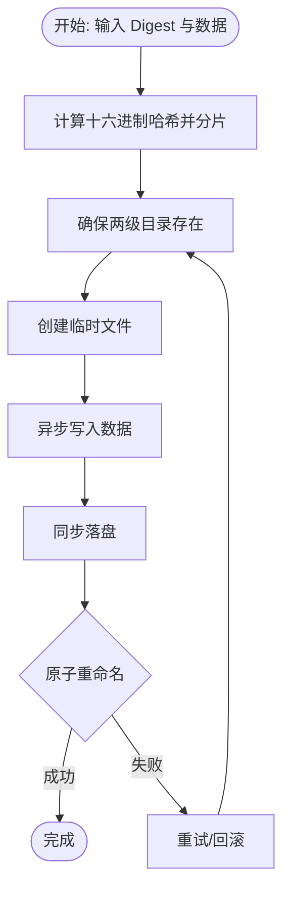
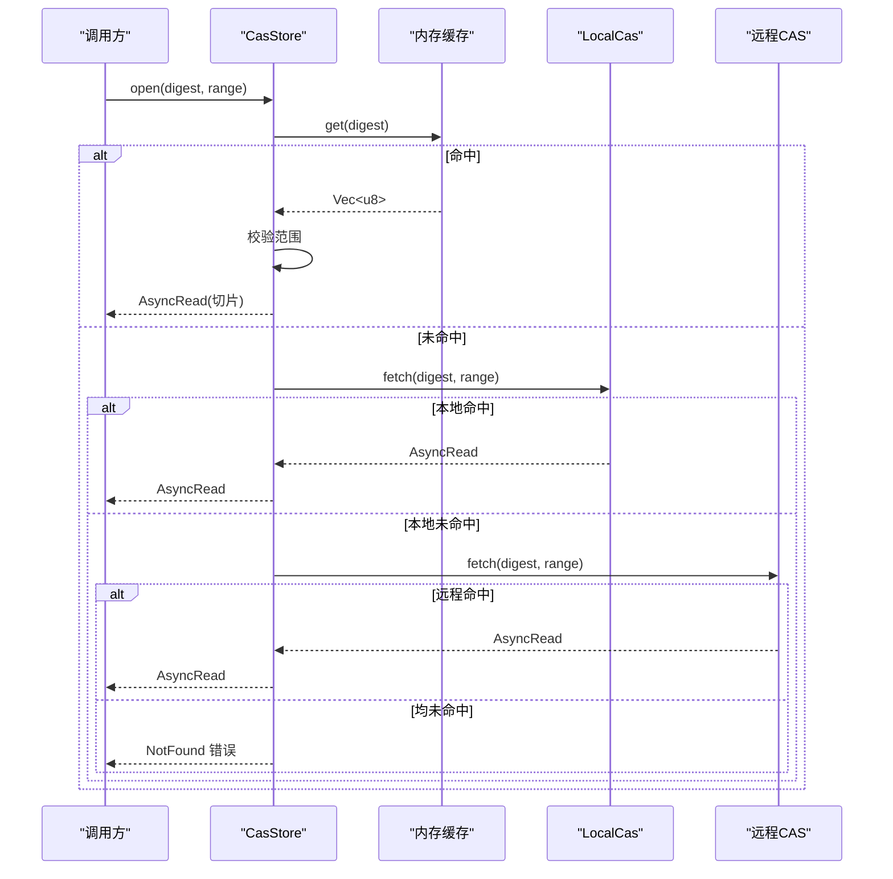
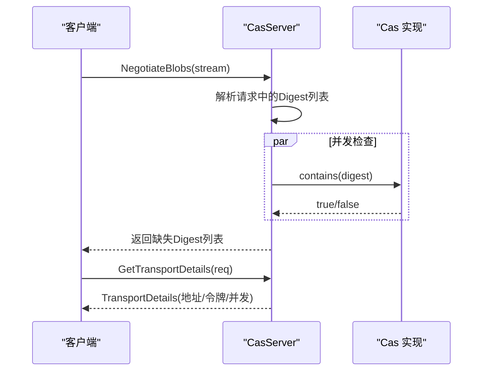
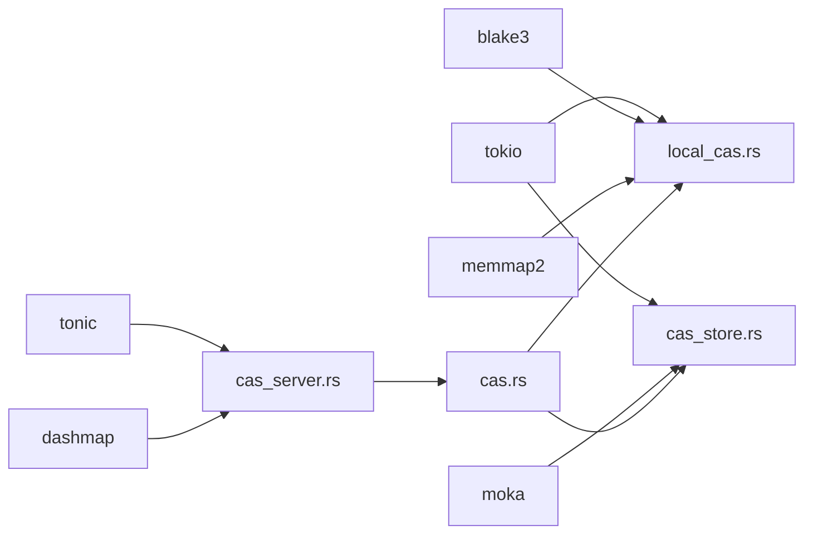

# CAS架构设计

<cite>
**本文引用的文件**
- [zako_core/src/cas.rs](file://zako_core/src/cas.rs)
- [zako_core/src/local_cas.rs](file://zako_core/src/local_cas.rs)
- [zako_core/src/cas_store.rs](file://zako_core/src/cas_store.rs)
- [zako_core/src/cas_server.rs](file://zako_core/src/cas_server.rs)
- [zako_core/src/blob_range.rs](file://zako_core/src/blob_range.rs)
- [zako_core/src/blob_handle.rs](file://zako_core/src/blob_handle.rs)
- [zako_core/src/lib.rs](file://zako_core/src/lib.rs)
- [zako_core/src/protobuf/cas.proto](file://zako_core/src/protobuf/cas.proto)
- [zako_core/src/resource/heuristics/mod.rs](file://zako_core/src/resource/heuristics/mod.rs)
- [Cargo.toml](file://Cargo.toml)
</cite>

## 目录
1. [引言](#引言)
2. [项目结构](#项目结构)
3. [核心组件](#核心组件)
4. [架构总览](#架构总览)
5. [组件详解](#组件详解)
6. [依赖关系分析](#依赖关系分析)
7. [性能考量](#性能考量)
8. [故障排查指南](#故障排查指南)
9. [结论](#结论)
10. [附录](#附录)

## 引言
本文件面向Zako的CAS（内容寻址存储）子系统，系统化阐述其设计理念、接口抽象、实现模式与运行时行为。CAS以“按内容而非位置”存储数据，结合范围读取、本地/远程双层缓存与gRPC服务端，形成可扩展、高性能且线程安全的数据通道。本文将从接口契约、实现细节、并发与性能、错误处理到部署建议进行完整说明，并提供可视化图示帮助理解。

## 项目结构
围绕CAS的关键模块分布于zako_core crate内，主要文件如下：
- 接口与错误：cas.rs
- 本地实现：local_cas.rs
- 存储聚合器：cas_store.rs
- gRPC服务端：cas_server.rs
- 范围模型：blob_range.rs
- 句柄模型：blob_handle.rs
- 协议定义：protobuf/cas.proto
- 资源启发式配置：resource/heuristics/mod.rs
- 工作区依赖：Cargo.toml

图表来源
- [zako_core/src/cas.rs](file://zako_core/src/cas.rs#L1-L63)
- [zako_core/src/local_cas.rs](file://zako_core/src/local_cas.rs#L1-L213)
- [zako_core/src/cas_store.rs](file://zako_core/src/cas_store.rs#L1-L156)
- [zako_core/src/cas_server.rs](file://zako_core/src/cas_server.rs#L1-L149)
- [zako_core/src/blob_range.rs](file://zako_core/src/blob_range.rs#L1-L139)
- [zako_core/src/blob_handle.rs](file://zako_core/src/blob_handle.rs#L1-L95)
- [zako_core/src/protobuf/cas.proto](file://zako_core/src/protobuf/cas.proto#L1-L31)
- [zako_core/src/resource/heuristics/mod.rs](file://zako_core/src/resource/heuristics/mod.rs#L1-L65)

章节来源
- [zako_core/src/lib.rs](file://zako_core/src/lib.rs#L36-L38)

## 核心组件
- Cas Trait：定义CAS的统一接口，包括存储、存在性检查、范围读取与本地路径查询。
- LocalCas：基于本地文件系统的CAS实现，采用两级目录分片与原子重命名写入。
- CasStore：多级缓存与多后端聚合器，支持内存缓存、本地CAS与可选远程CAS。
- CasServer：基于Tonic的gRPC服务端，提供协商缺失Blob与传输详情能力。
- BlobRange：范围读取模型，支持起始偏移与长度或尾部范围。
- BlobHandle：对Blob的运行时句柄，封装Digest与状态，统一打开/读取流程。
- Protobuf：定义gRPC服务接口消息格式。
- 资源启发式：根据系统资源动态确定CAS内存缓存大小与TTL/TTI。

章节来源
- [zako_core/src/cas.rs](file://zako_core/src/cas.rs#L9-L44)
- [zako_core/src/local_cas.rs](file://zako_core/src/local_cas.rs#L12-L213)
- [zako_core/src/cas_store.rs](file://zako_core/src/cas_store.rs#L21-L156)
- [zako_core/src/cas_server.rs](file://zako_core/src/cas_server.rs#L15-L149)
- [zako_core/src/blob_range.rs](file://zako_core/src/blob_range.rs#L21-L104)
- [zako_core/src/blob_handle.rs](file://zako_core/src/blob_handle.rs#L7-L95)
- [zako_core/src/protobuf/cas.proto](file://zako_core/src/protobuf/cas.proto#L8-L31)
- [zako_core/src/resource/heuristics/mod.rs](file://zako_core/src/resource/heuristics/mod.rs#L11-L25)

## 架构总览
CAS子系统由“接口—实现—聚合—服务—协议”五层构成，形成从应用到存储的清晰边界与可替换性。

图表来源
- [zako_core/src/cas.rs](file://zako_core/src/cas.rs#L11-L44)
- [zako_core/src/local_cas.rs](file://zako_core/src/local_cas.rs#L12-L213)
- [zako_core/src/cas_store.rs](file://zako_core/src/cas_store.rs#L21-L156)
- [zako_core/src/cas_server.rs](file://zako_core/src/cas_server.rs#L37-L149)
- [zako_core/src/blob_range.rs](file://zako_core/src/blob_range.rs#L21-L104)
- [zako_core/src/blob_handle.rs](file://zako_core/src/blob_handle.rs#L7-L95)

## 组件详解

### Cas Trait 设计与方法语义
- store(digest, data)：将输入流写入CAS，确保幂等与原子性。
- check(digest)：返回存在且可访问的数据长度；不存在则None。
- contains(digest)：布尔存在性检查，成本低于check。
- fetch(digest, range)：返回指定范围的异步读取流；未找到返回NotFound。
- get_local_path(digest)：仅当本地可用时返回真实路径，便于零拷贝传输。

错误模型
- CasError：封装IO、未找到、内部错误与越界请求等错误类型，便于上层统一处理。

章节来源
- [zako_core/src/cas.rs](file://zako_core/src/cas.rs#L9-L62)

### 本地CAS实现（LocalCas）
- 数据组织：采用两级目录分片（前两位+次两位+后缀），避免单目录文件过多。
- 写入策略：临时文件+同步+原子重命名，保证一致性与并发安全。
- 读取策略：范围校验+seek+take组合，支持部分读取。
- 文件摘要：大文件使用mmap+blake3，小文件直接哈希，符号链接按内容哈希。
- 硬链接优化：输入文件时尝试硬链接/软链接，减少磁盘占用。

图表来源
- [zako_core/src/local_cas.rs](file://zako_core/src/local_cas.rs#L107-L149)

章节来源
- [zako_core/src/local_cas.rs](file://zako_core/src/local_cas.rs#L12-L213)

### 存储聚合器（CasStore）
- 多级缓存：内存缓存（Moka）+本地CAS+可选远程CAS。
- 读取顺序：内存→本地→远程，任一命中即返回；均未命中返回NotFound。
- 写入策略：内存缓存（小于阈值）+本地CAS（必做）+远程CAS（可选）。
- 范围校验：在内存命中时先校验范围越界，再切片返回。

图表来源
- [zako_core/src/cas_store.rs](file://zako_core/src/cas_store.rs#L59-L108)

章节来源
- [zako_core/src/cas_store.rs](file://zako_core/src/cas_store.rs#L21-L156)

### gRPC服务端（CasServer）
- NegotiateBlobs：批量检查缺失的Blob，使用缓冲并发检查，提升吞吐。
- GetTransportDetails：协商传输协议与推荐并发度，生成一次性令牌。
- 并发控制：通过buffered_io_count与recommended_concurrency平衡吞吐与资源占用。

图表来源
- [zako_core/src/cas_server.rs](file://zako_core/src/cas_server.rs#L64-L147)
- [zako_core/src/protobuf/cas.proto](file://zako_core/src/protobuf/cas.proto#L8-L31)

章节来源
- [zako_core/src/cas_server.rs](file://zako_core/src/cas_server.rs#L15-L149)

### 范围模型（BlobRange）
- 支持两种构造：new(start, length?)与full()。
- 提供start/length/end/is_out_of_span_length等查询方法，用于边界校验与切片。
- 与Protobuf互转，便于跨进程/网络传递。

章节来源
- [zako_core/src/blob_range.rs](file://zako_core/src/blob_range.rs#L21-L104)

### 句柄模型（BlobHandle）
- 封装Digest与状态（引用/内存内联），统一open/read接口。
- 与CasStore协作，屏蔽底层存储差异。

章节来源
- [zako_core/src/blob_handle.rs](file://zako_core/src/blob_handle.rs#L7-L95)

## 依赖关系分析
- 外部依赖：tokio（异步）、moka（缓存）、tonic（gRPC）、dashmap（并发映射）、blake3（哈希）、memmap2（内存映射）等。
- 内部依赖：cas.rs定义接口，local_cas.rs实现本地逻辑，cas_store.rs聚合缓存与后端，cas_server.rs暴露服务，blob_range与blob_handle提供数据模型。

图表来源
- [Cargo.toml](file://Cargo.toml#L101-L274)
- [zako_core/src/local_cas.rs](file://zako_core/src/local_cas.rs#L1-L10)
- [zako_core/src/cas_store.rs](file://zako_core/src/cas_store.rs#L1-L11)
- [zako_core/src/cas_server.rs](file://zako_core/src/cas_server.rs#L1-L13)

章节来源
- [Cargo.toml](file://Cargo.toml#L38-L274)

## 性能考量
- 哈希与I/O
  - 大文件使用mmap+blake3，降低CPU与内存复制开销。
  - 小文件直接读取并哈希，避免mmap系统调用开销。
- 写入原子性
  - 临时文件+同步+原子重命名，避免部分写入与并发冲突。
- 缓存策略
  - 内存缓存容量按系统内存比例动态确定（约总内存的1/10，限制在4MB~4GB）。
  - TTL/TTI默认30分钟/5分钟，兼顾热点命中与内存回收。
- 并发与吞吐
  - gRPC协商阶段使用buffer_unordered并发检查，缓冲数量与CPU核数一致。
  - 推荐并发度由服务端返回，客户端据此调整拉取并发。
- 零拷贝路径
  - get_local_path仅在本地可用时返回真实路径，便于后续零拷贝发送。

章节来源
- [zako_core/src/local_cas.rs](file://zako_core/src/local_cas.rs#L31-L70)
- [zako_core/src/resource/heuristics/mod.rs](file://zako_core/src/resource/heuristics/mod.rs#L11-L25)
- [zako_core/src/cas_server.rs](file://zako_core/src/cas_server.rs#L23-L34)

## 故障排查指南
- 常见错误
  - NotFound：Digest不存在或无权限访问。
  - RequestedIndexOutOfRange：请求范围超出数据长度。
  - Io：底层文件系统错误。
- 排查步骤
  - 确认Digest是否正确生成与传递。
  - 使用contains/check确认存在性。
  - 校验BlobRange的start与length是否合法。
  - 检查本地目录分片是否存在与权限是否足够。
  - 对gRPC场景，确认GetTransportDetails返回的令牌与并发度设置。
- 建议
  - 在高并发写入场景下，优先使用CasStore的put_bytes以获得原子落盘与多后端一致性。
  - 对频繁读取的小对象，适当提高内存缓存容量与TTI。

章节来源
- [zako_core/src/cas.rs](file://zako_core/src/cas.rs#L46-L62)
- [zako_core/src/cas_store.rs](file://zako_core/src/cas_store.rs#L15-L19)
- [zako_core/src/cas_server.rs](file://zako_core/src/cas_server.rs#L114-L147)

## 结论
Zako的CAS子系统通过清晰的接口抽象、稳健的本地实现、灵活的多级缓存与并发服务端，实现了高性能、可扩展的内容寻址存储。其设计在一致性、安全性与性能之间取得良好平衡，并通过Protobuf与gRPC为分布式场景提供标准接入点。建议在生产环境中结合资源启发式配置与监控指标持续优化缓存参数与并发策略。

## 附录

### Protobuf接口概览
- 服务：ContentAddressableStorage
  - RPC NegotiateBlobs：流式请求/响应，协商缺失的Blob。
  - RPC GetTransportDetails：获取传输详情（地址、令牌、推荐并发）。

章节来源
- [zako_core/src/protobuf/cas.proto](file://zako_core/src/protobuf/cas.proto#L8-L31)

### 关键实现路径参考
- Cas接口定义：[zako_core/src/cas.rs](file://zako_core/src/cas.rs#L11-L44)
- LocalCas实现：[zako_core/src/local_cas.rs](file://zako_core/src/local_cas.rs#L105-L213)
- CasStore聚合器：[zako_core/src/cas_store.rs](file://zako_core/src/cas_store.rs#L21-L156)
- CasServer服务端：[zako_core/src/cas_server.rs](file://zako_core/src/cas_server.rs#L37-L149)
- 范围模型：[zako_core/src/blob_range.rs](file://zako_core/src/blob_range.rs#L21-L104)
- 句柄模型：[zako_core/src/blob_handle.rs](file://zako_core/src/blob_handle.rs#L7-L95)
- 资源启发式：[zako_core/src/resource/heuristics/mod.rs](file://zako_core/src/resource/heuristics/mod.rs#L11-L25)