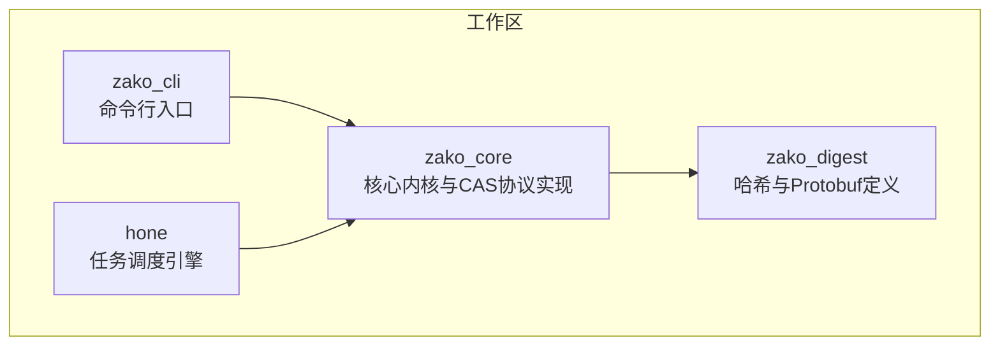
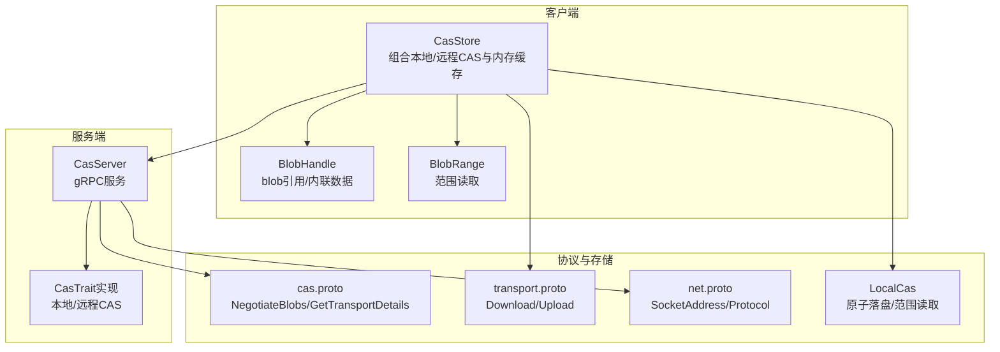
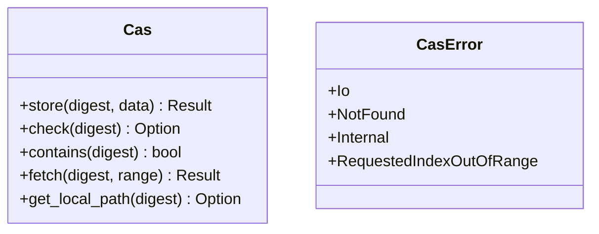
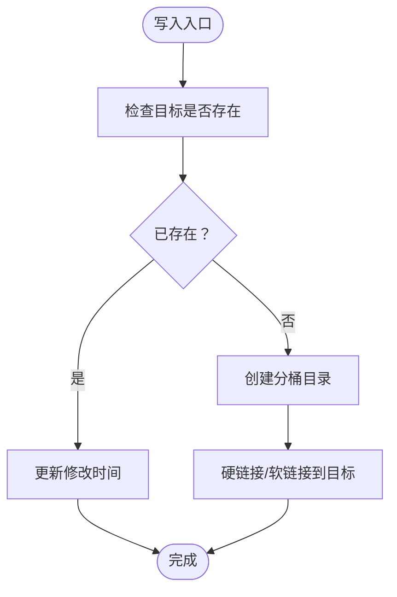
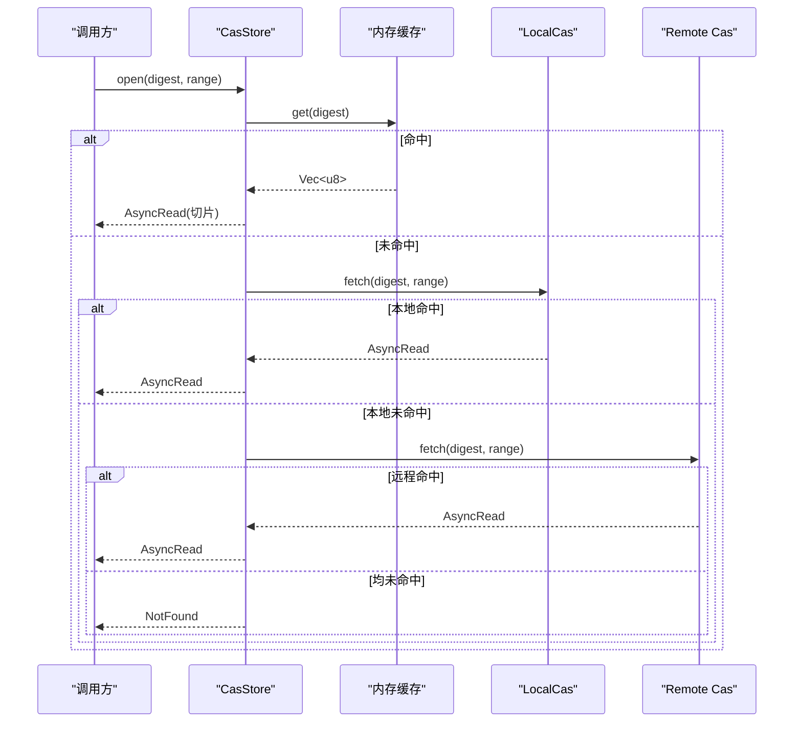
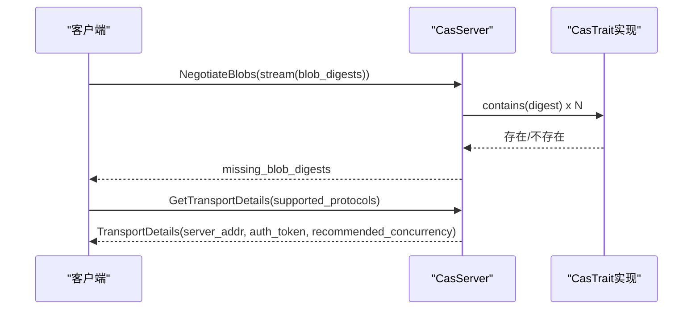
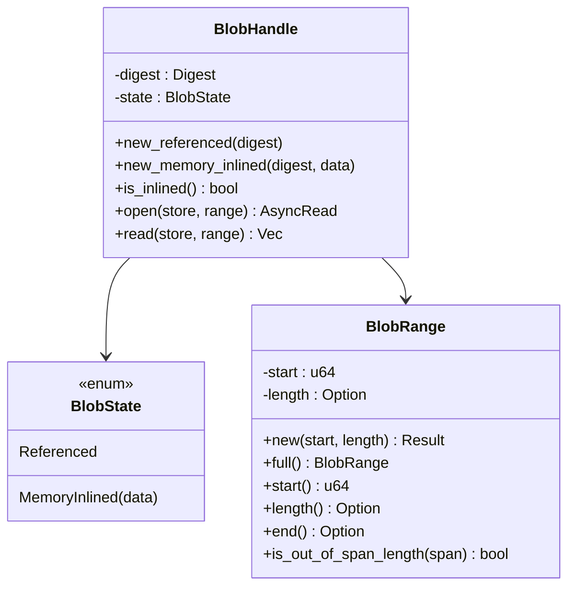
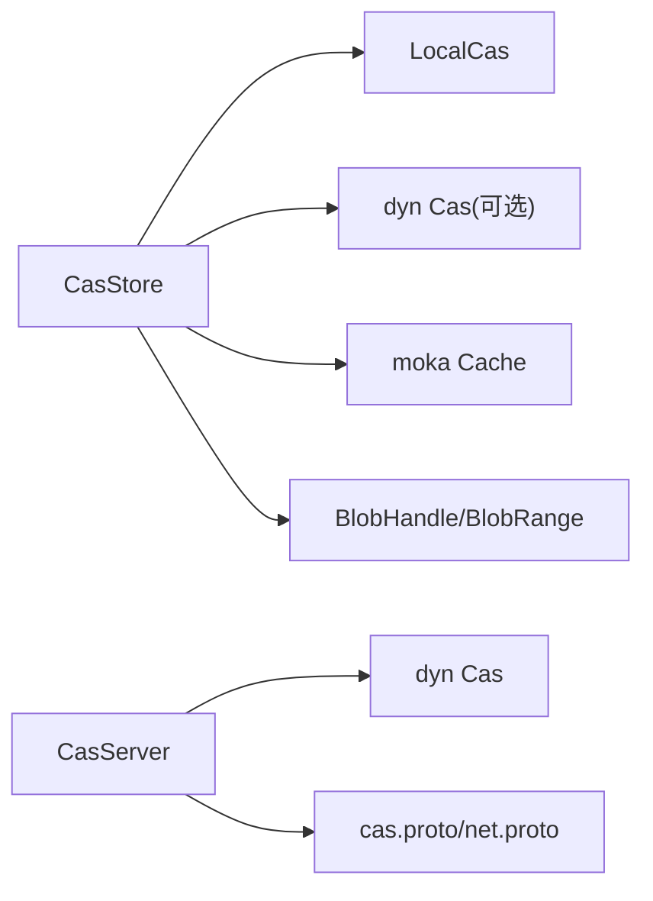

# 内容寻址存储

<cite>
**本文引用的文件**
- [README.md](file://README.md)
- [ARCHITECTURE.md](file://ARCHITECTURE.md)
- [Cargo.toml](file://Cargo.toml)
- [zako_core/src/cas.rs](file://zako_core/src/cas.rs)
- [zako_core/src/local_cas.rs](file://zako_core/src/local_cas.rs)
- [zako_core/src/cas_store.rs](file://zako_core/src/cas_store.rs)
- [zako_core/src/cas_server.rs](file://zako_core/src/cas_server.rs)
- [zako_core/src/blob_handle.rs](file://zako_core/src/blob_handle.rs)
- [zako_core/src/blob_range.rs](file://zako_core/src/blob_range.rs)
- [zako_core/src/protobuf/cas.proto](file://zako_core/src/protobuf/cas.proto)
- [zako_core/src/protobuf/fs.proto](file://zako_core/src/protobuf/fs.proto)
- [zako_core/src/protobuf/net.proto](file://zako_core/src/protobuf/net.proto)
- [zako_core/src/protobuf/transport.proto](file://zako_core/src/protobuf/transport.proto)
- [tests/new_project/zako.json](file://tests/new_project/zako.json)
- [tests/log_version/zako.jsonc](file://tests/log_version/zako.jsonc)
</cite>

## 目录
1. [简介](#简介)
2. [项目结构](#项目结构)
3. [核心组件](#核心组件)
4. [架构总览](#架构总览)
5. [详细组件分析](#详细组件分析)
6. [依赖关系分析](#依赖关系分析)
7. [性能考量](#性能考量)
8. [故障排除指南](#故障排除指南)
9. [结论](#结论)
10. [附录](#附录)

## 简介
本文件面向希望理解并部署 Zako 内容寻址存储（CAS）系统的工程师与运维人员。内容覆盖 CAS 架构原理、存储协议、远程同步、缓存管理与一致性保障，并给出 API 接口、数据结构、通信协议、配置示例、部署指南、与构建系统的集成方式、性能优化策略以及常见问题排查与运维监控建议。

## 项目结构
Zako 采用多 Crate 工作区组织，其中与 CAS 直接相关的核心模块集中在 zako_core，同时通过 zako_digest 提供哈希与 Protobuf 协议支持；CLI 与任务调度引擎分别由 zako_cli 与 hone 提供。

图表来源
- [Cargo.toml](file://Cargo.toml#L11-L22)

章节来源
- [Cargo.toml](file://Cargo.toml#L11-L22)

## 核心组件
- CAS 抽象与错误类型：定义统一的存储、检查、获取、范围读取与本地路径查询能力，以及标准错误类型。
- 本地 CAS 实现：基于内容哈希的目录布局与原子落盘，支持大文件内存映射与小文件流式读取。
- CAS 存储层：组合本地与远程 CAS，提供内存缓存、范围读取与写入传播。
- CAS 服务器：基于 gRPC 的服务端，提供协商缺失 blob 与传输细节协商。
- 数据结构：BlobHandle 表示 blob 引用或内联数据；BlobRange 描述偏移与长度范围。
- Protobuf 协议：定义 CAS 服务、网络地址、传输细节与虚拟文件系统条目。

章节来源
- [zako_core/src/cas.rs](file://zako_core/src/cas.rs#L9-L44)
- [zako_core/src/local_cas.rs](file://zako_core/src/local_cas.rs#L12-L103)
- [zako_core/src/cas_store.rs](file://zako_core/src/cas_store.rs#L21-L57)
- [zako_core/src/cas_server.rs](file://zako_core/src/cas_server.rs#L15-L57)
- [zako_core/src/blob_handle.rs](file://zako_core/src/blob_handle.rs#L7-L41)
- [zako_core/src/blob_range.rs](file://zako_core/src/blob_range.rs#L21-L104)
- [zako_core/src/protobuf/cas.proto](file://zako_core/src/protobuf/cas.proto#L8-L31)
- [zako_core/src/protobuf/net.proto](file://zako_core/src/protobuf/net.proto#L12-L19)
- [zako_core/src/protobuf/transport.proto](file://zako_core/src/protobuf/transport.proto#L8-L37)

## 架构总览
下图展示了 CAS 在 Zako 中的整体架构：客户端通过 CAS 存储层访问本地与远程 CAS；服务器端提供 gRPC 服务以协商缺失 blob 并返回传输细节；底层由本地 CAS 实现具体落盘与范围读取。

图表来源
- [zako_core/src/cas_store.rs](file://zako_core/src/cas_store.rs#L21-L57)
- [zako_core/src/cas_server.rs](file://zako_core/src/cas_server.rs#L37-L57)
- [zako_core/src/local_cas.rs](file://zako_core/src/local_cas.rs#L12-L103)
- [zako_core/src/protobuf/cas.proto](file://zako_core/src/protobuf/cas.proto#L8-L31)
- [zako_core/src/protobuf/transport.proto](file://zako_core/src/protobuf/transport.proto#L8-L37)
- [zako_core/src/protobuf/net.proto](file://zako_core/src/protobuf/net.proto#L12-L19)

## 详细组件分析

### CAS 抽象与错误类型
- 统一接口：store/fetch/check/contains/get_local_path，支持按内容哈希定位与范围读取。
- 错误模型：涵盖 IO、未找到、内部错误与越界请求等。

图表来源
- [zako_core/src/cas.rs](file://zako_core/src/cas.rs#L9-L44)

章节来源
- [zako_core/src/cas.rs](file://zako_core/src/cas.rs#L9-L63)

### 本地 CAS 实现
- 目录布局：基于哈希前缀分桶，避免单目录文件过多。
- 原子写入：临时文件 + 重命名，保证并发安全。
- 性能优化：大文件使用内存映射，小文件使用流式读取；符号链接内容直接哈希。
- 范围读取：校验越界后返回错误。

图表来源
- [zako_core/src/local_cas.rs](file://zako_core/src/local_cas.rs#L72-L102)

章节来源
- [zako_core/src/local_cas.rs](file://zako_core/src/local_cas.rs#L12-L103)

### CAS 存储层（缓存+本地+远程）
- 组合策略：优先内存缓存，其次本地 CAS，最后远程 CAS。
- 内存缓存：基于 moka 的 future Cache，按字节长度计重，支持 TTL/TTI。
- 写入传播：将相同内容写入本地与远程 CAS，保持一致性。
- 范围读取：先查内存缓存，再查本地，最后查远程，越界则报错。

图表来源
- [zako_core/src/cas_store.rs](file://zako_core/src/cas_store.rs#L59-L108)

章节来源
- [zako_core/src/cas_store.rs](file://zako_core/src/cas_store.rs#L21-L156)

### CAS 服务器（gRPC）
- 协商缺失：批量检查 digest 是否存在于 CAS，返回缺失列表。
- 传输细节：协商支持的协议（当前仅 gRPC），生成认证令牌与推荐并发度。
- 并发控制：基于 CPU 数设置缓冲 IO 数与推荐并发度。

图表来源
- [zako_core/src/cas_server.rs](file://zako_core/src/cas_server.rs#L64-L112)
- [zako_core/src/cas_server.rs](file://zako_core/src/cas_server.rs#L114-L147)

章节来源
- [zako_core/src/cas_server.rs](file://zako_core/src/cas_server.rs#L15-L57)

### 数据结构：BlobHandle 与 BlobRange
- BlobHandle：封装 digest 与状态（引用/内联），提供 open/read 接口。
- BlobRange：表示起始偏移与长度，支持半开区间与全量范围，含越界校验。

图表来源
- [zako_core/src/blob_handle.rs](file://zako_core/src/blob_handle.rs#L7-L41)
- [zako_core/src/blob_range.rs](file://zako_core/src/blob_range.rs#L21-L104)

章节来源
- [zako_core/src/blob_handle.rs](file://zako_core/src/blob_handle.rs#L7-L95)
- [zako_core/src/blob_range.rs](file://zako_core/src/blob_range.rs#L21-L139)

### 通信协议与 API
- CAS 服务（cas.proto）：NegotiateBlobs（流式请求/响应）、GetTransportDetails。
- 传输服务（transport.proto）：Download（流式响应）、Upload（流式请求）。
- 网络与地址（net.proto）：SocketAddress、Protocol。
- 虚拟文件系统（fs.proto）：VirtualFsItem，描述相对路径、内容摘要、符号链接与权限位。

章节来源
- [zako_core/src/protobuf/cas.proto](file://zako_core/src/protobuf/cas.proto#L8-L31)
- [zako_core/src/protobuf/transport.proto](file://zako_core/src/protobuf/transport.proto#L8-L37)
- [zako_core/src/protobuf/net.proto](file://zako_core/src/protobuf/net.proto#L12-L19)
- [zako_core/src/protobuf/fs.proto](file://zako_core/src/protobuf/fs.proto#L7-L18)

## 依赖关系分析
- 组件耦合：CasStore 依赖 LocalCas 与可选的远程 Cas；CasServer 依赖 Cas Trait；BlobHandle/BlobRange 为上层使用提供抽象。
- 外部依赖：Tokio（异步）、tonic（gRPC）、moka（缓存）、blake3（哈希）、uuid（令牌）、dashmap（并发 Map）。

图表来源
- [zako_core/src/cas_store.rs](file://zako_core/src/cas_store.rs#L21-L57)
- [zako_core/src/local_cas.rs](file://zako_core/src/local_cas.rs#L12-L103)
- [zako_core/src/cas_server.rs](file://zako_core/src/cas_server.rs#L37-L57)
- [zako_core/src/protobuf/cas.proto](file://zako_core/src/protobuf/cas.proto#L8-L31)
- [zako_core/src/protobuf/net.proto](file://zako_core/src/protobuf/net.proto#L12-L19)

章节来源
- [zako_core/src/cas_store.rs](file://zako_core/src/cas_store.rs#L21-L57)
- [zako_core/src/local_cas.rs](file://zako_core/src/local_cas.rs#L12-L103)
- [zako_core/src/cas_server.rs](file://zako_core/src/cas_server.rs#L37-L57)

## 性能考量
- 哈希与存储
  - 使用 blake3 进行内容哈希，本地目录按前缀分桶，降低单目录文件数。
  - 大文件采用内存映射，小文件采用流式读取，兼顾吞吐与延迟。
- 缓存策略
  - 内存缓存按字节长度计重，限制容量并设置 TTL/TTI，适合热点小对象。
  - 对小于阈值的数据进行内联缓存，减少多次 IO。
- 并发与 I/O
  - gRPC 侧使用 buffer_unordered 控制并发检查，结合 CPU 数设置推荐并发度。
  - 上传/下载采用流式处理，避免一次性加载全部数据。
- 原子写入
  - 临时文件 + 重命名保证落盘原子性，减少部分写风险。

章节来源
- [zako_core/src/local_cas.rs](file://zako_core/src/local_cas.rs#L31-L70)
- [zako_core/src/cas_store.rs](file://zako_core/src/cas_store.rs#L44-L56)
- [zako_core/src/cas_server.rs](file://zako_core/src/cas_server.rs#L71-L93)

## 故障排除指南
- 常见错误与定位
  - NotFound：目标 digest 不存在，检查上游是否正确写入或远程同步是否成功。
  - RequestedIndexOutOfRange：请求范围超出 blob 长度，检查 BlobRange 的 start/length/end 计算。
  - Io：底层文件系统错误，检查磁盘空间、权限与路径有效性。
- 诊断步骤
  - 校验 digest 与长度：确认 BlobRange 与实际长度一致。
  - 检查本地与远程 CAS：先本地后远程，逐步缩小范围。
  - gRPC 协商：确认 supported_protocols 与服务端返回的 TransportDetails。
- 建议
  - 对频繁越界问题，增加范围校验与日志记录。
  - 对远程同步失败，检查网络连通性与认证令牌有效期。

章节来源
- [zako_core/src/cas.rs](file://zako_core/src/cas.rs#L46-L62)
- [zako_core/src/cas_server.rs](file://zako_core/src/cas_server.rs#L114-L147)
- [zako_core/src/blob_range.rs](file://zako_core/src/blob_range.rs#L74-L82)

## 结论
Zako 的 CAS 体系以内容哈希为核心，结合本地原子存储、内存缓存与可插拔远程 CAS，形成高可靠、可扩展的构建产物与输入存储方案。通过 gRPC 协议实现远端协商与传输细节协商，满足分布式场景下的缓存共享与一致性需求。配合合理的缓存策略与并发控制，可在多机环境下获得稳定性能。

## 附录

### 配置示例与部署指南
- 项目配置样例
  - 基础项目配置：包含 group/artifact/version/workspaces/options 等字段。
  - 配置继承与合并：示例展示如何继承全局配置与外部包配置。
- 部署要点
  - 本地 CAS 根目录：确保写权限与足够空间。
  - 远程 CAS：在 CasStore 中注入远程实现，启用写入传播。
  - gRPC 服务：暴露 SocketAddress，配置 supported_protocols 为 grpc。
  - 并发参数：根据 CPU 核数设置 buffered_io_count 与 recommended_concurrency。

章节来源
- [tests/new_project/zako.json](file://tests/new_project/zako.json#L1-L18)
- [tests/log_version/zako.jsonc](file://tests/log_version/zako.jsonc#L1-L32)
- [zako_core/src/cas_server.rs](file://zako_core/src/cas_server.rs#L23-L35)

### 与构建系统的集成
- 项目元数据与规则
  - Rust 侧：Project 结构体承载 group/artifact/version/builds/dependencies/config。
  - TypeScript 侧：zako.ts 定义项目；BUILD.ts 定义目标；工具链层可受控 IO。
- CAS 在构建中的角色
  - 输入/输出均以内容哈希标识，天然支持远程缓存与增量构建。
  - 通过 BlobHandle/BlobRange 抽象，构建脚本可按需读取片段，提升效率。

章节来源
- [ARCHITECTURE.md](file://ARCHITECTURE.md#L59-L99)
- [ARCHITECTURE.md](file://ARCHITECTURE.md#L101-L119)

### 运维与监控建议
- 监控指标
  - CAS 命中率（内存/本地/远程）、写入/读取延迟、并发度、错误率。
- 告警
  - 连续 NotFound 或 RequestedIndexOutOfRange 异常升高。
  - 写入失败或磁盘空间不足告警。
- 调优
  - 根据热点数据规模调整内存缓存容量与 TTL。
  - 根据网络带宽与节点数量调整 recommended_concurrency。

章节来源
- [zako_core/src/cas_store.rs](file://zako_core/src/cas_store.rs#L44-L56)
- [zako_core/src/cas_server.rs](file://zako_core/src/cas_server.rs#L23-L35)