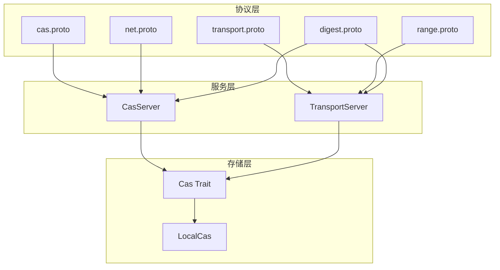
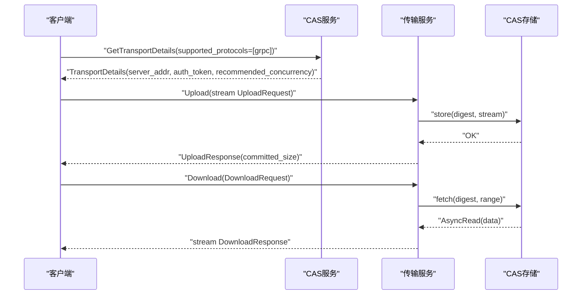
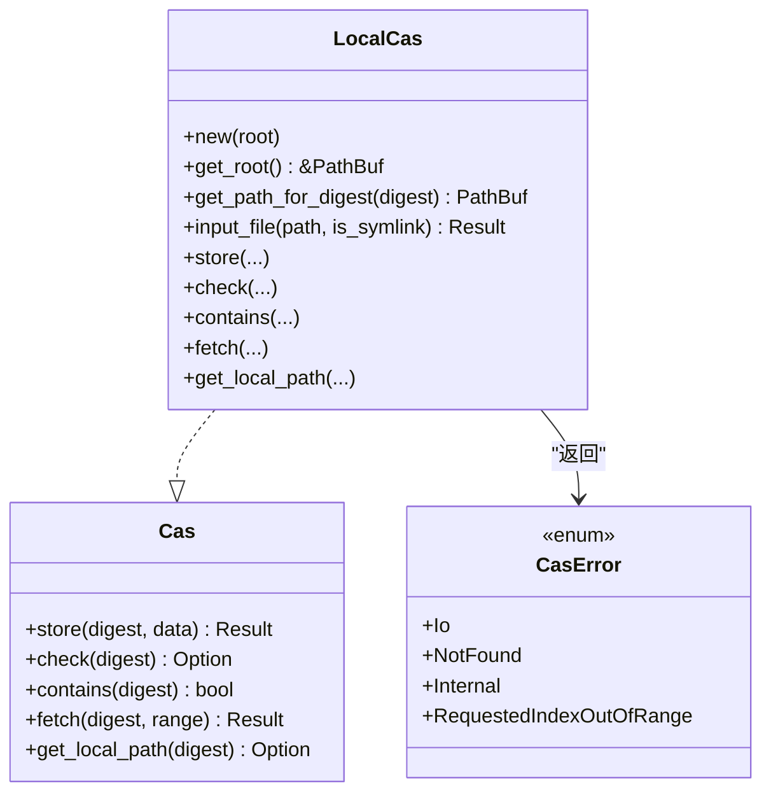
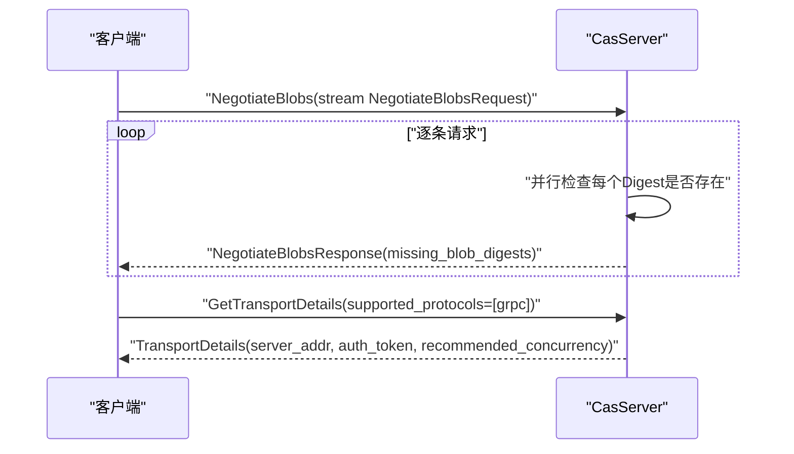
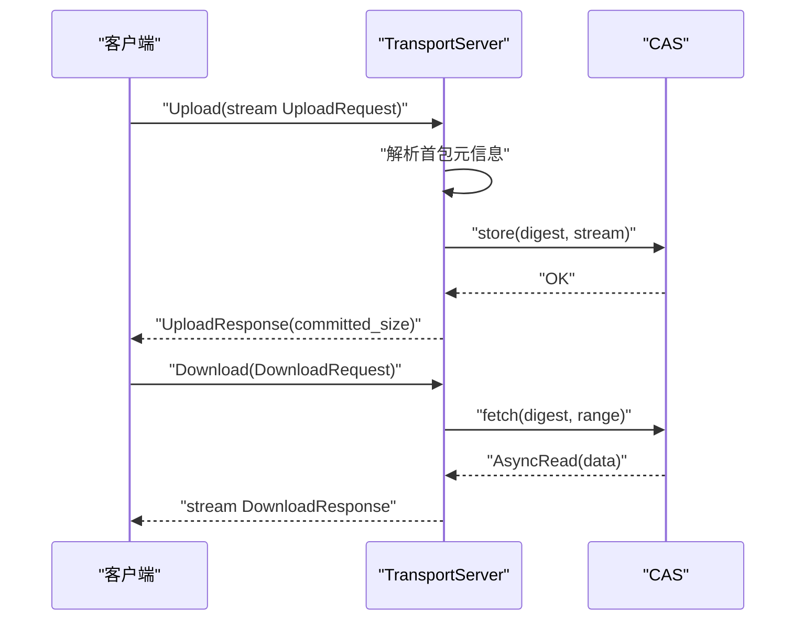
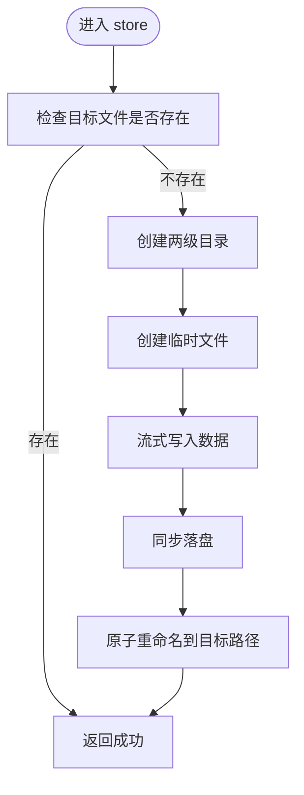
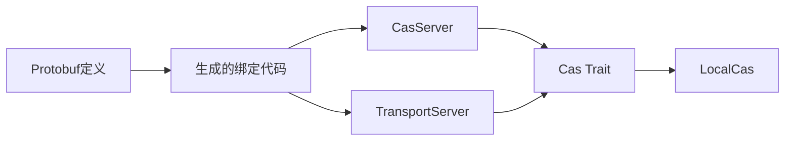

# 存储协议与通信

<cite>
**本文引用的文件**
- [zako_core/src/cas.rs](file://zako_core/src/cas.rs)
- [zako_core/src/cas_server.rs](file://zako_core/src/cas_server.rs)
- [zako_core/src/local_cas.rs](file://zako_core/src/local_cas.rs)
- [zako_core/src/transport_server.rs](file://zako_core/src/transport_server.rs)
- [zako_core/src/blob_range.rs](file://zako_core/src/blob_range.rs)
- [zako_core/src/protobuf/cas.proto](file://zako_core/src/protobuf/cas.proto)
- [zako_core/src/protobuf/transport.proto](file://zako_core/src/protobuf/transport.proto)
- [zako_core/src/protobuf/net.proto](file://zako_core/src/protobuf/net.proto)
- [zako_core/src/protobuf/range.proto](file://zako_core/src/protobuf/range.proto)
- [zako_digest/src/protobuf/digest.proto](file://zako_digest/src/protobuf/digest.proto)
- [zako_core/build.rs](file://zako_core/build.rs)
- [Cargo.toml](file://Cargo.toml)
</cite>

## 目录
1. [引言](#引言)
2. [项目结构](#项目结构)
3. [核心组件](#核心组件)
4. [架构总览](#架构总览)
5. [详细组件分析](#详细组件分析)
6. [依赖关系分析](#依赖关系分析)
7. [性能考量](#性能考量)
8. [故障排查指南](#故障排查指南)
9. [结论](#结论)
10. [附录](#附录)

## 引言
本文件面向Zako的存储协议与通信机制，系统性阐述内容可寻址存储（CAS）协议、gRPC服务接口、消息格式与通信流程、传输协议设计原理、数据序列化与网络优化策略，并提供服务端配置、连接管理与负载均衡的实现建议。同时覆盖安全与认证授权、网络拓扑设计、常见通信问题与性能调优、故障恢复策略等。

## 项目结构
Zako围绕“内容可寻址存储”与“基于gRPC的传输”两大能力构建：
- 协议层：通过Protocol Buffers定义CAS与传输服务的消息与服务契约，统一跨语言/跨进程通信。
- 服务层：提供CAS协商与传输服务，支持流式上传下载、范围读取与并发控制。
- 存储层：抽象出CAS接口，本地实现采用分片目录组织与哈希命名，支持内存映射加速与硬链接复用。
- 工具与编译：通过构建脚本统一生成gRPC/Protobuf绑定代码，确保类型安全与版本兼容。

图表来源
- [zako_core/src/protobuf/cas.proto](file://zako_core/src/protobuf/cas.proto#L1-L32)
- [zako_core/src/protobuf/transport.proto](file://zako_core/src/protobuf/transport.proto#L1-L38)
- [zako_core/src/protobuf/net.proto](file://zako_core/src/protobuf/net.proto#L1-L20)
- [zako_core/src/protobuf/range.proto](file://zako_core/src/protobuf/range.proto)
- [zako_digest/src/protobuf/digest.proto](file://zako_digest/src/protobuf/digest.proto#L1-L10)
- [zako_core/src/cas_server.rs](file://zako_core/src/cas_server.rs#L1-L149)
- [zako_core/src/transport_server.rs](file://zako_core/src/transport_server.rs#L1-L138)
- [zako_core/src/cas.rs](file://zako_core/src/cas.rs#L1-L63)
- [zako_core/src/local_cas.rs](file://zako_core/src/local_cas.rs#L1-L213)

章节来源
- [zako_core/src/protobuf/cas.proto](file://zako_core/src/protobuf/cas.proto#L1-L32)
- [zako_core/src/protobuf/transport.proto](file://zako_core/src/protobuf/transport.proto#L1-L38)
- [zako_core/src/protobuf/net.proto](file://zako_core/src/protobuf/net.proto#L1-L20)
- [zako_core/src/protobuf/range.proto](file://zako_core/src/protobuf/range.proto)
- [zako_digest/src/protobuf/digest.proto](file://zako_digest/src/protobuf/digest.proto#L1-L10)
- [zako_core/src/cas_server.rs](file://zako_core/src/cas_server.rs#L1-L149)
- [zako_core/src/transport_server.rs](file://zako_core/src/transport_server.rs#L1-L138)
- [zako_core/src/cas.rs](file://zako_core/src/cas.rs#L1-L63)
- [zako_core/src/local_cas.rs](file://zako_core/src/local_cas.rs#L1-L213)

## 核心组件
- CAS接口与错误模型：定义统一的存储、检查、获取、范围读取与本地路径查询能力，以及标准化的错误类型。
- CAS服务（gRPC）：提供“协商缺失Blob”和“获取传输详情”的双向流式RPC，负责协议选择、令牌发放与并发建议。
- 传输服务（gRPC）：提供下载与上传RPC，支持范围读取、流式上传、原子落盘与提交大小统计。
- 本地CAS实现：以内容哈希作为文件名，采用两级目录分片、内存映射与硬链接优化，保证高效与去重。
- 范围模型：统一的BlobRange结构，支持起始偏移、长度与全量范围，提供越界校验与转换。
- 构建与绑定：通过构建脚本统一生成gRPC/Protobuf绑定，确保类型安全与跨模块共享。

章节来源
- [zako_core/src/cas.rs](file://zako_core/src/cas.rs#L1-L63)
- [zako_core/src/cas_server.rs](file://zako_core/src/cas_server.rs#L1-L149)
- [zako_core/src/local_cas.rs](file://zako_core/src/local_cas.rs#L1-L213)
- [zako_core/src/transport_server.rs](file://zako_core/src/transport_server.rs#L1-L138)
- [zako_core/src/blob_range.rs](file://zako_core/src/blob_range.rs#L1-L139)

## 架构总览
Zako的存储与通信采用“协议定义—服务实现—存储抽象—本地实现”的分层设计。gRPC作为传输协议，通过Protobuf消息在客户端与服务端之间传递内容摘要、范围与传输细节；CAS服务负责协商与令牌发放，传输服务负责数据的可靠上传与下载。

图表来源
- [zako_core/src/cas_server.rs](file://zako_core/src/cas_server.rs#L114-L147)
- [zako_core/src/transport_server.rs](file://zako_core/src/transport_server.rs#L70-L136)
- [zako_core/src/cas.rs](file://zako_core/src/cas.rs#L10-L44)
- [zako_core/src/local_cas.rs](file://zako_core/src/local_cas.rs#L107-L149)

## 详细组件分析

### CAS接口与错误模型
- 接口职责
  - 存储：按内容摘要写入数据，支持异步流式输入。
  - 检查/存在性：返回长度或布尔值，用于快速判断是否存在。
  - 获取：按范围读取，返回可异步读取的数据流。
  - 本地路径：在本地可用时返回物理路径，便于零拷贝传输。
- 错误模型
  - IO错误、未找到、内部存储错误、索引越界等，均映射为标准状态码，便于客户端统一处理。

图表来源
- [zako_core/src/cas.rs](file://zako_core/src/cas.rs#L10-L63)
- [zako_core/src/local_cas.rs](file://zako_core/src/local_cas.rs#L106-L213)

章节来源
- [zako_core/src/cas.rs](file://zako_core/src/cas.rs#L1-L63)
- [zako_core/src/local_cas.rs](file://zako_core/src/local_cas.rs#L1-L213)

### CAS服务（gRPC）
- 服务与RPC
  - NegotiateBlobs：客户端批量发送内容摘要，服务端并行检查并返回缺失列表，支持流式请求与响应。
  - GetTransportDetails：客户端声明支持的传输协议，服务端仅接受gRPC并返回服务器地址、一次性令牌与推荐并发度。
- 并发与缓冲
  - 使用无序缓冲并发检查，缓冲数量与CPU核数相关，提升吞吐。
- 认证与令牌
  - 生成一次性UUID令牌，用于后续传输阶段的身份关联（当前实现中令牌存于内存表，未持久化）。

图表来源
- [zako_core/src/cas_server.rs](file://zako_core/src/cas_server.rs#L64-L112)
- [zako_core/src/cas_server.rs](file://zako_core/src/cas_server.rs#L114-L147)

章节来源
- [zako_core/src/cas_server.rs](file://zako_core/src/cas_server.rs#L1-L149)

### 传输服务（gRPC）
- 下载（Download）
  - 客户端提供Blob资源元信息（摘要、范围），服务端从CAS读取并以流式响应返回数据块。
  - 对未找到、IO错误、索引越界等进行状态映射，便于客户端区分。
- 上传（Upload）
  - 首包必须是元信息（包含摘要与范围），随后为数据块流。
  - 服务端统计已提交字节数，完成原子落盘后返回提交大小。
  - 若目标已存在则直接报错，避免重复写入。

图表来源
- [zako_core/src/transport_server.rs](file://zako_core/src/transport_server.rs#L28-L68)
- [zako_core/src/transport_server.rs](file://zako_core/src/transport_server.rs#L70-L136)
- [zako_core/src/cas.rs](file://zako_core/src/cas.rs#L10-L44)

章节来源
- [zako_core/src/transport_server.rs](file://zako_core/src/transport_server.rs#L1-L138)

### 本地CAS实现
- 目录组织
  - 以内容哈希的十六进制表示为文件名，前两位与第三四位组成两级子目录，降低单目录项数。
- 哈希与读取
  - 大文件使用内存映射加速，小文件使用流式读取；符号链接内容按其目标字符串计算哈希。
- 写入与原子性
  - 先写临时文件再原子重命名，确保一致性；写入完成后同步落盘。
- 范围读取
  - 校验范围不越界，支持从指定偏移开始的全量或部分读取。

图表来源
- [zako_core/src/local_cas.rs](file://zako_core/src/local_cas.rs#L107-L149)

章节来源
- [zako_core/src/local_cas.rs](file://zako_core/src/local_cas.rs#L1-L213)

### 范围模型与越界校验
- BlobRange
  - 支持起始偏移、可选长度与全量范围；提供越界检测与结束位置计算。
  - 提供与Protobuf范围消息的互转，便于跨服务边界传递。
- 错误映射
  - 越界错误映射为无效参数状态，便于客户端感知并修正请求。

章节来源
- [zako_core/src/blob_range.rs](file://zako_core/src/blob_range.rs#L1-L139)

### 协议与消息定义
- CAS服务
  - 请求：批量内容摘要。
  - 响应：缺失内容摘要列表。
  - 传输详情：服务器地址、一次性令牌、推荐并发度。
- 传输服务
  - 下载：请求携带摘要与范围；响应为数据块流。
  - 上传：首包为元信息，后续为数据块流；响应为已提交字节数。
- 网络与范围
  - 网络地址支持IPv4/IPv6与端口；协议枚举目前仅支持gRPC。
  - 范围消息支持起始与长度字段。

章节来源
- [zako_core/src/protobuf/cas.proto](file://zako_core/src/protobuf/cas.proto#L1-L32)
- [zako_core/src/protobuf/transport.proto](file://zako_core/src/protobuf/transport.proto#L1-L38)
- [zako_core/src/protobuf/net.proto](file://zako_core/src/protobuf/net.proto#L1-L20)
- [zako_core/src/protobuf/range.proto](file://zako_core/src/protobuf/range.proto)
- [zako_digest/src/protobuf/digest.proto](file://zako_digest/src/protobuf/digest.proto#L1-L10)

### 构建与绑定生成
- 构建脚本
  - 统一编译多个Protobuf文件，外部路径映射至共享的digest包，确保跨模块一致。
- 依赖
  - 使用tonic与prost生态，生成强类型的gRPC服务与消息绑定。

章节来源
- [zako_core/build.rs](file://zako_core/build.rs#L1-L17)
- [Cargo.toml](file://Cargo.toml#L209-L230)

## 依赖关系分析
- 组件耦合
  - 服务层依赖CAS接口，解耦具体存储实现；传输服务依赖CAS接口与范围模型。
  - Protobuf定义独立于实现，通过构建脚本生成绑定，降低编译期耦合。
- 外部依赖
  - gRPC生态（tonic/prost）、并发与流式工具（futures/tokio-stream）、哈希与内存映射（blake3/memmap2）、并发容器（dashmap）等。

图表来源
- [zako_core/src/protobuf/cas.proto](file://zako_core/src/protobuf/cas.proto#L1-L32)
- [zako_core/src/protobuf/transport.proto](file://zako_core/src/protobuf/transport.proto#L1-L38)
- [zako_core/src/cas_server.rs](file://zako_core/src/cas_server.rs#L1-L149)
- [zako_core/src/transport_server.rs](file://zako_core/src/transport_server.rs#L1-L138)
- [zako_core/src/cas.rs](file://zako_core/src/cas.rs#L1-L63)
- [zako_core/src/local_cas.rs](file://zako_core/src/local_cas.rs#L1-L213)

章节来源
- [Cargo.toml](file://Cargo.toml#L209-L230)

## 性能考量
- 并发与缓冲
  - 在CAS协商中使用无序缓冲并发检查，缓冲数量与CPU核数相关，提高吞吐。
- I/O优化
  - 小文件流式读取，大文件使用内存映射；写入先临时文件再原子重命名，减少碎片与锁竞争。
- 序列化与传输
  - Protobuf二进制序列化，gRPC多路复用与流式传输，降低开销。
- 范围读取
  - 服务端按需读取指定范围，避免不必要的数据传输。
- 建议
  - 合理设置推荐并发度；对热点数据可引入缓存层；在高延迟网络下适当增大缓冲区与超时时间。

[本节为通用性能指导，无需列出章节来源]

## 故障排查指南
- 常见错误与定位
  - 未找到：下载时若摘要不存在，返回未找到状态；检查CAS是否已存在或是否正确协商。
  - IO错误：磁盘权限、路径非法或文件损坏；检查存储根目录与权限。
  - 索引越界：请求范围超出文件长度；校验范围模型与边界。
  - 协商失败：客户端未按流式顺序发送或协议不匹配；确认gRPC协议与消息顺序。
- 日志与追踪
  - 结合tracing与OpenTelemetry生态，记录请求ID、摘要、范围与耗时，便于定位瓶颈。
- 重试与退避
  - 对瞬时网络错误采用指数退避重试；对不可重试错误（如越界）提示修复。

章节来源
- [zako_core/src/transport_server.rs](file://zako_core/src/transport_server.rs#L51-L58)
- [zako_core/src/local_cas.rs](file://zako_core/src/local_cas.rs#L182-L188)
- [Cargo.toml](file://Cargo.toml#L88-L92)

## 结论
Zako通过清晰的协议定义与分层实现，提供了高性能、可扩展的内容可寻址存储与传输能力。CAS服务负责协议协商与令牌发放，传输服务提供可靠的流式上传下载与范围读取；本地CAS实现结合目录分片、内存映射与原子写入，兼顾效率与一致性。配合gRPC与Protobuf，系统具备良好的跨语言互通与工程化能力。

[本节为总结性内容，无需列出章节来源]

## 附录

### 服务端配置与连接管理
- 服务启动
  - 初始化CAS实例（本地或云存储适配器），创建CAS服务与传输服务，绑定到监听地址。
- 连接与并发
  - 使用推荐并发度控制上传/下载并发；根据硬件与网络状况调整缓冲区大小。
- 负载均衡
  - 多实例部署时，通过反向代理或服务网格实现会话亲和或无状态分发；令牌用于短时访问控制。

[本节为通用实践建议，无需列出章节来源]

### 安全性与认证授权
- 认证
  - 传输详情接口返回一次性令牌；建议在网关层对接JWT或mTLS，限制令牌有效期与作用域。
- 授权
  - 基于摘要与范围的最小权限控制；对敏感内容启用加密存储与访问审计。
- 网络拓扑
  - 内网优先、跨机房冗余；边缘节点缓存热点内容；出口限速与QoS保障关键流量。

[本节为通用安全建议，无需列出章节来源]