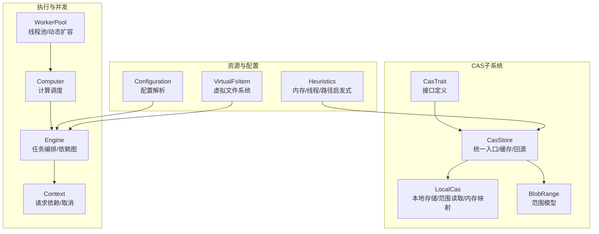
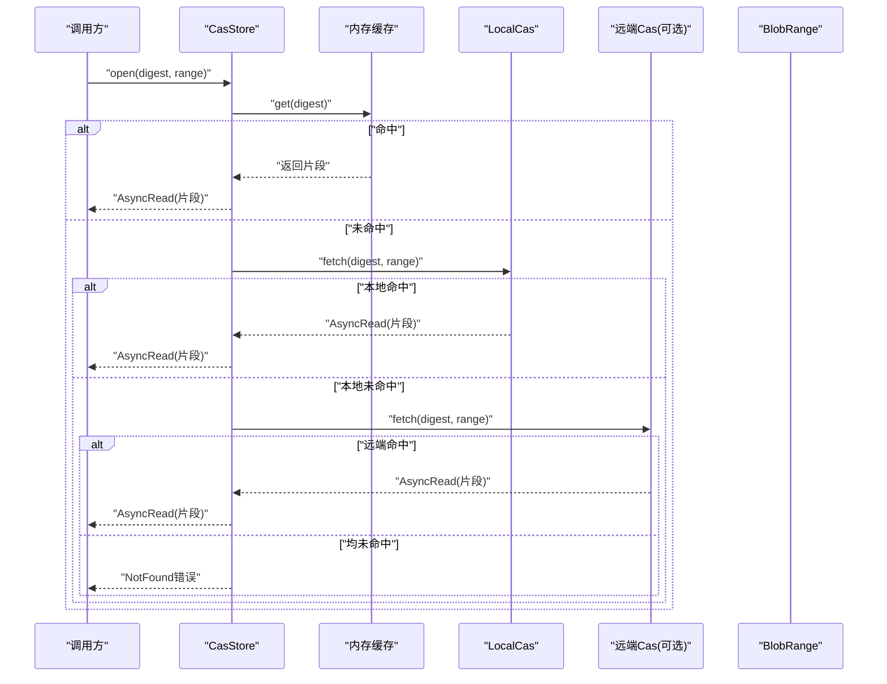
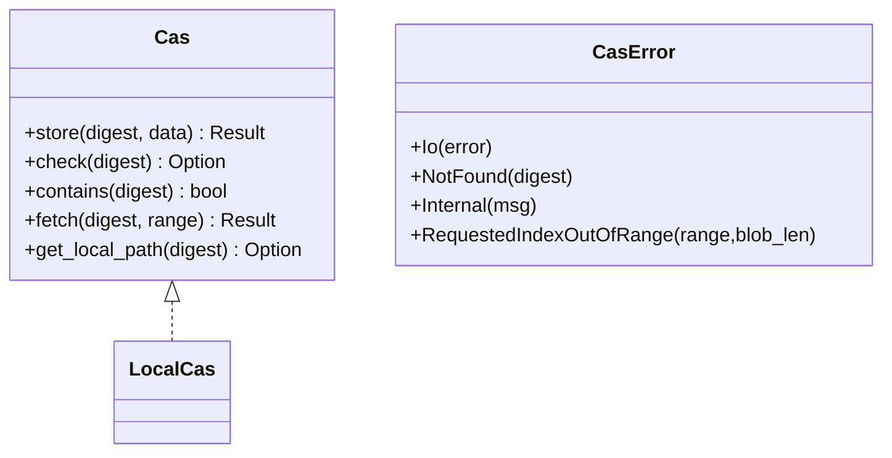
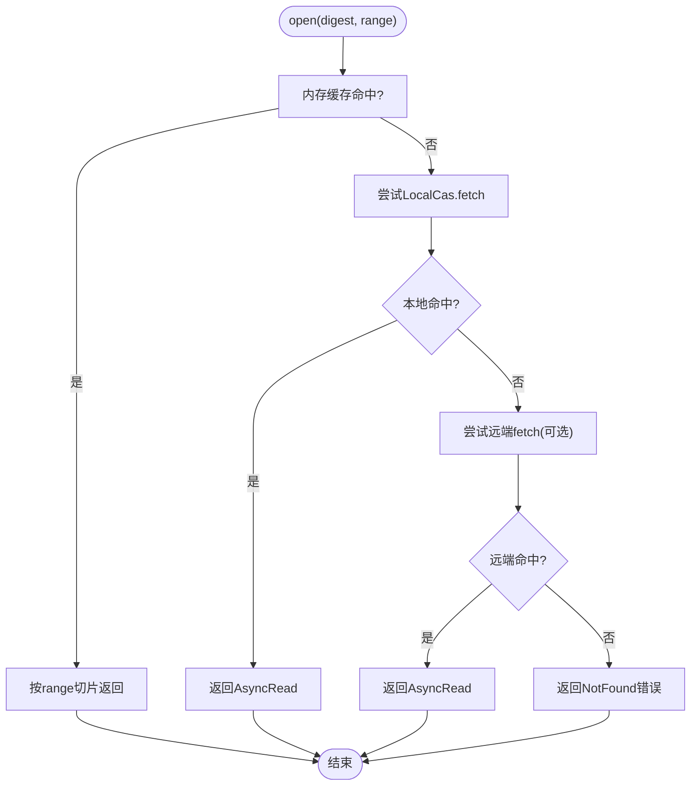
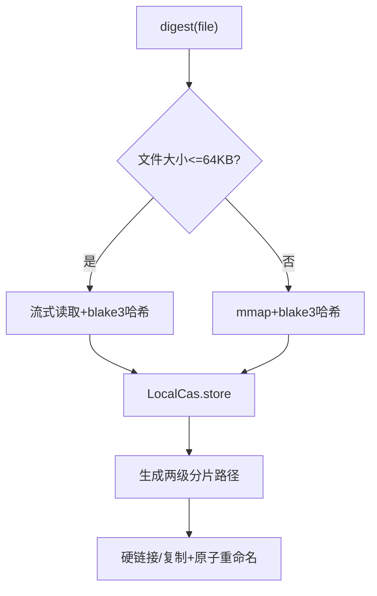
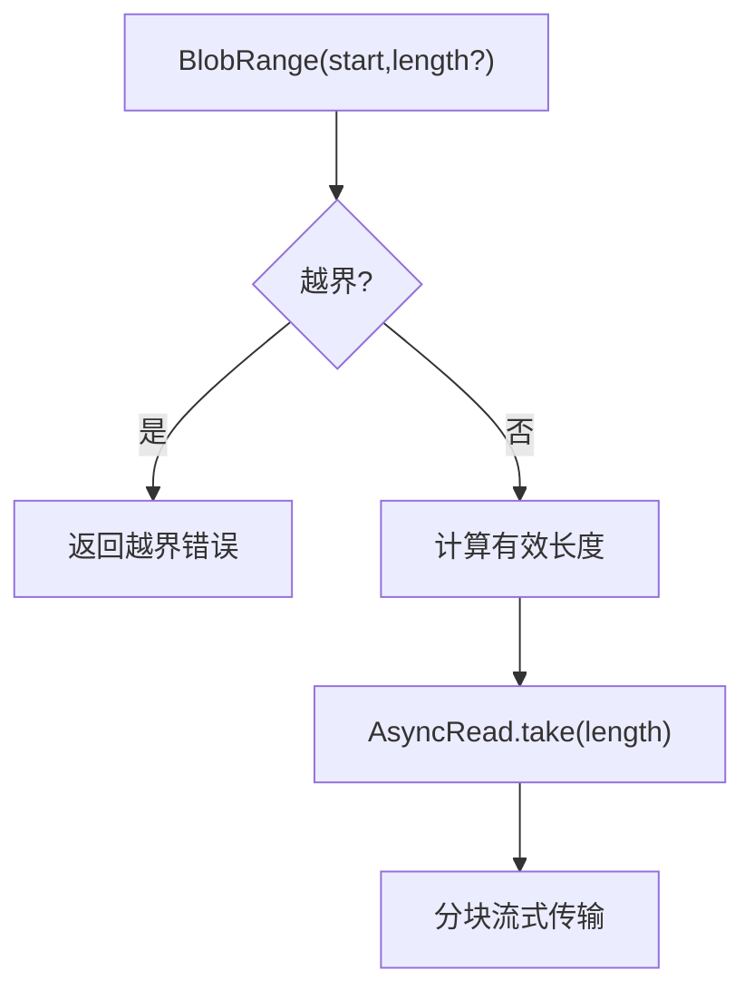
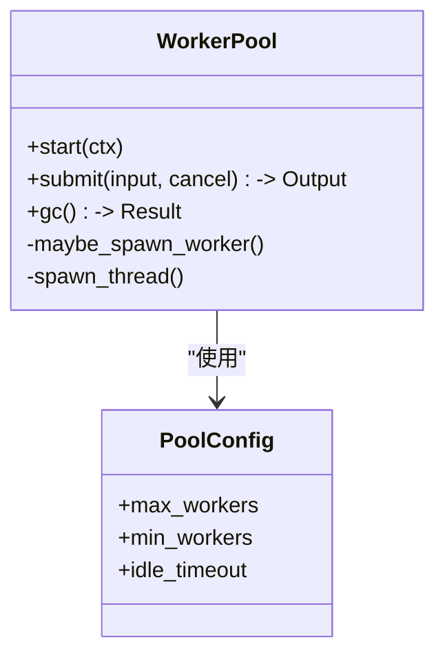
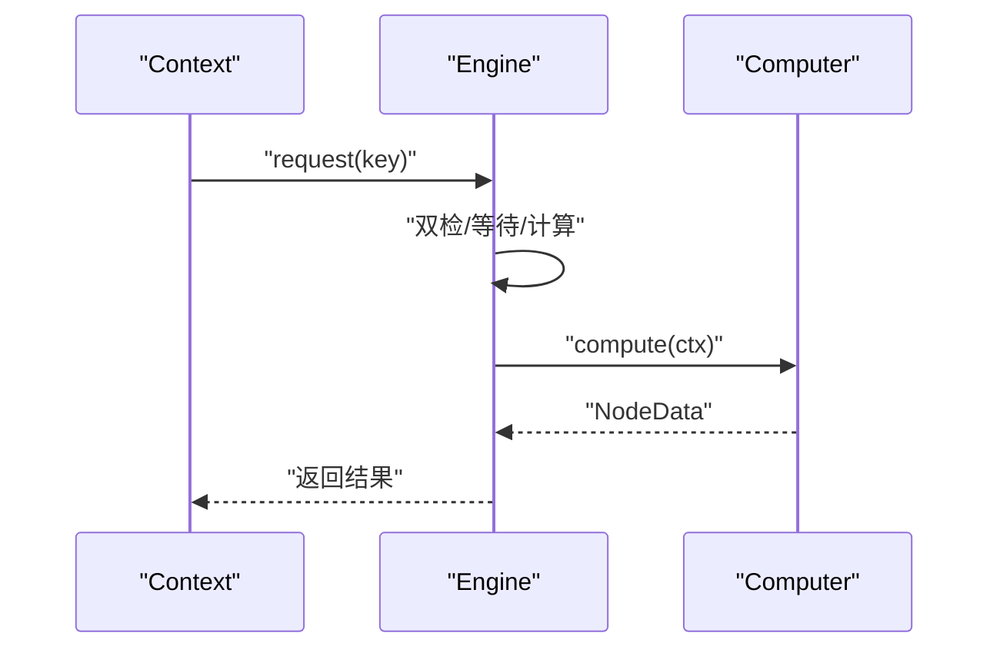
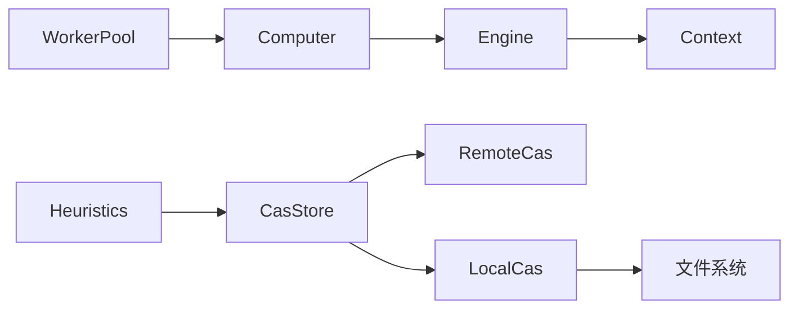

# 性能优化策略

<cite>
**本文引用的文件**
- [zako_core/src/cas.rs](file://zako_core/src/cas.rs)
- [zako_core/src/cas_store.rs](file://zako_core/src/cas_store.rs)
- [zako_core/src/local_cas.rs](file://zako_core/src/local_cas.rs)
- [zako_core/src/blob_range.rs](file://zako_core/src/blob_range.rs)
- [zako_core/src/computer.rs](file://zako_core/src/computer.rs)
- [zako_core/src/worker/worker_pool.rs](file://zako_core/src/worker/worker_pool.rs)
- [zako_core/src/resource/heuristics/mod.rs](file://zako_core/src/resource/heuristics/mod.rs)
- [zako_core/src/resource/heuristics/std.rs](file://zako_core/src/resource/heuristics/std.rs)
- [zako_core/src/compute/file.rs](file://zako_core/src/compute/file.rs)
- [hone/src/engine.rs](file://hone/src/engine.rs)
- [hone/src/context.rs](file://hone/src/context.rs)
- [zako_core/src/config.rs](file://zako_core/src/config.rs)
- [zako_core/src/fs.rs](file://zako_core/src/fs.rs)
- [zako_camino/camino-examples/benches/bench.rs](file://zako_camino/camino-examples/benches/bench.rs)
</cite>

## 目录
1. [引言](#引言)
2. [项目结构](#项目结构)
3. [核心组件](#核心组件)
4. [架构总览](#架构总览)
5. [详细组件分析](#详细组件分析)
6. [依赖关系分析](#依赖关系分析)
7. [性能考量与最佳实践](#性能考量与最佳实践)
8. [故障排查指南](#故障排查指南)
9. [结论](#结论)
10. [附录](#附录)

## 引言
本文件面向Zako的CAS（内容寻址存储）子系统，系统性阐述其缓存策略、预读与智能压缩思路、I/O优化、并发控制与内存管理、范围读取与分块传输、并行下载、容量规划与存储布局、监控与调优工具，并给出生产部署与运维监控策略。文档以代码为依据，结合架构图与流程图，帮助读者快速理解并落地优化。

## 项目结构
Zako的CAS相关能力主要集中在zako_core模块中，围绕Cas接口、CasStore统一入口、LocalCas本地存储、范围读取模型、工作池并发调度以及资源启发式配置等模块协同工作；上层由hone引擎驱动计算任务，最终通过compute/file.rs接入CAS进行文件输入与哈希校验。

图表来源
- [zako_core/src/cas.rs](file://zako_core/src/cas.rs#L1-L63)
- [zako_core/src/cas_store.rs](file://zako_core/src/cas_store.rs#L1-L156)
- [zako_core/src/local_cas.rs](file://zako_core/src/local_cas.rs#L1-L213)
- [zako_core/src/blob_range.rs](file://zako_core/src/blob_range.rs#L1-L139)
- [zako_core/src/computer.rs](file://zako_core/src/computer.rs#L1-L77)
- [zako_core/src/worker/worker_pool.rs](file://zako_core/src/worker/worker_pool.rs#L1-L185)
- [zako_core/src/resource/heuristics/mod.rs](file://zako_core/src/resource/heuristics/mod.rs#L1-L65)
- [hone/src/engine.rs](file://hone/src/engine.rs#L282-L409)
- [hone/src/context.rs](file://hone/src/context.rs#L111-L151)
- [zako_core/src/config.rs](file://zako_core/src/config.rs#L1-L119)
- [zako_core/src/fs.rs](file://zako_core/src/fs.rs#L1-L115)

章节来源
- [zako_core/src/cas.rs](file://zako_core/src/cas.rs#L1-L63)
- [zako_core/src/cas_store.rs](file://zako_core/src/cas_store.rs#L1-L156)
- [zako_core/src/local_cas.rs](file://zako_core/src/local_cas.rs#L1-L213)
- [zako_core/src/blob_range.rs](file://zako_core/src/blob_range.rs#L1-L139)
- [zako_core/src/computer.rs](file://zako_core/src/computer.rs#L1-L77)
- [zako_core/src/worker/worker_pool.rs](file://zako_core/src/worker/worker_pool.rs#L1-L185)
- [zako_core/src/resource/heuristics/mod.rs](file://zako_core/src/resource/heuristics/mod.rs#L1-L65)
- [hone/src/engine.rs](file://hone/src/engine.rs#L282-L409)
- [hone/src/context.rs](file://hone/src/context.rs#L111-L151)
- [zako_core/src/config.rs](file://zako_core/src/config.rs#L1-L119)
- [zako_core/src/fs.rs](file://zako_core/src/fs.rs#L1-L115)

## 核心组件
- Cas接口与错误模型：定义统一的存储、检查、存在性判断、按范围读取、本地路径查询等能力，并提供范围越界等错误类型。
- CasStore：统一入口，负责内存缓存命中、本地CAS回源、远程CAS回源、范围裁剪与错误转换。
- LocalCas：本地文件系统存储，采用两级目录分片、硬链接或复制、范围读取、内存映射加速大文件哈希。
- BlobRange：范围模型，支持半开区间、全量、起始偏移、长度与结束位置推导。
- Computer/Engine/Context：计算编排与依赖请求，支持取消令牌与并发安全。
- WorkerPool：线程池并发执行，支持动态扩容、空闲回收、GC触发。
- Heuristics：基于系统信息的内存缓存容量、TTL/TTI、工作线程数、Tokio栈大小、CAS本地路径等启发式配置。

章节来源
- [zako_core/src/cas.rs](file://zako_core/src/cas.rs#L1-L63)
- [zako_core/src/cas_store.rs](file://zako_core/src/cas_store.rs#L1-L156)
- [zako_core/src/local_cas.rs](file://zako_core/src/local_cas.rs#L1-L213)
- [zako_core/src/blob_range.rs](file://zako_core/src/blob_range.rs#L1-L139)
- [zako_core/src/computer.rs](file://zako_core/src/computer.rs#L1-L77)
- [zako_core/src/worker/worker_pool.rs](file://zako_core/src/worker/worker_pool.rs#L1-L185)
- [zako_core/src/resource/heuristics/mod.rs](file://zako_core/src/resource/heuristics/mod.rs#L1-L65)

## 架构总览
下图展示CAS读取主链路：内存缓存优先，其次本地CAS，最后远程CAS；范围读取在各层均受控，避免越界；错误在统一入口转换为标准错误类型。

图表来源
- [zako_core/src/cas_store.rs](file://zako_core/src/cas_store.rs#L59-L108)
- [zako_core/src/local_cas.rs](file://zako_core/src/local_cas.rs#L163-L201)
- [zako_core/src/cas.rs](file://zako_core/src/cas.rs#L10-L44)
- [zako_core/src/blob_range.rs](file://zako_core/src/blob_range.rs#L39-L104)

## 详细组件分析

### 组件A：Cas接口与错误模型
- 设计要点
  - 接口抽象：按内容寻址，支持范围读取、本地路径查询、存在性检查。
  - 错误模型：明确IO错误、未找到、索引越界等错误类型，便于上层统一处理。
- 性能影响
  - 范围读取前置校验，避免无效I/O。
  - 本地路径查询用于零拷贝直通场景（如sendfile）。

图表来源
- [zako_core/src/cas.rs](file://zako_core/src/cas.rs#L10-L63)

章节来源
- [zako_core/src/cas.rs](file://zako_core/src/cas.rs#L1-L63)

### 组件B：CasStore（统一入口与缓存）
- 缓存策略
  - 内存缓存：基于moka的Future Cache，按字节长度权重，支持TTL/TTI，容量上限。
  - 命中条件：digest命中且范围不越界；越界则直接报错。
  - 写入策略：小于阈值（例如64KB）的数据同时写入内存缓存与本地CAS；远端CAS异步写入。
- 预读机制
  - 通过范围裁剪与长度推导，仅拉取所需片段，减少带宽与CPU消耗。
- 智能压缩
  - 代码中未见显式压缩实现；可通过外部压缩/解压在应用层配合使用，但需权衡CPU与I/O。

图表来源
- [zako_core/src/cas_store.rs](file://zako_core/src/cas_store.rs#L59-L108)
- [zako_core/src/blob_range.rs](file://zako_core/src/blob_range.rs#L39-L104)

章节来源
- [zako_core/src/cas_store.rs](file://zako_core/src/cas_store.rs#L1-L156)
- [zako_core/src/blob_range.rs](file://zako_core/src/blob_range.rs#L1-L139)

### 组件C：LocalCas（本地存储与I/O优化）
- 存储布局
  - 两级目录分片：根据哈希前缀拆分，降低单目录文件数量。
- I/O优化
  - 大文件（>64KB）使用内存映射哈希，小文件使用流式读取。
  - 范围读取：seek到起始偏移后take指定长度，避免整文件加载。
  - 写入：临时文件+原子重命名，保证一致性。
- 并发与取消
  - 异步文件操作，结合取消令牌在上层链路中断。

图表来源
- [zako_core/src/local_cas.rs](file://zako_core/src/local_cas.rs#L31-L102)
- [zako_core/src/local_cas.rs](file://zako_core/src/local_cas.rs#L107-L212)

章节来源
- [zako_core/src/local_cas.rs](file://zako_core/src/local_cas.rs#L1-L213)

### 组件D：范围读取与分块传输
- BlobRange模型
  - 支持全量、起始偏移、长度与结束位置推导，提供越界检测。
- 分块传输
  - 通过AsyncRead::take实现分块读取，结合范围裁剪，适合HTTP分块/并行下载场景。
- 并行下载
  - 可在上层对多个digest并行发起open(fetch)，再各自take指定长度，实现多段并行下载。

图表来源
- [zako_core/src/blob_range.rs](file://zako_core/src/blob_range.rs#L39-L104)
- [zako_core/src/local_cas.rs](file://zako_core/src/local_cas.rs#L190-L201)
- [zako_core/src/cas_store.rs](file://zako_core/src/cas_store.rs#L65-L95)

章节来源
- [zako_core/src/blob_range.rs](file://zako_core/src/blob_range.rs#L1-L139)
- [zako_core/src/local_cas.rs](file://zako_core/src/local_cas.rs#L163-L201)
- [zako_core/src/cas_store.rs](file://zako_core/src/cas_store.rs#L59-L108)

### 组件E：并发控制与内存管理
- WorkerPool
  - 动态扩容：队列积压或无活跃线程时按上限扩容。
  - 空闲回收：超时未活动线程退出，降低资源占用。
  - GC触发：广播通道定期触发清理。
- 内存管理
  - CasStore内存缓存按字节长度计重，限制容量与TTL/TTI。
  - Heuristics提供内存缓存容量、TTL/TTI、线程数等启发式配置。

图表来源
- [zako_core/src/worker/worker_pool.rs](file://zako_core/src/worker/worker_pool.rs#L27-L185)

章节来源
- [zako_core/src/worker/worker_pool.rs](file://zako_core/src/worker/worker_pool.rs#L1-L185)
- [zako_core/src/resource/heuristics/mod.rs](file://zako_core/src/resource/heuristics/mod.rs#L11-L65)

### 组件F：执行链路与取消
- Computer/Engine/Context
  - 通过Engine.get编排计算，Context.request动态注册依赖边，支持取消令牌。
  - 计算完成后提交结果，避免重复计算。

图表来源
- [hone/src/context.rs](file://hone/src/context.rs#L111-L151)
- [hone/src/engine.rs](file://hone/src/engine.rs#L306-L409)
- [zako_core/src/computer.rs](file://zako_core/src/computer.rs#L24-L76)

章节来源
- [hone/src/context.rs](file://hone/src/context.rs#L111-L151)
- [hone/src/engine.rs](file://hone/src/engine.rs#L282-L409)
- [zako_core/src/computer.rs](file://zako_core/src/computer.rs#L1-L77)

## 依赖关系分析
- 组件耦合
  - CasStore依赖LocalCas与可选远端Cas，耦合度低，便于替换后端。
  - LocalCas实现Cas接口，直接依赖文件系统与内存映射。
  - Computer/Engine/Context为上层调度，与CAS解耦。
- 外部依赖
  - moka用于内存缓存，memmap2用于大文件哈希，tokio用于异步I/O。
- 潜在环路
  - 通过Engine的依赖图与取消令牌避免循环依赖导致的死锁。

图表来源
- [zako_core/src/cas_store.rs](file://zako_core/src/cas_store.rs#L22-L26)
- [zako_core/src/local_cas.rs](file://zako_core/src/local_cas.rs#L107-L212)
- [zako_core/src/computer.rs](file://zako_core/src/computer.rs#L16-L21)
- [zako_core/src/worker/worker_pool.rs](file://zako_core/src/worker/worker_pool.rs#L35-L42)
- [zako_core/src/resource/heuristics/mod.rs](file://zako_core/src/resource/heuristics/mod.rs#L9-L9)

章节来源
- [zako_core/src/cas_store.rs](file://zako_core/src/cas_store.rs#L1-L156)
- [zako_core/src/local_cas.rs](file://zako_core/src/local_cas.rs#L1-L213)
- [zako_core/src/computer.rs](file://zako_core/src/computer.rs#L1-L77)
- [zako_core/src/worker/worker_pool.rs](file://zako_core/src/worker/worker_pool.rs#L1-L185)
- [zako_core/src/resource/heuristics/mod.rs](file://zako_core/src/resource/heuristics/mod.rs#L1-L65)

## 性能考量与最佳实践

### 缓存策略
- 内存缓存
  - 容量：建议按系统总内存的约10%，并限制在4MB~4GB之间。
  - TTL/TTI：默认30分钟TTL、5分钟TTI，可根据热点数据特征调整。
  - 权重：按字节数计重，避免大对象长期驻留。
- LRU与淘汰
  - 使用moka的LRU策略，结合TTL/TTI，平衡冷热数据与内存压力。

章节来源
- [zako_core/src/resource/heuristics/mod.rs](file://zako_core/src/resource/heuristics/mod.rs#L11-L25)
- [zako_core/src/cas_store.rs](file://zako_core/src/cas_store.rs#L44-L56)

### 预读机制
- 范围读取优先：通过BlobRange精确裁剪，避免整块数据传输。
- 大文件哈希：>64KB使用内存映射，显著降低CPU与内存拷贝成本。
- 写入预热：小文件写入内存缓存，提升后续读取命中率。

章节来源
- [zako_core/src/local_cas.rs](file://zako_core/src/local_cas.rs#L31-L70)
- [zako_core/src/cas_store.rs](file://zako_core/src/cas_store.rs#L123-L150)

### 智能压缩
- 现状：代码库未发现内置压缩实现。
- 建议：在应用层对静态资源启用gzip/br等压缩，结合ETag/Range头实现条件与分段传输，平衡CPU与网络带宽。

### I/O优化
- 目录分片：两级前缀分片，降低单目录文件数，提高FS性能。
- 原子写入：临时文件+重命名，避免部分写入与并发冲突。
- 范围读取：seek+take，避免整文件加载。

章节来源
- [zako_core/src/local_cas.rs](file://zako_core/src/local_cas.rs#L26-L29)
- [zako_core/src/local_cas.rs](file://zako_core/src/local_cas.rs#L130-L147)
- [zako_core/src/local_cas.rs](file://zako_core/src/local_cas.rs#L190-L201)

### 并发控制
- 动态扩容：根据队列积压自动增减线程，避免过载与饥饿。
- 空闲回收：超时线程退出，降低常驻线程成本。
- 工作池配置：建议最小1，最大为CPU核数/2左右，空闲超时1分钟。

章节来源
- [zako_core/src/worker/worker_pool.rs](file://zako_core/src/worker/worker_pool.rs#L121-L138)
- [zako_core/src/resource/heuristics/mod.rs](file://zako_core/src/resource/heuristics/mod.rs#L31-L49)

### 内存管理
- 内存缓存阈值：小于此阈值（如64KB）的对象进入内存缓存。
- TTL/TTI：短期热点数据保持高命中，避免长期占用内存。
- Tokio栈大小：建议4MB，避免大任务栈溢出。

章节来源
- [zako_core/src/cas_store.rs](file://zako_core/src/cas_store.rs#L129-L134)
- [zako_core/src/resource/heuristics/mod.rs](file://zako_core/src/resource/heuristics/mod.rs#L51-L54)

### 范围读取、分块传输与并行下载
- 范围模型：全量、起始偏移、长度、结束位置推导，越界即错。
- 分块传输：AsyncRead::take实现，适合HTTP Range与CDN分发。
- 并行下载：对多个digest并行open，各自take指定长度，合并输出。

章节来源
- [zako_core/src/blob_range.rs](file://zako_core/src/blob_range.rs#L39-L104)
- [zako_core/src/local_cas.rs](file://zako_core/src/local_cas.rs#L190-L201)
- [zako_core/src/cas_store.rs](file://zako_core/src/cas_store.rs#L65-L95)

### 容量规划、存储布局与磁盘管理
- 容量规划：内存缓存容量=总内存×10%，限制在4MB~4GB；CAS本地目录容量按峰值吞吐与保留周期估算。
- 存储布局：两级前缀分片，避免单目录过大；定期清理过期缓存。
- 磁盘管理：使用SSD作为CAS根目录；监控inode与空间使用率；设置合理的TTL/TTI降低碎片。

章节来源
- [zako_core/src/resource/heuristics/mod.rs](file://zako_core/src/resource/heuristics/mod.rs#L11-L17)
- [zako_core/src/local_cas.rs](file://zako_core/src/local_cas.rs#L26-L29)

### 监控指标、性能分析与调优工具
- 指标建议
  - CAS命中率、平均响应时间、内存缓存容量、远端命中率、I/O延迟分布。
  - CPU使用率、线程池队列长度、空闲线程数、GC频率。
- 分析工具
  - 使用criterion进行路径与哈希性能基准；结合tracing观测关键路径耗时。
- 调优建议
  - 根据热点数据调整TTL/TTI；扩大内存缓存容量；优化线程池大小；启用SSD与合适的文件系统参数。

章节来源
- [zako_camino/camino-examples/benches/bench.rs](file://zako_camino/camino-examples/benches/bench.rs#L10-L21)
- [zako_core/src/resource/heuristics/mod.rs](file://zako_core/src/resource/heuristics/mod.rs#L51-L54)

### 生产部署与运维监控策略
- 部署
  - CAS根目录置于高性能存储；容器内挂载持久化卷；合理设置ulimit与文件句柄。
- 运维
  - 定期巡检：缓存命中率、磁盘空间、inode使用、日志错误率。
  - 告警：命中率骤降、I/O延迟突增、内存缓存溢出、远端连接失败。
  - 回滚：灰度发布新版本，观察关键指标；异常立即回滚。

## 故障排查指南
- 常见问题
  - 范围越界：检查BlobRange构造与文件实际长度，确保start与length合法。
  - 未找到：确认digest正确、本地/远端存储可用、权限与路径正确。
  - I/O错误：检查磁盘空间、权限、文件系统健康。
- 定位方法
  - 启用tracing，定位具体环节（内存/本地/远端）。
  - 观察线程池队列长度与空闲线程数，判断并发是否过载。
- 解决方案
  - 调整TTL/TTI与容量；扩大线程池；优化存储布局；启用SSD。

章节来源
- [zako_core/src/cas.rs](file://zako_core/src/cas.rs#L46-L62)
- [zako_core/src/cas_store.rs](file://zako_core/src/cas_store.rs#L65-L108)
- [zako_core/src/local_cas.rs](file://zako_core/src/local_cas.rs#L182-L188)

## 结论
Zako的CAS子系统通过清晰的接口抽象、多级缓存与范围读取、内存映射与原子写入等手段，在保证一致性的同时兼顾性能。结合动态线程池、启发式资源配置与可观测性，可在不同规模与硬件环境下稳定运行。建议在生产中持续监控关键指标，按需调优缓存与并发参数，并配合SSD与合理的存储布局获得最佳收益。

## 附录
- 配置参数清单（建议）
  - 内存缓存容量：总内存×10%，限制4MB~4GB
  - 内存TTL：30分钟
  - 内存TTI：5分钟
  - 线程池最大线程：CPU核数/2
  - 线程池最小线程：1
  - 线程池空闲超时：1分钟
  - Tokio线程栈大小：4MB
  - CAS本地目录：系统缓存目录/zako/cas
- 性能指标参考
  - CAS命中率：>90%
  - 平均读取延迟：<10ms（内存命中）
  - 平均写入延迟：<50ms（小文件）
  - 线程池队列长度：峰值<10
  - I/O延迟P95：<50ms