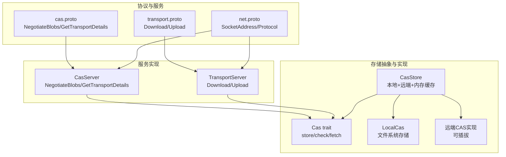
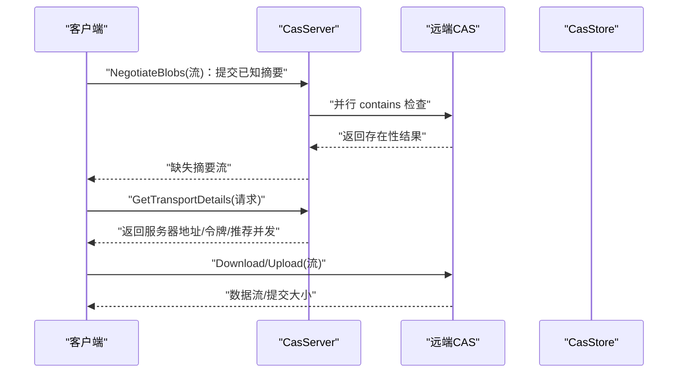
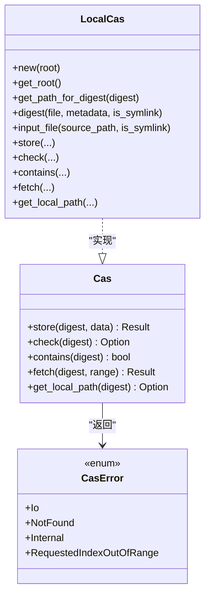
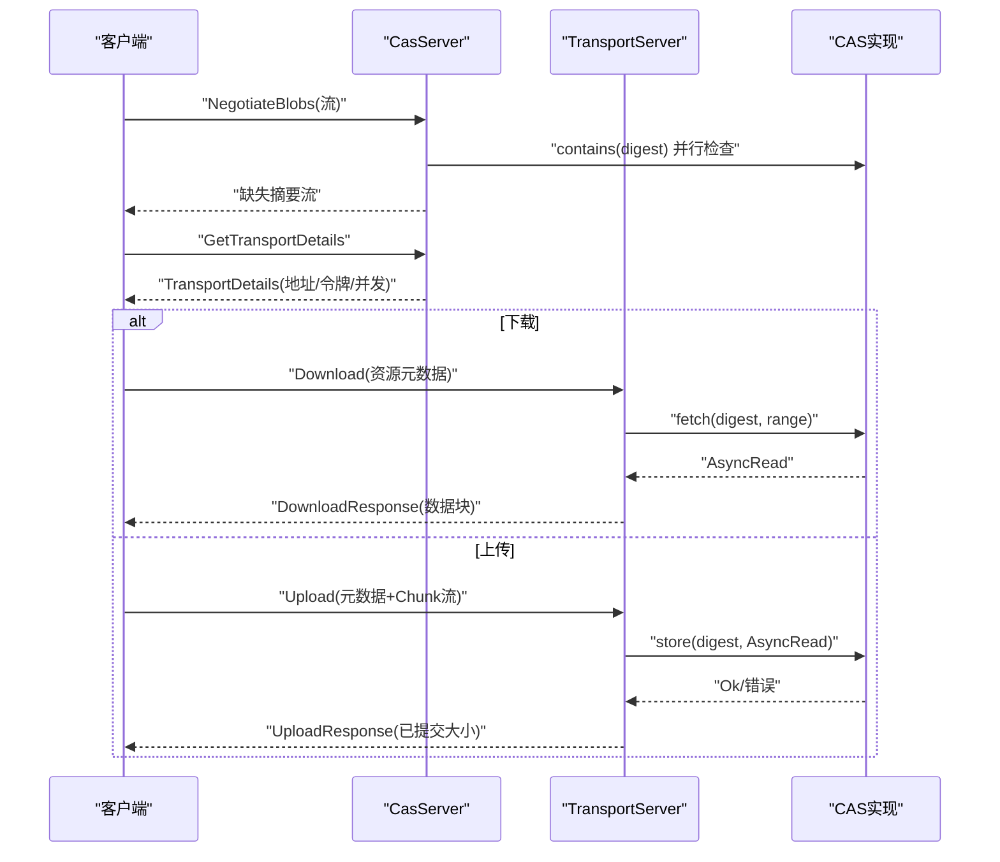
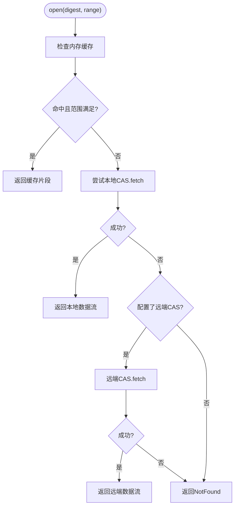
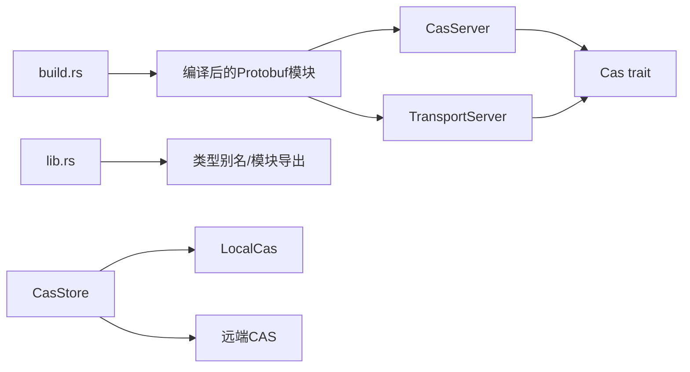

# 远程同步机制

<cite>
**本文引用的文件**
- [zako_core/src/cas.rs](file://zako_core/src/cas.rs)
- [zako_core/src/local_cas.rs](file://zako_core/src/local_cas.rs)
- [zako_core/src/cas_server.rs](file://zako_core/src/cas_server.rs)
- [zako_core/src/cas_store.rs](file://zako_core/src/cas_store.rs)
- [zako_core/src/transport_server.rs](file://zako_core/src/transport_server.rs)
- [zako_core/src/protobuf/cas.proto](file://zako_core/src/protobuf/cas.proto)
- [zako_core/src/protobuf/transport.proto](file://zako_core/src/protobuf/transport.proto)
- [zako_core/src/protobuf/net.proto](file://zako_core/src/protobuf/net.proto)
- [zako_core/src/access_control.rs](file://zako_core/src/access_control.rs)
- [zako_core/src/config.rs](file://zako_core/src/config.rs)
- [zako_core/src/lib.rs](file://zako_core/src/lib.rs)
- [zako_core/build.rs](file://zako_core/build.rs)
</cite>

## 目录
1. [引言](#引言)
2. [项目结构](#项目结构)
3. [核心组件](#核心组件)
4. [架构总览](#架构总览)
5. [详细组件分析](#详细组件分析)
6. [依赖关系分析](#依赖关系分析)
7. [性能考量](#性能考量)
8. [故障排查指南](#故障排查指南)
9. [结论](#结论)
10. [附录](#附录)

## 引言
本文件面向Zako的远程同步机制，系统化阐述其分布式内容寻址存储（CAS）的同步策略、一致性保障与冲突处理方式；详解远程服务器的实现原理、数据传输与状态管理；解释缓存同步算法、增量更新与批量操作的优化策略；并给出同步配置、网络参数与性能调优建议，以及集群部署、负载均衡与故障转移的实现方案。同时覆盖数据完整性验证、传输加密与访问控制等安全措施，并处理常见同步问题、网络分区与性能瓶颈的解决方案。

## 项目结构
Zako围绕“内容寻址存储（CAS）+ gRPC 传输服务”的双层架构组织远程同步能力：
- 存储接口与实现：统一的CAS trait抽象，本地CAS实现与可插拔的远端CAS实现。
- 协议与服务：通过Protobuf定义CAS协商与传输服务，gRPC提供双向流式与请求-响应交互。
- 缓存与存储聚合：CasStore聚合本地与远端CAS，并引入内存缓存以提升读取性能。
- 安全与配置：访问控制模型与配置解析体系，为远程访问控制与行为配置提供基础。

图表来源
- [zako_core/src/protobuf/cas.proto](file://zako_core/src/protobuf/cas.proto#L1-L32)
- [zako_core/src/protobuf/transport.proto](file://zako_core/src/protobuf/transport.proto#L1-L38)
- [zako_core/src/protobuf/net.proto](file://zako_core/src/protobuf/net.proto#L1-L20)
- [zako_core/src/cas_server.rs](file://zako_core/src/cas_server.rs#L1-L149)
- [zako_core/src/transport_server.rs](file://zako_core/src/transport_server.rs#L1-L138)
- [zako_core/src/cas.rs](file://zako_core/src/cas.rs#L1-L63)
- [zako_core/src/local_cas.rs](file://zako_core/src/local_cas.rs#L1-L213)
- [zako_core/src/cas_store.rs](file://zako_core/src/cas_store.rs#L1-L156)

章节来源
- [zako_core/src/lib.rs](file://zako_core/src/lib.rs#L82-L118)
- [zako_core/build.rs](file://zako_core/build.rs#L1-L17)

## 核心组件
- CAS接口与错误模型：统一的异步读写接口、范围读取、存在性检查与错误类型，确保上层一致的异常语义。
- 本地CAS：基于文件系统的内容寻址存储，采用两级目录散列与硬链接/软链接策略，支持范围读取与本地路径暴露。
- 远程CAS协商与传输：通过gRPC服务进行“协商缺失blob”和“获取传输详情”，并提供下载/上传流式传输。
- CasStore：聚合本地与远端CAS，并引入内存缓存，优先命中缓存，其次本地，最后远端，未命中返回NotFound。
- 访问控制与配置：可见性与传递级别模型，以及配置解析与哈希体系，为远程访问控制与行为配置提供基础。

章节来源
- [zako_core/src/cas.rs](file://zako_core/src/cas.rs#L1-L63)
- [zako_core/src/local_cas.rs](file://zako_core/src/local_cas.rs#L1-L213)
- [zako_core/src/cas_server.rs](file://zako_core/src/cas_server.rs#L1-L149)
- [zako_core/src/transport_server.rs](file://zako_core/src/transport_server.rs#L1-L138)
- [zako_core/src/cas_store.rs](file://zako_core/src/cas_store.rs#L1-L156)
- [zako_core/src/access_control.rs](file://zako_core/src/access_control.rs#L1-L19)
- [zako_core/src/config.rs](file://zako_core/src/config.rs#L1-L119)

## 架构总览
Zako的远程同步由“协商-传输”两阶段组成：
- 协商阶段：客户端向服务器发送已知的blob摘要列表，服务器并行检查本地是否存在，返回缺失集合。
- 传输阶段：客户端根据服务器返回的传输详情（地址、令牌、推荐并发），选择合适的协议进行下载或上传。

图表来源
- [zako_core/src/cas_server.rs](file://zako_core/src/cas_server.rs#L64-L147)
- [zako_core/src/transport_server.rs](file://zako_core/src/transport_server.rs#L28-L136)
- [zako_core/src/cas_store.rs](file://zako_core/src/cas_store.rs#L59-L108)

## 详细组件分析

### CAS接口与错误模型
- 接口职责：提供store、check、contains、fetch、get_local_path等方法，支持按需范围读取与本地路径暴露。
- 错误模型：统一的错误类型，覆盖IO、NotFound、内部存储错误与索引越界等情形，便于上层进行差异化处理。

图表来源
- [zako_core/src/cas.rs](file://zako_core/src/cas.rs#L11-L63)
- [zako_core/src/local_cas.rs](file://zako_core/src/local_cas.rs#L12-L213)

章节来源
- [zako_core/src/cas.rs](file://zako_core/src/cas.rs#L1-L63)
- [zako_core/src/local_cas.rs](file://zako_core/src/local_cas.rs#L1-L213)

### 远程CAS协商与传输服务
- 协商服务（NegotiateBlobs）：接收客户端的摘要流，服务器并行检查本地是否存在，返回缺失摘要流，支持高并发与背压。
- 传输详情（GetTransportDetails）：根据客户端支持的协议选择可用协议，生成一次性令牌与推荐并发度，返回服务器地址。
- 传输服务（Download/Upload）：Download按资源元数据与范围从CAS读取数据并流式返回；Upload接收首包元数据后，后续Chunk流式写入CAS。

图表来源
- [zako_core/src/cas_server.rs](file://zako_core/src/cas_server.rs#L64-L147)
- [zako_core/src/transport_server.rs](file://zako_core/src/transport_server.rs#L28-L136)
- [zako_core/src/protobuf/cas.proto](file://zako_core/src/protobuf/cas.proto#L8-L31)
- [zako_core/src/protobuf/transport.proto](file://zako_core/src/protobuf/transport.proto#L14-L37)

章节来源
- [zako_core/src/cas_server.rs](file://zako_core/src/cas_server.rs#L1-L149)
- [zako_core/src/transport_server.rs](file://zako_core/src/transport_server.rs#L1-L138)
- [zako_core/src/protobuf/cas.proto](file://zako_core/src/protobuf/cas.proto#L1-L32)
- [zako_core/src/protobuf/transport.proto](file://zako_core/src/protobuf/transport.proto#L1-L38)
- [zako_core/src/protobuf/net.proto](file://zako_core/src/protobuf/net.proto#L1-L20)

### CasStore缓存与同步算法
- 命中顺序：内存缓存 → 本地CAS → 远端CAS → NotFound。
- 内存缓存：基于moka的Future Cache，容量、TTL、TTI可配置，按值长度计重，适合小对象内联缓存。
- 写入策略：put_bytes时先计算blake3摘要，小于阈值（约64KB）则缓存，随后写入本地CAS；若配置了远端CAS，则同步写入远端CAS。
- 读取策略：open按范围裁剪缓存片段；若缓存不满足范围需求，则回退至本地或远端CAS；失败返回NotFound。

图表来源
- [zako_core/src/cas_store.rs](file://zako_core/src/cas_store.rs#L59-L108)

章节来源
- [zako_core/src/cas_store.rs](file://zako_core/src/cas_store.rs#L1-L156)

### 一致性与冲突处理
- 内容寻址：所有数据以blake3摘要作为唯一标识，天然避免重复与冲突。
- 读一致性：fetch支持范围读取，若请求超出范围返回“索引越界”错误，防止越界读导致的数据不一致。
- 写一致性：上传前检查远端CAS是否已存在，若存在则返回“已存在”错误，避免重复写入。
- 协商一致性：NegotiateBlobs采用并行检查，返回缺失摘要，客户端据此决定传输方向，减少不必要的数据往返。

章节来源
- [zako_core/src/cas.rs](file://zako_core/src/cas.rs#L38-L62)
- [zako_core/src/transport_server.rs](file://zako_core/src/transport_server.rs#L98-L105)
- [zako_core/src/cas_server.rs](file://zako_core/src/cas_server.rs#L76-L107)

### 数据完整性与传输安全
- 完整性：blake3摘要用于校验数据一致性，结合范围读取与越界检查，确保读取安全。
- 传输安全：当前协议仅支持grpc，认证通过令牌（一次性UUID）传递；建议在部署层叠加TLS（如mTLS）以实现传输加密与身份认证。
- 访问控制：通过Visibility与TransitiveLevel模型定义资源可见性与传递级别，结合远程访问策略实现细粒度权限控制。

章节来源
- [zako_core/src/protobuf/net.proto](file://zako_core/src/protobuf/net.proto#L17-L20)
- [zako_core/src/cas_server.rs](file://zako_core/src/cas_server.rs#L139-L146)
- [zako_core/src/access_control.rs](file://zako_core/src/access_control.rs#L1-L19)

### 增量更新与批量优化
- 增量：通过NegotiateBlobs仅传输缺失blob，显著降低带宽占用。
- 并发：协商阶段使用buffer_unordered限制并行度，避免过载；传输阶段返回recommended_concurrency供客户端自适应并发。
- 批量：下载/上传均采用流式处理，支持大文件分块传输；上传端统计committed_size，便于断点续传与进度跟踪。

章节来源
- [zako_core/src/cas_server.rs](file://zako_core/src/cas_server.rs#L71-L93)
- [zako_core/src/transport_server.rs](file://zako_core/src/transport_server.rs#L107-L135)

## 依赖关系分析
- Protobuf编译：通过build.rs统一编译cas、transport、net、range等协议，确保客户端与服务端接口一致。
- 类型别名：lib.rs导出ConcurrentCache、ConcurrentMap等类型别名，简化上层使用。
- 组件耦合：CasServer与TransportServer均依赖CAS trait，解耦具体存储实现；CasStore聚合多存储源，形成统一入口。

图表来源
- [zako_core/build.rs](file://zako_core/build.rs#L1-L17)
- [zako_core/src/lib.rs](file://zako_core/src/lib.rs#L82-L118)
- [zako_core/src/cas_server.rs](file://zako_core/src/cas_server.rs#L1-L57)
- [zako_core/src/transport_server.rs](file://zako_core/src/transport_server.rs#L1-L22)
- [zako_core/src/cas_store.rs](file://zako_core/src/cas_store.rs#L22-L26)

章节来源
- [zako_core/build.rs](file://zako_core/build.rs#L1-L17)
- [zako_core/src/lib.rs](file://zako_core/src/lib.rs#L82-L118)

## 性能考量
- 缓存策略
  - 内存缓存：针对小对象（约64KB以下）启用内联缓存，减少磁盘与网络开销；合理设置max_cache_capacity、max_cache_ttl、max_cache_tti。
  - 本地CAS：采用两级目录散列与硬链接/软链接，降低目录项数量与inode压力；大文件使用mmap加速哈希。
- 并发与背压
  - 协商阶段：buffered_io_count限制并行检查数量，避免IO风暴；根据CPU核数与磁盘能力动态调整。
  - 传输阶段：recommended_concurrency指导客户端并发，结合网络状况自适应调节。
- 网络参数
  - 建议开启TLS（如mTLS）与合理的超时、重试策略；对gRPC启用HTTP/2与连接复用。
- I/O优化
  - 大文件优先使用mmap；小文件使用流式复制；范围读取避免全量传输。

[本节为通用性能建议，无需特定文件引用]

## 故障排查指南
- 常见错误与定位
  - NotFound：本地与远端均未找到对应摘要，检查上传是否完成或摘要是否正确。
  - RequestedIndexOutOfRange：请求范围超出blob长度，检查范围参数与blob实际长度。
  - AlreadyExists：远端已存在相同摘要，检查去重策略与幂等性。
  - failed_precondition/invalid_argument：协议不匹配或消息格式错误，检查客户端与服务端版本与协议。
- 网络分区
  - 通过NegotiateBlobs进行增量同步，减少分区期间的无效传输；结合断点续传与重试策略。
- 性能瓶颈
  - 若发现IO瓶颈，适当增大buffered_io_count与recommended_concurrency；若CPU瓶颈，降低并发或优化哈希策略。
  - 若内存压力大，减小max_cache_capacity或缩短max_cache_ttl/TTI。

章节来源
- [zako_core/src/cas.rs](file://zako_core/src/cas.rs#L46-L62)
- [zako_core/src/transport_server.rs](file://zako_core/src/transport_server.rs#L51-L67)
- [zako_core/src/cas_server.rs](file://zako_core/src/cas_server.rs#L117-L147)

## 结论
Zako的远程同步机制以内容寻址为核心，通过gRPC的协商与传输服务实现高效、一致的分布式同步。CasStore在内存、本地与远端之间建立多级缓存与回退路径，配合NegotiateBlobs的增量策略与并行检查，有效降低带宽与延迟。结合访问控制与配置体系，可在部署层叠加TLS与权限策略，满足生产环境的一致性、安全性与可运维性要求。

[本节为总结性内容，无需特定文件引用]

## 附录

### 同步配置与参数建议
- CasStoreOptions
  - max_cache_capacity：根据可用内存设定，建议占物理内存的10%-20%。
  - max_cache_ttl：建议10-60分钟，平衡热点命中与内存回收。
  - max_cache_tti：建议1-10分钟，避免陈旧数据长期驻留。
- CasServerOptions
  - buffered_io_count：建议与CPU核数相当，或根据磁盘吞吐调整。
  - recommended_concurrency：建议与网络带宽和客户端数量匹配，避免过度并发导致拥塞。
- 传输细节
  - GetTransportDetails返回的recommended_concurrency可作为客户端并发起点，结合实时带宽自适应。

章节来源
- [zako_core/src/cas_store.rs](file://zako_core/src/cas_store.rs#L28-L56)
- [zako_core/src/cas_server.rs](file://zako_core/src/cas_server.rs#L15-L35)

### 集群部署与高可用
- 负载均衡：gRPC服务可水平扩展，客户端通过GetTransportDetails获取多个服务器地址，实现轮询或一致性哈希。
- 故障转移：当某节点不可用时，客户端重试其他节点；结合健康检查与熔断策略，提升可用性。
- 一致性：通过blake3摘要与幂等写入（AlreadyExists）保证最终一致；必要时引入版本号或时间戳辅助仲裁。

[本节为通用部署建议，无需特定文件引用]

### 安全加固清单
- 传输加密：在gRPC之上启用TLS（建议mTLS），强制双向认证。
- 访问控制：利用Visibility与TransitiveLevel模型，结合网关或代理实现ACL策略。
- 令牌管理：严格限制auth_token有效期与使用次数，避免泄露风险。
- 审计日志：记录NegotiateBlobs与Download/Upload的关键事件，便于追踪与审计。

章节来源
- [zako_core/src/cas_server.rs](file://zako_core/src/cas_server.rs#L139-L146)
- [zako_core/src/access_control.rs](file://zako_core/src/access_control.rs#L1-L19)