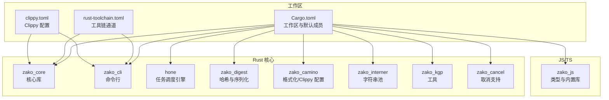
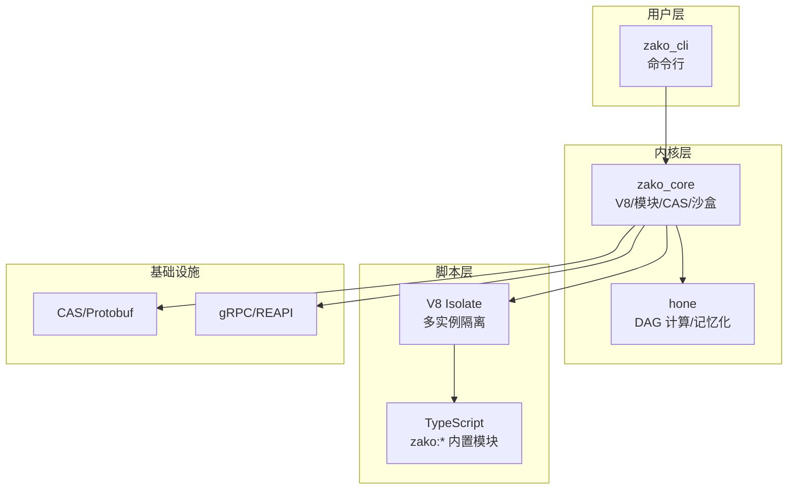
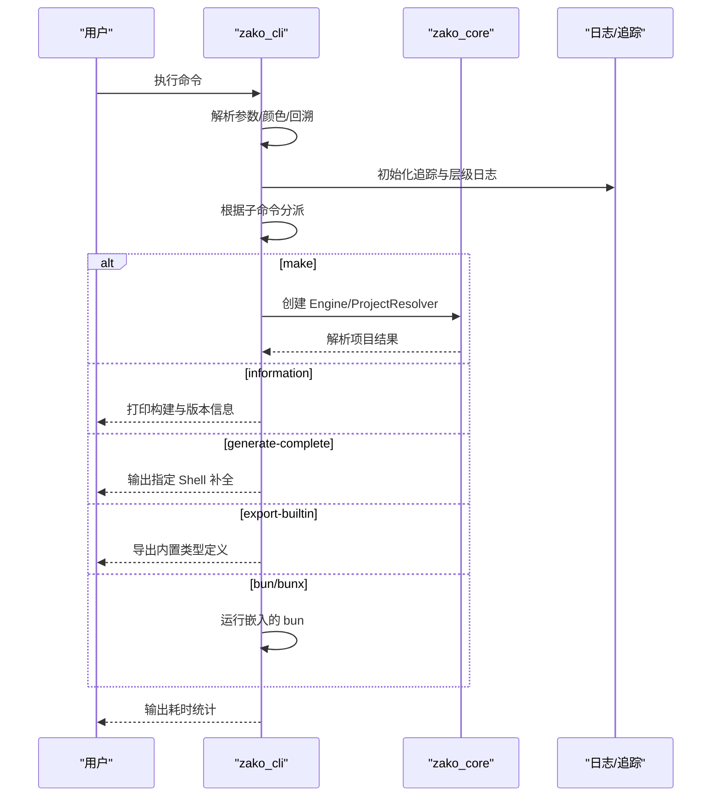
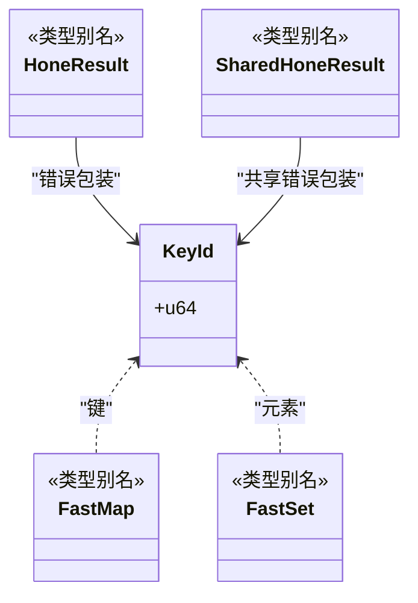
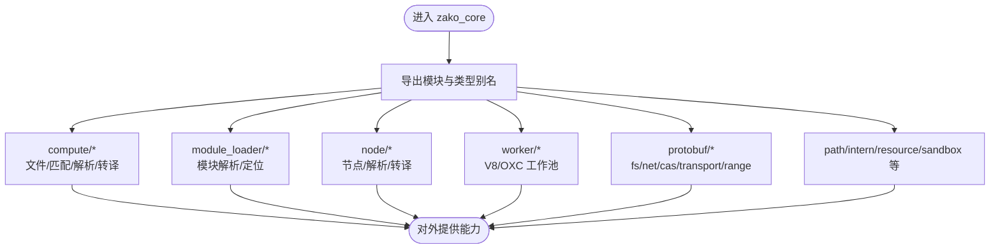
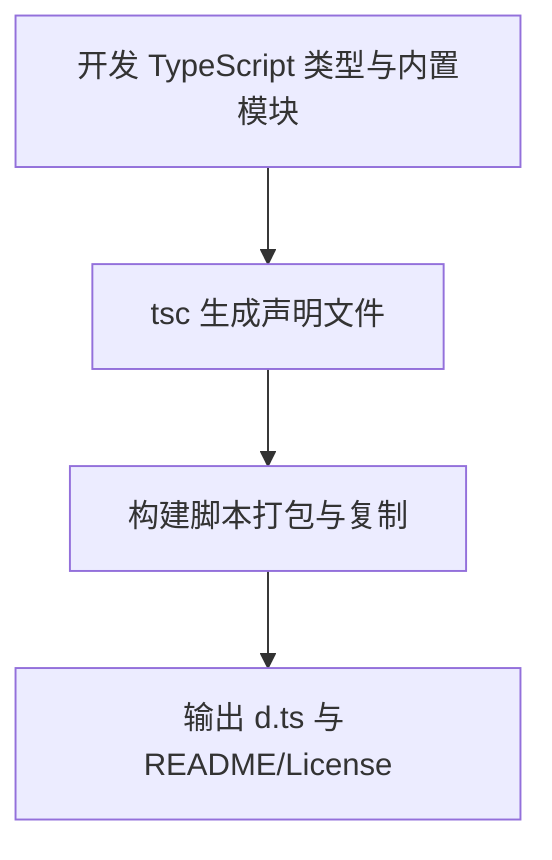
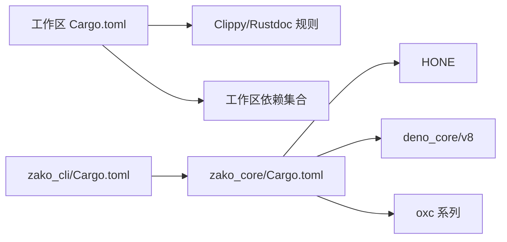

# 开发者指南

<cite>
**本文档引用的文件**
- [Cargo.toml](file://Cargo.toml)
- [rust-toolchain.toml](file://rust-toolchain.toml)
- [clippy.toml](file://clippy.toml)
- [zako_cli/Cargo.toml](file://zako_cli/Cargo.toml)
- [zako_core/Cargo.toml](file://zako_core/Cargo.toml)
- [zako_camino/rustfmt.toml](file://zako_camino/rustfmt.toml)
- [zako_camino/clippy.toml](file://zako_camino/clippy.toml)
- [build.json](file://build.json)
- [cli.ts](file://cli.ts)
- [zako_core/src/lib.rs](file://zako_core/src/lib.rs)
- [zako_cli/src/main.rs](file://zako_cli/src/main.rs)
- [hone/src/lib.rs](file://hone/src/lib.rs)
- [zako_js/package.json](file://zako_js/package.json)
- [ARCHITECTURE.md](file://ARCHITECTURE.md)
- [AIInstruction.md](file://AIInstruction.md)
- [CONTRIBUTING.md](file://CONTRIBUTING.md)
- [README.md](file://README.md)
</cite>

## 目录
1. [简介](#简介)
2. [项目结构](#项目结构)
3. [核心组件](#核心组件)
4. [架构总览](#架构总览)
5. [详细组件分析](#详细组件分析)
6. [依赖分析](#依赖分析)
7. [性能考虑](#性能考虑)
8. [故障排查指南](#故障排查指南)
9. [结论](#结论)
10. [附录](#附录)

## 简介
本指南面向新贡献者与核心开发者，系统阐述 Zako 项目的开发流程、代码规范、环境设置、社区参与、代码审查与测试、文档与发布流程、开发工具与 IDE 配置、调试环境搭建、代码风格与命名约定、架构设计原则以及项目治理与沟通渠道。内容基于仓库现有文件整理，确保实用与可操作。

## 项目结构
Zako 采用多 Crate 工作区组织，包含 Rust 内核、CLI、任务调度引擎、哈希与序列化、JS/TS 类型与内置库等模块。顶层工作区统一管理依赖与 lint 规则，便于一致性与可维护性。

图表来源
- [Cargo.toml](file://Cargo.toml#L11-L22)
- [rust-toolchain.toml](file://rust-toolchain.toml#L1-L5)
- [clippy.toml](file://clippy.toml#L1-L2)
- [zako_core/Cargo.toml](file://zako_core/Cargo.toml#L1-L141)
- [zako_cli/Cargo.toml](file://zako_cli/Cargo.toml#L1-L77)
- [zako_camino/rustfmt.toml](file://zako_camino/rustfmt.toml#L1-L4)
- [zako_camino/clippy.toml](file://zako_camino/clippy.toml#L1-L2)
- [zako_js/package.json](file://zako_js/package.json#L1-L49)

章节来源
- [Cargo.toml](file://Cargo.toml#L11-L22)
- [rust-toolchain.toml](file://rust-toolchain.toml#L1-L5)
- [clippy.toml](file://clippy.toml#L1-L2)
- [zako_core/Cargo.toml](file://zako_core/Cargo.toml#L1-L141)
- [zako_cli/Cargo.toml](file://zako_cli/Cargo.toml#L1-L77)
- [zako_camino/rustfmt.toml](file://zako_camino/rustfmt.toml#L1-L4)
- [zako_camino/clippy.toml](file://zako_camino/clippy.toml#L1-L2)
- [zako_js/package.json](file://zako_js/package.json#L1-L49)

## 核心组件
- zako_core：系统内核，负责 V8 运行时管理、模块加载、CAS 协议、沙盒执行与项目解析，导出大量模块与类型别名，包含 Protobuf 命名空间。
- zako_cli：命令行入口，提供信息打印、补全生成、构建执行、Bun 代理等功能，集成 OpenTelemetry 与分级日志。
- hone：通用递归式计算引擎，将构建任务建模为 DAG，支持并行与记忆化。
- zako_digest：定义通用 Protobuf 协议与高性能哈希逻辑。
- zako_js：为构建脚本提供 TypeScript 类型与内置 API（如 zako:core）。
- zako_camino：格式化与 Clippy 配置，约束风格与最低版本。
- 其他：zako_interner、zako_kgp、zako_cancel 等支撑模块。

章节来源
- [zako_core/src/lib.rs](file://zako_core/src/lib.rs#L1-L119)
- [zako_cli/src/main.rs](file://zako_cli/src/main.rs#L1-L739)
- [hone/src/lib.rs](file://hone/src/lib.rs#L1-L34)
- [ARCHITECTURE.md](file://ARCHITECTURE.md#L16-L27)
- [AIInstruction.md](file://AIInstruction.md#L27-L50)

## 架构总览
Zako 采用“Rust 内核 + TypeScript/V8 脚本”的混合执行模型，强调确定性、封闭性与内容寻址存储（CAS）。计算核心由 hone 引擎提供，脚本运行时通过 deno_core/v8 隔离执行，按文件层级施加权限约束。

图表来源
- [ARCHITECTURE.md](file://ARCHITECTURE.md#L44-L54)
- [AIInstruction.md](file://AIInstruction.md#L37-L60)
- [zako_core/src/lib.rs](file://zako_core/src/lib.rs#L98-L118)

章节来源
- [ARCHITECTURE.md](file://ARCHITECTURE.md#L1-L152)
- [AIInstruction.md](file://AIInstruction.md#L1-L167)

## 详细组件分析

### zako_cli 组件分析
- 职责：命令行入口，负责参数解析、颜色与回溯控制、OpenTelemetry 日志、缓冲输出、Bun 代理、补全生成与信息打印。
- 关键流程：参数解析 → 初始化日志与追踪 → 根据子命令分派执行 → 输出耗时统计 → 退出码控制。
- 错误处理：统一使用 color-eyre 与自定义 panic hook，确保错误与回溯清晰可见。

图表来源
- [zako_cli/src/main.rs](file://zako_cli/src/main.rs#L501-L622)
- [zako_cli/src/main.rs](file://zako_cli/src/main.rs#L296-L333)
- [zako_cli/src/main.rs](file://zako_cli/src/main.rs#L344-L388)
- [zako_cli/src/main.rs](file://zako_cli/src/main.rs#L270-L293)
- [zako_cli/src/main.rs](file://zako_cli/src/main.rs#L223-L246)

章节来源
- [zako_cli/src/main.rs](file://zako_cli/src/main.rs#L1-L739)

### hone 组件分析
- 职责：通用递归式计算引擎，将构建任务抽象为 Key/Value 映射，支持并行与记忆化。
- 数据结构：KeyId、FastMap/FastSet、HoneResult 等类型别名，便于并发与确定性。
- 存储：使用 redb 表定义节点、父子关系等持久化结构。

图表来源
- [hone/src/lib.rs](file://hone/src/lib.rs#L12-L34)

章节来源
- [hone/src/lib.rs](file://hone/src/lib.rs#L1-L34)

### zako_core 组件分析
- 模块组织：导出访问控制、作者、Blob、计算、上下文、引擎、扩展、文件查找、路径、资源、传输、V8 上下文等模块。
- 类型别名：ConcurrentMap/Set/Cache 等，统一并发容器与缓存策略。
- Protobuf：通过 tonic include 自动生成命名空间，便于 gRPC/REAPI 互操作。

图表来源
- [zako_core/src/lib.rs](file://zako_core/src/lib.rs#L30-L80)
- [zako_core/src/lib.rs](file://zako_core/src/lib.rs#L98-L118)

章节来源
- [zako_core/src/lib.rs](file://zako_core/src/lib.rs#L1-L119)

### zako_js 组件分析
- 职责：提供 TypeScript 类型定义与内置模块（如 zako:core、zako:project、zako:build、zako:rule、zako:toolchain）。
- 构建：通过 tsc 生成 d.ts，配合脚本打包与复制绑定文件。
- 依赖：@std/semver、semver、json5 等生态库。

图表来源
- [zako_js/package.json](file://zako_js/package.json#L39-L46)

章节来源
- [zako_js/package.json](file://zako_js/package.json#L1-L49)

## 依赖分析
- 工作区统一 lint：Clippy 禁止 unwrap/expect/panic，Rustdoc 禁止缺失文档与无效链接。
- 工具链：nightly 通道，启用 rust-src 以支持构建 std。
- 构建选项：启用 build-std 以支持裸机/自定义标准库构建。
- CLI 与核心：zako_cli 依赖 zako_core，zako_core 依赖 hone、deno_core、oxc 等。

图表来源
- [Cargo.toml](file://Cargo.toml#L24-L36)
- [rust-toolchain.toml](file://rust-toolchain.toml#L1-L5)
- [build.json](file://build.json#L1-L9)
- [zako_cli/Cargo.toml](file://zako_cli/Cargo.toml#L21-L51)
- [zako_core/Cargo.toml](file://zako_core/Cargo.toml#L16-L108)

章节来源
- [Cargo.toml](file://Cargo.toml#L24-L36)
- [rust-toolchain.toml](file://rust-toolchain.toml#L1-L5)
- [build.json](file://build.json#L1-L9)
- [zako_cli/Cargo.toml](file://zako_cli/Cargo.toml#L1-L77)
- [zako_core/Cargo.toml](file://zako_core/Cargo.toml#L1-L141)

## 性能考虑
- 运行时与内存：使用 mimalloc 全局分配器，提升内存分配性能。
- 并发与缓存：ConcurrentMap/Set/Cache 类型别名统一并发容器与缓存策略，减少锁竞争。
- 构建配置：dev/release/profile 调优，release 启用 fat LTO 与单代码生成单元以优化体积与运行时性能。
- I/O 与压缩：zstd 压缩嵌入二进制，减少体积与加载时间。

章节来源
- [zako_cli/src/main.rs](file://zako_cli/src/main.rs#L29-L31)
- [zako_core/src/lib.rs](file://zako_core/src/lib.rs#L82-L96)
- [Cargo.toml](file://Cargo.toml#L286-L312)
- [zako_cli/Cargo.toml](file://zako_cli/Cargo.toml#L57-L58)

## 故障排查指南
- 回溯与日志：通过 backtrace 参数与 RUST_* 环境变量控制回溯级别；彩色错误钩子增强可读性。
- 静默模式：silent 模式下缓冲输出，避免干扰自动化流水线。
- 目录切换：chdir 参数改变工作目录，注意 argfile 仍从当前目录读取。
- Bun 代理：当脚本以 shebang 开头时，CLI 将参数转发给嵌入的 bun 执行。
- 信息打印：information 子命令输出构建信息、版本、分支、提交等，便于诊断。

章节来源
- [zako_cli/src/main.rs](file://zako_cli/src/main.rs#L94-L121)
- [zako_cli/src/main.rs](file://zako_cli/src/main.rs#L452-L499)
- [zako_cli/src/main.rs](file://zako_cli/src/main.rs#L567-L594)
- [zako_cli/src/main.rs](file://zako_cli/src/main.rs#L521-L527)
- [zako_cli/src/main.rs](file://zako_cli/src/main.rs#L394-L450)

## 结论
Zako 通过 Rust 内核与 TypeScript/V8 的混合架构，在确定性、可复现性与可伸缩性之间取得平衡。工作区统一的 lint 与工具链配置、CLI 的可观测性与错误处理、以及清晰的模块边界，为新老贡献者提供了稳定而高效的开发体验。建议在贡献前先熟悉架构文档与 AI 指令，确保设计与实现符合项目原则。

## 附录

### 开发环境设置
- 工具链：安装 nightly 通道与 rust-src 组件。
- 构建选项：启用 build-std 以支持自定义标准库构建。
- CLI 快速构建：通过 cli.ts 调用 cargo +nightly 构建 zako-cli，并输出到 release_debug。

章节来源
- [rust-toolchain.toml](file://rust-toolchain.toml#L1-L5)
- [build.json](file://build.json#L1-L9)
- [cli.ts](file://cli.ts#L1-L15)

### 代码规范与风格
- Clippy：工作区禁止 unwrap/expect/panic，Rustdoc 禁止缺失文档与无效链接；Camino 子项目设置 MSRV。
- Rustfmt：统一 edition/style_edition 与字段简写风格。
- 命名与标识符：遵循 AI 指令中的包标识符、版本与目标标识符规则，支持 Unicode 与 kebab-case。

章节来源
- [Cargo.toml](file://Cargo.toml#L24-L36)
- [clippy.toml](file://clippy.toml#L1-L2)
- [zako_camino/clippy.toml](file://zako_camino/clippy.toml#L1-L2)
- [zako_camino/rustfmt.toml](file://zako_camino/rustfmt.toml#L1-L4)
- [AIInstruction.md](file://AIInstruction.md#L108-L158)

### 贡献流程与社区参与
- 贡献指南：当前 CONTRIBUTING.md 为占位，建议补充 PR 流程、审阅要求与行为准则。
- 社区沟通：README 中 Issues 报告为占位，建议明确沟通渠道与问题模板。
- 代码审查：遵循工作区 Clippy 与 Rustdoc 规则，确保文档与稳定性。

章节来源
- [CONTRIBUTING.md](file://CONTRIBUTING.md#L1-L6)
- [README.md](file://README.md#L27-L30)
- [Cargo.toml](file://Cargo.toml#L24-L36)

### 测试与质量保障
- 测试策略：Rust 侧通过各 crate/tests 目录组织单元与集成测试；JS/TS 侧通过包内脚本与类型检查保障。
- 覆盖范围：建议在新增模块时补充对应测试，并保持 Clippy 与 Rustdoc 通过。

章节来源
- [zako_core/Cargo.toml](file://zako_core/Cargo.toml#L1-L141)
- [zako_js/package.json](file://zako_js/package.json#L39-L46)

### 文档与发布
- 文档：ARCHITECTURE.md 与 AIInstruction.md 提供架构与设计约束；建议补充 API 文档与最佳实践。
- 发布：CLI 提供信息打印与版本输出，便于发布后验证。

章节来源
- [ARCHITECTURE.md](file://ARCHITECTURE.md#L142-L151)
- [AIInstruction.md](file://AIInstruction.md#L160-L167)
- [zako_cli/src/main.rs](file://zako_cli/src/main.rs#L394-L450)

### 开发工具与 IDE 设置
- CLI：使用 Bun 作为脚本运行器，通过 cli.ts 快速构建与调试。
- Rust：启用 Clippy 与 Rustdoc 检查，配合 rustfmt 统一风格。
- JS/TS：使用 tsc 生成声明文件，配合 d.ts 打包脚本。

章节来源
- [cli.ts](file://cli.ts#L1-L15)
- [clippy.toml](file://clippy.toml#L1-L2)
- [zako_camino/rustfmt.toml](file://zako_camino/rustfmt.toml#L1-L4)
- [zako_js/package.json](file://zako_js/package.json#L39-L46)