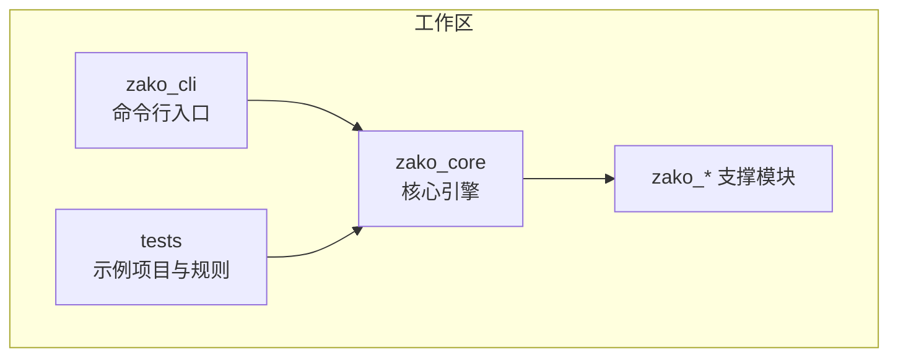
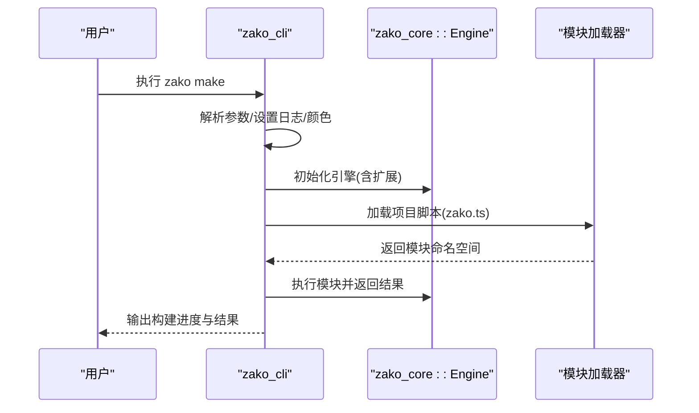
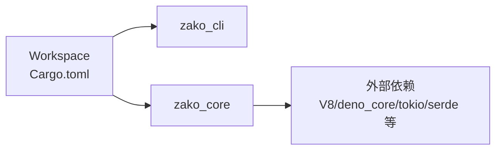

# 快速开始

<cite>
**本文引用的文件**
- [README.md](file://README.md)
- [Cargo.toml](file://Cargo.toml)
- [rust-toolchain.toml](file://rust-toolchain.toml)
- [cli.ts](file://cli.ts)
- [zako_cli/src/main.rs](file://zako_cli/src/main.rs)
- [zako_core/src/lib.rs](file://zako_core/src/lib.rs)
- [zako_core/src/engine.rs](file://zako_core/src/engine.rs)
- [zako_core/Cargo.toml](file://zako_core/Cargo.toml)
- [tests/new_project/zako.json](file://tests/new_project/zako.json)
- [tests/new_project/zako.ts](file://tests/new_project/zako.ts)
- [tests/log_version/BUILD.ts](file://tests/log_version/BUILD.ts)
- [tests/log_version/zako.ts](file://tests/log_version/zako.ts)
- [build.json](file://build.json)
</cite>

## 目录
1. [简介](#简介)
2. [项目结构](#项目结构)
3. [核心组件](#核心组件)
4. [架构总览](#架构总览)
5. [详细组件分析](#详细组件分析)
6. [依赖关系分析](#依赖关系分析)
7. [性能考虑](#性能考虑)
8. [故障排除指南](#故障排除指南)
9. [结论](#结论)
10. [附录](#附录)

## 简介
本指南面向首次接触 Zako 构建系统的新手，目标是在约 30 分钟内完成安装、环境准备与首次构建任务。你将学会：
- 安装前置工具（Rust 工具链、Bun）
- 配置工作目录与项目脚本
- 创建第一个项目与构建规则
- 执行构建并查看结果
- 常见问题排查与最佳实践

Zako 是一个现代化的构建工具，支持远程构建、远程缓存、强大的命名体系以及可分享的构建脚本生态。

## 项目结构
仓库采用 Rust Workspace 组织，核心模块包括：
- zako_cli：命令行入口，提供 make、bun、bunx、information、export-builtin、generate-complete 等子命令
- zako_core：核心引擎与类型系统，负责解析项目、加载模块、执行 JS/TS 规则与工具链
- zako_* 相关包：如 zako_digest、zako_interner、hone 等支撑模块
- tests：示例项目与规则，包含 new_project 与 log_version 两套样例

图表来源
- [Cargo.toml](file://Cargo.toml#L11-L22)
- [zako_cli/src/main.rs](file://zako_cli/src/main.rs#L123-L131)
- [zako_core/src/lib.rs](file://zako_core/src/lib.rs#L29-L30)

章节来源
- [Cargo.toml](file://Cargo.toml#L11-L22)
- [zako_core/src/lib.rs](file://zako_core/src/lib.rs#L29-L30)

## 核心组件
- 命令行接口（CLI）：提供 make、bun、bunx、information、export-builtin、generate-complete 等子命令，支持颜色输出、静默模式、参数文件（argfile）等特性
- 引擎（Engine）：基于 V8 的 JS 运行时，加载内置扩展与模块，执行 TypeScript/JavaScript 构建脚本与规则
- 类型与文件约定：library、script、package manifest、project root、build、rule、toolchain、config 等文件类型与命名规范由类型系统约束

章节来源
- [zako_cli/src/main.rs](file://zako_cli/src/main.rs#L123-L131)
- [zako_cli/src/main.rs](file://zako_cli/src/main.rs#L296-L333)
- [zako_core/src/engine.rs](file://zako_core/src/engine.rs#L34-L79)
- [zako_core/src/lib.rs](file://zako_core/src/lib.rs#L14-L28)

## 架构总览
Zako 的构建流程以 CLI 为入口，解析参数后调用核心引擎；引擎初始化 V8 平台与扩展，加载项目脚本与规则，最终执行构建任务。

图表来源
- [zako_cli/src/main.rs](file://zako_cli/src/main.rs#L501-L622)
- [zako_core/src/engine.rs](file://zako_core/src/engine.rs#L48-L109)

章节来源
- [zako_cli/src/main.rs](file://zako_cli/src/main.rs#L501-L622)
- [zako_core/src/engine.rs](file://zako_core/src/engine.rs#L48-L109)

## 详细组件分析

### 安装与环境准备
- Rust 工具链
  - 使用 nightly 版本并启用 rust-src 组件
  - 可通过 rustup 安装与切换工具链
- Bun
  - 用于运行脚本与打包内置二进制（如 bun）
- 项目构建脚本
  - 提供一键构建脚本，自动调用 cargo +nightly 构建 zako-cli

章节来源
- [rust-toolchain.toml](file://rust-toolchain.toml#L1-L5)
- [cli.ts](file://cli.ts#L6-L12)
- [build.json](file://build.json#L1-L9)

### 创建你的第一个项目
- 项目元数据
  - 在项目根创建 zako.json，定义 group、artifact、version、description、license、authors、workspaces 与 options
- 项目入口
  - 在项目根创建 zako.ts，导入 zako:project 并导出项目配置
- 添加构建与规则
  - 在 zako.ts 中使用 project.addBuild 与 project.addRule 添加构建范围与规则

章节来源
- [tests/new_project/zako.json](file://tests/new_project/zako.json#L1-L18)
- [tests/new_project/zako.ts](file://tests/new_project/zako.ts#L1-L22)

### 编写构建规则
- 示例规则
  - 使用 BUILD.ts 定义构建目标（如 ccLibrary、ccBinary），并通过 project.config 控制行为
- 规则与工具链
  - 规则文件仅能访问抽象工具链，工具链文件可访问系统

章节来源
- [tests/log_version/BUILD.ts](file://tests/log_version/BUILD.ts#L1-L21)
- [tests/log_version/zako.ts](file://tests/log_version/zako.ts#L1-L13)
- [zako_core/src/lib.rs](file://zako_core/src/lib.rs#L14-L28)

### 执行构建
- 基本命令
  - 使用 zako make 执行默认项目脚本（默认文件名由核心常量指定）
- 参数说明
  - 支持指定项目文件路径、沙盒目录、并发度等
- 日志与颜色
  - 支持彩色输出、静默模式、参数文件（argfile）

章节来源
- [zako_cli/src/main.rs](file://zako_cli/src/main.rs#L296-L333)
- [zako_cli/src/main.rs](file://zako_cli/src/main.rs#L123-L131)

### 导出内置类型
- 用途
  - 将内置 TypeScript 类型导出到文件或标准输出，便于 IDE 或编辑器类型检查
- 命令
  - zako export-builtin [--output-file <path>]

章节来源
- [zako_cli/src/main.rs](file://zako_cli/src/main.rs#L270-L293)

### 生成补全
- 用途
  - 为 Bash、Elvish、Fish、PowerShell、Zsh 生成补全文件
- 命令
  - zako generate-complete --shell <bash|elvish|fish|powershell|zsh> [--bin-name <name>] [--output-file <path>]

章节来源
- [zako_cli/src/main.rs](file://zako_cli/src/main.rs#L344-L388)

### 信息与调试
- 用途
  - 打印构建信息、版本、Git 信息、编译时间等
- 命令
  - zako information

章节来源
- [zako_cli/src/main.rs](file://zako_cli/src/main.rs#L392-L450)

## 依赖关系分析
Zako 通过 Cargo Workspace 组织模块，zako_cli 默认成员包含 zako_core，核心依赖包括 V8、deno_core、tokio、serde 等。

图表来源
- [Cargo.toml](file://Cargo.toml#L11-L22)
- [zako_core/Cargo.toml](file://zako_core/Cargo.toml#L16-L138)

章节来源
- [Cargo.toml](file://Cargo.toml#L11-L22)
- [zako_core/Cargo.toml](file://zako_core/Cargo.toml#L16-L138)

## 性能考虑
- 并发度
  - 使用 --concurrency 指定 CPU 数量，未指定时默认使用逻辑核心数
- 运行时
  - 引擎使用多线程 Tokio 运行时与 V8 平台，适合并行构建场景
- 缓存与远程能力
  - 支持远程缓存与远程构建，建议结合 CI/CD 使用以提升整体吞吐

章节来源
- [zako_cli/src/main.rs](file://zako_cli/src/main.rs#L308-L314)
- [zako_core/src/engine.rs](file://zako_core/src/engine.rs#L48-L79)

## 故障排除指南
- 工具链版本不匹配
  - 确认已安装并切换到 nightly 工具链，且包含 rust-src 组件
- 构建失败或找不到模块
  - 检查项目脚本路径与沙盒目录是否正确
  - 确保模块加载器能够解析 zako:* 内置模块
- 输出无颜色或静默
  - 使用 --no-silent 或调整颜色选择
- 参数文件（argfile）问题
  - 确保 @response_file 语法正确，参数按行分隔
- 崩溃与回溯
  - 使用 --backtrace 查看详细回溯信息；必要时设置 RUST_BACKTRACE 环境变量

章节来源
- [rust-toolchain.toml](file://rust-toolchain.toml#L1-L5)
- [zako_cli/src/main.rs](file://zako_cli/src/main.rs#L521-L527)
- [zako_cli/src/main.rs](file://zako_cli/src/main.rs#L596-L599)
- [zako_cli/src/main.rs](file://zako_cli/src/main.rs#L452-L499)

## 结论
通过本指南，你已经完成了 Zako 的安装与环境准备，创建了第一个项目并编写了构建规则，最后成功执行了构建任务。建议在实际项目中结合远程缓存与 CI/CD，进一步提升效率与一致性。

## 附录

### 常用命令清单
- 安装与构建
  - 安装 nightly 工具链并启用 rust-src
  - 使用一键脚本构建 zako-cli
- 运行构建
  - zako make [--project-file <path>] [--sandbox-dir <path>] [--concurrency <n>]
- 辅助功能
  - zako export-builtin [--output-file <path>]
  - zako generate-complete --shell <bash|elvish|fish|powershell|zsh> [--bin-name <name>] [--output-file <path>]
  - zako information

章节来源
- [rust-toolchain.toml](file://rust-toolchain.toml#L1-L5)
- [cli.ts](file://cli.ts#L6-L12)
- [zako_cli/src/main.rs](file://zako_cli/src/main.rs#L296-L333)
- [zako_cli/src/main.rs](file://zako_cli/src/main.rs#L270-L293)
- [zako_cli/src/main.rs](file://zako_cli/src/main.rs#L344-L388)
- [zako_cli/src/main.rs](file://zako_cli/src/main.rs#L392-L450)