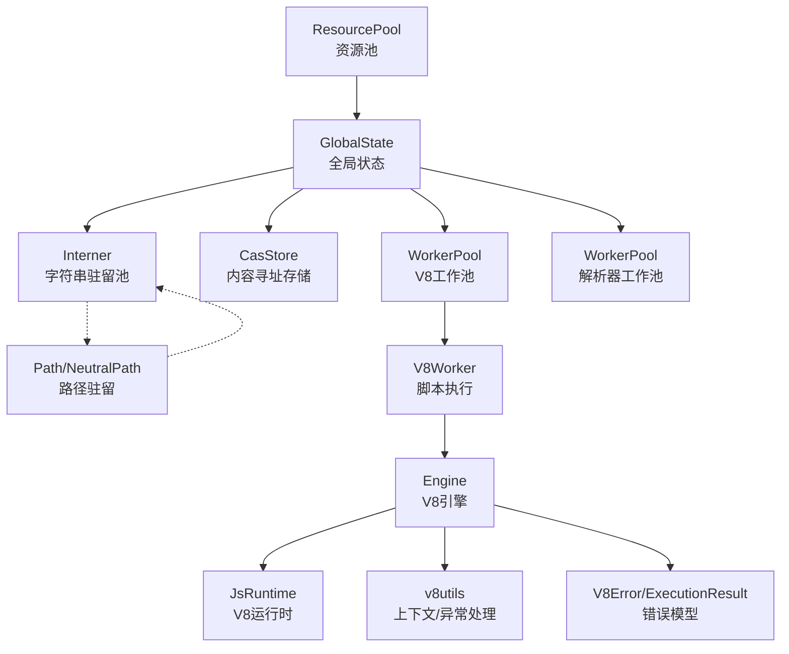
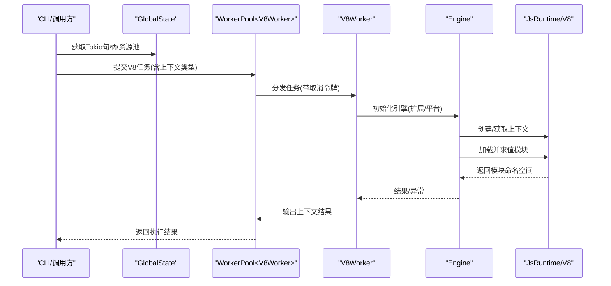
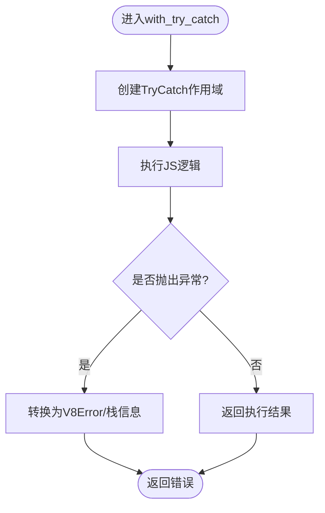
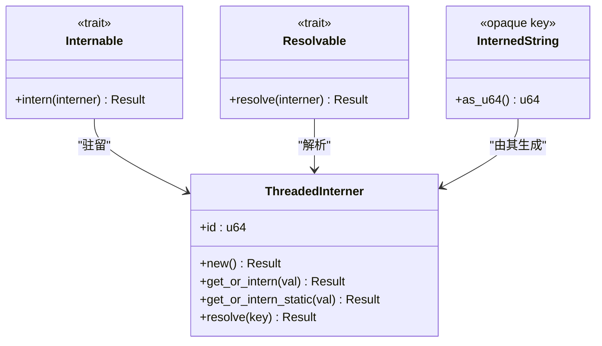
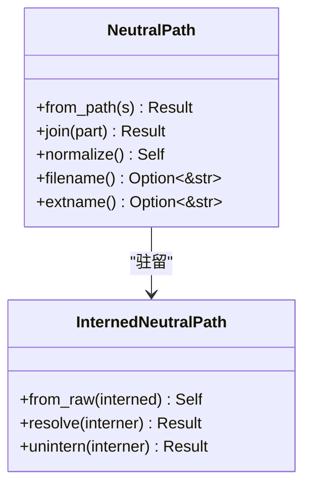
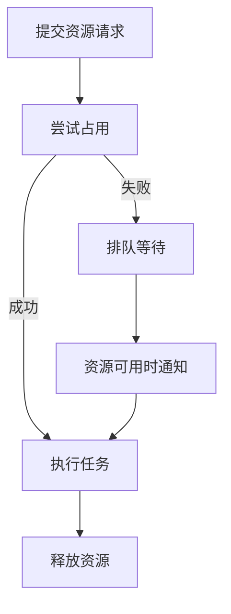
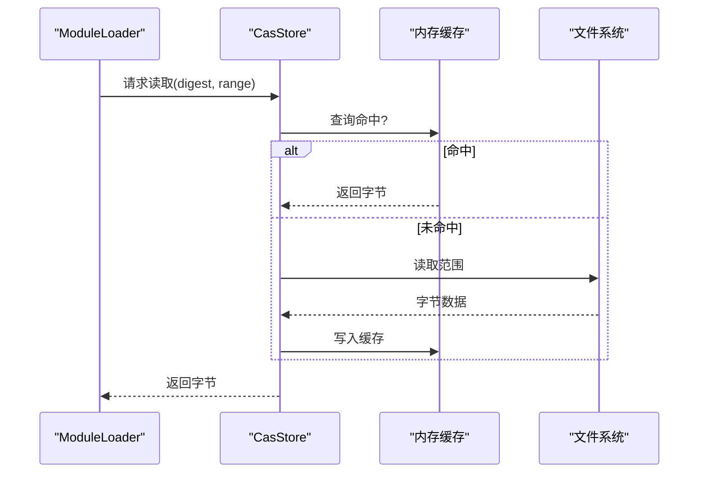
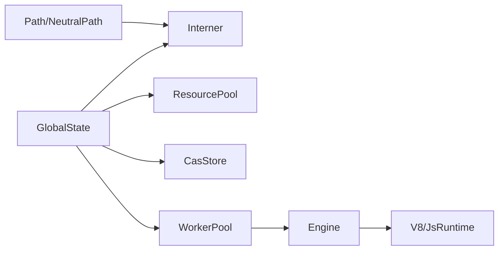

# 内存管理优化

<cite>
**本文引用的文件**
- [zako_core/src/v8context.rs](file://zako_core/src/v8context.rs)
- [zako_core/src/v8utils.rs](file://zako_core/src/v8utils.rs)
- [zako_core/src/engine.rs](file://zako_core/src/engine.rs)
- [zako_core/src/v8platform.rs](file://zako_core/src/v8platform.rs)
- [zako_core/src/v8error.rs](file://zako_core/src/v8error.rs)
- [zako_core/src/worker/v8worker.rs](file://zako_core/src/worker/v8worker.rs)
- [zako_core/src/worker/worker_pool.rs](file://zako_core/src/worker/worker_pool.rs)
- [zako_core/src/global_state.rs](file://zako_core/src/global_state.rs)
- [zako_core/src/intern.rs](file://zako_core/src/intern.rs)
- [zako_core/src/path/mod.rs](file://zako_core/src/path/mod.rs)
- [zako_core/src/path/interned.rs](file://zako_core/src/path/interned.rs)
- [zako_interner/src/lib.rs](file://zako_interner/src/lib.rs)
- [zako_core/src/resource/mod.rs](file://zako_core/src/resource/mod.rs)
- [zako_core/src/cas_store.rs](file://zako_core/src/cas_store.rs)
- [zako_core/src/blob_handle.rs](file://zako_core/src/blob_handle.rs)
- [zako_core/src/module_loader/mod.rs](file://zako_core/src/module_loader/mod.rs)
</cite>

## 目录
1. [引言](#引言)
2. [项目结构](#项目结构)
3. [核心组件](#核心组件)
4. [架构总览](#架构总览)
5. [详细组件分析](#详细组件分析)
6. [依赖关系分析](#依赖关系分析)
7. [性能考量](#性能考量)
8. [故障排查指南](#故障排查指南)
9. [结论](#结论)
10. [附录](#附录)

## 引言
本指南聚焦于Zako在构建系统中的内存管理优化，涵盖V8内存与生命周期管理、字符串驻留优化、路径与中性路径缓存、内存池与资源分配、垃圾回收与压力处理、以及内存泄漏检测与常见问题的定位与修复。文档以实际源码为依据，结合可视化图示帮助读者快速掌握关键机制与最佳实践。

## 项目结构
Zako采用分层设计：全局状态持有跨进程共享的资源（如字符串驻留池、CAS存储、工作池）；引擎负责V8运行时初始化与模块执行；工作池承载V8与解析器等耗时任务；路径与中性路径模块提供跨平台路径抽象与驻留；内核模块通过资源池协调CPU/内存/网络等资源争用。

**图表来源**
- [zako_core/src/global_state.rs](file://zako_core/src/global_state.rs#L41-L96)
- [zako_core/src/engine.rs](file://zako_core/src/engine.rs#L34-L79)
- [zako_core/src/worker/worker_pool.rs](file://zako_core/src/worker/worker_pool.rs#L35-L54)
- [zako_core/src/worker/v8worker.rs](file://zako_core/src/worker/v8worker.rs#L55-L81)
- [zako_core/src/resource/mod.rs](file://zako_core/src/resource/mod.rs#L106-L135)
- [zako_core/src/intern.rs](file://zako_core/src/intern.rs#L5-L27)
- [zako_core/src/path/mod.rs](file://zako_core/src/path/mod.rs#L27-L52)

**章节来源**
- [zako_core/src/global_state.rs](file://zako_core/src/global_state.rs#L41-L96)
- [zako_core/src/resource/mod.rs](file://zako_core/src/resource/mod.rs#L106-L135)

## 核心组件
- 字符串驻留池：基于线程安全的哈希驻留，减少重复字符串拷贝，降低V8侧内存占用与GC压力。
- 中性路径与绝对路径驻留：统一路径表示，避免跨平台差异带来的重复存储。
- V8引擎与运行时：封装上下文、TryCatch、事件循环与Promise处理，确保异常与死锁场景下的稳定。
- 工作池：按需扩容/缩容，支持周期性GC回调，平衡吞吐与内存占用。
- 资源池：CPU/内存/网络等资源的请求、占用与释放，避免过度并发导致内存抖动。
- CAS与Blob句柄：大对象按需驻留或延迟加载，避免一次性读入内存造成峰值过高。

**章节来源**
- [zako_interner/src/lib.rs](file://zako_interner/src/lib.rs#L62-L188)
- [zako_core/src/intern.rs](file://zako_core/src/intern.rs#L55-L121)
- [zako_core/src/path/mod.rs](file://zako_core/src/path/mod.rs#L27-L52)
- [zako_core/src/path/interned.rs](file://zako_core/src/path/interned.rs#L6-L38)
- [zako_core/src/engine.rs](file://zako_core/src/engine.rs#L34-L79)
- [zako_core/src/v8utils.rs](file://zako_core/src/v8utils.rs#L8-L37)
- [zako_core/src/worker/worker_pool.rs](file://zako_core/src/worker/worker_pool.rs#L35-L54)
- [zako_core/src/resource/mod.rs](file://zako_core/src/resource/mod.rs#L93-L135)
- [zako_core/src/cas_store.rs](file://zako_core/src/cas_store.rs#L20-L70)
- [zako_core/src/blob_handle.rs](file://zako_core/src/blob_handle.rs#L36-L87)

## 架构总览
下图展示从全局状态到V8执行的关键路径，以及内存相关组件的交互：

**图表来源**
- [zako_core/src/global_state.rs](file://zako_core/src/global_state.rs#L71-L96)
- [zako_core/src/worker/worker_pool.rs](file://zako_core/src/worker/worker_pool.rs#L156-L178)
- [zako_core/src/worker/v8worker.rs](file://zako_core/src/worker/v8worker.rs#L83-L145)
- [zako_core/src/engine.rs](file://zako_core/src/engine.rs#L81-L109)

## 详细组件分析

### V8内存管理与生命周期
- 上下文与作用域：通过封装的上下文作用域与TryCatch，确保每次执行在独立的HandleScope/PinnedRef中进行，避免跨调用的句柄泄漏。
- Promise与事件循环：在等待Promise完成时，显式驱动微任务与平台消息循环，避免死锁与长时间空转。
- 异常与栈追踪：统一捕获异常并提取栈信息，便于定位内存相关错误（如OOM前的调用链）。

**图表来源**
- [zako_core/src/v8utils.rs](file://zako_core/src/v8utils.rs#L116-L145)
- [zako_core/src/v8error.rs](file://zako_core/src/v8error.rs#L12-L30)

**章节来源**
- [zako_core/src/v8utils.rs](file://zako_core/src/v8utils.rs#L8-L37)
- [zako_core/src/v8utils.rs](file://zako_core/src/v8utils.rs#L39-L90)
- [zako_core/src/v8utils.rs](file://zako_core/src/v8utils.rs#L116-L145)
- [zako_core/src/v8error.rs](file://zako_core/src/v8error.rs#L12-L30)

### 字符串驻留优化
- 驻留池实现：基于线程安全的哈希表，提供get_or_intern/get_or_intern_static，避免重复字符串对象。
- 类型化键：使用非零32位键，配合序列化/反序列化，保证跨模块/持久化的稳定性。
- 使用场景：全局常量、配置挂载点、路径字符串等高频访问文本。

**图表来源**
- [zako_interner/src/lib.rs](file://zako_interner/src/lib.rs#L62-L188)
- [zako_core/src/intern.rs](file://zako_core/src/intern.rs#L5-L27)

**章节来源**
- [zako_interner/src/lib.rs](file://zako_interner/src/lib.rs#L147-L188)
- [zako_core/src/intern.rs](file://zako_core/src/intern.rs#L28-L53)

### 路径与中性路径缓存
- 中性路径：统一使用“/”分隔、无冗余组件、跨平台兼容的相对路径表示。
- 绝对路径驻留：仅允许绝对路径驻留，保证语义一致性与查询效率。
- 驻留接口：提供Internable/Resolvable/Uninternable，便于在不同模块间传递与还原。

**图表来源**
- [zako_core/src/path/mod.rs](file://zako_core/src/path/mod.rs#L27-L52)
- [zako_core/src/path/mod.rs](file://zako_core/src/path/mod.rs#L417-L424)
- [zako_core/src/path/interned.rs](file://zako_core/src/path/interned.rs#L6-L38)

**章节来源**
- [zako_core/src/path/mod.rs](file://zako_core/src/path/mod.rs#L27-L52)
- [zako_core/src/path/mod.rs](file://zako_core/src/path/mod.rs#L299-L330)
- [zako_core/src/path/interned.rs](file://zako_core/src/path/interned.rs#L6-L38)

### 内存池与资源分配
- 资源池：支持CPU/内存/网络等资源的请求、占用与通知释放，避免资源争用导致的内存峰值。
- 工作池：根据队列长度与活跃度动态扩容，idle超时自动回收线程，降低常驻内存。
- 平台与线程：V8平台线程池大小与线程栈大小按系统资源启发式设置，兼顾吞吐与内存。

**图表来源**
- [zako_core/src/resource/mod.rs](file://zako_core/src/resource/mod.rs#L249-L275)
- [zako_core/src/worker/worker_pool.rs](file://zako_core/src/worker/worker_pool.rs#L121-L138)
- [zako_core/src/v8platform.rs](file://zako_core/src/v8platform.rs#L7-L29)

**章节来源**
- [zako_core/src/resource/mod.rs](file://zako_core/src/resource/mod.rs#L93-L135)
- [zako_core/src/worker/worker_pool.rs](file://zako_core/src/worker/worker_pool.rs#L121-L138)
- [zako_core/src/v8platform.rs](file://zako_core/src/v8platform.rs#L7-L29)

### 大对象与缓存策略（CAS与Blob）
- CAS缓存：对大对象按摘要缓存，避免重复读取与复制。
- 内联模式：小对象可直接内联存储，减少间接访问开销。
- 模块加载限制：内存模块不可再导入其他模块，避免复杂依赖链导致的内存膨胀。

**图表来源**
- [zako_core/src/cas_store.rs](file://zako_core/src/cas_store.rs#L20-L70)
- [zako_core/src/module_loader/mod.rs](file://zako_core/src/module_loader/mod.rs#L113-L138)

**章节来源**
- [zako_core/src/cas_store.rs](file://zako_core/src/cas_store.rs#L20-L70)
- [zako_core/src/blob_handle.rs](file://zako_core/src/blob_handle.rs#L36-L87)
- [zako_core/src/module_loader/mod.rs](file://zako_core/src/module_loader/mod.rs#L113-L138)

## 依赖关系分析
- 全局状态持有驻留池、资源池、CAS存储与工作池，作为跨模块共享的内存与资源中心。
- 引擎依赖平台初始化与扩展集合，执行模块并返回命名空间对象。
- 工作池通过通道与广播机制调度任务与触发GC，控制线程生命周期。
- 路径模块依赖驻留池，提供高效路径表示与查询。

**图表来源**
- [zako_core/src/global_state.rs](file://zako_core/src/global_state.rs#L41-L96)
- [zako_core/src/engine.rs](file://zako_core/src/engine.rs#L34-L79)
- [zako_core/src/worker/worker_pool.rs](file://zako_core/src/worker/worker_pool.rs#L35-L54)
- [zako_core/src/path/mod.rs](file://zako_core/src/path/mod.rs#L27-L52)

**章节来源**
- [zako_core/src/global_state.rs](file://zako_core/src/global_state.rs#L41-L96)
- [zako_core/src/engine.rs](file://zako_core/src/engine.rs#L34-L79)
- [zako_core/src/worker/worker_pool.rs](file://zako_core/src/worker/worker_pool.rs#L35-L54)

## 性能考量
- 驻留策略：优先驻留高频字符串（如配置键、路径片段），减少V8侧字符串对象数量与GC频率。
- 路径驻留：绝对路径驻留用于跨模块查找，中性路径驻留用于跨平台一致表示。
- 工作池容量：根据CPU核数与任务类型调整最大/最小工作线程，避免过多线程导致内存碎片化。
- 资源池：为内存密集型任务预留资源，避免与其他高内存任务并发导致峰值过高。
- V8平台：合理设置线程池大小与栈大小，避免过多后台任务占用内存。

[本节为通用指导，无需列出具体文件来源]

## 故障排查指南
- 死锁与事件循环：若Promise长期pending，检查微任务与平台消息循环是否正确驱动，必要时引入超时与日志。
- 异常定位：通过统一的异常转换与栈追踪，定位到具体模块与调用链。
- 内存泄漏检测：关注长生命周期对象（如全局对象、缓存映射）是否及时释放；定期触发工作池GC回调清理临时状态。
- 资源争用：当任务阻塞或内存飙升，检查资源池占用与工作池队列长度，适当降低并发或增大内存配额。

**章节来源**
- [zako_core/src/v8utils.rs](file://zako_core/src/v8utils.rs#L39-L90)
- [zako_core/src/v8utils.rs](file://zako_core/src/v8utils.rs#L147-L187)
- [zako_core/src/v8error.rs](file://zako_core/src/v8error.rs#L12-L30)
- [zako_core/src/worker/worker_pool.rs](file://zako_core/src/worker/worker_pool.rs#L180-L183)

## 结论
Zako通过驻留池、路径驻留、资源池与工作池协同，有效降低了字符串与路径的内存占用，并在V8执行层面提供了稳定的上下文与异常处理机制。结合合理的并发与缓存策略，可在大规模构建场景中显著降低内存峰值与GC压力。建议在实际部署中持续监控资源池与工作池指标，按需调整驻留容量与线程规模。

[本节为总结性内容，无需列出具体文件来源]

## 附录

### 内存分析与监控建议
- 使用V8内置工具与Tracing输出，记录关键阶段的内存与事件循环状态。
- 对热点路径（路径拼接、模块加载、字符串驻留）添加采样与统计。
- 在CI中加入资源池与工作池的健康检查，防止资源枯竭导致的内存抖动。

[本节为通用指导，无需列出具体文件来源]