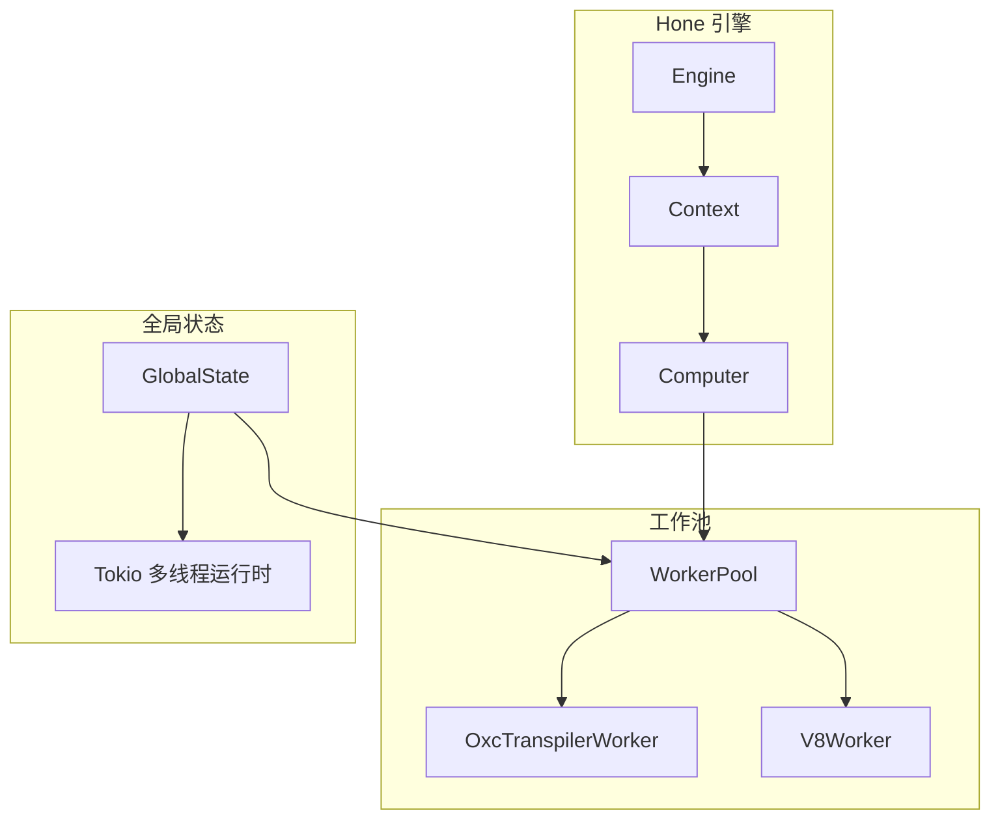

# 并发优化

<cite>
**本文引用的文件**
- [hone/src/engine.rs](file://hone/src/engine.rs)
- [hone/src/context.rs](file://hone/src/context.rs)
- [zako_core/src/computer.rs](file://zako_core/src/computer.rs)
- [zako_core/src/worker/mod.rs](file://zako_core/src/worker/mod.rs)
- [zako_core/src/worker/worker_pool.rs](file://zako_core/src/worker/worker_pool.rs)
- [zako_core/src/worker/v8worker.rs](file://zako_core/src/worker/v8worker.rs)
- [zako_core/src/worker/oxc_worker.rs](file://zako_core/src/worker/oxc_worker.rs)
- [zako_core/src/global_state.rs](file://zako_core/src/global_state.rs)
- [zako_core/src/context.rs](file://zako_core/src/context.rs)
- [zako_core/src/engine.rs](file://zako_core/src/engine.rs)
- [zako_core/src/resource/mod.rs](file://zako_core/src/resource/mod.rs)
- [hone/tests/engine_tests.rs](file://hone/tests/engine_tests.rs)
</cite>

## 目录
1. [简介](#简介)
2. [项目结构](#项目结构)
3. [核心组件](#核心组件)
4. [架构总览](#架构总览)
5. [详细组件分析](#详细组件分析)
6. [依赖关系分析](#依赖关系分析)
7. [性能考量](#性能考量)
8. [故障排查指南](#故障排查指南)
9. [结论](#结论)
10. [附录](#附录)

## 简介
本指南聚焦于 Zako 的并发优化，围绕以下目标展开：
- 工作池并发控制与任务调度并发性
- Hone 引擎的并发模型与节点计算并发
- 线程池配置、任务并行度控制、锁竞争减少与死锁预防
- 并发性能分析工具使用、线程使用率监控与瓶颈识别
- 工作线程数量优化、任务粒度调整与负载均衡策略
- 不同类型任务的并发特征与调度策略
- 常见并发问题（竞态条件、资源争用）的处理

## 项目结构
Zako 的并发相关能力主要分布在两个子系统：
- Hone 引擎：负责节点级并发计算、依赖图管理、并发去重与取消传播
- 工作池与工作线程：负责 CPU 密集型任务（如 Oxc 转换、V8 执行）的线程池并发执行

**图表来源**
- [hone/src/engine.rs](file://hone/src/engine.rs#L32-L68)
- [hone/src/context.rs](file://hone/src/context.rs#L24-L32)
- [zako_core/src/computer.rs](file://zako_core/src/computer.rs#L24-L76)
- [zako_core/src/worker/worker_pool.rs](file://zako_core/src/worker/worker_pool.rs#L35-L42)
- [zako_core/src/worker/oxc_worker.rs](file://zako_core/src/worker/oxc_worker.rs#L50-L55)
- [zako_core/src/worker/v8worker.rs](file://zako_core/src/worker/v8worker.rs#L55-L56)
- [zako_core/src/global_state.rs](file://zako_core/src/global_state.rs#L41-L52)

**章节来源**
- [hone/src/engine.rs](file://hone/src/engine.rs#L32-L68)
- [zako_core/src/worker/worker_pool.rs](file://zako_core/src/worker/worker_pool.rs#L35-L42)
- [zako_core/src/global_state.rs](file://zako_core/src/global_state.rs#L54-L97)

## 核心组件
- Hone 引擎
  - 使用无锁哈希表维护节点状态，通过通知器协调并发计算
  - 以流式并发方式解析子节点，支持缓冲并行度与失败策略
- 工作池
  - 基于通道的任务队列与线程池，动态扩容与空闲回收
  - 支持一次性清理广播，降低内存占用
- 全局状态
  - 构建 Tokio 多线程运行时，按 CPU 数量设置工作线程
  - 初始化两类工作池（Oxc/V8），统一启动

**章节来源**
- [hone/src/engine.rs](file://hone/src/engine.rs#L32-L68)
- [zako_core/src/worker/worker_pool.rs](file://zako_core/src/worker/worker_pool.rs#L27-L32)
- [zako_core/src/global_state.rs](file://zako_core/src/global_state.rs#L75-L89)

## 架构总览
Hone 引擎的并发模型以“节点级并发 + 流式并行”为核心；工作池负责将 CPU 密集型任务下沉到线程池，避免阻塞异步运行时。

**图表来源**
- [hone/src/engine.rs](file://hone/src/engine.rs#L306-L409)
- [hone/src/context.rs](file://hone/src/context.rs#L93-L150)
- [zako_core/src/computer.rs](file://zako_core/src/computer.rs#L26-L74)
- [zako_core/src/worker/worker_pool.rs](file://zako_core/src/worker/worker_pool.rs#L157-L178)

## 详细组件分析

### Hone 引擎并发模型
- 节点状态并发控制
  - 使用无锁映射保存节点状态，采用“先插入再计算”的双检模式，避免重复计算
  - 通过通知器在计算完成后唤醒等待者，减少锁持有时间
- 子节点并发解析
  - 使用流式并行解析子节点，通过缓冲参数控制并发度
  - 支持“继续执行（keep_going）”或“快速失败（fail-fast）”两种策略
- 取消与环检测
  - 在多处检查取消令牌，确保取消能及时传播
  - 通过搜索栈检测环依赖，避免死循环

**图表来源**
- [hone/src/engine.rs](file://hone/src/engine.rs#L411-L534)

**章节来源**
- [hone/src/engine.rs](file://hone/src/engine.rs#L306-L409)
- [hone/src/engine.rs](file://hone/src/engine.rs#L411-L534)
- [hone/src/context.rs](file://hone/src/context.rs#L93-L150)

### 工作池并发控制与任务调度
- 线程池配置
  - 最大/最小工作线程数、空闲超时时间可配置
  - 队列容量为最大线程数的倍数，平衡背压与吞吐
- 动态扩容与回收
  - 当队列有积压或当前线程数为 0 时尝试扩容
  - 空闲超时触发线程退出，降低空闲时资源占用
- 任务提交与取消
  - 提交后通过一次性通道等待结果
  - 若通道关闭或发送端提前结束，视为取消

**图表来源**
- [zako_core/src/worker/worker_pool.rs](file://zako_core/src/worker/worker_pool.rs#L35-L54)

**章节来源**
- [zako_core/src/worker/worker_pool.rs](file://zako_core/src/worker/worker_pool.rs#L27-L32)
- [zako_core/src/worker/worker_pool.rs](file://zako_core/src/worker/worker_pool.rs#L140-L184)

### Hone 计算器与任务分派
- 计算器根据节点键类型分派到不同计算分支
- 每个分支对应一种任务类型（如文件读取、包解析、转译等）
- 通过上下文请求依赖，形成树形依赖图

**图表来源**
- [zako_core/src/computer.rs](file://zako_core/src/computer.rs#L16-L76)

**章节来源**
- [zako_core/src/computer.rs](file://zako_core/src/computer.rs#L24-L76)
- [hone/src/context.rs](file://hone/src/context.rs#L93-L150)

### 具体 Worker 类型与并发特征
- Oxc 转换器
  - CPU 密集型，使用分配器缓存与增量复用
  - 支持垃圾回收以重置分配器
- V8 执行器
  - 通过独立引擎实例执行 JS 模块，结合 Tokio 句柄进行事件循环
  - 适合 I/O 与脚本执行场景

**图表来源**
- [zako_core/src/worker/oxc_worker.rs](file://zako_core/src/worker/oxc_worker.rs#L50-L55)
- [zako_core/src/worker/v8worker.rs](file://zako_core/src/worker/v8worker.rs#L55-L61)

**章节来源**
- [zako_core/src/worker/oxc_worker.rs](file://zako_core/src/worker/oxc_worker.rs#L57-L74)
- [zako_core/src/worker/v8worker.rs](file://zako_core/src/worker/v8worker.rs#L77-L144)

### 全局状态与 Tokio 运行时
- 全局状态根据系统 CPU 数量创建 Tokio 多线程运行时
- 初始化两类工作池并启动，统一管理资源与生命周期

**章节来源**
- [zako_core/src/global_state.rs](file://zako_core/src/global_state.rs#L75-L96)

## 依赖关系分析
- Hone 引擎依赖计算机接口，由具体实现分派任务
- 计算器可能调用工作池执行 CPU 密集型任务
- 上下文在请求依赖时更新依赖图，并传播取消信号

**图表来源**
- [hone/src/engine.rs](file://hone/src/engine.rs#L306-L409)
- [zako_core/src/computer.rs](file://zako_core/src/computer.rs#L24-L76)
- [zako_core/src/worker/worker_pool.rs](file://zako_core/src/worker/worker_pool.rs#L35-L42)

**章节来源**
- [hone/src/context.rs](file://hone/src/context.rs#L114-L140)
- [zako_core/src/context.rs](file://zako_core/src/context.rs#L160-L170)

## 性能考量
- 并发度与缓冲参数
  - Hone 引擎的缓冲并行度直接影响子节点并发度，应结合任务类型与 I/O 特性调优
  - 工作池的最大/最小线程数与队列长度影响吞吐与延迟
- 锁竞争与无锁优化
  - Hone 使用无锁映射保存节点状态，避免全局锁
  - 仅在必要时持有锁（如依赖图边的添加），尽量缩短临界区
- 取消与错误传播
  - 在解析子节点与计算自身节点之间多次检查取消，确保低延迟响应
  - 快速失败与继续执行策略影响整体吞吐与稳定性
- 资源池与容量规划
  - 资源池支持 CPU、内存、磁盘 IO、网络等资源请求，可用于未来精细化调度
  - 当前实现为简单抢占式分配，后续可引入优先级与范围请求

**章节来源**
- [hone/src/engine.rs](file://hone/src/engine.rs#L484-L516)
- [zako_core/src/resource/mod.rs](file://zako_core/src/resource/mod.rs#L106-L155)

## 故障排查指南
- 死循环与环检测
  - Hone 引擎在请求依赖时会检测环依赖并返回错误
  - 测试用例覆盖了环检测与取消传播
- 取消不生效
  - 确认在关键路径（解析子节点、计算自身节点、请求依赖）均检查取消令牌
  - 确保取消源正确传递至上下文
- 线程池无响应
  - 检查是否已调用工作池的启动函数
  - 关注队列是否积压，必要时增大最大线程数或调整空闲超时
- 性能瓶颈定位
  - 使用追踪与指标观测（如 OpenTelemetry 层）记录关键阶段耗时
  - 通过日志层级与 span 名称定位热点路径

**章节来源**
- [hone/tests/engine_tests.rs](file://hone/tests/engine_tests.rs#L82-L101)
- [hone/tests/engine_tests.rs](file://hone/tests/engine_tests.rs#L103-L155)
- [zako_core/src/worker/worker_pool.rs](file://zako_core/src/worker/worker_pool.rs#L57-L62)

## 结论
Zako 的并发体系通过“节点级并发 + 流式并行 + 线程池下沉”的组合实现了高吞吐与低延迟：
- Hone 引擎以无锁状态与通知器减少锁竞争，通过缓冲并行度与取消传播提升响应性
- 工作池提供稳定的线程池并发执行环境，支持动态扩容与回收
- 全局状态将运行时与工作池整合，便于统一配置与监控

建议在实际部署中结合任务特征与硬件资源，持续迭代缓冲参数、线程池规模与资源分配策略，以获得最佳性能与稳定性。

## 附录

### 线程池配置与优化建议
- 配置项
  - 最大/最小工作线程数：根据 CPU 数量与任务类型设定
  - 队列长度：建议为最大线程数的若干倍，平衡背压与延迟
  - 空闲超时：在空闲时回收线程，降低资源占用
- 优化策略
  - 对 CPU 密集型任务（如 Oxc 转换）适度提高线程数
  - 对 I/O 密集型任务（如 V8 执行）结合 Tokio 运行时特性，避免过度拆分
  - 定期评估队列长度与吞吐，防止过早饱和或空转

**章节来源**
- [zako_core/src/worker/worker_pool.rs](file://zako_core/src/worker/worker_pool.rs#L27-L32)
- [zako_core/src/global_state.rs](file://zako_core/src/global_state.rs#L75-L89)

### 任务粒度与负载均衡
- 任务粒度
  - 将大任务拆分为细粒度子任务，提升并行度
  - 对 I/O 密集型任务优先让出控制权，减少阻塞
- 负载均衡
  - 利用 Hone 的缓冲并行度与工作池的动态扩容，自动适配负载
  - 未来可引入优先级与资源感知调度，进一步提升公平性

**章节来源**
- [hone/src/engine.rs](file://hone/src/engine.rs#L484-L516)
- [zako_core/src/resource/mod.rs](file://zako_core/src/resource/mod.rs#L100-L104)

### 并发性能分析与监控
- 工具与方法
  - 使用追踪层记录关键阶段（如解析子节点、计算自身、提交任务）
  - 采集线程使用率、队列长度、任务完成时间等指标
  - 通过日志层级与 span 名称定位热点
- 常见问题
  - 竞态条件：确保共享状态访问受控（如依赖图边的添加）
  - 资源争用：减少锁持有时间，使用无锁容器或分段锁
  - 死锁：避免嵌套锁与循环依赖，严格控制锁顺序

**章节来源**
- [hone/src/context.rs](file://hone/src/context.rs#L114-L140)
- [zako_core/src/worker/worker_pool.rs](file://zako_core/src/worker/worker_pool.rs#L71-L118)