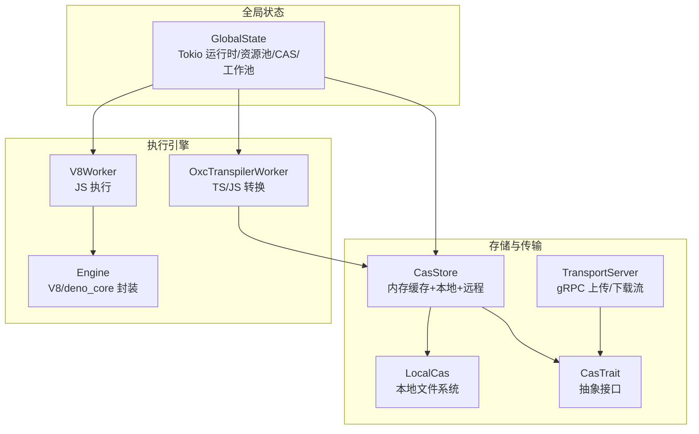
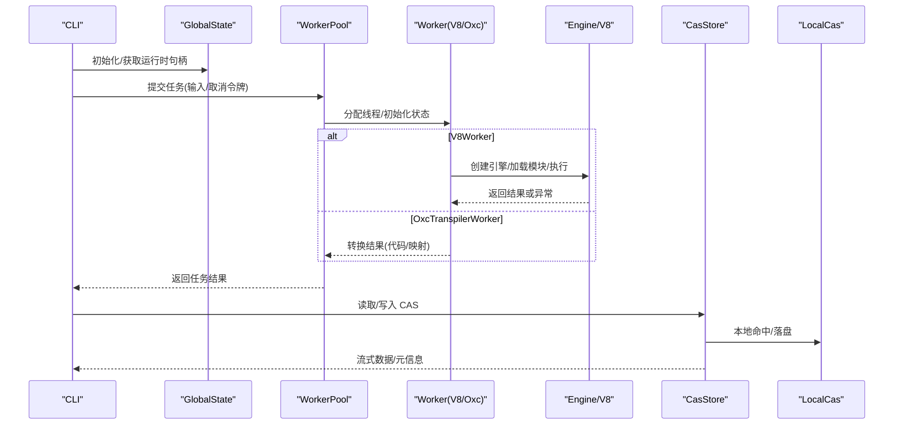
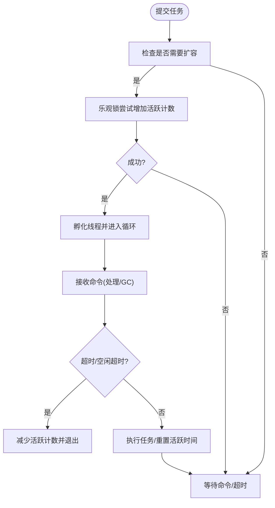
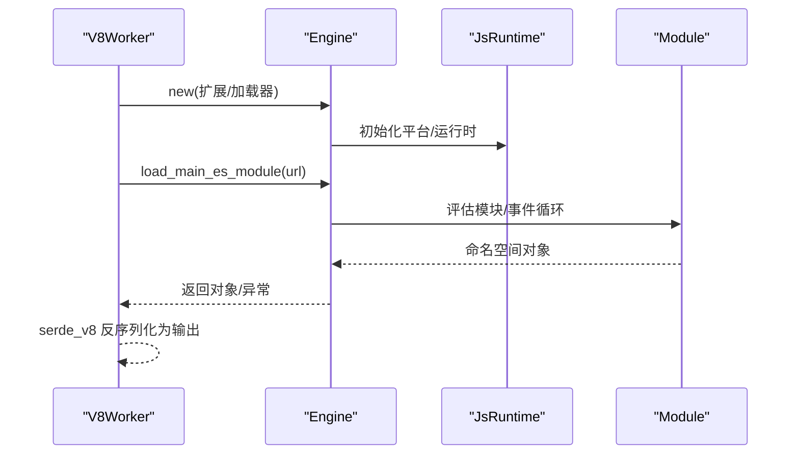
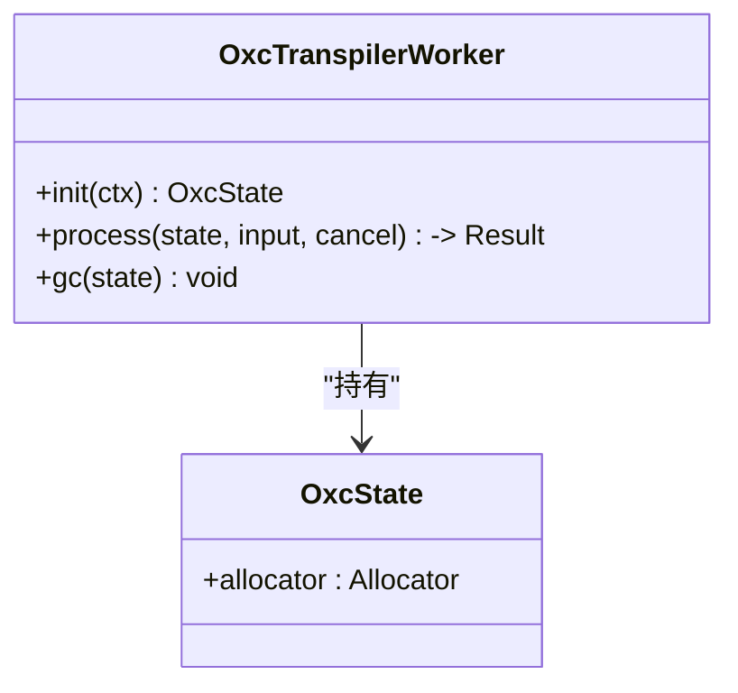
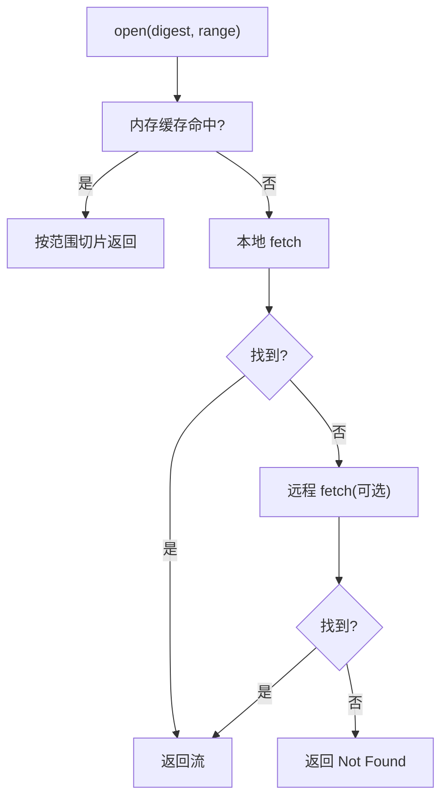
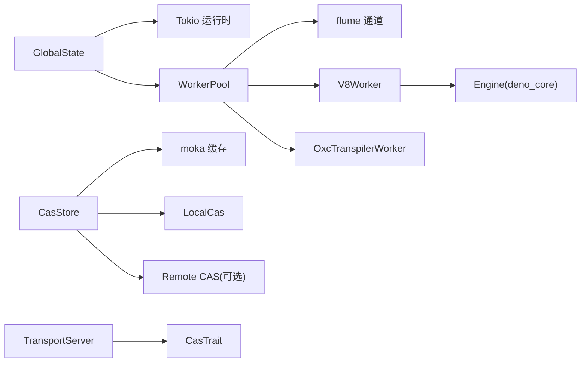

# 性能优化

<cite>
**本文引用的文件**
- [zako_core/src/worker/mod.rs](file://zako_core/src/worker/mod.rs)
- [zako_core/src/worker/worker_pool.rs](file://zako_core/src/worker/worker_pool.rs)
- [zako_core/src/worker/v8worker.rs](file://zako_core/src/worker/v8worker.rs)
- [zako_core/src/worker/oxc_worker.rs](file://zako_core/src/worker/oxc_worker.rs)
- [zako_core/src/engine.rs](file://zako_core/src/engine.rs)
- [zako_core/src/v8context.rs](file://zako_core/src/v8context.rs)
- [zako_core/src/global_state.rs](file://zako_core/src/global_state.rs)
- [zako_core/src/cas.rs](file://zako_core/src/cas.rs)
- [zako_core/src/cas_store.rs](file://zako_core/src/cas_store.rs)
- [zako_core/src/local_cas.rs](file://zako_core/src/local_cas.rs)
- [zako_core/src/transport_server.rs](file://zako_core/src/transport_server.rs)
- [Cargo.toml](file://Cargo.toml)
- [zako_cli/src/main.rs](file://zako_cli/src/main.rs)
</cite>

## 目录
1. [引言](#引言)
2. [项目结构](#项目结构)
3. [核心组件](#核心组件)
4. [架构总览](#架构总览)
5. [详细组件分析](#详细组件分析)
6. [依赖关系分析](#依赖关系分析)
7. [性能考量与优化策略](#性能考量与优化策略)
8. [故障排查指南](#故障排查指南)
9. [结论](#结论)
10. [附录](#附录)

## 引言
本指南面向性能工程师与系统调优专家，围绕 Zako 的执行性能、内存管理、并发优化与缓存策略进行系统化剖析，并结合代码实现给出可操作的优化建议、性能分析工具使用方法、基准测试思路与监控指标。重点覆盖：
- 工作池配置与动态扩缩容
- V8 执行优化与上下文隔离
- CAS 存储与传输优化（本地/远程、内存缓存、范围读取）
- 并发模型与资源池设计
- 性能瓶颈定位、内存泄漏检测与并发问题排查
- 不同场景下的策略权衡与常见问题处理

## 项目结构
Zako 的性能相关能力主要集中在 zako_core 模块中，围绕“全局状态”组织资源，包括：
- 全局运行时与资源池
- 工作池（V8 与 OXC 转换器）
- CAS 存储与传输服务
- V8 引擎封装与上下文类型

图表来源
- [zako_core/src/global_state.rs](file://zako_core/src/global_state.rs#L40-L96)
- [zako_core/src/engine.rs](file://zako_core/src/engine.rs#L33-L79)
- [zako_core/src/worker/v8worker.rs](file://zako_core/src/worker/v8worker.rs#L54-L81)
- [zako_core/src/worker/oxc_worker.rs](file://zako_core/src/worker/oxc_worker.rs#L48-L74)
- [zako_core/src/cas.rs](file://zako_core/src/cas.rs#L9-L44)
- [zako_core/src/local_cas.rs](file://zako_core/src/local_cas.rs#L12-L30)
- [zako_core/src/cas_store.rs](file://zako_core/src/cas_store.rs#L21-L56)
- [zako_core/src/transport_server.rs](file://zako_core/src/transport_server.rs#L13-L22)

章节来源
- [zako_core/src/global_state.rs](file://zako_core/src/global_state.rs#L40-L96)
- [Cargo.toml](file://Cargo.toml#L101-L101)

## 核心组件
- 全局状态 GlobalState：集中管理 Tokio 运行时、资源池、CAS 存储、工作池实例；根据 CPU 数量初始化多线程运行时。
- 工作池 WorkerPool：通用线程池抽象，支持最小/最大并发、空闲超时回收、广播 GC。
- V8Worker：基于 deno_core 的 V8 执行封装，按上下文类型注入扩展，执行模块并返回结果。
- OxcTranspilerWorker：基于 Oxc 的 JS/TS 转换器，内置分配器复用与 GC 回收。
- CAS 抽象与实现：统一的 CAS 接口，LocalCas 本地文件系统实现，CasStore 提供内存缓存与多级回源。
- 传输服务 TransportServer：基于 gRPC 的上传/下载流式传输。

章节来源
- [zako_core/src/global_state.rs](file://zako_core/src/global_state.rs#L40-L96)
- [zako_core/src/worker/mod.rs](file://zako_core/src/worker/mod.rs#L10-L37)
- [zako_core/src/worker/worker_pool.rs](file://zako_core/src/worker/worker_pool.rs#L27-L42)
- [zako_core/src/worker/v8worker.rs](file://zako_core/src/worker/v8worker.rs#L54-L81)
- [zako_core/src/worker/oxc_worker.rs](file://zako_core/src/worker/oxc_worker.rs#L48-L74)
- [zako_core/src/cas.rs](file://zako_core/src/cas.rs#L9-L44)
- [zako_core/src/local_cas.rs](file://zako_core/src/local_cas.rs#L105-L212)
- [zako_core/src/cas_store.rs](file://zako_core/src/cas_store.rs#L21-L56)
- [zako_core/src/transport_server.rs](file://zako_core/src/transport_server.rs#L24-L68)

## 架构总览
下图展示从 CLI 到执行引擎与存储的关键路径，以及并发与缓存交互：

图表来源
- [zako_core/src/global_state.rs](file://zako_core/src/global_state.rs#L75-L96)
- [zako_core/src/worker/worker_pool.rs](file://zako_core/src/worker/worker_pool.rs#L56-L119)
- [zako_core/src/worker/v8worker.rs](file://zako_core/src/worker/v8worker.rs#L71-L145)
- [zako_core/src/engine.rs](file://zako_core/src/engine.rs#L47-L79)
- [zako_core/src/cas_store.rs](file://zako_core/src/cas_store.rs#L59-L117)
- [zako_core/src/local_cas.rs](file://zako_core/src/local_cas.rs#L105-L212)

## 详细组件分析

### 工作池与并发优化
- 动态扩容：当队列存在积压或当前活跃线程为 0 且未达上限时，尝试乐观锁增加计数并孵化新线程。
- 空闲回收：线程在空闲超时后自动退出，避免常驻线程带来的资源占用。
- GC 触发：通过广播通道向工作线程周期性触发 GC，释放非 Drop 状态资源（如 V8/分配器）。
- 取消与错误：支持取消令牌中断处理；错误类型覆盖“未启动/重复启动/取消/恐慌”。

图表来源
- [zako_core/src/worker/worker_pool.rs](file://zako_core/src/worker/worker_pool.rs#L121-L138)
- [zako_core/src/worker/worker_pool.rs](file://zako_core/src/worker/worker_pool.rs#L64-L119)

章节来源
- [zako_core/src/worker/worker_pool.rs](file://zako_core/src/worker/worker_pool.rs#L27-L42)
- [zako_core/src/worker/worker_pool.rs](file://zako_core/src/worker/worker_pool.rs#L121-L138)
- [zako_core/src/worker/worker_pool.rs](file://zako_core/src/worker/worker_pool.rs#L156-L178)

### V8 执行与上下文隔离
- 上下文类型：通过 V8ContextInput 决定启用的内置扩展集合，隔离权限与能力。
- 引擎生命周期：每个 Worker 线程内持有独立的 JsRuntime，避免跨线程共享 V8 对象。
- 执行流程：加载主 ES 模块、评估模块、事件循环、捕获异常并转换为统一错误类型。
- 结果序列化：通过 serde_v8 在 V8 与 Rust 之间传递结果对象。

图表来源
- [zako_core/src/worker/v8worker.rs](file://zako_core/src/worker/v8worker.rs#L71-L145)
- [zako_core/src/engine.rs](file://zako_core/src/engine.rs#L47-L79)
- [zako_core/src/engine.rs](file://zako_core/src/engine.rs#L168-L232)
- [zako_core/src/v8context.rs](file://zako_core/src/v8context.rs#L12-L37)

章节来源
- [zako_core/src/worker/v8worker.rs](file://zako_core/src/worker/v8worker.rs#L20-L42)
- [zako_core/src/engine.rs](file://zako_core/src/engine.rs#L19-L31)
- [zako_core/src/engine.rs](file://zako_core/src/engine.rs#L168-L232)
- [zako_core/src/v8context.rs](file://zako_core/src/v8context.rs#L12-L37)

### Oxc 转换器与内存复用
- 分配器复用：每个 Worker 状态维护 Allocator，容量固定以降低频繁分配成本。
- 处理流程：解析/语义分析/转换/代码生成，错误收集与返回。
- GC 回收：在 GC 周期重建分配器，释放中间缓冲区。

图表来源
- [zako_core/src/worker/oxc_worker.rs](file://zako_core/src/worker/oxc_worker.rs#L57-L74)
- [zako_core/src/worker/oxc_worker.rs](file://zako_core/src/worker/oxc_worker.rs#L146-L149)

章节来源
- [zako_core/src/worker/oxc_worker.rs](file://zako_core/src/worker/oxc_worker.rs#L57-L74)
- [zako_core/src/worker/oxc_worker.rs](file://zako_core/src/worker/oxc_worker.rs#L146-L149)

### CAS 存储与缓存策略
- 抽象接口：统一的 store/check/fetch/get_local_path 等方法，支持权限与长度校验。
- 内存缓存：基于 moka 的异步缓存，按字节长度计重，支持 TTL/TTI。
- 多级回源：优先内存缓存，其次本地 CAS，最后远程 CAS（可选）。
- 本地实现：分层目录组织，大文件采用 mmap，小文件直接读取；写入使用临时文件+原子重命名。
- 传输服务：gRPC 下载流式返回，上传流式接收并累计大小。

图表来源
- [zako_core/src/cas_store.rs](file://zako_core/src/cas_store.rs#L59-L108)
- [zako_core/src/local_cas.rs](file://zako_core/src/local_cas.rs#L163-L201)
- [zako_core/src/cas.rs](file://zako_core/src/cas.rs#L9-L44)

章节来源
- [zako_core/src/cas_store.rs](file://zako_core/src/cas_store.rs#L28-L56)
- [zako_core/src/cas_store.rs](file://zako_core/src/cas_store.rs#L119-L154)
- [zako_core/src/local_cas.rs](file://zako_core/src/local_cas.rs#L31-L70)
- [zako_core/src/local_cas.rs](file://zako_core/src/local_cas.rs#L105-L212)
- [zako_core/src/transport_server.rs](file://zako_core/src/transport_server.rs#L24-L68)

## 依赖关系分析
- 运行时与并发：Tokio 多线程运行时，线程栈大小由系统信息启发式确定；flume 用于线程间无阻塞通信。
- V8 与 deno_core：引擎初始化平台与运行时，注册扩展；通过事件循环驱动模块评估。
- 缓存与存储：moka 提供高性能异步缓存；blake3 作为默认摘要算法；memmap2 优化大文件读取。
- 传输：tonic + prost 实现 gRPC 服务；tokio-util ReaderStream/StreamReader 支持流式读写。

图表来源
- [zako_core/src/global_state.rs](file://zako_core/src/global_state.rs#L75-L96)
- [Cargo.toml](file://Cargo.toml#L101-L101)
- [zako_core/src/engine.rs](file://zako_core/src/engine.rs#L47-L79)
- [zako_core/src/cas_store.rs](file://zako_core/src/cas_store.rs#L44-L55)
- [zako_core/src/transport_server.rs](file://zako_core/src/transport_server.rs#L13-L22)

章节来源
- [Cargo.toml](file://Cargo.toml#L101-L101)
- [Cargo.toml](file://Cargo.toml#L136-L137)
- [Cargo.toml](file://Cargo.toml#L272-L272)

## 性能考量与优化策略

### 执行性能优化
- V8 引擎初始化成本控制
  - 使用引擎单线程实例，避免跨线程共享 V8 对象导致的锁竞争与竞态。
  - 启动时一次性注册扩展，减少重复初始化开销。
- 模块加载与事件循环
  - 通过事件循环驱动模块评估，避免阻塞主线程；必要时将长任务拆分为多个模块或任务批次。
- 结果序列化
  - 使用 serde_v8 进行高效序列化/反序列化，避免不必要的拷贝与格式转换。

章节来源
- [zako_core/src/engine.rs](file://zako_core/src/engine.rs#L47-L79)
- [zako_core/src/engine.rs](file://zako_core/src/engine.rs#L168-L232)
- [zako_core/src/worker/v8worker.rs](file://zako_core/src/worker/v8worker.rs#L71-L145)

### 内存管理
- 分配器复用（Oxc）
  - 固定容量的 Allocator 降低频繁分配与 GC 压力；在 GC 周期重建以回收中间缓冲。
- 内存缓存（CasStore）
  - 基于 moka 的异步缓存，按字节长度计重，合理设置 max_cache_capacity、TTL/TTI，平衡命中率与内存占用。
- 大文件读取（LocalCas）
  - 小文件直接读取，大文件使用 mmap 减少拷贝与系统调用开销。
- 生命周期与释放
  - Worker 的 gc 方法仅释放非 Drop 资源，保留状态以便复用；V8 线程退出时释放 isolate/运行时资源。

章节来源
- [zako_core/src/worker/oxc_worker.rs](file://zako_core/src/worker/oxc_worker.rs#L63-L74)
- [zako_core/src/worker/oxc_worker.rs](file://zako_core/src/worker/oxc_worker.rs#L146-L149)
- [zako_core/src/cas_store.rs](file://zako_core/src/cas_store.rs#L44-L55)
- [zako_core/src/local_cas.rs](file://zako_core/src/local_cas.rs#L36-L69)

### 并发优化
- 工作池动态扩缩容
  - 基于队列积压与活跃线程计数的乐观锁扩容，避免过度创建线程；空闲超时回收线程，降低常驻开销。
- 任务提交与取消
  - 使用取消令牌中断长时间运行的任务，避免僵尸线程与资源泄露。
- 运行时线程数
  - 根据 CPU 数量初始化 Tokio 工作者线程数，兼顾 I/O 密集与 CPU 密集场景。

章节来源
- [zako_core/src/worker/worker_pool.rs](file://zako_core/src/worker/worker_pool.rs#L121-L138)
- [zako_core/src/worker/worker_pool.rs](file://zako_core/src/worker/worker_pool.rs#L156-L178)
- [zako_core/src/global_state.rs](file://zako_core/src/global_state.rs#L75-L80)

### 缓存策略
- 多级缓存
  - 内存缓存优先，命中则直接切片返回；否则回源本地或远程 CAS。
- 范围读取
  - 严格校验请求范围，避免越界；对本地文件使用 seek 定位，减少不必要数据传输。
- 写入优化
  - 临时文件写入+原子重命名，保证一致性；对小字节数据按阈值写入内存缓存。

章节来源
- [zako_core/src/cas_store.rs](file://zako_core/src/cas_store.rs#L59-L108)
- [zako_core/src/local_cas.rs](file://zako_core/src/local_cas.rs#L163-L201)
- [zako_core/src/local_cas.rs](file://zako_core/src/local_cas.rs#L107-L149)

### 网络传输优化
- 流式传输
  - 下载端使用 ReaderStream 将 AsyncRead 包装为流响应；上传端使用 StreamReader 累计已提交大小。
- 错误映射
  - 将底层错误映射为 gRPC 状态码，便于客户端快速失败与重试策略。
- 范围与元数据
  - 上传要求首包为元数据，后续为分片；下载要求提供 digest 与 range。

章节来源
- [zako_core/src/transport_server.rs](file://zako_core/src/transport_server.rs#L24-L68)
- [zako_core/src/transport_server.rs](file://zako_core/src/transport_server.rs#L70-L136)

### 性能分析工具与监控
- 日志与追踪
  - 使用 tracing 与 hierarchical layer 输出结构化日志；在 CLI 中集成 OpenTelemetry 层，导出到 stdout。
- 指标建议
  - 工作池：活跃线程数、队列长度、GC 触发次数、任务耗时分布。
  - V8：模块加载耗时、事件循环轮询次数、异常比例。
  - CAS：内存缓存命中率/未命中率、本地/远程命中率、平均读取延迟、写入吞吐。
  - 传输：上传/下载吞吐、分片大小分布、重试次数、错误码统计。

章节来源
- [zako_cli/src/main.rs](file://zako_cli/src/main.rs#L500-L519)
- [Cargo.toml](file://Cargo.toml#L88-L91)

### 基准测试方法
- 单组件基准
  - 使用 cargo bench 或 Criterion（需在工程中添加）对 WorkerPool、CasStore、LocalCas、V8 执行路径进行微基准。
- 端到端基准
  - 构造典型构建场景（大量小文件转译、大文件 mmap 读取、流式上传下载），测量端到端时延与吞吐。
- 压测脚本
  - 通过 CLI 参数控制并发度、任务规模与缓存策略开关，记录指标并对比不同配置。

章节来源
- [Cargo.toml](file://Cargo.toml#L310-L312)

### 性能瓶颈识别
- CPU 瓶颈
  - 关注 Oxc 转换器与 V8 执行的 CPU 时间占比；检查是否因解析/语义分析/代码生成阶段过长。
- I/O 瓶颈
  - 本地磁盘读写与网络传输延迟；关注 mmap 使用、范围读取与流式传输效率。
- 内存瓶颈
  - 内存缓存容量不足导致频繁回源；Allocator 未及时 GC 导致峰值过高。
- 并发瓶颈
  - 工作池扩容不足或队列积压；线程栈过大导致上下文切换开销上升。

章节来源
- [zako_core/src/worker/worker_pool.rs](file://zako_core/src/worker/worker_pool.rs#L121-L138)
- [zako_core/src/cas_store.rs](file://zako_core/src/cas_store.rs#L44-L55)
- [zako_core/src/local_cas.rs](file://zako_core/src/local_cas.rs#L36-L69)

### 内存泄漏检测
- 分配器与状态清理
  - 确保 OxcWorker 的 gc 会重建 Allocator；V8Worker 的状态在退出时释放 isolate。
- 缓存键与生命周期
  - 检查内存缓存的 TTL/TTI 设置是否合理，避免长期持有大对象。
- 文件句柄与流
  - 传输服务中的 ReaderStream/StreamReader 应正确关闭，避免句柄泄漏。

章节来源
- [zako_core/src/worker/oxc_worker.rs](file://zako_core/src/worker/oxc_worker.rs#L146-L149)
- [zako_core/src/worker/v8worker.rs](file://zako_core/src/worker/v8worker.rs#L77-L81)
- [zako_core/src/transport_server.rs](file://zako_core/src/transport_server.rs#L60-L67)

### 并发问题排查
- 死锁与竞态
  - 避免在 Worker 线程中进行阻塞 I/O；使用异步通道与取消令牌。
- 线程池抖动
  - 调整 idle_timeout 与队列容量，避免频繁创建/销毁线程。
- 资源泄露
  - 确保 oneshot 发送/接收配对；错误路径返回时清理中间状态。

章节来源
- [zako_core/src/worker/worker_pool.rs](file://zako_core/src/worker/worker_pool.rs#L156-L178)
- [zako_core/src/worker/worker_pool.rs](file://zako_core/src/worker/worker_pool.rs#L180-L183)

## 故障排查指南
- V8 执行异常
  - 检查 Engine::execute_module_and_then 的异常捕获与转换，确认错误上下文与堆栈。
- CAS 访问失败
  - 校验 digest 与 range 是否越界；确认本地路径存在与权限；远程 CAS 可用性。
- 传输错误
  - 首包必须为元数据；分片数据类型匹配；已存在 Blob 的预检逻辑。
- 工作池错误
  - “未启动/重复启动/取消/恐慌”等错误类型，结合日志定位具体环节。

章节来源
- [zako_core/src/engine.rs](file://zako_core/src/engine.rs#L200-L232)
- [zako_core/src/cas_store.rs](file://zako_core/src/cas_store.rs#L68-L85)
- [zako_core/src/transport_server.rs](file://zako_core/src/transport_server.rs#L76-L105)
- [zako_core/src/worker/worker_pool.rs](file://zako_core/src/worker/worker_pool.rs#L17-L25)

## 结论
Zako 的性能优化围绕“工作池并发、V8 执行隔离、内存缓存与多级回源、流式传输”展开。通过合理的线程池配置、状态复用与 GC 回收、缓存容量与 TTL/TTI 调优、以及流式 I/O 与范围读取，可在不同场景下取得稳定而高效的性能表现。建议在生产环境中结合指标监控与基准测试持续迭代，针对具体瓶颈采取定向优化。

## 附录
- 配置建议
  - 工作池：min_workers=CPU/2，max_workers=CPU×1.5~2，idle_timeout=30~60s。
  - CasStore：max_cache_capacity=内存预算×系数，TTL/TTI 与业务访问模式匹配。
  - V8：按上下文类型启用必要扩展，避免冗余初始化。
  - 传输：合理分片大小与背压策略，结合重试与断点续传。