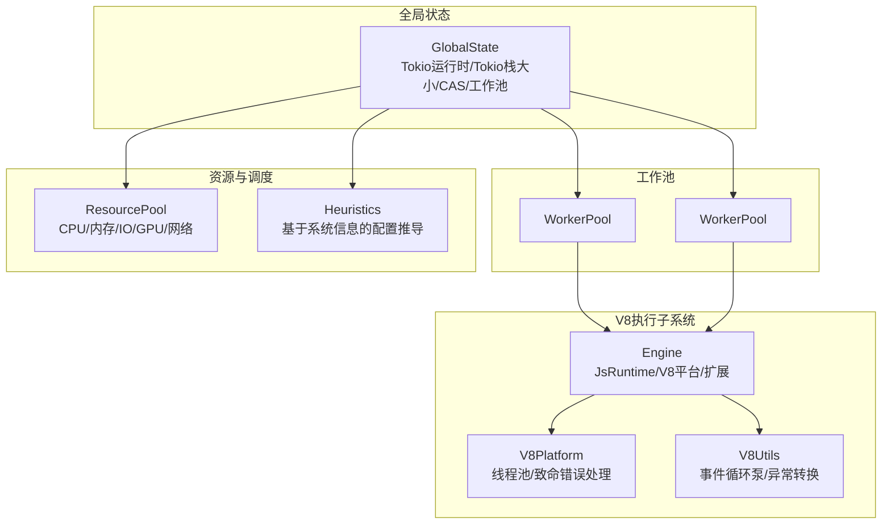
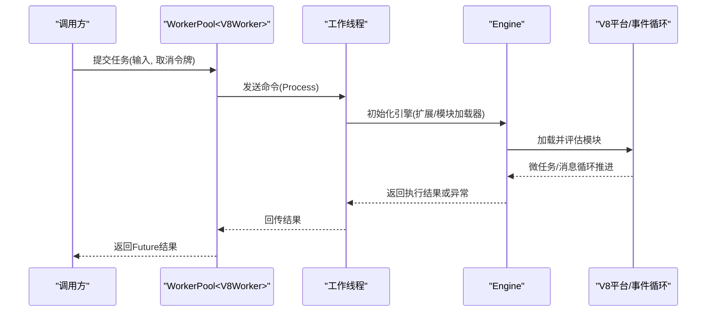
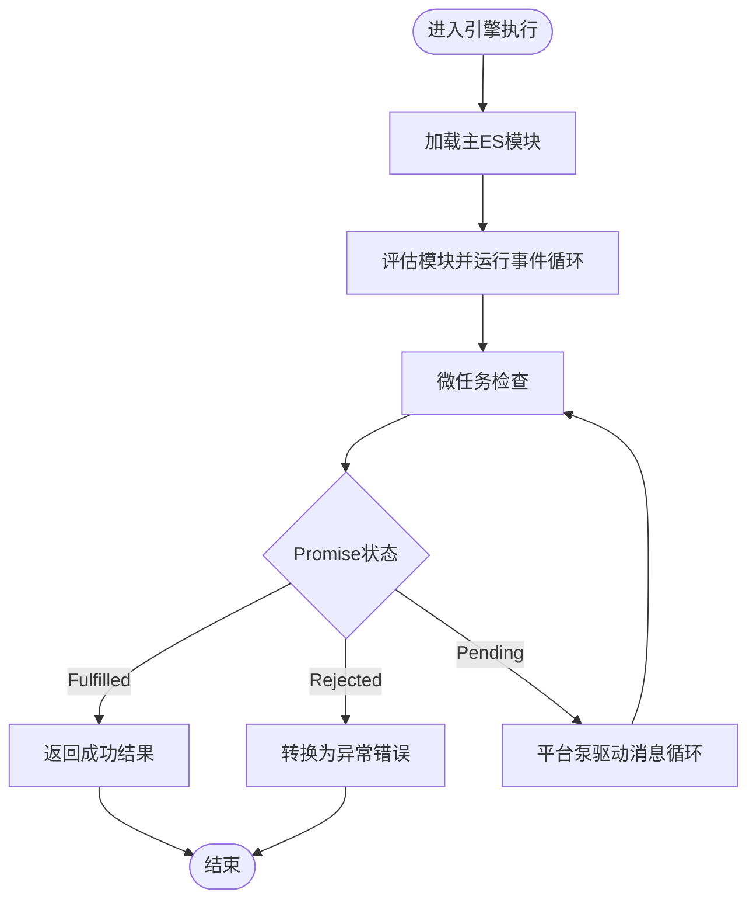
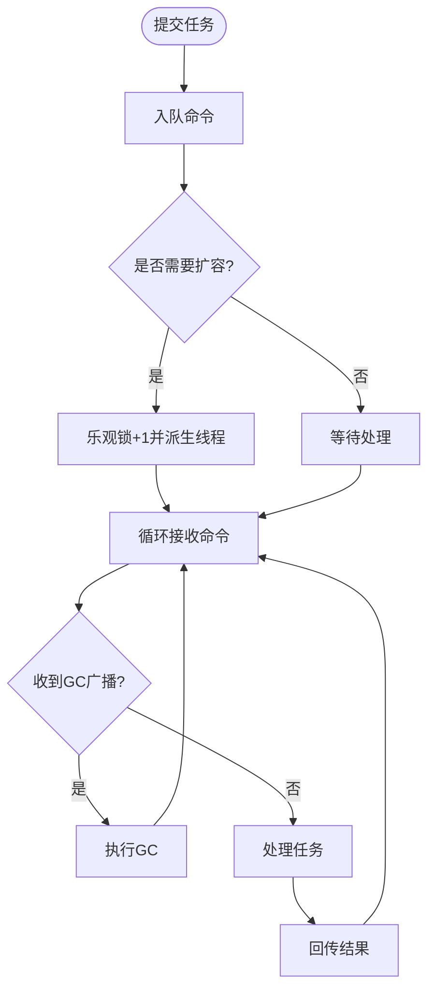
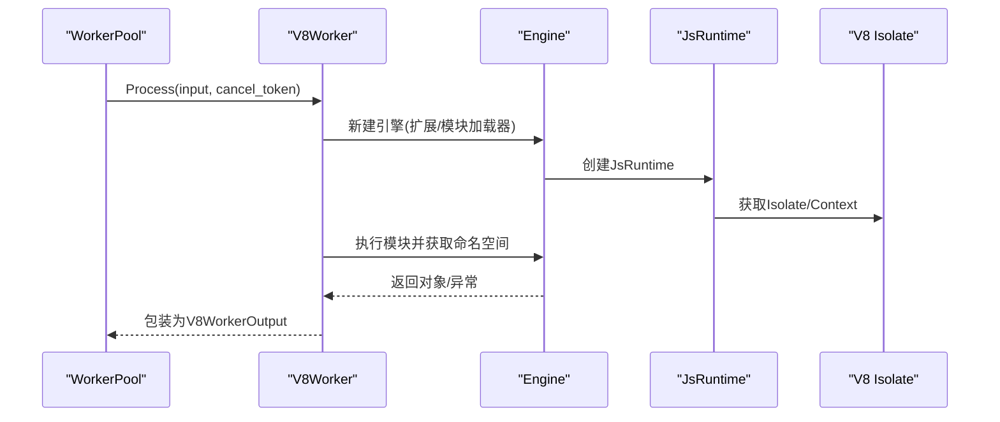
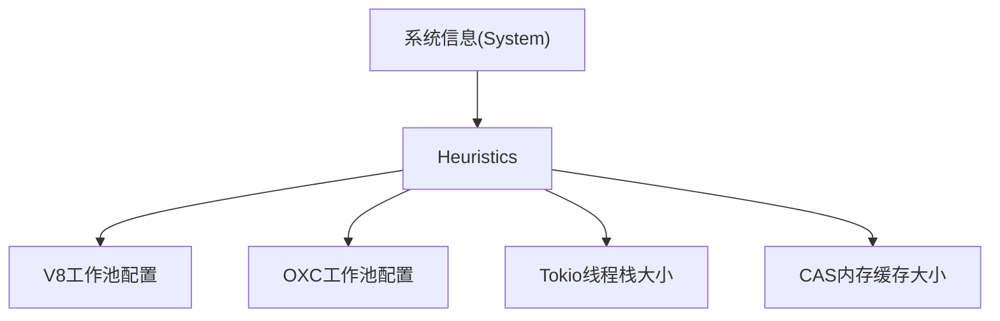
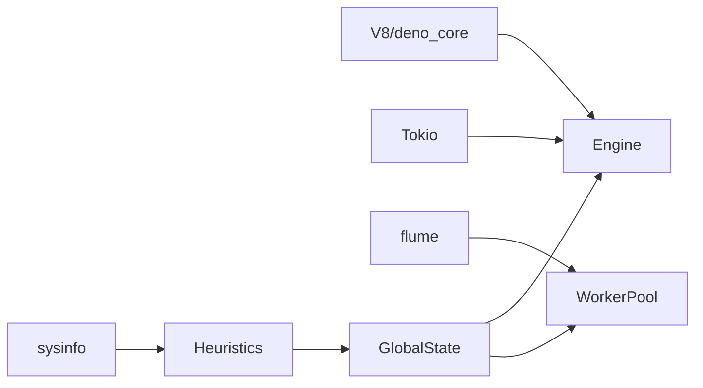

# 执行性能优化

<cite>
**本文引用的文件**
- [zako_core/src/v8platform.rs](file://zako_core/src/v8platform.rs)
- [zako_core/src/engine.rs](file://zako_core/src/engine.rs)
- [zako_core/src/v8context.rs](file://zako_core/src/v8context.rs)
- [zako_core/src/v8utils.rs](file://zako_core/src/v8utils.rs)
- [zako_core/src/v8error.rs](file://zako_core/src/v8error.rs)
- [zako_core/src/worker/worker_pool.rs](file://zako_core/src/worker/worker_pool.rs)
- [zako_core/src/worker/v8worker.rs](file://zako_core/src/worker/v8worker.rs)
- [zako_core/src/worker/mod.rs](file://zako_core/src/worker/mod.rs)
- [zako_core/src/worker/protocol.rs](file://zako_core/src/worker/protocol.rs)
- [zako_core/src/global_state.rs](file://zako_core/src/global_state.rs)
- [zako_core/src/resource/heuristics/mod.rs](file://zako_core/src/resource/heuristics/mod.rs)
- [zako_core/src/resource/mod.rs](file://zako_core/src/resource/mod.rs)
- [zako_core/src/builtin/extension/rt.rs](file://zako_core/src/builtin/extension/rt.rs)
- [Cargo.toml](file://Cargo.toml)
- [zako_cli/src/main.rs](file://zako_cli/src/main.rs)
</cite>

## 目录
1. [简介](#简介)
2. [项目结构](#项目结构)
3. [核心组件](#核心组件)
4. [架构总览](#架构总览)
5. [详细组件分析](#详细组件分析)
6. [依赖关系分析](#依赖关系分析)
7. [性能考量与优化建议](#性能考量与优化建议)
8. [故障排查指南](#故障排查指南)
9. [结论](#结论)
10. [附录](#附录)

## 简介
本技术指南聚焦于Zako在V8执行环境、工作池配置与任务调度方面的性能优化。内容涵盖：
- V8执行环境的平台线程池配置与事件循环驱动
- 工作池的并发控制、任务队列长度与空闲回收
- JavaScript执行时间优化、内存分配减少与垃圾回收调优
- 并发执行控制与资源配额管理
- 性能分析工具使用、执行时间测量与CPU使用率监控
- 不同类型任务的性能特征与优化策略
- 常见性能瓶颈与解决方案

## 项目结构
Zako围绕“全局状态”组织系统资源，通过“工作池”承载V8与OXC等耗时任务，并以“引擎”封装V8运行时生命周期与模块执行流程。

图表来源
- [zako_core/src/global_state.rs](file://zako_core/src/global_state.rs#L54-L97)
- [zako_core/src/worker/worker_pool.rs](file://zako_core/src/worker/worker_pool.rs#L140-L154)
- [zako_core/src/engine.rs](file://zako_core/src/engine.rs#L48-L79)
- [zako_core/src/v8platform.rs](file://zako_core/src/v8platform.rs#L7-L29)
- [zako_core/src/v8utils.rs](file://zako_core/src/v8utils.rs#L39-L90)
- [zako_core/src/resource/mod.rs](file://zako_core/src/resource/mod.rs#L106-L135)
- [zako_core/src/resource/heuristics/mod.rs](file://zako_core/src/resource/heuristics/mod.rs#L31-L49)

章节来源
- [zako_core/src/global_state.rs](file://zako_core/src/global_state.rs#L54-L97)
- [zako_core/src/worker/worker_pool.rs](file://zako_core/src/worker/worker_pool.rs#L140-L154)
- [zako_core/src/engine.rs](file://zako_core/src/engine.rs#L48-L79)
- [zako_core/src/v8platform.rs](file://zako_core/src/v8platform.rs#L7-L29)
- [zako_core/src/v8utils.rs](file://zako_core/src/v8utils.rs#L39-L90)
- [zako_core/src/resource/mod.rs](file://zako_core/src/resource/mod.rs#L106-L135)
- [zako_core/src/resource/heuristics/mod.rs](file://zako_core/src/resource/heuristics/mod.rs#L31-L49)

## 核心组件
- V8平台与引擎
  - V8平台：负责V8默认平台初始化、线程池大小与致命错误回调注册。
  - 引擎：封装JsRuntime生命周期、模块加载与评估、事件循环驱动、异常捕获与转换。
- 工作池
  - 通用工作池：支持动态扩容、空闲回收、广播GC触发、取消令牌传递。
  - V8Worker：在独立线程中执行JS模块，复用Tokio运行时句柄。
- 资源与调度
  - ResourcePool：按资源类型进行容量管理与排队通知。
  - Heuristics：根据系统信息推导工作池大小、Tokio栈大小、CAS缓存参数等。

章节来源
- [zako_core/src/v8platform.rs](file://zako_core/src/v8platform.rs#L7-L29)
- [zako_core/src/engine.rs](file://zako_core/src/engine.rs#L48-L79)
- [zako_core/src/v8utils.rs](file://zako_core/src/v8utils.rs#L39-L90)
- [zako_core/src/worker/worker_pool.rs](file://zako_core/src/worker/worker_pool.rs#L56-L184)
- [zako_core/src/worker/v8worker.rs](file://zako_core/src/worker/v8worker.rs#L71-L146)
- [zako_core/src/resource/mod.rs](file://zako_core/src/resource/mod.rs#L106-L135)
- [zako_core/src/resource/heuristics/mod.rs](file://zako_core/src/resource/heuristics/mod.rs#L31-L49)

## 架构总览
下面的序列图展示了V8任务从提交到完成的关键路径，包括事件循环驱动与异常处理。

图表来源
- [zako_core/src/worker/worker_pool.rs](file://zako_core/src/worker/worker_pool.rs#L156-L178)
- [zako_core/src/worker/v8worker.rs](file://zako_core/src/worker/v8worker.rs#L83-L145)
- [zako_core/src/engine.rs](file://zako_core/src/engine.rs#L81-L109)
- [zako_core/src/v8utils.rs](file://zako_core/src/v8utils.rs#L39-L90)

## 详细组件分析

### V8平台与引擎
- 平台初始化
  - 在主线程设置V8平台，线程池大小由CPU核数推导，启用致命错误回调记录。
- 引擎生命周期
  - 初始化平台后创建JsRuntime，注入内置扩展与模块加载器。
  - 支持模块加载、评估与事件循环；提供带JSON上下文的执行变体。
- 事件循环与死锁检测
  - 使用平台泵驱动事件循环，避免CPU空转；若Promise长期未解决则判定为死锁并返回错误。

图表来源
- [zako_core/src/engine.rs](file://zako_core/src/engine.rs#L81-L109)
- [zako_core/src/v8utils.rs](file://zako_core/src/v8utils.rs#L39-L90)

章节来源
- [zako_core/src/v8platform.rs](file://zako_core/src/v8platform.rs#L7-L29)
- [zako_core/src/engine.rs](file://zako_core/src/engine.rs#L48-L79)
- [zako_core/src/engine.rs](file://zako_core/src/engine.rs#L81-L109)
- [zako_core/src/v8utils.rs](file://zako_core/src/v8utils.rs#L39-L90)

### 工作池与任务调度
- 动态扩容
  - 当队列存在积压或当前无活跃线程时，尝试乐观锁扩容至最大限制。
- 空闲回收
  - 线程在超时内无活动则退出，降低空闲时的资源占用。
- 广播GC
  - 通过广播通道向所有工作线程触发GC，释放中间态内存。
- 取消与错误
  - 任务支持取消令牌；线程内panic或未启动提交会映射为特定错误。

图表来源
- [zako_core/src/worker/worker_pool.rs](file://zako_core/src/worker/worker_pool.rs#L121-L138)
- [zako_core/src/worker/worker_pool.rs](file://zako_core/src/worker/worker_pool.rs#L64-L119)
- [zako_core/src/worker/worker_pool.rs](file://zako_core/src/worker/worker_pool.rs#L156-L178)

章节来源
- [zako_core/src/worker/worker_pool.rs](file://zako_core/src/worker/worker_pool.rs#L56-L184)

### V8Worker执行流程
- 输入输出
  - 输入包含模块spec、请求通道、字节码缓存与上下文类型。
  - 输出为JS执行结果的序列化封装。
- 执行要点
  - 基于上下文类型选择扩展集合，构建引擎实例。
  - 获取V8隔离与主上下文，执行模块并转换为Rust侧对象。

图表来源
- [zako_core/src/worker/v8worker.rs](file://zako_core/src/worker/v8worker.rs#L71-L146)
- [zako_core/src/engine.rs](file://zako_core/src/engine.rs#L48-L79)

章节来源
- [zako_core/src/worker/v8worker.rs](file://zako_core/src/worker/v8worker.rs#L20-L52)
- [zako_core/src/worker/v8worker.rs](file://zako_core/src/worker/v8worker.rs#L71-L146)

### 资源池与调度启发式
- 资源模型
  - 统一抽象CPU、内存、磁盘IO、网络、GPU及其他自定义资源。
  - 采用请求队列与通知机制，满足容量约束下的公平与顺序。
- 启发式配置
  - V8工作池：CPU核数的一半作为上限，兼顾I/O与计算负载。
  - OXC工作池：固定较小规模，专注解析/转换。
  - Tokio线程栈大小：统一4MB，避免过深调用栈导致栈溢出。
  - CAS缓存：按内存总量的10%估算，范围限制在4MB~4GB。

图表来源
- [zako_core/src/resource/heuristics/mod.rs](file://zako_core/src/resource/heuristics/mod.rs#L31-L49)
- [zako_core/src/resource/heuristics/mod.rs](file://zako_core/src/resource/heuristics/mod.rs#L51-L54)
- [zako_core/src/resource/heuristics/mod.rs](file://zako_core/src/resource/heuristics/mod.rs#L11-L25)

章节来源
- [zako_core/src/resource/mod.rs](file://zako_core/src/resource/mod.rs#L106-L135)
- [zako_core/src/resource/heuristics/mod.rs](file://zako_core/src/resource/heuristics/mod.rs#L31-L49)

## 依赖关系分析
- 外部依赖
  - V8/deno_core：提供JS运行时、模块系统与扩展机制。
  - Tokio：多线程运行时与异步任务调度。
  - flume：高性能无阻塞通道用于工作池队列。
  - sysinfo：系统资源探测，用于启发式配置。
- 内部耦合
  - GlobalState集中持有Tokio运行时、工作池与资源池，确保跨模块一致的并发与资源控制。
  - WorkerBehavior抽象统一不同工作负载的初始化、处理与GC。

图表来源
- [Cargo.toml](file://Cargo.toml#L101-L161)
- [zako_core/src/global_state.rs](file://zako_core/src/global_state.rs#L75-L89)
- [zako_core/src/worker/worker_pool.rs](file://zako_core/src/worker/worker_pool.rs#L142-L154)

章节来源
- [Cargo.toml](file://Cargo.toml#L101-L161)
- [zako_core/src/global_state.rs](file://zako_core/src/global_state.rs#L75-L89)

## 性能考量与优化建议

### V8执行环境优化
- 平台线程池大小
  - 默认线程池大小=CPU核数+1，适合一般I/O密集型脚本执行；可根据实际负载调整。
  - 建议：对高并发CPU密集型任务适当降低线程池大小，避免过多上下文切换。
- 事件循环驱动
  - 使用平台泵驱动事件循环，避免忙等；若出现长时间Pending的Promise，应检查JS侧是否存在死循环或未resolve的异步链路。
- 致命错误处理
  - 注册致命错误回调，便于快速定位V8内部异常。

章节来源
- [zako_core/src/v8platform.rs](file://zako_core/src/v8platform.rs#L7-L29)
- [zako_core/src/v8utils.rs](file://zako_core/src/v8utils.rs#L39-L90)

### 工作池配置优化
- 最大/最小工作线程
  - V8工作池上限建议设为CPU核数的一半，兼顾I/O与JS执行；OXC工作池保持较小规模。
  - 队列长度=max_workers*2，避免频繁阻塞；根据任务积压动态扩容。
- 空闲回收
  - 合理设置idle_timeout，避免长尾任务导致线程常驻；短任务场景可缩短空闲时间。
- 广播GC
  - 定期触发GC释放中间态内存，降低峰值内存占用；注意与任务执行的时机协调。

章节来源
- [zako_core/src/worker/worker_pool.rs](file://zako_core/src/worker/worker_pool.rs#L28-L32)
- [zako_core/src/worker/worker_pool.rs](file://zako_core/src/worker/worker_pool.rs#L142-L154)
- [zako_core/src/worker/worker_pool.rs](file://zako_core/src/worker/worker_pool.rs#L180-L183)
- [zako_core/src/resource/heuristics/mod.rs](file://zako_core/src/resource/heuristics/mod.rs#L31-L49)

### 任务调度策略
- 类型化上下文
  - V8ContextInput区分package/build/rule/toolchain/config等上下文，按需注入扩展，避免不必要的能力暴露。
- 取消与优先级
  - 通过取消令牌中断长时间任务；当前实现未显式支持优先级，可通过外部队列或信号协调。
- 资源配额
  - 使用ResourcePool对CPU/内存/IO等资源进行配额管理，避免饥饿与资源争用。

章节来源
- [zako_core/src/v8context.rs](file://zako_core/src/v8context.rs#L13-L37)
- [zako_core/src/resource/mod.rs](file://zako_core/src/resource/mod.rs#L106-L135)

### JavaScript执行时间优化
- 减少全局对象与闭包创建
  - 避免在热路径上频繁创建大对象或深层闭包，尽量复用已分配对象。
- 控制事件循环压力
  - 将长任务拆分为多个小任务，利用微任务间隙让出控制权，避免阻塞UI/事件循环。
- 字节码缓存
  - 利用cached_bytecode减少重复编译开销；结合模块请求通道实现增量编译。

章节来源
- [zako_core/src/worker/v8worker.rs](file://zako_core/src/worker/v8worker.rs#L20-L36)
- [zako_core/src/worker/protocol.rs](file://zako_core/src/worker/protocol.rs#L7-L10)

### 内存分配减少与垃圾回收调优
- 对象池化与重用
  - 在Rust侧维护对象池，减少频繁分配；在JS侧避免创建临时数组/字符串。
- 触发GC时机
  - 在批量任务之间或任务边界触发GC，降低峰值内存。
- 分配器选择
  - 项目使用mimalloc，可在高并发场景下获得更优吞吐；如需进一步优化可评估JEMalloc。

章节来源
- [zako_core/src/worker/worker_pool.rs](file://zako_core/src/worker/worker_pool.rs#L180-L183)
- [Cargo.toml](file://Cargo.toml#L245)

### 并发执行控制
- Tokio运行时
  - 线程数量与系统CPU核数一致，栈大小固定为4MB；避免过深调用栈。
- 工作池与Tokio协作
  - V8Worker在独立线程中执行，避免阻塞Tokio主线程；通过通道与广播进行通信。

章节来源
- [zako_core/src/global_state.rs](file://zako_core/src/global_state.rs#L75-L89)
- [zako_core/src/resource/heuristics/mod.rs](file://zako_core/src/resource/heuristics/mod.rs#L51-L54)

### 性能分析工具与监控
- 日志与追踪
  - CLI中集成OpenTelemetry与层级化日志，支持结构化追踪与彩色输出。
- 执行时间测量
  - 在关键路径使用tracing span标注，结合外部性能分析器（如perf/flamegraph）定位热点。
- CPU使用率监控
  - 结合sysinfo采集系统CPU使用情况，配合任务队列长度与活跃线程数进行关联分析。

章节来源
- [zako_cli/src/main.rs](file://zako_cli/src/main.rs#L501-L519)
- [zako_core/src/global_state.rs](file://zako_core/src/global_state.rs#L62-L63)

### 不同类型任务的性能特征与优化策略
- V8脚本执行
  - 特征：CPU密集、事件循环驱动、易受阻塞影响。
  - 策略：拆分任务、合理设置平台线程池、定期GC、字节码缓存。
- 解析/转换(OXC)
  - 特征：I/O与CPU混合，任务粒度小。
  - 策略：小而稳的工作池、短空闲超时、避免阻塞式I/O。
- 构建元数据生成
  - 特征：读写缓存、依赖解析。
  - 策略：合理设置CAS缓存大小与TTL，避免频繁落盘。

章节来源
- [zako_core/src/resource/heuristics/mod.rs](file://zako_core/src/resource/heuristics/mod.rs#L11-L25)
- [zako_core/src/resource/heuristics/mod.rs](file://zako_core/src/resource/heuristics/mod.rs#L31-L49)

### 常见性能瓶颈与解决方案
- 事件循环阻塞
  - 症状：Promise长期Pending，CPU使用率低。
  - 解决：拆分长任务、使用微任务间隙让出控制权、检查死循环或未处理的Promise。
- 线程池过大
  - 症状：上下文切换频繁，吞吐下降。
  - 解决：降低平台线程池与工作池上限，匹配CPU核数。
- 内存峰值过高
  - 症状：GC频率升高，暂停时间增长。
  - 解决：触发GC时机前移、减少临时对象、启用字节码缓存。
- 资源争用
  - 症状：任务排队过长，延迟上升。
  - 解决：提升资源配额或调整任务优先级，必要时引入外部队列。

章节来源
- [zako_core/src/v8utils.rs](file://zako_core/src/v8utils.rs#L39-L90)
- [zako_core/src/worker/worker_pool.rs](file://zako_core/src/worker/worker_pool.rs#L121-L138)
- [zako_core/src/resource/mod.rs](file://zako_core/src/resource/mod.rs#L106-L135)

## 故障排查指南
- V8致命错误
  - 现象：进程因V8内部错误终止。
  - 排查：查看致命错误回调日志，定位文件与行号，检查扩展与模块加载。
- 引擎异常
  - 现象：JS抛出异常或Promise拒绝。
  - 排查：使用V8Error与堆栈信息定位问题；确认模块加载与上下文设置。
- 工作池错误
  - 现象：任务提交失败或被取消。
  - 排查：检查是否已启动工作池、队列是否满、线程是否空闲回收。

章节来源
- [zako_core/src/v8platform.rs](file://zako_core/src/v8platform.rs#L22-L27)
- [zako_core/src/v8error.rs](file://zako_core/src/v8error.rs#L12-L30)
- [zako_core/src/worker/worker_pool.rs](file://zako_core/src/worker/worker_pool.rs#L17-L25)

## 结论
通过对V8平台与引擎、工作池与任务调度、资源与启发式配置的系统性优化，Zako能够在复杂构建场景中实现稳定且高效的JavaScript执行。建议在生产环境中：
- 基于系统信息动态推导工作池与平台线程池大小
- 合理拆分长任务、利用事件循环间隙
- 定期触发GC并启用字节码缓存
- 使用资源池与日志追踪进行持续监控与调优

## 附录
- 相关扩展入口
  - RT扩展：提供必要的运行时设置入口。

章节来源
- [zako_core/src/builtin/extension/rt.rs](file://zako_core/src/builtin/extension/rt.rs#L1-L7)