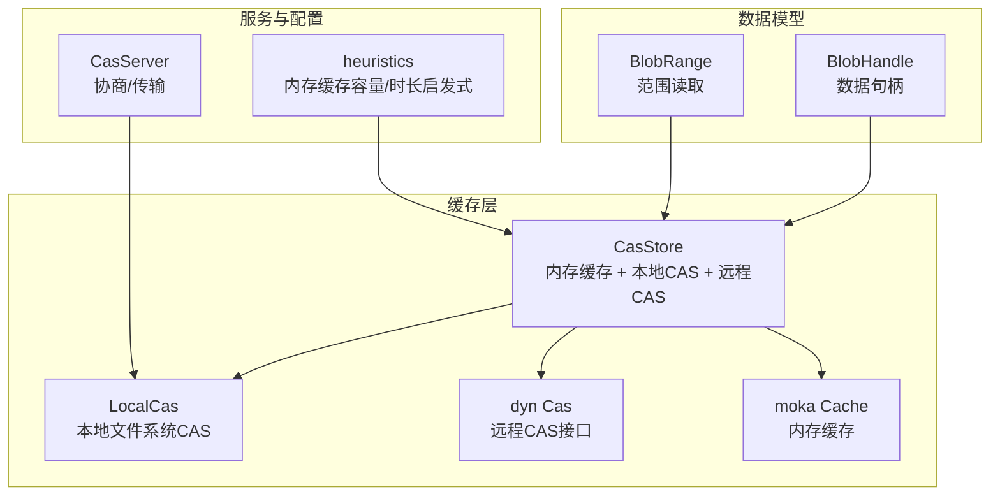
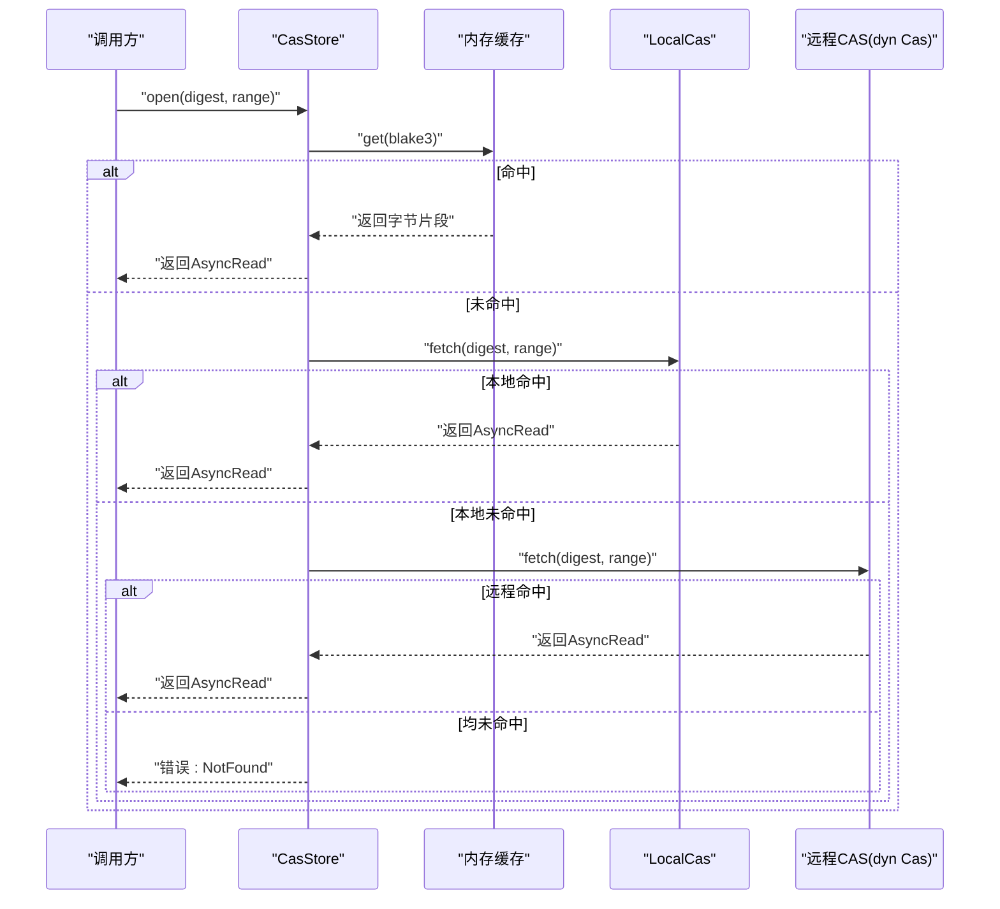
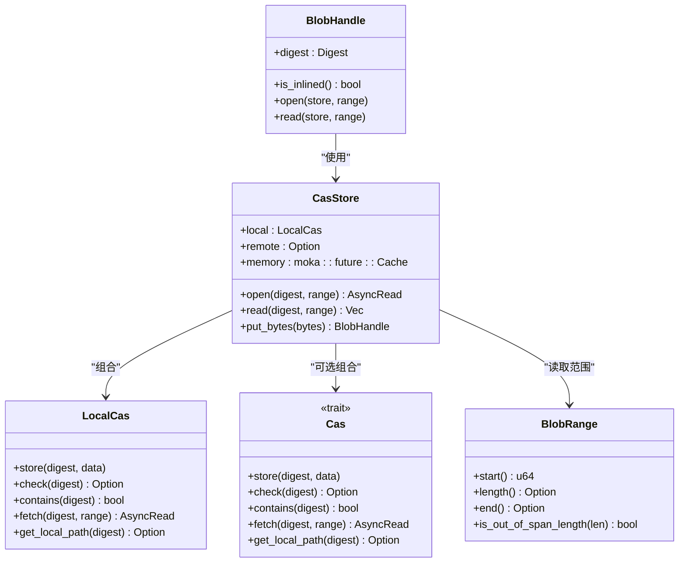
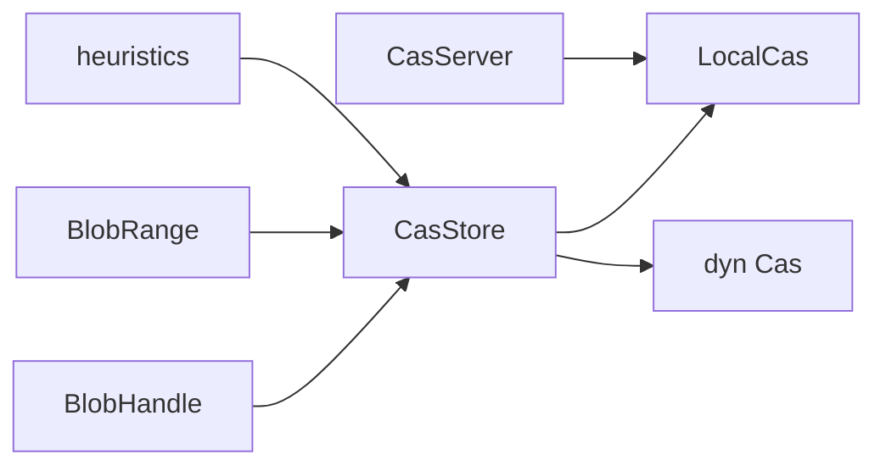

# 缓存策略优化

<cite>
**本文引用的文件**
- [zako_core/src/cas_store.rs](file://zako_core/src/cas_store.rs)
- [zako_core/src/local_cas.rs](file://zako_core/src/local_cas.rs)
- [zako_core/src/cas.rs](file://zako_core/src/cas.rs)
- [zako_core/src/blob_handle.rs](file://zako_core/src/blob_handle.rs)
- [zako_core/src/blob_range.rs](file://zako_core/src/blob_range.rs)
- [zako_core/src/cas_server.rs](file://zako_core/src/cas_server.rs)
- [zako_core/src/resource/heuristics/mod.rs](file://zako_core/src/resource/heuristics/mod.rs)
- [zako_core/src/config.rs](file://zako_core/src/config.rs)
- [zako_core/src/computer.rs](file://zako_core/src/computer.rs)
- [zako_core/src/engine.rs](file://zako_core/src/engine.rs)
</cite>

## 目录
1. [引言](#引言)
2. [项目结构](#项目结构)
3. [核心组件](#核心组件)
4. [架构总览](#架构总览)
5. [详细组件分析](#详细组件分析)
6. [依赖关系分析](#依赖关系分析)
7. [性能考量](#性能考量)
8. [故障排查指南](#故障排查指南)
9. [结论](#结论)
10. [附录](#附录)

## 引言
本技术指南聚焦于 Zako 的缓存体系，围绕 CAS 存储缓存（内存缓存）、本地缓存与远程缓存的协同工作进行系统化优化。内容涵盖缓存命中率提升策略、缓存失效与过期控制、缓存预热与清理机制、性能监控与命中率分析、存储空间管理、缓存大小配置、淘汰算法选择、缓存一致性保障，以及不同数据类型的缓存特征与存储策略，并给出常见问题（如缓存污染与缓存击穿）的应对方案。

## 项目结构
Zako 的缓存相关代码主要集中在 zako_core 模块中，涉及 CAS 接口、本地 CAS 实现、内存缓存封装、数据句柄与范围读取、服务器端协商与传输细节，以及平台资源启发式配置等。下图展示与缓存策略直接相关的模块关系：

图表来源
- [zako_core/src/cas_store.rs](file://zako_core/src/cas_store.rs#L22-L56)
- [zako_core/src/local_cas.rs](file://zako_core/src/local_cas.rs#L13-L25)
- [zako_core/src/cas.rs](file://zako_core/src/cas.rs#L11-L44)
- [zako_core/src/blob_handle.rs](file://zako_core/src/blob_handle.rs#L9-L40)
- [zako_core/src/blob_range.rs](file://zako_core/src/blob_range.rs#L21-L104)
- [zako_core/src/cas_server.rs](file://zako_core/src/cas_server.rs#L38-L56)
- [zako_core/src/resource/heuristics/mod.rs](file://zako_core/src/resource/heuristics/mod.rs#L11-L25)

章节来源
- [zako_core/src/cas_store.rs](file://zako_core/src/cas_store.rs#L22-L56)
- [zako_core/src/local_cas.rs](file://zako_core/src/local_cas.rs#L13-L25)
- [zako_core/src/cas.rs](file://zako_core/src/cas.rs#L11-L44)
- [zako_core/src/blob_handle.rs](file://zako_core/src/blob_handle.rs#L9-L40)
- [zako_core/src/blob_range.rs](file://zako_core/src/blob_range.rs#L21-L104)
- [zako_core/src/cas_server.rs](file://zako_core/src/cas_server.rs#L38-L56)
- [zako_core/src/resource/heuristics/mod.rs](file://zako_core/src/resource/heuristics/mod.rs#L11-L25)

## 核心组件
- 内存缓存（moka）：以内容摘要为键，按字节长度计重，支持 TTL/TTI。
- 本地 CAS：基于文件系统的内容寻址存储，支持范围读取与本地路径暴露。
- 远程 CAS：通过统一 trait 抽象，可替换实现（如远端对象存储）。
- 数据句柄与范围：统一的数据访问抽象，支持范围裁剪与增量读取。
- 服务器端协商：基于流式请求的缺失 blob 协商与传输细节获取。

章节来源
- [zako_core/src/cas_store.rs](file://zako_core/src/cas_store.rs#L13-L56)
- [zako_core/src/local_cas.rs](file://zako_core/src/local_cas.rs#L106-L212)
- [zako_core/src/cas.rs](file://zako_core/src/cas.rs#L11-L44)
- [zako_core/src/blob_handle.rs](file://zako_core/src/blob_handle.rs#L42-L94)
- [zako_core/src/blob_range.rs](file://zako_core/src/blob_range.rs#L39-L104)
- [zako_core/src/cas_server.rs](file://zako_core/src/cas_server.rs#L59-L149)

## 架构总览
Zako 的缓存访问遵循“内存优先、本地兜底、远程回源”的顺序查找策略；同时对小体积数据进行内存缓存以降低磁盘与网络开销。服务器端通过协商协议识别缺失 blob 并提供传输细节，便于客户端批量拉取与并行下载。

图表来源
- [zako_core/src/cas_store.rs](file://zako_core/src/cas_store.rs#L64-L108)
- [zako_core/src/local_cas.rs](file://zako_core/src/local_cas.rs#L163-L201)
- [zako_core/src/cas.rs](file://zako_core/src/cas.rs#L33-L37)

章节来源
- [zako_core/src/cas_store.rs](file://zako_core/src/cas_store.rs#L64-L108)
- [zako_core/src/local_cas.rs](file://zako_core/src/local_cas.rs#L163-L201)
- [zako_core/src/cas.rs](file://zako_core/src/cas.rs#L33-L37)

## 详细组件分析

### 组件一：CasStore（内存缓存 + 本地/远程CAS）
- 设计要点
  - 内存缓存采用 moka::future::Cache，键为 blake3 哈希，值为字节向量；使用字节长度作为 weigher，确保容量按数据体积而非条目数控制。
  - TTL/TTI 分别控制“存活时间”和“空闲回收时间”，避免热点数据长期占用内存。
  - 访问顺序：内存 → 本地 → 远程；任一命中即返回。
  - 小于阈值（约 64KB）的字节数据会被写入内存缓存，其余仅写入本地/远程 CAS。
- 关键行为
  - open/read：支持范围读取与增量复制，减少不必要的拷贝。
  - put_bytes：计算 blake3 摘要，按大小决定是否缓存，随后写入本地 CAS，并异步尝试写入远程 CAS。
- 性能影响
  - 内存命中可显著降低磁盘与网络 IO；TTI 可防止冷数据长期驻留。
  - 大对象不入内存，避免内存碎片与高 GC 压力。

图表来源
- [zako_core/src/cas_store.rs](file://zako_core/src/cas_store.rs#L22-L154)
- [zako_core/src/local_cas.rs](file://zako_core/src/local_cas.rs#L13-L212)
- [zako_core/src/cas.rs](file://zako_core/src/cas.rs#L11-L44)
- [zako_core/src/blob_handle.rs](file://zako_core/src/blob_handle.rs#L42-L94)
- [zako_core/src/blob_range.rs](file://zako_core/src/blob_range.rs#L39-L104)

章节来源
- [zako_core/src/cas_store.rs](file://zako_core/src/cas_store.rs#L22-L154)
- [zako_core/src/local_cas.rs](file://zako_core/src/local_cas.rs#L13-L212)
- [zako_core/src/cas.rs](file://zako_core/src/cas.rs#L11-L44)
- [zako_core/src/blob_handle.rs](file://zako_core/src/blob_handle.rs#L42-L94)
- [zako_core/src/blob_range.rs](file://zako_core/src/blob_range.rs#L39-L104)

### 组件二：LocalCas（本地文件系统CAS）
- 设计要点
  - 采用两级目录前缀组织文件，路径由 blake3 摘要生成，降低单目录文件数量。
  - 小文件使用哈希器读取，大文件使用内存映射以提高效率。
  - 支持范围读取，先校验索引合法性再裁剪输出。
- 关键行为
  - store：原子重命名落地，保证并发安全。
  - fetch：根据范围裁剪，支持起始偏移与长度。
  - get_local_path：当本地可直接提供文件路径时，便于零拷贝传输。
- 性能影响
  - 合理的目录层级与 mmap 使用可降低 IO 延迟与 CPU 开销。
  - 范围读取避免整文件加载，节省内存。

章节来源
- [zako_core/src/local_cas.rs](file://zako_core/src/local_cas.rs#L13-L212)

### 组件三：CasServer（协商与传输）
- 设计要点
  - 基于流式请求逐批检查缺失 blob，批量返回缺失列表，降低往返次数。
  - 提供传输协议与并发建议，便于客户端并行拉取。
- 关键行为
  - negotiate_blobs：并行检查 contains，收集缺失集合。
  - get_transport_details：生成一次性令牌与推荐并发参数。
- 性能影响
  - 流式与并行化显著提升大规模 blob 的协商效率。

章节来源
- [zako_core/src/cas_server.rs](file://zako_core/src/cas_server.rs#L59-L149)

### 组件四：BlobHandle 与 BlobRange
- 设计要点
  - BlobHandle 统一数据句柄，支持内联与引用两种状态，便于在内存与磁盘间切换。
  - BlobRange 抽象范围读取，提供起始、长度、结束与越界检测。
- 性能影响
  - 范围裁剪减少不必要的数据传输与解码。
  - 内联状态在小数据场景可进一步降低 IO。

章节来源
- [zako_core/src/blob_handle.rs](file://zako_core/src/blob_handle.rs#L42-L94)
- [zako_core/src/blob_range.rs](file://zako_core/src/blob_range.rs#L39-L104)

### 组件五：资源启发式与配置
- 设计要点
  - 内存缓存容量按系统总内存的固定比例动态确定，并限制上下限。
  - TTL/TTI 默认值提供稳定基线，可根据业务波动调整。
  - 本地 CAS 路径默认位于系统缓存目录下。
- 性能影响
  - 启发式配置可快速适配不同硬件环境，避免手动调参带来的误差。

章节来源
- [zako_core/src/resource/heuristics/mod.rs](file://zako_core/src/resource/heuristics/mod.rs#L11-L65)

## 依赖关系分析
- 组件耦合
  - CasStore 与 LocalCas、远程 CAS 通过 trait 解耦，便于替换实现。
  - BlobHandle 与 BlobRange 与 CasStore 解耦，仅在使用时依赖。
- 外部依赖
  - moka 提供高性能异步缓存；tokio 提供异步 IO；blake3 用于内容寻址。
- 循环依赖
  - 未发现循环依赖迹象；各模块职责清晰。

图表来源
- [zako_core/src/cas_store.rs](file://zako_core/src/cas_store.rs#L22-L26)
- [zako_core/src/local_cas.rs](file://zako_core/src/local_cas.rs#L106-L109)
- [zako_core/src/cas.rs](file://zako_core/src/cas.rs#L11-L17)
- [zako_core/src/blob_handle.rs](file://zako_core/src/blob_handle.rs#L68-L94)
- [zako_core/src/blob_range.rs](file://zako_core/src/blob_range.rs#L39-L104)
- [zako_core/src/cas_server.rs](file://zako_core/src/cas_server.rs#L38-L45)
- [zako_core/src/resource/heuristics/mod.rs](file://zako_core/src/resource/heuristics/mod.rs#L11-L25)

章节来源
- [zako_core/src/cas_store.rs](file://zako_core/src/cas_store.rs#L22-L26)
- [zako_core/src/local_cas.rs](file://zako_core/src/local_cas.rs#L106-L109)
- [zako_core/src/cas.rs](file://zako_core/src/cas.rs#L11-L17)
- [zako_core/src/blob_handle.rs](file://zako_core/src/blob_handle.rs#L68-L94)
- [zako_core/src/blob_range.rs](file://zako_core/src/blob_range.rs#L39-L104)
- [zako_core/src/cas_server.rs](file://zako_core/src/cas_server.rs#L38-L45)
- [zako_core/src/resource/heuristics/mod.rs](file://zako_core/src/resource/heuristics/mod.rs#L11-L25)

## 性能考量
- 命中率提升
  - 优先缓存热点小对象（阈值约 64KB），结合 TTL/TTI 控制常驻内存。
  - 对频繁访问的范围读取进行局部缓存，减少重复 IO。
- 失效与过期
  - TTL 防止陈旧数据占用内存；TTI 避免长时间空闲的冷数据滞留。
  - 远程数据变更时，建议引入版本号或 ETag 机制（当前实现未显式提供）。
- 预热与清理
  - 预热：启动阶段或热点任务前批量 put_bytes，提前填充内存缓存。
  - 清理：定期扫描与基于容量的 LRU/全量清理策略（当前未实现，可扩展）。
- 监控与分析
  - 建议统计命中/未命中次数、平均响应时间、内存使用率与淘汰次数。
  - 结合 BlobRange 的长度分布，评估缓存收益与内存占用。
- 存储空间管理
  - 本地 CAS 目录采用两级前缀，避免单目录过大；定期清理无效/过期文件。
  - 远程 CAS 与本地 CAS 的同步策略需考虑带宽与一致性成本。

[本节为通用性能指导，不直接分析具体文件，故无章节来源]

## 故障排查指南
- 常见错误
  - NotFound：当内存、本地与远程均未命中时返回。
  - RequestedIndexOutOfRange：请求范围超出数据长度或起始位置非法。
  - Io：底层 IO 错误，多与文件系统或网络异常相关。
- 定位步骤
  - 检查 BlobRange 起始与长度是否合法。
  - 确认 digest 是否正确，以及本地路径是否存在。
  - 观察 TTL/TTI 是否导致过早失效。
- 建议
  - 在 put_bytes 成功后立即进行一次 read 验证。
  - 对远程 CAS 的失败进行重试与降级策略（当前实现未内置重试，可扩展）。

章节来源
- [zako_core/src/cas.rs](file://zako_core/src/cas.rs#L46-L62)
- [zako_core/src/cas_store.rs](file://zako_core/src/cas_store.rs#L68-L95)
- [zako_core/src/local_cas.rs](file://zako_core/src/local_cas.rs#L182-L188)

## 结论
Zako 的缓存体系通过“内存优先、本地兜底、远程回源”的分层策略，在小对象场景获得显著的 IO 与延迟收益。结合合理的容量、TTL/TTI 设置与范围读取能力，可在多数构建与打包场景中取得良好命中率与吞吐表现。建议在生产环境中引入监控指标、预热与清理策略，并针对远程 CAS 的一致性与可用性制定更完善的降级与重试机制。

[本节为总结性内容，不直接分析具体文件，故无章节来源]

## 附录

### 缓存配置与调优清单
- 内存缓存容量
  - 建议：按系统总内存的固定比例设置，并限制上下限。
  - 参考：启发式函数提供默认区间与默认值。
- TTL/TTI
  - 建议：根据热点数据生命周期调整；短期高频数据缩短 TTL，长期稳定数据延长 TTI。
- 小对象阈值
  - 建议：结合业务数据分布微调阈值，平衡内存占用与命中率。
- 服务器端并发
  - 建议：依据 negotiate_blobs 的返回批量与网络带宽，合理设置推荐并发参数。

章节来源
- [zako_core/src/resource/heuristics/mod.rs](file://zako_core/src/resource/heuristics/mod.rs#L11-L25)
- [zako_core/src/cas_server.rs](file://zako_core/src/cas_server.rs#L16-L34)

### 缓存一致性与分布式策略
- 一致性建议
  - 引入版本号或 ETag，配合 TTL/TTI 实现“强一致 + 最终一致”的混合策略。
  - 对热点小对象启用只增更新，避免并发写导致的覆盖。
- 分布式复用
  - 通过内容寻址与位置无关的路径策略，提升跨机器缓存命中率。
  - 服务器端协商批量拉取，减少网络往返与抖动。

章节来源
- [zako_core/src/cas.rs](file://zako_core/src/cas.rs#L9-L10)
- [prompt.tx](file://prompt.tx#L640-L647)