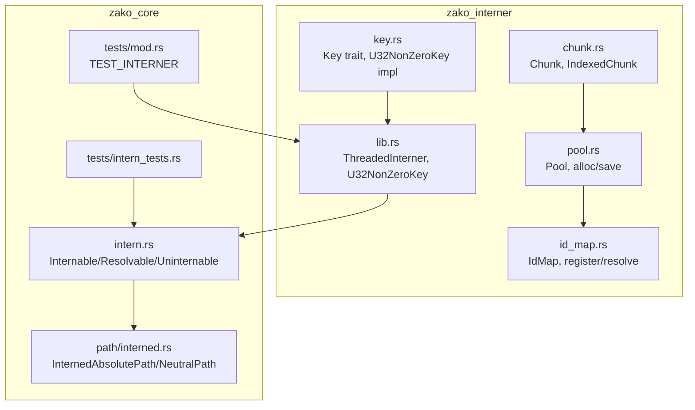
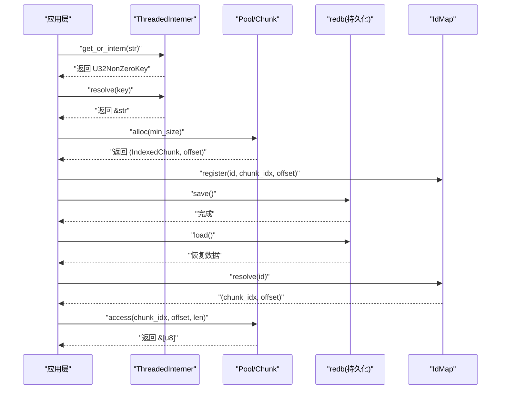
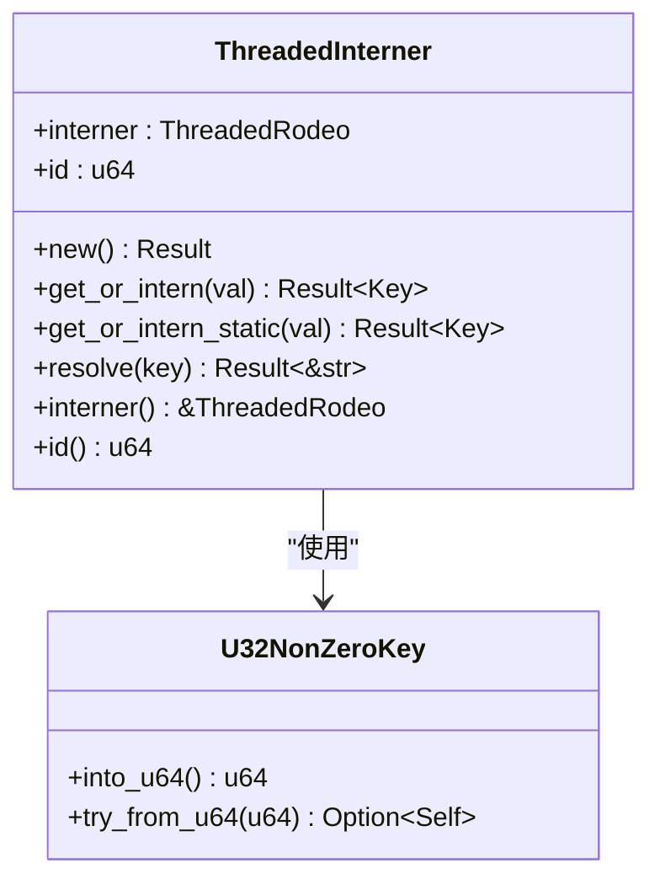
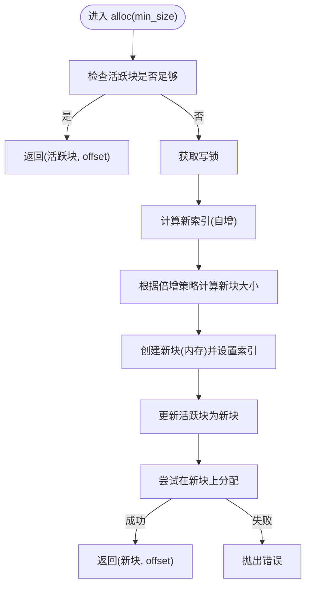
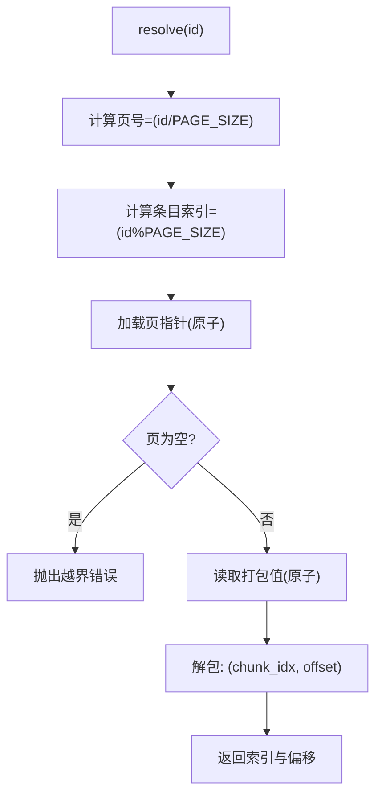
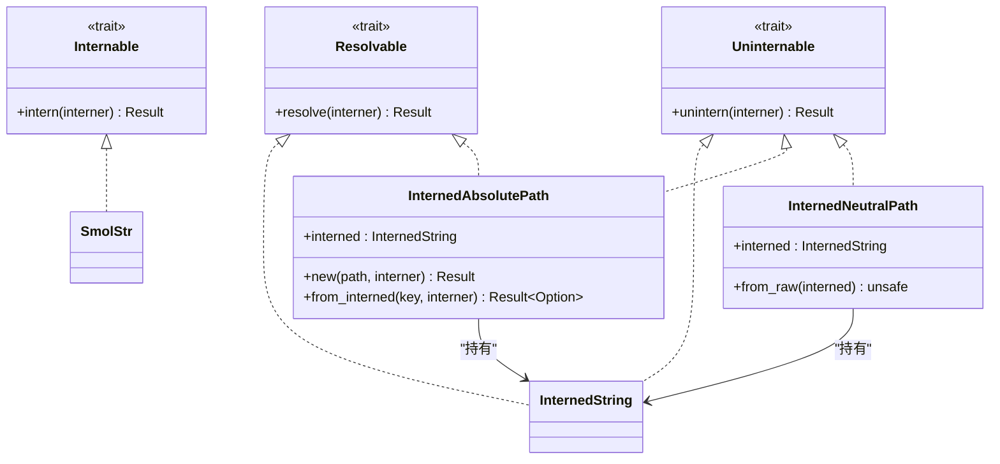
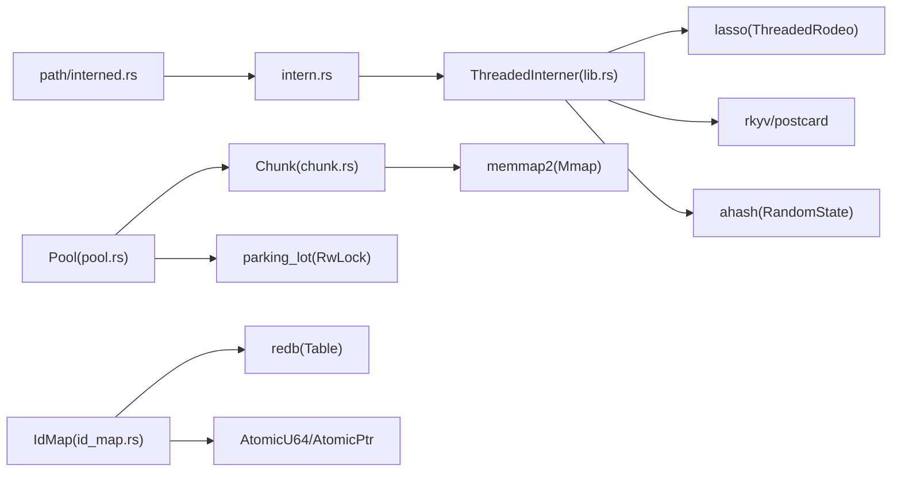

# 字符串驻留系统

<cite>
**本文引用的文件**
- [zako_interner/src/lib.rs](file://zako_interner/src/lib.rs)
- [zako_interner/src/chunk.rs](file://zako_interner/src/chunk.rs)
- [zako_interner/src/pool.rs](file://zako_interner/src/pool.rs)
- [zako_interner/src/key.rs](file://zako_interner/src/key.rs)
- [zako_interner/src/id_map.rs](file://zako_interner/src/id_map.rs)
- [zako_interner/Cargo.toml](file://zako_interner/Cargo.toml)
- [zako_core/src/intern.rs](file://zako_core/src/intern.rs)
- [zako_core/src/path/interned.rs](file://zako_core/src/path/interned.rs)
- [zako_core/src/tests/intern_tests.rs](file://zako_core/src/tests/intern_tests.rs)
- [zako_core/src/tests/mod.rs](file://zako_core/src/tests/mod.rs)
- [zako_core/src/lib.rs](file://zako_core/src/lib.rs)
</cite>

## 目录
1. [简介](#简介)
2. [项目结构](#项目结构)
3. [核心组件](#核心组件)
4. [架构总览](#架构总览)
5. [组件详解](#组件详解)
6. [依赖关系分析](#依赖关系分析)
7. [性能考量](#性能考量)
8. [故障排查指南](#故障排查指南)
9. [结论](#结论)
10. [附录：API 参考与使用示例](#附录api-参考与使用示例)

## 简介
本文件系统性阐述 Zako 的字符串驻留系统，重点解释其设计原理、内存优化策略与运行机制。该系统由两部分组成：
- 高速并发驻留池：基于 lasso 的线程化驻留器，提供 O(1) 平均复杂度的字符串驻留与解析。
- 内存块池与索引映射：用于持久化存储与跨进程/跨会话复用驻留数据，支持大体量字符串的高效序列化与反序列化。

通过字符串驻留，系统显著降低重复字符串的内存占用，并将字符串比较从 O(n) 降为 O(1) 指针比较，从而在大型构建项目中带来可观的性能收益。

## 项目结构
围绕字符串驻留的关键模块分布于两个子 crate：
- zako_interner：驻留器、内存块池、ID 映射与键类型定义。
- zako_core：驻留器在路径等领域的应用封装（如 InternedAbsolutePath、InternedNeutralPath）以及测试。

**图表来源**
- [zako_interner/src/lib.rs](file://zako_interner/src/lib.rs#L1-L195)
- [zako_interner/src/key.rs](file://zako_interner/src/key.rs#L1-L52)
- [zako_interner/src/chunk.rs](file://zako_interner/src/chunk.rs#L1-L148)
- [zako_interner/src/pool.rs](file://zako_interner/src/pool.rs#L1-L140)
- [zako_interner/src/id_map.rs](file://zako_interner/src/id_map.rs#L1-L184)
- [zako_core/src/intern.rs](file://zako_core/src/intern.rs#L1-L153)
- [zako_core/src/path/interned.rs](file://zako_core/src/path/interned.rs#L1-L39)
- [zako_core/src/tests/intern_tests.rs](file://zako_core/src/tests/intern_tests.rs#L1-L30)
- [zako_core/src/tests/mod.rs](file://zako_core/src/tests/mod.rs#L1-L15)

**章节来源**
- [zako_interner/src/lib.rs](file://zako_interner/src/lib.rs#L1-L195)
- [zako_core/src/intern.rs](file://zako_core/src/intern.rs#L1-L153)
- [zako_core/src/lib.rs](file://zako_core/src/lib.rs#L1-L119)

## 核心组件
- ThreadedInterner：基于 lasso 的线程化驻留器，提供 get_or_intern、resolve、get_or_intern_static 等接口，内部携带唯一 id 用于错误定位。
- U32NonZeroKey：紧凑键类型，使用 NonZeroU32 表示，便于 Option<InternedString> 压缩至 4 字节；实现 Key trait 以便与 lasso 兼容。
- Pool/Chunk/IndexedChunk：内存块池与索引包装，支持动态扩容、对齐写入、持久化保存与只读内存映射。
- IdMap：超大容量 ID 到 (chunk_idx, offset) 的稀疏映射，采用分页原子指针管理，支持持久化加载/保存。
- 应用层封装：zako_core 提供 Internable/Resolvable/Uninternable trait 与具体类型（如 InternedAbsolutePath、InternedNeutralPath），统一驻留字符串的生命周期与语义约束。

**章节来源**
- [zako_interner/src/lib.rs](file://zako_interner/src/lib.rs#L62-L194)
- [zako_interner/src/key.rs](file://zako_interner/src/key.rs#L1-L52)
- [zako_interner/src/pool.rs](file://zako_interner/src/pool.rs#L17-L140)
- [zako_interner/src/chunk.rs](file://zako_interner/src/chunk.rs#L10-L148)
- [zako_interner/src/id_map.rs](file://zako_interner/src/id_map.rs#L10-L184)
- [zako_core/src/intern.rs](file://zako_core/src/intern.rs#L1-L153)
- [zako_core/src/path/interned.rs](file://zako_core/src/path/interned.rs#L1-L39)

## 架构总览
下图展示了驻留系统在应用层与底层存储之间的交互流程，包括驻留、解析、持久化与恢复。

**图表来源**
- [zako_interner/src/lib.rs](file://zako_interner/src/lib.rs#L134-L188)
- [zako_interner/src/pool.rs](file://zako_interner/src/pool.rs#L104-L138)
- [zako_interner/src/id_map.rs](file://zako_interner/src/id_map.rs#L156-L182)
- [zako_interner/src/chunk.rs](file://zako_interner/src/chunk.rs#L55-L80)

## 组件详解

### ThreadedInterner（线程化驻留器）
- 设计要点
  - 使用 lasso::ThreadedRodeo 作为底层驻留容器，支持多线程并发驻留与解析。
  - 键类型 U32NonZeroKey 实现 lasso::Key，确保驻留键与 lasso 兼容。
  - 提供 get_or_intern/get_or_intern_static/resolve 三类核心方法。
  - 每个实例维护一个随机 id，用于错误上下文增强。
- 错误模型
  - CreationError：初始化失败（如容量或随机数生成）。
  - KeyOutOfBounds：解析键越界（通常表示键不属于当前驻留器）。
  - LassoError：底层 lasso 报错。
- 序列化
  - 通过 rkyv/postcard 将驻留器整体序列化为字节向量，便于持久化与传输。

**图表来源**
- [zako_interner/src/lib.rs](file://zako_interner/src/lib.rs#L62-L194)
- [zako_interner/src/key.rs](file://zako_interner/src/key.rs#L32-L51)

**章节来源**
- [zako_interner/src/lib.rs](file://zako_interner/src/lib.rs#L62-L194)
- [zako_interner/src/key.rs](file://zako_interner/src/key.rs#L1-L52)

### Pool/Chunk/IndexedChunk（内存块池与索引）
- 设计要点
  - Chunk 支持内存块 Memory 与只读内存映射 Mmap 两种形态。
  - IndexedChunk 为 Chunk 的带索引包装，便于持久化时记录归属块。
  - Pool 负责动态扩容与分配，采用原子游标实现无锁写入。
  - 对齐写入与长度前缀保证可稳定恢复。
- 分配流程
  - 快路径优先使用当前活跃块；不足则创建新块并更新活跃块。
  - 新块大小按倍增策略增长，上限受配置控制。
- 持久化
  - 将所有 Memory 块内容追加写入二进制文件，跳过 Mmap 块。
  - 读取时可重建 Chunk 列表并恢复游标状态。

**图表来源**
- [zako_interner/src/pool.rs](file://zako_interner/src/pool.rs#L104-L138)
- [zako_interner/src/chunk.rs](file://zako_interner/src/chunk.rs#L88-L119)

**章节来源**
- [zako_interner/src/pool.rs](file://zako_interner/src/pool.rs#L17-L140)
- [zako_interner/src/chunk.rs](file://zako_interner/src/chunk.rs#L10-L148)

### IdMap（ID 到块索引的映射）
- 设计要点
  - 采用分页结构，每页容纳固定数量条目，使用原子指针懒加载页面。
  - register 将 (chunk_idx, offset) 打包为 u64 存入对应页。
  - resolve 通过 ID 计算页号与索引，原子读取打包值并解包。
- 内存占用
  - 支持数十亿 ID，仅需常数级内存（页表+原子指针），空间换时间。
- 持久化
  - 将已分配页的内容以固定大小块写入数据库，支持增量保存。

**图表来源**
- [zako_interner/src/id_map.rs](file://zako_interner/src/id_map.rs#L156-L182)

**章节来源**
- [zako_interner/src/id_map.rs](file://zako_interner/src/id_map.rs#L10-L184)

### 应用层封装与类型
- zako_core 提供：
  - Internable/Resolvable/Uninternable trait，统一驻留与还原流程。
  - InternedAbsolutePath：要求绝对路径，避免相对路径导致的歧义。
  - InternedNeutralPath：面向中立路径的驻留类型。
- 测试验证了驻留绝对路径的正确性与还原一致性。

**图表来源**
- [zako_core/src/intern.rs](file://zako_core/src/intern.rs#L9-L153)
- [zako_core/src/path/interned.rs](file://zako_core/src/path/interned.rs#L6-L39)

**章节来源**
- [zako_core/src/intern.rs](file://zako_core/src/intern.rs#L1-L153)
- [zako_core/src/path/interned.rs](file://zako_core/src/path/interned.rs#L1-L39)
- [zako_core/src/tests/intern_tests.rs](file://zako_core/src/tests/intern_tests.rs#L1-L30)
- [zako_core/src/tests/mod.rs](file://zako_core/src/tests/mod.rs#L1-L15)

## 依赖关系分析
- 外部依赖
  - lasso：高性能并发驻留器。
  - rkyv/postcard：零拷贝序列化与反序列化。
  - redb：嵌入式事务型键值存储，用于持久化。
  - memmap2：内存映射文件。
  - parking_lot：读写锁等同步原语。
  - ahash：高性能哈希器。
- 内部耦合
  - zako_interner 与 zako_core 通过类型别名与 trait 解耦，应用层仅依赖抽象接口。
  - Pool/Chunk 与 IdMap 协作，支撑驻留数据的持久化与恢复。

**图表来源**
- [zako_interner/Cargo.toml](file://zako_interner/Cargo.toml#L12-L28)
- [zako_interner/src/lib.rs](file://zako_interner/src/lib.rs#L1-L11)
- [zako_interner/src/pool.rs](file://zako_interner/src/pool.rs#L1-L16)
- [zako_interner/src/chunk.rs](file://zako_interner/src/chunk.rs#L1-L8)
- [zako_interner/src/id_map.rs](file://zako_interner/src/id_map.rs#L1-L6)
- [zako_core/src/intern.rs](file://zako_core/src/intern.rs#L1-L7)
- [zako_core/src/path/interned.rs](file://zako_core/src/path/interned.rs#L1-L4)

**章节来源**
- [zako_interner/Cargo.toml](file://zako_interner/Cargo.toml#L12-L28)

## 性能考量
- 内存优化
  - 字符串驻留将重复字符串仅保留一份，显著降低内存占用。
  - U32NonZeroKey 以紧凑键替代完整字符串，配合 Option 压缩至 4 字节。
  - Pool 采用对齐写入与长度前缀，避免碎片与额外拷贝。
- 并发与缓存
  - ThreadedInterner 基于 lasso 的线程化实现，支持高并发驻留与解析。
  - IdMap 使用原子指针与分页结构，减少锁竞争，提升查找吞吐。
- 持久化与恢复
  - 通过 rkyv/postcard 快速序列化驻留器状态，recovery 时可快速重建驻留表。
  - Pool 与 IdMap 的组合使大体量字符串在重启后仍可快速定位与访问。
- 大型构建项目收益
  - 在大规模目标与规则中，大量字符串（如路径、标签、配置键）被重复使用，驻留系统可显著减少内存峰值与 GC 压力。
  - 字符串比较 O(1) 化，加速依赖图构建与去重过程，缩短总体构建时间。

[本节为通用性能讨论，不直接分析具体文件]

## 故障排查指南
- 常见错误与定位
  - CreationError：检查容量参数与随机数源初始化。
  - KeyOutOfBounds：确认键来自正确的 ThreadedInterner 实例，避免跨实例误用。
  - LassoError：关注底层 lasso 的错误来源，可能与哈希器或容量配置有关。
- 排查步骤
  - 核对 ThreadedInterner 的 id 与错误消息中的 id 是否一致。
  - 确认字符串是否满足领域约束（如绝对路径）。
  - 检查持久化流程是否完整执行（Pool.save/IdMap.save 与 DB 写入）。
- 单元测试参考
  - 使用测试用例验证驻留绝对路径的行为与还原一致性。

**章节来源**
- [zako_interner/src/lib.rs](file://zako_interner/src/lib.rs#L124-L132)
- [zako_core/src/tests/intern_tests.rs](file://zako_core/src/tests/intern_tests.rs#L1-L30)
- [zako_core/src/tests/mod.rs](file://zako_core/src/tests/mod.rs#L4-L6)

## 结论
Zako 的字符串驻留系统通过“线程化驻留器 + 内存块池 + ID 映射”的组合，在保证高并发与可扩展性的前提下，实现了字符串驻留的高性能与低内存占用。在大型构建场景中，驻留系统显著提升了字符串比较与去重效率，降低了内存压力，并通过持久化机制保障了跨会话的稳定性与可恢复性。

[本节为总结性内容，不直接分析具体文件]

## 附录：API 参考与使用示例

### API 参考
- ThreadedInterner
  - new() -> Result<ThreadedInterner, InternerError>
  - get_or_intern(val: impl AsRef<str>) -> Result<Key, InternerError>
  - get_or_intern_static(val: &'static str) -> Result<Key, InternerError>
  - resolve(key: impl AsRef<Key>) -> Result<&str, InternerError>
  - id() -> u64
  - interner() -> &ThreadedRodeo
- U32NonZeroKey
  - into_u64() -> u64
  - try_from_u64(u64) -> Option<Self>
- Pool/Chunk/IndexedChunk
  - new(options: PoolOptions) -> Pool
  - alloc(minimum_size: usize) -> Result<(IndexedChunk, usize)>
  - save(db: &mut WriteTransaction, bin_file: &Path) -> Result<()>
  - access(chunk_idx: u16, offset: usize, length: usize) -> &[u8]
  - access_mut(...mut) -> &mut [u8]
- IdMap
  - new() -> IdMap
  - register(id: u64, chunk_idx: u16, offset: u64) -> ()
  - resolve(id: u32) -> (u16, u64)
  - save(count: usize, db: &mut Table) -> Result<()>
- 应用层类型
  - Internable/Resolvable/Uninternable trait
  - InternedAbsolutePath/new/from_interned
  - InternedNeutralPath/from_raw

**章节来源**
- [zako_interner/src/lib.rs](file://zako_interner/src/lib.rs#L134-L188)
- [zako_interner/src/key.rs](file://zako_interner/src/key.rs#L32-L51)
- [zako_interner/src/pool.rs](file://zako_interner/src/pool.rs#L39-L138)
- [zako_interner/src/chunk.rs](file://zako_interner/src/chunk.rs#L28-L147)
- [zako_interner/src/id_map.rs](file://zako_interner/src/id_map.rs#L29-L182)
- [zako_core/src/intern.rs](file://zako_core/src/intern.rs#L9-L153)
- [zako_core/src/path/interned.rs](file://zako_core/src/path/interned.rs#L13-L38)

### 使用示例（路径驻留）
- 创建驻留器
  - 使用静态初始化或在测试中通过 Arc 包装的全局驻留器进行共享。
- 驻留绝对路径
  - 使用 InternedAbsolutePath::new 将 Utf8Path 转为驻留路径，自动校验绝对路径。
- 还原路径
  - 通过 unintern 或直接 resolve 获取原始 Utf8PathBuf 或 &str。
- 示例参考
  - 测试用例演示了驻留绝对路径与还原一致性的断言。

**章节来源**
- [zako_core/src/tests/intern_tests.rs](file://zako_core/src/tests/intern_tests.rs#L6-L29)
- [zako_core/src/tests/mod.rs](file://zako_core/src/tests/mod.rs#L4-L6)
- [zako_core/src/intern.rs](file://zako_core/src/intern.rs#L91-L121)