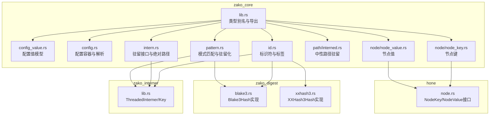
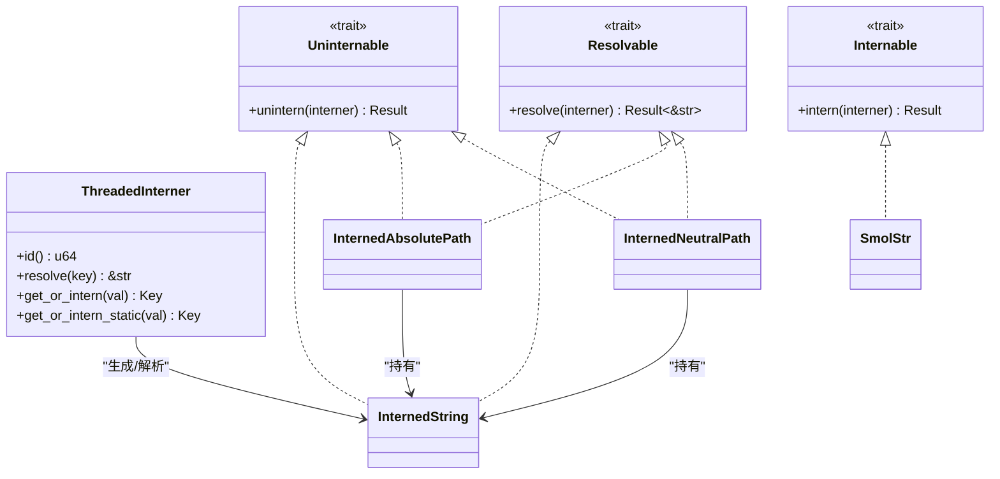
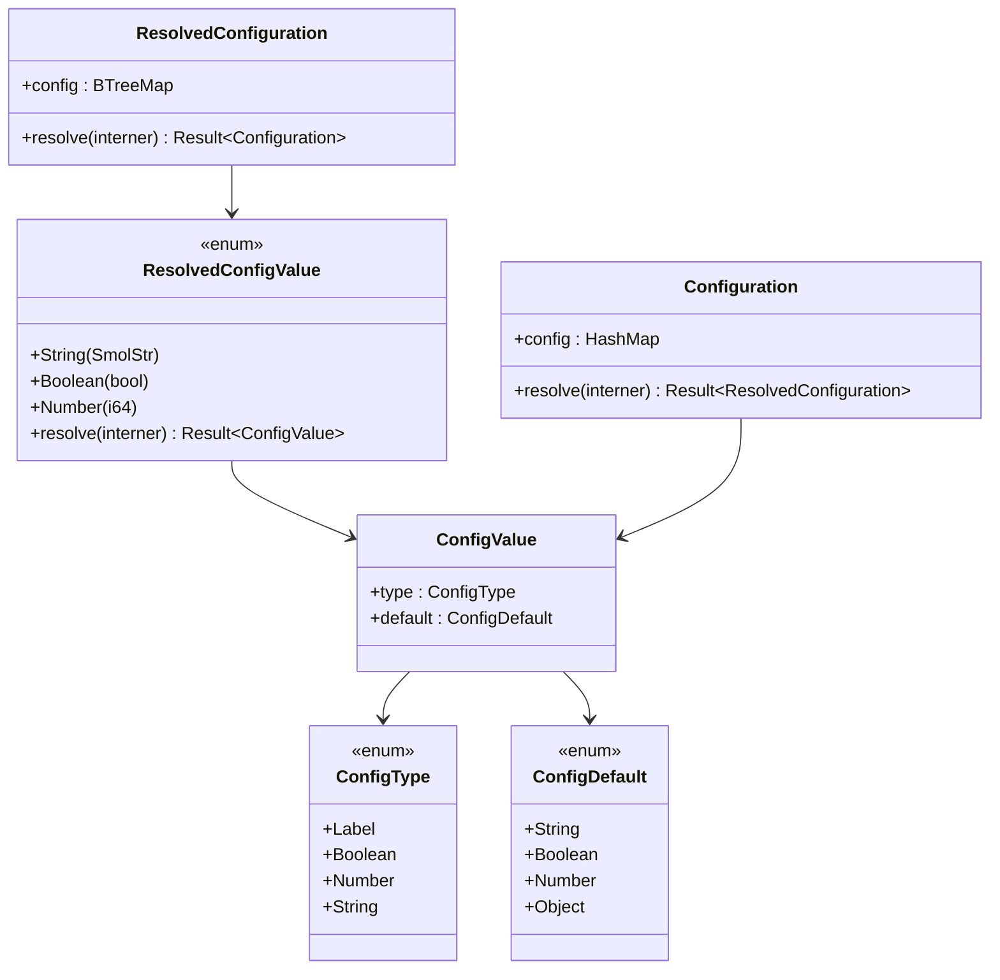
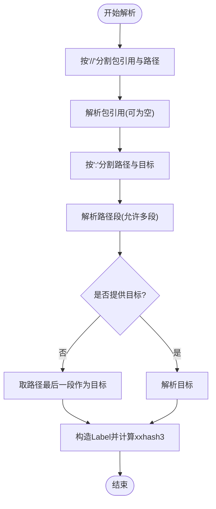
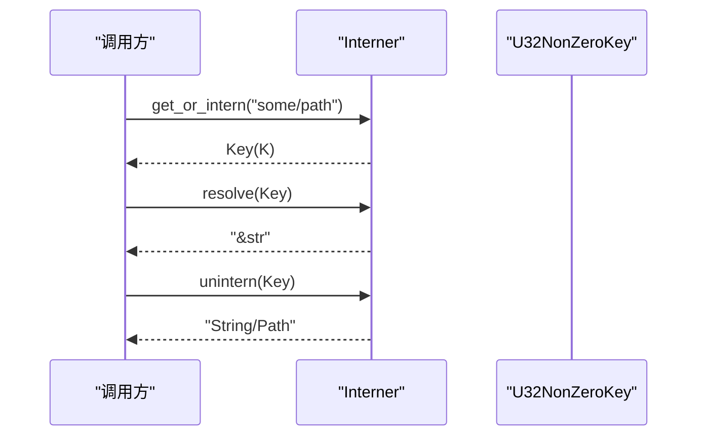
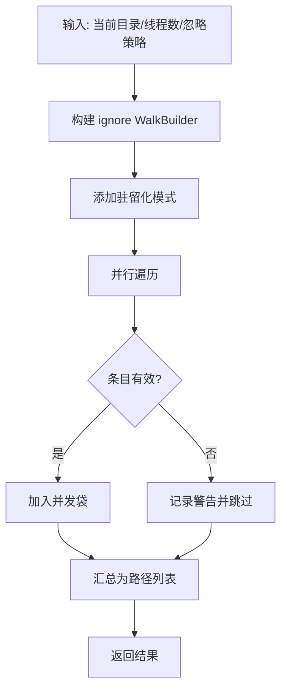
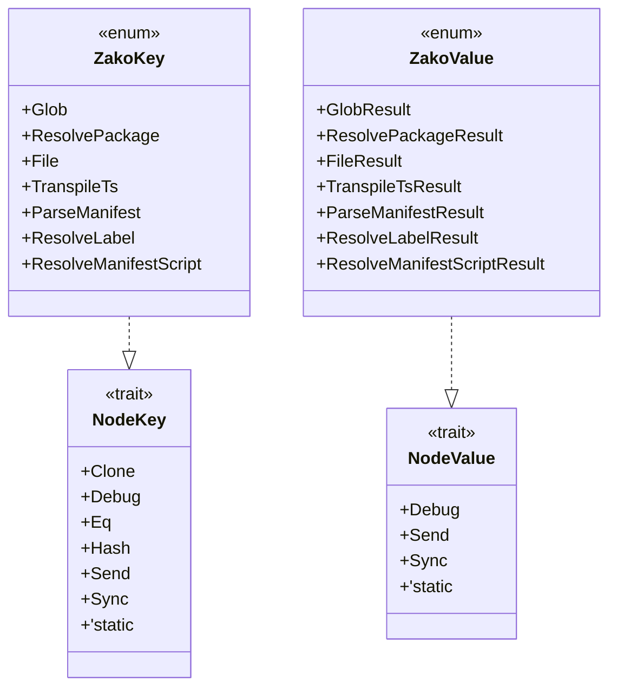
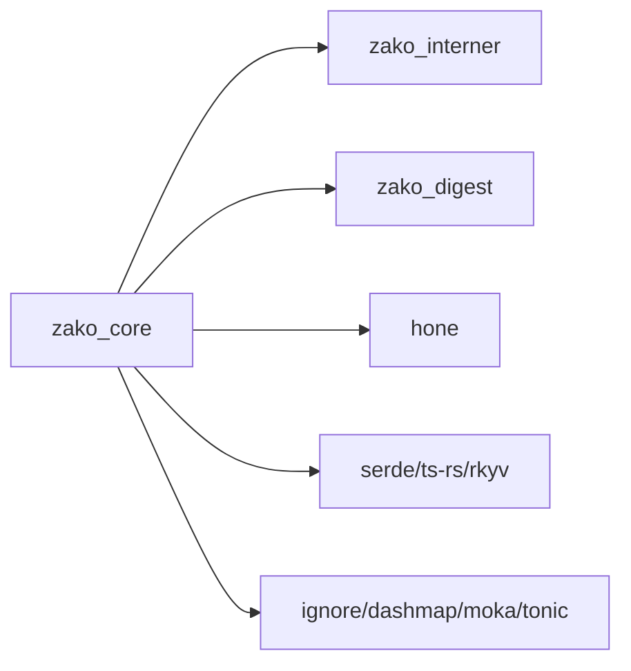

# 数据结构与类型

<cite>
**本文引用的文件**
- [zako_core/src/lib.rs](file://zako_core/src/lib.rs)
- [zako_core/src/config_value.rs](file://zako_core/src/config_value.rs)
- [zako_core/src/config.rs](file://zako_core/src/config.rs)
- [zako_core/src/id.rs](file://zako_core/src/id.rs)
- [zako_core/src/intern.rs](file://zako_core/src/intern.rs)
- [zako_core/src/pattern.rs](file://zako_core/src/pattern.rs)
- [zako_core/src/path/interned.rs](file://zako_core/src/path/interned.rs)
- [zako_core/src/node/node_key.rs](file://zako_core/src/node/node_key.rs)
- [zako_core/src/node/node_value.rs](file://zako_core/src/node/node_value.rs)
- [zako_interner/src/lib.rs](file://zako_interner/src/lib.rs)
- [hone/src/node.rs](file://hone/src/node.rs)
- [zako_digest/src/blake3.rs](file://zako_digest/src/blake3.rs)
- [zako_digest/src/xxhash3.rs](file://zako_digest/src/xxhash3.rs)
- [zako_core/src/tests/config_value_tests.rs](file://zako_core/src/tests/config_value_tests.rs)
- [zako_core/src/tests/intern_tests.rs](file://zako_core/src/tests/intern_tests.rs)
- [zako_core/src/tests/id_tests.rs](file://zako_core/src/tests/id_tests.rs)
- [zako_core/src/consts.rs](file://zako_core/src/consts.rs)
</cite>

## 目录
1. [引言](#引言)
2. [项目结构](#项目结构)
3. [核心组件](#核心组件)
4. [架构总览](#架构总览)
5. [详细组件分析](#详细组件分析)
6. [依赖关系分析](#依赖关系分析)
7. [性能考量](#性能考量)
8. [故障排查指南](#故障排查指南)
9. [结论](#结论)
10. [附录](#附录)

## 引言
本文件为 Zako 的数据结构与类型系统提供权威参考，覆盖核心数据类型、接口定义、序列化机制与错误类型。重点阐述节点键值对、配置值、模式匹配、标识符与字符串驻留等关键类型的设计原理、内存布局与性能特征，并给出类型转换、序列化/反序列化与错误处理流程的说明。面向系统架构师与高级开发者，帮助在扩展与优化类型系统时做出正确决策。

## 项目结构
Zako 的类型系统主要集中在 zako_core 与相关子模块中，围绕“驻留（intern）”“标签（Label）”“配置（Config）”“模式（Pattern）”“构建图节点（NodeKey/NodeValue）”等核心概念组织。zako_interner 提供高性能字符串驻留池，zako_digest 提供哈希能力，hone 定义了构建图节点的通用接口。

图表来源
- [zako_core/src/lib.rs](file://zako_core/src/lib.rs#L30-L80)
- [zako_core/src/config_value.rs](file://zako_core/src/config_value.rs#L1-L166)
- [zako_core/src/config.rs](file://zako_core/src/config.rs#L1-L119)
- [zako_core/src/id.rs](file://zako_core/src/id.rs#L1-L379)
- [zako_core/src/intern.rs](file://zako_core/src/intern.rs#L1-L153)
- [zako_core/src/pattern.rs](file://zako_core/src/pattern.rs#L1-L247)
- [zako_core/src/path/interned.rs](file://zako_core/src/path/interned.rs#L1-L39)
- [zako_core/src/node/node_key.rs](file://zako_core/src/node/node_key.rs#L1-L39)
- [zako_core/src/node/node_value.rs](file://zako_core/src/node/node_value.rs#L1-L22)
- [zako_interner/src/lib.rs](file://zako_interner/src/lib.rs#L1-L195)
- [zako_digest/src/blake3.rs](file://zako_digest/src/blake3.rs#L288-L348)
- [zako_digest/src/xxhash3.rs](file://zako_digest/src/xxhash3.rs#L288-L350)
- [hone/src/node.rs](file://hone/src/node.rs#L38-L60)

章节来源
- [zako_core/src/lib.rs](file://zako_core/src/lib.rs#L30-L80)

## 核心组件
- 驻留与字符串驻留
  - zako_interner 提供 ThreadedInterner 与 U32NonZeroKey，支持线程安全的驻留与 O(1) 键访问。
  - intern.rs 暴露 Internable/Uninternable/Resolvable 接口，统一字符串与路径的驻留/还原。
- 标识符与标签
  - id.rs 定义标识符规则与解析：原子标识符、路径段、包引用、标签（Label），并提供格式化与解析。
- 配置值与配置
  - config_value.rs 定义 ConfigValue/ConfigDefault/ConfigType/ResolvedConfigValue 等，支持序列化与快速哈希。
  - config.rs 定义 Configuration/ResolvedConfiguration，提供从原始到驻留配置的转换。
- 模式匹配
  - pattern.rs 定义 Pattern 与 InternedPattern，结合 ignore 库实现高效并行遍历。
- 构建图节点
  - node/node_key.rs 与 node/node_value.rs 将具体计算结果与键类型桥接到 hone 的 NodeKey/NodeValue 接口。

章节来源
- [zako_interner/src/lib.rs](file://zako_interner/src/lib.rs#L1-L195)
- [zako_core/src/intern.rs](file://zako_core/src/intern.rs#L1-L153)
- [zako_core/src/id.rs](file://zako_core/src/id.rs#L1-L379)
- [zako_core/src/config_value.rs](file://zako_core/src/config_value.rs#L1-L166)
- [zako_core/src/config.rs](file://zako_core/src/config.rs#L1-L119)
- [zako_core/src/pattern.rs](file://zako_core/src/pattern.rs#L1-L247)
- [zako_core/src/node/node_key.rs](file://zako_core/src/node/node_key.rs#L1-L39)
- [zako_core/src/node/node_value.rs](file://zako_core/src/node/node_value.rs#L1-L22)

## 架构总览
Zako 类型系统以“驻留 + 哈希 + 序列化”为核心设计原则：
- 字符串与路径通过 ThreadedInterner 驻留，减少重复存储与比较成本。
- 关键类型实现 Blake3Hash/XXHash3Hash，保证稳定且高效的哈希用于缓存与排序。
- 使用 rkyv 进行零拷贝归档与反归档，配合 serde/ts_rs 支持跨语言互操作。
- 构建图节点通过 NodeKey/NodeValue 抽象，统一不同任务的输入输出类型。

图表来源
- [zako_interner/src/lib.rs](file://zako_interner/src/lib.rs#L64-L188)
- [zako_core/src/intern.rs](file://zako_core/src/intern.rs#L9-L53)
- [zako_core/src/path/interned.rs](file://zako_core/src/path/interned.rs#L6-L38)

## 详细组件分析

### 配置值与配置容器
- 设计要点
  - ConfigValue 由 ConfigType 与 ConfigDefault 组成，支持字符串、布尔、整数与对象（ConfigOperation）默认值。
  - ResolvedConfigValue 为运行时驻留化后的值，便于快速比较与索引。
  - Configuration/ResolvedConfiguration 提供从原始到驻留配置的转换，键为 Label，值为 ResolvedConfigValue。
- 序列化与哈希
  - 使用 serde/ts_rs/rkyv 实现跨语言与高性能序列化；Blake3Hash 用于稳定哈希。
- 错误处理
  - ConfigError 汇聚 InternerError、IdParseError 与通用错误，便于上层统一处理。

图表来源
- [zako_core/src/config_value.rs](file://zako_core/src/config_value.rs#L8-L166)
- [zako_core/src/config.rs](file://zako_core/src/config.rs#L14-L119)

章节来源
- [zako_core/src/config_value.rs](file://zako_core/src/config_value.rs#L1-L166)
- [zako_core/src/config.rs](file://zako_core/src/config.rs#L1-L119)
- [zako_core/src/tests/config_value_tests.rs](file://zako_core/src/tests/config_value_tests.rs#L1-L33)

### 标识符与标签（Label）
- 设计要点
  - 标识符规则：is_ident/is_loose_ident/is_more_loose_ident 三档宽松度，分别对应严格、宽松与更宽松场景。
  - Label 由包引用（InternedPackageRef）、路径（InternedPath）、目标（InternedTarget）构成，内部维护 xxhash3 排序与比较。
  - 提供 try_parse/new/resolved 等方法，支持从字符串解析与格式化输出。
- 哈希与排序
  - Label 实现 Ord/PartialOrd，基于 xxhash3 的排序，提升构建图查找效率。
- 错误处理
  - IdParseError 覆盖格式、组件与驻留错误，便于定位解析失败原因。

图表来源
- [zako_core/src/id.rs](file://zako_core/src/id.rs#L348-L378)

章节来源
- [zako_core/src/id.rs](file://zako_core/src/id.rs#L1-L379)
- [zako_core/src/tests/id_tests.rs](file://zako_core/src/tests/id_tests.rs#L1-L126)

### 字符串驻留与路径驻留
- 设计要点
  - InternedString/U32NonZeroKey 作为驻留键，O(1) 访问与比较；ThreadedInterner 支持多线程安全驻留。
  - InternedAbsolutePath 要求绝对路径，提供从绝对路径与驻留键之间的双向转换。
  - InternedNeutralPath 用于中性路径驻留，保持与 NeutralPath 的互转。
- 接口契约
  - Internable/Uninternable/Resolvable 三接口统一驻留/还原/解析行为，便于扩展新类型。

图表来源
- [zako_interner/src/lib.rs](file://zako_interner/src/lib.rs#L134-L188)
- [zako_core/src/intern.rs](file://zako_core/src/intern.rs#L28-L53)
- [zako_core/src/path/interned.rs](file://zako_core/src/path/interned.rs#L13-L38)

章节来源
- [zako_interner/src/lib.rs](file://zako_interner/src/lib.rs#L1-L195)
- [zako_core/src/intern.rs](file://zako_core/src/intern.rs#L1-L153)
- [zako_core/src/path/interned.rs](file://zako_core/src/path/interned.rs#L1-L39)
- [zako_core/src/tests/intern_tests.rs](file://zako_core/src/tests/intern_tests.rs#L1-L30)

### 模式匹配与并行遍历
- 设计要点
  - Pattern 支持多模式、标准忽略文件与隐藏文件控制；InternedPattern 将模式字符串驻留化，降低内存占用。
  - InternedPattern.walk 并行遍历目录，使用 ignore 库与并发袋收集结果。
- 哈希与排序
  - Pattern/InternedPattern/PatternGroup 实现 Blake3Hash，便于缓存键生成与一致性校验。

图表来源
- [zako_core/src/pattern.rs](file://zako_core/src/pattern.rs#L132-L177)

章节来源
- [zako_core/src/pattern.rs](file://zako_core/src/pattern.rs#L1-L247)

### 构建图节点键值对
- 设计要点
  - ZakoKey/ZakoValue 通过枚举封装不同任务的键与值，统一接入 hone 的 NodeKey/NodeValue 接口。
  - 与具体计算模块（文件、打包、标签解析、脚本解析、TS 转译、清单解析）解耦，便于扩展与替换。

图表来源
- [hone/src/node.rs](file://hone/src/node.rs#L38-L60)
- [zako_core/src/node/node_key.rs](file://zako_core/src/node/node_key.rs#L14-L39)
- [zako_core/src/node/node_value.rs](file://zako_core/src/node/node_value.rs#L10-L22)

章节来源
- [zako_core/src/node/node_key.rs](file://zako_core/src/node/node_key.rs#L1-L39)
- [zako_core/src/node/node_value.rs](file://zako_core/src/node/node_value.rs#L1-L22)
- [hone/src/node.rs](file://hone/src/node.rs#L38-L60)

## 依赖关系分析
- 内部依赖
  - zako_core 大量依赖 zako_interner（驻留）、zako_digest（哈希）、hone（节点接口）、smol_str/ts_rs/rkyv（序列化）。
- 外部依赖
  - ignore（模式匹配）、lasso/threaded-rodeo（驻留池）、dashmap/moka（并发容器）、tonic（Protobuf）。
- 循环依赖
  - 未发现直接循环；类型系统通过 trait 与枚举实现松耦合。

图表来源
- [zako_core/src/lib.rs](file://zako_core/src/lib.rs#L98-L118)
- [zako_interner/src/lib.rs](file://zako_interner/src/lib.rs#L1-L195)
- [zako_digest/src/blake3.rs](file://zako_digest/src/blake3.rs#L288-L348)
- [zako_digest/src/xxhash3.rs](file://zako_digest/src/xxhash3.rs#L288-L350)

章节来源
- [zako_core/src/lib.rs](file://zako_core/src/lib.rs#L98-L118)

## 性能考量
- 驻留与哈希
  - 字符串驻留显著降低内存占用与比较开销；Blake3/XXHash3 用于稳定哈希与排序，避免随机性带来的缓存抖动。
- 并发与序列化
  - DashMap/DashSet/Moka 用于高并发读写；rkyv 零拷贝归档/反归档，减少 GC 压力与序列化成本。
- 模式匹配
  - ignore 并行遍历与并发袋收集，适合大规模目录扫描；隐藏文件与忽略文件策略可减少 IO 与无效遍历。
- 类型转换
  - ResolvedConfiguration 使用 BTreeMap 保证有序性，便于模板生成与调试；Label 的排序基于 xxhash3，兼顾速度与稳定性。

## 故障排查指南
- 解析错误
  - IdParseError：检查标识符是否符合 is_loose_ident/is_more_loose_ident 规则；确认路径段不含 . 或 ..。
  - PatternError：关注 ignore 并行遍历中的 IO 错误与驻留错误；确认模式字符串已驻留化。
- 驻留错误
  - InternerError：检查 ThreadedInterner 初始化与键越界；确认驻留池容量与哈希器配置合理。
- 配置错误
  - ConfigError：核对配置键是否为合法 Label；确认默认值类型与 ConfigType 匹配。

章节来源
- [zako_core/src/id.rs](file://zako_core/src/id.rs#L91-L103)
- [zako_core/src/pattern.rs](file://zako_core/src/pattern.rs#L90-L98)
- [zako_interner/src/lib.rs](file://zako_interner/src/lib.rs#L124-L132)
- [zako_core/src/config.rs](file://zako_core/src/config.rs#L91-L99)

## 结论
Zako 的类型系统以“驻留 + 哈希 + 序列化”为核心，通过清晰的接口与稳定的实现，兼顾性能与可扩展性。标识符与标签、配置值与容器、模式匹配与构建图节点均遵循统一的设计范式，便于在大型工程中保持一致性与可维护性。建议在新增类型时优先采用现有 trait 与驻留策略，确保与整体架构协同。

## 附录
- 常用类型别名
  - ConcurrentMap/Set/Cache：基于 ahash 的高性能并发容器。
  - Protobuf 模块：tonic 自动生成的 zako.v1.* 命名空间。
- 文件类型常量
  - 定义了脚本、库、清单、构建、规则、工具链、配置等文件后缀与默认挂载点。

章节来源
- [zako_core/src/lib.rs](file://zako_core/src/lib.rs#L82-L118)
- [zako_core/src/consts.rs](file://zako_core/src/consts.rs#L1-L68)