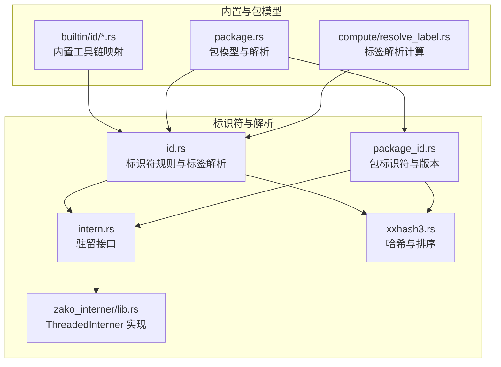
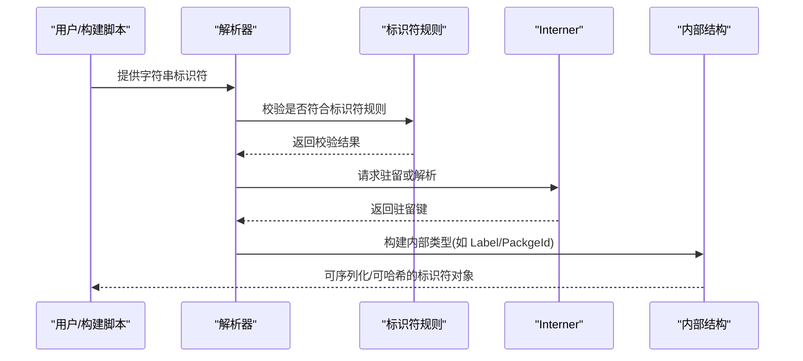
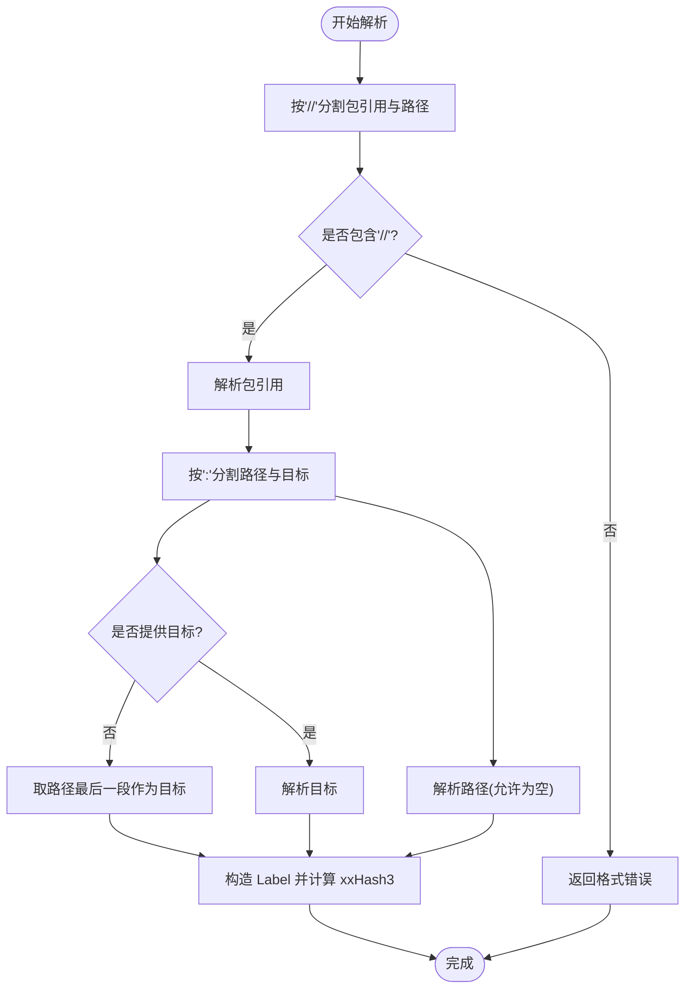
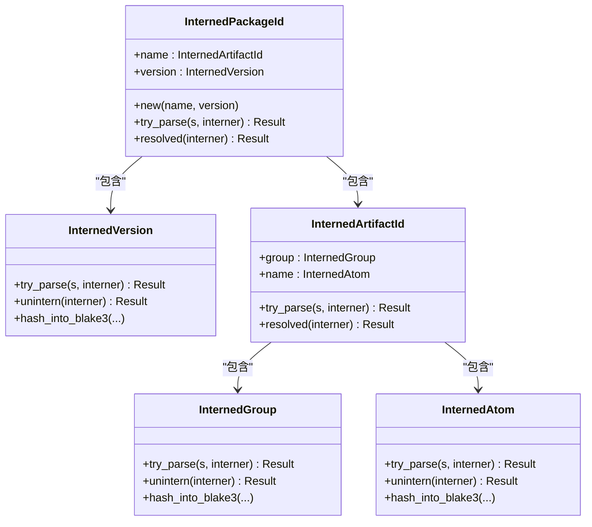
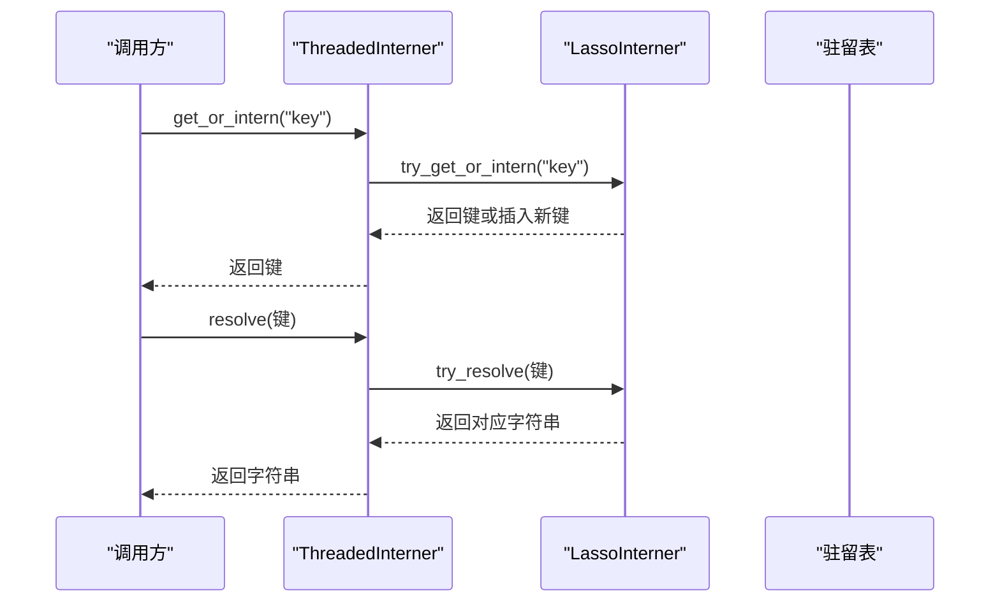
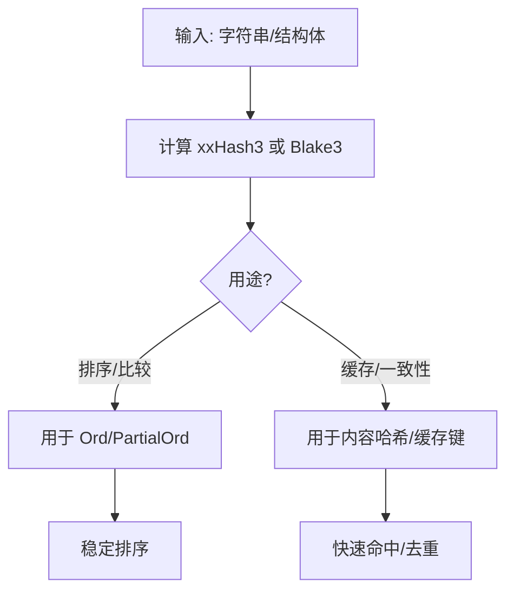
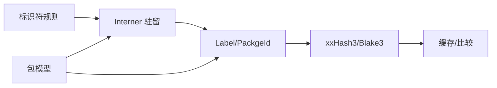

# 标识符系统

<cite>
**本文档引用的文件**
- [zako_core/src/id.rs](file://zako_core/src/id.rs)
- [zako_core/src/package_id.rs](file://zako_core/src/package_id.rs)
- [zako_core/src/intern.rs](file://zako_core/src/intern.rs)
- [zako_interner/src/lib.rs](file://zako_interner/src/lib.rs)
- [zako_digest/src/xxhash3.rs](file://zako_digest/src/xxhash3.rs)
- [zako_core/src/builtin/id/mod.rs](file://zako_core/src/builtin/id/mod.rs)
- [zako_core/src/builtin/id/c.rs](file://zako_core/src/builtin/id/c.rs)
- [zako_core/src/builtin/id/cpp.rs](file://zako_core/src/builtin/id/cpp.rs)
- [zako_core/src/package.rs](file://zako_core/src/package.rs)
- [zako_core/src/compute/resolve_label.rs](file://zako_core/src/compute/resolve_label.rs)
- [zako_core/src/tests/id_tests.rs](file://zako_core/src/tests/id_tests.rs)
</cite>

## 目录
1. [引言](#引言)
2. [项目结构](#项目结构)
3. [核心组件](#核心组件)
4. [架构总览](#架构总览)
5. [组件详解](#组件详解)
6. [依赖关系分析](#依赖关系分析)
7. [性能考量](#性能考量)
8. [故障排查指南](#故障排查指南)
9. [结论](#结论)
10. [附录](#附录)

## 引言
本文件为 Zako 的标识符系统提供权威参考。内容覆盖 ID 与 PackageId 等标识符类型的定义、用途与约束，解析与序列化流程，唯一性与版本管理机制，以及在包管理、目标引用与依赖解析中的角色。同时给出格式规范、命名约定、最佳实践、扩展性与向后兼容设计，以及冲突处理、迁移与升级策略。

## 项目结构
标识符系统主要分布在以下模块：
- 字符串规范化与标识符规则：zako_core/src/id.rs
- 包标识符（ArtifactId、PackageId）与版本：zako_core/src/package_id.rs
- 内部驻留器（Interner）与驻留类型：zako_core/src/intern.rs、zako_interner/src/lib.rs
- 哈希与排序：zako_digest/src/xxhash3.rs
- 内置工具链与目标类型映射：zako_core/src/builtin/id/*.rs
- 包模型与解析：zako_core/src/package.rs
- 标签解析与目标选择：zako_core/src/compute/resolve_label.rs
- 行为验证与示例：zako_core/src/tests/id_tests.rs

图表来源
- [zako_core/src/id.rs](file://zako_core/src/id.rs#L1-L388)
- [zako_core/src/package_id.rs](file://zako_core/src/package_id.rs#L1-L206)
- [zako_core/src/intern.rs](file://zako_core/src/intern.rs#L1-L153)
- [zako_interner/src/lib.rs](file://zako_interner/src/lib.rs#L1-L195)
- [zako_digest/src/xxhash3.rs](file://zako_digest/src/xxhash3.rs#L92-L392)
- [zako_core/src/builtin/id/mod.rs](file://zako_core/src/builtin/id/mod.rs#L1-L50)
- [zako_core/src/package.rs](file://zako_core/src/package.rs#L1-L322)
- [zako_core/src/compute/resolve_label.rs](file://zako_core/src/compute/resolve_label.rs#L1-L114)

章节来源
- [zako_core/src/id.rs](file://zako_core/src/id.rs#L1-L388)
- [zako_core/src/package_id.rs](file://zako_core/src/package_id.rs#L1-L206)
- [zako_core/src/intern.rs](file://zako_core/src/intern.rs#L1-L153)
- [zako_interner/src/lib.rs](file://zako_interner/src/lib.rs#L1-L195)
- [zako_digest/src/xxhash3.rs](file://zako_digest/src/xxhash3.rs#L92-L392)
- [zako_core/src/builtin/id/mod.rs](file://zako_core/src/builtin/id/mod.rs#L1-L50)
- [zako_core/src/package.rs](file://zako_core/src/package.rs#L1-L322)
- [zako_core/src/compute/resolve_label.rs](file://zako_core/src/compute/resolve_label.rs#L1-L114)

## 核心组件
- 字符串标识符规则与标签解析：提供严格与宽松的标识符校验函数，以及标签（Label）的解析与序列化能力。
- 包标识符与版本：定义 ArtifactId、PackageId 与版本类型，支持 SemVer 2.0.0 校验与解析。
- 驻留器（Interner）：统一管理字符串驻留，减少内存占用，提供稳定的键值访问。
- 哈希与排序：基于 xxHash3 的排序与 Blake3 的内容哈希，支撑缓存命中与一致性校验。
- 内置工具链映射：通过宏生成内置 ID 映射，便于工具链与目标类型枚举。
- 包模型与解析：将原始包配置解析为内部结构，使用标识符进行依赖与配置键校验。

章节来源
- [zako_core/src/id.rs](file://zako_core/src/id.rs#L12-L388)
- [zako_core/src/package_id.rs](file://zako_core/src/package_id.rs#L21-L206)
- [zako_core/src/intern.rs](file://zako_core/src/intern.rs#L1-L153)
- [zako_interner/src/lib.rs](file://zako_interner/src/lib.rs#L64-L188)
- [zako_digest/src/xxhash3.rs](file://zako_digest/src/xxhash3.rs#L92-L392)
- [zako_core/src/builtin/id/mod.rs](file://zako_core/src/builtin/id/mod.rs#L1-L50)
- [zako_core/src/package.rs](file://zako_core/src/package.rs#L68-L221)

## 架构总览
标识符系统围绕“规则校验 → 驻留存储 → 序列化/哈希 → 解析使用”的主干流程展开。解析阶段将字符串转换为紧凑的驻留键，随后在包解析、标签解析与依赖解析中复用这些键，确保全局唯一与高效比较。

图表来源
- [zako_core/src/id.rs](file://zako_core/src/id.rs#L17-L90)
- [zako_core/src/package_id.rs](file://zako_core/src/package_id.rs#L52-L196)
- [zako_core/src/intern.rs](file://zako_core/src/intern.rs#L28-L53)
- [zako_interner/src/lib.rs](file://zako_interner/src/lib.rs#L175-L179)

## 组件详解

### 字符串标识符规则与标签解析
- 标识符规则
  - 严格规则：仅允许 Unicode XID 标识符字符，首字符允许下划线“_”，其他位置不允许连字符“-”。
  - 宽松规则：允许在任意位置出现连字符“-”，首字符允许“_”或“-”。
  - 更宽松规则：允许在任意位置出现点号“.”，但不允许仅由“.”构成且末尾不能为“.”。
- 标签（Label）
  - 组成：包引用（可为空，表示当前包）、路径（可为空，表示包根）、目标（必填）。
  - 解析：按“//”分隔包引用与路径，按“:”分隔路径与目标；若未提供目标，则取路径最后一段作为目标。
  - 排序：基于 xxHash3 的哈希值进行排序，用于稳定比较与缓存键生成。
  - 序列化：提供明确的字符串表示，包含“@包引用//路径:目标”。

图表来源
- [zako_core/src/id.rs](file://zako_core/src/id.rs#L357-L387)

章节来源
- [zako_core/src/id.rs](file://zako_core/src/id.rs#L12-L388)

### 包标识符与版本
- 版本（SemVer 2.0.0）
  - 使用 semver crate 校验，确保遵循语义化版本规范。
- 包组（Group）
  - 域名反写形式，由“.”分隔的原子标识符组成，每个部分需满足宽松标识符规则。
- 艺术品标识符（ArtifactId）
  - 形如“group:name”，分别由 Group 与 Atom 组成。
- 包标识符（PackageId）
  - 形如“group:name@version”，由 ArtifactId 与 Version 组成。
- 解析与序列化
  - 支持从字符串解析与还原为字符串，内部使用驻留键存储，避免重复。

图表来源
- [zako_core/src/package_id.rs](file://zako_core/src/package_id.rs#L21-L206)

章节来源
- [zako_core/src/package_id.rs](file://zako_core/src/package_id.rs#L21-L206)

### 驻留器与序列化
- 驻留器（Interner）
  - 提供 get_or_intern 与 resolve 接口，将字符串映射为非零键，实现去重与共享。
  - 支持线程安全的驻留池，具备序列化/归档能力，便于跨进程/持久化使用。
- 序列化与归档
  - 通过 rkyv 与 serde 提供高性能序列化，结合 postcard 将底层驻留表编码为字节流。
- 错误处理
  - 提供详细的 InternerError，包括键越界、驻留池错误等。

图表来源
- [zako_interner/src/lib.rs](file://zako_interner/src/lib.rs#L134-L188)
- [zako_core/src/intern.rs](file://zako_core/src/intern.rs#L28-L53)

章节来源
- [zako_core/src/intern.rs](file://zako_core/src/intern.rs#L1-L153)
- [zako_interner/src/lib.rs](file://zako_interner/src/lib.rs#L64-L188)

### 哈希与排序
- xxHash3 排序
  - Label 使用 xxHash3 值进行排序与比较，保证稳定且高效的顺序。
- Blake3 内容哈希
  - 多个标识符类型实现 Blake3Hash，用于内容一致性校验与缓存键生成。
- 哈希实现
  - 提供 u128 哈希值的读取、字节序列化与十六进制输出。

图表来源
- [zako_core/src/id.rs](file://zako_core/src/id.rs#L283-L305)
- [zako_digest/src/xxhash3.rs](file://zako_digest/src/xxhash3.rs#L92-L392)

章节来源
- [zako_core/src/id.rs](file://zako_core/src/id.rs#L283-L305)
- [zako_digest/src/xxhash3.rs](file://zako_digest/src/xxhash3.rs#L345-L392)

### 内置工具链与目标类型映射
- 通过宏生成内置 ID 映射，涵盖工具类型、工具、目标类型、操作系统、架构等。
- 支持按包 ID 与类型分组导出，便于运行时查找与类型安全使用。

章节来源
- [zako_core/src/builtin/id/mod.rs](file://zako_core/src/builtin/id/mod.rs#L1-L50)
- [zako_core/src/builtin/id/c.rs](file://zako_core/src/builtin/id/c.rs#L1-L19)
- [zako_core/src/builtin/id/cpp.rs](file://zako_core/src/builtin/id/cpp.rs#L1-L19)

### 包模型与依赖解析中的标识符
- 包模型字段
  - 依赖键与配置键均要求满足宽松标识符规则，确保键的合法性与一致性。
- 解析流程
  - 将原始包配置解析为内部结构，期间对键进行校验，并将字符串驻留为内部键。
- 依赖与配置
  - 依赖键与配置键在解析后统一使用驻留键，便于后续查找与比较。

章节来源
- [zako_core/src/package.rs](file://zako_core/src/package.rs#L80-L115)
- [zako_core/src/package.rs](file://zako_core/src/package.rs#L159-L221)

### 标签解析与目标选择
- 标签解析
  - 将外部标签解析为内部结构，结合包挂载点判断是否为配置目标。
- 目标选择
  - 若为配置挂载点，直接返回配置目标；否则读取构建脚本文件并计算内容哈希。

章节来源
- [zako_core/src/compute/resolve_label.rs](file://zako_core/src/compute/resolve_label.rs#L19-L114)

## 依赖关系分析
- 规则到驻留：标识符规则校验后交由驻留器进行驻留，形成紧凑键。
- 驻留到解析：解析器使用驻留键构造内部类型，如 Label、PackageId。
- 哈希到缓存：xxHash3 用于排序与稳定比较，Blake3 用于内容哈希与缓存键生成。
- 包模型到解析：包模型在解析阶段对键进行校验并驻留，最终形成 ResolvedPackage。

图表来源
- [zako_core/src/id.rs](file://zako_core/src/id.rs#L12-L388)
- [zako_core/src/package_id.rs](file://zako_core/src/package_id.rs#L21-L206)
- [zako_core/src/intern.rs](file://zako_core/src/intern.rs#L1-L153)
- [zako_core/src/package.rs](file://zako_core/src/package.rs#L159-L221)

章节来源
- [zako_core/src/id.rs](file://zako_core/src/id.rs#L12-L388)
- [zako_core/src/package_id.rs](file://zako_core/src/package_id.rs#L21-L206)
- [zako_core/src/intern.rs](file://zako_core/src/intern.rs#L1-L153)
- [zako_core/src/package.rs](file://zako_core/src/package.rs#L159-L221)

## 性能考量
- 驻留去重：通过 Interner 将重复字符串映射为同一键，显著降低内存占用与比较成本。
- 快速排序：Label 使用 xxHash3 哈希进行排序，避免昂贵的字符串比较。
- 高效序列化：rkyv 与 postcard 提供零拷贝与快速序列化，适合跨进程与持久化场景。
- 内容哈希：Blake3 用于内容一致性校验，配合 CAS 与缓存提升整体吞吐。

## 故障排查指南
- 标识符规则错误
  - 现象：解析失败，提示不符合宽松 XID 规则或格式错误。
  - 排查：确认字符串是否包含非法字符、是否仅由“.”构成、是否以“@”开头但为空。
- 驻留器错误
  - 现象：解析过程中出现键越界或驻留池错误。
  - 排查：检查驻留器初始化与生命周期，确认键是否仍在有效范围内。
- 版本格式错误
  - 现象：SemVer 校验失败。
  - 排查：确认版本字符串符合 SemVer 2.0.0 规范。
- 标签解析异常
  - 现象：解析标签时报错或找不到目标。
  - 排查：确认“//”与“:”分隔符使用正确，路径与目标是否合法，挂载点是否匹配。

章节来源
- [zako_core/src/id.rs](file://zako_core/src/id.rs#L92-L104)
- [zako_interner/src/lib.rs](file://zako_interner/src/lib.rs#L124-L132)
- [zako_core/src/package_id.rs](file://zako_core/src/package_id.rs#L9-L19)
- [zako_core/src/compute/resolve_label.rs](file://zako_core/src/compute/resolve_label.rs#L19-L114)

## 结论
Zako 的标识符系统通过严格的规则校验、高效的驻留存储与哈希排序，实现了在包管理、目标引用与依赖解析中的高可靠与高性能。其设计兼顾扩展性与向后兼容，为未来功能演进提供了清晰的路径。

## 附录

### 格式规范与命名约定
- 标识符规则
  - 严格：仅允许 Unicode XID 字符，首字符允许“_”，其他位置不允许“-”。
  - 宽松：允许“-”，首字符允许“_”或“-”。
  - 更宽松：允许“.”，但不允许仅由“.”构成且末尾不可为“.”。
- 标签（Label）
  - 格式：可选“@包引用” + “//路径” + 可选“:目标”。若省略目标，取路径最后一段。
  - 示例：当前包根目标“//:main”、指定包根目标“@curl//:main”、带路径的目标“@curl//src:lib”。
- 包标识符（PackageId）
  - 格式：group:name@version，其中 group 为域名反写 + “.” 分隔的原子标识符，name 为原子标识符，version 为 SemVer 2.0.0。

章节来源
- [zako_core/src/id.rs](file://zako_core/src/id.rs#L12-L90)
- [zako_core/src/id.rs](file://zako_core/src/id.rs#L339-L357)
- [zako_core/src/package_id.rs](file://zako_core/src/package_id.rs#L21-L112)
- [zako_core/src/package_id.rs](file://zako_core/src/package_id.rs#L114-L157)

### 最佳实践
- 使用宽松规则进行文件名到标识符的映射，保持可读性与兼容性。
- 在包依赖与配置键处统一使用宽松标识符规则，避免歧义。
- 对外暴露的标签尽量显式提供目标，减少隐式推断带来的歧义。
- 使用驻留器集中管理字符串，避免重复驻留与内存浪费。

### 扩展性与向后兼容
- 规则扩展：新增标识符变体时，优先沿用现有规则族（严格/宽松/更宽松），保持解析器兼容。
- 版本演进：SemVer 2.0.0 保证版本语义稳定；包标识符格式保持“group:name@version”，便于迁移。
- 内置映射：通过宏生成的内置 ID 映射可逐步扩展，不影响既有解析逻辑。

### 冲突处理、迁移与升级策略
- 冲突处理
  - 标签冲突：通过显式提供包引用与目标消除歧义；若仍冲突，建议引入命名空间前缀。
  - 版本冲突：使用 SemVer 语义化版本进行升级，必要时通过依赖锁定或版本范围约束解决。
- 迁移与升级
  - 从旧格式迁移到新格式时，解析器应兼容常见变体并在解析后统一为标准格式。
  - 升级驻留器或哈希算法时，保留序列化兼容层，确保历史数据可读。

章节来源
- [zako_core/src/id.rs](file://zako_core/src/id.rs#L357-L387)
- [zako_core/src/package_id.rs](file://zako_core/src/package_id.rs#L184-L196)
- [zako_interner/src/lib.rs](file://zako_interner/src/lib.rs#L71-L122)