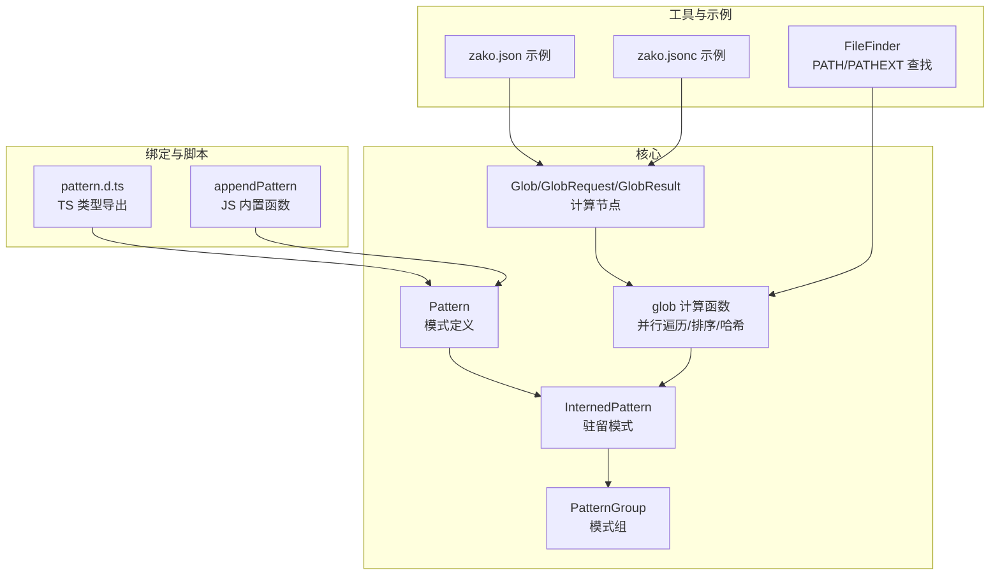
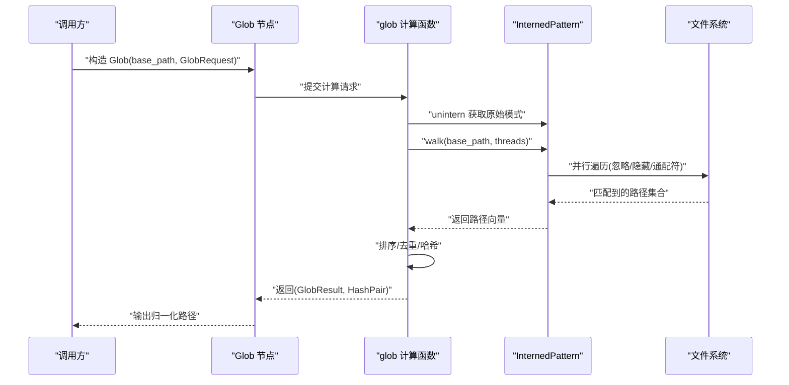
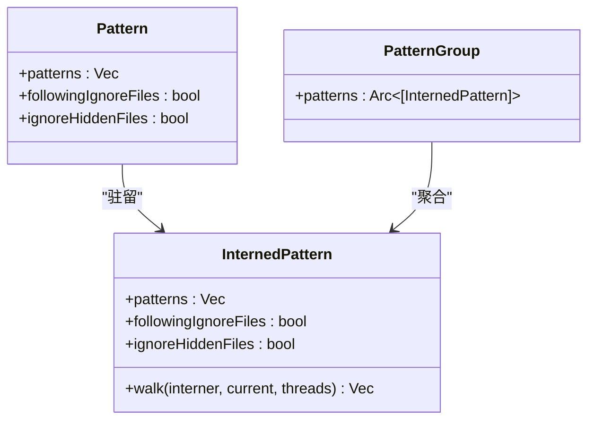
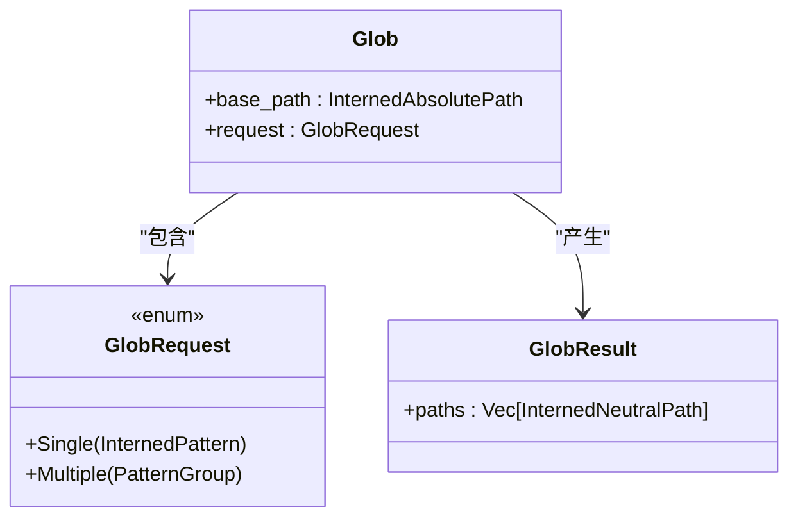
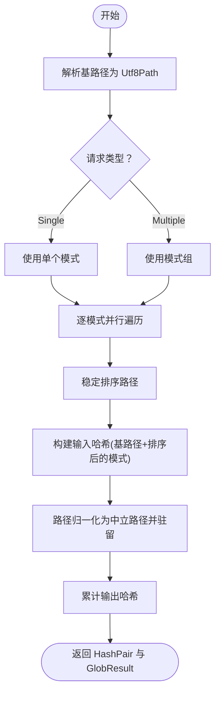
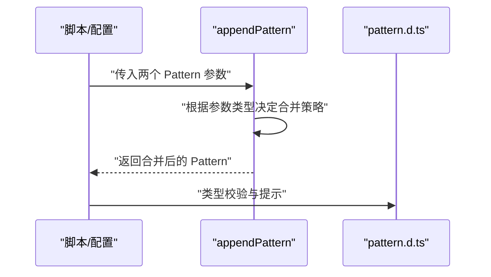
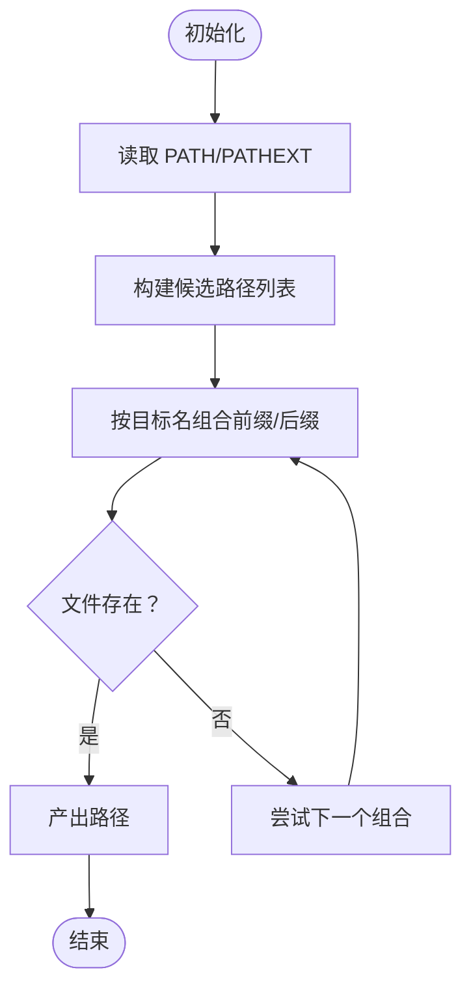
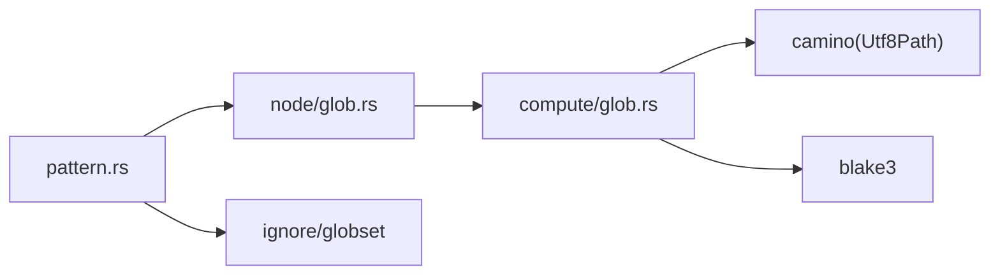

# 模式匹配系统

<cite>
**本文引用的文件**
- [zako_core/src/pattern.rs](file://zako_core/src/pattern.rs)
- [zako_core/bindings/pattern.d.ts](file://zako_core/bindings/pattern.d.ts)
- [zako_core/src/compute/glob.rs](file://zako_core/src/compute/glob.rs)
- [zako_core/src/node/glob.rs](file://zako_core/src/node/glob.rs)
- [zako_core/src/file_finder.rs](file://zako_core/src/file_finder.rs)
- [zako_js/src/builtins/core/index.ts](file://zako_js/src/builtins/core/index.ts)
- [prompt.tx](file://prompt.tx)
- [tests/new_project/zako.json](file://tests/new_project/zako.json)
- [tests/log_version/zako.jsonc](file://tests/log_version/zako.jsonc)
</cite>

## 目录
1. [引言](#引言)
2. [项目结构](#项目结构)
3. [核心组件](#核心组件)
4. [架构总览](#架构总览)
5. [详细组件分析](#详细组件分析)
6. [依赖关系分析](#依赖关系分析)
7. [性能考量](#性能考量)
8. [故障排查指南](#故障排查指南)
9. [结论](#结论)
10. [附录](#附录)

## 引言
本文件系统性阐述 Zako 的模式匹配系统，重点围绕 Pattern 类型的定义与实现、通配符匹配与忽略规则、路径模式处理、并行遍历与哈希缓存、以及在文件查找、目标选择与依赖解析中的应用。文档同时给出复杂模式组合、嵌套与条件模式的处理建议、扩展机制与自定义模式类型的接入方式，并覆盖错误处理与边界情况。

## 项目结构
Zako 的模式匹配能力主要由以下模块协同实现：
- 模式定义与驻留：Pattern 与 InternedPattern，支持忽略文件与隐藏文件控制
- 计算节点：Glob/GlobRequest/GlobResult，封装基于基路径的模式计算请求与结果
- 计算实现：glob 计算函数，负责并行遍历、排序、归一化路径与哈希
- 绑定导出：TypeScript 类型导出，便于前端脚本与配置中使用
- 文件查找工具：FileFinder 提供 PATH/PATHEXT 环境变量驱动的可执行文件/命令查找
- JS 内置函数：appendPattern 支持模式合并与组合
- 配置示例：工作区与配置项展示模式在实际工程中的使用位置

**图表来源**
- [zako_core/src/pattern.rs](file://zako_core/src/pattern.rs#L40-L177)
- [zako_core/src/node/glob.rs](file://zako_core/src/node/glob.rs#L7-L22)
- [zako_core/src/compute/glob.rs](file://zako_core/src/compute/glob.rs#L17-L127)
- [zako_core/bindings/pattern.d.ts](file://zako_core/bindings/pattern.d.ts#L12-L35)
- [zako_js/src/builtins/core/index.ts](file://zako_js/src/builtins/core/index.ts#L137-L175)
- [zako_core/src/file_finder.rs](file://zako_core/src/file_finder.rs#L22-L71)
- [tests/new_project/zako.json](file://tests/new_project/zako.json#L8-L8)
- [tests/log_version/zako.jsonc](file://tests/log_version/zako.jsonc#L14-L31)

**章节来源**
- [zako_core/src/pattern.rs](file://zako_core/src/pattern.rs#L1-L247)
- [zako_core/src/node/glob.rs](file://zako_core/src/node/glob.rs#L1-L23)
- [zako_core/src/compute/glob.rs](file://zako_core/src/compute/glob.rs#L1-L128)
- [zako_core/bindings/pattern.d.ts](file://zako_core/bindings/pattern.d.ts#L1-L36)
- [zako_js/src/builtins/core/index.ts](file://zako_js/src/builtins/core/index.ts#L137-L175)
- [zako_core/src/file_finder.rs](file://zako_core/src/file_finder.rs#L1-L71)
- [tests/new_project/zako.json](file://tests/new_project/zako.json#L1-L18)
- [tests/log_version/zako.jsonc](file://tests/log_version/zako.jsonc#L1-L32)

## 核心组件
- Pattern 与 InternedPattern
  - Pattern 表示一组待匹配的模式串，以及是否遵循标准忽略文件（如 .gitignore/.ignore）与是否忽略隐藏文件（以点开头）
  - InternedPattern 将模式串驻留在全局驻留池中，降低内存占用并加速比较
  - 提供并行遍历 walk 方法，使用 ignore 库与 globset 实现通配符匹配，并支持线程数控制
- PatternGroup
  - 将多个 InternedPattern 组合为一个集合，便于批量计算
- Glob/GlobRequest/GlobResult
  - GlobRequest 支持单个模式或模式组
  - GlobResult 返回归一化的中立路径列表（NeutralPath），便于跨平台一致性
- glob 计算函数
  - 解析基路径与模式，调用 InternedPattern.walk 并行遍历
  - 对结果进行稳定排序，生成输入/输出哈希，用于缓存与增量判断
  - 将绝对路径转换为相对于基路径的中立路径并驻留

**章节来源**
- [zako_core/src/pattern.rs](file://zako_core/src/pattern.rs#L40-L177)
- [zako_core/src/pattern.rs](file://zako_core/src/pattern.rs#L197-L246)
- [zako_core/src/node/glob.rs](file://zako_core/src/node/glob.rs#L7-L22)
- [zako_core/src/compute/glob.rs](file://zako_core/src/compute/glob.rs#L17-L127)

## 架构总览
下图展示了从请求到结果的端到端流程：前端/配置定义 Pattern，经由计算节点 Glob 发起 glob 计算，内部通过 ignore/globset 执行并行遍历，最终产出归一化路径与哈希。

**图表来源**
- [zako_core/src/node/glob.rs](file://zako_core/src/node/glob.rs#L7-L22)
- [zako_core/src/compute/glob.rs](file://zako_core/src/compute/glob.rs#L17-L127)
- [zako_core/src/pattern.rs](file://zako_core/src/pattern.rs#L132-L177)

## 详细组件分析

### Pattern 类型与通配符匹配
- 模式语法来源
  - 使用 ignore 库与 globset crate，因此支持 globset 的通配符语义（如单级通配、多级通配、字符集等）
  - 忽略文件与隐藏文件行为分别受 following_ignore_files 与 ignore_hidden_files 控制
- 驻留与比较
  - InternedPattern 将字符串驻留，减少重复存储；并提供 Blake3 哈希，便于缓存键生成
- 并行遍历
  - walk 方法支持设置线程数，内部使用 ignore::WalkBuilder::build_parallel
  - 遍历过程中对错误进行告警并继续，避免单点失败导致整体中断

**图表来源**
- [zako_core/src/pattern.rs](file://zako_core/src/pattern.rs#L40-L177)
- [zako_core/src/pattern.rs](file://zako_core/src/pattern.rs#L197-L246)

**章节来源**
- [zako_core/src/pattern.rs](file://zako_core/src/pattern.rs#L16-L60)
- [zako_core/src/pattern.rs](file://zako_core/src/pattern.rs#L132-L177)

### Glob 请求与结果
- GlobRequest
  - Single：单个 InternedPattern
  - Multiple：PatternGroup（多个模式）
- Glob
  - base_path：基准绝对路径（已驻留）
  - request：请求类型
- GlobResult
  - paths：归一化中立路径列表（已驻留）

**图表来源**
- [zako_core/src/node/glob.rs](file://zako_core/src/node/glob.rs#L7-L22)

**章节来源**
- [zako_core/src/node/glob.rs](file://zako_core/src/node/glob.rs#L1-L23)

### glob 计算流程
- 输入准备
  - 解析基路径字符串为 Utf8Path
  - 根据请求类型选择单个或多个模式
- 遍历与收集
  - 对每个模式调用 walk 并行遍历，收集匹配路径
  - 对模式与路径进行稳定排序，确保可重复性
- 归一化与哈希
  - 计算输入哈希（包含基路径与已排序的模式）
  - 将绝对路径转换为相对于基路径的中立路径并驻留，累计输出哈希
- 输出
  - 返回 HashPair 与 GlobResult

**图表来源**
- [zako_core/src/compute/glob.rs](file://zako_core/src/compute/glob.rs#L17-L127)

**章节来源**
- [zako_core/src/compute/glob.rs](file://zako_core/src/compute/glob.rs#L17-L127)

### TypeScript 绑定与 JS 内置函数
- TypeScript 类型导出
  - pattern.d.ts 导出 Pattern 接口，字段与行为与 Rust 实现一致
- appendPattern
  - 支持数组与对象两种模式形式的合并
  - 自动处理 include/exclude 字段的拼接，便于在脚本中动态组合模式

**图表来源**
- [zako_js/src/builtins/core/index.ts](file://zako_js/src/builtins/core/index.ts#L137-L175)
- [zako_core/bindings/pattern.d.ts](file://zako_core/bindings/pattern.d.ts#L12-L35)

**章节来源**
- [zako_core/bindings/pattern.d.ts](file://zako_core/bindings/pattern.d.ts#L1-L36)
- [zako_js/src/builtins/core/index.ts](file://zako_js/src/builtins/core/index.ts#L137-L175)

### 文件查找工具（PATH/PATHEXT）
- FileFinder
  - 从 PATH 环境变量读取候选目录
  - 在 Windows 下结合 PATHEXT，考虑大小写敏感场景
  - 支持前缀/后缀组合搜索，返回可执行文件路径迭代器

**图表来源**
- [zako_core/src/file_finder.rs](file://zako_core/src/file_finder.rs#L22-L71)

**章节来源**
- [zako_core/src/file_finder.rs](file://zako_core/src/file_finder.rs#L1-L71)

## 依赖关系分析
- 模块耦合
  - pattern.rs 与 node/glob.rs 低耦合：前者专注模式定义与遍历，后者专注计算节点封装
  - compute/glob.rs 作为桥梁，协调模式与文件系统遍历，并负责结果归一化与哈希
- 外部依赖
  - ignore/globset：提供强大的通配符匹配与忽略规则支持
  - camino：提供跨平台中立路径抽象
  - blake3：用于输入/输出哈希，支撑缓存与增量判断
- 潜在循环依赖
  - 模式系统为纯数据与计算层，未见循环导入迹象

**图表来源**
- [zako_core/src/pattern.rs](file://zako_core/src/pattern.rs#L1-L20)
- [zako_core/src/node/glob.rs](file://zako_core/src/node/glob.rs#L1-L5)
- [zako_core/src/compute/glob.rs](file://zako_core/src/compute/glob.rs#L1-L15)

**章节来源**
- [zako_core/src/pattern.rs](file://zako_core/src/pattern.rs#L1-L20)
- [zako_core/src/node/glob.rs](file://zako_core/src/node/glob.rs#L1-L5)
- [zako_core/src/compute/glob.rs](file://zako_core/src/compute/glob.rs#L1-L15)

## 性能考量
- 并行遍历
  - walk 使用 build_parallel，线程数可通过参数控制；在大目录树上显著提升吞吐
- 排序与稳定性
  - 对模式与路径进行稳定排序，确保相同输入产生一致输出，利于缓存命中
- 哈希与缓存
  - 输入/输出哈希用于缓存键生成；计算函数预留旧数据复用逻辑（TODO 注释）
- 内存与驻留
  - InternedPattern 将字符串驻留，减少重复存储；GlobResult 中的中立路径同样驻留，降低后续处理成本
- I/O 与错误容忍
  - 遍历过程对单个条目错误仅告警并继续，避免因个别权限/符号链接问题阻塞整体

**章节来源**
- [zako_core/src/pattern.rs](file://zako_core/src/pattern.rs#L132-L177)
- [zako_core/src/compute/glob.rs](file://zako_core/src/compute/glob.rs#L63-L103)

## 故障排查指南
- 常见错误类型
  - 模式解析错误：来源于 ignore/globset 的匹配异常
  - 遍历错误：文件系统访问权限、符号链接、路径不可达等
  - 驻留错误：Interner 相关问题
  - 路径归一化错误：无法计算相对路径或转换为 Utf8Path
- 错误处理策略
  - 遍历阶段：记录警告并继续，保证整体可用性
  - 解析阶段：将底层错误包装为可读信息，包含基路径与模式详情
  - 输出阶段：对路径转换失败提供详细上下文（原路径、基路径、差值路径）
- 边界情况
  - 跨工作区越界：建议禁止越界 Glob，必要时通过依赖挂载外部目录
  - Windows 后缀：PATHEXT 大小写敏感场景需考虑大小写变体
  - 隐藏文件：根据 ignore_hidden_files 控制是否忽略以点开头的文件/目录

**章节来源**
- [zako_core/src/pattern.rs](file://zako_core/src/pattern.rs#L90-L98)
- [zako_core/src/compute/glob.rs](file://zako_core/src/compute/glob.rs#L50-L103)
- [prompt.tx](file://prompt.tx#L1416-L1441)
- [zako_core/src/file_finder.rs](file://zako_core/src/file_finder.rs#L36-L53)

## 结论
Zako 的模式匹配系统以 ignore/globset 为核心，结合并行遍历、驻留与哈希，提供了高性能、可缓存且跨平台一致的路径匹配能力。通过 Pattern/InternedPattern 与 Glob/GlobResult 的清晰分层，系统既满足工程中的文件查找需求，也为目标选择与依赖解析提供了可靠基础。未来可在旧数据复用、更细粒度的错误分类与可视化诊断方面进一步增强。

## 附录

### 使用示例与最佳实践
- 工作区模式
  - 在项目配置中使用通配符定义工作区范围，例如包含 tests/** 与 src/**
- 条件模式
  - 利用 appendPattern 在脚本中动态合并 include/exclude，形成条件化模式
- 跨平台路径
  - 通过 GlobResult 的中立路径驻留，避免平台差异带来的路径不一致
- 性能优化
  - 合理设置线程数；优先使用 PatternGroup 批量处理；保持模式数量与层级适中

**章节来源**
- [tests/new_project/zako.json](file://tests/new_project/zako.json#L8-L8)
- [zako_js/src/builtins/core/index.ts](file://zako_js/src/builtins/core/index.ts#L137-L175)
- [zako_core/src/compute/glob.rs](file://zako_core/src/compute/glob.rs#L63-L103)

### 复杂模式组合、嵌套与条件模式
- 组合策略
  - 使用 appendPattern 将多个模式数组或对象合并，自动处理 include/exclude 的拼接
- 嵌套模式
  - 通过 PatternGroup 将多个 InternedPattern 聚合，统一参与遍历与哈希
- 条件模式
  - 在脚本侧依据环境变量或配置开关动态拼接 include/exclude，形成条件化匹配

**章节来源**
- [zako_js/src/builtins/core/index.ts](file://zako_js/src/builtins/core/index.ts#L137-L175)
- [zako_core/src/pattern.rs](file://zako_core/src/pattern.rs#L197-L246)

### 扩展机制与自定义模式类型
- 扩展思路
  - 在现有 Pattern 基础上增加新的布尔标志位或字段，映射到 ignore 的额外选项
  - 新增计算节点与计算函数，复用 Glob/GlobResult 的数据结构
- 自定义模式类型
  - 若需要非 globset 语义的匹配（如正则），可在计算层引入正则引擎并与现有遍历流程解耦
  - 保持输出为中立路径驻留，确保与其他模块兼容

[本节为概念性说明，无需代码来源]