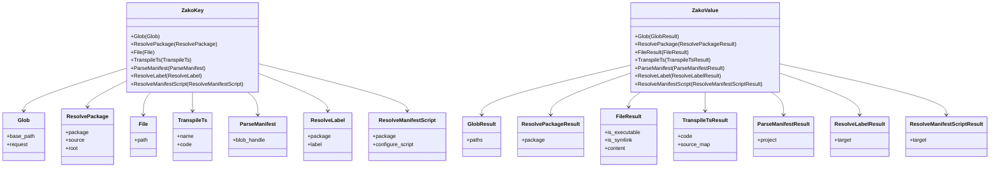

# 节点数据结构

<cite>
**本文引用的文件**
- [zako_core/src/node/mod.rs](file://zako_core/src/node/mod.rs)
- [zako_core/src/node/node_key.rs](file://zako_core/src/node/node_key.rs)
- [zako_core/src/node/node_value.rs](file://zako_core/src/node/node_value.rs)
- [zako_core/src/compute/mod.rs](file://zako_core/src/compute/mod.rs)
- [zako_core/src/compute/glob.rs](file://zako_core/src/compute/glob.rs)
- [zako_core/src/compute/resolve_package.rs](file://zako_core/src/compute/resolve_package.rs)
- [zako_core/src/node/glob.rs](file://zako_core/src/node/glob.rs)
- [zako_core/src/node/resolve_package.rs](file://zako_core/src/node/resolve_package.rs)
- [zako_core/src/node/file.rs](file://zako_core/src/node/file.rs)
- [zako_core/src/node/transpile_ts.rs](file://zako_core/src/node/transpile_ts.rs)
- [zako_core/src/node/parse_manifest.rs](file://zako_core/src/node/parse_manifest.rs)
- [zako_core/src/node/resolve_label.rs](file://zako_core/src/node/resolve_label.rs)
- [zako_core/src/node/resolve_manifest_script.rs](file://zako_core/src/node/resolve_manifest_script.rs)
- [hone/src/node.rs](file://hone/src/node.rs)
- [zako_core/src/engine.rs](file://zako_core/src/engine.rs)
</cite>

## 目录
1. [引言](#引言)
2. [项目结构](#项目结构)
3. [核心组件](#核心组件)
4. [架构总览](#架构总览)
5. [详细组件分析](#详细组件分析)
6. [依赖关系分析](#依赖关系分析)
7. [性能考量](#性能考量)
8. [故障排查指南](#故障排查指南)
9. [结论](#结论)
10. [附录](#附录)

## 引言
本文件系统性阐述 Zako 的“节点”数据结构与执行模型，重点围绕 ZakoKey 枚举类型及其变体（Glob、ResolvePackage、File、TranspileTs、ParseManifest、ResolveLabel、ResolveManifestScript）的设计原则、序列化与哈希机制、在有向无环图（DAG）任务图中的角色与生命周期、以及创建、操作与优化的最佳实践。同时给出内存布局与性能相关的分析建议，并总结冲突解决与依赖管理的策略。

## 项目结构
Zako 将“节点键（NodeKey）”与“节点值（NodeValue）”抽象于独立模块中，分别定义了键的枚举类型与值的枚举类型；计算函数位于 compute 子模块，按节点类型分文件组织，便于扩展与维护。

图表来源
- [zako_core/src/node/mod.rs](file://zako_core/src/node/mod.rs#L1-L10)
- [zako_core/src/node/node_key.rs](file://zako_core/src/node/node_key.rs#L11-L39)
- [zako_core/src/node/node_value.rs](file://zako_core/src/node/node_value.rs#L10-L22)
- [zako_core/src/compute/mod.rs](file://zako_core/src/compute/mod.rs#L1-L26)
- [zako_core/src/compute/glob.rs](file://zako_core/src/compute/glob.rs#L17-L128)
- [zako_core/src/compute/resolve_package.rs](file://zako_core/src/compute/resolve_package.rs#L26-L140)
- [zako_core/src/node/glob.rs](file://zako_core/src/node/glob.rs#L7-L23)
- [zako_core/src/node/resolve_package.rs](file://zako_core/src/node/resolve_package.rs#L6-L17)
- [zako_core/src/node/file.rs](file://zako_core/src/node/file.rs#L6-L28)
- [zako_core/src/node/transpile_ts.rs](file://zako_core/src/node/transpile_ts.rs#L5-L31)
- [zako_core/src/node/parse_manifest.rs](file://zako_core/src/node/parse_manifest.rs#L3-L12)
- [zako_core/src/node/resolve_label.rs](file://zako_core/src/node/resolve_label.rs#L5-L23)
- [zako_core/src/node/resolve_manifest_script.rs](file://zako_core/src/node/resolve_manifest_script.rs#L7-L17)

章节来源
- [zako_core/src/node/mod.rs](file://zako_core/src/node/mod.rs#L1-L10)
- [zako_core/src/node/node_key.rs](file://zako_core/src/node/node_key.rs#L11-L39)
- [zako_core/src/node/node_value.rs](file://zako_core/src/node/node_value.rs#L10-L22)
- [zako_core/src/compute/mod.rs](file://zako_core/src/compute/mod.rs#L1-L26)

## 核心组件
- ZakoKey：节点键的统一枚举，承载不同计算任务的输入参数与上下文标识，用于 DAG 去重与缓存命中。
- ZakoValue：节点值的统一枚举，承载各任务的输出结果，供后续节点消费或持久化。
- 计算函数：每个节点类型对应一个异步计算函数，负责读取输入、执行业务逻辑、生成输出与哈希对。

关键特性
- 序列化与归档：通过 derive 宏支持 rkyv 的序列化/反序列化与归档，满足跨进程/持久化场景。
- 哈希一致性：节点输入/输出均实现 Blake3 哈希，确保缓存键稳定且可验证。
- 接口契约：实现 NodeKey/NodeValue trait，保证与上层调度器的一致交互。

章节来源
- [zako_core/src/node/node_key.rs](file://zako_core/src/node/node_key.rs#L14-L39)
- [zako_core/src/node/node_value.rs](file://zako_core/src/node/node_value.rs#L10-L22)
- [hone/src/node.rs](file://hone/src/node.rs#L38-L61)

## 架构总览
下图展示 ZakoKey 到具体节点类型再到计算函数的整体映射关系，以及计算函数如何产出 HashPair 与结果。

图表来源
- [zako_core/src/node/node_key.rs](file://zako_core/src/node/node_key.rs#L26-L36)
- [zako_core/src/node/node_value.rs](file://zako_core/src/node/node_value.rs#L11-L19)
- [zako_core/src/node/glob.rs](file://zako_core/src/node/glob.rs#L14-L22)
- [zako_core/src/node/resolve_package.rs](file://zako_core/src/node/resolve_package.rs#L7-L16)
- [zako_core/src/node/file.rs](file://zako_core/src/node/file.rs#L7-L19)
- [zako_core/src/node/transpile_ts.rs](file://zako_core/src/node/transpile_ts.rs#L6-L23)
- [zako_core/src/node/parse_manifest.rs](file://zako_core/src/node/parse_manifest.rs#L4-L11)
- [zako_core/src/node/resolve_label.rs](file://zako_core/src/node/resolve_label.rs#L6-L22)
- [zako_core/src/node/resolve_manifest_script.rs](file://zako_core/src/node/resolve_manifest_script.rs#L8-L16)

## 详细组件分析

### ZakoKey 设计与变体详解
- 设计原则
  - 统一键空间：所有节点以 ZakoKey 形式参与 DAG，便于去重、缓存与依赖追踪。
  - 可序列化与归档：支持跨进程/持久化的稳定表示，利于增量构建与远程缓存。
  - 明确职责边界：每个变体聚焦单一输入域，避免键冗余与歧义。

- 变体说明
  - Glob：基于基础路径与模式组进行文件匹配，输出相对中立路径列表。
  - ResolvePackage：解析包元信息，必要时读取清单并构造配置后的包对象。
  - File：读取文件内容并返回可执行标记、符号链接状态与 CAS 内容句柄。
  - TranspileTs：对给定代码进行 TypeScript 转译，输出代码与可选 SourceMap。
  - ParseManifest：解析来自 BlobHandle 的清单内容，输出项目包对象。
  - ResolveLabel：根据包与标签解析到目标实体。
  - ResolveManifestScript：解析清单脚本入口，产出目标包。

- 序列化与哈希
  - 键类型实现 Clone、Eq、Hash、Debug 等 trait，并通过 derive 宏支持 rkyv 归档与序列化。
  - 各节点输入类型均实现 Blake3 哈希，确保输入/输出哈希稳定。

- 比较与去重
  - 通过 Eq 与 Hash 实现键相等性判断，结合全局哈希表实现 DAG 去重。

章节来源
- [zako_core/src/node/node_key.rs](file://zako_core/src/node/node_key.rs#L14-L39)
- [zako_core/src/node/glob.rs](file://zako_core/src/node/glob.rs#L7-L17)
- [zako_core/src/node/resolve_package.rs](file://zako_core/src/node/resolve_package.rs#L6-L11)
- [zako_core/src/node/file.rs](file://zako_core/src/node/file.rs#L6-L19)
- [zako_core/src/node/transpile_ts.rs](file://zako_core/src/node/transpile_ts.rs#L5-L17)
- [zako_core/src/node/parse_manifest.rs](file://zako_core/src/node/parse_manifest.rs#L3-L6)
- [zako_core/src/node/resolve_label.rs](file://zako_core/src/node/resolve_label.rs#L5-L17)
- [zako_core/src/node/resolve_manifest_script.rs](file://zako_core/src/node/resolve_manifest_script.rs#L7-L11)

### Glob 节点：模式匹配与结果归一化
- 输入
  - base_path：基准绝对路径（已驻留）
  - request：单个模式或模式组
- 处理流程
  - 解析模式、遍历目录、收集匹配路径
  - 对结果与输入进行排序，保证确定性
  - 计算输入/输出哈希对
- 输出
  - GlobResult：相对中立路径列表（已驻留）

图表来源
- [zako_core/src/compute/glob.rs](file://zako_core/src/compute/glob.rs#L18-L128)
- [zako_core/src/node/glob.rs](file://zako_core/src/node/glob.rs#L14-L22)

章节来源
- [zako_core/src/compute/glob.rs](file://zako_core/src/compute/glob.rs#L18-L128)
- [zako_core/src/node/glob.rs](file://zako_core/src/node/glob.rs#L14-L22)

### ResolvePackage 节点：包解析与清单处理
- 输入
  - package：包 ID（已驻留）
  - source：包来源（含 Blake3 哈希）
  - root：可选根路径
- 处理流程
  - 解析包 ID 与根路径
  - 读取清单文本并请求 ParseManifest 计算
  - 构建新上下文，解析配置，最终得到配置后的包
- 输出
  - ResolvePackageResult：配置后的包对象

图表来源
- [zako_core/src/compute/resolve_package.rs](file://zako_core/src/compute/resolve_package.rs#L27-L140)
- [zako_core/src/node/resolve_package.rs](file://zako_core/src/node/resolve_package.rs#L7-L16)
- [zako_core/src/node/parse_manifest.rs](file://zako_core/src/node/parse_manifest.rs#L4-L11)

章节来源
- [zako_core/src/compute/resolve_package.rs](file://zako_core/src/compute/resolve_package.rs#L27-L140)
- [zako_core/src/node/resolve_package.rs](file://zako_core/src/node/resolve_package.rs#L6-L17)
- [zako_core/src/node/parse_manifest.rs](file://zako_core/src/node/parse_manifest.rs#L3-L12)

### File/TranspileTs/ParseManifest/ResolveLabel/ResolveManifestScript 节点
- File
  - 输入：绝对路径（已驻留）
  - 输出：可执行标记、符号链接状态、CAS 内容句柄
  - 哈希：覆盖上述字段
- TranspileTs
  - 输入：名称与代码（BlobHandle）
  - 输出：转译后的代码与可选 SourceMap
  - 哈希：覆盖名称与代码
- ParseManifest
  - 输入：BlobHandle
  - 输出：项目包对象
- ResolveLabel
  - 输入：配置包与标签
  - 输出：目标实体
  - 哈希：自定义实现，覆盖包来源、包 ID 与标签
- ResolveManifestScript
  - 输入：包与可选配置脚本名
  - 输出：目标包

章节来源
- [zako_core/src/node/file.rs](file://zako_core/src/node/file.rs#L6-L28)
- [zako_core/src/node/transpile_ts.rs](file://zako_core/src/node/transpile_ts.rs#L5-L31)
- [zako_core/src/node/parse_manifest.rs](file://zako_core/src/node/parse_manifest.rs#L3-L12)
- [zako_core/src/node/resolve_label.rs](file://zako_core/src/node/resolve_label.rs#L5-L23)
- [zako_core/src/node/resolve_manifest_script.rs](file://zako_core/src/node/resolve_manifest_script.rs#L7-L17)

### 节点在 DAG 中的角色与生命周期
- 角色
  - 作为图顶点承载输入与输出；作为边端点表达依赖关系。
- 生命周期
  - 创建：由调度器根据任务计划生成 ZakoKey 并入队。
  - 执行：计算函数读取上下文与依赖，产出 HashPair 与 ZakoValue。
  - 缓存：以输入哈希为键存储结果，命中则跳过执行。
  - 传播：下游节点消费当前节点的 ZakoValue 并继续推进。

- 依赖管理
  - 通过 ZakoKey 的 Eq/Hash 保证同一输入仅执行一次。
  - 通过 ZakoValue 的类型安全传递，避免误用。

章节来源
- [hone/src/node.rs](file://hone/src/node.rs#L38-L61)
- [zako_core/src/node/node_key.rs](file://zako_core/src/node/node_key.rs#L14-L39)
- [zako_core/src/node/node_value.rs](file://zako_core/src/node/node_value.rs#L10-L22)

### 序列化机制、哈希计算与比较逻辑
- 序列化
  - 使用 rkyv 进行高性能归档与序列化，支持跨进程/持久化。
- 哈希
  - 输入/输出均实现 Blake3 哈希，输入哈希用于缓存键，输出哈希用于变更检测。
- 比较
  - 通过 Eq/Hash 实现键相等性与哈希一致性，确保 DAG 去重与缓存命中。

章节来源
- [zako_core/src/node/node_key.rs](file://zako_core/src/node/node_key.rs#L14-L39)
- [zako_core/src/node/node_value.rs](file://zako_core/src/node/node_value.rs#L10-L22)
- [zako_core/src/node/file.rs](file://zako_core/src/node/file.rs#L21-L27)
- [zako_core/src/node/transpile_ts.rs](file://zako_core/src/node/transpile_ts.rs#L12-L30)

### 内存布局分析与性能考虑
- 驻留与归一化
  - 路径与字符串采用驻留（Interned）策略，减少重复存储与比较开销。
- 确定性排序
  - Glob 结果与输入模式排序，确保哈希稳定与可复现。
- 哈希分层
  - 输入哈希聚合基础路径与模式，输出哈希聚合结果集，降低碰撞概率。
- I/O 与并发
  - 计算函数使用异步 I/O 与资源池占用，避免阻塞主线程。

章节来源
- [zako_core/src/compute/glob.rs](file://zako_core/src/compute/glob.rs#L63-L72)
- [zako_core/src/node/glob.rs](file://zako_core/src/node/glob.rs#L14-L22)

### 实际代码示例（路径指引）
- 创建与使用 ZakoKey
  - Glob：参考 [zako_core/src/node/glob.rs](file://zako_core/src/node/glob.rs#L14-L17)
  - ResolvePackage：参考 [zako_core/src/node/resolve_package.rs](file://zako_core/src/node/resolve_package.rs#L7-L11)
  - File：参考 [zako_core/src/node/file.rs](file://zako_core/src/node/file.rs#L7-L9)
  - TranspileTs：参考 [zako_core/src/node/transpile_ts.rs](file://zako_core/src/node/transpile_ts.rs#L6-L11)
  - ParseManifest：参考 [zako_core/src/node/parse_manifest.rs](file://zako_core/src/node/parse_manifest.rs#L4-L6)
  - ResolveLabel：参考 [zako_core/src/node/resolve_label.rs](file://zako_core/src/node/resolve_label.rs#L6-L9)
  - ResolveManifestScript：参考 [zako_core/src/node/resolve_manifest_script.rs](file://zako_core/src/node/resolve_manifest_script.rs#L8-L11)
- 计算函数调用
  - Glob 计算：参考 [zako_core/src/compute/glob.rs](file://zako_core/src/compute/glob.rs#L18-L128)
  - ResolvePackage 计算：参考 [zako_core/src/compute/resolve_package.rs](file://zako_core/src/compute/resolve_package.rs#L27-L140)
- 引擎与脚本执行（与 JS/V8 相关）
  - 引擎初始化与模块执行：参考 [zako_core/src/engine.rs](file://zako_core/src/engine.rs#L48-L109)

## 依赖关系分析
- 模块耦合
  - node/* 提供节点输入/输出数据结构，compute/* 提供计算实现，二者通过 ZakoKey/ZakoValue 解耦。
- 外部依赖
  - rkyv：高性能序列化/归档
  - blake3：快速确定性哈希
  - camino：UTF-8 路径处理
  - flume：异步通道（用于脚本导入请求）
- 接口契约
  - NodeKey/NodeValue trait 约束键值类型，确保与调度器兼容。

图表来源
- [hone/src/node.rs](file://hone/src/node.rs#L38-L61)
- [zako_core/src/node/node_key.rs](file://zako_core/src/node/node_key.rs#L1-L10)
- [zako_core/src/node/node_value.rs](file://zako_core/src/node/node_value.rs#L1-L8)
- [zako_core/src/compute/mod.rs](file://zako_core/src/compute/mod.rs#L1-L26)
- [zako_core/src/compute/glob.rs](file://zako_core/src/compute/glob.rs#L1-L15)
- [zako_core/src/compute/resolve_package.rs](file://zako_core/src/compute/resolve_package.rs#L1-L25)
- [zako_core/src/node/glob.rs](file://zako_core/src/node/glob.rs#L1-L8)
- [zako_core/src/node/resolve_package.rs](file://zako_core/src/node/resolve_package.rs#L1-L5)

章节来源
- [hone/src/node.rs](file://hone/src/node.rs#L38-L61)
- [zako_core/src/compute/mod.rs](file://zako_core/src/compute/mod.rs#L1-L26)

## 性能考量
- 哈希与缓存
  - 使用 Blake3 快速计算输入/输出哈希，显著降低重复计算成本。
- 驻留与排序
  - 路径与字符串驻留减少内存占用；排序确保哈希确定性。
- 异步与并发
  - 计算函数采用异步 I/O 与资源池，提升吞吐量。
- 未来优化方向
  - Glob 的旧数据复用（见源码 TODO 注释），减少不必要的文件扫描。
  - 清单读取直接以 BlobHandle 形式处理，避免整文件内存拷贝（见源码 TODO 注释）。

章节来源
- [zako_core/src/compute/glob.rs](file://zako_core/src/compute/glob.rs#L107-L116)
- [zako_core/src/compute/resolve_package.rs](file://zako_core/src/compute/resolve_package.rs#L62-L64)

## 故障排查指南
- 常见错误来源
  - 路径差异导致的相对路径计算失败（Glob）
  - UTF-8 路径转换失败
  - Intercer 错误（驻留解析失败）
  - V8/JS 执行异常（与引擎相关）
- 定位方法
  - 检查输入哈希是否变化，确认缓存命中情况
  - 核对路径驻留与归一化过程
  - 在引擎执行模块时捕获异常并记录上下文
- 相关实现参考
  - Glob 计算中的路径差分与错误包装
  - 引擎执行模块的异常捕获与转换

章节来源
- [zako_core/src/compute/glob.rs](file://zako_core/src/compute/glob.rs#L79-L96)
- [zako_core/src/engine.rs](file://zako_core/src/engine.rs#L200-L228)

## 结论
Zako 的节点数据结构通过 ZakoKey/ZakoValue 架构实现了清晰的职责分离与强一致的哈希语义，配合 rkyv 的高效序列化与 Blake3 的快速哈希，为 DAG 任务图提供了高可扩展性与可复现性的执行基础。通过对路径驻留、结果排序与异步 I/O 的设计，系统在性能与正确性之间取得良好平衡。未来可在旧数据复用与流式读取方面进一步优化。

## 附录
- 术语
  - 驻留（Interned）：将常用字符串/路径放入共享池，减少重复存储与比较成本。
  - 哈希对（HashPair）：包含输入哈希与输出哈希，用于缓存键与变更检测。
  - CAS：内容寻址存储，通过摘要定位内容，避免重复传输与存储。
- 最佳实践
  - 保持节点输入最小化与稳定，避免无关字段影响哈希。
  - 对易变外部状态（如时间戳）进行显式排除或转换。
  - 在多线程/异步环境中严格遵循不可变输入与纯函数式计算。