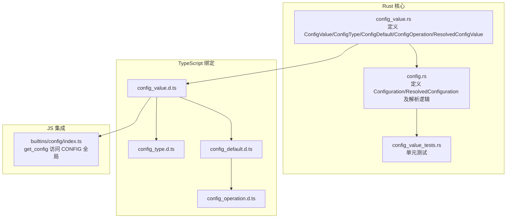
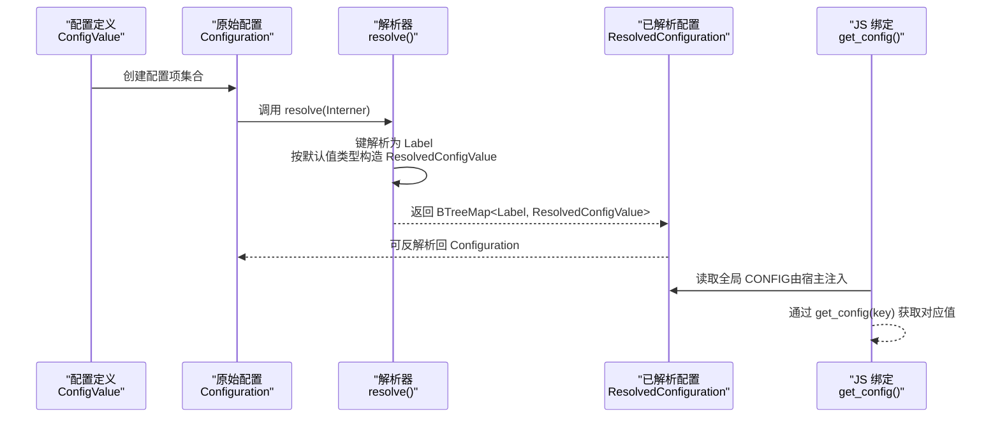
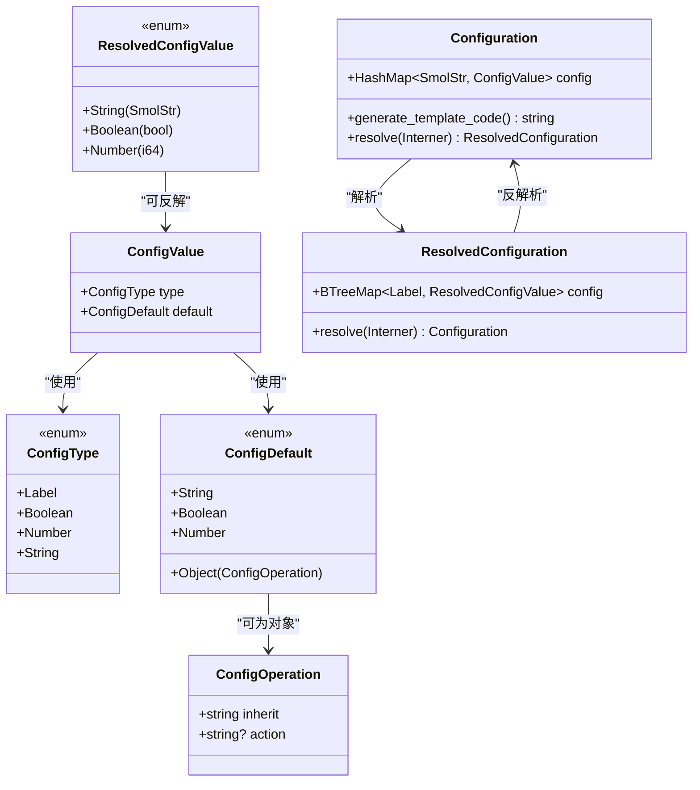
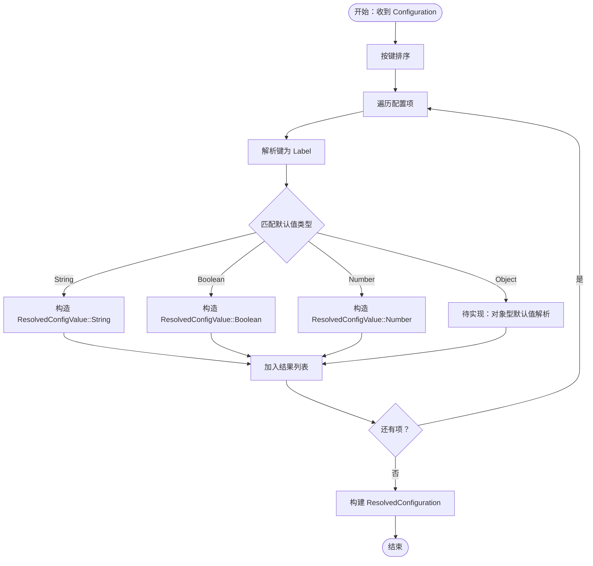
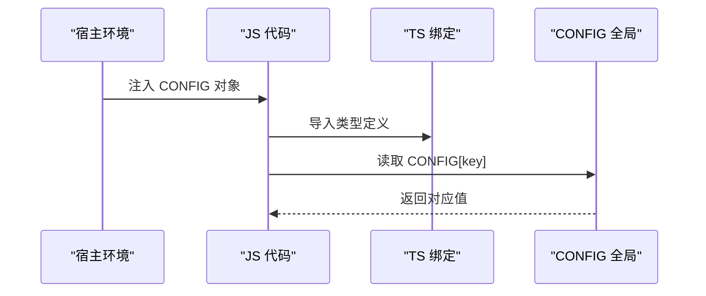
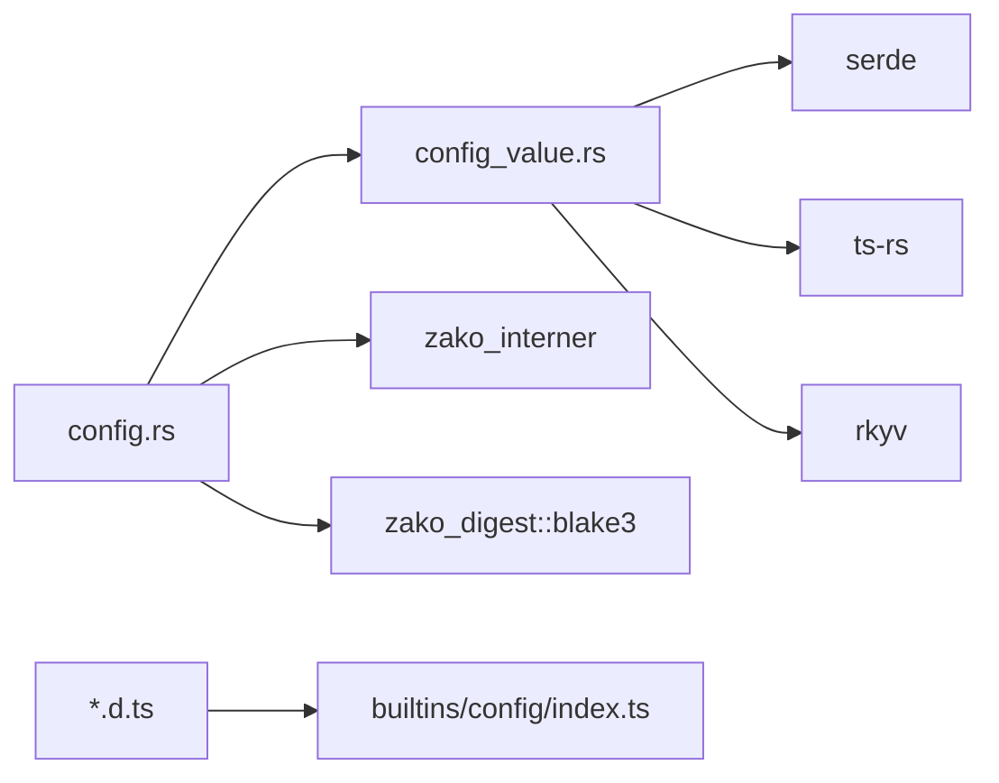

# 配置类型系统

<cite>
**本文引用的文件**
- [zako_core/src/config_value.rs](file://zako_core/src/config_value.rs)
- [zako_core/src/config.rs](file://zako_core/src/config.rs)
- [zako_core/bindings/config_value.d.ts](file://zako_core/bindings/config_value.d.ts)
- [zako_core/bindings/config_type.d.ts](file://zako_core/bindings/config_type.d.ts)
- [zako_core/bindings/config_default.d.ts](file://zako_core/bindings/config_default.d.ts)
- [zako_core/bindings/config_operation.d.ts](file://zako_core/bindings/config_operation.d.ts)
- [zako_core/src/tests/config_value_tests.rs](file://zako_core/src/tests/config_value_tests.rs)
- [zako_js/src/builtins/config/index.ts](file://zako_js/src/builtins/config/index.ts)
</cite>

## 目录
1. [简介](#简介)
2. [项目结构](#项目结构)
3. [核心组件](#核心组件)
4. [架构总览](#架构总览)
5. [详细组件分析](#详细组件分析)
6. [依赖关系分析](#依赖关系分析)
7. [性能考虑](#性能考虑)
8. [故障排查指南](#故障排查指南)
9. [结论](#结论)
10. [附录](#附录)

## 简介
本文件为 Zako 的配置类型系统提供全面参考文档，聚焦于以下核心类型与流程：
- ConfigValue：配置项的静态定义，包含类型与默认值
- ConfigType：基础类型枚举（Label、Boolean、Number、String）
- ConfigDefault：默认值的联合类型（字符串、布尔、整数、或对象型操作）
- ConfigOperation：对象型默认值，支持继承与动作
- ResolvedConfigValue：运行时已解析的配置值（字符串、布尔、整数）
- Configuration 与 ResolvedConfiguration：原始配置与解析后的不可变配置

文档将解释类型系统设计、默认值与类型转换规则、解析与序列化实现、以及与 JS 绑定的交互方式，并给出性能优化与调试建议。

## 项目结构
配置类型系统主要位于 Rust 模块 zako_core 中，同时通过 TypeScript 绑定暴露给前端/JS 使用。关键文件如下：
- 类型定义与实现：zako_core/src/config_value.rs、zako_core/src/config.rs
- TypeScript 绑定：zako_core/bindings/*.d.ts
- JS 内置配置访问：zako_js/src/builtins/config/index.ts
- 单元测试：zako_core/src/tests/config_value_tests.rs

图表来源
- [zako_core/src/config_value.rs](file://zako_core/src/config_value.rs#L1-L166)
- [zako_core/src/config.rs](file://zako_core/src/config.rs#L1-L119)
- [zako_core/bindings/config_value.d.ts](file://zako_core/bindings/config_value.d.ts#L1-L6)
- [zako_core/bindings/config_type.d.ts](file://zako_core/bindings/config_type.d.ts#L1-L4)
- [zako_core/bindings/config_default.d.ts](file://zako_core/bindings/config_default.d.ts#L1-L5)
- [zako_core/bindings/config_operation.d.ts](file://zako_core/bindings/config_operation.d.ts#L1-L7)
- [zako_core/src/tests/config_value_tests.rs](file://zako_core/src/tests/config_value_tests.rs#L1-L33)
- [zako_js/src/builtins/config/index.ts](file://zako_js/src/builtins/config/index.ts#L1-L7)

章节来源
- [zako_core/src/config_value.rs](file://zako_core/src/config_value.rs#L1-L166)
- [zako_core/src/config.rs](file://zako_core/src/config.rs#L1-L119)
- [zako_core/bindings/config_value.d.ts](file://zako_core/bindings/config_value.d.ts#L1-L6)
- [zako_core/bindings/config_type.d.ts](file://zako_core/bindings/config_type.d.ts#L1-L4)
- [zako_core/bindings/config_default.d.ts](file://zako_core/bindings/config_default.d.ts#L1-L5)
- [zako_core/bindings/config_operation.d.ts](file://zako_core/bindings/config_operation.d.ts#L1-L7)
- [zako_core/src/tests/config_value_tests.rs](file://zako_core/src/tests/config_value_tests.rs#L1-L33)
- [zako_js/src/builtins/config/index.ts](file://zako_js/src/builtins/config/index.ts#L1-L7)

## 核心组件
本节对配置类型系统的关键类型进行深入说明，涵盖字段、用途、序列化与哈希行为。

- ConfigValue
  - 字段：type（ConfigType）、default（ConfigDefault）
  - 用途：描述一个配置项的类型与默认值
  - 序列化：支持 serde、ts-rs 导出到 TypeScript；支持 rkyv 归档
  - 哈希：实现 Blake3 哈希，参与构建图一致性校验

- ConfigType
  - 枚举：Label、Boolean、Number、String
  - 用途：限定配置项的基础类型
  - 序列化：ts-rs 输出为小写字符串字面量联合类型

- ConfigDefault
  - 联合类型：String、Boolean、Number、Object（ConfigOperation）
  - 用途：表示默认值的多种形态
  - 序列化：ts-rs 导出为 string | boolean | bigint | ConfigOperation

- ConfigOperation
  - 字段：inherit（字符串模板，形如 "${string}:${string}"）、action（可选字符串）
  - 用途：对象型默认值，用于声明式继承与动作
  - 序列化：ts-rs 导出为带可选字段的对象类型

- ResolvedConfigValue
  - 枚举：String（SmolStr）、Boolean、Number（i64）
  - 用途：运行时已解析的配置值，便于构建图存储
  - 行为：提供 resolve 方法，将自身映射回 ConfigValue（仅基础类型）

- Configuration
  - 结构：HashMap<SmolStr, ConfigValue>
  - 用途：原始不可变配置，支持生成模板代码与解析为已解析配置
  - 解析：resolve 将键解析为 Label，按默认值类型构造 ResolvedConfigValue 列表

- ResolvedConfiguration
  - 结构：BTreeMap<Label, ResolvedConfigValue>
  - 用途：在构建图中存储的“已解析”配置，键为标签，值为运行时常量
  - 反解析：resolve 将 Label 还原为字符串键，重建 Configuration

章节来源
- [zako_core/src/config_value.rs](file://zako_core/src/config_value.rs#L8-L166)
- [zako_core/src/config.rs](file://zako_core/src/config.rs#L14-L119)
- [zako_core/bindings/config_value.d.ts](file://zako_core/bindings/config_value.d.ts#L1-L6)
- [zako_core/bindings/config_type.d.ts](file://zako_core/bindings/config_type.d.ts#L1-L4)
- [zako_core/bindings/config_default.d.ts](file://zako_core/bindings/config_default.d.ts#L1-L5)
- [zako_core/bindings/config_operation.d.ts](file://zako_core/bindings/config_operation.d.ts#L1-L7)

## 架构总览
下图展示配置从定义到解析、再到构建图存储的整体流程，以及与 JS 绑定的交互。

图表来源
- [zako_core/src/config.rs](file://zako_core/src/config.rs#L41-L71)
- [zako_core/src/config_value.rs](file://zako_core/src/config_value.rs#L148-L165)
- [zako_js/src/builtins/config/index.ts](file://zako_js/src/builtins/config/index.ts#L2-L6)

## 详细组件分析

### 类型系统与数据模型

图表来源
- [zako_core/src/config_value.rs](file://zako_core/src/config_value.rs#L8-L166)
- [zako_core/src/config.rs](file://zako_core/src/config.rs#L14-L119)

章节来源
- [zako_core/src/config_value.rs](file://zako_core/src/config_value.rs#L8-L166)
- [zako_core/src/config.rs](file://zako_core/src/config.rs#L14-L119)

### 解析与序列化流程
- 解析流程
  - Configuration.resolve：对键进行标签解析，按 ConfigDefault 分派构造 ResolvedConfigValue；当前未实现对象型默认值的解析分支
  - ResolvedConfiguration.resolve：将 Label 键还原为字符串键，重建 Configuration
- 序列化与导出
  - Rust 层：使用 serde、ts-rs、rkyv 实现多后端序列化
  - TypeScript 层：通过 d.ts 文件导出类型，供前端消费
- 哈希与一致性
  - 所有核心类型均实现 Blake3 哈希，确保构建图缓存与去重的稳定性

图表来源
- [zako_core/src/config.rs](file://zako_core/src/config.rs#L41-L71)

章节来源
- [zako_core/src/config.rs](file://zako_core/src/config.rs#L41-L71)

### JS 集成与访问
- JS 侧通过内置函数 get_config 从全局 CONFIG 中读取配置值
- TypeScript 绑定导出 ConfigValue/ConfigType/ConfigDefault/ConfigOperation 的类型定义，保证前后端一致

图表来源
- [zako_js/src/builtins/config/index.ts](file://zako_js/src/builtins/config/index.ts#L2-L6)
- [zako_core/bindings/config_value.d.ts](file://zako_core/bindings/config_value.d.ts#L1-L6)

章节来源
- [zako_js/src/builtins/config/index.ts](file://zako_js/src/builtins/config/index.ts#L1-L7)
- [zako_core/bindings/config_value.d.ts](file://zako_core/bindings/config_value.d.ts#L1-L6)

### 类型转换与默认值处理
- 基础类型默认值
  - String/Boolean/Number：直接映射到 ResolvedConfigValue 的对应变体
- 对象型默认值（ConfigOperation）
  - 当前解析路径未实现对象型默认值的展开与继承逻辑，保留为待办
- 反解与回填
  - ResolvedConfigValue::resolve 可将运行时值还原为 ConfigValue，仅支持基础类型

章节来源
- [zako_core/src/config_value.rs](file://zako_core/src/config_value.rs#L51-L67)
- [zako_core/src/config.rs](file://zako_core/src/config.rs#L52-L71)
- [zako_core/src/tests/config_value_tests.rs](file://zako_core/src/tests/config_value_tests.rs#L5-L32)

## 依赖关系分析
- 内部依赖
  - config.rs 依赖 config_value.rs 中的类型定义
  - 所有类型实现 Blake3 哈希，便于构建图一致性校验
- 外部依赖
  - serde、ts-rs、rkyv：序列化与跨语言绑定
  - smol_str：轻量字符串以降低内存占用
  - zako_interner：标签解析与键驻留
- JS 绑定
  - 通过 d.ts 文件向前端暴露类型，避免手写同步

图表来源
- [zako_core/src/config.rs](file://zako_core/src/config.rs#L1-L12)
- [zako_core/src/config_value.rs](file://zako_core/src/config_value.rs#L1-L6)
- [zako_core/bindings/config_value.d.ts](file://zako_core/bindings/config_value.d.ts#L1-L6)
- [zako_js/src/builtins/config/index.ts](file://zako_js/src/builtins/config/index.ts#L1-L7)

章节来源
- [zako_core/src/config.rs](file://zako_core/src/config.rs#L1-L12)
- [zako_core/src/config_value.rs](file://zako_core/src/config_value.rs#L1-L6)
- [zako_core/bindings/config_value.d.ts](file://zako_core/bindings/config_value.d.ts#L1-L6)
- [zako_js/src/builtins/config/index.ts](file://zako_js/src/builtins/config/index.ts#L1-L7)

## 性能考虑
- 内存管理
  - 使用 SmolStr 存储短字符串，默认值中的字符串采用该类型，减少堆分配
  - ResolvedConfiguration 使用 BTreeMap 保持键有序，便于稳定遍历与哈希
- 序列化与归档
  - 支持 rkyv 快速归档/反归档，适合构建图持久化与传输
  - serde 用于通用序列化与跨语言交换
- 哈希与缓存
  - 所有类型实现 Blake3 哈希，有助于构建图缓存命中与增量计算
- 解析复杂度
  - Configuration.resolve 对键进行排序后逐项解析，整体复杂度近似 O(n log n + n)，其中 n 为配置项数量

章节来源
- [zako_core/src/config_value.rs](file://zako_core/src/config_value.rs#L148-L165)
- [zako_core/src/config.rs](file://zako_core/src/config.rs#L41-L71)

## 故障排查指南
- 常见错误类型
  - InternerError：键解析失败或驻留异常
  - IdParseError：标签解析失败
  - Other：其他解析或序列化错误
- 定位要点
  - 在 Configuration.resolve 中，键解析失败会返回错误；检查键格式是否符合标签规范
  - 对象型默认值（ConfigOperation）尚未实现解析，若配置中出现此类默认值，解析会进入待办分支
- 调试建议
  - 使用 generate_template_code 输出配置模板，核对默认值形态
  - 在 JS 侧通过 get_config 读取 CONFIG，确认全局注入是否正确
  - 对于构建图一致性问题，检查 Blake3 哈希是否稳定

章节来源
- [zako_core/src/config.rs](file://zako_core/src/config.rs#L91-L99)
- [zako_core/src/config.rs](file://zako_core/src/config.rs#L49-L50)
- [zako_core/src/config.rs](file://zako_core/src/config.rs#L62-L64)

## 结论
Zako 的配置类型系统以简洁的枚举与联合类型为核心，结合运行时解析与多后端序列化，实现了从定义到构建图存储的完整闭环。当前系统支持基础类型与对象型默认值的声明，但对象型默认值的解析尚在待办阶段。通过 Blake3 哈希与 rkyv 归档，系统具备良好的性能与可扩展性。未来可在对象型默认值解析、索引查询与条件配置等方面进一步完善。

## 附录
- TypeScript 类型导出概览
  - ConfigValue：包含 type 与 default
  - ConfigType：小写枚举字面量联合
  - ConfigDefault：基础类型与 ConfigOperation 的联合
  - ConfigOperation：inherit 与可选 action

章节来源
- [zako_core/bindings/config_value.d.ts](file://zako_core/bindings/config_value.d.ts#L1-L6)
- [zako_core/bindings/config_type.d.ts](file://zako_core/bindings/config_type.d.ts#L1-L4)
- [zako_core/bindings/config_default.d.ts](file://zako_core/bindings/config_default.d.ts#L1-L5)
- [zako_core/bindings/config_operation.d.ts](file://zako_core/bindings/config_operation.d.ts#L1-L7)