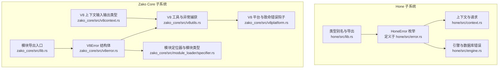
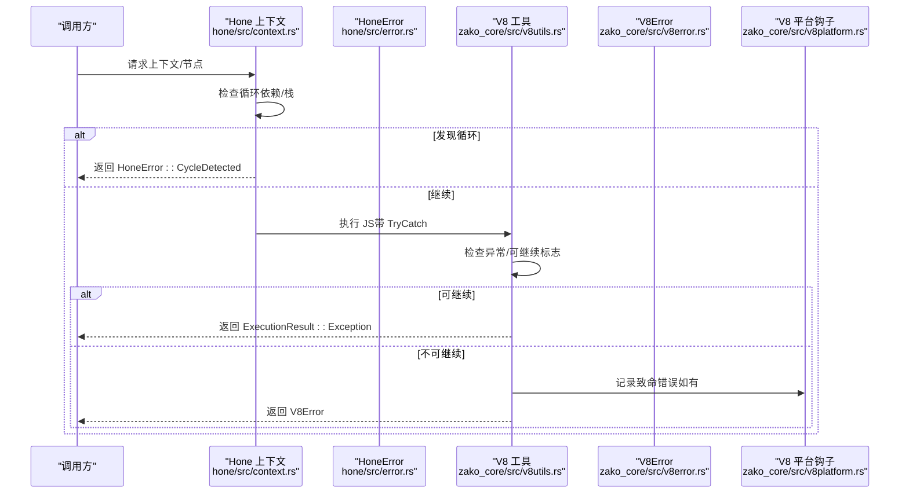
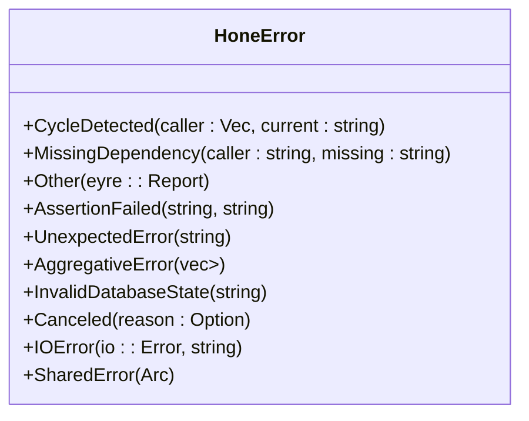
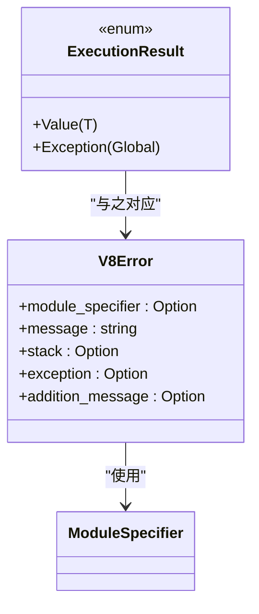
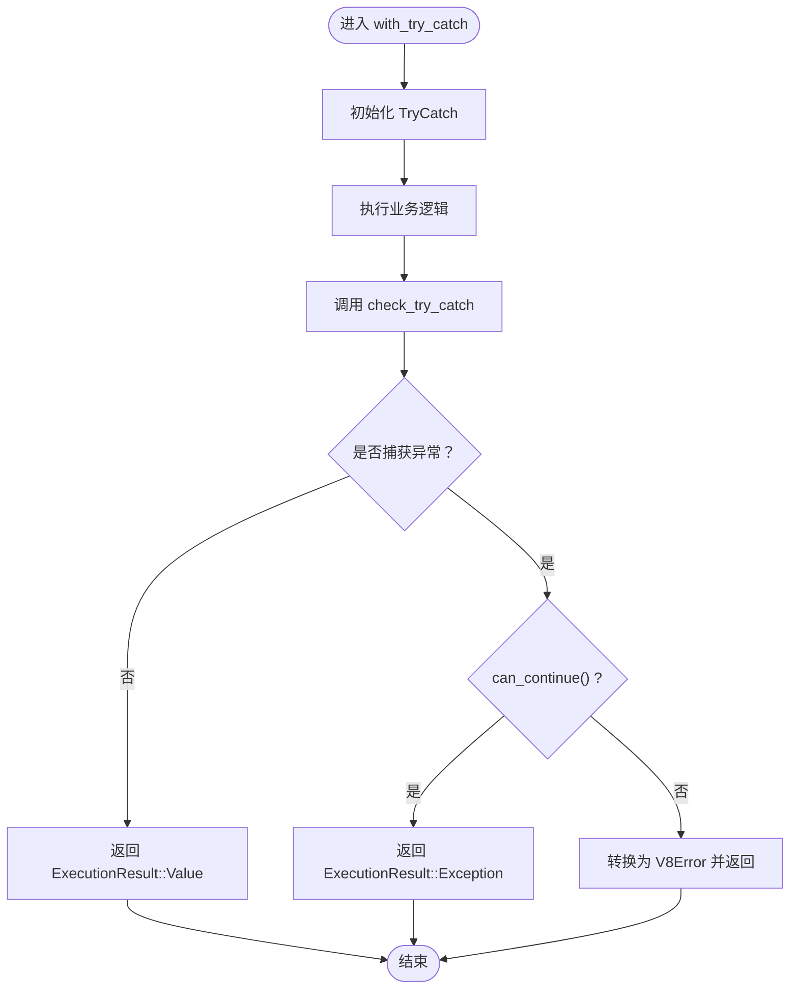
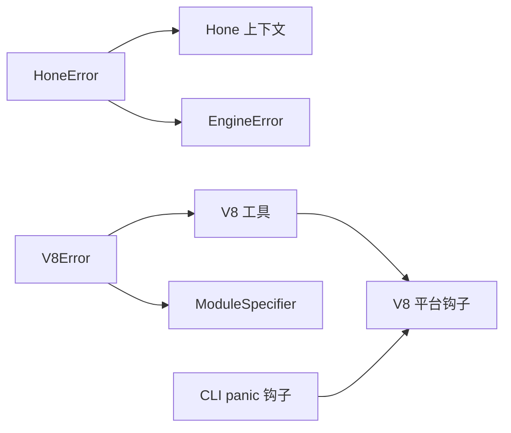

# 错误类型系统

<cite>
**本文引用的文件**
- [hone/src/error.rs](file://hone/src/error.rs)
- [hone/src/context.rs](file://hone/src/context.rs)
- [hone/src/engine.rs](file://hone/src/engine.rs)
- [hone/src/lib.rs](file://hone/src/lib.rs)
- [zako_core/src/v8error.rs](file://zako_core/src/v8error.rs)
- [zako_core/src/v8utils.rs](file://zako_core/src/v8utils.rs)
- [zako_core/src/v8platform.rs](file://zako_core/src/v8platform.rs)
- [zako_core/src/module_loader/specifier.rs](file://zako_core/src/module_loader/specifier.rs)
- [zako_core/src/v8context.rs](file://zako_core/src/v8context.rs)
- [zako_core/src/lib.rs](file://zako_core/src/lib.rs)
- [zako_cli/src/main.rs](file://zako_cli/src/main.rs)
- [hone/tests/error_tests.rs](file://hone/tests/error_tests.rs)
</cite>

## 目录
1. [引言](#引言)
2. [项目结构](#项目结构)
3. [核心组件](#核心组件)
4. [架构总览](#架构总览)
5. [详细组件分析](#详细组件分析)
6. [依赖关系分析](#依赖关系分析)
7. [性能考量](#性能考量)
8. [故障排查指南](#故障排查指南)
9. [结论](#结论)
10. [附录](#附录)

## 引言
本文件为 Zako 的错误类型系统提供权威参考与实操指南。重点覆盖以下方面：
- 错误类型定义与分类：Error 与 V8Error 的语义、字段与用途
- 层次结构与错误码映射：错误枚举、聚合错误、致命错误与可继续异常
- 错误消息格式与上下文保留：模块定位、堆栈、附加信息
- 错误传播机制：从 V8 到 Rust 的桥接、宏断言与共享错误
- 错误处理最佳实践与调试技巧：日志记录、报告与恢复策略
- 常见错误场景诊断与解决方案：循环依赖、数据库错误、事件循环死锁
- 设计原则与扩展机制：可组合性、可读性与可观测性

## 项目结构
Zako 的错误体系横跨两个主要子系统：
- Hone（构建图与节点引擎）：定义 HoneError 枚举与断言宏，用于图遍历、缓存与持久化过程中的错误建模
- Zako Core（V8 执行环境）：定义 V8Error 结构体与 ExecutionResult 枚举，用于 JS 执行失败时的致命错误与异常传播

图表来源
- [hone/src/error.rs](file://hone/src/error.rs#L1-L56)
- [hone/src/context.rs](file://hone/src/context.rs#L92-L112)
- [hone/src/engine.rs](file://hone/src/engine.rs#L16-L30)
- [hone/src/lib.rs](file://hone/src/lib.rs#L25-L27)
- [zako_core/src/v8error.rs](file://zako_core/src/v8error.rs#L1-L31)
- [zako_core/src/v8utils.rs](file://zako_core/src/v8utils.rs#L1-L187)
- [zako_core/src/v8platform.rs](file://zako_core/src/v8platform.rs#L1-L29)
- [zako_core/src/module_loader/specifier.rs](file://zako_core/src/module_loader/specifier.rs#L1-L121)
- [zako_core/src/v8context.rs](file://zako_core/src/v8context.rs#L1-L62)
- [zako_core/src/lib.rs](file://zako_core/src/lib.rs#L70-L78)

章节来源
- [hone/src/error.rs](file://hone/src/error.rs#L1-L56)
- [zako_core/src/v8error.rs](file://zako_core/src/v8error.rs#L1-L31)

## 核心组件
- HoneError（Hone 子系统）
  - 语义：用于构建图遍历、缓存加载、持久化等阶段的错误建模
  - 关键变体：循环检测、缺失依赖、断言失败、意外错误、聚合错误、数据库状态无效、取消、IO 错误、共享错误等
  - 断言宏：提供 assert 与 debug_assert，便于在开发与调试阶段快速暴露逻辑错误
- V8Error（Zako Core 子系统）
  - 语义：表示 V8 执行中的致命错误，导致执行流程不可继续
  - 字段：模块定位、消息、堆栈、异常对象文本、附加信息
  - ExecutionResult：区分 JS 正常返回与抛出异常两种执行结果

章节来源
- [hone/src/error.rs](file://hone/src/error.rs#L3-L30)
- [hone/src/lib.rs](file://hone/src/lib.rs#L25-L27)
- [zako_core/src/v8error.rs](file://zako_core/src/v8error.rs#L12-L30)

## 架构总览
错误在系统内的传播路径如下：
- Hone 层：在上下文请求与图遍历时产生 HoneError；通过 Result 或共享错误 Arc 包装传播
- V8 层：JS 执行通过 TryCatch 捕获异常，转换为 V8Error；若可继续则以 ExecutionResult::Exception 形式回传
- 日志与平台：V8 致命错误由平台钩子统一记录；CLI 提供 panic 钩子与用户报告引导

图表来源
- [hone/src/context.rs](file://hone/src/context.rs#L92-L112)
- [hone/src/error.rs](file://hone/src/error.rs#L4-L30)
- [zako_core/src/v8utils.rs](file://zako_core/src/v8utils.rs#L8-L36)
- [zako_core/src/v8platform.rs](file://zako_core/src/v8platform.rs#L22-L27)

## 详细组件分析

### HoneError 类型体系与断言宏
- 分类与语义
  - 循环检测：用于图遍历中发现环路，携带调用链与当前节点
  - 缺失依赖：当解析或计算依赖时发现缺失
  - 断言失败：开发期保护，确保不变量成立
  - 意外错误：标记“不应发生”的内部错误
  - 聚合错误：将多个错误打包以便一次性处理
  - 数据库状态无效：持久化层状态不一致
  - 取消：支持取消令牌与原因
  - IO 错误：文件访问等底层 IO 失败
  - 共享错误：将错误提升为 Arc 以便跨线程传递
- 断言宏
  - assert 与 debug_assert：在条件不满足时返回断言失败错误，便于早期暴露问题

图表来源
- [hone/src/error.rs](file://hone/src/error.rs#L3-L30)

章节来源
- [hone/src/error.rs](file://hone/src/error.rs#L3-L30)
- [hone/tests/error_tests.rs](file://hone/tests/error_tests.rs#L1-L21)

### V8Error 与 ExecutionResult
- V8Error 字段
  - 模块定位：ModuleSpecifier，用于标识抛错的 JS 模块
  - 消息与堆栈：原始异常消息与堆栈字符串
  - 异常对象文本：异常对象的字符串化表示
  - 附加信息：用于补充上下文
- ExecutionResult
  - 正常值：Value(T)
  - 异常：Exception(Global<Value>)，允许将异常对象回传给 JS 层继续传播

图表来源
- [zako_core/src/v8error.rs](file://zako_core/src/v8error.rs#L12-L30)
- [zako_core/src/module_loader/specifier.rs](file://zako_core/src/module_loader/specifier.rs#L35-L39)

章节来源
- [zako_core/src/v8error.rs](file://zako_core/src/v8error.rs#L1-L31)

### V8 工具与异常捕获流程
- check_try_catch：检查 TryCatch 是否捕获到异常，区分“可继续”与“不可继续”
- with_try_catch：封装上下文与 TryCatch 的样板代码，返回 ExecutionResult 或 V8Error
- convert_object_to_error：将任意 JS 对象转换为 V8Error
- 事件循环死锁检测：在泵消息循环后若 Promise 仍为 Pending，则返回致命错误

图表来源
- [zako_core/src/v8utils.rs](file://zako_core/src/v8utils.rs#L8-L36)
- [zako_core/src/v8utils.rs](file://zako_core/src/v8utils.rs#L116-L144)

章节来源
- [zako_core/src/v8utils.rs](file://zako_core/src/v8utils.rs#L1-L187)

### V8 平台与致命错误钩子
- 设置默认平台并注册致命错误处理器
- 致命错误会被统一记录，便于追踪 V8 内部崩溃

章节来源
- [zako_core/src/v8platform.rs](file://zako_core/src/v8platform.rs#L1-L29)

### Hone 上下文与错误传播
- 在上下文请求中检测循环依赖，返回 CycleDetected
- 将 HoneError 通过 Result 或 Arc 包装进行传播，便于上层聚合与处理

章节来源
- [hone/src/context.rs](file://hone/src/context.rs#L92-L112)
- [hone/src/error.rs](file://hone/src/error.rs#L4-L9)

### 引擎与数据库错误
- EngineError：对 redb 相关错误进行包装，便于统一处理
- 在数据库读取与反序列化过程中记录错误并跳过损坏项，保证系统稳健性

章节来源
- [hone/src/engine.rs](file://hone/src/engine.rs#L16-L30)
- [hone/src/engine.rs](file://hone/src/engine.rs#L70-L188)

## 依赖关系分析
- HoneError 与上下文、引擎模块耦合紧密，用于构建图与缓存层的错误建模
- V8Error 与模块定位器、V8 工具、平台钩子形成闭环，确保 JS 执行错误可追踪、可记录
- CLI 提供 panic 钩子，统一记录未捕获异常并引导用户报告

图表来源
- [hone/src/error.rs](file://hone/src/error.rs#L3-L30)
- [hone/src/context.rs](file://hone/src/context.rs#L92-L112)
- [hone/src/engine.rs](file://hone/src/engine.rs#L16-L30)
- [zako_core/src/v8error.rs](file://zako_core/src/v8error.rs#L12-L19)
- [zako_core/src/v8utils.rs](file://zako_core/src/v8utils.rs#L1-L187)
- [zako_core/src/v8platform.rs](file://zako_core/src/v8platform.rs#L22-L27)
- [zako_core/src/module_loader/specifier.rs](file://zako_core/src/module_loader/specifier.rs#L35-L39)
- [zako_cli/src/main.rs](file://zako_cli/src/main.rs#L634-L670)

章节来源
- [zako_core/src/lib.rs](file://zako_core/src/lib.rs#L70-L78)
- [zako_core/src/v8context.rs](file://zako_core/src/v8context.rs#L1-L62)

## 性能考量
- 错误对象尽量轻量化：V8Error 仅保存必要字段，避免深拷贝
- 使用 Arc 包装共享错误，减少跨线程复制成本
- 在数据库读取失败时采用“跳过并记录”的策略，避免整体阻塞
- 事件循环泵只在必要时阻塞，避免空转

## 故障排查指南
- 循环依赖
  - 现象：出现 CycleDetected 错误，caller 列表包含环路路径
  - 排查：检查节点依赖声明与图构建逻辑，消除环路
  - 参考：上下文请求中的循环检测逻辑
- 缺失依赖
  - 现象：MissingDependency，提示某节点缺少依赖
  - 排查：确认依赖解析与导入路径正确
- 断言失败
  - 现象：AssertionFailed，通常出现在开发/调试模式
  - 排查：根据错误消息与条件表达式定位不变量破坏点
- V8 致命错误
  - 现象：V8 抛出不可继续异常或平台致命错误钩子被触发
  - 排查：查看 V8Error 的 message、stack 与 module_specifier，结合 JS 侧日志定位
- 事件循环死锁
  - 现象：平台泵结束后 Promise 仍为 Pending，返回致命错误
  - 排查：检查异步任务调度与 Promise 解决逻辑，避免死锁
- 数据库错误
  - 现象：EngineError 包裹 redb 错误
  - 排查：检查事务、表与存储状态，必要时重建或修复

章节来源
- [hone/src/context.rs](file://hone/src/context.rs#L92-L112)
- [hone/src/error.rs](file://hone/src/error.rs#L4-L11)
- [zako_core/src/v8utils.rs](file://zako_core/src/v8utils.rs#L78-L88)
- [zako_core/src/v8platform.rs](file://zako_core/src/v8platform.rs#L22-L27)
- [hone/src/engine.rs](file://hone/src/engine.rs#L16-L30)

## 结论
Zako 的错误类型系统通过清晰的分层与职责划分，实现了从构建图到 V8 执行的全链路可观测与可控错误处理。HoneError 与 V8Error 各司其职，配合断言宏、共享错误与工具函数，既保障了开发期的快速反馈，也确保了运行期的稳健性与可诊断性。

## 附录

### 错误类型设计原则
- 明确性：错误变体命名与字段直观反映语义
- 可组合性：聚合错误与共享错误支持复杂场景
- 可观测性：模块定位、堆栈与附加信息便于诊断
- 可恢复性：区分致命错误与可继续异常，提供不同传播策略

### 扩展机制
- 新增 HoneError 变体：遵循现有命名与字段风格，提供清晰的错误消息模板
- 新增 V8Error 场景：在工具函数中增加转换逻辑，并完善日志与平台钩子
- 日志与报告：利用 tracing 记录关键错误，CLI 提供 panic 报告引导