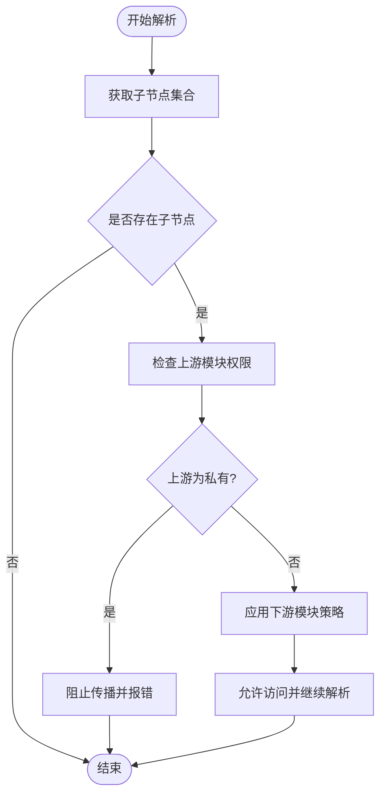

# 传递性权限级别

<cite>
**本文引用的文件**
- [access_control.rs](file://zako_core/src/access_control.rs)
- [engine.rs](file://hone/src/engine.rs)
- [dependency.rs](file://hone/src/dependency.rs)
- [lib.rs](file://hone/src/lib.rs)
- [node.rs](file://hone/src/node.rs)
- [package.rs](file://zako_core/src/package.rs)
- [lib.rs（zako_core）](file://zako_core/src/lib.rs)
</cite>

## 目录
1. [引言](#引言)
2. [项目结构](#项目结构)
3. [核心组件](#核心组件)
4. [架构总览](#架构总览)
5. [详细组件分析](#详细组件分析)
6. [依赖关系分析](#依赖关系分析)
7. [性能考量](#性能考量)
8. [故障排查指南](#故障排查指南)
9. [结论](#结论)
10. [附录](#附录)

## 引言
本文件围绕 Zako 的“传递性权限级别”体系进行系统化技术说明，重点阐述 TransitiveLevel 枚举的三个层级：Interface 接口级、Public 公共级、Private 私有级。我们将从权限范围、继承规则、传播机制入手，结合依赖链与解析流程，解释权限如何在构建图中向下游传递，并给出配置示例与最佳实践，帮助读者在工程实践中正确使用该能力。

## 项目结构
与传递性权限直接相关的核心位置如下：
- 权限模型定义位于 zako_core 模块的访问控制文件中，包含 Visibility 与 TransitiveLevel 两类权限表达。
- 依赖图与节点解析逻辑位于 hone 模块，负责将权限约束映射到实际的依赖边与解析过程。
- 包元数据与解析流程位于 zako_core 模块，用于承载与传播权限相关的配置与依赖信息。

图表来源
- [access_control.rs](file://zako_core/src/access_control.rs#L1-L19)
- [package.rs](file://zako_core/src/package.rs#L1-L283)
- [dependency.rs](file://hone/src/dependency.rs#L1-L63)
- [engine.rs](file://hone/src/engine.rs#L190-L442)
- [lib.rs（zako_core）](file://zako_core/src/lib.rs#L1-L119)

章节来源
- [lib.rs（zako_core）](file://zako_core/src/lib.rs#L1-L119)

## 核心组件
- 权限模型
  - Visibility：用于表达可见性范围，支持受限列表、私有、公开三种形态。
  - TransitiveLevel：用于表达传递性权限层级，包含 Interface、Public、Private 三档。
- 依赖图与解析引擎
  - 依赖图维护父子节点关系，支持添加父子边、清理子依赖等操作。
  - 解析引擎在解析过程中遍历依赖图的子节点，驱动下游计算。
- 节点键值契约
  - 定义了节点键、值的序列化与安全归档要求，确保跨模块传输时的稳定性。

章节来源
- [access_control.rs](file://zako_core/src/access_control.rs#L1-L19)
- [dependency.rs](file://hone/src/dependency.rs#L1-L63)
- [engine.rs](file://hone/src/engine.rs#L190-L442)
- [node.rs](file://hone/src/node.rs#L1-L61)

## 架构总览
传递性权限在构建系统中的作用路径如下：
- 在包元数据中声明目标模块的 TransitiveLevel 与 Visibility。
- 解析阶段根据依赖图自上而下展开，将上游模块的权限策略向下传播。
- 下游模块在消费上游模块时，依据当前模块的权限策略与依赖图关系决定是否允许访问。

图表来源
- [engine.rs](file://hone/src/engine.rs#L411-L442)
- [dependency.rs](file://hone/src/dependency.rs#L55-L61)

## 详细组件分析

### TransitiveLevel 枚举与语义
- Interface（接口级）
  - 含义：仅作为对外接口暴露，不参与深层内部传播。
  - 继承规则：默认不向下传播到更下游模块；若下游模块显式声明更高权限，则可覆盖。
  - 适用场景：对外 API 边界清晰、内部实现细节隔离的模块。
- Public（公共级）
  - 含义：对所有下游模块开放，允许自由传播。
  - 继承规则：默认向下传播至所有子节点；除非下游模块明确限制。
  - 适用场景：通用工具库、基础能力模块。
- Private（私有级）
  - 含义：仅限当前包内使用，禁止向外部传播。
  - 继承规则：不会向任何下游模块传播；即使下游模块声明更高权限也不受影响。
  - 适用场景：内部实现细节、敏感逻辑所在模块。

图表来源
- [access_control.rs](file://zako_core/src/access_control.rs#L12-L18)
- [access_control.rs](file://zako_core/src/access_control.rs#L3-L10)

章节来源
- [access_control.rs](file://zako_core/src/access_control.rs#L1-L19)

### 依赖图与传播机制
- 依赖图结构
  - 提供父子节点的双向映射，支持批量添加父子边、清空子依赖等操作。
  - 通过并发容器保证高并发下的读写安全。
- 传播机制
  - 解析引擎在遍历子节点时，结合模块的 TransitiveLevel 与 Visibility 决定是否允许访问。
  - 若上游模块为 Private，则无论下游声明为何种级别，均不可传播。
  - 若上游模块为 Public 或 Interface，则按下游模块的权限策略进一步判定。

图表来源
- [dependency.rs](file://hone/src/dependency.rs#L55-L61)
- [engine.rs](file://hone/src/engine.rs#L437-L442)

章节来源
- [dependency.rs](file://hone/src/dependency.rs#L1-L63)
- [engine.rs](file://hone/src/engine.rs#L411-L442)

### 包元数据与权限配置
- 包元数据结构
  - 包含构建、规则、工具链、同伴等模式字段，以及依赖与配置。
  - 解析流程会将原始配置转换为已解析配置，便于后续传播。
- 与权限的关系
  - 权限策略通常与包元数据中的模式与依赖声明协同工作，确保模块边界清晰。
  - 在解析阶段，上游模块的 TransitiveLevel 与 Visibility 会影响下游模块的可用性。

章节来源
- [package.rs](file://zako_core/src/package.rs#L68-L86)
- [package.rs](file://zako_core/src/package.rs#L136-L221)

### 节点契约与安全归档
- 节点键与值需满足持久化与安全归档要求，确保跨模块传输时的稳定性。
- 这为权限传播提供了可靠的数据载体，避免因序列化问题导致的策略失效。

章节来源
- [node.rs](file://hone/src/node.rs#L8-L61)

## 依赖关系分析
- 模块耦合
  - zako_core 的访问控制与包解析为上层提供权限语义与配置承载。
  - hone 的依赖图与解析引擎为权限传播提供执行环境。
- 外部依赖
  - 并发容器与序列化框架用于提升性能与可靠性。
- 循环依赖检测
  - 解析过程中包含循环依赖检测，防止权限传播导致的死锁或无限递归。

图表来源
- [access_control.rs](file://zako_core/src/access_control.rs#L1-L19)
- [package.rs](file://zako_core/src/package.rs#L1-L283)
- [dependency.rs](file://hone/src/dependency.rs#L1-L63)
- [engine.rs](file://hone/src/engine.rs#L190-L442)
- [lib.rs](file://hone/src/lib.rs#L1-L34)
- [node.rs](file://hone/src/node.rs#L1-L61)

章节来源
- [lib.rs](file://hone/src/lib.rs#L1-L34)

## 性能考量
- 并发容器
  - 使用并发映射与集合存储依赖关系，减少锁竞争，提高大规模依赖图的解析效率。
- 原子化操作
  - 依赖边的增删与查询采用原子化操作，降低竞态风险。
- 序列化优化
  - 节点键值采用高效序列化方案，减少跨模块传输成本。

## 故障排查指南
- 常见问题
  - 权限传播失败：检查上游模块是否为 Private，或下游模块是否违反了可见性限制。
  - 循环依赖：解析过程中检测到循环依赖会报错，需调整依赖图结构。
  - 配置未生效：确认包元数据中的模式与依赖声明是否正确，解析流程是否完成。
- 排查步骤
  - 确认 TransitiveLevel 与 Visibility 的组合是否符合预期。
  - 检查依赖图的父子边是否正确建立。
  - 观察解析日志，定位首次失败的模块与边。

章节来源
- [engine.rs](file://hone/src/engine.rs#L427-L433)

## 结论
Zako 的传递性权限系统通过 TransitiveLevel 与 Visibility 的组合，为模块间的访问控制提供了清晰、可传播的策略。在工程实践中，应优先使用 Private 严格隔离内部实现，Public 作为通用能力，Interface 作为对外边界。配合依赖图与解析引擎，可在构建期即保证模块边界与安全性。

## 附录

### 配置示例与使用场景
- 场景一：对外 API（Interface）
  - 将模块标记为 Interface，仅暴露必要的接口，内部实现不向下游传播。
  - 适合对外发布但内部细节不外泄的模块。
- 场景二：通用工具库（Public）
  - 将模块标记为 Public，允许所有下游模块访问，形成广泛复用的基础能力。
  - 适合通用工具、辅助函数库等。
- 场景三：内部实现（Private）
  - 将模块标记为 Private，禁止向外部传播，确保内部实现不被滥用。
  - 适合敏感逻辑、平台适配层等。

### 权限冲突处理与最佳实践
- 冲突处理
  - 当上游为 Private 时，强制阻止传播，不因下游声明更高权限而例外。
  - 当上游为 Public 时，遵循下游模块的可见性策略；Restricted 列表可进一步细化允许方。
- 最佳实践
  - 明确模块职责与边界，优先使用最小权限原则。
  - 对外暴露尽量使用 Interface，内部实现尽量使用 Private。
  - 在团队内统一约定权限命名与策略，避免歧义。
  - 定期审查依赖图，移除不必要的传播边，保持结构清晰。