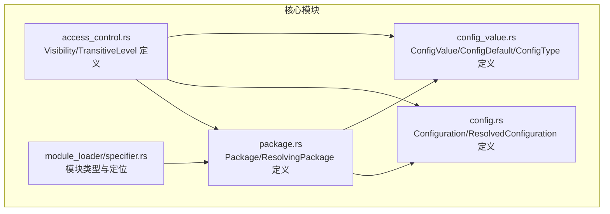
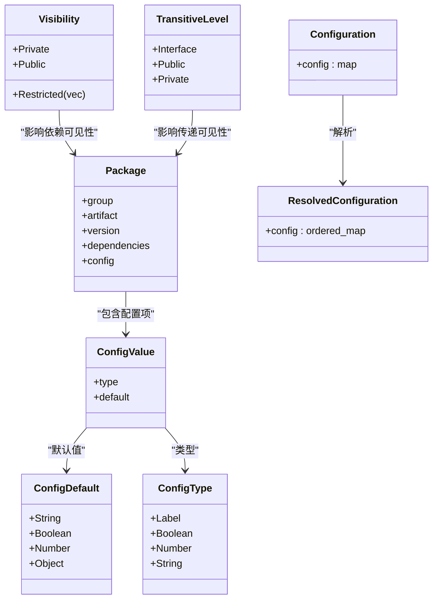
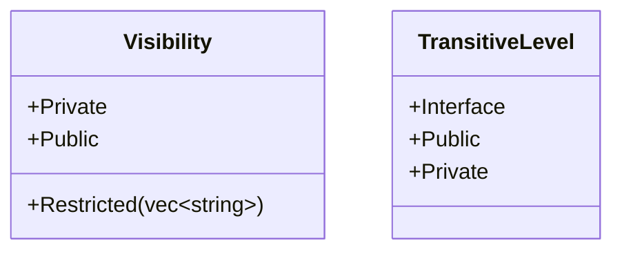
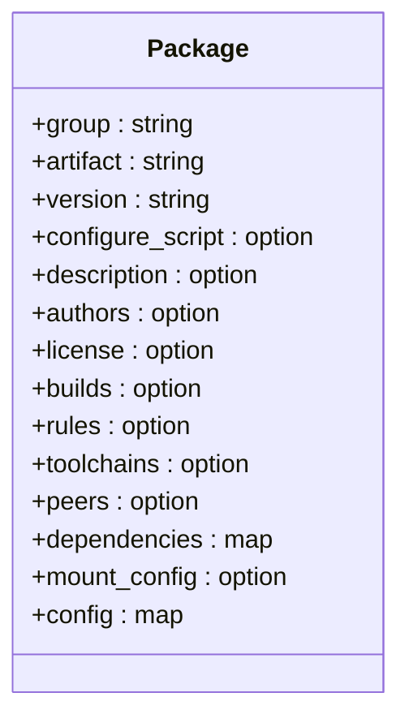
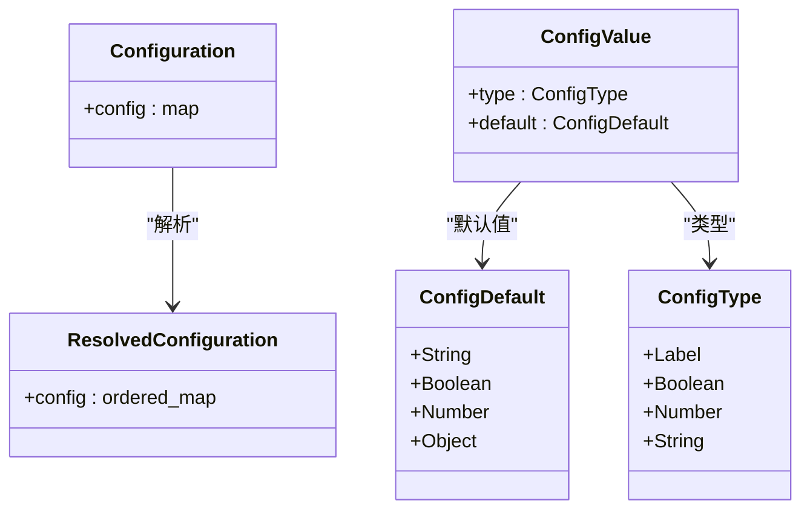
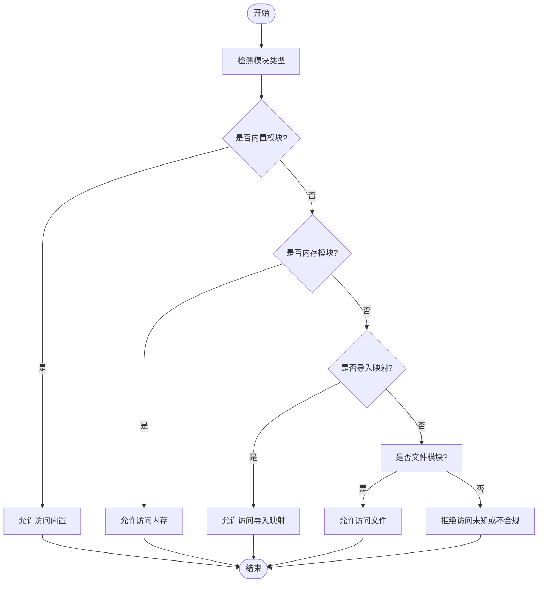

# 可见性权限

<cite>
**本文引用的文件**
- [zako_core/src/access_control.rs](file://zako_core/src/access_control.rs)
- [zako_core/src/package.rs](file://zako_core/src/package.rs)
- [zako_core/src/config.rs](file://zako_core/src/config.rs)
- [zako_core/src/config_value.rs](file://zako_core/src/config_value.rs)
- [tests/new_project/zako.json](file://tests/new_project/zako.json)
- [tests/log_version/zako.jsonc](file://tests/log_version/zako.jsonc)
- [zako_core/src/module_loader/specifier.rs](file://zako_core/src/module_loader/specifier.rs)
</cite>

## 目录
1. [简介](#简介)
2. [项目结构](#项目结构)
3. [核心组件](#核心组件)
4. [架构总览](#架构总览)
5. [详细组件分析](#详细组件分析)
6. [依赖关系分析](#依赖关系分析)
7. [性能考量](#性能考量)
8. [故障排查指南](#故障排查指南)
9. [结论](#结论)
10. [附录](#附录)

## 简介
本文件聚焦于Zako的“可见性权限”系统，系统性阐述Visibility枚举的三种模式：Restricted（受限）、Private（私有）、Public（公开）。文档从类型定义出发，结合包与配置模型，解释可见性在构建流程中的作用机制，包括对依赖解析、模块导出与访问控制的影响，并提供配置示例、最佳实践与常见问题解决方案。

## 项目结构
围绕可见性权限的关键代码位于zako_core模块中，主要涉及：
- 可见性与传递性层级的类型定义
- 包模型与配置模型
- 配置值与默认值的类型系统
- 模块加载与模块定位（与可见性间接相关）

图表来源
- [zako_core/src/access_control.rs](file://zako_core/src/access_control.rs#L1-L19)
- [zako_core/src/package.rs](file://zako_core/src/package.rs#L68-L86)
- [zako_core/src/config.rs](file://zako_core/src/config.rs#L14-L89)
- [zako_core/src/config_value.rs](file://zako_core/src/config_value.rs#L23-L117)
- [zako_core/src/module_loader/specifier.rs](file://zako_core/src/module_loader/specifier.rs#L27-L39)

章节来源
- [zako_core/src/access_control.rs](file://zako_core/src/access_control.rs#L1-L19)
- [zako_core/src/package.rs](file://zako_core/src/package.rs#L68-L86)
- [zako_core/src/config.rs](file://zako_core/src/config.rs#L14-L89)
- [zako_core/src/config_value.rs](file://zako_core/src/config_value.rs#L23-L117)
- [zako_core/src/module_loader/specifier.rs](file://zako_core/src/module_loader/specifier.rs#L27-L39)

## 核心组件
- Visibility（可见性）：用于声明实体（如包或配置项）的可见范围，支持Restricted（受限）、Private（私有）、Public（公开）三种形态。
- TransitiveLevel（传递性层级）：用于声明依赖传递时的可见性策略，包括Interface、Public、Private。
- Package（包）：承载元数据、依赖、配置等信息，是可见性规则的主要应用对象之一。
- Configuration/ResolvedConfiguration（配置）：配置的原始与解析后形态，与可见性关联体现在可被哪些消费者访问。
- ConfigValue/ConfigDefault/ConfigType（配置值）：配置项的类型与默认值结构，为可见性控制提供基础。

章节来源
- [zako_core/src/access_control.rs](file://zako_core/src/access_control.rs#L3-L18)
- [zako_core/src/package.rs](file://zako_core/src/package.rs#L68-L86)
- [zako_core/src/config.rs](file://zako_core/src/config.rs#L14-L89)
- [zako_core/src/config_value.rs](file://zako_core/src/config_value.rs#L23-L117)

## 架构总览
可见性权限在Zako中的作用机制可概括为：
- 在包模型层面，通过Visibility声明实体的可见范围，决定其在依赖图中的可访问性。
- 在配置层面，通过ConfigValue/ConfigDefault/ConfigType定义配置项的类型与默认值，结合可见性控制其对外暴露程度。
- 在模块加载层面，模块类型与定位（如内置、内存、导入映射、文件）为可见性提供运行时约束，确保只有具备相应可见性的模块才能被正确解析与执行。

图表来源
- [zako_core/src/access_control.rs](file://zako_core/src/access_control.rs#L3-L18)
- [zako_core/src/package.rs](file://zako_core/src/package.rs#L68-L86)
- [zako_core/src/config.rs](file://zako_core/src/config.rs#L14-L89)
- [zako_core/src/config_value.rs](file://zako_core/src/config_value.rs#L23-L117)

## 详细组件分析

### Visibility（可见性）与TransitiveLevel（传递性层级）
- Restricted（受限）：以字符串列表形式限定可见范围，通常用于白名单式授权，仅允许指定主体访问。
- Private（私有）：限制为内部可见，不对外暴露，常用于实现细节或内部模块。
- Public（公开）：完全开放，允许任意外部访问。
- TransitiveLevel（传递性层级）：用于声明依赖传递时的可见性策略，Interface/Public/Private分别对应接口级、公开级、私有级的传递规则。

图表来源
- [zako_core/src/access_control.rs](file://zako_core/src/access_control.rs#L3-L18)

章节来源
- [zako_core/src/access_control.rs](file://zako_core/src/access_control.rs#L3-L18)

### Package（包）与可见性
- Package结构体包含group、artifact、version等元信息，以及dependencies与config等字段，这些字段天然受可见性控制。
- 可见性通过Visibility应用于包的导出与依赖解析阶段，决定哪些依赖可以被解析、哪些配置项可以被其他包访问。

图表来源
- [zako_core/src/package.rs](file://zako_core/src/package.rs#L68-L86)

章节来源
- [zako_core/src/package.rs](file://zako_core/src/package.rs#L68-L86)

### Configuration与ResolvedConfiguration（配置）
- Configuration为原始不可变配置，ResolvedConfiguration为解析后的不可变配置，二者均与可见性相关，因为它们决定了配置项的可用性与传播范围。
- 配置项的类型与默认值由ConfigValue/ConfigDefault/ConfigType定义，这些类型为可见性控制提供了基础数据结构。

图表来源
- [zako_core/src/config.rs](file://zako_core/src/config.rs#L14-L89)
- [zako_core/src/config_value.rs](file://zako_core/src/config_value.rs#L23-L117)

章节来源
- [zako_core/src/config.rs](file://zako_core/src/config.rs#L14-L89)
- [zako_core/src/config_value.rs](file://zako_core/src/config_value.rs#L23-L117)

### 模块加载与可见性（间接影响）
- 模块类型（File/Builtin/Memory/ImportMap）与模块定位（URL/前缀）为可见性提供运行时约束，确保只有具备相应可见性的模块才能被正确解析与执行。
- 这一机制与可见性权限共同作用，防止越权访问与非法依赖。

图表来源
- [zako_core/src/module_loader/specifier.rs](file://zako_core/src/module_loader/specifier.rs#L27-L39)
- [zako_core/src/module_loader/specifier.rs](file://zako_core/src/module_loader/specifier.rs#L57-L107)

章节来源
- [zako_core/src/module_loader/specifier.rs](file://zako_core/src/module_loader/specifier.rs#L27-L39)
- [zako_core/src/module_loader/specifier.rs](file://zako_core/src/module_loader/specifier.rs#L57-L107)

## 依赖关系分析
- Visibility与TransitiveLevel直接作用于Package的依赖与配置，决定依赖解析与可见性传播。
- Configuration与ResolvedConfiguration之间的转换，体现了可见性在配置层面的生效路径。
- 模块加载器的模块类型与定位逻辑，为可见性提供运行时保障。

图表来源
- [zako_core/src/access_control.rs](file://zako_core/src/access_control.rs#L3-L18)
- [zako_core/src/package.rs](file://zako_core/src/package.rs#L68-L86)
- [zako_core/src/config.rs](file://zako_core/src/config.rs#L14-L89)
- [zako_core/src/module_loader/specifier.rs](file://zako_core/src/module_loader/specifier.rs#L27-L39)

章节来源
- [zako_core/src/access_control.rs](file://zako_core/src/access_control.rs#L3-L18)
- [zako_core/src/package.rs](file://zako_core/src/package.rs#L68-L86)
- [zako_core/src/config.rs](file://zako_core/src/config.rs#L14-L89)
- [zako_core/src/module_loader/specifier.rs](file://zako_core/src/module_loader/specifier.rs#L27-L39)

## 性能考量
- 可见性检查应尽量避免重复计算，建议在构建图中缓存可见性结果，减少重复序列化/反序列化与哈希计算。
- 对于Restricted模式，白名单规模较大时，应采用高效查找结构（如哈希集合）以降低查询复杂度。
- 在模块加载阶段，优先进行快速类型判定，减少不必要的URL解析与路径拼接。

## 故障排查指南
- 可见性不生效
  - 检查包的依赖与配置是否正确声明了Visibility/TransitiveLevel。
  - 确认ResolvedConfiguration是否正确生成，避免因配置解析错误导致可见性失效。
- 依赖解析失败
  - 排查Package.dependencies键名是否符合标识符规范。
  - 确认依赖版本与源地址是否有效。
- 模块无法加载
  - 检查模块类型与前缀是否匹配，确保URL schema与模块类型一致。
  - 确认模块路径合法且可访问。

章节来源
- [zako_core/src/package.rs](file://zako_core/src/package.rs#L88-L114)
- [zako_core/src/config.rs](file://zako_core/src/config.rs#L41-L71)
- [zako_core/src/module_loader/specifier.rs](file://zako_core/src/module_loader/specifier.rs#L57-L107)

## 结论
Zako的可见性权限系统通过Visibility与TransitiveLevel在包与配置层面提供细粒度的访问控制，结合模块加载器的类型与定位机制，形成从构建到运行时的完整可见性保障。遵循本文的最佳实践与排障建议，可有效提升项目的可维护性与安全性。

## 附录

### 可见性级别详解与使用场景
- Restricted（受限）
  - 含义：仅允许白名单内的主体访问。
  - 使用场景：需要严格控制访问范围的敏感模块或配置。
  - 配置方法：在包或配置项上声明Restricted，并提供允许访问的主体列表。
- Private（私有）
  - 含义：仅内部可见，不对外暴露。
  - 使用场景：实现细节、内部工具或不希望被外部依赖的模块。
  - 配置方法：在包或配置项上声明Private。
- Public（公开）
  - 含义：完全开放，允许任意外部访问。
  - 使用场景：公共API、通用库或需要广泛共享的模块。
  - 配置方法：在包或配置项上声明Public。

### 权限配置示例（基于项目配置）
- 新建项目示例（布尔型选项）
  - 示例路径：[tests/new_project/zako.json](file://tests/new_project/zako.json#L9-L16)
  - 说明：通过options定义布尔型配置项，体现可见性与配置项的结合使用。
- 日志版本示例（配置继承）
  - 示例路径：[tests/log_version/zako.jsonc](file://tests/log_version/zako.jsonc#L14-L30)
  - 说明：通过config定义配置项并支持继承，体现可见性在配置传播中的作用。

章节来源
- [tests/new_project/zako.json](file://tests/new_project/zako.json#L9-L16)
- [tests/log_version/zako.jsonc](file://tests/log_version/zako.jsonc#L14-L30)