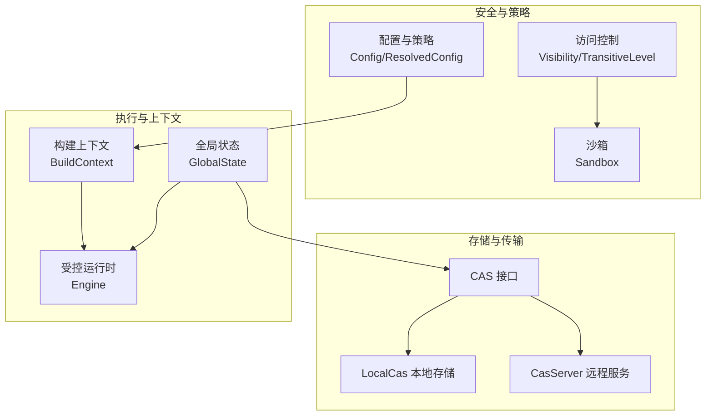
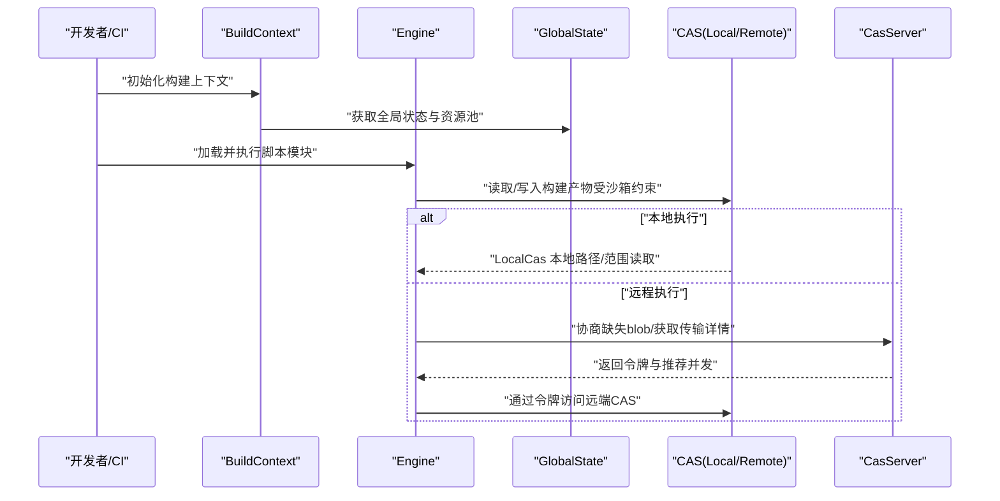
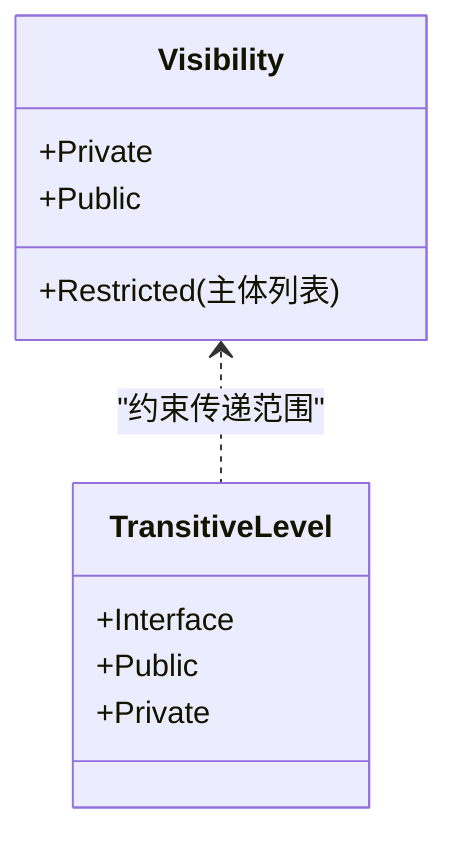
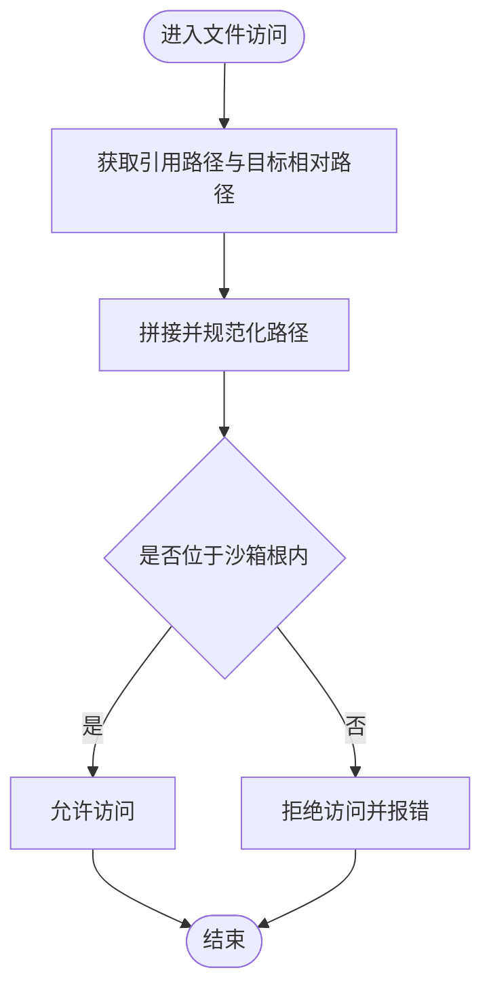
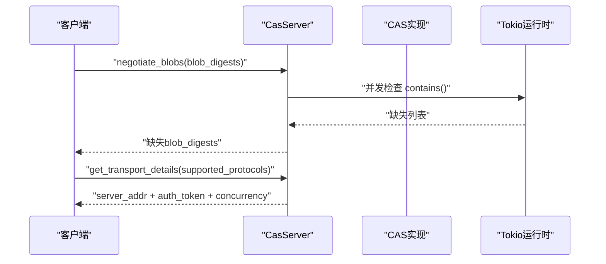
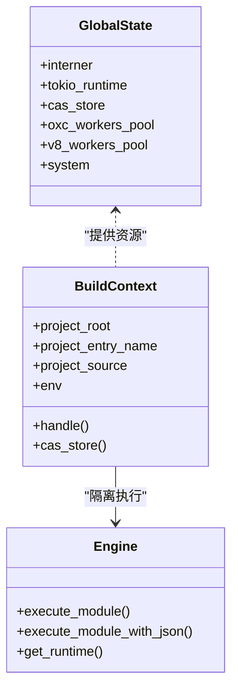
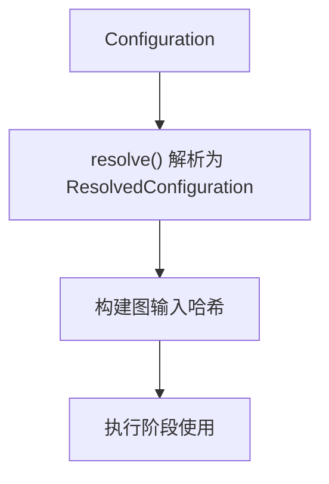
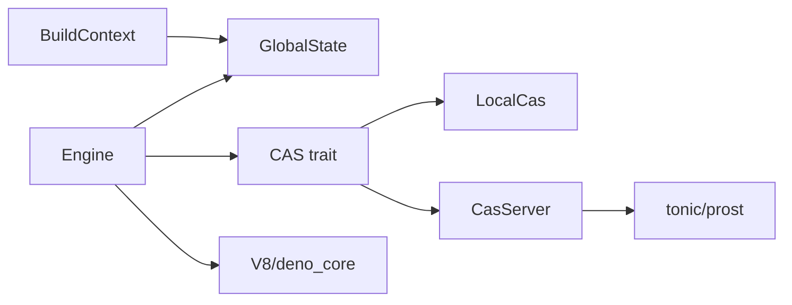

# 安全策略

<cite>
**本文引用的文件**
- [access_control.rs](file://zako_core/src/access_control.rs)
- [sandbox.rs](file://zako_core/src/sandbox.rs)
- [cas.rs](file://zako_core/src/cas.rs)
- [local_cas.rs](file://zako_core/src/local_cas.rs)
- [cas_server.rs](file://zako_core/src/cas_server.rs)
- [engine.rs](file://zako_core/src/engine.rs)
- [context.rs](file://zako_core/src/context.rs)
- [global_state.rs](file://zako_core/src/global_state.rs)
- [config.rs](file://zako_core/src/config.rs)
- [config_value.rs](file://zako_core/src/config_value.rs)
- [Cargo.toml](file://Cargo.toml)
- [AIInstruction.md](file://AIInstruction.md)
</cite>

## 目录
1. [简介](#简介)
2. [项目结构](#项目结构)
3. [核心组件](#核心组件)
4. [架构总览](#架构总览)
5. [详细组件分析](#详细组件分析)
6. [依赖分析](#依赖分析)
7. [性能考量](#性能考量)
8. [故障排查指南](#故障排查指南)
9. [结论](#结论)
10. [附录](#附录)

## 简介
本文件面向Zako的安全策略系统，系统性阐述整体安全框架、安全边界与威胁模型，详解最小权限原则的落地方式、权限验证流程与访问控制策略，并覆盖在本地构建、远程执行与分布式场景下的应用要点。同时提供安全配置模板、策略评估方法、合规性检查建议、审计日志与异常检测响应机制的实现指导，以及常见安全威胁与防护措施。

## 项目结构
Zako围绕“内容寻址存储（CAS）+ 沙箱 + 配置与可见性控制 + 受控运行时”的安全基座组织模块：
- 安全边界与访问控制：Visibility与TransitiveLevel定义可见性与传递级别，结合沙箱路径校验，限制文件系统访问范围。
- 内容寻址与传输：CAS接口统一数据存储/检索/校验，LocalCas本地持久化，CasServer提供远程传输协商与令牌鉴权。
- 运行时与上下文：全局状态管理资源池与工作池，构建上下文封装项目根与源信息，受控JS运行时执行脚本。
- 配置与策略：配置类型与默认值定义，ResolvedConfiguration参与构建图输入哈希，确保输入即定义与可复现性。

图表来源
- [access_control.rs](file://zako_core/src/access_control.rs#L1-L19)
- [sandbox.rs](file://zako_core/src/sandbox.rs#L1-L82)
- [cas.rs](file://zako_core/src/cas.rs#L1-L63)
- [local_cas.rs](file://zako_core/src/local_cas.rs#L1-L213)
- [cas_server.rs](file://zako_core/src/cas_server.rs#L1-L149)
- [engine.rs](file://zako_core/src/engine.rs#L1-L306)
- [context.rs](file://zako_core/src/context.rs#L1-L229)
- [global_state.rs](file://zako_core/src/global_state.rs#L1-L153)
- [config.rs](file://zako_core/src/config.rs#L1-L119)
- [config_value.rs](file://zako_core/src/config_value.rs#L1-L166)

章节来源
- [access_control.rs](file://zako_core/src/access_control.rs#L1-L19)
- [sandbox.rs](file://zako_core/src/sandbox.rs#L1-L82)
- [cas.rs](file://zako_core/src/cas.rs#L1-L63)
- [local_cas.rs](file://zako_core/src/local_cas.rs#L1-L213)
- [cas_server.rs](file://zako_core/src/cas_server.rs#L1-L149)
- [engine.rs](file://zako_core/src/engine.rs#L1-L306)
- [context.rs](file://zako_core/src/context.rs#L1-L229)
- [global_state.rs](file://zako_core/src/global_state.rs#L1-L153)
- [config.rs](file://zako_core/src/config.rs#L1-L119)
- [config_value.rs](file://zako_core/src/config_value.rs#L1-L166)

## 核心组件
- 访问控制模型
  - Visibility：Restricted（白名单）、Private、Public，用于声明资源可见范围。
  - TransitiveLevel：Interface/Public/Private，用于声明传递级别的可见性约束。
- 沙箱机制
  - Sandbox：限定文件系统访问根路径，提供安全拼接与校验，防止越权访问。
- 内容寻址存储（CAS）
  - Cas trait：统一的store/check/contains/fetch/get_local_path接口，含权限与范围校验。
  - LocalCas：本地文件系统存储，按内容分片组织，支持范围读取与原子落盘。
  - CasServer：远程CAS服务端，提供协商缺失blob、传输协议选择与临时令牌。
- 受控运行时与上下文
  - GlobalState：集中管理Interner、Tokio运行时、CAS存储、工作池与系统信息。
  - BuildContext：封装项目根、入口名、源信息与全局状态引用，提供句柄以隔离访问。
  - Engine：基于V8/deno_core的受控JS运行时，注入内置扩展与系统调用封装。
- 配置与策略
  - Configuration/ResolvedConfiguration：配置键值与解析后的不可变配置，参与构建图输入哈希。

章节来源
- [access_control.rs](file://zako_core/src/access_control.rs#L1-L19)
- [sandbox.rs](file://zako_core/src/sandbox.rs#L1-L82)
- [cas.rs](file://zako_core/src/cas.rs#L1-L63)
- [local_cas.rs](file://zako_core/src/local_cas.rs#L1-L213)
- [cas_server.rs](file://zako_core/src/cas_server.rs#L1-L149)
- [engine.rs](file://zako_core/src/engine.rs#L1-L306)
- [context.rs](file://zako_core/src/context.rs#L1-L229)
- [global_state.rs](file://zako_core/src/global_state.rs#L1-L153)
- [config.rs](file://zako_core/src/config.rs#L1-L119)
- [config_value.rs](file://zako_core/src/config_value.rs#L1-L166)

## 架构总览
下图展示Zako安全策略在不同执行环境中的交互：本地构建（LocalCas + Sandbox + Engine）、远程执行（CasServer + 传输令牌 + 远程CAS）与分布式（CAS作为共享后端，配合可见性与传递级别）。

图表来源
- [context.rs](file://zako_core/src/context.rs#L1-L229)
- [global_state.rs](file://zako_core/src/global_state.rs#L1-L153)
- [engine.rs](file://zako_core/src/engine.rs#L1-L306)
- [cas.rs](file://zako_core/src/cas.rs#L1-L63)
- [local_cas.rs](file://zako_core/src/local_cas.rs#L1-L213)
- [cas_server.rs](file://zako_core/src/cas_server.rs#L1-L149)

## 详细组件分析

### 访问控制与可见性模型
- Visibility
  - Restricted(白名单)：仅列出的主体可访问。
  - Private：仅自身可访问。
  - Public：开放访问。
- TransitiveLevel
  - Interface：仅接口层可见。
  - Public/Private：控制传递范围，避免越级暴露。
- 最小权限原则
  - 通过Visibility与TransitiveLevel在构建图层面声明最小可见集，避免不必要的依赖暴露。
  - 与沙箱结合，确保运行时仅能访问被授权的文件路径。

图表来源
- [access_control.rs](file://zako_core/src/access_control.rs#L1-L19)

章节来源
- [access_control.rs](file://zako_core/src/access_control.rs#L1-L19)

### 沙箱与文件系统访问控制
- Sandbox
  - 限定root，提供安全拼接与规范化路径校验。
  - is_in_sandbox/get_path_safe/join_path_for均进行越界检查，越界访问抛出错误。
- 最小权限与路径隔离
  - 通过沙箱根限制所有文件系统操作，结合Visibility/TransitiveLevel，确保运行时无法访问未授权路径。

图表来源
- [sandbox.rs](file://zako_core/src/sandbox.rs#L1-L82)

章节来源
- [sandbox.rs](file://zako_core/src/sandbox.rs#L1-L82)

### 内容寻址存储（CAS）与传输安全
- Cas接口
  - store：按内容地址写入，异步流式写入，原子落盘。
  - check/contains：存在性查询，含权限与范围校验。
  - fetch：支持BlobRange范围读取，越界返回错误。
  - get_local_path：仅本地CAS可用，远程CAS可能返回None。
- LocalCas
  - 按内容哈希分片组织，硬链接/软链接复用，大文件采用内存映射加速。
  - 原子重命名，失败回滚。
- CasServer
  - negotiate_blobs：批量检查缺失blob，异步并行，缓冲IO数量可控。
  - get_transport_details：协议协商（当前仅支持gRPC），发放一次性令牌，记录并发建议。

图表来源
- [cas_server.rs](file://zako_core/src/cas_server.rs#L1-L149)
- [cas.rs](file://zako_core/src/cas.rs#L1-L63)
- [local_cas.rs](file://zako_core/src/local_cas.rs#L1-L213)

章节来源
- [cas.rs](file://zako_core/src/cas.rs#L1-L63)
- [local_cas.rs](file://zako_core/src/local_cas.rs#L1-L213)
- [cas_server.rs](file://zako_core/src/cas_server.rs#L1-L149)

### 受控运行时与上下文
- GlobalState
  - 统一管理Interner、Tokio运行时、CAS存储、工作池与系统信息。
  - 依据CPU核数与系统栈大小配置Tokio线程数与栈深。
- BuildContext
  - 封装项目根、入口名、源信息，提供句柄隔离访问。
  - 通过全局状态引用获取资源池、CAS存储、工作池等。
- Engine
  - 初始化V8平台与扩展，注入内置能力（rt/syscall/global/semver/core/console）。
  - 提供模块加载与执行、事件循环、异常捕获与转换。

图表来源
- [global_state.rs](file://zako_core/src/global_state.rs#L1-L153)
- [context.rs](file://zako_core/src/context.rs#L1-L229)
- [engine.rs](file://zako_core/src/engine.rs#L1-L306)

章节来源
- [global_state.rs](file://zako_core/src/global_state.rs#L1-L153)
- [context.rs](file://zako_core/src/context.rs#L1-L229)
- [engine.rs](file://zako_core/src/engine.rs#L1-L306)

### 配置与策略
- Configuration/ResolvedConfiguration
  - 配置键值与默认值定义，解析为不可变结构，参与构建图输入哈希。
  - 通过Label与Interner确保键的唯一性与可复现性。
- 最小信息原则
  - 仅注入构建所需变量，避免泄露系统环境变量等敏感信息。

图表来源
- [config.rs](file://zako_core/src/config.rs#L1-L119)
- [config_value.rs](file://zako_core/src/config_value.rs#L1-L166)

章节来源
- [config.rs](file://zako_core/src/config.rs#L1-L119)
- [config_value.rs](file://zako_core/src/config_value.rs#L1-L166)

## 依赖分析
- 组件耦合
  - BuildContext依赖GlobalState提供资源池与CAS存储。
  - Engine依赖GlobalState提供的Tokio运行时与工作池。
  - CAS接口由LocalCas与CasServer实现，对外统一抽象。
- 外部依赖
  - V8/deno_core提供JS运行时与模块加载。
  - tokio/async-stream/futures提供异步与流式处理。
  - prost/tonic提供gRPC传输协议。
  - blake3/memmap2提供高效内容寻址与内存映射。

图表来源
- [context.rs](file://zako_core/src/context.rs#L1-L229)
- [global_state.rs](file://zako_core/src/global_state.rs#L1-L153)
- [engine.rs](file://zako_core/src/engine.rs#L1-L306)
- [cas.rs](file://zako_core/src/cas.rs#L1-L63)
- [local_cas.rs](file://zako_core/src/local_cas.rs#L1-L213)
- [cas_server.rs](file://zako_core/src/cas_server.rs#L1-L149)
- [Cargo.toml](file://Cargo.toml#L38-L312)

章节来源
- [Cargo.toml](file://Cargo.toml#L38-L312)

## 性能考量
- 并发与缓冲
  - CasServer negotiate_blobs使用buffer_unordered与CPU核数控制并发，降低网络与IO瓶颈。
- 存储优化
  - LocalCas按内容哈希分片组织，大文件采用内存映射，减少拷贝与系统调用开销。
- 运行时配置
  - GlobalState依据系统信息与CPU核数设置Tokio线程数与栈深，提升吞吐与稳定性。
- 哈希与序列化
  - 配置与对象实现Blake3哈希，便于快速比较与缓存命中。

## 故障排查指南
- 沙箱越界
  - 现象：访问文件被拒绝。
  - 排查：确认目标路径是否位于沙箱根内，检查路径拼接与规范化步骤。
  - 参考：SandboxError::TryAccessFileOutOfSandbox。
- CAS访问失败
  - 现象：fetch/contains返回NotFound或IO错误。
  - 排查：确认blob是否存在、范围是否越界、本地CAS是否可用。
  - 参考：CasError::NotFound、RequestedIndexOutOfRange。
- 传输协商失败
  - 现象：get_transport_details返回不支持协议或缺少令牌。
  - 排查：确认客户端支持的协议列表，检查令牌有效性与服务端并发建议。
- 运行时异常
  - 现象：JS执行抛出异常。
  - 排查：查看Engine错误转换与V8异常捕获，定位具体模块与上下文。

章节来源
- [sandbox.rs](file://zako_core/src/sandbox.rs#L1-L82)
- [cas.rs](file://zako_core/src/cas.rs#L1-L63)
- [cas_server.rs](file://zako_core/src/cas_server.rs#L1-L149)
- [engine.rs](file://zako_core/src/engine.rs#L1-L306)

## 结论
Zako通过“可见性与传递级别 + 沙箱 + CAS + 受控运行时 + 配置哈希”的组合拳，实现了可复现、可审计、可扩展的安全基座。在本地构建、远程执行与分布式场景下，CAS作为统一后端与传输协议，结合令牌与范围校验，有效降低了越权与中间人风险；沙箱与可见性模型共同保障了最小权限原则的落地。建议在实际部署中配套完善的安全审计与异常检测体系，持续评估策略有效性并迭代加固。

## 附录

### 安全配置模板与策略评估
- 配置模板
  - 使用Configuration.generate_template_code生成初始配置代码，再结合ResolvedConfiguration参与构建图输入哈希，确保输入即定义与可复现性。
- 策略评估
  - 以Visibility/TransitiveLevel为边界，评估模块间依赖是否满足最小可见集。
  - 对CAS访问进行范围与权限校验，确保fetch/contains符合预期。
  - 对运行时注入的扩展与系统调用进行清单化管理，避免越权能力暴露。

章节来源
- [config.rs](file://zako_core/src/config.rs#L1-L119)
- [config_value.rs](file://zako_core/src/config_value.rs#L1-L166)
- [cas.rs](file://zako_core/src/cas.rs#L1-L63)

### 合规性检查建议
- 供应链与许可证
  - 仓库包含Apache与MIT许可文件，建议在发布前对第三方依赖进行许可证扫描与合规归档。
- 最小信息原则
  - 严格限制运行时可访问的系统环境变量，仅注入必要项。
- 可复现性
  - 通过CAS与配置哈希确保构建结果可复现，便于审计与追溯。

章节来源
- [AIInstruction.md](file://AIInstruction.md#L51-L106)
- [Cargo.toml](file://Cargo.toml#L1-L312)