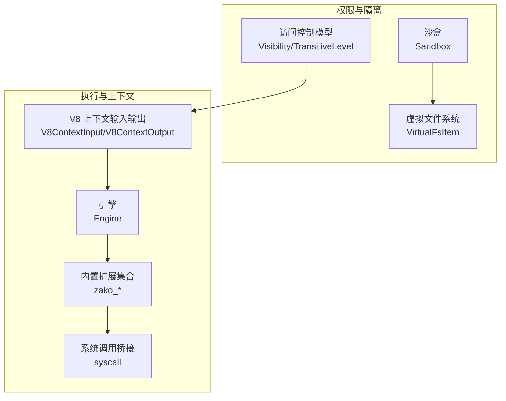
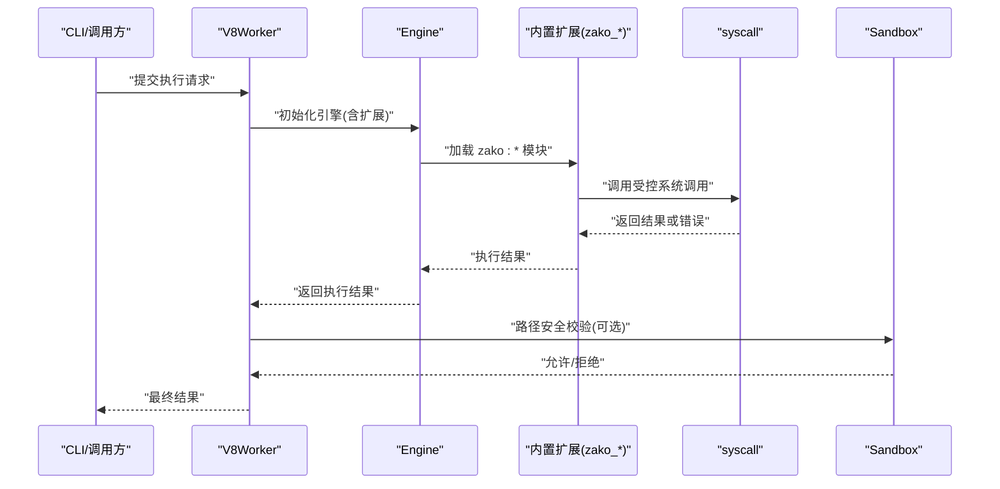
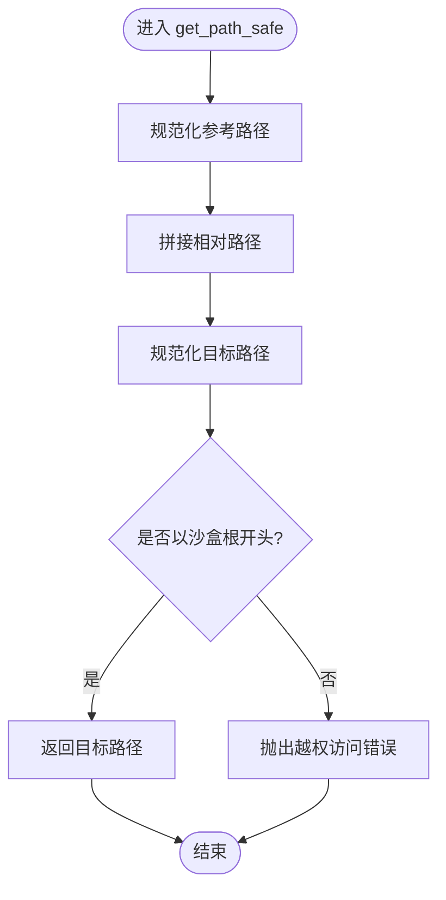
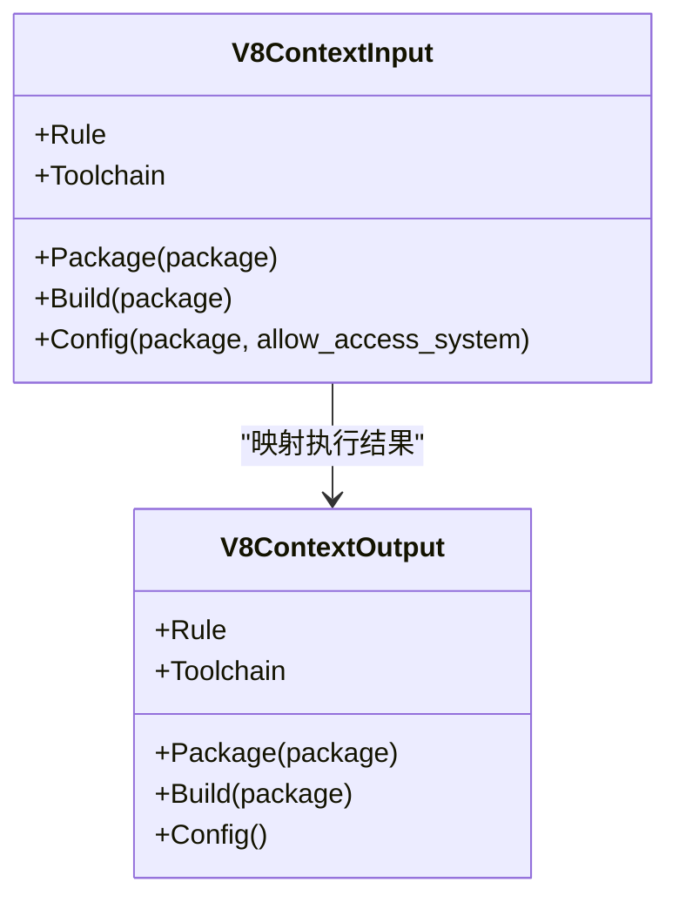
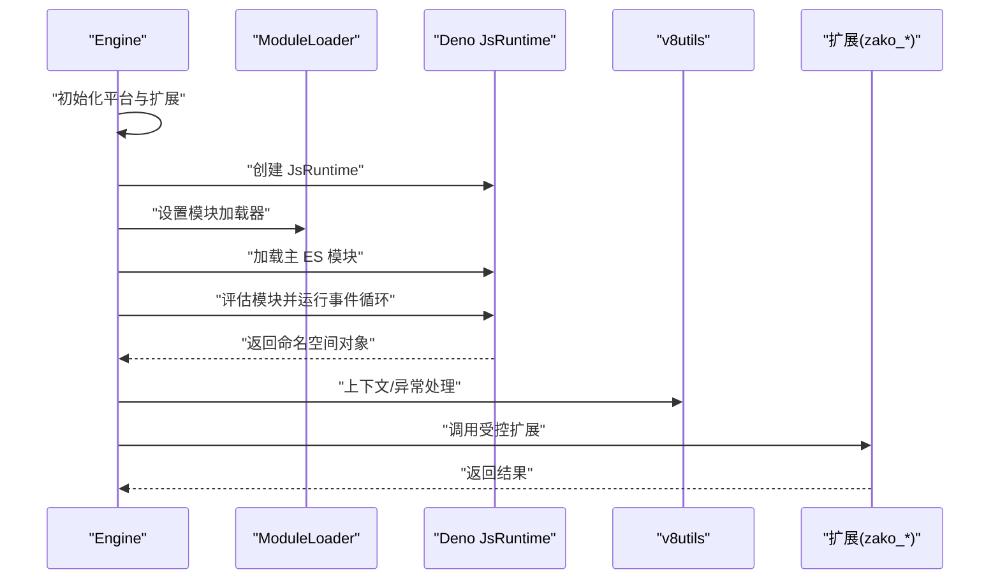
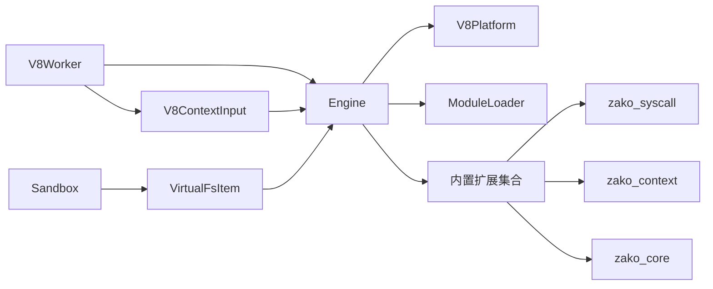

# 权限控制系统

<cite>
**本文引用的文件**
- [zako_core/src/sandbox.rs](file://zako_core/src/sandbox.rs)
- [zako_core/src/access_control.rs](file://zako_core/src/access_control.rs)
- [zako_core/src/v8context.rs](file://zako_core/src/v8context.rs)
- [zako_core/src/engine.rs](file://zako_core/src/engine.rs)
- [zako_core/src/builtin/extension/mod.rs](file://zako_core/src/builtin/extension/mod.rs)
- [zako_core/src/builtin/extension/context.rs](file://zako_core/src/builtin/extension/context.rs)
- [zako_core/src/builtin/extension/syscall.rs](file://zako_core/src/builtin/extension/syscall.rs)
- [zako_core/src/builtin/extension/core.rs](file://zako_core/src/builtin/extension/core.rs)
- [zako_core/src/v8utils.rs](file://zako_core/src/v8utils.rs)
- [zako_core/src/worker/v8worker.rs](file://zako_core/src/worker/v8worker.rs)
- [zako_core/src/fs.rs](file://zako_core/src/fs.rs)
- [zako_core/src/config_value.rs](file://zako_core/src/config_value.rs)
- [zako_core/bindings/config_operation.d.ts](file://zako_core/bindings/config_operation.d.ts)
- [zako_core/bindings/config_type.d.ts](file://zako_core/bindings/config_type.d.ts)
- [zako_core/bindings/config_value.d.ts](file://zako_core/bindings/config_value.d.ts)
</cite>

## 目录
1. [引言](#引言)
2. [项目结构](#项目结构)
3. [核心组件](#核心组件)
4. [架构总览](#架构总览)
5. [详细组件分析](#详细组件分析)
6. [依赖关系分析](#依赖关系分析)
7. [性能考虑](#性能考虑)
8. [故障排查指南](#故障排查指南)
9. [结论](#结论)
10. [附录](#附录)

## 引言
本文件面向安全工程师与系统管理员，系统化阐述 Zako 的权限控制系统：分层权限机制、沙盒执行、安全策略与最小权限原则；深入解析权限检查流程、访问控制列表、安全边界与隔离机制；给出权限配置示例、API 使用方法与安全最佳实践；说明与 V8 执行环境的集成方式与权限验证机制，并提供安全审计、日志记录与监控告警的实现建议，以及常见安全问题与权限冲突的处理思路。

## 项目结构
Zako 的权限控制由多层协作构成：
- 沙盒与文件系统边界：通过根路径约束与路径规范化，防止越权访问。
- 访问控制模型：以可见性与传递级别定义模块间权限边界。
- V8 执行上下文：按脚本类型（包、构建、规则、工具链、配置）分配不同能力集。
- 内置扩展：在 JS 层暴露受控能力，统一通过 syscall 日志与错误体系进行审计与告警。
- 引擎与工作池：负责加载模块、注入上下文、执行与异常捕获。

图表来源
- [zako_core/src/sandbox.rs](file://zako_core/src/sandbox.rs#L1-L82)
- [zako_core/src/fs.rs](file://zako_core/src/fs.rs#L1-L47)
- [zako_core/src/access_control.rs](file://zako_core/src/access_control.rs#L1-L19)
- [zako_core/src/v8context.rs](file://zako_core/src/v8context.rs#L1-L62)
- [zako_core/src/engine.rs](file://zako_core/src/engine.rs#L1-L306)
- [zako_core/src/builtin/extension/mod.rs](file://zako_core/src/builtin/extension/mod.rs#L1-L17)
- [zako_core/src/builtin/extension/syscall.rs](file://zako_core/src/builtin/extension/syscall.rs#L1-L62)

章节来源
- [zako_core/src/sandbox.rs](file://zako_core/src/sandbox.rs#L1-L82)
- [zako_core/src/access_control.rs](file://zako_core/src/access_control.rs#L1-L19)
- [zako_core/src/v8context.rs](file://zako_core/src/v8context.rs#L1-L62)
- [zako_core/src/engine.rs](file://zako_core/src/engine.rs#L1-L306)
- [zako_core/src/builtin/extension/mod.rs](file://zako_core/src/builtin/extension/mod.rs#L1-L17)

## 核心组件
- 沙盒（Sandbox）
  - 提供根目录约束与路径规范化校验，阻止越权访问。
  - 关键接口：新建沙盒、相对路径拼接与安全解析、是否在沙盒内判断。
- 虚拟文件系统（VirtualFsItem）
  - 定义文件、符号链接、空目录等虚拟条目，限制绝对路径、父路径穿越与非法符号链接目标。
- 访问控制模型（Visibility/TransitiveLevel）
  - Visibility 支持公开、私有与受限（白名单）三种模式。
  - TransitiveLevel 描述传递范围（接口、公开、私有），用于跨模块权限传播。
- V8 上下文（V8ContextInput/Output）
  - 区分包脚本、构建脚本、规则、工具链、配置等上下文类型，决定可用能力集。
- 引擎（Engine）
  - 初始化 V8 平台与内置扩展，加载模块、设置执行上下文、执行与异常捕获。
- 内置扩展（zako_*）
  - 提供核心能力入口，统一通过 syscall 在 JS 层与 Rust 层交互，便于审计与告警。
- 工作池与 V8Worker
  - 将上下文信息注入到引擎初始化流程，建立隔离的执行环境。

章节来源
- [zako_core/src/sandbox.rs](file://zako_core/src/sandbox.rs#L1-L82)
- [zako_core/src/fs.rs](file://zako_core/src/fs.rs#L1-L47)
- [zako_core/src/access_control.rs](file://zako_core/src/access_control.rs#L1-L19)
- [zako_core/src/v8context.rs](file://zako_core/src/v8context.rs#L1-L62)
- [zako_core/src/engine.rs](file://zako_core/src/engine.rs#L1-L306)
- [zako_core/src/builtin/extension/mod.rs](file://zako_core/src/builtin/extension/mod.rs#L1-L17)
- [zako_core/src/builtin/extension/context.rs](file://zako_core/src/builtin/extension/context.rs#L1-L41)
- [zako_core/src/builtin/extension/syscall.rs](file://zako_core/src/builtin/extension/syscall.rs#L1-L62)
- [zako_core/src/builtin/extension/core.rs](file://zako_core/src/builtin/extension/core.rs#L1-L8)
- [zako_core/src/worker/v8worker.rs](file://zako_core/src/worker/v8worker.rs#L91-L125)

## 架构总览
Zako 的权限控制采用“分层 + 沙盒 + 受控扩展”的设计：
- 最小权限原则：按上下文类型裁剪能力，仅暴露必要 API。
- 安全边界：沙盒路径校验与虚拟文件系统约束，阻断路径穿越与越权访问。
- 隔离机制：每个执行单元拥有独立 V8 上下文与引擎实例，避免状态泄漏。
- 审计与告警：通过 syscall 日志与错误体系统一采集运行时事件。

图表来源
- [zako_core/src/worker/v8worker.rs](file://zako_core/src/worker/v8worker.rs#L91-L125)
- [zako_core/src/engine.rs](file://zako_core/src/engine.rs#L48-L79)
- [zako_core/src/builtin/extension/mod.rs](file://zako_core/src/builtin/extension/mod.rs#L1-L17)
- [zako_core/src/builtin/extension/syscall.rs](file://zako_core/src/builtin/extension/syscall.rs#L18-L62)
- [zako_core/src/sandbox.rs](file://zako_core/src/sandbox.rs#L34-L54)

## 详细组件分析

### 沙盒与路径安全
- 设计要点
  - 以规范化的根路径作为安全边界，所有相对路径拼接后必须仍位于根内。
  - 对外部输入进行路径规范化与父路径穿越检测，拒绝绝对路径与非法符号链接目标。
- 关键流程
  - 新建沙盒：将传入路径标准化为绝对路径作为根。
  - 安全拼接：将参考路径与相对路径合并后规范化，再判断是否仍在根内。
  - 越权访问拦截：一旦发现目标路径超出根，抛出明确错误，便于审计与告警。
- 复杂度
  - 单次校验为 O(1) 规范化与 O(n) 前缀比较，n 为路径层级数。
- 错误处理
  - 明确区分 IO 错误与越权访问错误，便于上层区分处理策略。

图表来源
- [zako_core/src/sandbox.rs](file://zako_core/src/sandbox.rs#L34-L54)

章节来源
- [zako_core/src/sandbox.rs](file://zako_core/src/sandbox.rs#L1-L82)
- [zako_core/src/fs.rs](file://zako_core/src/fs.rs#L1-L47)

### 访问控制模型（Visibility 与 TransitiveLevel）
- Visibility
  - 公开：任何模块均可访问。
  - 私有：仅当前包内可访问。
  - 受限：仅白名单中的包可访问。
- TransitiveLevel
  - 接口：仅作为依赖接口可见，不参与传递。
  - 公开：可被任意下游包访问。
  - 私有：仅限当前包内部传递。
- 应用场景
  - 通过 Visibility 控制模块对外暴露面；通过 TransitiveLevel 控制依赖传递范围，降低耦合与攻击面。
- 配置示例（概念性说明）
  - 将某模块设为私有，仅当前包使用；或将某接口设为公开，允许下游包直接依赖。

章节来源
- [zako_core/src/access_control.rs](file://zako_core/src/access_control.rs#L1-L19)

### V8 上下文与最小权限原则
- 上下文类型
  - 包脚本：启用包级能力，如读取包元数据、执行包任务。
  - 构建脚本：启用构建流程能力，如编译、打包。
  - 规则：启用规则定义能力，如自定义构建规则。
  - 工具链：启用工具链注册与选择能力。
  - 配置：启用配置读写能力，可选择是否允许访问系统资源。
- 最小权限原则
  - 仅在必要时开启高权限能力；默认关闭高风险操作。
  - 通过上下文类型与扩展组合，精确裁剪可用 API。

图表来源
- [zako_core/src/v8context.rs](file://zako_core/src/v8context.rs#L13-L61)

章节来源
- [zako_core/src/v8context.rs](file://zako_core/src/v8context.rs#L1-L62)

### 引擎与内置扩展（受控能力）
- 引擎初始化
  - 注入平台、模块加载器与内置扩展集合。
  - 统一通过 v8utils 的上下文与 TryCatch 辅助函数，保证异常捕获与上下文一致性。
- 内置扩展
  - zako_rt、zako_syscall、zako_global、zako_semver、zako_core、zako_console 等。
  - syscall 提供受控日志与版本查询，便于审计与告警。
- 执行流程
  - 加载主模块、评估模块、运行事件循环、获取命名空间对象。
  - 在执行前后统一进行上下文与异常处理，确保安全性与可观测性。

图表来源
- [zako_core/src/engine.rs](file://zako_core/src/engine.rs#L48-L79)
- [zako_core/src/engine.rs](file://zako_core/src/engine.rs#L81-L109)
- [zako_core/src/engine.rs](file://zako_core/src/engine.rs#L168-L232)
- [zako_core/src/v8utils.rs](file://zako_core/src/v8utils.rs#L92-L133)
- [zako_core/src/builtin/extension/mod.rs](file://zako_core/src/builtin/extension/mod.rs#L1-L17)

章节来源
- [zako_core/src/engine.rs](file://zako_core/src/engine.rs#L1-L306)
- [zako_core/src/v8utils.rs](file://zako_core/src/v8utils.rs#L92-L133)
- [zako_core/src/builtin/extension/mod.rs](file://zako_core/src/builtin/extension/mod.rs#L1-L17)
- [zako_core/src/builtin/extension/context.rs](file://zako_core/src/builtin/extension/context.rs#L1-L41)
- [zako_core/src/builtin/extension/syscall.rs](file://zako_core/src/builtin/extension/syscall.rs#L1-L62)
- [zako_core/src/builtin/extension/core.rs](file://zako_core/src/builtin/extension/core.rs#L1-L8)

### 工作池与 V8Worker（隔离执行）
- 初始化流程
  - 根据上下文类型构造扩展与加载器选项，创建引擎实例。
  - 获取运行时上下文与 isolate，为后续执行做准备。
- 隔离机制
  - 每个任务拥有独立引擎与上下文，避免状态共享导致的越权与竞态。
  - 结合沙盒与访问控制，形成多层防护。

章节来源
- [zako_core/src/worker/v8worker.rs](file://zako_core/src/worker/v8worker.rs#L91-L125)

### 配置与类型绑定（安全配置）
- 配置类型
  - ConfigType：标签、布尔、数字、字符串。
  - ResolvedConfigValue：解析后的配置值类型。
  - ConfigOperation：继承表达式与可选动作，支持安全的配置继承与覆盖。
- 类型绑定
  - 自动生成 TypeScript 类型声明，便于前端与工具链一致校验。
- 安全建议
  - 对外部输入进行严格类型校验与范围检查。
  - 使用继承表达式时，限定允许的继承源与动作，避免未授权变更。

章节来源
- [zako_core/src/config_value.rs](file://zako_core/src/config_value.rs#L84-L146)
- [zako_core/bindings/config_operation.d.ts](file://zako_core/bindings/config_operation.d.ts#L1-L6)
- [zako_core/bindings/config_type.d.ts](file://zako_core/bindings/config_type.d.ts#L1-L5)
- [zako_core/bindings/config_value.d.ts](file://zako_core/bindings/config_value.d.ts#L1-L5)

## 依赖关系分析
- 组件耦合
  - 引擎依赖 V8 平台、模块加载器与内置扩展；扩展之间通过 OpState 共享上下文信息。
  - 沙盒与文件系统为底层基础设施，被上层执行与模块加载流程间接依赖。
- 依赖图

图表来源
- [zako_core/src/engine.rs](file://zako_core/src/engine.rs#L48-L79)
- [zako_core/src/builtin/extension/mod.rs](file://zako_core/src/builtin/extension/mod.rs#L1-L17)
- [zako_core/src/builtin/extension/syscall.rs](file://zako_core/src/builtin/extension/syscall.rs#L18-L25)
- [zako_core/src/builtin/extension/context.rs](file://zako_core/src/builtin/extension/context.rs#L19-L31)
- [zako_core/src/builtin/extension/core.rs](file://zako_core/src/builtin/extension/core.rs#L1-L8)
- [zako_core/src/worker/v8worker.rs](file://zako_core/src/worker/v8worker.rs#L91-L125)
- [zako_core/src/sandbox.rs](file://zako_core/src/sandbox.rs#L1-L82)
- [zako_core/src/fs.rs](file://zako_core/src/fs.rs#L1-L47)
- [zako_core/src/v8context.rs](file://zako_core/src/v8context.rs#L13-L37)

章节来源
- [zako_core/src/engine.rs](file://zako_core/src/engine.rs#L1-L306)
- [zako_core/src/builtin/extension/mod.rs](file://zako_core/src/builtin/extension/mod.rs#L1-L17)
- [zako_core/src/worker/v8worker.rs](file://zako_core/src/worker/v8worker.rs#L91-L125)
- [zako_core/src/sandbox.rs](file://zako_core/src/sandbox.rs#L1-L82)
- [zako_core/src/fs.rs](file://zako_core/src/fs.rs#L1-L47)
- [zako_core/src/v8context.rs](file://zako_core/src/v8context.rs#L1-L62)

## 性能考虑
- 沙盒路径校验
  - 规范化与前缀匹配为轻量操作，建议在高频路径访问处缓存规范化结果，减少重复计算。
- 引擎与事件循环
  - 合理复用引擎实例与上下文，避免频繁创建销毁带来的开销。
  - 对长耗时任务采用异步执行与超时控制，防止阻塞事件循环。
- 日志与审计
  - 将日志级别与采样策略结合，避免高吞吐场景下的 I/O 抖动。
  - 使用结构化日志，便于后续聚合与检索。

## 故障排查指南
- 路径越权访问
  - 现象：抛出越权访问错误。
  - 排查：确认目标路径是否在沙盒根内；检查相对路径拼接是否引入父路径。
  - 参考：沙盒安全拼接与规范化逻辑。
- 模块加载失败
  - 现象：模块加载或评估阶段抛出异常。
  - 排查：检查模块加载器配置、扩展依赖与上下文类型；查看 v8utils 的异常捕获与转换。
- 权限不足
  - 现象：调用受控扩展时报错或被拒绝。
  - 排查：核对 V8 上下文类型与扩展启用情况；确认配置中是否允许访问系统资源。
- 日志与审计
  - 现象：缺少运行时事件记录。
  - 排查：检查 syscall 日志级别与输出通道；确保扩展已正确初始化。

章节来源
- [zako_core/src/sandbox.rs](file://zako_core/src/sandbox.rs#L19-L25)
- [zako_core/src/engine.rs](file://zako_core/src/engine.rs#L168-L232)
- [zako_core/src/v8utils.rs](file://zako_core/src/v8utils.rs#L116-L133)
- [zako_core/src/builtin/extension/syscall.rs](file://zako_core/src/builtin/extension/syscall.rs#L33-L61)

## 结论
Zako 的权限控制系统通过“分层权限 + 沙盒边界 + 受控扩展 + 统一日志”的组合，实现了最小权限原则与强隔离的执行环境。配合访问控制模型与严格的路径安全校验，能够有效降低攻击面并提升系统的可审计性与可维护性。建议在生产环境中结合配置校验、日志采样与监控告警，持续优化权限策略与性能表现。

## 附录

### 权限配置示例（概念性说明）
- 将模块设为私有，仅当前包使用。
- 将接口设为公开，允许下游包直接依赖。
- 为特定模块设置受限可见性，仅允许白名单中的包访问。
- 在配置中使用继承表达式，限定允许的继承源与动作。

章节来源
- [zako_core/src/access_control.rs](file://zako_core/src/access_control.rs#L1-L19)
- [zako_core/src/config_value.rs](file://zako_core/src/config_value.rs#L84-L146)
- [zako_core/bindings/config_operation.d.ts](file://zako_core/bindings/config_operation.d.ts#L1-L6)
- [zako_core/bindings/config_type.d.ts](file://zako_core/bindings/config_type.d.ts#L1-L5)
- [zako_core/bindings/config_value.d.ts](file://zako_core/bindings/config_value.d.ts#L1-L5)

### API 使用方法（概念性说明）
- 初始化引擎并加载模块：通过引擎提供的加载与评估接口完成。
- 设置执行上下文：在执行前向全局注入执行上下文对象。
- 调用受控扩展：通过 zako:* 命名空间访问受控能力。
- 处理异常：使用 v8utils 的上下文与 TryCatch 辅助函数统一捕获与转换异常。

章节来源
- [zako_core/src/engine.rs](file://zako_core/src/engine.rs#L81-L109)
- [zako_core/src/engine.rs](file://zako_core/src/engine.rs#L111-L166)
- [zako_core/src/engine.rs](file://zako_core/src/engine.rs#L168-L232)
- [zako_core/src/v8utils.rs](file://zako_core/src/v8utils.rs#L92-L133)
- [zako_core/src/builtin/extension/mod.rs](file://zako_core/src/builtin/extension/mod.rs#L1-L17)

### 安全最佳实践
- 最小权限：默认关闭高风险能力，仅在需要时开启。
- 严格路径校验：所有外部输入均需经过沙盒与文件系统约束。
- 统一日志与审计：通过 syscall 输出结构化日志，便于追踪与告警。
- 配置校验：对配置类型与继承表达式进行严格校验与范围检查。
- 监控告警：基于日志与指标建立告警策略，及时发现异常行为。