# 沙盒执行环境

<cite>
**本文引用的文件**
- [zako_core/src/sandbox.rs](file://zako_core/src/sandbox.rs)
- [zako_core/src/v8context.rs](file://zako_core/src/v8context.rs)
- [zako_core/src/engine.rs](file://zako_core/src/engine.rs)
- [zako_core/src/context.rs](file://zako_core/src/context.rs)
- [zako_core/src/builtin/extension/global.rs](file://zako_core/src/builtin/extension/global.rs)
- [zako_core/src/builtin/extension/syscall.rs](file://zako_core/src/builtin/extension/syscall.rs)
- [zako_core/src/builtin/extension/console.rs](file://zako_core/src/builtin/extension/console.rs)
- [zako_core/src/builtin/extension/core.rs](file://zako_core/src/builtin/extension/core.rs)
- [zako_core/src/builtin/extension/rt.rs](file://zako_core/src/builtin/extension/rt.rs)
- [zako_core/src/module_loader/mod.rs](file://zako_core/src/module_loader/mod.rs)
- [zako_core/src/fs.rs](file://zako_core/src/fs.rs)
- [zako_core/src/access_control.rs](file://zako_core/src/access_control.rs)
- [zako_core/src/resource/mod.rs](file://zako_core/src/resource/mod.rs)
</cite>

## 目录
1. [引言](#引言)
2. [项目结构](#项目结构)
3. [核心组件](#核心组件)
4. [架构总览](#架构总览)
5. [详细组件分析](#详细组件分析)
6. [依赖关系分析](#依赖关系分析)
7. [性能与资源控制](#性能与资源控制)
8. [安全与权限控制](#安全与权限控制)
9. [调试与监控](#调试与监控)
10. [故障排除指南](#故障排除指南)
11. [结论](#结论)

## 引言
本文件面向Zako的沙盒执行环境，系统性阐述其设计原理、隔离策略与安全边界。重点覆盖以下方面：
- V8上下文类型与隔离能力
- 文件系统与路径访问的沙箱边界
- 权限控制与API访问限制
- 系统调用拦截与日志通道
- 配置参数、性能影响与安全考量
- 调试方法、监控指标与故障排除
- 在沙盒中安全执行用户代码与第三方脚本的实践建议

## 项目结构
围绕“沙盒执行”的关键代码主要分布在以下模块：
- 沙箱与路径校验：zako_core/src/sandbox.rs、zako_core/src/fs.rs
- V8引擎与上下文：zako_core/src/engine.rs、zako_core/src/v8context.rs
- 内置扩展与全局API裁剪：zako_core/src/builtin/extension/*
- 模块加载与导入解析：zako_core/src/module_loader/mod.rs
- 上下文与运行时环境：zako_core/src/context.rs
- 资源池与配额：zako_core/src/resource/mod.rs
- 访问控制模型：zako_core/src/access_control.rs

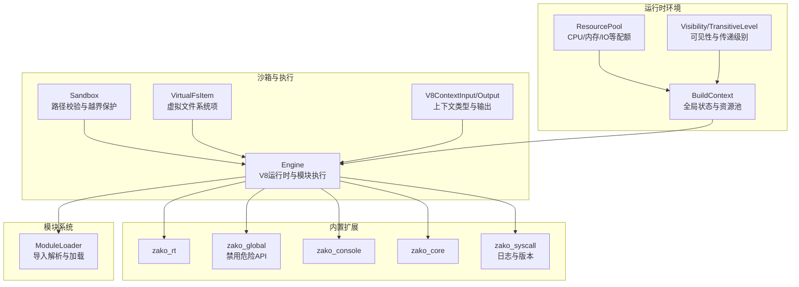

图表来源
- [zako_core/src/sandbox.rs](file://zako_core/src/sandbox.rs#L1-L82)
- [zako_core/src/fs.rs](file://zako_core/src/fs.rs#L1-L115)
- [zako_core/src/engine.rs](file://zako_core/src/engine.rs#L1-L306)
- [zako_core/src/v8context.rs](file://zako_core/src/v8context.rs#L1-L62)
- [zako_core/src/builtin/extension/global.rs](file://zako_core/src/builtin/extension/global.rs#L1-L40)
- [zako_core/src/builtin/extension/syscall.rs](file://zako_core/src/builtin/extension/syscall.rs#L1-L62)
- [zako_core/src/builtin/extension/console.rs](file://zako_core/src/builtin/extension/console.rs#L1-L8)
- [zako_core/src/builtin/extension/core.rs](file://zako_core/src/builtin/extension/core.rs#L1-L8)
- [zako_core/src/builtin/extension/rt.rs](file://zako_core/src/builtin/extension/rt.rs#L1-L7)
- [zako_core/src/module_loader/mod.rs](file://zako_core/src/module_loader/mod.rs#L1-L228)
- [zako_core/src/context.rs](file://zako_core/src/context.rs#L1-L229)
- [zako_core/src/resource/mod.rs](file://zako_core/src/resource/mod.rs#L1-L177)
- [zako_core/src/access_control.rs](file://zako_core/src/access_control.rs#L1-L19)

章节来源
- [zako_core/src/sandbox.rs](file://zako_core/src/sandbox.rs#L1-L82)
- [zako_core/src/fs.rs](file://zako_core/src/fs.rs#L1-L115)
- [zako_core/src/engine.rs](file://zako_core/src/engine.rs#L1-L306)
- [zako_core/src/v8context.rs](file://zako_core/src/v8context.rs#L1-L62)
- [zako_core/src/builtin/extension/global.rs](file://zako_core/src/builtin/extension/global.rs#L1-L40)
- [zako_core/src/builtin/extension/syscall.rs](file://zako_core/src/builtin/extension/syscall.rs#L1-L62)
- [zako_core/src/builtin/extension/console.rs](file://zako_core/src/builtin/extension/console.rs#L1-L8)
- [zako_core/src/builtin/extension/core.rs](file://zako_core/src/builtin/extension/core.rs#L1-L8)
- [zako_core/src/builtin/extension/rt.rs](file://zako_core/src/builtin/extension/rt.rs#L1-L7)
- [zako_core/src/module_loader/mod.rs](file://zako_core/src/module_loader/mod.rs#L1-L228)
- [zako_core/src/context.rs](file://zako_core/src/context.rs#L1-L229)
- [zako_core/src/resource/mod.rs](file://zako_core/src/resource/mod.rs#L1-L177)
- [zako_core/src/access_control.rs](file://zako_core/src/access_control.rs#L1-L19)

## 核心组件
- 沙箱（Sandbox）：通过根目录与规范化路径校验，确保对目标路径的访问不越出沙箱范围；提供安全拼接与越界检测。
- 虚拟文件系统项（VirtualFsItem）：封装文件、符号链接与空目录，提供路径合法性与安全性检查，防止越界与绝对路径注入。
- V8上下文类型（V8ContextInput/Output）：定义不同脚本场景下的上下文能力边界，如包脚本、构建脚本、规则、工具链与配置。
- 引擎（Engine）：基于Deno Core/JSRuntime初始化V8平台与扩展，支持模块加载、事件循环与异常捕获。
- 内置扩展：rt、global、console、core、syscall等，分别负责运行时设置、全局API裁剪、控制台、核心API与系统调用桥接。
- 模块加载器（ModuleLoader）：统一解析与加载模块，支持Builtin/File/Memory三类模块类型约束与异步加载。
- 运行时上下文（BuildContext）：承载项目根、入口名、包来源与全局状态（Tokio句柄、CAS存储、工作池、资源池等）。
- 资源池（ResourcePool）：抽象CPU、内存、磁盘IO、网络、GPU等资源请求与分配，支持容量增长与排队通知。
- 访问控制（Visibility/TransitiveLevel）：定义可见性与传递级别，用于包与规则的权限模型。

章节来源
- [zako_core/src/sandbox.rs](file://zako_core/src/sandbox.rs#L1-L82)
- [zako_core/src/fs.rs](file://zako_core/src/fs.rs#L1-L115)
- [zako_core/src/v8context.rs](file://zako_core/src/v8context.rs#L1-L62)
- [zako_core/src/engine.rs](file://zako_core/src/engine.rs#L1-L306)
- [zako_core/src/builtin/extension/global.rs](file://zako_core/src/builtin/extension/global.rs#L1-L40)
- [zako_core/src/builtin/extension/syscall.rs](file://zako_core/src/builtin/extension/syscall.rs#L1-L62)
- [zako_core/src/module_loader/mod.rs](file://zako_core/src/module_loader/mod.rs#L1-L228)
- [zako_core/src/context.rs](file://zako_core/src/context.rs#L1-L229)
- [zako_core/src/resource/mod.rs](file://zako_core/src/resource/mod.rs#L1-L177)
- [zako_core/src/access_control.rs](file://zako_core/src/access_control.rs#L1-L19)

## 架构总览
下图展示了从“模块加载”到“V8执行”的端到端流程，以及内置扩展与全局API裁剪如何共同构成沙盒边界。

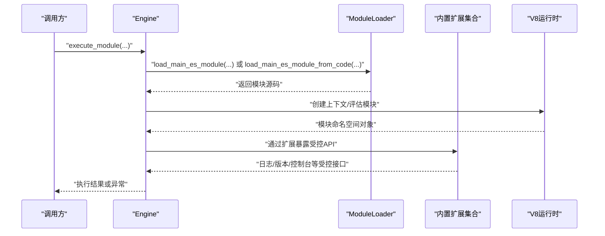

图表来源
- [zako_core/src/engine.rs](file://zako_core/src/engine.rs#L81-L166)
- [zako_core/src/module_loader/mod.rs](file://zako_core/src/module_loader/mod.rs#L152-L219)
- [zako_core/src/builtin/extension/syscall.rs](file://zako_core/src/builtin/extension/syscall.rs#L18-L62)
- [zako_core/src/builtin/extension/console.rs](file://zako_core/src/builtin/extension/console.rs#L1-L8)
- [zako_core/src/builtin/extension/global.rs](file://zako_core/src/builtin/extension/global.rs#L1-L40)

## 详细组件分析

### 沙箱与路径隔离（Sandbox）
- 设计要点
  - 使用规范化路径与根目录前缀判断，拒绝越界访问。
  - 提供“相对拼接+校验”与“直接校验”两类接口，保证路径安全。
- 关键行为
  - 新建沙箱时对根路径进行规范化。
  - get_path_safe/referencer+target 组合后规范化并校验。
  - join_path_for 将相对路径与根合并后规范化并校验。
  - is_in_sandbox 基于规范化路径判断是否在沙箱内。
- 错误处理
  - 越界访问返回专用错误类型，便于上层定位问题。

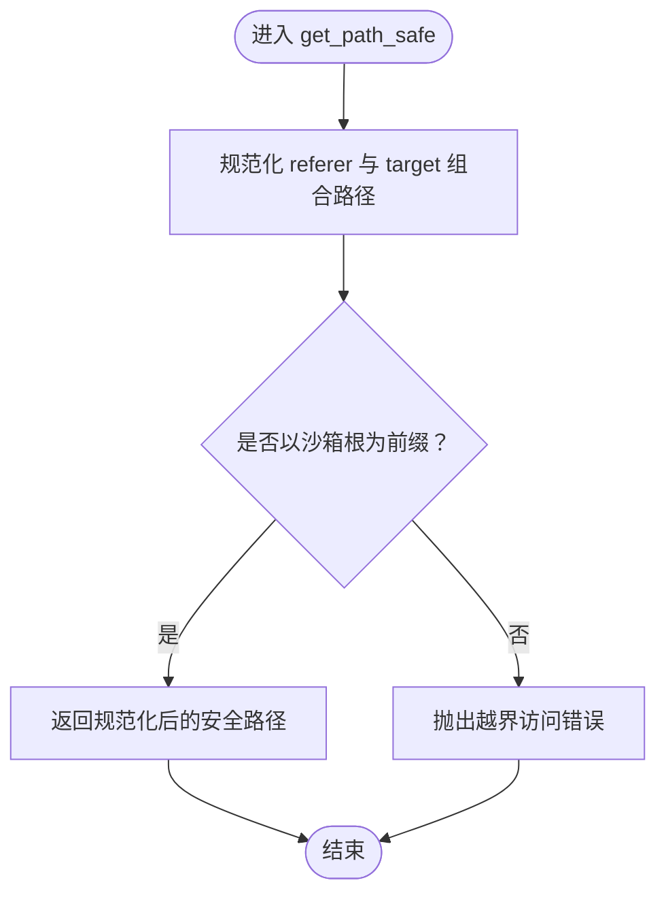

图表来源
- [zako_core/src/sandbox.rs](file://zako_core/src/sandbox.rs#L34-L54)

章节来源
- [zako_core/src/sandbox.rs](file://zako_core/src/sandbox.rs#L1-L82)

### 虚拟文件系统与符号链接安全（VirtualFsItem）
- 设计要点
  - 对符号链接目标进行“相对路径+组合后校验”，禁止越界与绝对路径。
  - 统一抽象文件、符号链接与空目录，便于后续校验与传输。
- 关键行为
  - 创建时若目标指向父目录或非规范化路径则报错。
  - 支持从协议缓冲结构转换为内部表示，并进行校验。
- 安全边界
  - 明确禁止绝对链接目标与越界链接，避免逃逸至沙箱外。

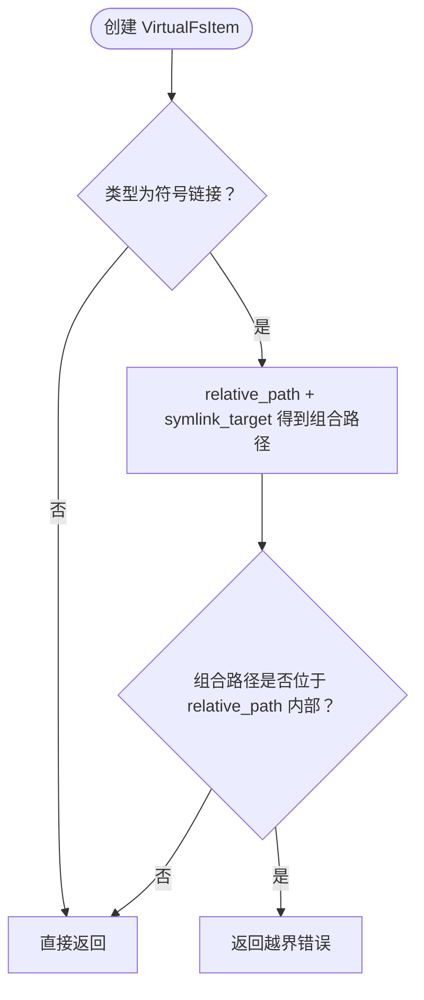

图表来源
- [zako_core/src/fs.rs](file://zako_core/src/fs.rs#L49-L70)

章节来源
- [zako_core/src/fs.rs](file://zako_core/src/fs.rs#L1-L115)

### V8上下文类型与隔离策略（V8ContextInput/Output）
- 设计要点
  - 不同上下文类型赋予不同能力：包脚本、构建脚本、规则、工具链、配置。
  - 配置上下文可选择是否允许访问系统API。
- 隔离策略
  - 通过上下文类型限定可用API面，避免越权操作。
  - 输出类型用于约束模块导出内容，减少对外泄露。

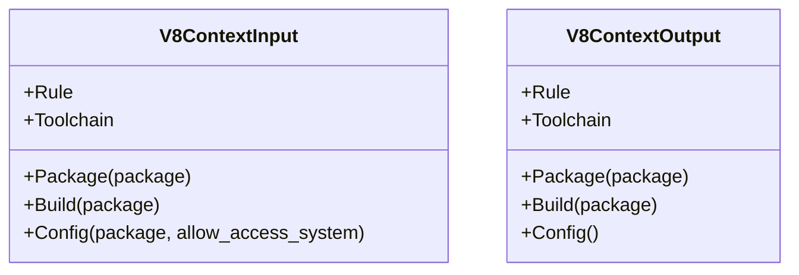

图表来源
- [zako_core/src/v8context.rs](file://zako_core/src/v8context.rs#L12-L61)

章节来源
- [zako_core/src/v8context.rs](file://zako_core/src/v8context.rs#L1-L62)

### 引擎与模块执行（Engine）
- 初始化
  - 初始化V8平台，注册内置扩展（rt、syscall、global、semver、core、console）。
  - 构造JsRuntime并持有其句柄，用于后续模块加载与执行。
- 执行流程
  - 加载主ES模块（可来自文件或代码），评估模块并运行事件循环。
  - 支持设置全局执行上下文（executionContext），便于脚本侧读取。
  - 提供“执行后回调”模式，允许在V8作用域内安全地读取模块导出并处理异常。
- 错误处理
  - 将V8异常转换为统一错误类型，便于上层捕获与记录。

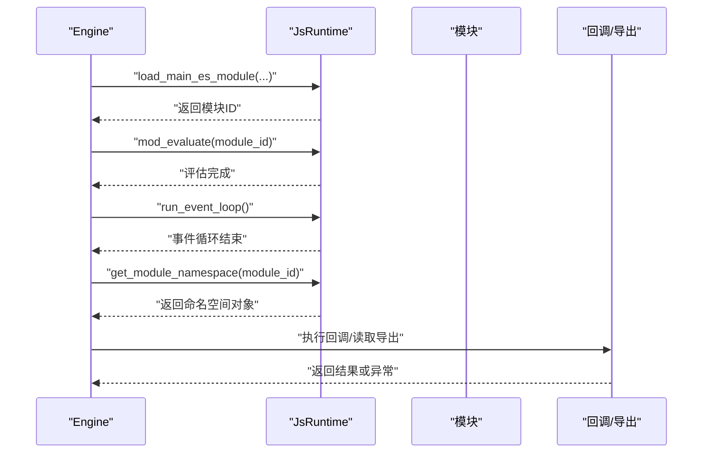

图表来源
- [zako_core/src/engine.rs](file://zako_core/src/engine.rs#L81-L166)
- [zako_core/src/engine.rs](file://zako_core/src/engine.rs#L168-L300)

章节来源
- [zako_core/src/engine.rs](file://zako_core/src/engine.rs#L1-L306)

### 内置扩展与全局API裁剪（zako_global）
- 设计要点
  - 在V8全局模板层面移除高风险API（如Date、Intl、performance、定时器、Crypto、共享内存等）。
- 隔离效果
  - 降低脚本侧进行时间侧信道、加密操作与跨线程共享内存的风险。
- 与其他扩展的关系
  - 作为基础扩展被rt、console、core、syscall等依赖，形成统一的受限运行时。

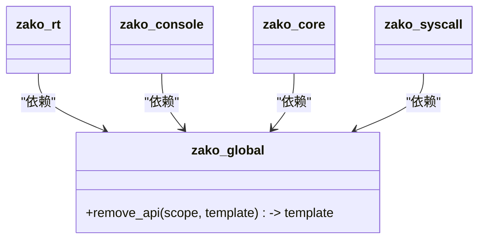

图表来源
- [zako_core/src/builtin/extension/global.rs](file://zako_core/src/builtin/extension/global.rs#L1-L40)
- [zako_core/src/builtin/extension/rt.rs](file://zako_core/src/builtin/extension/rt.rs#L1-L7)
- [zako_core/src/builtin/extension/console.rs](file://zako_core/src/builtin/extension/console.rs#L1-L8)
- [zako_core/src/builtin/extension/core.rs](file://zako_core/src/builtin/extension/core.rs#L1-L8)
- [zako_core/src/builtin/extension/syscall.rs](file://zako_core/src/builtin/extension/syscall.rs#L1-L62)

章节来源
- [zako_core/src/builtin/extension/global.rs](file://zako_core/src/builtin/extension/global.rs#L1-L40)
- [zako_core/src/builtin/extension/rt.rs](file://zako_core/src/builtin/extension/rt.rs#L1-L7)
- [zako_core/src/builtin/extension/console.rs](file://zako_core/src/builtin/extension/console.rs#L1-L8)
- [zako_core/src/builtin/extension/core.rs](file://zako_core/src/builtin/extension/core.rs#L1-L8)
- [zako_core/src/builtin/extension/syscall.rs](file://zako_core/src/builtin/extension/syscall.rs#L1-L62)

### 模块加载与导入解析（ModuleLoader）
- 设计要点
  - 统一解析模块引用，支持File/Builtin/Memory三类模块类型。
  - 对不同类型之间的导入进行严格约束，避免越界或非法组合。
  - 异步加载：通过通道向外部请求源码，再包装为ModuleSource返回。
- 安全边界
  - 仅支持file:// URL的本地文件模块加载，避免远程直连。
  - 严格限制Builtin模块只能导入Builtin模块，防止逃逸。

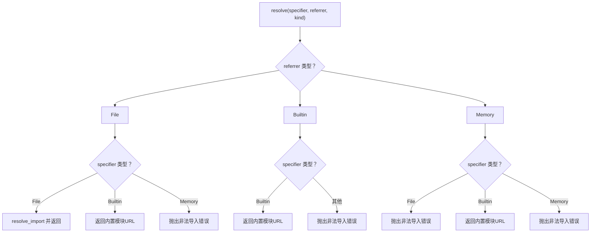

图表来源
- [zako_core/src/module_loader/mod.rs](file://zako_core/src/module_loader/mod.rs#L86-L150)

章节来源
- [zako_core/src/module_loader/mod.rs](file://zako_core/src/module_loader/mod.rs#L1-L228)

### 运行时上下文与全局状态（BuildContext）
- 设计要点
  - 保存项目根、入口名、包来源与全局状态（Tokio句柄、CAS存储、工作池、资源池等）。
  - 提供获取句柄与资源池的方法，便于在执行过程中按需使用。
- 与沙盒的关系
  - 通过BuildContext携带的资源池与工作池，间接影响执行过程中的资源占用与并发度。

章节来源
- [zako_core/src/context.rs](file://zako_core/src/context.rs#L1-L229)

## 依赖关系分析
- 组件耦合
  - Engine依赖ModuleLoader、内置扩展与V8平台；通过扩展实现API裁剪与受控系统交互。
  - Sandbox与VirtualFsItem在文件访问层面提供强约束，贯穿执行前与执行中。
  - BuildContext为执行提供全局状态与资源池，间接影响执行的资源配额。
- 外部依赖
  - V8/Deno Core用于JS运行时与模块系统。
  - Tokio用于异步执行与事件循环。
  - tracing用于日志与可观测性。

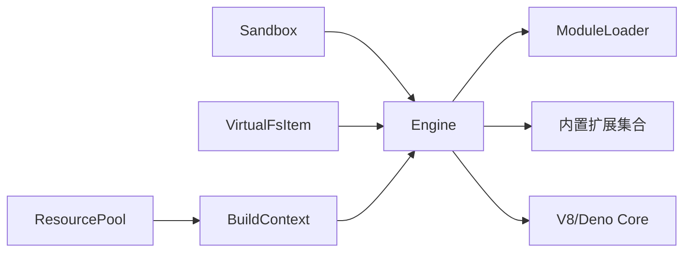

图表来源
- [zako_core/src/engine.rs](file://zako_core/src/engine.rs#L48-L79)
- [zako_core/src/module_loader/mod.rs](file://zako_core/src/module_loader/mod.rs#L60-L84)
- [zako_core/src/sandbox.rs](file://zako_core/src/sandbox.rs#L27-L32)
- [zako_core/src/fs.rs](file://zako_core/src/fs.rs#L49-L70)
- [zako_core/src/context.rs](file://zako_core/src/context.rs#L136-L176)
- [zako_core/src/resource/mod.rs](file://zako_core/src/resource/mod.rs#L106-L135)

章节来源
- [zako_core/src/engine.rs](file://zako_core/src/engine.rs#L1-L306)
- [zako_core/src/module_loader/mod.rs](file://zako_core/src/module_loader/mod.rs#L1-L228)
- [zako_core/src/sandbox.rs](file://zako_core/src/sandbox.rs#L1-L82)
- [zako_core/src/fs.rs](file://zako_core/src/fs.rs#L1-L115)
- [zako_core/src/context.rs](file://zako_core/src/context.rs#L1-L229)
- [zako_core/src/resource/mod.rs](file://zako_core/src/resource/mod.rs#L1-L177)

## 性能与资源控制
- 资源池（ResourcePool）
  - 支持CPU、内存、磁盘IO、网络、GPU及其他自定义资源的容量设定与请求队列。
  - 提供make_sure_capacity以确保容量满足请求，notify实现请求满足后的唤醒逻辑。
  - 当前实现未启用优先级调度与更优任务调度，存在优化空间。
- 与执行的关系
  - BuildContext持有ResourcePool引用，可在执行阶段根据需要发起资源请求与等待。
  - 引擎本身不直接管理资源配额，但可通过上下文与扩展配合实现更细粒度的资源控制。

章节来源
- [zako_core/src/resource/mod.rs](file://zako_core/src/resource/mod.rs#L1-L177)
- [zako_core/src/context.rs](file://zako_core/src/context.rs#L126-L176)

## 安全与权限控制
- 全局API裁剪（zako_global）
  - 移除高风险API，降低侧信道与跨线程共享内存风险。
- 模块类型约束（ModuleLoader）
  - File/Builtin/Memory三类模块的导入约束，防止越界与非法组合。
- 沙箱与虚拟文件系统
  - 路径规范化与越界检查，符号链接绝对路径与越界链接的禁止。
- 访问控制模型（Visibility/TransitiveLevel）
  - 通过可见性与传递级别定义包与规则的权限边界，辅助在更高层进行权限判定。

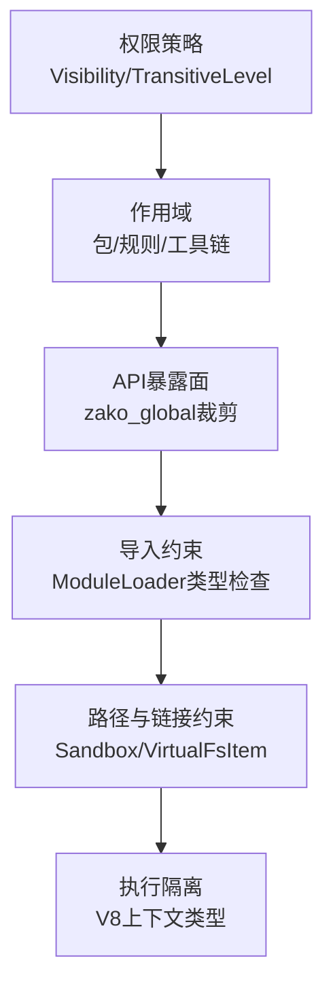

图表来源
- [zako_core/src/access_control.rs](file://zako_core/src/access_control.rs#L1-L19)
- [zako_core/src/builtin/extension/global.rs](file://zako_core/src/builtin/extension/global.rs#L12-L39)
- [zako_core/src/module_loader/mod.rs](file://zako_core/src/module_loader/mod.rs#L106-L150)
- [zako_core/src/sandbox.rs](file://zako_core/src/sandbox.rs#L34-L72)
- [zako_core/src/fs.rs](file://zako_core/src/fs.rs#L49-L70)
- [zako_core/src/v8context.rs](file://zako_core/src/v8context.rs#L12-L37)

章节来源
- [zako_core/src/access_control.rs](file://zako_core/src/access_control.rs#L1-L19)
- [zako_core/src/builtin/extension/global.rs](file://zako_core/src/builtin/extension/global.rs#L1-L40)
- [zako_core/src/module_loader/mod.rs](file://zako_core/src/module_loader/mod.rs#L1-L228)
- [zako_core/src/sandbox.rs](file://zako_core/src/sandbox.rs#L1-L82)
- [zako_core/src/fs.rs](file://zako_core/src/fs.rs#L1-L115)
- [zako_core/src/v8context.rs](file://zako_core/src/v8context.rs#L1-L62)

## 调试与监控
- 日志通道（zako_syscall）
  - 提供核心版本查询与分级日志写入接口，便于在脚本侧输出可控日志。
  - 日志级别校验，非法级别会返回错误。
- 异常捕获与转换
  - 引擎在执行后回调中使用try-catch捕获异常，并转换为统一错误类型，便于上层记录与上报。
- 可观测性建议
  - 在模块加载与执行前后打点，结合trace/async span记录耗时与错误。
  - 利用日志通道输出关键信息，避免直接使用宿主进程日志。

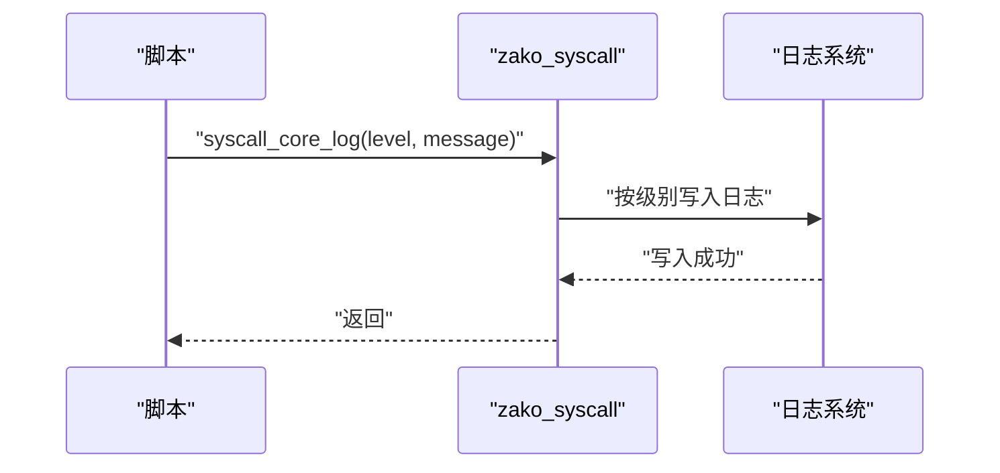

图表来源
- [zako_core/src/builtin/extension/syscall.rs](file://zako_core/src/builtin/extension/syscall.rs#L33-L61)
- [zako_core/src/engine.rs](file://zako_core/src/engine.rs#L200-L232)

章节来源
- [zako_core/src/builtin/extension/syscall.rs](file://zako_core/src/builtin/extension/syscall.rs#L1-L62)
- [zako_core/src/engine.rs](file://zako_core/src/engine.rs#L1-L306)

## 故障排除指南
- 越界访问
  - 现象：抛出“尝试访问沙箱外文件”的错误。
  - 排查：确认referencer与target组合后的规范化路径是否仍以沙箱根为前缀。
  - 参考：Sandbox的越界检测逻辑。
- 符号链接异常
  - 现象：创建VirtualFsItem时报错，提示越界或绝对链接目标。
  - 排查：检查链接目标是否为相对路径且不指向父目录。
  - 参考：VirtualFsItem的创建与校验逻辑。
- 导入类型错误
  - 现象：模块解析时报“File/Builtin/Memory非法组合”。
  - 排查：确认referrer与specifier的模块类型是否符合约束。
  - 参考：ModuleLoader的resolve逻辑。
- 执行异常
  - 现象：模块执行后抛出异常。
  - 排查：查看异常转换后的统一错误类型，结合日志通道定位问题。
  - 参考：引擎的异常捕获与转换逻辑。

章节来源
- [zako_core/src/sandbox.rs](file://zako_core/src/sandbox.rs#L19-L25)
- [zako_core/src/fs.rs](file://zako_core/src/fs.rs#L21-L41)
- [zako_core/src/module_loader/mod.rs](file://zako_core/src/module_loader/mod.rs#L106-L150)
- [zako_core/src/engine.rs](file://zako_core/src/engine.rs#L200-L232)

## 结论
Zako的沙盒执行环境通过“路径与链接校验”“全局API裁剪”“模块类型约束”“上下文类型隔离”与“受控系统调用”等多层设计，构建了较为完整的安全边界。结合资源池与运行时上下文，能够在保障安全性的同时，为用户提供可扩展的执行能力。建议在实际部署中：
- 明确各上下文类型的权限边界，避免过度授权。
- 严格限制模块导入类型，杜绝越界。
- 启用日志通道与可观测性埋点，完善监控与告警。
- 持续优化资源池的调度策略，提升整体吞吐与稳定性。