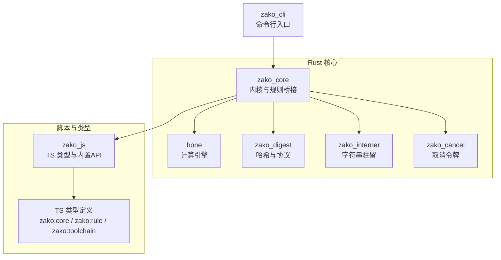
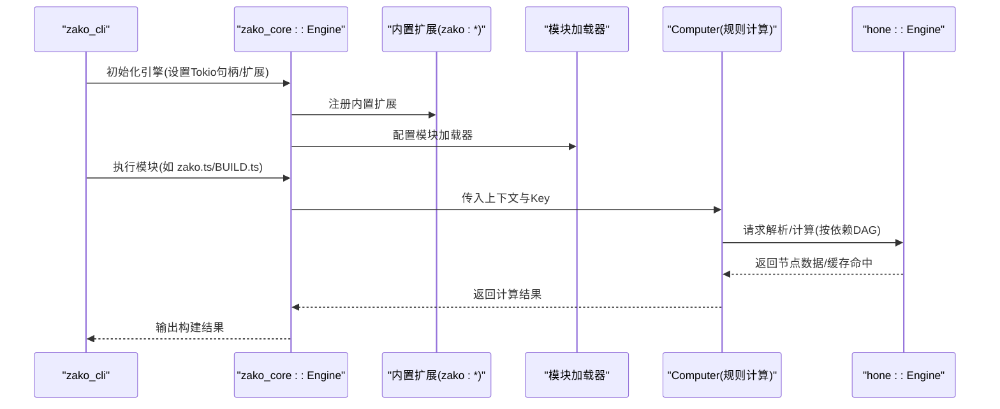
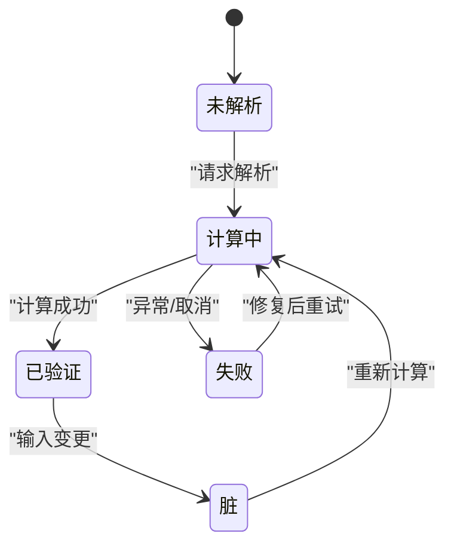
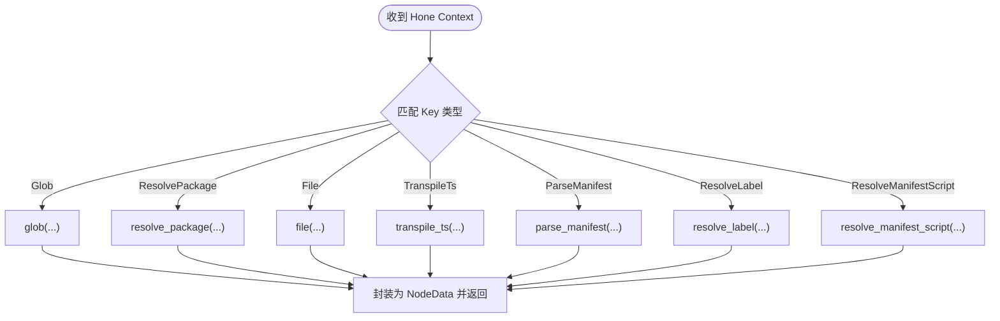
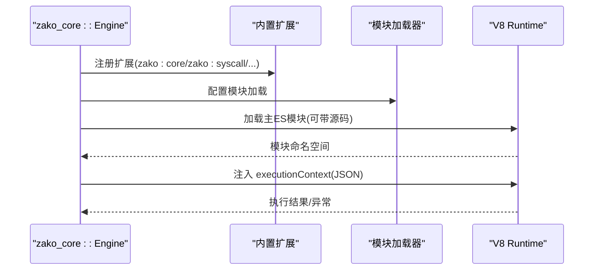
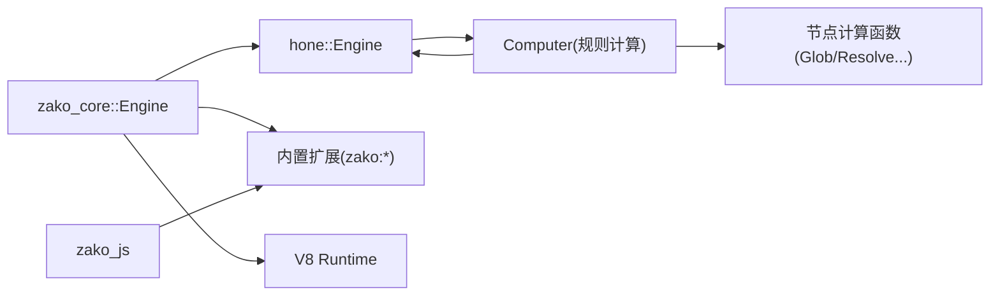

# 构建规则开发

<cite>
**本文引用的文件**
- [README.md](file://README.md)
- [ARCHITECTURE.md](file://ARCHITECTURE.md)
- [zako_core/src/lib.rs](file://zako_core/src/lib.rs)
- [zako_core/src/computer.rs](file://zako_core/src/computer.rs)
- [zako_core/src/engine.rs](file://zako_core/src/engine.rs)
- [zako_core/src/builtin/mod.rs](file://zako_core/src/builtin/mod.rs)
- [zako_core/src/builtin/extension/mod.rs](file://zako_core/src/builtin/extension/mod.rs)
- [zako_core/src/builtin/id/mod.rs](file://zako_core/src/builtin/id/mod.rs)
- [zako_core/src/node/mod.rs](file://zako_core/src/node/mod.rs)
- [hone/src/lib.rs](file://hone/src/lib.rs)
- [hone/src/engine.rs](file://hone/src/engine.rs)
- [zako_js/package.json](file://zako_js/package.json)
- [zako_js/src/builtins/core/index.ts](file://zako_js/src/builtins/core/index.ts)
</cite>

## 目录
1. [简介](#简介)
2. [项目结构](#项目结构)
3. [核心组件](#核心组件)
4. [架构总览](#架构总览)
5. [详细组件分析](#详细组件分析)
6. [依赖关系分析](#依赖关系分析)
7. [性能考量](#性能考量)
8. [故障排查指南](#故障排查指南)
9. [结论](#结论)
10. [附录](#附录)

## 简介
本指南面向规则开发者与工具链维护者，系统讲解 Zako 构建规则的开发原理、内置规则与扩展机制、自定义规则示例与最佳实践，并深入说明规则生命周期、依赖管理、增量构建、错误处理、与 Hone 引擎的集成方式以及性能优化策略。同时提供规则模板、代码生成与自动化工具建议，帮助快速上手并高质量交付规则。

## 项目结构
Zako 采用多 Crate 架构，围绕“Rust 内核 + TypeScript/V8 脚本 + Hone 计算引擎”协同工作：
- zako_core：Rust 内核，负责 V8 运行时管理、模块加载、CAS 存储协议、沙盒执行、项目解析与规则计算桥接。
- hone：通用递归式计算引擎，将构建任务建模为 Key/Value 映射，支持 DAG 依赖、并行与增量计算。
- zako_js：为构建脚本提供的 TypeScript 类型定义与内置 API（如 zako:core、zako:rule、zako:toolchain 等）。
- zako_cli：命令行入口，负责初始化构建环境并触发引擎计算。
- zako_digest、zako_interner、zako_cancel 等：支撑模块（哈希、字符串驻留、取消令牌等）。

图表来源
- [zako_core/src/lib.rs](file://zako_core/src/lib.rs#L1-L119)
- [hone/src/lib.rs](file://hone/src/lib.rs#L1-L34)
- [zako_js/package.json](file://zako_js/package.json#L1-L49)

章节来源
- [ARCHITECTURE.md](file://ARCHITECTURE.md#L16-L27)
- [zako_core/src/lib.rs](file://zako_core/src/lib.rs#L14-L28)

## 核心组件
- 计算模型与调度
  - Hone 引擎将每个构建步骤抽象为 Key 到 Value 的映射，支持并行与记忆化，天然支持增量计算。
  - zako_core 的 Computer 实现根据 Key 分派到具体计算函数（如 Glob、ResolvePackage、File、TranspileTs、ParseManifest、ResolveLabel、ResolveManifestScript）。
- V8 运行时与模块加载
  - zako_core 的 Engine 负责初始化 V8 平台、加载扩展模块（zako:core、zako:console、zako:global、zako:syscall 等），并执行 TypeScript 模块。
- 内置扩展与 ID 空间
  - zako_core/builtin 提供扩展模块目录；zako_core/builtin/id 定义内置 ID 空间（TargetType、Os、Architecture、ToolType、Tool 等）。
- TypeScript 内置 API
  - zako_js 提供 zako:core、zako:rule、zako:toolchain 等命名空间的类型与实现，规则与工具链层通过这些 API 与内核交互。

章节来源
- [ARCHITECTURE.md](file://ARCHITECTURE.md#L30-L54)
- [zako_core/src/computer.rs](file://zako_core/src/computer.rs#L16-L77)
- [zako_core/src/engine.rs](file://zako_core/src/engine.rs#L47-L79)
- [zako_core/src/builtin/extension/mod.rs](file://zako_core/src/builtin/extension/mod.rs#L1-L17)
- [zako_core/src/builtin/id/mod.rs](file://zako_core/src/builtin/id/mod.rs#L1-L50)
- [zako_js/package.json](file://zako_js/package.json#L8-L24)

## 架构总览
下图展示从命令行到规则执行的关键流程：CLI 初始化引擎，引擎加载扩展与模块，Computer 根据 Key 分派计算，Hone 引擎管理依赖与增量，最终产出构建结果。

图表来源
- [zako_core/src/engine.rs](file://zako_core/src/engine.rs#L47-L79)
- [zako_core/src/computer.rs](file://zako_core/src/computer.rs#L24-L77)
- [hone/src/engine.rs](file://hone/src/engine.rs#L536-L554)

## 详细组件分析

### Hone 引擎：增量与并行
- 关键能力
  - 依赖图管理：通过父子节点注册与查询，形成 DAG。
  - 并发解析：使用 buffer_unordered 控制并发度，支持 keep_going 模式收集多个错误。
  - 增量与记忆化：通过状态机（Verified/Computing/Dirty/Failed/Unreachable）避免重复计算；未来规划持久化与负缓存。
  - 取消与超时：通过 CancelToken 在任意阶段中断。
- 生命周期
  - Unresolved → Computing：首次计算或 Dirty 触发。
  - Computing → Verified/Failed：计算成功或失败。
  - Verified → Dirty：输入变更导致失效。
  - Dirty → Computing：重新计算。
- 错误处理
  - 圆环检测、Fail-Fast 与 keep_going 收集错误。
  - 数据库读写错误、表错误、提交错误等统一包装为 EngineError。

图表来源
- [hone/src/engine.rs](file://hone/src/engine.rs#L32-L38)
- [hone/src/engine.rs](file://hone/src/engine.rs#L313-L409)

章节来源
- [hone/src/engine.rs](file://hone/src/engine.rs#L16-L31)
- [hone/src/engine.rs](file://hone/src/engine.rs#L411-L554)

### zako_core::Computer：规则计算分派
- 职责
  - 将 Hone 上下文中的 Key 映射到具体计算函数，返回 NodeData（含输入/输出哈希与值）。
- 关键计算
  - Glob/ResolvePackage/File/TranspileTs/ParseManifest/ResolveLabel/ResolveManifestScript 等。
- 并发与日志
  - 使用 Instrument/trace_span 对计算过程采样与追踪，便于调试。

图表来源
- [zako_core/src/computer.rs](file://zako_core/src/computer.rs#L24-L77)

章节来源
- [zako_core/src/computer.rs](file://zako_core/src/computer.rs#L16-L77)

### V8 引擎与模块加载：确定性与权限
- 初始化
  - 设置 V8 平台，注册内置扩展（zako:core、zako:console、zako:global、zako:syscall、zako:semver 等）。
- 执行模型
  - 支持模块加载、事件循环、JSON 输入注入到 executionContext，以及执行后回调。
- 权限与分层
  - zako.ts（定义层）仅能访问 zako:project；BUILD.ts（逻辑层）禁止 IO；*.toolchain.ts（工具链层）唯一允许受控 IO。
- 确定性
  - 禁用非确定性 API，隔离 Isolate，分层权限控制。

图表来源
- [zako_core/src/engine.rs](file://zako_core/src/engine.rs#L47-L79)
- [zako_core/src/engine.rs](file://zako_core/src/engine.rs#L81-L166)
- [zako_core/src/engine.rs](file://zako_core/src/engine.rs#L168-L304)

章节来源
- [ARCHITECTURE.md](file://ARCHITECTURE.md#L44-L54)
- [zako_core/src/engine.rs](file://zako_core/src/engine.rs#L47-L79)

### 内置扩展与 ID 空间
- 扩展模块
  - zako_core/builtin/extension 下提供 config、console、context、core、global、package、rt、semver、syscall 等扩展，分别对应 zako:* 命名空间。
- ID 空间
  - zako_core/builtin/id 定义 TargetType、Os、Architecture、ToolType、Tool 等枚举 ID，统一规则与工具链标识。

章节来源
- [zako_core/src/builtin/extension/mod.rs](file://zako_core/src/builtin/extension/mod.rs#L1-L17)
- [zako_core/src/builtin/id/mod.rs](file://zako_core/src/builtin/id/mod.rs#L1-L50)

### TypeScript 内置 API（zako:core）
- 版本与范围校验、日志接口、模式拼接、可见性与传递级别等类型与工具函数。
- 通过 zako:semver 与 zako:syscall 提供版本解析与系统调用能力。

章节来源
- [zako_js/src/builtins/core/index.ts](file://zako_js/src/builtins/core/index.ts#L1-L176)
- [zako_js/package.json](file://zako_js/package.json#L12-L24)

## 依赖关系分析
- 组件耦合
  - zako_core 依赖 hone 进行增量计算，依赖内置扩展提供 API，依赖 V8 执行脚本。
  - zako_js 为脚本层提供类型与 API，与 zako_core 通过扩展与模块加载器解耦。
- 外部依赖
  - redb 用于状态持久化（当前注释掉，保留接口）。
  - dashmap、futures、im 等用于并发与数据结构。
- 接口契约
  - Computer trait 定义 compute 方法，Hone Engine 通过 Context 传递依赖与上下文。

图表来源
- [hone/src/engine.rs](file://hone/src/engine.rs#L32-L38)
- [zako_core/src/computer.rs](file://zako_core/src/computer.rs#L19-L21)
- [zako_core/src/engine.rs](file://zako_core/src/engine.rs#L47-L79)

章节来源
- [hone/src/lib.rs](file://hone/src/lib.rs#L1-L34)
- [zako_core/src/lib.rs](file://zako_core/src/lib.rs#L1-L119)

## 性能考量
- 并发与缓冲
  - 使用 buffer_unordered 控制子任务并发度，避免过度竞争；keep_going 模式可收集全部错误提升诊断效率。
- 增量与缓存
  - 通过状态机与输入/输出哈希实现增量；未来可启用持久化与负缓存，减少冷启动成本。
- I/O 与 V8
  - 限制非确定性 API，隔离 Isolate，避免跨任务共享可变状态；对工具链层 I/O 进行最小化与受控访问。
- 调试与观测
  - 使用 trace_span/instrument 对关键路径采样，结合日志接口定位瓶颈。

[本节为通用性能建议，无需特定文件分析]

## 故障排查指南
- 常见错误类型
  - 圆环依赖：Hone 引擎检测到循环并返回 CycleDetected。
  - 取消：CancelToken 触发时返回 Canceled。
  - 数据库错误：TransactionError/TableError/CommitError/StorageError。
  - V8 执行异常：EngineError::V8Error 包装异常对象。
- 定位与恢复
  - 使用日志接口（trace/debug/info/warn/error）输出上下文信息。
  - 在规则中捕获异常并转换为 ZakoRuntimeError，便于统一上报。
  - 对工具链层 I/O 进行最小化与幂等化，避免副作用影响确定性。

章节来源
- [hone/src/engine.rs](file://hone/src/engine.rs#L16-L31)
- [zako_core/src/engine.rs](file://zako_core/src/engine.rs#L24-L31)
- [zako_js/src/builtins/core/index.ts](file://zako_js/src/builtins/core/index.ts#L6-L11)

## 结论
Zako 通过“Rust 内核 + TypeScript/V8 脚本 + Hone 引擎”的组合，提供了高确定性、强扩展性的现代构建系统。规则开发者应遵循分层权限、最小化 I/O、明确依赖与增量语义，配合 Hone 的并行与记忆化能力，实现高性能与可维护的规则体系。

[本节为总结，无需特定文件分析]

## 附录

### 规则开发最佳实践
- 明确输入/输出
  - 以文件集合与配置为输入，输出产物清单与元数据，确保可哈希与可缓存。
- 依赖声明
  - 使用 Hone 依赖图清晰声明父子节点，避免隐式耦合。
- 错误处理
  - 使用 ZakoRuntimeError 包装业务错误，便于统一诊断。
- 并发与幂等
  - 规则计算应幂等，避免副作用；必要时在工具链层进行受控 I/O。
- 测试与调试
  - 通过日志接口输出关键变量；对复杂流程绘制流程图辅助定位。

章节来源
- [zako_js/src/builtins/core/index.ts](file://zako_js/src/builtins/core/index.ts#L121-L135)
- [zako_core/src/engine.rs](file://zako_core/src/engine.rs#L81-L166)

### 自定义规则示例与模板
- 规则文件（*.rule.ts）
  - 仅导入库文件、core 内置模块与 zako:rule，接收源文件集合与配置，转换为工具链输入。
- 工具链文件（*.toolchain.ts）
  - 仅导入库文件、core 内置模块与 zako:toolchain，唯一允许受控 I/O，执行系统命令或文件操作。
- 项目与目标（zako.ts / BUILD.ts）
  - zako.ts 定义项目元数据与配置；BUILD.ts 使用规则创建目标并声明依赖。

章节来源
- [zako_core/src/lib.rs](file://zako_core/src/lib.rs#L14-L28)

### 与 Hone 引擎的集成要点
- Key/Value 设计
  - 将规则的输入参数与配置编码为 Key，输出产物与元数据编码为 Value。
- 依赖注册
  - 在 compute 中显式注册父/子节点，确保 DAG 正确。
- 增量策略
  - 依据输入哈希判断是否 Dirty，避免重复计算。

章节来源
- [zako_core/src/computer.rs](file://zako_core/src/computer.rs#L24-L77)
- [hone/src/engine.rs](file://hone/src/engine.rs#L194-L210)

### 性能优化策略
- 并发控制
  - 合理设置 buffered_count，避免过多并发导致资源争用。
- I/O 优化
  - 将昂贵 I/O 放在工具链层，尽量复用中间产物。
- 日志与采样
  - 使用 trace_span/instrument 对热点路径采样，定位瓶颈。

章节来源
- [hone/src/engine.rs](file://hone/src/engine.rs#L444-L484)
- [zako_core/src/engine.rs](file://zako_core/src/engine.rs#L81-L166)

### 规则模板与自动化工具
- 规则模板
  - 以“输入参数 + 配置 → 产物清单 + 元数据”的形式组织，确保可测试与可缓存。
- 代码生成
  - 可基于 zako_core/builtin/id 的 ID 空间生成类型导出与规则样板。
- 类型与绑定
  - 通过 zako_js 的 d.ts 与构建脚本生成类型声明，保持 TypeScript 与 JS 层一致性。

章节来源
- [zako_core/src/builtin/id/mod.rs](file://zako_core/src/builtin/id/mod.rs#L44-L50)
- [zako_js/package.json](file://zako_js/package.json#L39-L46)